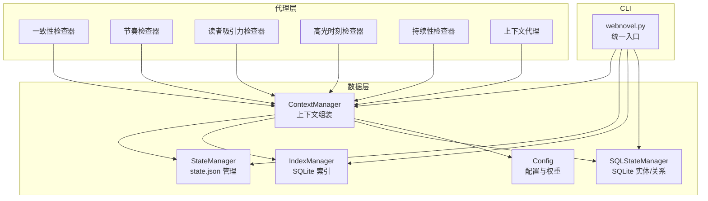
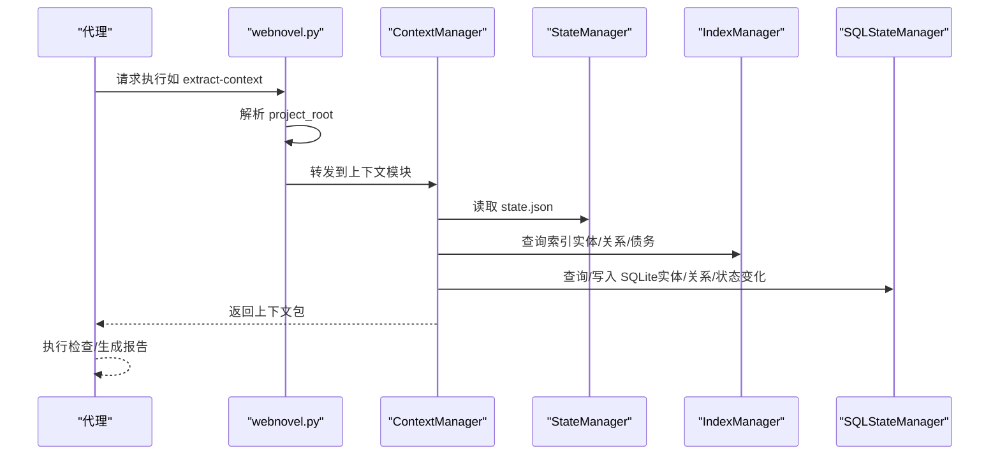
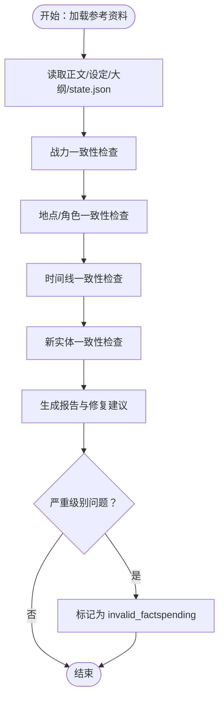
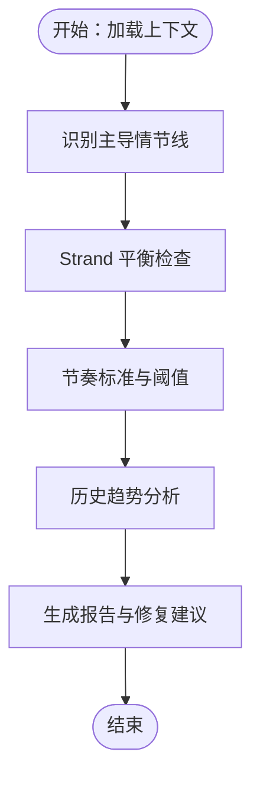
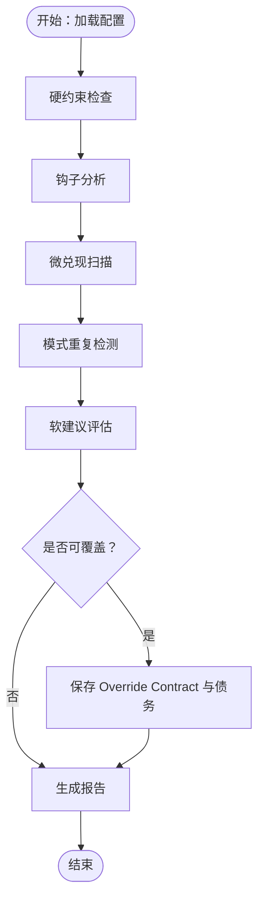
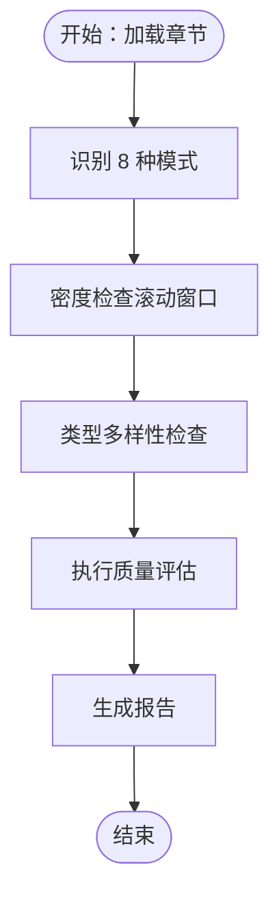
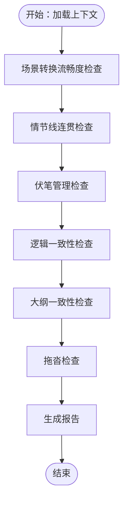
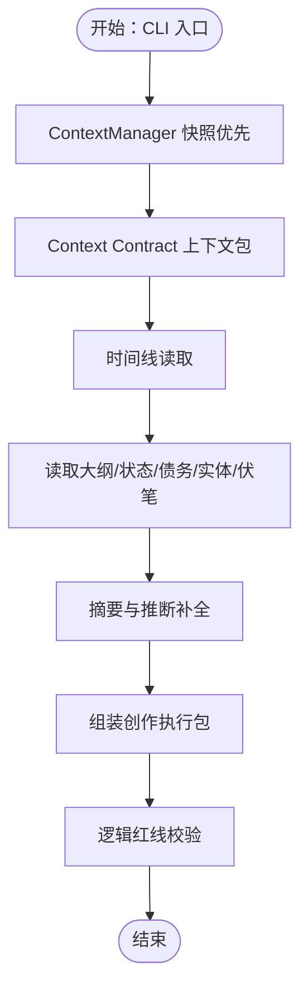
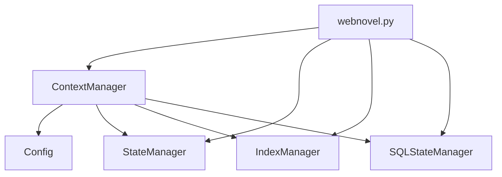

# AI代理系统

<cite>
**本文引用的文件**
- [consistency-checker.md](file://webnovel-writer/agents/consistency-checker.md)
- [context-agent.md](file://webnovel-writer/agents/context-agent.md)
- [continuity-checker.md](file://webnovel-writer/agents/continuity-checker.md)
- [high-point-checker.md](file://webnovel-writer/agents/high-point-checker.md)
- [pacing-checker.md](file://webnovel-writer/agents/pacing-checker.md)
- [reader-pull-checker.md](file://webnovel-writer/agents/reader-pull-checker.md)
- [checker-output-schema.md](file://webnovel-writer/references/checker-output-schema.md)
- [context-manager.py](file://webnovel-writer/scripts/data_modules/context_manager.py)
- [state-manager.py](file://webnovel-writer/scripts/data_modules/state_manager.py)
- [index-manager.py](file://webnovel-writer/scripts/data_modules/index-manager.py)
- [sql-state-manager.py](file://webnovel-writer/scripts/data_modules/sql_state_manager.py)
- [webnovel.py](file://webnovel-writer/scripts/webnovel.py)
- [config.py](file://webnovel-writer/scripts/data_modules/config.py)
- [project-memory-schema.md](file://webnovel-writer/references/project-memory-schema.md)
</cite>

## 目录
1. [简介](#简介)
2. [项目结构](#项目结构)
3. [核心组件](#核心组件)
4. [架构总览](#架构总览)
5. [详细组件分析](#详细组件分析)
6. [依赖分析](#依赖分析)
7. [性能考虑](#性能考虑)
8. [故障排查指南](#故障排查指南)
9. [结论](#结论)
10. [附录](#附录)

## 简介
本技术文档围绕 Webnovel Writer 的 AI 代理系统，系统性阐述六个智能代理的职责边界、工作原理、协作机制与质量评估方法。六大代理分别为：一致性检查器、节奏检查器、读者吸引力检查器、高光时刻检查器、持续性检查器与上下文代理。文档同时给出代理间通信协议、任务分配与结果整合流程、配置选项、性能优化策略与故障诊断方法，并提供实际使用案例与效果对比，帮助开发者高效理解并落地 AI 代理在写作质量保障中的作用。

## 项目结构
Webnovel Writer 将“智能代理”与“数据模块”解耦：代理以“技能/工作流”的形式存在，通过统一 CLI 调用数据模块（Context、State、Index、SQL State 等）完成上下文组装、状态读写与持久化。核心结构如下：
- agents 目录：各代理的职责说明与执行流程规范
- scripts/data_modules：数据访问与状态管理模块
- references：统一输出格式、项目记忆等参考规范
- scripts/webnovel.py：统一入口 CLI，负责解析项目根目录并转发到具体模块

**图表来源**
- [context-manager.py:50-131](file://webnovel-writer/scripts/data_modules/context_manager.py#L50-L131)
- [state-manager.py:90-140](file://webnovel-writer/scripts/data_modules/state_manager.py#L90-L140)
- [index-manager.py:228-234](file://webnovel-writer/scripts/data_modules/index_manager.py#L228-L234)
- [sql-state-manager.py:46-99](file://webnovel-writer/scripts/data_modules/sql_state_manager.py#L46-L99)
- [webnovel.py:189-307](file://webnovel-writer/scripts/webnovel.py#L189-L307)
- [config.py:90-343](file://webnovel-writer/scripts/data_modules/config.py#L90-L343)

**章节来源**
- [context-manager.py:50-131](file://webnovel-writer/scripts/data_modules/context_manager.py#L50-L131)
- [webnovel.py:189-307](file://webnovel-writer/scripts/webnovel.py#L189-L307)

## 核心组件
六大智能代理均遵循统一输出格式，采用结构化 JSON Schema，便于自动化汇总与趋势分析。各代理在执行过程中依赖 ContextManager 生成的上下文包，结合 SQLite 索引与 state.json 状态进行一致性与质量检查。

- 一致性检查器：聚焦设定一致性、战力/地点/角色/时间线一致性与新实体冲突，输出严重级别与修复建议。
- 节奏检查器：基于 Strand Weave 模型进行情节线分布与平衡检查，提供修复建议与下一章节奏建议。
- 读者吸引力检查器：评估钩子/微兑现/约束分层，支持 Override Contract 与债务管理。
- 高光时刻检查器：识别装逼打脸、扮猪吃虎、越级反杀、打脸权威、反派翻车、甜蜜超预期、迪化误解、身份掉马等模式，进行密度与多样性评估。
- 持续性检查器：检查场景转换、情节线连贯、伏笔管理、逻辑一致性与大纲一致性，识别拖沓并提出修复建议。
- 上下文代理：生成“创作执行包”，包含任务书八板块、Context Contract 与直写提示词，确保 Step 2A 可直接开写。

**章节来源**
- [consistency-checker.md:8-229](file://webnovel-writer/agents/consistency-checker.md#L8-L229)
- [pacing-checker.md:8-216](file://webnovel-writer/agents/pacing-checker.md#L8-L216)
- [reader-pull-checker.md:8-318](file://webnovel-writer/agents/reader-pull-checker.md#L8-L318)
- [high-point-checker.md:8-218](file://webnovel-writer/agents/high-point-checker.md#L8-L218)
- [continuity-checker.md:8-251](file://webnovel-writer/agents/continuity-checker.md#L8-L251)
- [context-agent.md:8-269](file://webnovel-writer/agents/context-agent.md#L8-L269)
- [checker-output-schema.md:10-169](file://webnovel-writer/references/checker-output-schema.md#L10-L169)

## 架构总览
六大代理通过统一 CLI 与数据模块协作，形成“上下文装配—状态读取—质量检查—结果汇总”的闭环。ContextManager 负责按模板权重组装上下文，StateManager/IndexManager/SQLStateManager 提供状态与索引查询，webnovel.py 统一入口确保 project_root 解析与参数规范化。

**图表来源**
- [webnovel.py:252-307](file://webnovel-writer/scripts/webnovel.py#L252-L307)
- [context-manager.py:727-778](file://webnovel-writer/scripts/data_modules/context_manager.py#L727-L778)
- [state-manager.py:200-350](file://webnovel-writer/scripts/data_modules/state_manager.py#L200-L350)
- [index-manager.py:228-234](file://webnovel-writer/scripts/data_modules/index_manager.py#L228-L234)
- [sql-state-manager.py:46-99](file://webnovel-writer/scripts/data_modules/sql_state_manager.py#L46-L99)

## 详细组件分析

### 一致性检查器
- 职责：设定一致性守卫者，执行“第二防幻觉定律（设定即物理）”，确保战力、地点/角色、时间线与新实体符合既定设定。
- 输入：单章或章节区间、项目根目录、存储路径、state.json、设定集、大纲、正文章节。
- 执行流程：
  1) 加载参考资料（正文、state.json、设定集、大纲）
  2) 三层一致性检查：战力一致性、地点/角色一致性、时间线一致性
  3) 实体一致性检查（新实体与世界设定的冲突）
  4) 生成结构化报告（Markdown/JSON），包含结论、修复建议与综合评分
  5) 对严重级别问题自动标记为 invalid_facts（pending 状态）
- 输出格式：遵循统一 JSON Schema，包含 agent、chapter、overall_score、issues、metrics、summary。
- 成功标准：无严重违规、时间线问题必须修复、新实体与设定一致、报告提供具体修复建议。

**图表来源**
- [consistency-checker.md:20-229](file://webnovel-writer/agents/consistency-checker.md#L20-L229)
- [checker-output-schema.md:10-50](file://webnovel-writer/references/checker-output-schema.md#L10-L50)

**章节来源**
- [consistency-checker.md:8-229](file://webnovel-writer/agents/consistency-checker.md#L8-L229)
- [checker-output-schema.md:90-100](file://webnovel-writer/references/checker-output-schema.md#L90-L100)

### 节奏检查器
- 职责：节奏分析师，执行 Strand Weave 平衡检查，防止读者疲劳。
- 输入：单章或章节区间、项目根目录、存储路径、state.json（strand_tracker）、大纲。
- 执行流程：
  1) 加载上下文（正文、state.json、大纲）
  2) 章节情节线分类（Quest/Fire/Constellation）
  3) 平衡检查（Quest 过载、Fire 干旱、Constellation 缺席）
  4) 节奏标准与历史趋势分析
  5) 生成报告（包含主导线、平衡状态、修复建议、下一章节奏建议）
- 输出格式：统一 JSON Schema，包含 dominant_strand、quest_ratio、fire_ratio、constellation_ratio、consecutive_quest、gap、fatigue_risk 等 metrics。
- 成功标准：最近 10 章内单一情节线不超过 70%，所有情节线在阈值内至少出现一次，提供下一章建议。

**图表来源**
- [pacing-checker.md:46-142](file://webnovel-writer/agents/pacing-checker.md#L46-L142)
- [checker-output-schema.md:129-143](file://webnovel-writer/references/checker-output-schema.md#L129-L143)

**章节来源**
- [pacing-checker.md:8-216](file://webnovel-writer/agents/pacing-checker.md#L8-L216)
- [checker-output-schema.md:129-143](file://webnovel-writer/references/checker-output-schema.md#L129-L143)

### 读者吸引力检查器
- 职责：审查“读者为什么会点下一章”，执行 Hard/Soft 约束分层。
- 输入：章节正文、上章钩子与模式、题材 Profile、是否为过渡章标记。
- 执行流程：
  1) 加载配置（题材 Profile、上章钩子、当前债务）
  2) 硬约束检查（可读性底线、承诺违背、节奏灾难、冲突真空）
  3) 钩子分析（类型、强度、有效性）
  4) 微兑现扫描（信息/关系/能力/资源/认可/情绪/线索）
  5) 模式重复检测（钩子/开头/爽点）
  6) 软建议评估与 Override Contract 机制
  7) 生成报告（包含 hard_violations、soft_suggestions、metrics、summary）
- 输出格式：统一 JSON Schema，包含 hook_present、hook_type、hook_strength、micropayoff_count、is_transition、debt_balance 等 metrics。
- 成功标准：无硬约束违规；软评分 ≥ 70（或有有效 Override）；存在可感知的未闭合问题/期待锚点；微兑现达标；无连续 3 章以上同型。

**图表来源**
- [reader-pull-checker.md:216-318](file://webnovel-writer/agents/reader-pull-checker.md#L216-L318)
- [checker-output-schema.md:61-75](file://webnovel-writer/references/checker-output-schema.md#L61-L75)

**章节来源**
- [reader-pull-checker.md:8-318](file://webnovel-writer/agents/reader-pull-checker.md#L8-L318)
- [checker-output-schema.md:61-75](file://webnovel-writer/references/checker-output-schema.md#L61-L75)

### 高光时刻检查器
- 职责：读者满足感机制的质量保障专家（爽点设计）。
- 输入：单章或章节区间、正文目录。
- 执行流程：
  1) 加载目标章节
  2) 识别 8 种标准执行模式（装逼打脸、扮猪吃虎、越级反杀、打脸权威、反派翻车、甜蜜超预期、迪化误解、身份掉马）
  3) 密度检查（滚动窗口）
  4) 类型多样性检查（单一类型不超过 80%）
  5) 执行质量评估（铺垫、反转、情绪回报、30/40/30 结构、压扬比例）
  6) 生成报告（包含 density_score、type_diversity、milestone_present、metrics、summary）
- 输出格式：统一 JSON Schema，包含 cool_point_count、cool_point_types、density_score、type_diversity、milestone_present 等 metrics。
- 成功标准：滚动窗口密度健康、类型分布多样化、平均质量评级 ≥ B、迪化误解与身份掉马具备合理性与铺垫。

**图表来源**
- [high-point-checker.md:25-197](file://webnovel-writer/agents/high-point-checker.md#L25-L197)
- [checker-output-schema.md:77-88](file://webnovel-writer/references/checker-output-schema.md#L77-L88)

**章节来源**
- [high-point-checker.md:8-218](file://webnovel-writer/agents/high-point-checker.md#L8-L218)
- [checker-output-schema.md:77-88](file://webnovel-writer/references/checker-output-schema.md#L77-L88)

### 持续性检查器
- 职责：叙事流守卫者，确保场景过渡顺畅、情节线连贯、逻辑一致。
- 输入：单章或章节区间、项目根目录、存储路径、state.json、大纲。
- 执行流程：
  1) 加载上下文（正文、前 2-3 章、大纲、state.json）
  2) 四层连贯性检查：场景转换、情节线连贯、伏笔管理、逻辑流畅性
  3) 大纲一致性检查（偏差标记与处理）
  4) 拖沓检查（识别拖沓段落）
  5) 生成报告（包含场景转换评分、活跃/休眠/遗忘情节线、伏笔健康度、逻辑漏洞、大纲偏差、修复建议）
- 输出格式：统一 JSON Schema，包含 transition_grade、active_threads、dormant_threads、forgotten_foreshadowing、logic_holes、outline_deviations 等 metrics。
- 成功标准：所有场景转换评级 ≥ B、无活跃情节线遗忘超过 15 章、所有长期伏笔已追踪并有兑现计划、0 个重大逻辑漏洞、大纲偏差已正确标记。

**图表来源**
- [continuity-checker.md:42-250](file://webnovel-writer/agents/continuity-checker.md#L42-L250)
- [checker-output-schema.md:115-127](file://webnovel-writer/references/checker-output-schema.md#L115-L127)

**章节来源**
- [continuity-checker.md:8-251](file://webnovel-writer/agents/continuity-checker.md#L8-L251)
- [checker-output-schema.md:115-127](file://webnovel-writer/references/checker-output-schema.md#L115-L127)

### 上下文代理
- 职责：创作执行包生成器，目标是“能直接开写”，按需召回 + 推断补全。
- 输入：章节号、项目根目录、存储路径、state.json。
- 执行流程：
  1) CLI 入口与脚本目录校验
  2) ContextManager 快照优先
  3) Context Contract 上下文包（内置）
  4) 时间线读取（卷信息、时间锚点、跨度、过渡要求、倒计时状态）
  5) 读取大纲与状态、追读力与债务、实体与最近出场、伏笔读取
  6) 摘要与推断补全（动机、情绪底色、可用能力）
  7) 组装创作执行包（任务书八板块 + Context Contract + 直写提示词）
  8) 逻辑红线校验（不可变事实冲突、时空跳跃、能力/信息无因果、角色动机断裂、合同与任务书冲突、时间逻辑错误）
- 输出：单一执行包，包含任务书八板块、Context Contract、直写提示词，确保 Step 2A 直写。
- 成功标准：任务书包含 8 个板块（含时间约束）、上章钩子与读者期待明确、角色动机/情绪为推断结果、最近模式已对比、章末钩子建议类型明确、反派层级注明、伏笔优先级清单、Context Contract 字段完整、逻辑红线校验通过、时间约束完整且时间逻辑红线通过。

**图表来源**
- [context-agent.md:101-269](file://webnovel-writer/agents/context-agent.md#L101-L269)

**章节来源**
- [context-agent.md:8-269](file://webnovel-writer/agents/context-agent.md#L8-L269)

## 依赖分析
六大代理依赖统一的数据模块与 CLI 入口，形成稳定的依赖关系：
- webnovel.py：统一入口，负责 project_root 解析与命令转发
- ContextManager：上下文组装与权重控制
- StateManager/IndexManager/SQLStateManager：状态与索引读写
- Config：上下文模板权重、动态预算、查询限制等配置
- IndexManager：新增 invalid_facts 表、override_contracts 表、chase_debt 表、chapter_reading_power 表等

**图表来源**
- [webnovel.py:252-307](file://webnovel-writer/scripts/webnovel.py#L252-L307)
- [context-manager.py:50-131](file://webnovel-writer/scripts/data_modules/context_manager.py#L50-L131)
- [config.py:90-343](file://webnovel-writer/scripts/data_modules/config.py#L90-L343)
- [index-manager.py:228-234](file://webnovel-writer/scripts/data_modules/index_manager.py#L228-L234)
- [sql-state-manager.py:46-99](file://webnovel-writer/scripts/data_modules/sql_state_manager.py#L46-L99)

**章节来源**
- [webnovel.py:189-307](file://webnovel-writer/scripts/webnovel.py#L189-L307)
- [context-manager.py:50-131](file://webnovel-writer/scripts/data_modules/context_manager.py#L50-L131)
- [config.py:90-343](file://webnovel-writer/scripts/data_modules/config.py#L90-L343)
- [index-manager.py:228-234](file://webnovel-writer/scripts/data_modules/index_manager.py#L228-L234)
- [sql-state-manager.py:46-99](file://webnovel-writer/scripts/data_modules/sql_state_manager.py#L46-L99)

## 性能考虑
- 上下文模板权重与动态预算：ContextManager 支持按章节阶段（早期/中期/晚期）动态调整模板权重，避免一次性加载过多内容导致性能下降。
- SQLite-first 状态管理：v5.1+ 将大数据字段迁移至 SQLite，state.json 仅保留精简数据，显著降低 I/O 压力与锁竞争。
- 并发与超时：配置支持 Embedding/Rerank 并发与超时重试，减少外部服务波动对整体性能的影响。
- 压缩文本与预算控制：ContextManager 支持文本压缩与预算控制，避免超长上下文导致内存与传输压力。
- 查询限制：提供查询默认限制（如最近章节、场景、实体出场等），防止大规模扫描造成性能问题。

**章节来源**
- [context-manager.py:517-542](file://webnovel-writer/scripts/data_modules/context_manager.py#L517-L542)
- [config.py:144-175](file://webnovel-writer/scripts/data_modules/config.py#L144-L175)
- [state-manager.py:371-407](file://webnovel-writer/scripts/data_modules/state_manager.py#L371-L407)

## 故障排查指南
- 项目根目录解析失败：使用 webnovel.py 的 where/preflight 命令确认 project_root 与脚本目录是否正确。
- CLI 参数顺序问题：统一通过 webnovel.py 转发，避免 PYTHONPATH/cd/参数顺序导致的隐性失败。
- SQLite 同步失败：StateManager 在写入 state.json 时同步到 SQLite，失败时会保留 pending 数据并记录警告，需检查数据库连接与权限。
- 上下文快照不兼容：ContextManager 支持快照版本兼容判断，不兼容时自动重建上下文包。
- 追读力债务与 Override Contract：读者吸引力检查器支持 Override Contract 与债务管理，若出现债务累积与利息，需在下一章补偿或确认。

**章节来源**
- [webnovel.py:103-154](file://webnovel-writer/scripts/webnovel.py#L103-L154)
- [state-manager.py:371-367](file://webnovel-writer/scripts/data_modules/state_manager.py#L371-L367)
- [context-manager.py:83-98](file://webnovel-writer/scripts/data_modules/context_manager.py#L83-L98)
- [index-manager.py:415-414](file://webnovel-writer/scripts/data_modules/index_manager.py#L415-L414)

## 结论
Webnovel Writer 的 AI 代理系统通过六大代理与统一 CLI、数据模块的协同，构建了从上下文装配到质量检查再到结果汇总的完整流水线。代理遵循统一输出格式，具备明确的成功标准与修复建议，结合 SQLite-first 的状态管理与动态上下文权重，既能保证质量，又能兼顾性能与可维护性。开发者可据此快速集成与扩展，持续提升写作质量保障水平。

## 附录
- 代理配置选项与权重：通过 Config 中的上下文模板权重、动态预算、查询限制等参数进行调节。
- 项目记忆：project_memory.json 用于保存长期可复用的写作模式，辅助上下文与写作指导。
- 统一输出格式：所有审查 Agent 遵循 checker-output-schema.md 的 JSON Schema，便于自动化汇总与趋势分析。

**章节来源**
- [config.py:239-258](file://webnovel-writer/scripts/data_modules/config.py#L239-L258)
- [project-memory-schema.md:1-26](file://webnovel-writer/references/project-memory-schema.md#L1-L26)
- [checker-output-schema.md:10-50](file://webnovel-writer/references/checker-output-schema.md#L10-L50)