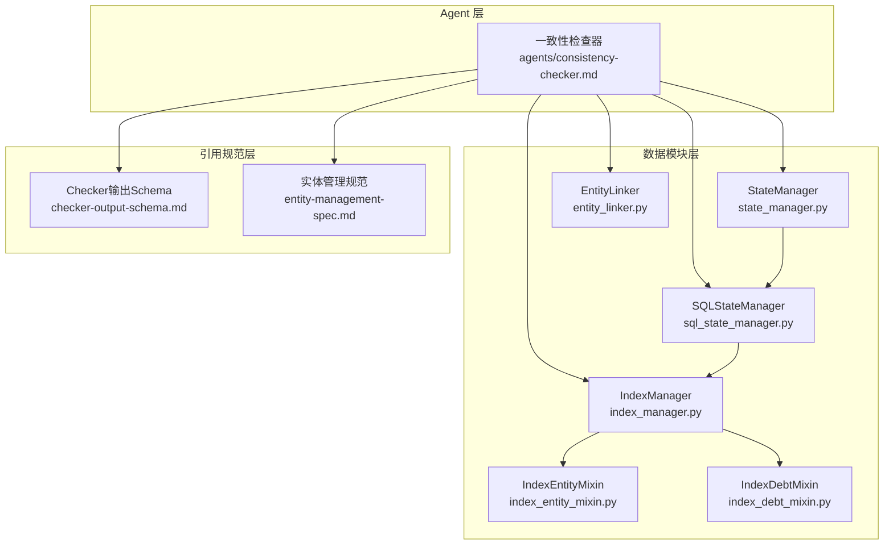
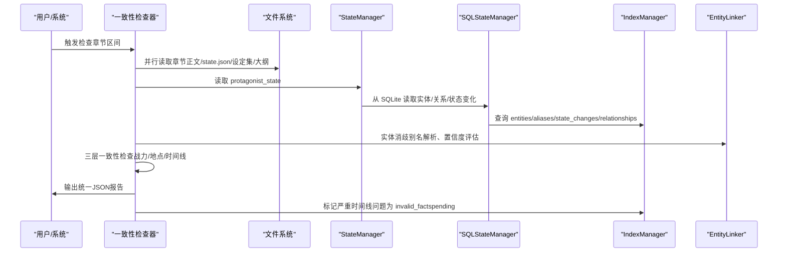
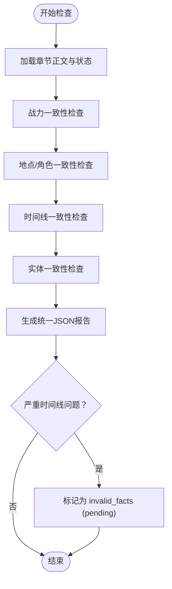
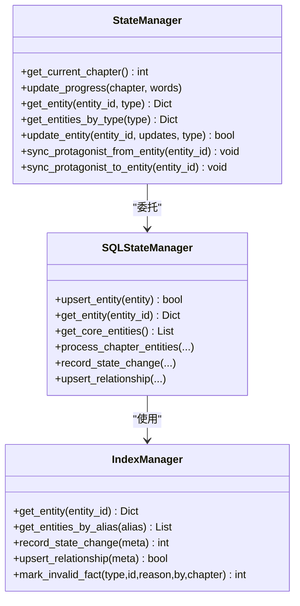
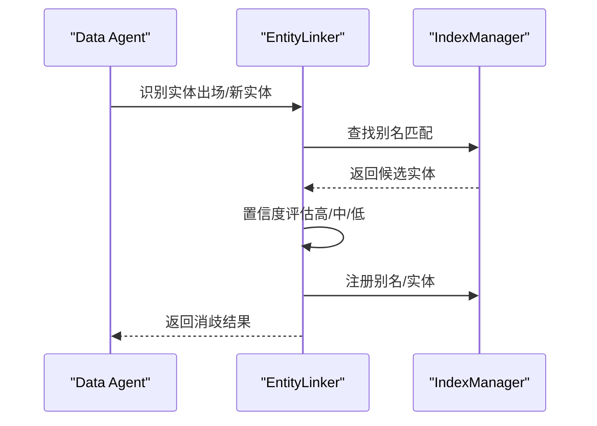
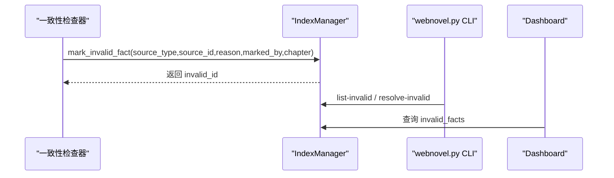
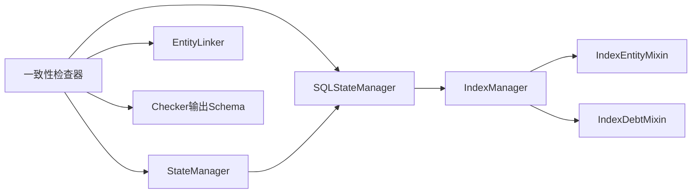

# 一致性检查器

<cite>
**本文档引用的文件**
- [consistency-checker.md](file://webnovel-writer/agents/consistency-checker.md)
- [checker-output-schema.md](file://webnovel-writer/references/checker-output-schema.md)
- [entity-linker.py](file://webnovel-writer/scripts/data_modules/entity_linker.py)
- [state_manager.py](file://webnovel-writer/scripts/data_modules/state_manager.py)
- [sql_state_manager.py](file://webnovel-writer/scripts/data_modules/sql_state_manager.py)
- [index_manager.py](file://webnovel-writer/scripts/data_modules/index_manager.py)
- [index_entity_mixin.py](file://webnovel-writer/scripts/data_modules/index_entity_mixin.py)
- [index_debt_mixin.py](file://webnovel-writer/scripts/data_modules/index_debt_mixin.py)
- [entity-management-spec.md](file://webnovel-writer/references/entity-management-spec.md)
- [init_project.py](file://webnovel-writer/scripts/init_project.py)
- [update_state.py](file://webnovel-writer/scripts/update_state.py)
- [webnovel.py](file://webnovel-writer/scripts/webnovel.py)
</cite>

## 目录
1. [简介](#简介)
2. [项目结构](#项目结构)
3. [核心组件](#核心组件)
4. [架构总览](#架构总览)
5. [详细组件分析](#详细组件分析)
6. [依赖关系分析](#依赖关系分析)
7. [性能考量](#性能考量)
8. [故障排查指南](#故障排查指南)
9. [结论](#结论)
10. [附录](#附录)

## 简介
一致性检查器是写作流程中的“设定守卫者”，负责执行“第二防幻觉定律（设定即物理）”。其核心职责是：
- 三层一致性检查：战力一致性、地点/角色一致性、时间线一致性
- 基于统一输出Schema的结构化报告
- 与状态管理、实体链接、无效事实标记等基础设施深度集成
- 为润色阶段提供可执行的修复建议

## 项目结构
一致性检查器位于 agents 目录，配合数据模块（state_manager、sql_state_manager、index_manager）与实体链接模块协同工作，形成“读取-检查-报告-标记”的闭环。

**图表来源**
- [consistency-checker.md:1-229](file://webnovel-writer/agents/consistency-checker.md#L1-L229)
- [state_manager.py:90-140](file://webnovel-writer/scripts/data_modules/state_manager.py#L90-L140)
- [sql_state_manager.py:46-100](file://webnovel-writer/scripts/data_modules/sql_state_manager.py#L46-L100)
- [index_manager.py:228-234](file://webnovel-writer/scripts/data_modules/index_manager.py#L228-L234)
- [entity-linker.py:36-42](file://webnovel-writer/scripts/data_modules/entity_linker.py#L36-L42)
- [checker-output-schema.md:10-32](file://webnovel-writer/references/checker-output-schema.md#L10-L32)
- [entity-management-spec.md:99-131](file://webnovel-writer/references/entity-management-spec.md#L99-L131)

**章节来源**
- [consistency-checker.md:1-229](file://webnovel-writer/agents/consistency-checker.md#L1-L229)
- [checker-output-schema.md:1-169](file://webnovel-writer/references/checker-output-schema.md#L1-L169)

## 核心组件
- 一致性检查器（Agent）：定义三层检查规则、输出格式与修复建议
- 状态管理器（State/SQL）：提供 protagonist_state 与实体状态读取
- 索引管理器（IndexManager）：提供 SQLite 数据库访问、实体/关系/状态变化/无效事实等表
- 实体链接器（EntityLinker）：别名解析、置信度评估、批量处理不确定项
- 输出Schema：统一的 JSON 结构与严重度定义

**章节来源**
- [consistency-checker.md:10-229](file://webnovel-writer/agents/consistency-checker.md#L10-L229)
- [checker-output-schema.md:10-169](file://webnovel-writer/references/checker-output-schema.md#L10-L169)

## 架构总览
一致性检查器的执行链路如下：
- 输入：章节正文、state.json、设定集、大纲
- 并行加载：章节正文、state.json、设定集、大纲
- 三层检查：战力、地点/角色、时间线
- 实体一致性：基于别名与实体状态进行对比
- 输出：统一JSON报告 + 严重时间线问题自动标记为无效事实（pending）

**图表来源**
- [consistency-checker.md:20-229](file://webnovel-writer/agents/consistency-checker.md#L20-L229)
- [state_manager.py:1145-1219](file://webnovel-writer/scripts/data_modules/state_manager.py#L1145-L1219)
- [sql_state_manager.py:46-100](file://webnovel-writer/scripts/data_modules/sql_state_manager.py#L46-L100)
- [index_manager.py:511-535](file://webnovel-writer/scripts/data_modules/index_manager.py#L511-L535)
- [entity-linker.py:36-116](file://webnovel-writer/scripts/data_modules/entity_linker.py#L36-L116)

## 详细组件分析

### 三层一致性检查机制
- 第一层：战力一致性
  - 依据：state.json 中 protagonist_state.power.realm/layer 与设定集修炼体系
  - 危险信号：提前使用高阶技能、境界跳跃无突破描写
  - 检查要点：技能限制、境界推进规则、突破场景
- 第二层：地点/角色一致性
  - 依据：state.json 中 protagonist_state.location.current 与旅行序列
  - 危险信号：瞬移无解释、角色修为/属性突变无说明
  - 检查要点：地点变更合理性、角色档案一致性
- 第三层：时间线一致性
  - 依据：章节时间锚点与事件顺序
  - 分级：critical/high/medium/low
  - 危险信号：倒计时算术错误、事件先后矛盾、时间回跳、大跨度无过渡

**图表来源**
- [consistency-checker.md:42-131](file://webnovel-writer/agents/consistency-checker.md#L42-L131)

**章节来源**
- [consistency-checker.md:42-131](file://webnovel-writer/agents/consistency-checker.md#L42-L131)

### 状态管理与 protagonist_state 同步
- StateManager 提供 protagonist_state 的读取与写入
- sync_protagonist_from_entity 将实体状态同步到 protagonist_state，确保检查器获取最新数据
- v5.1 起，entities_v3/alias_index/structured_relationships 迁移至 SQLite，state.json 保持精简

**图表来源**
- [state_manager.py:90-140](file://webnovel-writer/scripts/data_modules/state_manager.py#L90-L140)
- [state_manager.py:1145-1219](file://webnovel-writer/scripts/data_modules/state_manager.py#L1145-L1219)
- [sql_state_manager.py:46-100](file://webnovel-writer/scripts/data_modules/sql_state_manager.py#L46-L100)
- [index_manager.py:228-234](file://webnovel-writer/scripts/data_modules/index_manager.py#L228-L234)

**章节来源**
- [state_manager.py:1145-1219](file://webnovel-writer/scripts/data_modules/state_manager.py#L1145-L1219)
- [init_project.py:125-152](file://webnovel-writer/scripts/init_project.py#L125-L152)
- [update_state.py:92-111](file://webnovel-writer/scripts/update_state.py#L92-L111)

### 实体链接与消歧
- EntityLinker 提供别名注册/查找、置信度评估、不确定项处理
- v5.1 起，别名从 state.json 迁移到 index.db aliases 表
- 处理流程：识别出场实体 → 匹配已有实体（别名）→ 识别新实体 → 置信度评估 → 写入 index.db

**图表来源**
- [entity-linker.py:36-145](file://webnovel-writer/scripts/data_modules/entity_linker.py#L36-L145)
- [entity-management-spec.md:99-131](file://webnovel-writer/references/entity-management-spec.md#L99-L131)
- [index_entity_mixin.py:257-319](file://webnovel-writer/scripts/data_modules/index_entity_mixin.py#L257-L319)

**章节来源**
- [entity-linker.py:36-177](file://webnovel-writer/scripts/data_modules/entity_linker.py#L36-L177)
- [entity-management-spec.md:99-131](file://webnovel-writer/references/entity-management-spec.md#L99-L131)

### 无效事实标记与协作
- 严重时间线问题（critical）自动标记为 invalid_facts（status=pending）
- 用户确认后变为 confirmed，方可影响后续流程
- 与 Dashboard、CLI 工具协同，支持查询与处理

**图表来源**
- [consistency-checker.md:199-221](file://webnovel-writer/agents/consistency-checker.md#L199-L221)
- [index_manager.py:511-535](file://webnovel-writer/scripts/data_modules/index_manager.py#L511-L535)
- [index_manager.py:1116-1135](file://webnovel-writer/scripts/data_modules/index_manager.py#L1116-L1135)
- [webnovel.py:1-37](file://webnovel-writer/scripts/webnovel.py#L1-L37)

**章节来源**
- [consistency-checker.md:199-221](file://webnovel-writer/agents/consistency-checker.md#L199-L221)
- [index_manager.py:511-535](file://webnovel-writer/scripts/data_modules/index_manager.py#L511-L535)

## 依赖关系分析
- Agent 依赖：State/SQL 状态读取、实体链接、输出Schema
- 数据模块耦合：State/SQL 管理器与 IndexManager 通过 SQLite 表协同
- 外部依赖：.webnovel/state.json（精简）、设定集/大纲/正文目录

**图表来源**
- [consistency-checker.md:20-42](file://webnovel-writer/agents/consistency-checker.md#L20-L42)
- [checker-output-schema.md:10-32](file://webnovel-writer/references/checker-output-schema.md#L10-L32)
- [state_manager.py:90-140](file://webnovel-writer/scripts/data_modules/state_manager.py#L90-L140)
- [sql_state_manager.py:46-100](file://webnovel-writer/scripts/data_modules/sql_state_manager.py#L46-L100)
- [index_manager.py:228-234](file://webnovel-writer/scripts/data_modules/index_manager.py#L228-L234)

**章节来源**
- [consistency-checker.md:20-42](file://webnovel-writer/agents/consistency-checker.md#L20-L42)
- [checker-output-schema.md:10-32](file://webnovel-writer/references/checker-output-schema.md#L10-L32)

## 性能考量
- 并行读取：章节正文、state.json、设定集、大纲
- SQLite 读写：entities/aliases/state_changes/relationships 索引优化
- 增量写入：State/SQL 管理器的 pending 队列与原子写入
- 锁竞争：state.json 文件锁，避免并发覆盖

[本节为通用性能讨论，不直接分析具体文件]

## 故障排查指南
- 无法获取 state.json 锁
  - 现象：保存状态时报错
  - 排查：检查是否有其他进程占用，等待锁释放
  - 参考：[state_manager.py:368-370](file://webnovel-writer/scripts/data_modules/state_manager.py#L368-L370)
- protagonist_state 字段缺失
  - 现象：缺少 power.realm 或 location
  - 排查：使用 update_state 校验字段
  - 参考：[update_state.py:92-111](file://webnovel-writer/scripts/update_state.py#L92-L111)
- 无效事实未生效
  - 现象：严重问题未阻塞流程
  - 排查：确认 status 是否为 confirmed，而非 pending
  - 参考：[consistency-checker.md:214-221](file://webnovel-writer/agents/consistency-checker.md#L214-L221)

**章节来源**
- [state_manager.py:368-370](file://webnovel-writer/scripts/data_modules/state_manager.py#L368-L370)
- [update_state.py:92-111](file://webnovel-writer/scripts/update_state.py#L92-L111)
- [consistency-checker.md:214-221](file://webnovel-writer/agents/consistency-checker.md#L214-L221)

## 结论
一致性检查器通过三层严格检查与统一输出，确保设定世界的一致性与可推理性。其与状态管理、实体链接、无效事实标记的深度集成，形成了从数据到决策的闭环，为润色与后续创作提供可靠保障。

[本节为总结性内容，不直接分析具体文件]

## 附录

### 输出格式与严重度定义
- 统一 JSON Schema：agent/chapter/overall_score/pass/issues/metrics/summary
- 严重度：critical/high/medium/low
- consistency-checker 特定指标：power_violations、location_errors、timeline_issues、entity_conflicts

**章节来源**
- [checker-output-schema.md:10-169](file://webnovel-writer/references/checker-output-schema.md#L10-L169)

### 配置参数与环境
- 项目根目录与 .webnovel/state.json 路径
- 章节文件命名模板（正文/第{NNNN}章-{title_safe}.md 或 旧格式）
- CLI 工具：webnovel.py 提供统一入口

**章节来源**
- [consistency-checker.md:24-32](file://webnovel-writer/agents/consistency-checker.md#L24-L32)
- [webnovel.py:1-37](file://webnovel-writer/scripts/webnovel.py#L1-L37)