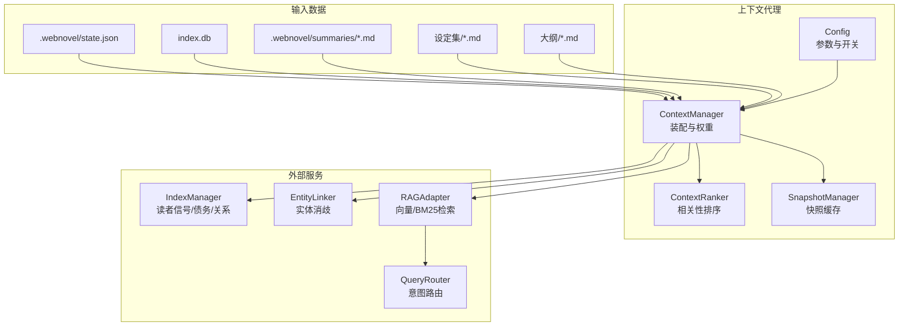
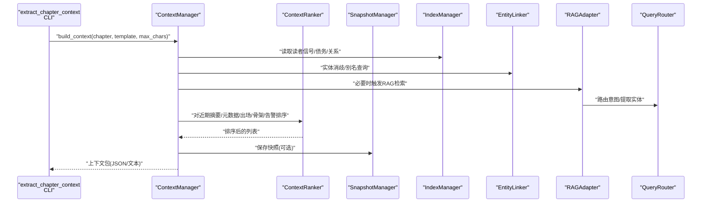
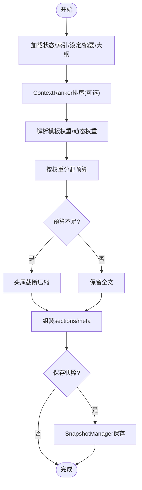
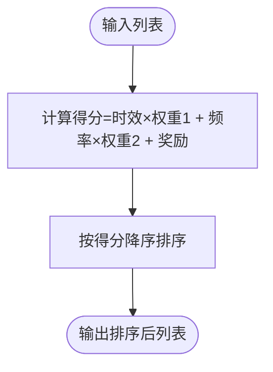
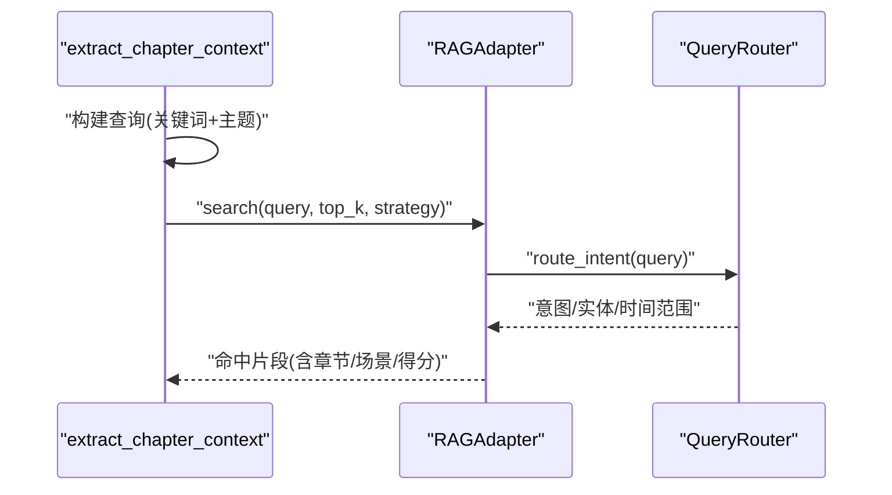
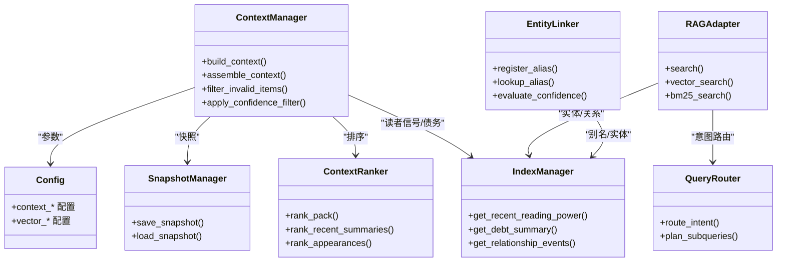

# 上下文代理

<cite>
**本文引用的文件**
- [context-agent.md](file://webnovel-writer/agents/context-agent.md)
- [context_manager.py](file://webnovel-writer/scripts/data_modules/context_manager.py)
- [context_ranker.py](file://webnovel-writer/scripts/data_modules/context_ranker.py)
- [context_weights.py](file://webnovel-writer/scripts/data_modules/context_weights.py)
- [snapshot_manager.py](file://webnovel-writer/scripts/data_modules/snapshot_manager.py)
- [index_manager.py](file://webnovel-writer/scripts/data_modules/index_manager.py)
- [entity_linker.py](file://webnovel-writer/scripts/data_modules/entity_linker.py)
- [rag_adapter.py](file://webnovel-writer/scripts/data_modules/rag_adapter.py)
- [writing_guidance_builder.py](file://webnovel-writer/scripts/data_modules/writing_guidance_builder.py)
- [extract_chapter_context.py](file://webnovel-writer/scripts/extract_chapter_context.py)
- [config.py](file://webnovel-writer/scripts/data_modules/config.py)
- [query_router.py](file://webnovel-writer/scripts/data_modules/query_router.py)
</cite>

## 目录
1. [简介](#简介)
2. [项目结构](#项目结构)
3. [核心组件](#核心组件)
4. [架构总览](#架构总览)
5. [详细组件分析](#详细组件分析)
6. [依赖分析](#依赖分析)
7. [性能考量](#性能考量)
8. [故障排查指南](#故障排查指南)
9. [结论](#结论)
10. [附录](#附录)

## 简介
本技术文档围绕“上下文代理”展开，系统阐述其在创作流程中的核心机制与实现细节。上下文代理负责从多源数据中抽取、组织并排序“文本上下文”，结合读者信号、题材画像与写作清单，生成可直接驱动后续写作步骤的“创作执行包”。文档涵盖：
- 文本上下文提取与组装
- 相关性排序与动态权重
- 上下文窗口管理与压缩
- 与RAG系统的检索增强
- 与实体链接、关系图谱的集成
- 优化策略、性能调优与准确性提升
- 配置参数、缓存与实时更新

## 项目结构
上下文代理位于数据模块与脚本之间，主要由以下模块组成：
- 上下文装配与排序：ContextManager、ContextRanker、ContextWeights
- 缓存与快照：SnapshotManager
- 数据索引与信号：IndexManager（读者信号、债务、关系等）
- 实体链接与消歧：EntityLinker
- RAG检索与意图路由：RAGAdapter、QueryRouter
- 写作指导与清单：WritingGuidanceBuilder
- 章节上下文提取入口：extract_chapter_context
- 配置中心：Config

图表来源
- [context_manager.py:77-131](file://webnovel-writer/scripts/data_modules/context_manager.py#L77-L131)
- [context_ranker.py:20-56](file://webnovel-writer/scripts/data_modules/context_ranker.py#L20-L56)
- [snapshot_manager.py:41-93](file://webnovel-writer/scripts/data_modules/snapshot_manager.py#L41-L93)
- [index_manager.py:228-229](file://webnovel-writer/scripts/data_modules/index_manager.py#L228-L229)
- [entity_linker.py:36-42](file://webnovel-writer/scripts/data_modules/entity_linker.py#L36-L42)
- [rag_adapter.py:68-78](file://webnovel-writer/scripts/data_modules/rag_adapter.py#L68-L78)
- [query_router.py:10-14](file://webnovel-writer/scripts/data_modules/query_router.py#L10-L14)

章节来源
- [context_manager.py:77-131](file://webnovel-writer/scripts/data_modules/context_manager.py#L77-L131)
- [context_ranker.py:20-56](file://webnovel-writer/scripts/data_modules/context_ranker.py#L20-L56)
- [snapshot_manager.py:41-93](file://webnovel-writer/scripts/data_modules/snapshot_manager.py#L41-L93)
- [index_manager.py:228-229](file://webnovel-writer/scripts/data_modules/index_manager.py#L228-L229)
- [entity_linker.py:36-42](file://webnovel-writer/scripts/data_modules/entity_linker.py#L36-L42)
- [rag_adapter.py:68-78](file://webnovel-writer/scripts/data_modules/rag_adapter.py#L68-L78)
- [query_router.py:10-14](file://webnovel-writer/scripts/data_modules/query_router.py#L10-L14)

## 核心组件
- ContextManager：负责从状态、索引、设定、摘要、故事骨架等多源聚合上下文，应用模板权重与动态预算，最终生成紧凑的上下文包。
- ContextRanker：对近期摘要、元数据、出场角色、骨架片段、告警等进行轻量启发式排序，突出钩子、时效性与关键信号。
- SnapshotManager：将上下文包持久化为快照，支持版本兼容与并发锁，加速后续构建。
- IndexManager：提供读者信号、债务、关系、状态变更等查询接口，支撑上下文与写作指导。
- EntityLinker：提供实体消歧、别名管理与置信度评估，保障上下文中的实体一致性。
- RAGAdapter：封装向量与BM25检索，支持混合策略与降级，为上下文注入外部线索。
- QueryRouter：对检索查询进行意图识别与子查询规划，决定检索策略与图谱需求。
- WritingGuidanceBuilder：基于读者信号与题材画像生成写作建议与检查清单，支持方法论卡片。
- extract_chapter_context：面向章节的上下文提取CLI，串联大纲、摘要、状态、合约上下文与RAG辅助。

章节来源
- [context_manager.py:99-131](file://webnovel-writer/scripts/data_modules/context_manager.py#L99-L131)
- [context_ranker.py:28-56](file://webnovel-writer/scripts/data_modules/context_ranker.py#L28-L56)
- [snapshot_manager.py:54-80](file://webnovel-writer/scripts/data_modules/snapshot_manager.py#L54-L80)
- [index_manager.py:228-229](file://webnovel-writer/scripts/data_modules/index_manager.py#L228-L229)
- [entity_linker.py:36-42](file://webnovel-writer/scripts/data_modules/entity_linker.py#L36-L42)
- [rag_adapter.py:68-78](file://webnovel-writer/scripts/data_modules/rag_adapter.py#L68-L78)
- [query_router.py:67-84](file://webnovel-writer/scripts/data_modules/query_router.py#L67-L84)
- [writing_guidance_builder.py:206-275](file://webnovel-writer/scripts/data_modules/writing_guidance_builder.py#L206-L275)
- [extract_chapter_context.py:320-344](file://webnovel-writer/scripts/extract_chapter_context.py#L320-L344)

## 架构总览
上下文代理的端到端流程如下：

图表来源
- [extract_chapter_context.py:320-344](file://webnovel-writer/scripts/extract_chapter_context.py#L320-L344)
- [context_manager.py:99-131](file://webnovel-writer/scripts/data_modules/context_manager.py#L99-L131)
- [context_ranker.py:28-56](file://webnovel-writer/scripts/data_modules/context_ranker.py#L28-L56)
- [snapshot_manager.py:54-80](file://webnovel-writer/scripts/data_modules/snapshot_manager.py#L54-L80)
- [index_manager.py:228-229](file://webnovel-writer/scripts/data_modules/index_manager.py#L228-L229)
- [entity_linker.py:36-42](file://webnovel-writer/scripts/data_modules/entity_linker.py#L36-L42)
- [rag_adapter.py:68-78](file://webnovel-writer/scripts/data_modules/rag_adapter.py#L68-L78)
- [query_router.py:67-84](file://webnovel-writer/scripts/data_modules/query_router.py#L67-L84)

## 详细组件分析

### 上下文装配与模板权重
- 模板选择与动态权重：支持“剧情/战斗/情感/过渡”等模板，早期/中期/晚期阶段按章节动态调整权重，确保不同阶段的上下文重点匹配。
- 组装过程：按“核心/场景/全局/读者信号/题材画像/写作指导/故事骨架/记忆/偏好/警示”顺序组织，依据权重分配预算，必要时使用额外预算填充“额外分区”。
- 文本压缩：在预算不足时采用“头尾截断+省略号”策略，保证可读性与边界信息保留。

图表来源
- [context_manager.py:133-165](file://webnovel-writer/scripts/data_modules/context_manager.py#L133-L165)
- [context_manager.py:611-626](file://webnovel-writer/scripts/data_modules/context_manager.py#L611-L626)
- [context_weights.py:10-38](file://webnovel-writer/scripts/data_modules/context_weights.py#L10-L38)
- [context_manager.py:526-542](file://webnovel-writer/scripts/data_modules/context_manager.py#L526-L542)

章节来源
- [context_manager.py:99-131](file://webnovel-writer/scripts/data_modules/context_manager.py#L99-L131)
- [context_manager.py:133-165](file://webnovel-writer/scripts/data_modules/context_manager.py#L133-L165)
- [context_weights.py:10-38](file://webnovel-writer/scripts/data_modules/context_weights.py#L10-L38)
- [context_manager.py:526-542](file://webnovel-writer/scripts/data_modules/context_manager.py#L526-L542)
- [context_manager.py:611-626](file://webnovel-writer/scripts/data_modules/context_manager.py#L611-L626)

### 相关性排序与重要性评估
- 排序对象：近期摘要、章节元数据、出场角色、故事骨架、告警（含无效事实）。
- 评分函数：综合时效性、出现频率、长度与钩子提示，告警按严重级别加分。
- 可观测性：可开启调试模式输出明细分数，便于定位偏差。

图表来源
- [context_ranker.py:148-153](file://webnovel-writer/scripts/data_modules/context_ranker.py#L148-L153)
- [context_ranker.py:155-172](file://webnovel-writer/scripts/data_modules/context_ranker.py#L155-L172)
- [context_ranker.py:174-175](file://webnovel-writer/scripts/data_modules/context_ranker.py#L174-L175)

章节来源
- [context_ranker.py:28-56](file://webnovel-writer/scripts/data_modules/context_ranker.py#L28-L56)
- [context_ranker.py:58-87](file://webnovel-writer/scripts/data_modules/context_ranker.py#L58-L87)
- [context_ranker.py:89-117](file://webnovel-writer/scripts/data_modules/context_ranker.py#L89-L117)
- [context_ranker.py:119-146](file://webnovel-writer/scripts/data_modules/context_ranker.py#L119-L146)

### 上下文窗口管理与压缩
- 窗口参数：近期摘要/元数据窗口、出场角色上限、故事骨架采样间隔与样本数、骨架片段长度等。
- 压缩策略：在预算不足时，按头部比例与尾部比例截断，中间省略，确保边界信息可见。

章节来源
- [context_manager.py:194-202](file://webnovel-writer/scripts/data_modules/context_manager.py#L194-L202)
- [context_manager.py:700-716](file://webnovel-writer/scripts/data_modules/context_manager.py#L700-L716)
- [context_manager.py:611-626](file://webnovel-writer/scripts/data_modules/context_manager.py#L611-L626)

### 与RAG系统的集成
- 触发条件：大纲包含特定关键词（如关系、冲突、地点、势力、线索、伏笔、回收等）且长度达标。
- 检索策略：优先向量检索，失败或无嵌入密钥时回退BM25；可结合图谱扩展。
- 意图路由：QueryRouter识别意图（关系/实体/场景/设定/剧情），提取实体与时间范围，决定检索策略与是否需要图谱。

图表来源
- [extract_chapter_context.py:173-191](file://webnovel-writer/scripts/extract_chapter_context.py#L173-L191)
- [extract_chapter_context.py:194-257](file://webnovel-writer/scripts/extract_chapter_context.py#L194-L257)
- [rag_adapter.py:68-78](file://webnovel-writer/scripts/data_modules/rag_adapter.py#L68-L78)
- [query_router.py:67-84](file://webnovel-writer/scripts/data_modules/query_router.py#L67-L84)

章节来源
- [extract_chapter_context.py:173-191](file://webnovel-writer/scripts/extract_chapter_context.py#L173-L191)
- [extract_chapter_context.py:194-257](file://webnovel-writer/scripts/extract_chapter_context.py#L194-L257)
- [rag_adapter.py:560-650](file://webnovel-writer/scripts/data_modules/rag_adapter.py#L560-L650)
- [query_router.py:67-84](file://webnovel-writer/scripts/data_modules/query_router.py#L67-L84)

### 与实体链接和关系图谱的集成
- 实体消歧：基于别名表与置信度阈值，自动/警告/手动三档处理，支持批量处理与新实体注册。
- 关系图谱：IndexManager维护关系事件与图谱，QueryRouter可识别关系意图并规划图谱增强检索。

章节来源
- [entity_linker.py:36-42](file://webnovel-writer/scripts/data_modules/entity_linker.py#L36-L42)
- [entity_linker.py:76-89](file://webnovel-writer/scripts/data_modules/entity_linker.py#L76-L89)
- [entity_linker.py:119-144](file://webnovel-writer/scripts/data_modules/entity_linker.py#L119-L144)
- [index_manager.py:384-413](file://webnovel-writer/scripts/data_modules/index_manager.py#L384-L413)
- [query_router.py:77-77](file://webnovel-writer/scripts/data_modules/query_router.py#L77-L77)

### 写作指导与清单
- 写作指导：基于读者信号（钩子类型、模式使用、审查趋势）、题材画像与方法论卡片，生成可执行建议。
- 检查清单：将指导转化为可评分的条目，支持必做/可选、权重与验收提示，计算完成率与加权得分。

章节来源
- [writing_guidance_builder.py:206-275](file://webnovel-writer/scripts/data_modules/writing_guidance_builder.py#L206-L275)
- [writing_guidance_builder.py:278-449](file://webnovel-writer/scripts/data_modules/writing_guidance_builder.py#L278-L449)
- [writing_guidance_builder.py:452-479](file://webnovel-writer/scripts/data_modules/writing_guidance_builder.py#L452-L479)
- [context_manager.py:343-421](file://webnovel-writer/scripts/data_modules/context_manager.py#L343-L421)

### 上下文代理的CLI与执行包
- CLI入口：extract_chapter_context提供text/json两种输出，包含大纲、前文摘要、当前状态、合约上下文、写作指导、读者信号、题材画像与RAG线索。
- 执行包：context-agent的“创作执行包”由任务书、Context Contract与直写提示词三部分组成，强调一致性与可直接执行。

章节来源
- [extract_chapter_context.py:320-344](file://webnovel-writer/scripts/extract_chapter_context.py#L320-L344)
- [extract_chapter_context.py:347-503](file://webnovel-writer/scripts/extract_chapter_context.py#L347-L503)
- [context-agent.md:31-59](file://webnovel-writer/agents/context-agent.md#L31-L59)

## 依赖分析
- ContextManager依赖：Config、IndexManager、ContextRanker、SnapshotManager、ContextWeights、WritingGuidanceBuilder、GenreProfileBuilder、ChapterOutlineLoader。
- ContextRanker依赖：Config。
- RAGAdapter依赖：Config、IndexManager、QueryRouter、APIClient。
- IndexManager提供：读者信号、债务、关系、状态变更、工具调用统计、审查指标等。
- EntityLinker依赖：IndexManager。
- extract_chapter_context依赖：ContextManager、RAGAdapter、QueryRouter。

图表来源
- [context_manager.py:77-82](file://webnovel-writer/scripts/data_modules/context_manager.py#L77-L82)
- [context_ranker.py:20-27](file://webnovel-writer/scripts/data_modules/context_ranker.py#L20-L27)
- [snapshot_manager.py:41-46](file://webnovel-writer/scripts/data_modules/snapshot_manager.py#L41-L46)
- [index_manager.py:228-229](file://webnovel-writer/scripts/data_modules/index_manager.py#L228-L229)
- [entity_linker.py:36-42](file://webnovel-writer/scripts/data_modules/entity_linker.py#L36-L42)
- [rag_adapter.py:68-78](file://webnovel-writer/scripts/data_modules/rag_adapter.py#L68-L78)
- [query_router.py:10-14](file://webnovel-writer/scripts/data_modules/query_router.py#L10-L14)
- [config.py:90-349](file://webnovel-writer/scripts/data_modules/config.py#L90-L349)

章节来源
- [context_manager.py:77-82](file://webnovel-writer/scripts/data_modules/context_manager.py#L77-L82)
- [context_ranker.py:20-27](file://webnovel-writer/scripts/data_modules/context_ranker.py#L20-L27)
- [snapshot_manager.py:41-46](file://webnovel-writer/scripts/data_modules/snapshot_manager.py#L41-L46)
- [index_manager.py:228-229](file://webnovel-writer/scripts/data_modules/index_manager.py#L228-L229)
- [entity_linker.py:36-42](file://webnovel-writer/scripts/data_modules/entity_linker.py#L36-L42)
- [rag_adapter.py:68-78](file://webnovel-writer/scripts/data_modules/rag_adapter.py#L68-L78)
- [query_router.py:10-14](file://webnovel-writer/scripts/data_modules/query_router.py#L10-L14)
- [config.py:90-349](file://webnovel-writer/scripts/data_modules/config.py#L90-L349)

## 性能考量
- 检索性能
  - 向量检索：在向量数据库中全表扫描或按章节/类型过滤，注意大表扫描成本；可通过预过滤与索引优化。
  - BM25检索：基于倒排索引与文档统计，适合关键词检索与回退。
  - 混合策略：RRF融合向量与BM25，平衡召回与精度。
- 数据库与I/O
  - SQLite连接管理与索引：确保常用查询列建立索引，避免频繁全表扫描。
  - 文件锁与原子写：快照保存使用文件锁，避免并发写冲突。
- 文本压缩与预算
  - 通过权重与预算分配控制上下文体积，避免超限；压缩策略在预算紧张时启用。
- 并发与超时
  - 配置嵌入/重排并发与批大小，合理设置超时与重试，避免冷启动与网络抖动影响。

章节来源
- [rag_adapter.py:246-253](file://webnovel-writer/scripts/data_modules/rag_adapter.py#L246-L253)
- [rag_adapter.py:377-484](file://webnovel-writer/scripts/data_modules/rag_adapter.py#L377-L484)
- [rag_adapter.py:518-557](file://webnovel-writer/scripts/data_modules/rag_adapter.py#L518-L557)
- [snapshot_manager.py:64-68](file://webnovel-writer/scripts/data_modules/snapshot_manager.py#L64-L68)
- [config.py:144-156](file://webnovel-writer/scripts/data_modules/config.py#L144-L156)
- [config.py:157-166](file://webnovel-writer/scripts/data_modules/config.py#L157-L166)

## 故障排查指南
- 快照版本不兼容
  - 现象：加载快照时报版本不匹配。
  - 处理：删除不兼容快照或升级版本；确保快照版本与当前实现一致。
- 向量数据库异常
  - 现象：嵌入失败或向量表结构缺失。
  - 处理：检查嵌入API密钥与URL；迁移/重建向量表；确认数据库文件存在且可写。
- RAG未触发或命中为空
  - 现象：大纲关键词不足或向量库为空。
  - 处理：确认触发关键词与最小字符阈值；确保向量库存在且有数据；必要时回退至BM25。
- 读者信号缺失
  - 现象：写作指导与清单为空或不生效。
  - 处理：检查IndexManager中相关统计表是否生成；确认开关与窗口参数设置。
- 实体消歧置信度低
  - 现象：消歧结果需要人工确认。
  - 处理：提高置信度阈值或补充别名；查看无效事实记录与消歧警告。

章节来源
- [snapshot_manager.py:78-79](file://webnovel-writer/scripts/data_modules/snapshot_manager.py#L78-L79)
- [rag_adapter.py:83-89](file://webnovel-writer/scripts/data_modules/rag_adapter.py#L83-L89)
- [rag_adapter.py:139-148](file://webnovel-writer/scripts/data_modules/rag_adapter.py#L139-L148)
- [extract_chapter_context.py:260-291](file://webnovel-writer/scripts/extract_chapter_context.py#L260-L291)
- [index_manager.py:511-533](file://webnovel-writer/scripts/data_modules/index_manager.py#L511-L533)
- [entity_linker.py:76-89](file://webnovel-writer/scripts/data_modules/entity_linker.py#L76-L89)

## 结论
上下文代理通过“多源聚合—模板权重—相关性排序—压缩与缓存—检索增强—写作指导”的闭环，为创作提供高质量、可执行的上下文。其关键优势在于：
- 动态权重与阶段化预算，适配不同写作阶段
- 轻量启发式排序与可观测性，兼顾效率与可控性
- 与RAG、实体链接、关系图谱的深度集成，提升上下文的相关性与一致性
- 完整的配置与快照机制，保障可维护性与性能

## 附录

### 配置参数概览（节选）
- 上下文与排序
  - context_ranker_enabled/recency_weight/frequency_weight/hook_bonus/length_bonus_cap
  - context_compact_text_enabled/head_ratio/min_budget
  - context_dynamic_budget_enabled/early/later thresholds与权重
- 写作指导与清单
  - context_writing_guidance_enabled/max_items/low_score_threshold/hook_diversify
  - context_methodology_enabled/whitelist/label
  - context_writing_checklist_enabled/min/max/default_weight
- RAG与检索
  - context_rag_assist_enabled/top_k/min/max_query_chars
  - vector/bm25/rerank_top_n/rrf_k
  - graph_rag_* 相关开关与权重
- 数据库与I/O
  - vector_db/vector_top_k/bm25_top_k/rerank_top_n
  - embed/rerank并发与超时

章节来源
- [config.py:196-258](file://webnovel-writer/scripts/data_modules/config.py#L196-L258)
- [config.py:157-175](file://webnovel-writer/scripts/data_modules/config.py#L157-L175)
- [config.py:306-317](file://webnovel-writer/scripts/data_modules/config.py#L306-L317)