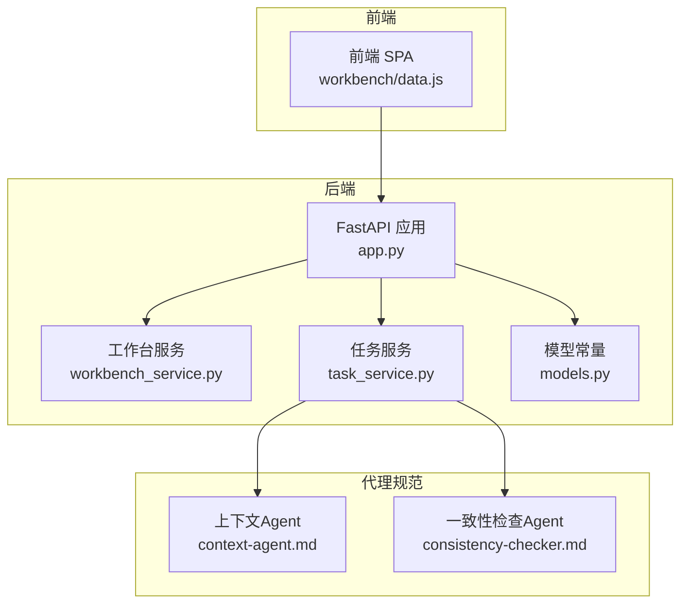
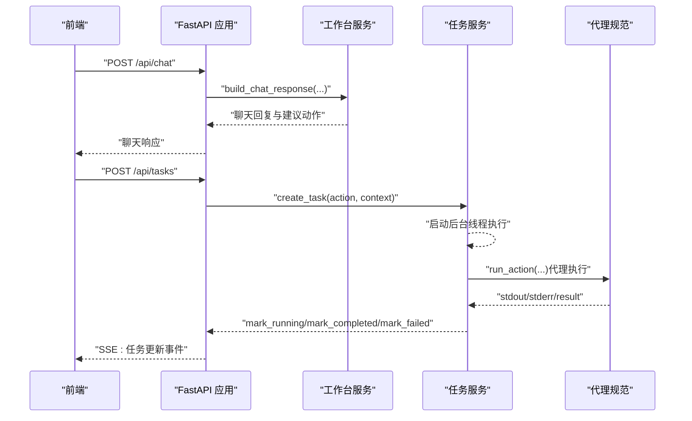
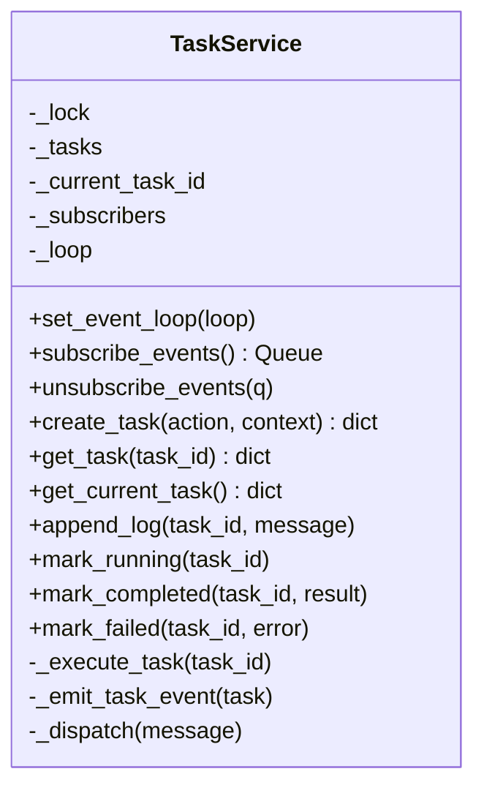
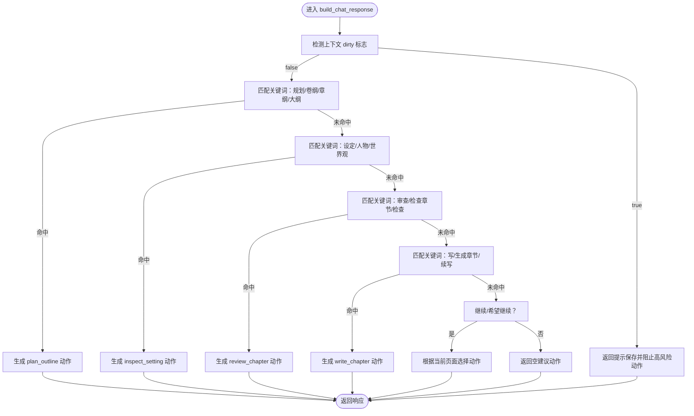
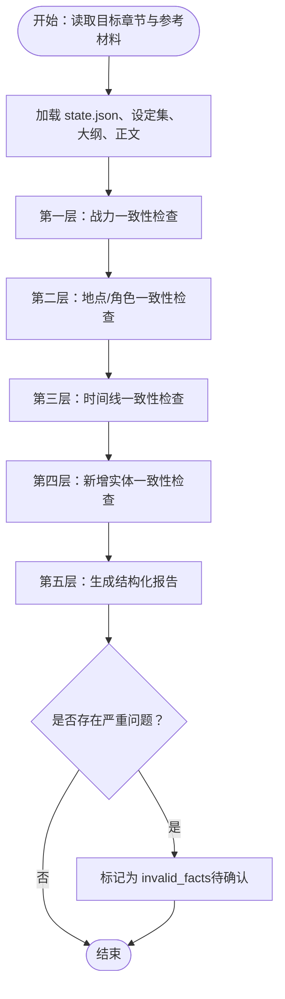
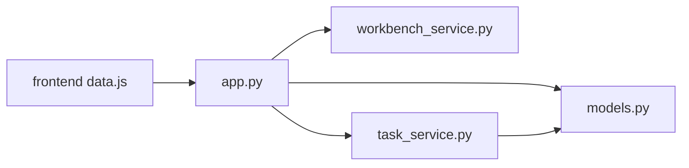

# 代理协作机制

<cite>
**本文引用的文件**
- [webnovel-writer/dashboard/app.py](file://webnovel-writer/dashboard/app.py)
- [webnovel-writer/dashboard/server.py](file://webnovel-writer/dashboard/server.py)
- [webnovel-writer/dashboard/workbench_service.py](file://webnovel-writer/dashboard/workbench_service.py)
- [webnovel-writer/dashboard/task_service.py](file://webnovel-writer/dashboard/task_service.py)
- [webnovel-writer/dashboard/models.py](file://webnovel-writer/dashboard/models.py)
- [webnovel-writer/dashboard/frontend/src/workbench/data.js](file://webnovel-writer/dashboard/frontend/src/workbench/data.js)
- [webnovel-writer/agents/consistency-checker.md](file://webnovel-writer/agents/consistency-checker.md)
- [webnovel-writer/agents/context-agent.md](file://webnovel-writer/agents/context-agent.md)
</cite>

## 目录
1. [引言](#引言)
2. [项目结构](#项目结构)
3. [核心组件](#核心组件)
4. [架构总览](#架构总览)
5. [详细组件分析](#详细组件分析)
6. [依赖分析](#依赖分析)
7. [性能考虑](#性能考虑)
8. [故障排查指南](#故障排查指南)
9. [结论](#结论)
10. [附录](#附录)

## 引言
本技术文档围绕“AI代理协作机制”展开，聚焦于多个代理之间的通信协议、任务分配与结果整合流程，阐述代理优先级管理、冲突解决与决策融合机制，明确协作模式、执行顺序与依赖关系，并提供协作配置、性能优化与故障处理方法。文档同时覆盖代理间数据共享、状态同步与结果验证策略，并给出典型协作场景与最佳实践。

## 项目结构
本仓库包含工作台后端服务、前端界面、以及一组“代理”规范文档。后端采用 FastAPI 提供 API 与事件推送，前端通过 SPA 访问并订阅后端事件；代理规范文档定义了不同职责的检查与上下文生成 Agent 的输入输出与执行流程。

图表来源
- [webnovel-writer/dashboard/app.py:1-490](file://webnovel-writer/dashboard/app.py#L1-L490)
- [webnovel-writer/dashboard/workbench_service.py:1-171](file://webnovel-writer/dashboard/workbench_service.py#L1-L171)
- [webnovel-writer/dashboard/task_service.py:1-166](file://webnovel-writer/dashboard/task_service.py#L1-L166)
- [webnovel-writer/dashboard/models.py:1-23](file://webnovel-writer/dashboard/models.py#L1-L23)
- [webnovel-writer/dashboard/frontend/src/workbench/data.js:1-163](file://webnovel-writer/dashboard/frontend/src/workbench/data.js#L1-L163)
- [webnovel-writer/agents/context-agent.md:1-269](file://webnovel-writer/agents/context-agent.md#L1-L269)
- [webnovel-writer/agents/consistency-checker.md:1-229](file://webnovel-writer/agents/consistency-checker.md#L1-L229)

章节来源
- [webnovel-writer/dashboard/app.py:1-490](file://webnovel-writer/dashboard/app.py#L1-L490)
- [webnovel-writer/dashboard/server.py:1-72](file://webnovel-writer/dashboard/server.py#L1-L72)
- [webnovel-writer/dashboard/workbench_service.py:1-171](file://webnovel-writer/dashboard/workbench_service.py#L1-L171)
- [webnovel-writer/dashboard/task_service.py:1-166](file://webnovel-writer/dashboard/task_service.py#L1-L166)
- [webnovel-writer/dashboard/models.py:1-23](file://webnovel-writer/dashboard/models.py#L1-L23)
- [webnovel-writer/dashboard/frontend/src/workbench/data.js:1-163](file://webnovel-writer/dashboard/frontend/src/workbench/data.js#L1-L163)
- [webnovel-writer/agents/context-agent.md:1-269](file://webnovel-writer/agents/context-agent.md#L1-L269)
- [webnovel-writer/agents/consistency-checker.md:1-229](file://webnovel-writer/agents/consistency-checker.md#L1-L229)

## 核心组件
- 工作台后端服务（FastAPI 应用）
  - 提供只读查询、文件读写、任务创建与事件推送等能力。
  - 通过 CORS、静态文件托管与 SPA 回退策略支持前端访问。
- 工作台服务
  - 负责项目摘要加载、工作区文件保存、聊天动作建议生成。
- 任务服务
  - 维护任务生命周期（待处理/运行中/完成/失败），异步执行动作并通过队列向订阅者广播事件。
- 模型常量
  - 定义工作台页面、工作区根目录映射与任务状态枚举。
- 前端工作台数据模型
  - 定义页面导航、任务状态建模、完成提示与恢复建议等 UI 模型。
- 代理规范
  - 上下文Agent：生成可直接用于创作的执行包，包含任务书、上下文契约与直写提示词。
  - 一致性检查Agent：对设定、地点/角色、时间线与新增实体进行一致性检查，输出结构化报告并标记无效事实。

章节来源
- [webnovel-writer/dashboard/app.py:76-490](file://webnovel-writer/dashboard/app.py#L76-L490)
- [webnovel-writer/dashboard/workbench_service.py:18-171](file://webnovel-writer/dashboard/workbench_service.py#L18-L171)
- [webnovel-writer/dashboard/task_service.py:14-166](file://webnovel-writer/dashboard/task_service.py#L14-L166)
- [webnovel-writer/dashboard/models.py:3-23](file://webnovel-writer/dashboard/models.py#L3-L23)
- [webnovel-writer/dashboard/frontend/src/workbench/data.js:20-163](file://webnovel-writer/dashboard/frontend/src/workbench/data.js#L20-L163)
- [webnovel-writer/agents/context-agent.md:1-269](file://webnovel-writer/agents/context-agent.md#L1-L269)
- [webnovel-writer/agents/consistency-checker.md:1-229](file://webnovel-writer/agents/consistency-checker.md#L1-L229)

## 架构总览
后端以 FastAPI 为核心，前端通过 REST 与 Server-Sent Events 实时接收任务与文件变更事件。任务服务负责将聊天动作转换为具体任务并交由代理执行，代理执行完成后通过日志与结果反馈到前端 UI。

图表来源
- [webnovel-writer/dashboard/app.py:420-461](file://webnovel-writer/dashboard/app.py#L420-L461)
- [webnovel-writer/dashboard/workbench_service.py:74-162](file://webnovel-writer/dashboard/workbench_service.py#L74-L162)
- [webnovel-writer/dashboard/task_service.py:36-143](file://webnovel-writer/dashboard/task_service.py#L36-L143)
- [webnovel-writer/agents/context-agent.md:103-129](file://webnovel-writer/agents/context-agent.md#L103-L129)
- [webnovel-writer/agents/consistency-checker.md:199-213](file://webnovel-writer/agents/consistency-checker.md#L199-L213)

## 详细组件分析

### 组件A：任务服务（TaskService）
- 职责
  - 维护任务字典、当前任务 ID、事件订阅队列。
  - 创建任务、更新任务状态、追加日志、广播事件。
  - 异步执行动作（调用代理执行器），并将结果/错误写回任务。
- 关键流程
  - 任务创建：深拷贝 action/context，设置初始状态与时间戳，发布“任务创建”事件。
  - 执行线程：切换为“运行中”，调用代理执行器，根据返回结果标记“完成/失败”，追加日志。
  - 事件分发：遍历订阅队列，丢弃满载队列并清理失效订阅。
- 数据结构与复杂度
  - 任务字典：O(1) 查找与更新。
  - 日志上限：保留最近若干条，避免无限增长。
  - 订阅队列：最大容量限制，防止内存膨胀。
- 错误处理
  - 代理执行异常捕获，标记失败并记录异常信息。
  - 订阅队列满载时清理订阅，保证系统稳定性。
- 性能影响
  - 使用线程池外的守护线程执行任务，避免阻塞事件循环。
  - 事件分发通过事件循环安全调度，减少锁竞争。

图表来源
- [webnovel-writer/dashboard/task_service.py:14-166](file://webnovel-writer/dashboard/task_service.py#L14-L166)

章节来源
- [webnovel-writer/dashboard/task_service.py:14-166](file://webnovel-writer/dashboard/task_service.py#L14-L166)

### 组件B：工作台服务（WorkbenchService）
- 职责
  - 加载项目摘要（标题、进度、工作区统计等）。
  - 保存工作区文件（正文/大纲/设定集），并进行路径白名单校验。
  - 聊天响应生成：根据消息与上下文识别动作意图，返回建议动作与理由。
- 关键流程
  - 项目摘要：读取 state.json，汇总各工作区文件数量与页面信息。
  - 文件保存：路径安全解析与白名单校验，确保仅写入允许目录。
  - 聊天动作识别：基于关键词与当前页面，优先匹配规划/设定/审查/写作等动作。
- 数据结构
  - 摘要模型：包含项目信息、进度、工作区统计与建议列表。
  - 聊天响应模型：包含回复文本、建议动作列表、原因与作用域。
- 性能与安全
  - 路径校验避免目录穿越。
  - 关键词匹配与上下文判断，避免误识别。

图表来源
- [webnovel-writer/dashboard/workbench_service.py:74-162](file://webnovel-writer/dashboard/workbench_service.py#L74-L162)

章节来源
- [webnovel-writer/dashboard/workbench_service.py:18-171](file://webnovel-writer/dashboard/workbench_service.py#L18-L171)

### 组件C：代理规范（上下文Agent 与 一致性检查Agent）
- 上下文Agent（context-agent）
  - 目标：生成可直接驱动创作的“执行包”，包含任务书、上下文契约与直写提示词。
  - 输入：章节号、项目根目录、存储路径、状态文件。
  - 输出：三层结构（任务书8板块、内置上下文契约、直写提示词）。
  - 执行流程要点：优先读取上下文快照，提取大纲与状态，结合最近模式与债务，组装执行包并通过逻辑红线校验。
  - 时间约束：上章时间锚点、本章时间锚点、允许推进跨度、过渡要求、倒计时状态。
- 一致性检查Agent（consistency-checker）
  - 目标：检查设定一致性，输出结构化报告，标记严重问题为无效事实。
  - 三层检查：战力一致性、地点/角色一致性、时间线一致性。
  - 新增实体一致性：对新实体进行合理性评估。
  - 报告与修复建议：提供结论、严重度分级与修复建议。
  - 禁止事项与成功标准：明确不可接受的行为与通过标准。

图表来源
- [webnovel-writer/agents/consistency-checker.md:20-229](file://webnovel-writer/agents/consistency-checker.md#L20-L229)

章节来源
- [webnovel-writer/agents/context-agent.md:1-269](file://webnovel-writer/agents/context-agent.md#L1-L269)
- [webnovel-writer/agents/consistency-checker.md:1-229](file://webnovel-writer/agents/consistency-checker.md#L1-L229)

### 组件D：前端工作台数据模型
- 页面与任务建模
  - 页面集合与默认页、任务空态模型、顶部栏模型、右侧边栏模型。
  - 完成提示与恢复建议：根据任务状态与动作类型动态生成。
- 聊天回复模型
  - 解析聊天响应，包含回复文本、建议动作与作用域。
- 导航与确认
  - 根据动作类型解析目标页面，提供导航提示或刷新提示。
  - 脏状态确认：存在未保存修改时提示保存。

章节来源
- [webnovel-writer/dashboard/frontend/src/workbench/data.js:1-163](file://webnovel-writer/dashboard/frontend/src/workbench/data.js#L1-L163)

## 依赖分析
- 组件耦合
  - app.py 依赖 task_service 与 workbench_service，分别提供任务与聊天/文件能力。
  - task_service 依赖 claude_runner（外部执行器）与 models 常量。
  - workbench_service 依赖 models 常量与路径安全工具。
  - 前端 data.js 依赖后端 API 返回的数据结构。
- 外部依赖
  - FastAPI、SQLite（index.db 只读查询）、uvicorn（开发服务器）。
- 循环依赖
  - 未发现循环依赖迹象；模块职责清晰，接口边界明确。

图表来源
- [webnovel-writer/dashboard/app.py:20-24](file://webnovel-writer/dashboard/app.py#L20-L24)
- [webnovel-writer/dashboard/task_service.py:10-11](file://webnovel-writer/dashboard/task_service.py#L10-L11)
- [webnovel-writer/dashboard/models.py:3-8](file://webnovel-writer/dashboard/models.py#L3-L8)
- [webnovel-writer/dashboard/frontend/src/workbench/data.js:1-65](file://webnovel-writer/dashboard/frontend/src/workbench/data.js#L1-L65)

章节来源
- [webnovel-writer/dashboard/app.py:1-490](file://webnovel-writer/dashboard/app.py#L1-L490)
- [webnovel-writer/dashboard/task_service.py:1-166](file://webnovel-writer/dashboard/task_service.py#L1-L166)
- [webnovel-writer/dashboard/models.py:1-23](file://webnovel-writer/dashboard/models.py#L1-L23)
- [webnovel-writer/dashboard/frontend/src/workbench/data.js:1-163](file://webnovel-writer/dashboard/frontend/src/workbench/data.js#L1-L163)

## 性能考虑
- 事件推送
  - 使用 asyncio 队列与事件循环安全调度，避免阻塞主线程。
  - 订阅队列最大容量限制，防止内存占用过高。
- 任务执行
  - 后台线程执行代理动作，避免阻塞 FastAPI 事件循环。
  - 日志上限控制，减少存储与传输开销。
- 数据库查询
  - index.db 仅提供只读查询，异常时返回空列表，保证服务稳定性。
- 前端渲染
  - 任务与聊天状态模型扁平化，便于快速更新 UI。

## 故障排查指南
- 任务失败
  - 检查任务日志中的 stdout/stderr，定位代理执行错误。
  - 确认代理执行器返回的 success 字段与 result/error 字段。
- 文件保存失败
  - 确认相对路径在允许的工作区根目录内（正文/大纲/设定集）。
  - 检查路径是否被安全解析工具拒绝。
- 聊天动作未识别
  - 确认消息中包含预期关键词（规划/设定/审查/写等）。
  - 检查当前页面与 dirty 标志，脏状态会阻止高风险动作。
- 事件未推送
  - 确认客户端已连接 SSE 端点，且订阅队列未被清理。
  - 检查任务服务事件循环是否已设置。

章节来源
- [webnovel-writer/dashboard/task_service.py:121-143](file://webnovel-writer/dashboard/task_service.py#L121-L143)
- [webnovel-writer/dashboard/workbench_service.py:58-71](file://webnovel-writer/dashboard/workbench_service.py#L58-L71)
- [webnovel-writer/dashboard/app.py:434-461](file://webnovel-writer/dashboard/app.py#L434-L461)

## 结论
本协作机制以 FastAPI 为入口，通过任务服务统一编排代理执行，前后端通过 SSE 实时同步状态。代理规范文档明确了上下文与一致性检查的职责与产出，确保创作过程的可控性与质量。通过优先级管理（关键词与页面）、冲突解决（逻辑红线与无效事实标记）、决策融合（上下文契约与直写提示词），系统实现了可追踪、可验证、可恢复的协作闭环。

## 附录
- 典型协作场景
  - 大纲规划 → 上下文Agent 生成执行包 → 写作执行 → 一致性检查 → 修复建议与无效事实标记 → 结果整合与 UI 更新。
- 最佳实践
  - 明确动作优先级：规划/设定/审查/写作按关键词与页面上下文匹配。
  - 严格时间约束：时间锚点、倒计时与过渡要求必须满足。
  - 逻辑红线校验：大纲/设定/时空/因果/动机/合同一致性必须通过。
  - 事件驱动：前端订阅任务事件，自动刷新 UI 并提示导航或恢复操作。