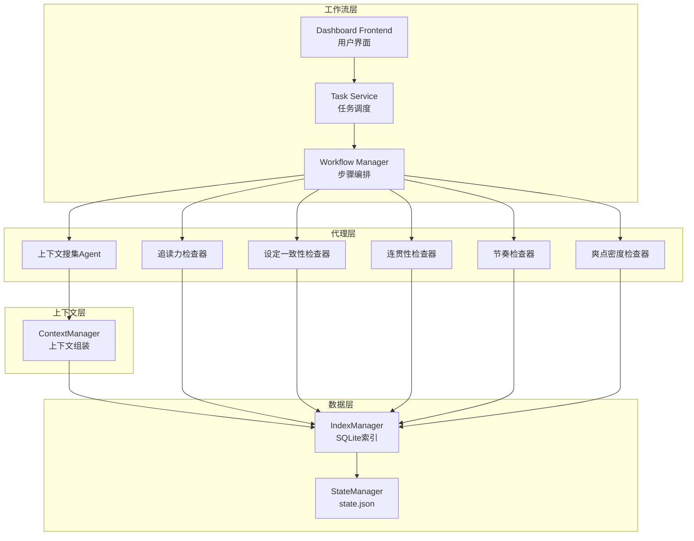
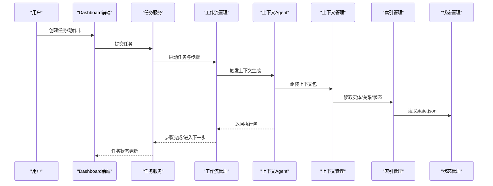
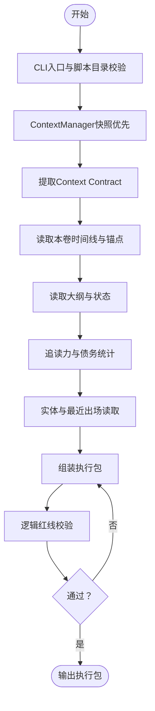
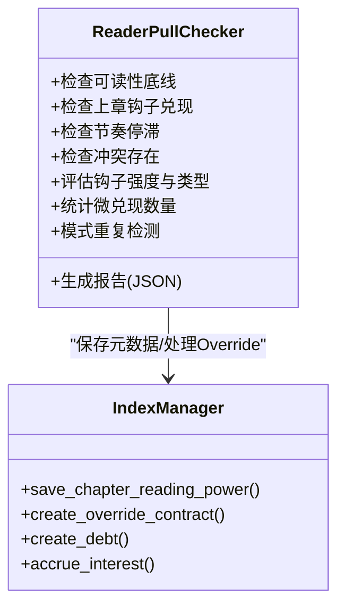
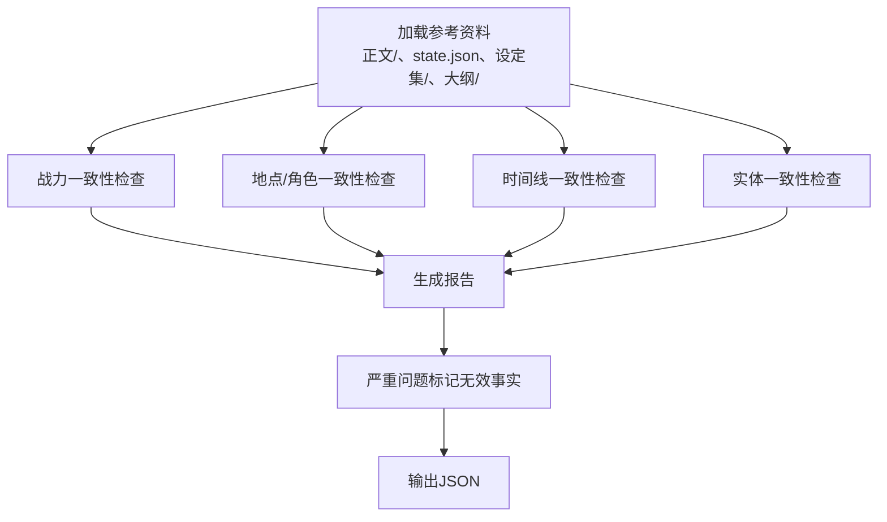
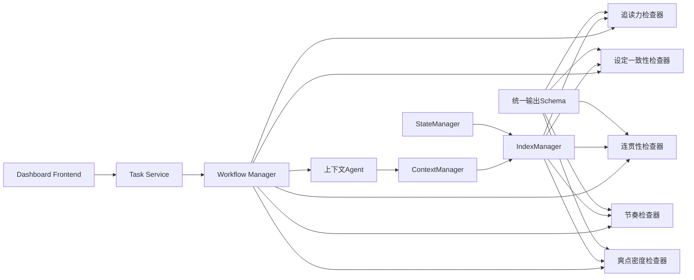

# 代理系统概览

<cite>
**本文档引用的文件**
- [consistency-checker.md](file://webnovel-writer/agents/consistency-checker.md)
- [context-agent.md](file://webnovel-writer/agents/context-agent.md)
- [continuity-checker.md](file://webnovel-writer/agents/continuity-checker.md)
- [high-point-checker.md](file://webnovel-writer/agents/high-point-checker.md)
- [pacing-checker.md](file://webnovel-writer/agents/pacing-checker.md)
- [reader-pull-checker.md](file://webnovel-writer/agents/reader-pull-checker.md)
- [checker-output-schema.md](file://webnovel-writer/references/checker-output-schema.md)
- [entity-management-spec.md](file://webnovel-writer/references/entity-management-spec.md)
- [preferences-schema.md](file://webnovel-writer/references/preferences-schema.md)
- [state_manager.py](file://webnovel-writer/scripts/data_modules/state_manager.py)
- [context_manager.py](file://webnovel-writer/scripts/data_modules/context_manager.py)
- [index_manager.py](file://webnovel-writer/scripts/data_modules/index_manager.py)
- [workflow_manager.py](file://webnovel-writer/scripts/workflow_manager.py)
- [task_service.py](file://webnovel-writer/dashboard/task_service.py)
- [App.jsx](file://webnovel-writer/dashboard/frontend/src/App.jsx)
</cite>

## 目录
1. [简介](#简介)
2. [项目结构](#项目结构)
3. [核心组件](#核心组件)
4. [架构总览](#架构总览)
5. [详细组件分析](#详细组件分析)
6. [依赖关系分析](#依赖关系分析)
7. [性能考虑](#性能考虑)
8. [故障排查指南](#故障排查指南)
9. [结论](#结论)
10. [附录](#附录)

## 简介
本文件面向Webnovel Writer的AI代理系统，提供整体架构、设计理念与协作机制的概览。系统围绕六大智能代理构建：上下文搜集Agent、追读力检查器、设定一致性检查器、连贯性检查器、节奏检查器、爽点密度检查器。它们共同遵循统一的输出格式规范，通过工具链集成与标准化执行流程，为写作质量提供端到端保障。

## 项目结构
系统主要由以下部分组成：
- 代理层：六个专用Agent负责不同维度的质量控制与创作支持
- 数据层：基于SQLite的索引管理与状态管理，支撑实体、关系、债务、无效事实等数据
- 上下文层：ContextManager负责组装上下文包，结合权重与模板进行内容裁剪
- 工作流层：Workflow Manager与Dashboard Task Service协调任务生命周期与前端交互
- 参考规范：统一输出Schema、实体管理规范、偏好配置等

**图表来源**
- [context_agent.md:101-269](file://webnovel-writer/agents/context-agent.md#L101-L269)
- [reader_pull_checker.md:216-318](file://webnovel-writer/agents/reader-pull-checker.md#L216-L318)
- [consistency_checker.md:20-229](file://webnovel-writer/agents/consistency-checker.md#L20-L229)
- [continuity_checker.md:20-251](file://webnovel-writer/agents/continuity-checker.md#L20-L251)
- [pacing_checker.md:20-216](file://webnovel-writer/agents/pacing-checker.md#L20-L216)
- [high_point_checker.md:25-218](file://webnovel-writer/agents/high-point-checker.md#L25-L218)
- [context_manager.py:99-131](file://webnovel-writer/scripts/data_modules/context_manager.py#L99-L131)
- [index_manager.py:228-620](file://webnovel-writer/scripts/data_modules/index_manager.py#L228-L620)
- [state_manager.py:90-140](file://webnovel-writer/scripts/data_modules/state_manager.py#L90-L140)
- [workflow_manager.py:105-127](file://webnovel-writer/scripts/workflow_manager.py#L105-L127)
- [task_service.py:36-70](file://webnovel-writer/dashboard/task_service.py#L36-L70)
- [App.jsx:111-146](file://webnovel-writer/dashboard/frontend/src/App.jsx#L111-L146)

**章节来源**
- [context_agent.md:1-269](file://webnovel-writer/agents/context-agent.md#L1-L269)
- [reader_pull_checker.md:1-318](file://webnovel-writer/agents/reader-pull-checker.md#L1-L318)
- [consistency_checker.md:1-229](file://webnovel-writer/agents/consistency-checker.md#L1-L229)
- [continuity_checker.md:1-251](file://webnovel-writer/agents/continuity-checker.md#L1-L251)
- [pacing_checker.md:1-216](file://webnovel-writer/agents/pacing-checker.md#L1-L216)
- [high_point_checker.md:1-218](file://webnovel-writer/agents/high_point_checker.md#L1-L218)
- [context_manager.py:1-778](file://webnovel-writer/scripts/data_modules/context_manager.py#L1-L778)
- [index_manager.py:1-1314](file://webnovel-writer/scripts/data_modules/index_manager.py#L1-L1314)
- [state_manager.py:1-1352](file://webnovel-writer/scripts/data_modules/state_manager.py#L1-L1352)
- [workflow_manager.py:84-127](file://webnovel-writer/scripts/workflow_manager.py#L84-L127)
- [task_service.py:36-70](file://webnovel-writer/dashboard/task_service.py#L36-L70)
- [App.jsx:111-146](file://webnovel-writer/dashboard/frontend/src/App.jsx#L111-L146)

## 核心组件
- 上下文搜集Agent：生成创作执行包，整合大纲、状态、实体、时间线等信息，确保Step 2A可直接开写
- 追读力检查器：评估钩子、微兑现、约束分层，支持Override Contract与债务管理
- 设定一致性检查器：校验战力、地点/角色、时间线一致性，输出结构化报告并可标记无效事实
- 连贯性检查器：检查场景转换、情节线、伏笔管理、逻辑一致性与拖沓问题
- 节奏检查器：执行Strand Weave平衡检查，防止读者疲劳
- 爽点密度检查器：识别八种标准执行模式，评估密度、类型多样性和执行质量

**章节来源**
- [context_agent.md:10-269](file://webnovel-writer/agents/context-agent.md#L10-L269)
- [reader_pull_checker.md:66-318](file://webnovel-writer/agents/reader-pull-checker.md#L66-L318)
- [consistency_checker.md:10-229](file://webnovel-writer/agents/consistency-checker.md#L10-L229)
- [continuity_checker.md:10-251](file://webnovel-writer/agents/continuity-checker.md#L10-L251)
- [pacing_checker.md:10-216](file://webnovel-writer/agents/pacing-checker.md#L10-L216)
- [high_point_checker.md:10-218](file://webnovel-writer/agents/high_point_checker.md#L10-L218)

## 架构总览
系统采用“双Agent架构”：Context Agent负责读取与组装上下文，Data Agent负责写入与索引更新。数据层以SQLite为主，state.json精简存储关键运行态。工作流层通过Workflow Manager编排步骤，Dashboard提供可视化任务管理。

**图表来源**
- [workflow_manager.py:105-127](file://webnovel-writer/scripts/workflow_manager.py#L105-L127)
- [context_agent.md:101-269](file://webnovel-writer/agents/context-agent.md#L101-L269)
- [context_manager.py:99-131](file://webnovel-writer/scripts/data_modules/context_manager.py#L99-L131)
- [index_manager.py:228-620](file://webnovel-writer/scripts/data_modules/index_manager.py#L228-L620)
- [state_manager.py:90-140](file://webnovel-writer/scripts/data_modules/state_manager.py#L90-L140)
- [task_service.py:36-70](file://webnovel-writer/dashboard/task_service.py#L36-L70)
- [App.jsx:111-146](file://webnovel-writer/dashboard/frontend/src/App.jsx#L111-L146)

## 详细组件分析

### 上下文搜集Agent（Context Agent）
- 职责：生成创作执行包，确保Step 2A可直接开写
- 关键流程：CLI入口校验、ContextManager快照、Context Contract提取、时间线读取、实体与伏笔读取、任务书组装、逻辑红线校验
- 输出：包含任务书8板块、Context Contract与直写提示词的单一执行包

**图表来源**
- [context_agent.md:101-269](file://webnovel-writer/agents/context-agent.md#L101-L269)
- [context_manager.py:99-131](file://webnovel-writer/scripts/data_modules/context_manager.py#L99-L131)

**章节来源**
- [context_agent.md:10-269](file://webnovel-writer/agents/context-agent.md#L10-L269)
- [context_manager.py:1-778](file://webnovel-writer/scripts/data_modules/context_manager.py#L1-L778)

### 追读力检查器（Reader Pull Checker）
- 职责：审查“读者为什么会点下一章”，执行Hard/Soft约束分层
- 约束分层：硬约束（不可申诉）、软建议（可覆盖，需记录Override Contract并承担债务）
- 输出：结构化JSON，包含总分、问题列表、软建议、可覆盖性与债务余额

**图表来源**
- [reader_pull_checker.md:66-318](file://webnovel-writer/agents/reader-pull-checker.md#L66-L318)
- [index_manager.py:415-510](file://webnovel-writer/scripts/data_modules/index_manager.py#L415-L510)

**章节来源**
- [reader_pull_checker.md:1-318](file://webnovel-writer/agents/reader-pull-checker.md#L1-L318)
- [index_manager.py:1-1314](file://webnovel-writer/scripts/data_modules/index_manager.py#L1-L1314)

### 设定一致性检查器（Consistency Checker）
- 职责：设定守卫者，执行第二防幻觉定律（设定即物理）
- 检查范围：战力一致性、地点/角色一致性、时间线一致性、实体一致性
- 输出：遵循统一Schema的结构化报告，严重问题自动标记无效事实

**图表来源**
- [consistency_checker.md:20-229](file://webnovel-writer/agents/consistency-checker.md#L20-L229)
- [checker-output-schema.md:10-50](file://webnovel-writer/references/checker-output-schema.md#L10-L50)
- [index_manager.py:511-534](file://webnovel-writer/scripts/data_modules/index_manager.py#L511-L534)

**章节来源**
- [consistency_checker.md:1-229](file://webnovel-writer/agents/consistency-checker.md#L1-L229)
- [checker-output-schema.md:1-169](file://webnovel-writer/references/checker-output-schema.md#L1-L169)
- [index_manager.py:511-534](file://webnovel-writer/scripts/data_modules/index_manager.py#L511-L534)

### 连贯性检查器（Continuity Checker）
- 职责：叙事流守卫者，确保场景过渡顺畅、情节线连贯、逻辑一致
- 检查维度：场景转换流畅度、情节线连贯、伏笔管理、逻辑流畅性、大纲一致性、拖沓检查
- 输出：结构化报告，包含评分与修复建议

**章节来源**
- [continuity_checker.md:1-251](file://webnovel-writer/agents/continuity-checker.md#L1-L251)

### 节奏检查器（Pacing Checker）
- 职责：节奏分析师，执行Strand Weave平衡检查，防止读者疲劳
- 检查内容：主线(Quest)、感情线(Fire)、世界观线(Constellation)的分布与平衡
- 输出：历史趋势分析与下一章节奏建议

**章节来源**
- [pacing_checker.md:1-216](file://webnovel-writer/agents/pacing-checker.md#L1-L216)

### 爽点密度检查器（High Point Checker）
- 职责：读者满足感机制的质量保障专家（爽点设计）
- 检查模式：装逼打脸、扮猪吃虎、越级反杀、打脸权威、反派翻车、甜蜜超预期、迪化误解、身份掉马
- 输出：密度、类型多样性与质量评级，提供修复建议

**章节来源**
- [high_point_checker.md:1-218](file://webnovel-writer/agents/high_point_checker.md#L1-L218)

## 依赖关系分析
- 统一输出格式：所有检查器遵循checker-output-schema，便于自动化汇总与趋势分析
- 数据依赖：各Agent通过IndexManager与StateManager访问SQLite与state.json
- 工作流依赖：Workflow Manager定义步骤归属与顺序，确保执行顺序正确
- 前端依赖：Dashboard Task Service与前端组件负责任务创建与状态展示

**图表来源**
- [checker-output-schema.md:10-50](file://webnovel-writer/references/checker-output-schema.md#L10-L50)
- [index_manager.py:228-620](file://webnovel-writer/scripts/data_modules/index_manager.py#L228-L620)
- [state_manager.py:90-140](file://webnovel-writer/scripts/data_modules/state_manager.py#L90-L140)
- [context_manager.py:99-131](file://webnovel-writer/scripts/data_modules/context_manager.py#L99-L131)
- [workflow_manager.py:105-127](file://webnovel-writer/scripts/workflow_manager.py#L105-L127)
- [task_service.py:36-70](file://webnovel-writer/dashboard/task_service.py#L36-L70)
- [App.jsx:111-146](file://webnovel-writer/dashboard/frontend/src/App.jsx#L111-L146)

**章节来源**
- [checker-output-schema.md:1-169](file://webnovel-writer/references/checker-output-schema.md#L1-L169)
- [index_manager.py:1-1314](file://webnovel-writer/scripts/data_modules/index_manager.py#L1-L1314)
- [state_manager.py:1-1352](file://webnovel-writer/scripts/data_modules/state_manager.py#L1-L1352)
- [context_manager.py:1-778](file://webnovel-writer/scripts/data_modules/context_manager.py#L1-L778)
- [workflow_manager.py:84-127](file://webnovel-writer/scripts/workflow_manager.py#L84-L127)
- [task_service.py:36-70](file://webnovel-writer/dashboard/task_service.py#L36-L70)
- [App.jsx:111-146](file://webnovel-writer/dashboard/frontend/src/App.jsx#L111-L146)

## 性能考虑
- 上下文组装：ContextManager支持快照复用与权重裁剪，减少重复计算与超长文本传输
- 数据访问：IndexManager与StateManager分离读写，SQLite索引优化查询性能
- 并发安全：StateManager使用文件锁与原子写入，避免多Agent并发写入冲突
- 债务与利息：追读力债务按章累加利息，避免一次性债务风暴
- 模板动态权重：根据章节阶段调整上下文预算，平衡成本与收益

## 故障排查指南
- 硬约束违规：追读力检查器的硬约束必须修复，否则无法通过
- Override Contract：软建议可覆盖，但需记录原因与偿还计划，并承担债务
- 无效事实标记：设定一致性检查器发现严重问题会自动标记为pending，需人工确认
- 顺序违规：Workflow Manager会记录步骤顺序违规，检查expected_step_owner映射
- 前端任务创建失败：Dashboard前端捕获错误并提示，检查任务服务状态

**章节来源**
- [reader_pull_checker.md:216-318](file://webnovel-writer/agents/reader-pull-checker.md#L216-L318)
- [consistency_checker.md:199-229](file://webnovel-writer/agents/consistency-checker.md#L199-L229)
- [workflow_manager.py:105-127](file://webnovel-writer/scripts/workflow_manager.py#L105-L127)
- [App.jsx:111-146](file://webnovel-writer/dashboard/frontend/src/App.jsx#L111-L146)

## 结论
Webnovel Writer的AI代理系统通过六大专业Agent与统一的工具链集成，实现了从上下文生成到质量审查的全流程自动化。统一输出格式、实体管理规范与债务管理体系确保了系统的可扩展性与可维护性。遵循本文档的配置参数、性能指标与质量评估标准，用户可有效利用代理系统提升写作质量与效率。

## 附录

### 统一输出格式规范
- 必填字段：agent、chapter、overall_score、pass、issues、metrics、summary
- 问题严重度：critical、high、medium、low
- 各Agent特定指标：追读力、爽点密度、设定一致性、连贯性、节奏平衡等

**章节来源**
- [checker-output-schema.md:10-169](file://webnovel-writer/references/checker-output-schema.md#L10-L169)

### 工具链集成方式
- CLI入口：所有Agent通过统一脚本目录调用，避免路径与环境差异
- Context Contract：内置Step 1.5，直接对接创作执行包
- 数据写入：通过IndexManager与StateManager进行原子化写入与索引更新

**章节来源**
- [context_agent.md:103-118](file://webnovel-writer/agents/context-agent.md#L103-L118)
- [index_manager.py:637-800](file://webnovel-writer/scripts/data_modules/index_manager.py#L637-L800)
- [state_manager.py:208-370](file://webnovel-writer/scripts/data_modules/state_manager.py#L208-L370)

### 执行流程
- 上下文Agent：CLI校验 → ContextManager快照 → Context Contract → 时间线 → 大纲/状态 → 实体/伏笔 → 任务书 → 逻辑红线校验
- 审查Agent：加载上下文 → 执行检查 → 生成报告 → 输出JSON
- 工作流：Workflow Manager编排步骤，Dashboard Task Service管理任务生命周期

**章节来源**
- [context_agent.md:101-269](file://webnovel-writer/agents/context-agent.md#L101-L269)
- [reader_pull_checker.md:216-318](file://webnovel-writer/agents/reader-pull-checker.md#L216-L318)
- [workflow_manager.py:105-127](file://webnovel-writer/scripts/workflow_manager.py#L105-L127)

### 代理职责分工与适用场景
- 上下文Agent：适用于章节开始前的上下文准备，确保创作可直接落地
- 追读力检查器：适用于每章完成后，评估读者粘性与可读性
- 设定一致性检查器：适用于章节完成后，确保设定与逻辑自洽
- 连贯性检查器：适用于章节完成后，评估叙事流畅度与情节线健康度
- 节奏检查器：适用于阶段性审查，平衡主线、感情与世界观线
- 爽点密度检查器：适用于章节完成后，评估读者满足感与节奏变化

**章节来源**
- [context_agent.md:10-269](file://webnovel-writer/agents/context-agent.md#L10-L269)
- [reader_pull_checker.md:66-318](file://webnovel-writer/agents/reader-pull-checker.md#L66-L318)
- [consistency_checker.md:10-229](file://webnovel-writer/agents/consistency-checker.md#L10-L229)
- [continuity_checker.md:10-251](file://webnovel-writer/agents/continuity-checker.md#L10-L251)
- [pacing_checker.md:10-216](file://webnovel-writer/agents/pacing-checker.md#L10-L216)
- [high_point_checker.md:10-218](file://webnovel-writer/agents/high_point_checker.md#L10-L218)

### 代理配置参数与最佳实践
- 配置文件：preferences.json用于保存全局情绪基调、节奏偏好、叙事/对话比例、禁忌与重点方向
- 实体管理：遵循实体管理规范，AI自动提取与别名管理，置信度分级处理
- 工作流：严格遵循步骤顺序，避免顺序违规；软建议可通过Override Contract覆盖，但需记录与偿还

**章节来源**
- [preferences-schema.md:1-29](file://webnovel-writer/references/preferences-schema.md#L1-L29)
- [entity-management-spec.md:1-296](file://webnovel-writer/references/entity-management-spec.md#L1-L296)
- [workflow_manager.py:105-127](file://webnovel-writer/scripts/workflow_manager.py#L105-L127)