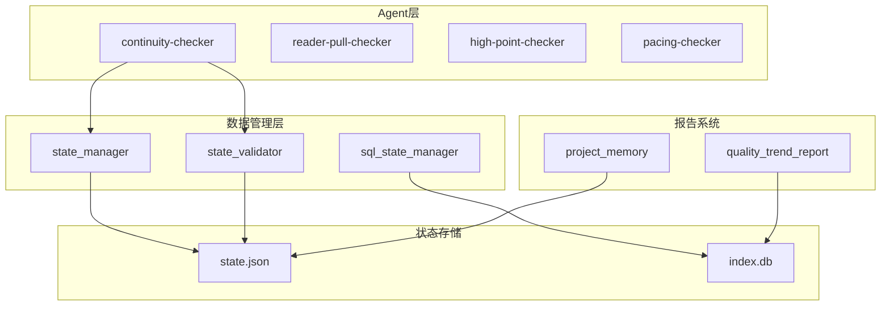
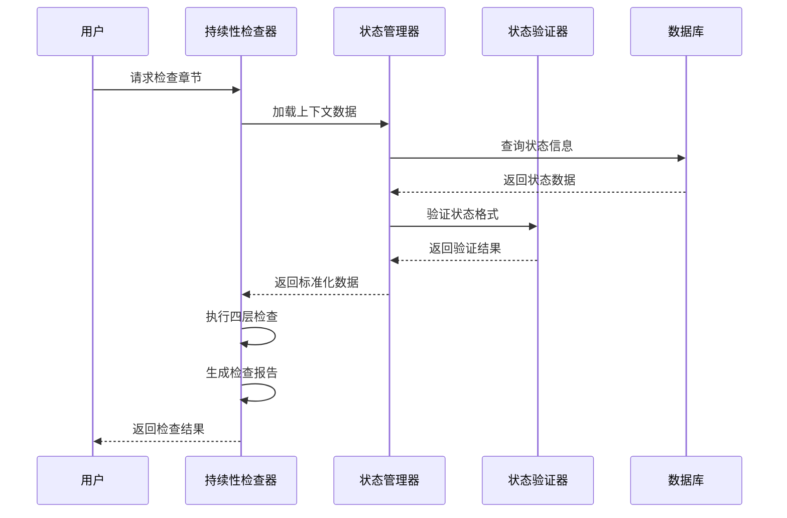
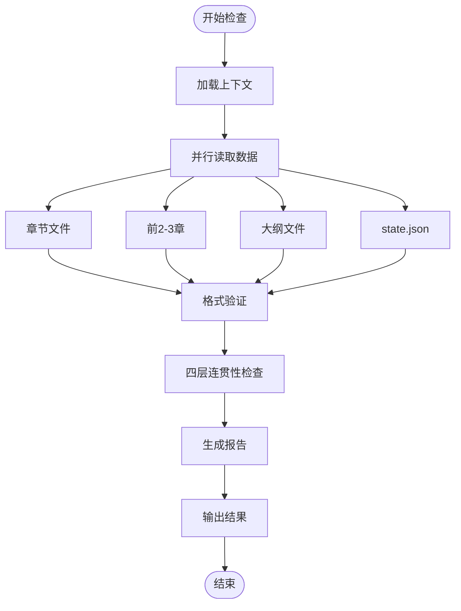
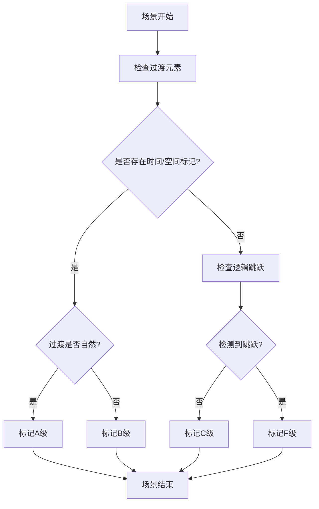
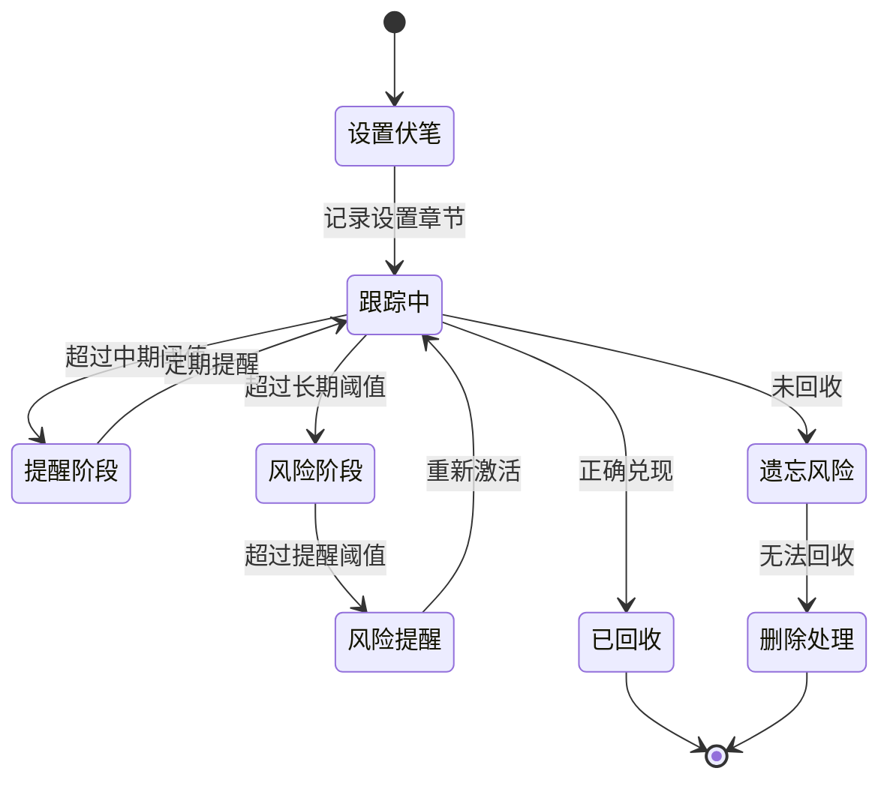
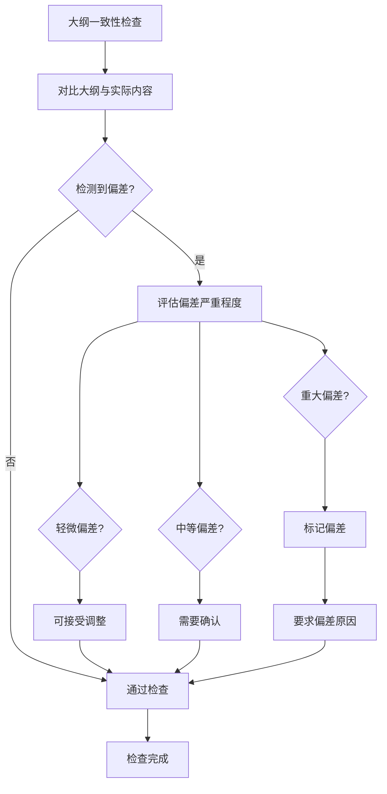
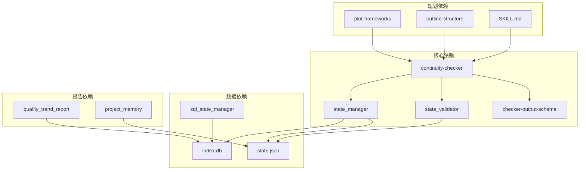

# 持续性检查器

<cite>
**本文档引用的文件**
- [continuity-checker.md](file://webnovel-writer/agents/continuity-checker.md)
- [checker-output-schema.md](file://webnovel-writer/references/checker-output-schema.md)
- [state_validator.py](file://webnovel-writer/scripts/data_modules/state_validator.py)
- [state_manager.py](file://webnovel-writer/scripts/data_modules/state_manager.py)
- [sql_state_manager.py](file://webnovel-writer/scripts/data_modules/sql_state_manager.py)
- [project-memory-schema.md](file://webnovel-writer/references/project-memory-schema.md)
- [quality_trend_report.py](file://webnovel-writer/scripts/quality_trend_report.py)
- [plot-frameworks.md](file://webnovel-writer/skills/webnovel-plan/references/outlining/plot-frameworks.md)
- [outline-structure.md](file://webnovel-writer/skills/webnovel-plan/references/outlining/outline-structure.md)
- [SKILL.md](file://webnovel-writer/skills/webnovel-plan/SKILL.md)
</cite>

## 目录
1. [简介](#简介)
2. [项目结构](#项目结构)
3. [核心组件](#核心组件)
4. [架构概览](#架构概览)
5. [详细组件分析](#详细组件分析)
6. [依赖分析](#依赖分析)
7. [性能考虑](#性能考虑)
8. [故障排除指南](#故障排除指南)
9. [结论](#结论)
10. [附录](#附录)

## 简介
持续性检查器是Webnovel Writer项目中的核心质量保障组件，专门负责评估和维护叙事的连贯性。该检查器通过多层次的分析算法，确保场景转换的自然流畅、情节线的完整连贯、伏笔的有效管理和逻辑的一致性。

持续性检查器不仅关注单章的质量，更重要的是维护整个故事的结构性完整性，包括：
- 情节连贯性评估
- 角色动机一致性检查  
- 主题延续性监控
- 历史对比分析
- 趋势预测与预警

## 项目结构
Webnovel Writer采用模块化的项目结构，持续性检查器作为Agent层的重要组成部分，与数据管理层、状态管理器和报告系统紧密集成。

**图表来源**
- [continuity-checker.md:1-251](file://webnovel-writer/agents/continuity-checker.md#L1-L251)
- [state_manager.py:1-800](file://webnovel-writer/scripts/data_modules/state_manager.py#L1-L800)
- [sql_state_manager.py:1-200](file://webnovel-writer/scripts/data_modules/sql_state_manager.py#L1-L200)

**章节来源**
- [continuity-checker.md:1-251](file://webnovel-writer/agents/continuity-checker.md#L1-L251)
- [state_manager.py:1-800](file://webnovel-writer/scripts/data_modules/state_manager.py#L1-L800)

## 核心组件
持续性检查器的核心功能围绕四个层次的连贯性检查展开，每个层次都有明确的评估标准和修复建议。

### 四层连贯性检查体系
持续性检查器采用分层检查的方法，确保从微观到宏观的全面覆盖：

1. **场景转换流畅度检查**
   - 评估章节间的过渡自然性
   - 检查时间、空间标记的完整性
   - 识别逻辑跳跃和断裂点

2. **情节线连贯性检查**
   - 追踪主线和支线的发展轨迹
   - 检测情节线的引入、发展和解决
   - 识别烂尾、突兀和遗忘问题

3. **伏笔管理系统**
   - 分类管理短期、中期、长期伏笔
   - 跟踪伏笔回收的时机和效果
   - 评估伏笔的可见度和可记忆性

4. **逻辑一致性检查**
   - 检测前后矛盾和逻辑漏洞
   - 验证因果关系的合理性
   - 识别时间线和空间上的不一致

**章节来源**
- [continuity-checker.md:42-171](file://webnovel-writer/agents/continuity-checker.md#L42-L171)

## 架构概览
持续性检查器的架构设计体现了现代软件工程的最佳实践，通过清晰的职责分离和数据流管理实现高效的持续性评估。

**图表来源**
- [continuity-checker.md:20-41](file://webnovel-writer/agents/continuity-checker.md#L20-L41)
- [state_manager.py:208-370](file://webnovel-writer/scripts/data_modules/state_manager.py#L208-L370)

### 数据流架构
持续性检查器的数据流采用异步加载和并行处理的设计，确保检查效率和准确性：

**图表来源**
- [continuity-checker.md:22-41](file://webnovel-writer/agents/continuity-checker.md#L22-L41)

## 详细组件分析

### 场景转换流畅度检查
场景转换检查是持续性评估的基础，主要关注章节间的自然过渡和逻辑连贯性。

#### 评估标准
场景转换的评估采用等级制评分系统：

| 等级 | 标准 | 特征 |
|------|------|------|
| A级 | 自然过渡 + 时间/空间标记清晰 | 过渡句完整，时间流逝明确，空间转换自然 |
| B级 | 有过渡但略显生硬 | 基本过渡存在，但表达不够自然 |
| C级 | 缺少过渡，靠读者推测 | 明显的逻辑跳跃，需要读者自行填补 |
| F级 | 完全断裂，逻辑跳跃 | 严重的时空错乱，完全不可理解 |

#### 检查算法
场景转换检查采用基于模式匹配的算法，通过分析章节间的文本特征来评估转换质量：

**图表来源**
- [continuity-checker.md:44-64](file://webnovel-writer/agents/continuity-checker.md#L44-L64)

**章节来源**
- [continuity-checker.md:44-64](file://webnovel-writer/agents/continuity-checker.md#L44-L64)

### 情节线连贯性检查
情节线检查专注于追踪故事的主要线索和次要线索的发展轨迹，确保故事结构的完整性。

#### 情节线分类
持续性检查器将情节线分为三个主要类别：

1. **主线（Main Thread）**
   - 当前的核心任务和目标
   - 通常推动故事的主要发展方向
   - 与主角的最终目标密切相关

2. **支线（Sub-threads）**
   - 次要的任务和悬念
   - 丰富故事层次和深度
   - 为后续情节发展做铺垫

3. **装饰性线索（Decorative）**
   - 轻微的背景元素
   - 主要用于环境营造
   - 对主线影响较小

#### 检查矩阵
情节线检查采用以下标准：

| 检查类型 | 问题描述 | 严重程度 | 处理建议 |
|----------|----------|----------|----------|
| 烂尾问题 | 引入但从未解决的情节线 | 高 | 补充解决方案或删除线索 |
| 突兀问题 | 无合理铺垫就解决的问题 | 中 | 添加必要的前置条件 |
| 遗忘问题 | 中途停止发展的线索 | 中 | 重新激活或合理收束 |

**章节来源**
- [continuity-checker.md:65-88](file://webnovel-writer/agents/continuity-checker.md#L65-L88)

### 伏笔管理系统
伏笔管理是持续性检查的核心功能之一，通过科学的分类和跟踪机制确保故事的内在逻辑一致性。

#### 伏笔分类体系
伏笔根据设置到兑现的时间跨度进行分类：

| 类型 | 时间跨度 | 风险等级 | 特征 |
|------|----------|----------|------|
| 短期伏笔 | 1-3章 | 低 | 容易记住，风险较低 |
| 中期伏笔 | 4-10章 | 中等 | 需要定期提醒，有一定遗忘风险 |
| 长期伏笔 | 10+章 | 高 | 需要明确标记，遗忘风险高 |

#### 伏笔跟踪算法
伏笔管理系统采用实时跟踪机制，通过以下步骤确保伏笔的有效管理：

**图表来源**
- [continuity-checker.md:90-114](file://webnovel-writer/agents/continuity-checker.md#L90-L114)

**章节来源**
- [continuity-checker.md:90-114](file://webnovel-writer/agents/continuity-checker.md#L90-L114)

### 逻辑一致性检查
逻辑一致性检查是确保故事内在合理性的关键环节，通过严格的推理验证来识别潜在的问题。

#### 逻辑漏洞识别
持续性检查器采用多维度的逻辑验证机制：

1. **前后一致性检查**
   - 检查角色行为的一致性
   - 验证知识和能力的前后关联
   - 识别时间线上的矛盾

2. **因果关系验证**
   - 确保事件之间的因果逻辑
   - 验证能力获得的合理性
   - 检查外部因素的影响

3. **空间逻辑检查**
   - 验证角色位置的合理性
   - 检查物品位置的变化
   - 确认场景转换的可行性

**章节来源**
- [continuity-checker.md:115-134](file://webnovel-writer/agents/continuity-checker.md#L115-L134)

### 大纲一致性检查
大纲一致性检查确保章节内容与整体规划保持一致，维护故事的宏观结构完整性。

#### 偏差评估体系
大纲偏差按照严重程度分为三个等级：

| 偏差等级 | 严重程度 | 处理方式 | 示例 |
|----------|----------|----------|------|
| 轻微偏差 | 细节优化 | 可接受 | 战斗强度调整 |
| 中等偏差 | 情节调整 | 需要确认 | 主要情节改动 |
| 重大偏差 | 核心冲突变化 | 必须标记 | 故事走向改变 |

#### 偏差处理流程

**图表来源**
- [continuity-checker.md:136-155](file://webnovel-writer/agents/continuity-checker.md#L136-L155)

**章节来源**
- [continuity-checker.md:136-155](file://webnovel-writer/agents/continuity-checker.md#L136-L155)

### 拖沓检查机制
拖沓检查专门识别和处理故事节奏问题，确保叙述的紧凑性和吸引力。

#### 拖沓识别标准
拖沓检查关注以下典型问题：

1. **重复场景**
   - 连续章节描述相同或相似的内容
   - 缺乏新的信息或进展
   - 重复的描述和动作

2. **冗余信息**
   - 过度的背景描述
   - 无关紧要的细节
   - 可以省略的对话

3. **节奏失衡**
   - 过长的平静段落
   - 缺乏足够的冲突和张力
   - 事件分布不均匀

**章节来源**
- [continuity-checker.md:156-171](file://webnovel-writer/agents/continuity-checker.md#L156-L171)

## 依赖分析
持续性检查器的依赖关系体现了其在整个系统中的核心地位，与其他组件形成紧密的协作网络。

**图表来源**
- [checker-output-schema.md:1-169](file://webnovel-writer/references/checker-output-schema.md#L1-L169)
- [state_manager.py:1-800](file://webnovel-writer/scripts/data_modules/state_manager.py#L1-L800)

### 数据依赖关系
持续性检查器的数据依赖呈现层次化结构：

1. **直接依赖**
   - checker-output-schema：统一输出格式
   - state_validator：状态数据验证
   - state_manager：状态数据访问

2. **间接依赖**
   - state.json：基础状态存储
   - index.db：大数据存储
   - 项目内存：长期模式存储

3. **外部依赖**
   - 规划框架：故事结构指导
   - 报告系统：趋势分析支持

**章节来源**
- [checker-output-schema.md:1-169](file://webnovel-writer/references/checker-output-schema.md#L1-L169)
- [state_manager.py:1-800](file://webnovel-writer/scripts/data_modules/state_manager.py#L1-L800)

## 性能考虑
持续性检查器在设计时充分考虑了性能优化，采用多种策略确保高效运行。

### 并行处理优化
检查器采用并行读取策略，最大化利用系统资源：

- **并行文件读取**：同时加载目标章节、前几章、大纲和状态文件
- **异步数据处理**：各检查层独立处理，减少相互等待
- **缓存机制**：重复访问的数据进行缓存，避免重复计算

### 内存管理策略
针对大型项目的内存使用进行了专门优化：

- **增量处理**：只加载必要的数据片段
- **流式处理**：大文件采用流式读取方式
- **垃圾回收**：及时清理不需要的对象引用

### 扩展性设计
检查器具有良好的扩展性，支持未来功能的添加：

- **插件化架构**：新的检查规则可以作为插件添加
- **配置驱动**：通过配置文件调整检查参数
- **API接口**：提供标准化的接口供其他组件调用

## 故障排除指南
持续性检查器提供了完善的错误处理和故障排除机制。

### 常见问题诊断
1. **检查结果异常**
   - 检查输入参数的正确性
   - 验证目标章节文件的存在性
   - 确认状态文件的完整性

2. **性能问题**
   - 检查磁盘I/O性能
   - 监控内存使用情况
   - 验证数据库连接状态

3. **数据不一致**
   - 运行状态验证器检查数据格式
   - 检查文件权限和访问权限
   - 验证数据完整性

### 修复建议
针对不同类型的问题，提供相应的修复策略：

1. **格式问题**：使用状态验证器自动修复
2. **数据缺失**：检查文件路径和权限设置
3. **性能瓶颈**：优化并行处理参数
4. **逻辑错误**：检查检查规则配置

**章节来源**
- [continuity-checker.md:236-251](file://webnovel-writer/agents/continuity-checker.md#L236-L251)

## 结论
持续性检查器作为Webnovel Writer项目的核心质量保障组件，通过科学的算法设计和严谨的执行流程，为创作者提供了强大的叙事连贯性保护。其多层次的检查体系、智能化的数据处理能力和完善的质量保证机制，确保了作品在复杂叙事结构中的完整性。

该检查器不仅解决了技术层面的问题，更重要的是为创作者提供了持续改进的指导，通过量化指标和趋势分析帮助提升作品质量。随着项目的不断发展，持续性检查器将继续演进，为网络文学创作提供更加智能和高效的支撑。

## 附录

### 评估参数详解
持续性检查器使用以下核心评估参数：

| 参数类别 | 参数名称 | 评估范围 | 重要性 |
|----------|----------|----------|--------|
| 场景转换 | transition_grade | A-F | 高 |
| 情节线 | active_threads | 数量 | 高 |
| 伏笔管理 | forgotten_foreshadowing | 数量 | 中 |
| 逻辑一致性 | logic_holes | 数量 | 高 |
| 大纲一致性 | outline_deviations | 数量 | 高 |

### 监控方法
持续性检查器采用多维度的监控方法：

1. **实时监控**：单章检查即时反馈
2. **趋势监控**：历史数据分析
3. **对比监控**：章节间差异分析
4. **预警监控**：潜在问题提前识别

### 质量保证措施
为确保检查结果的准确性和可靠性，实施以下质量保证措施：

1. **多层验证**：检查结果的交叉验证
2. **人工复核**：重要问题的人工确认
3. **持续改进**：基于反馈的算法优化
4. **文档记录**：完整的检查过程记录