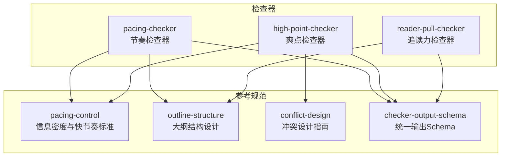
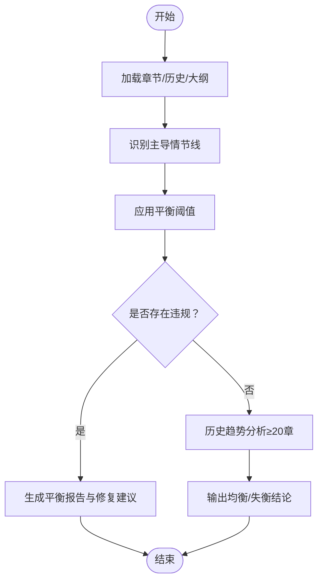
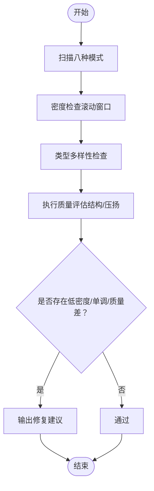
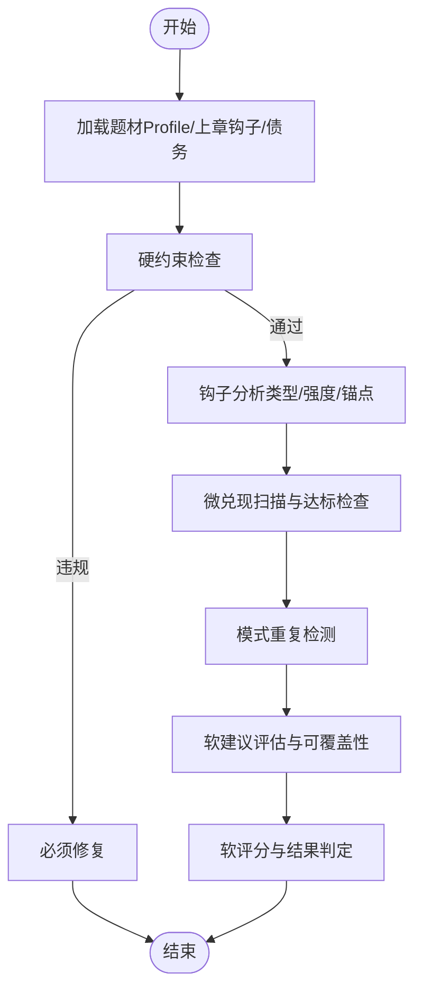
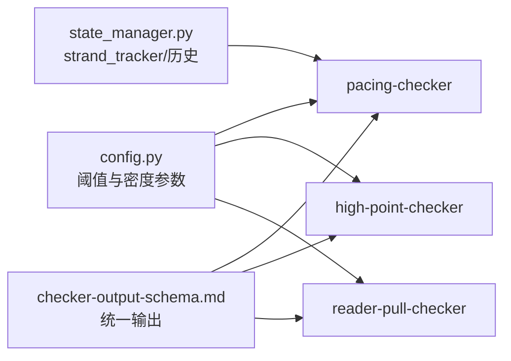

# 节奏控制器

<cite>
**本文引用的文件**
- [pacing-checker.md](file://webnovel-writer/agents/pacing-checker.md)
- [high-point-checker.md](file://webnovel-writer/agents/high-point-checker.md)
- [reader-pull-checker.md](file://webnovel-writer/agents/reader-pull-checker.md)
- [pacing-control.md](file://webnovel-writer/skills/webnovel-review/references/pacing-control.md)
- [checker-output-schema.md](file://webnovel-writer/references/checker-output-schema.md)
- [config.py](file://webnovel-writer/scripts/data_modules/config.py)
- [state_manager.py](file://webnovel-writer/scripts/data_modules/state_manager.py)
- [outline-structure.md](file://webnovel-writer/skills/webnovel-plan/references/outlining/outline-structure.md)
- [conflict-design.md](file://webnovel-writer/skills/webnovel-plan/references/outlining/conflict-design.md)
</cite>

## 目录
1. [简介](#简介)
2. [项目结构](#项目结构)
3. [核心组件](#核心组件)
4. [架构总览](#架构总览)
5. [详细组件分析](#详细组件分析)
6. [依赖分析](#依赖分析)
7. [性能考量](#性能考量)
8. [故障排查指南](#故障排查指南)
9. [结论](#结论)
10. [附录](#附录)

## 简介
本文件面向“节奏控制器”的技术文档，聚焦于小说节奏控制的核心算法与判断标准，涵盖情节推进速度、冲突密度分析与读者注意力管理。文档系统阐述节奏检查的量化指标、评估模型与优化建议，详解与章节长度、冲突设计和高潮分布的关系，并提供节奏问题识别、改进建议与最佳实践案例。最后给出配置参数、性能调优与质量评估方法，帮助在写作与润色流程中实现稳定的节奏控制。

## 项目结构
节奏控制器由“检查器”与“参考规范”两大类文件构成：
- 检查器：负责对单章或章节区间进行节奏、爽点、追读力的结构化评估与输出。
- 参考规范：提供节奏密度、冲突设计、大纲结构等方法论与阈值标准。



**图表来源**
- [pacing-checker.md:1-216](file://webnovel-writer/agents/pacing-checker.md#L1-L216)
- [high-point-checker.md:1-218](file://webnovel-writer/agents/high-point-checker.md#L1-L218)
- [reader-pull-checker.md:1-318](file://webnovel-writer/agents/reader-pull-checker.md#L1-L318)
- [pacing-control.md:1-130](file://webnovel-writer/skills/webnovel-review/references/pacing-control.md#L1-L130)
- [outline-structure.md:1-214](file://webnovel-writer/skills/webnovel-plan/references/outlining/outline-structure.md#L1-L214)
- [conflict-design.md:1-278](file://webnovel-writer/skills/webnovel-plan/references/outlining/conflict-design.md#L1-L278)
- [checker-output-schema.md:1-169](file://webnovel-writer/references/checker-output-schema.md#L1-L169)

**章节来源**
- [pacing-checker.md:1-216](file://webnovel-writer/agents/pacing-checker.md#L1-L216)
- [high-point-checker.md:1-218](file://webnovel-writer/agents/high-point-checker.md#L1-L218)
- [reader-pull-checker.md:1-318](file://webnovel-writer/agents/reader-pull-checker.md#L1-L318)
- [pacing-control.md:1-130](file://webnovel-writer/skills/webnovel-review/references/pacing-control.md#L1-L130)
- [outline-structure.md:1-214](file://webnovel-writer/skills/webnovel-plan/references/outlining/outline-structure.md#L1-L214)
- [conflict-design.md:1-278](file://webnovel-writer/skills/webnovel-plan/references/outlining/conflict-design.md#L1-L278)
- [checker-output-schema.md:1-169](file://webnovel-writer/references/checker-output-schema.md#L1-L169)

## 核心组件
- 节奏检查器（Strand Weave 平衡）：识别章节主导情节线，计算各线占比与连续/间隔，输出平衡状态与修复建议。
- 爽点检查器（Cool Point 密度）：识别八种标准执行模式，评估密度、类型多样性和执行质量，输出评级与改进建议。
- 追读力检查器（Reader Pull）：校验钩子、微兑现、模式重复与节奏自然性，提供硬约束与软建议，支持 Override Contract 与债务管理。

**章节来源**
- [pacing-checker.md:14-216](file://webnovel-writer/agents/pacing-checker.md#L14-L216)
- [high-point-checker.md:19-218](file://webnovel-writer/agents/high-point-checker.md#L19-L218)
- [reader-pull-checker.md:19-318](file://webnovel-writer/agents/reader-pull-checker.md#L19-L318)

## 架构总览
节奏控制器在统一输出 Schema 下协同工作，形成“输入章节/区间 → 多维度检查 → 结构化报告 → 修复建议”的闭环。

```mermaid
sequenceDiagram
participant U as "用户/CI"
participant PC as "pacing-checker"
participant HPC as "high-point-checker"
participant RPC as "reader-pull-checker"
participant CFG as "配置/阈值"
participant SM as "state.json/strand_tracker"
U->>PC : "输入章节/区间"
U->>HPC : "输入章节/区间"
U->>RPC : "输入章节正文/上章钩子"
PC->>SM : "读取 strand_tracker 历史"
PC->>CFG : "读取节奏阈值"
HPC->>CFG : "读取密度/多样性阈值"
RPC->>CFG : "读取题材Profile/钩子/微兑现阈值"
PC-->>U : "节奏报告(JSON)"
HPC-->>U : "爽点报告(JSON)"
RPC-->>U : "追读力报告(JSON)"
Note over PC,HPC,RPC : "统一输出Schema，支持聚合与趋势分析"
```

**图表来源**
- [pacing-checker.md:22-216](file://webnovel-writer/agents/pacing-checker.md#L22-L216)
- [high-point-checker.md:25-218](file://webnovel-writer/agents/high-point-checker.md#L25-L218)
- [reader-pull-checker.md:216-318](file://webnovel-writer/agents/reader-pull-checker.md#L216-L318)
- [checker-output-schema.md:10-169](file://webnovel-writer/references/checker-output-schema.md#L10-L169)
- [config.py:288-304](file://webnovel-writer/scripts/data_modules/config.py#L288-L304)

## 详细组件分析

### 节奏检查器（Strand Weave 平衡）
- 输入与上下文
  - 目标章节或区间
  - 并行读取：章节正文、strand_tracker 历史、大纲预期弧线
  - 可选：status_reporter 自动化分析
- 情节线分类
  - 主线（Quest）、感情线（Fire）、世界观线（Constellation）
  - 主导线判定：章节内容占比 ≥ 60%
- 平衡检查（阈值）
  - Quest 过载：连续 ≥ 5 章
  - Fire 干旱：距离上次 > 10 章
  - Constellation 缺席：距离上次 > 15 章
- 理想分布与影响
  - Quest：55%-65%，连续过长导致战斗疲劳
  - Fire：20%-30%，干旱导致人物关系停滞
  - Constellation：10%-20%，缺失导致世界观单薄
- 历史趋势分析
  - ≥ 20 章历史：生成分布图，判断均衡与否
- 报告与建议
  - 输出主导线、连续/间隔状态、历史趋势、修复建议与下一章节奏建议
  - 成功标准：最近 10 章单一情节线不超过 70%；所有线在阈值内至少出现一次



**图表来源**
- [pacing-checker.md:46-142](file://webnovel-writer/agents/pacing-checker.md#L46-L142)

**章节来源**
- [pacing-checker.md:14-216](file://webnovel-writer/agents/pacing-checker.md#L14-L216)
- [checker-output-schema.md:129-143](file://webnovel-writer/references/checker-output-schema.md#L129-L143)

### 爽点检查器（Cool Point 密度与质量）
- 模式识别
  - 装逼打脸、扮猪吃虎、越级反杀、打脸权威、反派翻车、甜蜜超预期、迪化误解、身份掉马
- 密度检查
  - 每章优先有爽点或同等兑现；滚动窗口：每 5 章建议 ≥ 1 组合爽点；每 10-15 章建议 ≥ 1 里程碑爽点
- 类型多样性
  - 单一类型不得超过 80%，避免单调
- 执行质量评估
  - 铺垫充分性、反转冲击、情绪回报、30/40/30 结构、压扬比例（题材适配）
  - 评级：A（优秀）、B（良好）、C（及格）、F（失败）
- 报告与建议
  - 密度、类型分布、质量评级、问题定位与修复建议
  - 成功标准：密度健康、类型多样、平均质量评级 ≥ B



**图表来源**
- [high-point-checker.md:83-196](file://webnovel-writer/agents/high-point-checker.md#L83-L196)

**章节来源**
- [high-point-checker.md:19-218](file://webnovel-writer/agents/high-point-checker.md#L19-L218)
- [pacing-control.md:12-130](file://webnovel-writer/skills/webnovel-review/references/pacing-control.md#L12-L130)

### 追读力检查器（Reader Pull）
- 约束分层
  - 硬约束：可读性底线、承诺违背、节奏灾难、冲突真空（必须修复）
  - 软建议：下章动机、期待锚点、钩子强度/类型、微兑现数量、模式重复、期待过载、节奏自然性（可覆盖）
- 钩子与微兑现
  - 钩子类型：危机、悬念、情绪、选择、渴望
  - 微兑现：信息、关系、能力、资源、认可、情绪、线索
- Override Contract 与债务
  - 可覆盖场景与理由类型；债务按题材 profile 的乘数计算，每章利息 10%；超期变为 overdue
- 报告与评分
  - 硬约束未通过即未通过；软评分 85+ 通过，70-84 通过（有警告），50-69 条件通过（可通过 Override），<50 未通过



**图表来源**
- [reader-pull-checker.md:216-318](file://webnovel-writer/agents/reader-pull-checker.md#L216-L318)

**章节来源**
- [reader-pull-checker.md:19-318](file://webnovel-writer/agents/reader-pull-checker.md#L19-L318)

### 信息密度与快节奏标准（节奏控制）
- 信息密度标准
  - 每 1000 字至少推进 1 个实质性剧情点
  - 实质性剧情点：获得新信息/线索/能力、人际关系变化、战力提升/突破/新招式、剧情转折、伏笔埋下/回收
- 评分与模板
  - 信息密度与爽点数量、无效内容对应不同判定
  - 快节奏 vs 慢节奏：修炼、铺垫、决策、副本的节奏差异
  - 标准章节与过渡章节结构模板
- 分题材节奏标准
  - 玄幻修仙、都市爽文、悬疑推理、知乎短篇的密度与铺垫容忍度

**章节来源**
- [pacing-control.md:12-130](file://webnovel-writer/skills/webnovel-review/references/pacing-control.md#L12-L130)

### 大纲结构与冲突设计（节奏与高潮分布）
- 大纲三层架构
  - 骨架大纲：起承转合
  - 分卷大纲：每卷小目标与卷末高潮
  - 章节大纲：细化到每章核心内容
- 冲突设计
  - 三大层次：外部、内部、理念
  - 冲突强度分级：S/A/B/C
  - 冲突升级机制：小冲突 → 误会加深 → 利益纠葛 → 不死不休
  - 冲突密度：每 10 章至少 1 个 B 级或以上冲突；理想状态每 5 章 1 小冲突 + 每 20 章 1 大冲突
  - 多线冲突交织与解决方式（武力、智谋、和解、搁置）

**章节来源**
- [outline-structure.md:10-214](file://webnovel-writer/skills/webnovel-plan/references/outlining/outline-structure.md#L10-L214)
- [conflict-design.md:7-278](file://webnovel-writer/skills/webnovel-plan/references/outlining/conflict-design.md#L7-L278)

## 依赖分析
- 配置与阈值
  - 节奏阈值：Quest 连续上限、Fire/Constellation 间隔上限
  - 比例区间：Quest/Fire/Constellation 的最小/最大占比
  - 信息密度阈值：优秀/良好/及格的字数/点标准
- 状态与历史
  - strand_tracker：记录 last_quest/fire/constellation 章节与历史，支撑平衡检查
  - state.json：统一输出 Schema 的 metrics 字段承载各检查器指标



**图表来源**
- [config.py:288-304](file://webnovel-writer/scripts/data_modules/config.py#L288-L304)
- [state_manager.py:167-177](file://webnovel-writer/scripts/data_modules/state_manager.py#L167-L177)
- [checker-output-schema.md:129-143](file://webnovel-writer/references/checker-output-schema.md#L129-L143)

**章节来源**
- [config.py:288-304](file://webnovel-writer/scripts/data_modules/config.py#L288-L304)
- [state_manager.py:167-177](file://webnovel-writer/scripts/data_modules/state_manager.py#L167-L177)
- [checker-output-schema.md:129-143](file://webnovel-writer/references/checker-output-schema.md#L129-L143)

## 性能考量
- 并行读取与批处理
  - 检查器并行读取章节、历史与大纲，减少等待时间
- 阈值与窗口
  - 使用滚动窗口与固定周期阈值，避免一次性扫描带来的计算压力
- 状态与索引
  - strand_tracker 与 index.db 的历史数据可复用，减少重复计算
- 输出聚合
  - 统一输出 Schema 便于批量聚合与趋势分析，降低下游处理成本

[本节为通用性能讨论，无需特定文件来源]

## 故障排查指南
- 节奏检查器
  - 问题：Quest 连续过长、Fire 干旱、Constellation 缺席
  - 排查：检查 strand_tracker 历史与最近章节主导线占比
  - 建议：在下一章安排 Fire 或 Constellation 线，或在连续 Quest 后插入感情/世界观场景
- 爽点检查器
  - 问题：密度低、类型单调、质量差
  - 排查：确认滚动窗口内是否出现组合/里程碑爽点；检查执行结构与压扬比例
  - 建议：补充模式、增加多样性、强化铺垫与余波
- 追读力检查器
  - 问题：硬约束违规、钩子强度不足、微兑现不足、模式重复
  - 排查：核对题材 Profile、上章钩子兑现、微兑现类型与数量
  - 建议：增强钩子强度与类型匹配、增加微兑现、避免连续同型模式；必要时提交 Override Contract 并制定还债计划

**章节来源**
- [pacing-checker.md:86-142](file://webnovel-writer/agents/pacing-checker.md#L86-L142)
- [high-point-checker.md:116-196](file://webnovel-writer/agents/high-point-checker.md#L116-L196)
- [reader-pull-checker.md:66-318](file://webnovel-writer/agents/reader-pull-checker.md#L66-L318)

## 结论
节奏控制器通过“Strand Weave 平衡 + 爽点密度 + 追读力”三位一体的检查体系，实现对小说节奏的量化评估与优化建议。结合大纲结构与冲突设计方法论，可有效避免战斗疲劳、人物关系停滞与世界观单薄，提升读者注意力与追读意愿。统一输出 Schema 保证了跨检查器的可比性与可自动化聚合，为持续的质量改进提供数据基础。

[本节为总结性内容，无需特定文件来源]

## 附录

### 配置参数与阈值
- 节奏阈值
  - Quest 最大连续：5 章
  - Fire 最大间隔：10 章
  - Constellation 最大间隔：15 章
- 比例区间
  - Quest：55%-65%
  - Fire：20%-30%
  - Constellation：10%-20%
- 信息密度
  - 优秀：≤ 1000 字/点
  - 良好：1000-1500 字/点
  - 及格：1500-2000 字/点
  - 不及格：> 2000 字/点

**章节来源**
- [config.py:288-304](file://webnovel-writer/scripts/data_modules/config.py#L288-L304)
- [pacing-control.md:26-33](file://webnovel-writer/skills/webnovel-review/references/pacing-control.md#L26-L33)

### 评估模型与指标
- 节奏检查器指标
  - dominant_strand、quest_ratio、fire_ratio、constellation_ratio、consecutive_quest、fire_gap、constellation_gap、fatigue_risk
- 爽点检查器指标
  - cool_point_count、cool_point_types、density_score、type_diversity、milestone_present、monotony_risk
- 追读力检查器指标
  - hook_present、hook_type、hook_strength、prev_hook_fulfilled、micropayoff_count、micropayoffs、is_transition、debt_balance

**章节来源**
- [checker-output-schema.md:129-143](file://webnovel-writer/references/checker-output-schema.md#L129-L143)

### 最佳实践案例
- 章节结构模板
  - 标准章节：开头承接 + 铺垫引入 + 发展推进 + 高潮爆发 + 结尾余韵
  - 过渡章节：回顾收获 + 新目标 + 准备 + 小冲突 + 悬念
- 大纲节奏
  - 每 5 章 1 小冲突 + 每 20 章 1 大冲突；避免连续 30 章无明显冲突
- 冲突设计
  - 从 C 级 → B 级 → A 级 → S 级逐步升级，避免“一言不合就生死大战”

**章节来源**
- [pacing-control.md:44-62](file://webnovel-writer/skills/webnovel-review/references/pacing-control.md#L44-L62)
- [conflict-design.md:158-177](file://webnovel-writer/skills/webnovel-plan/references/outlining/conflict-design.md#L158-L177)