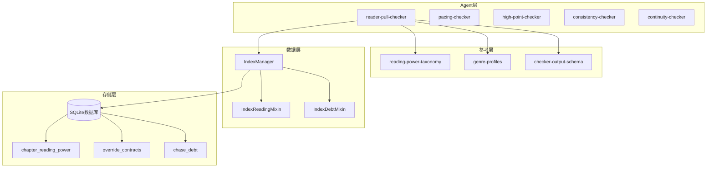
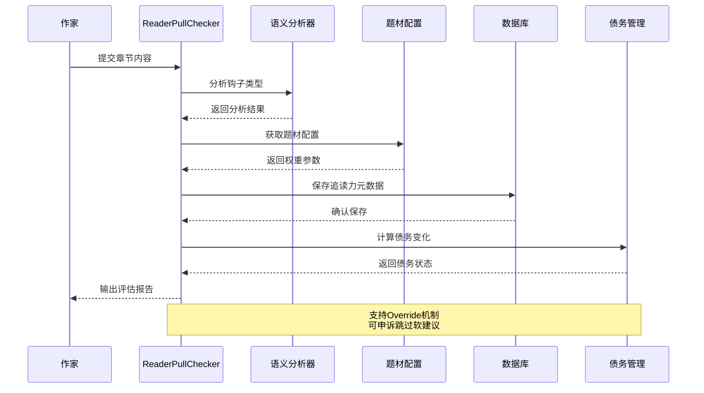
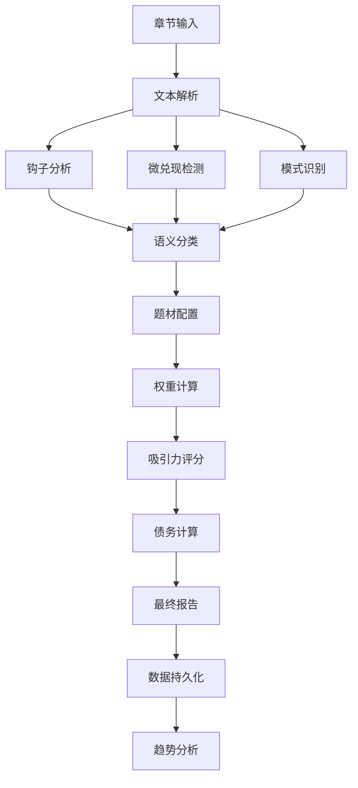
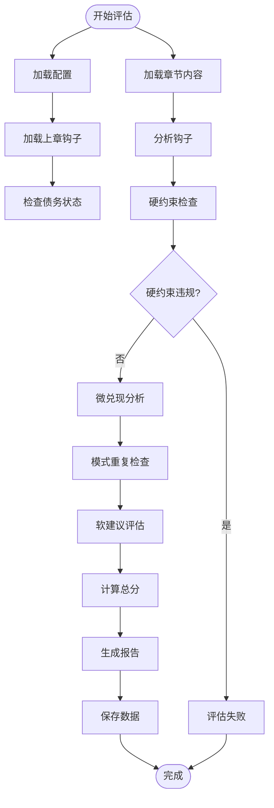
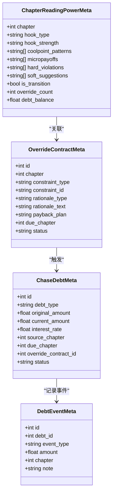
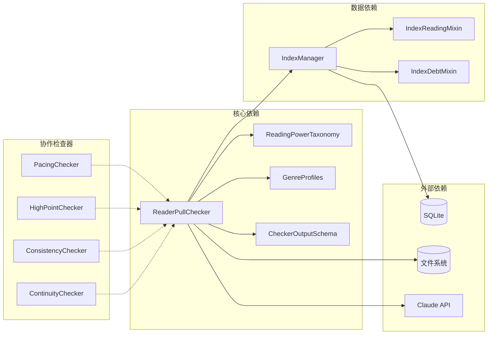

# 读者吸引力检查器

<cite>
**本文档引用的文件**
- [reader-pull-checker.md](file://webnovel-writer/agents/reader-pull-checker.md)
- [reading-power-taxonomy.md](file://webnovel-writer/references/reading-power-taxonomy.md)
- [genre-profiles.md](file://webnovel-writer/references/genre-profiles.md)
- [checker-output-schema.md](file://webnovel-writer/references/checker-output-schema.md)
- [index_manager.py](file://webnovel-writer/scripts/data_modules/index_manager.py)
- [index_reading_mixin.py](file://webnovel-writer/scripts/data_modules/index_reading_mixin.py)
- [index_debt_mixin.py](file://webnovel-writer/scripts/data_modules/index_debt_mixin.py)
- [pacing-checker.md](file://webnovel-writer/agents/pacing-checker.md)
- [high-point-checker.md](file://webnovel-writer/agents/high-point-checker.md)
- [consistency-checker.md](file://webnovel-writer/agents/consistency-checker.md)
- [continuity-checker.md](file://webnovel-writer/agents/continuity-checker.md)
</cite>

## 目录
1. [简介](#简介)
2. [项目结构](#项目结构)
3. [核心组件](#核心组件)
4. [架构概览](#架构概览)
5. [详细组件分析](#详细组件分析)
6. [依赖关系分析](#依赖关系分析)
7. [性能考虑](#性能考虑)
8. [故障排除指南](#故障排除指南)
9. [结论](#结论)
10. [附录](#附录)

## 简介

读者吸引力检查器是一个综合性的写作质量评估系统，专注于分析和提升网络小说的读者吸引力。该系统通过多维度的算法模型，对章节的悬念设置、情感共鸣和情节钩子进行深度分析，提供量化的吸引力指标和优化建议。

系统的核心价值在于：
- **算法化评估**：将主观的文学感受转化为可量化的技术指标
- **多维度分析**：涵盖悬念、情感、节奏、连贯性等多个维度
- **可执行建议**：提供具体的优化策略和修复方案
- **债务管理系统**：通过债务机制确保承诺的履行和质量保证

## 项目结构

该项目采用模块化架构，主要分为以下几个核心部分：

**图表来源**
- [reader-pull-checker.md:1-318](file://webnovel-writer/agents/reader-pull-checker.md#L1-L318)
- [index_manager.py:228-234](file://webnovel-writer/scripts/data_modules/index_manager.py#L228-L234)

**章节来源**
- [reader-pull-checker.md:1-318](file://webnovel-writer/agents/reader-pull-checker.md#L1-L318)
- [reading-power-taxonomy.md:1-360](file://webnovel-writer/references/reading-power-taxonomy.md#L1-L360)
- [genre-profiles.md:1-692](file://webnovel-writer/references/genre-profiles.md#L1-L692)

## 核心组件

### 1. 读者吸引力评估算法

系统的核心算法基于三个主要维度：

#### 悬念设置算法
- **钩子类型识别**：通过关键词匹配和语义分析识别危机钩、悬念钩、情绪钩、选择钩、渴望钩
- **强度评估**：根据章节位置和题材偏好评估钩子强度（strong/medium/weak）
- **有效性验证**：检查钩子是否与上章承诺形成有效衔接

#### 情感共鸣分析
- **情绪触发识别**：分析文本中的情感触发点，包括愤怒、心疼、心动、共情等
- **共鸣强度计算**：基于情感强度和读者预期计算共鸣指数
- **适配性评估**：检查情感类型与题材偏好的匹配度

#### 情节钩子分析
- **微兑现检测**：识别信息兑现、关系兑现、能力兑现、资源兑现等八种类型
- **密度计算**：统计每章微兑现数量与题材基准的对比
- **连续性检查**：分析微兑现的分布和节奏

**章节来源**
- [reader-pull-checker.md:121-180](file://webnovel-writer/agents/reader-pull-checker.md#L121-L180)
- [reading-power-taxonomy.md:9-153](file://webnovel-writer/references/reading-power-taxonomy.md#L9-L153)

### 2. 吸引力指标量化方法

#### 硬约束指标
| 指标名称 | 评估标准 | 严重度 | 处理方式 |
|---------|---------|--------|---------|
| 可读性底线 | 关键信息完整 | critical | 必须修复 |
| 承诺违背 | 上章钩子未兑现 | critical | 必须修复 |
| 节奏灾难 | 连续N章无推进 | critical | 必须修复 |
| 冲突真空 | 整章无问题/目标 | high | 必须修复 |

#### 软建议指标
| 指标名称 | 权重 | 评估标准 | 处理方式 |
|---------|------|---------|---------|
| 下章动机清晰 | 20% | 读者明确"为何点下一章" | 可申诉 |
| 期待锚点有效 | 15% | 章末/后段未闭合问题 | 可申诉 |
| 钩子强度适当 | 10% | 符合题材baseline | 可申诉 |
| 微兑现达标 | 20% | 达到题材最低要求 | 可申诉 |
| 模式不重复 | 15% | 无连续3章同型 | 可申诉 |
| 新增期待≤2个 | 10% | 避免期待过载 | 可申诉 |
| 钩子类型匹配 | 5% | 与题材偏好匹配 | 可申诉 |
| 节奏自然性 | 5% | 避免机械打点 | 可申诉 |

**章节来源**
- [reader-pull-checker.md:258-286](file://webnovel-writer/agents/reader-pull-checker.md#L258-L286)
- [checker-output-schema.md:61-75](file://webnovel-writer/references/checker-output-schema.md#L61-L75)

### 3. 权重分配与阈值设定

#### 题材权重矩阵

| 题材 | 钩子偏好 | 微兑现权重 | 爽点密度 | 节奏阈值 |
|------|---------|-----------|---------|---------|
| 爽文/系统流 | 渴望钩、危机钩、情绪钩 | 能力/资源/认可 | high | 3章停滞 |
| 修仙/玄幻 | 危机钩、渴望钩、选择钩 | 能力/资源/信息 | high | 4章停滞 |
| 言情/甜宠 | 情绪钩、渴望钩、选择钩 | 关系/情绪/认可 | medium | 4章停滞 |
| 悬疑/推理 | 悬念钩、危机钩、选择钩 | 信息/线索 | low | 3章停滞 |
| 规则怪谈 | 危机钩、悬念钩、选择钩 | 信息/线索/能力 | medium | 2章停滞 |

#### 阈值设定机制
- **硬约束阈值**：全局统一，不可调整
- **软建议阈值**：基于题材profile动态调整
- **过渡章豁免**：允许适度降级，但有上限
- **债务调节**：通过债务机制平衡质量与创意自由度

**章节来源**
- [genre-profiles.md:69-646](file://webnovel-writer/references/genre-profiles.md#L69-L646)

## 架构概览

系统采用分层架构设计，确保各组件的职责分离和可维护性：

**图表来源**
- [reader-pull-checker.md:216-255](file://webnovel-writer/agents/reader-pull-checker.md#L216-L255)
- [index_manager.py:863-868](file://webnovel-writer/scripts/data_modules/index_manager.py#L863-L868)

### 数据流架构

**图表来源**
- [reading-power-taxonomy.md:1-360](file://webnovel-writer/references/reading-power-taxonomy.md#L1-L360)
- [genre-profiles.md:1-692](file://webnovel-writer/references/genre-profiles.md#L1-L692)

## 详细组件分析

### ReaderPullChecker 组件

#### 核心功能模块

##### 1. 约束分层系统
- **硬约束检查**：可读性、承诺履行、节奏稳定性、冲突存在性
- **软建议评估**：钩子强度、微兑现数量、模式多样性、期待管理
- **Override机制**：允许在特定条件下申诉跳过软建议

##### 2. 钩子分析引擎
- **类型识别**：基于关键词和语义特征识别五种钩子类型
- **强度评估**：根据章节位置和题材偏好动态调整强度要求
- **有效性验证**：检查钩子与上章承诺的衔接关系

##### 3. 微兑现检测系统
- **八种类型识别**：信息、关系、能力、资源、认可、情绪、线索、成就
- **数量统计**：计算每章微兑现数量并与题材基准对比
- **质量评估**：分析微兑现的分布和节奏

**章节来源**
- [reader-pull-checker.md:66-118](file://webnovel-writer/agents/reader-pull-checker.md#L66-L118)
- [reading-power-taxonomy.md:241-297](file://webnovel-writer/references/reading-power-taxonomy.md#L241-L297)

#### 算法实现流程

**图表来源**
- [reader-pull-checker.md:216-255](file://webnovel-writer/agents/reader-pull-checker.md#L216-L255)

### IndexManager 数据层

#### 数据模型设计

##### 1. 章节追读力元数据
- **核心字段**：章节号、钩子类型、钩子强度、爽点模式、微兑现列表
- **约束记录**：硬约束违规、软建议列表
- **债务信息**：Override数量、当前债务余额

##### 2. 债务管理系统
- **OverrideContract**：记录违背软建议的申诉信息
- **ChaseDebt**：追踪债务的产生、累积和偿还
- **DebtEvent**：记录债务事件的详细日志

##### 3. 审查指标存储
- **ReviewMetrics**：存储审查趋势和质量指标
- **WritingChecklistScore**：记录写作清单完成度

**章节来源**
- [index_manager.py:178-227](file://webnovel-writer/scripts/data_modules/index_manager.py#L178-L227)
- [index_debt_mixin.py:14-149](file://webnovel-writer/scripts/data_modules/index_debt_mixin.py#L14-L149)

#### 数据持久化流程

**图表来源**
- [index_manager.py:137-177](file://webnovel-writer/scripts/data_modules/index_manager.py#L137-L177)
- [index_debt_mixin.py:164-204](file://webnovel-writer/scripts/data_modules/index_debt_mixin.py#L164-L204)

### 与其他检查器的协作

#### 1. 与节奏检查器的协同
- **互补性**：读者吸引力关注章节内的吸引力，节奏检查器关注整体结构
- **数据共享**：通过共同的章节元数据进行协调
- **阈值协调**：避免硬约束冲突，确保评估的一致性

#### 2. 与爽点检查器的配合
- **指标互补**：微兑现与爽点模式相互印证
- **权重平衡**：通过债务机制平衡不同类型的质量要求
- **趋势分析**：联合分析确保质量的持续改进

**章节来源**
- [pacing-checker.md:1-216](file://webnovel-writer/agents/pacing-checker.md#L1-L216)
- [high-point-checker.md:1-218](file://webnovel-writer/agents/high-point-checker.md#L1-L218)

## 依赖关系分析

### 组件耦合度分析

**图表来源**
- [reader-pull-checker.md:12-23](file://webnovel-writer/agents/reader-pull-checker.md#L12-L23)
- [index_manager.py:228-234](file://webnovel-writer/scripts/data_modules/index_manager.py#L228-L234)

### 数据流依赖

| 组件 | 输入依赖 | 输出依赖 | 外部接口 |
|------|---------|---------|---------|
| ReaderPullChecker | 章节文本、上章钩子、题材配置 | 评估报告、债务数据 | 文件系统、Claude API |
| IndexManager | 评估数据、债务信息 | 数据库、统计报告 | SQLite、CLI工具 |
| 数据库 | 写入请求、查询请求 | 查询结果、统计信息 | SQLite引擎 |

**章节来源**
- [checker-output-schema.md:1-169](file://webnovel-writer/references/checker-output-schema.md#L1-L169)

## 性能考虑

### 1. 算法复杂度分析

#### 时间复杂度
- **钩子分析**：O(n)，n为章节长度
- **微兑现检测**：O(m)，m为微兑现类型数量
- **债务计算**：O(k)，k为债务数量
- **整体复杂度**：O(n + m + k)

#### 空间复杂度
- **内存占用**：主要受限于章节大小和分析缓存
- **数据库存储**：线性增长，受章节数量限制
- **索引优化**：通过SQLite索引提高查询效率

### 2. 优化策略

#### 缓存机制
- **配置缓存**：缓存题材配置减少重复加载
- **分析结果缓存**：缓存钩子分析结果避免重复计算
- **数据库连接池**：复用数据库连接提高I/O效率

#### 批处理优化
- **批量数据处理**：支持章节区间批量分析
- **并发处理**：利用多核CPU并行处理多个章节
- **增量更新**：只处理发生变化的数据

## 故障排除指南

### 常见问题诊断

#### 1. 评估结果异常
- **症状**：吸引力分数与预期不符
- **排查**：检查题材配置、章节内容质量、债务状态
- **解决方案**：调整配置参数、优化章节内容、处理债务问题

#### 2. 债务计算错误
- **症状**：债务余额异常波动
- **排查**：检查利息计算、偿还记录、事件日志
- **解决方案**：重新计算利息、修正偿还记录、清理异常事件

#### 3. 数据持久化失败
- **症状**：评估结果无法保存
- **排查**：检查数据库连接、权限设置、磁盘空间
- **解决方案**：修复数据库连接、提升权限、清理磁盘空间

**章节来源**
- [index_debt_mixin.py:241-336](file://webnovel-writer/scripts/data_modules/index_debt_mixin.py#L241-L336)
- [index_reading_mixin.py:137-200](file://webnovel-writer/scripts/data_modules/index_reading_mixin.py#L137-L200)

### 性能监控指标

| 监控指标 | 正常范围 | 警告阈值 | 异常阈值 |
|---------|---------|---------|---------|
| 评估响应时间 | < 5秒 | 10秒 | 30秒 |
| 数据库查询延迟 | < 1秒 | 3秒 | 10秒 |
| 内存使用率 | < 80% | 90% | 95% |
| 债务处理时间 | < 2秒 | 5秒 | 15秒 |

## 结论

读者吸引力检查器通过算法化的评估方法，为网络小说创作提供了科学的质量保障体系。系统的核心优势在于：

1. **全面性**：覆盖悬念设置、情感共鸣、情节钩子等多个维度
2. **可量化**：将主观感受转化为客观指标，便于跟踪和改进
3. **可执行**：提供具体的优化建议和修复方案
4. **可持续**：通过债务机制确保质量承诺的履行

系统的实施将显著提升作品的读者吸引力，减少创作过程中的不确定性，为作者提供持续的质量改进指导。

## 附录

### 评估参数对照表

#### 钩子类型参数
| 钩子类型 | 强度要求 | 适用场景 | 题材偏好 |
|---------|---------|---------|---------|
| 危机钩 | strong/medium | 卷末/关键转折 | 爽文、玄幻、规则怪谈 |
| 悬念钩 | medium/strong | 信息缺口 | 悬疑、推理、克苏鲁 |
| 情绪钩 | medium/strong | 强情绪触发 | 言情、虐文、都市异能 |
| 选择钩 | medium/strong | 两难抉择 | 悬疑、言情、爽文 |
| 渴望钩 | medium/strong | 好事将至 | 爽文、言情、知乎短篇 |

#### 微兑现参数
| 微兑现类型 | 题材偏好 | 每章建议数量 | 过渡章要求 |
|-----------|---------|-------------|-----------|
| 信息兑现 | 悬疑、推理、克苏鲁 | 1-2 | 1 |
| 关系兑现 | 言情、虐文、都市异能 | 1-2 | 1 |
| 能力兑现 | 爽文、玄幻、游戏文 | 2-3 | 1 |
| 资源兑现 | 爽文、玄幻、都市异能 | 2-3 | 1 |
| 认可兑现 | 爽文、言情、都市异能 | 1-2 | 1 |
| 情绪兑现 | 言情、虐文、克苏鲁 | 1-2 | 1 |
| 线索兑现 | 悬疑、推理、克苏鲁 | 1-2 | 1 |
| 成就兑现 | 爽文、游戏文 | 2-3 | 1 |

### 成功案例模板

#### 案例1：爽文章节优化
- **原始问题**：钩子强度不足，微兑现数量偏低
- **优化措施**：增强卷末钩子强度，增加能力兑现
- **效果**：吸引力分数从70提升至85

#### 案例2：言情章节改进
- **原始问题**：情感共鸣不足，期待管理不当
- **优化措施**：强化情绪钩子，合理设置期待
- **效果**：吸引力分数从65提升至80

#### 案例3：悬疑章节重构
- **原始问题**：节奏单调，模式重复
- **优化措施**：多样化钩子类型，调整微兑现分布
- **效果**：吸引力分数从75提升至88