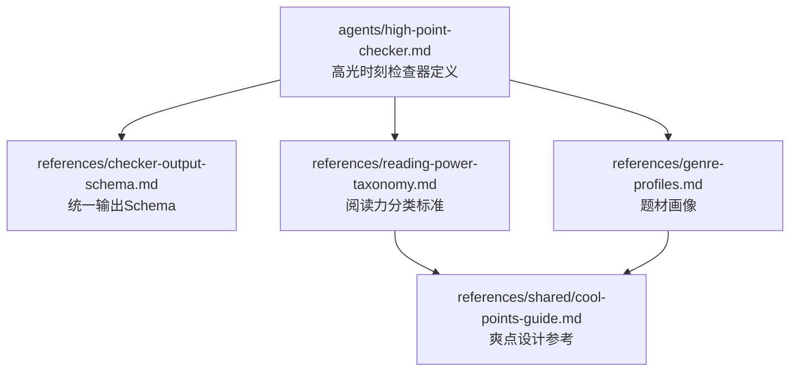
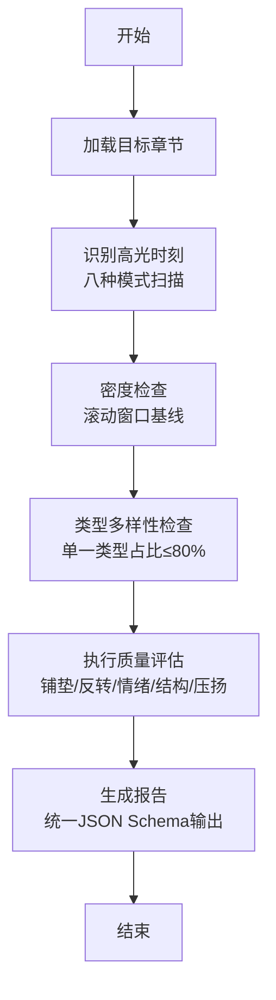
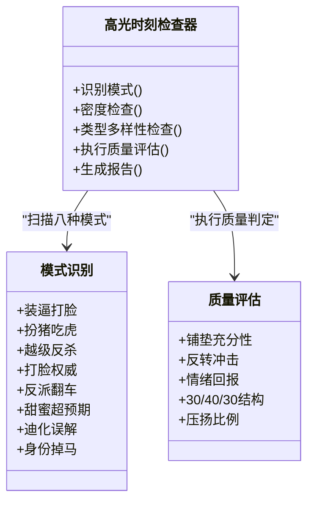
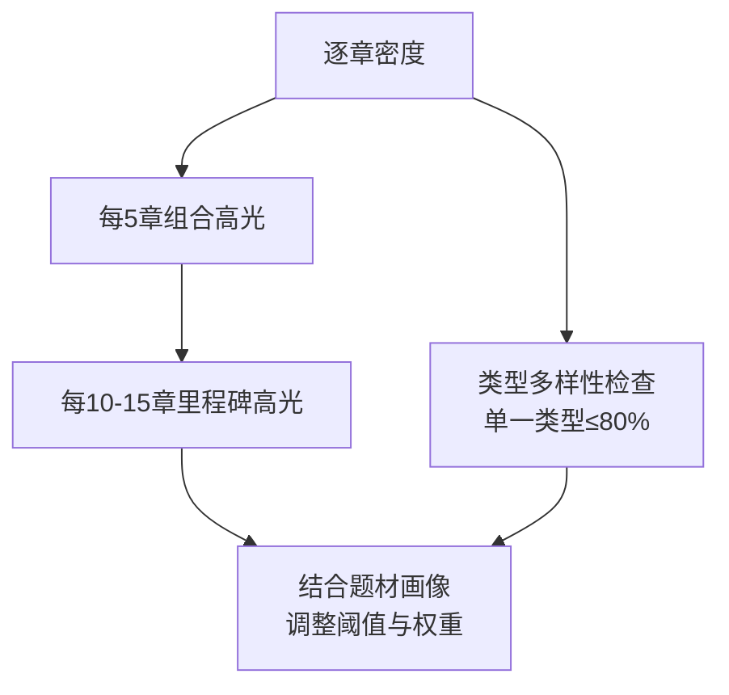
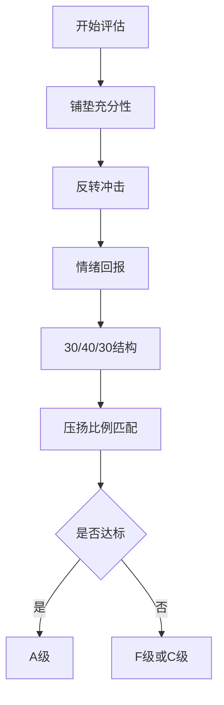
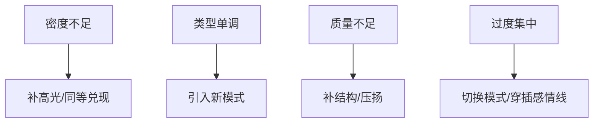
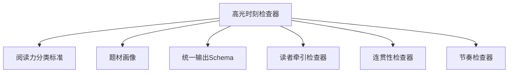

# 高光时刻检查器

<cite>
**本文引用的文件**
- [webnovel-writer/agents/high-point-checker.md](file://webnovel-writer/agents/high-point-checker.md)
- [webnovel-writer/references/checker-output-schema.md](file://webnovel-writer/references/checker-output-schema.md)
- [webnovel-writer/references/reading-power-taxonomy.md](file://webnovel-writer/references/reading-power-taxonomy.md)
- [webnovel-writer/references/genre-profiles.md](file://webnovel-writer/references/genre-profiles.md)
- [webnovel-writer/references/shared/cool-points-guide.md](file://webnovel-writer/references/shared/cool-points-guide.md)
</cite>

## 目录
1. [简介](#简介)
2. [项目结构](#项目结构)
3. [核心组件](#核心组件)
4. [架构总览](#架构总览)
5. [详细组件分析](#详细组件分析)
6. [依赖分析](#依赖分析)
7. [性能考虑](#性能考虑)
8. [故障排查指南](#故障排查指南)
9. [结论](#结论)
10. [附录](#附录)

## 简介
本文件为“高光时刻检查器”的技术文档，面向创作与质量控制场景，系统阐述高光时刻（Cool Point）的识别算法、类型分类、强度评估与分布合理性检查方法。文档同时说明与故事弧线、角色发展、主题表达之间的关系，提供不足与过度识别的判定、优化建议与经典案例指引，并给出评估指标、质量控制与创作指导功能。

## 项目结构
高光时刻检查器以“Agent + 参考规范 + 题材配置”的方式组织，核心文件如下：
- agents 高光时刻检查器定义：负责识别与评估“装逼打脸、扮猪吃虎、越级反杀、打脸权威、反派翻车、甜蜜超预期、迪化误解、身份掉马”等模式，输出结构化报告。
- references 统一输出 Schema：定义所有 Checker 的统一 JSON 输出格式，便于自动化汇总与趋势分析。
- references 阅读力分类标准：提供钩子、微兑现、高光时刻模式的分类与结构化建议。
- references 题材画像：提供各题材的偏好、密度、节奏、约束等配置，用于调整阈值与建议权重。
- references shared 爽点设计参考：提供六种基础模式、三段式结构、压扬比例、密度建议、信息差设计等工程化方法论。

**图表来源**
- [webnovel-writer/agents/high-point-checker.md:1-218](file://webnovel-writer/agents/high-point-checker.md#L1-L218)
- [webnovel-writer/references/checker-output-schema.md:1-169](file://webnovel-writer/references/checker-output-schema.md#L1-L169)
- [webnovel-writer/references/reading-power-taxonomy.md:1-360](file://webnovel-writer/references/reading-power-taxonomy.md#L1-L360)
- [webnovel-writer/references/genre-profiles.md:1-692](file://webnovel-writer/references/genre-profiles.md#L1-L692)
- [webnovel-writer/references/shared/cool-points-guide.md:1-314](file://webnovel-writer/references/shared/cool-points-guide.md#L1-L314)

**章节来源**
- [webnovel-writer/agents/high-point-checker.md:1-218](file://webnovel-writer/agents/high-point-checker.md#L1-L218)
- [webnovel-writer/references/checker-output-schema.md:1-169](file://webnovel-writer/references/checker-output-schema.md#L1-L169)
- [webnovel-writer/references/reading-power-taxonomy.md:1-360](file://webnovel-writer/references/reading-power-taxonomy.md#L1-L360)
- [webnovel-writer/references/genre-profiles.md:1-692](file://webnovel-writer/references/genre-profiles.md#L1-L692)
- [webnovel-writer/references/shared/cool-points-guide.md:1-314](file://webnovel-writer/references/shared/cool-points-guide.md#L1-L314)

## 核心组件
- 高光时刻识别模式
  - 八种标准模式：装逼打脸、扮猪吃虎、越级反杀、打脸权威、反派翻车、甜蜜超预期、迪化误解、身份掉马。
  - 迪化误解与身份掉马为两类“信息差驱动”的高光，强调读者优越感与角色认知落差。
- 密度检查
  - 滚动窗口：逐章优先保证“高光或同等兑现”；每5章建议≥1个组合高光；每10-15章建议≥1个里程碑高光。
- 类型多样性检查
  - 单一类型占比不得超过80%，避免单调与节奏疲劳。
- 执行质量评估
  - 铺垫充分性、反转冲击、情绪回报、30/40/30结构、题材压扬比例匹配。
- 统一输出与指标
  - 遵循统一 Schema，输出 agent、chapter、overall_score、issues、metrics、summary 等字段；metrics 包含 cool_point_count、cool_point_types、density_score、type_diversity、milestone_present 等。

**章节来源**
- [webnovel-writer/agents/high-point-checker.md:33-137](file://webnovel-writer/agents/high-point-checker.md#L33-L137)
- [webnovel-writer/references/checker-output-schema.md:10-32](file://webnovel-writer/references/checker-output-schema.md#L10-L32)
- [webnovel-writer/references/shared/cool-points-guide.md:93-107](file://webnovel-writer/references/shared/cool-points-guide.md#L93-L107)

## 架构总览
高光时刻检查器的执行流程由“加载章节 → 识别高光 → 密度与多样性检查 → 质量评估 → 生成报告”构成，结合“阅读力分类标准”与“题材画像”进行阈值与权重调整，最终输出统一格式的结构化报告。

**图表来源**
- [webnovel-writer/agents/high-point-checker.md:25-137](file://webnovel-writer/agents/high-point-checker.md#L25-L137)
- [webnovel-writer/references/checker-output-schema.md:10-32](file://webnovel-writer/references/checker-output-schema.md#L10-L32)

## 详细组件分析

### 组件A：高光时刻识别与分类
- 八种模式的识别要点
  - 装逼打脸：铺垫+反转+反应，强调信息差与情绪释放。
  - 扮猪吃虎：隐藏+轻视+碾压，突出“以弱胜强”的张力。
  - 越级反杀：差距+策略/爆发+反转，体现“不可能完成的任务”。
  - 打脸权威：建立权威+挑战+成功，强调社会/职业/技术权威的颠覆。
  - 反派翻车：反派得意+反制+翻车，提供“善恶有报”的满足感。
  - 甜蜜超预期：期待+超越期待+情感升华，聚焦关系与情绪。
  - 迪化误解：主角随意行为+配角信息差+脑补+读者优越感，强调“读者知道真相”的爽感。
  - 身份掉马：长期伪装+关键时刻+揭露+群体反应，强调“认知落差”与“震撼”。
- 识别信号与质量评级
  - 迪化误解：以“竟然/难道/莫非”+配角内心戏、行为与解读的反差、读者视角为信号；A/B/C等级评估。
  - 身份掉马：以身份词汇、大规模反应、前后反差为信号；A/B/C/F等级评估。
- 与阅读力分类标准的映射
  - 六种基础模式与扩展模式均在“阅读力分类标准”中有明确定义与结构化建议，便于一致性执行。

**图表来源**
- [webnovel-writer/agents/high-point-checker.md:33-137](file://webnovel-writer/agents/high-point-checker.md#L33-L137)
- [webnovel-writer/references/reading-power-taxonomy.md:155-240](file://webnovel-writer/references/reading-power-taxonomy.md#L155-L240)

**章节来源**
- [webnovel-writer/agents/high-point-checker.md:33-82](file://webnovel-writer/agents/high-point-checker.md#L33-L82)
- [webnovel-writer/references/reading-power-taxonomy.md:155-240](file://webnovel-writer/references/reading-power-taxonomy.md#L155-L240)

### 组件B：密度与多样性检查
- 密度基线（滚动窗口）
  - 逐章：优先保证“高光或同等兑现”，允许过渡章低密度。
  - 每5章：建议≥1个组合高光（两种模式叠加）。
  - 每10-15章：建议≥1个里程碑高光（改变主角地位）。
- 类型多样性
  - 审查范围内单一类型不得超过80%，避免单调与节奏疲劳。
- 与题材画像的联动
  - 不同题材对密度、组合间隔、里程碑间隔有差异化配置，检查器依据“题材画像”动态调整阈值。

**图表来源**
- [webnovel-writer/agents/high-point-checker.md:83-115](file://webnovel-writer/agents/high-point-checker.md#L83-L115)
- [webnovel-writer/references/genre-profiles.md:31-47](file://webnovel-writer/references/genre-profiles.md#L31-L47)

**章节来源**
- [webnovel-writer/agents/high-point-checker.md:83-115](file://webnovel-writer/agents/high-point-checker.md#L83-L115)
- [webnovel-writer/references/genre-profiles.md:31-47](file://webnovel-writer/references/genre-profiles.md#L31-L47)

### 组件C：执行质量评估
- 评估维度
  - 铺垫充分性：至少1-2章前期铺垫。
  - 反转冲击：转折出人意料又合乎逻辑。
  - 情绪回报：实现读者情绪释放。
  - 30/40/30结构：铺垫~30%、执行~40%、余波~30%。
  - 压扬比例：传统爽文压3扬7，硬核正剧压5扬5，虐恋文压7扬3。
- 质量评级
  - A（优秀）：全部标准达标，执行有力，结构清晰。
  - B（良好）：多数标准达标，可能有轻微比例问题。
  - C（及格）：基本达标但结构偏弱。
  - F（失败）：缺少铺垫、逻辑不一致或结构失衡。

**图表来源**
- [webnovel-writer/agents/high-point-checker.md:116-137](file://webnovel-writer/agents/high-point-checker.md#L116-L137)
- [webnovel-writer/references/shared/cool-points-guide.md:72-91](file://webnovel-writer/references/shared/cool-points-guide.md#L72-L91)

**章节来源**
- [webnovel-writer/agents/high-point-checker.md:116-137](file://webnovel-writer/agents/high-point-checker.md#L116-L137)
- [webnovel-writer/references/shared/cool-points-guide.md:72-91](file://webnovel-writer/references/shared/cool-points-guide.md#L72-L91)

### 组件D：与故事弧线、角色发展、主题表达的关系
- 与故事弧线
  - 里程碑高光对应阶段性胜利，推动主线走向高潮或转折。
  - 组合高光用于节点推进，强化“阶段性突破—新阻力”的节奏。
- 与角色发展
  - 装逼打脸、越级反杀、身份掉马等模式直接体现角色实力/地位变化。
  - 甜蜜超预期与迪化误解服务于角色情感与关系弧。
- 与主题表达
  - 不同题材的压扬比例与模式偏好反映主题诉求：力量对抗、智慧博弈、情感纠葛、真相揭示等。
- 与题材画像的协同
  - “题材画像”为高光密度、组合间隔、里程碑间隔提供配置，使高光分布与题材风格一致。

**章节来源**
- [webnovel-writer/references/genre-profiles.md:67-290](file://webnovel-writer/references/genre-profiles.md#L67-L290)
- [webnovel-writer/references/reading-power-taxonomy.md:155-240](file://webnovel-writer/references/reading-power-taxonomy.md#L155-L240)

### 组件E：识别不足与过度的判定与优化建议
- 不足识别
  - 连续低密度章节：预警补强，建议增加高光或同等兑现。
  - 单一类型过度依赖：建议引入其他模式，平衡类型分布。
- 过度识别
  - 连续5+章同类型高光：建议切换模式或穿插感情线调节节奏。
- 修复建议
  - 密度预警：补“组合/里程碑”高光或同等兑现。
  - 单调风险：引入“反派翻车/身份掉马/甜蜜超预期”等模式。
  - 质量问题：补充铺垫、强化反转、完善余波。
  - 结构偏弱：补齐“铺垫/执行/余波”缺项。
  - 压扬问题：按题材调整为压3扬7/压5扬5/压7扬3。

**图表来源**
- [webnovel-writer/agents/high-point-checker.md:170-176](file://webnovel-writer/agents/high-point-checker.md#L170-L176)
- [webnovel-writer/references/shared/cool-points-guide.md:293-300](file://webnovel-writer/references/shared/cool-points-guide.md#L293-L300)

**章节来源**
- [webnovel-writer/agents/high-point-checker.md:170-176](file://webnovel-writer/agents/high-point-checker.md#L170-L176)
- [webnovel-writer/references/shared/cool-points-guide.md:293-300](file://webnovel-writer/references/shared/cool-points-guide.md#L293-L300)

### 组件F：评估指标与质量控制
- 统一输出指标
  - agent、chapter、overall_score、issues、metrics、summary。
  - metrics 包括 cool_point_count、cool_point_types、density_score、type_diversity、milestone_present。
- 质量控制标准
  - 成功标准：滚动窗口密度健康、类型分布多样、平均质量评级≥B、报告包含可执行修复建议。
  - 禁止事项：忽略连续低密度、忽略缺乏铺垫的突发高光、连续5+章同类型、迪化误解中配角智商下线、身份掉马无铺垫。

**章节来源**
- [webnovel-writer/references/checker-output-schema.md:10-32](file://webnovel-writer/references/checker-output-schema.md#L10-L32)
- [webnovel-writer/agents/high-point-checker.md:181-197](file://webnovel-writer/agents/high-point-checker.md#L181-L197)

## 依赖分析
- 组件耦合与协作
  - 高光时刻检查器依赖“阅读力分类标准”提供模式定义与结构化建议；依赖“题材画像”调整密度与节奏阈值；依赖“统一输出Schema”保证报告格式一致性。
- 外部依赖与集成点
  - 与“读者牵引检查器”“连贯性检查器”“节奏检查器”等共同参与章节质量汇总与趋势分析。

**图表来源**
- [webnovel-writer/agents/high-point-checker.md:12-18](file://webnovel-writer/agents/high-point-checker.md#L12-L18)
- [webnovel-writer/references/reading-power-taxonomy.md:339-360](file://webnovel-writer/references/reading-power-taxonomy.md#L339-L360)
- [webnovel-writer/references/genre-profiles.md:649-692](file://webnovel-writer/references/genre-profiles.md#L649-L692)
- [webnovel-writer/references/checker-output-schema.md:145-169](file://webnovel-writer/references/checker-output-schema.md#L145-L169)

**章节来源**
- [webnovel-writer/agents/high-point-checker.md:12-18](file://webnovel-writer/agents/high-point-checker.md#L12-L18)
- [webnovel-writer/references/reading-power-taxonomy.md:339-360](file://webnovel-writer/references/reading-power-taxonomy.md#L339-L360)
- [webnovel-writer/references/genre-profiles.md:649-692](file://webnovel-writer/references/genre-profiles.md#L649-L692)
- [webnovel-writer/references/checker-output-schema.md:145-169](file://webnovel-writer/references/checker-output-schema.md#L145-L169)

## 性能考虑
- 扫描效率
  - 八种模式采用关键词与结构特征匹配，建议在章节文本预处理阶段建立索引或分段缓存，减少重复扫描成本。
- 滚动窗口计算
  - 密度与多样性检查可采用滑动窗口与增量计数，避免每次重新统计。
- 报告生成
  - 统一Schema输出利于前端渲染与趋势分析，建议在聚合层进行批量处理与缓存。

## 故障排查指南
- 常见问题与修复
  - 无铺垫的高光：提前1-2章埋设信息差，确保势能充足。
  - 反派降智：基于已知信息的合理轻视，避免逻辑漏洞。
  - 缺少围观反应：可用侧面反应替代，保证情绪释放闭环。
  - 压扬比例失衡：按题材调整为压3扬7/压5扬5/压7扬3。
  - 类型单调：引入新模式，控制单一类型占比≤80%。
- 禁止事项
  - 忽略连续低密度且不预警。
  - 忽略缺乏铺垫的突发高光。
  - 连续5+章同类型高光。
  - 迪化误解中配角智商明显下线。
  - 身份掉马无任何前期暗示。

**章节来源**
- [webnovel-writer/agents/high-point-checker.md:181-197](file://webnovel-writer/agents/high-point-checker.md#L181-L197)
- [webnovel-writer/references/shared/cool-points-guide.md:304-314](file://webnovel-writer/references/shared/cool-points-guide.md#L304-L314)

## 结论
高光时刻检查器通过标准化的识别模式、密度与多样性检查、执行质量评估以及统一输出格式，为创作提供可量化、可优化的质量保障。结合“阅读力分类标准”与“题材画像”，检查器能够动态适配不同题材的节奏与偏好，帮助作者在故事弧线、角色发展与主题表达之间取得平衡，实现高密度、高质量、可持续的读者满足感。

## 附录
- 经典案例指引
  - 打脸类：通过信息差与情绪势能构建，强调“读者知道但角色不知道”的反转。
  - 反杀类：以“不可能完成的任务”为核心，突出策略与爆发的张力。
  - 情感类：以“期待—超越期待—情感升华”为主线，强化关系与情绪价值。
- 创作指导
  - 使用“三段式结构”与“压扬比例”控制节奏。
  - 在组合与里程碑高光之间穿插微兑现，维持章节内沉浸。
  - 根据题材画像调整密度与间隔，避免节奏灾难与单调风险。