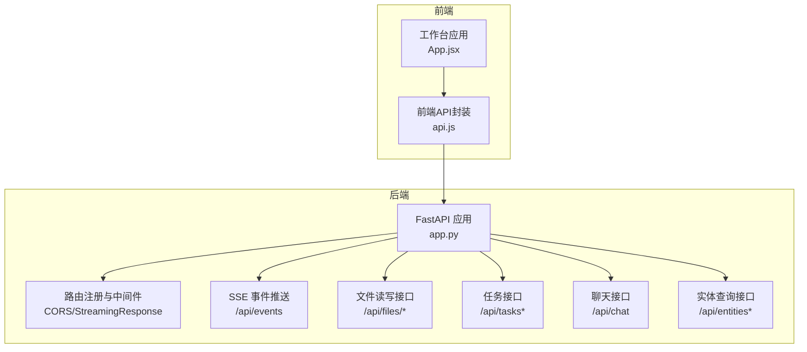
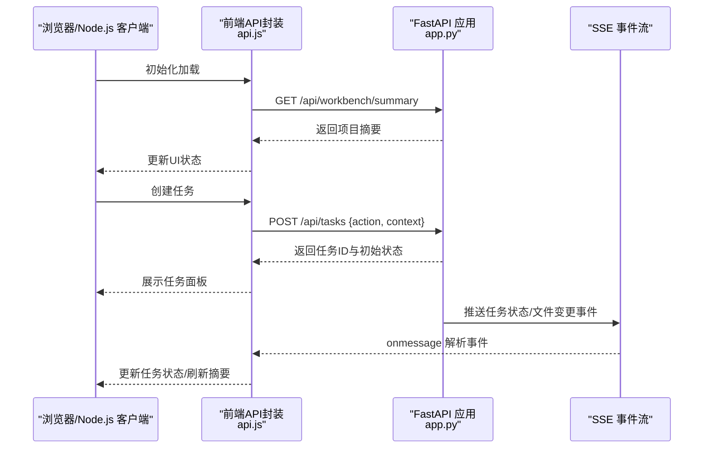
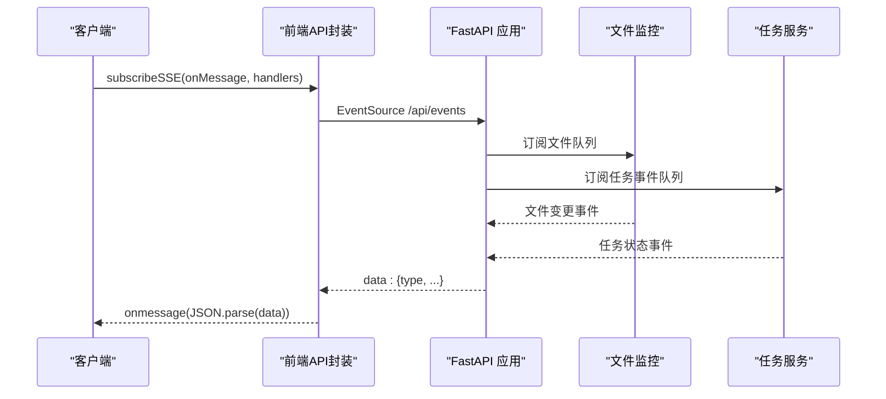
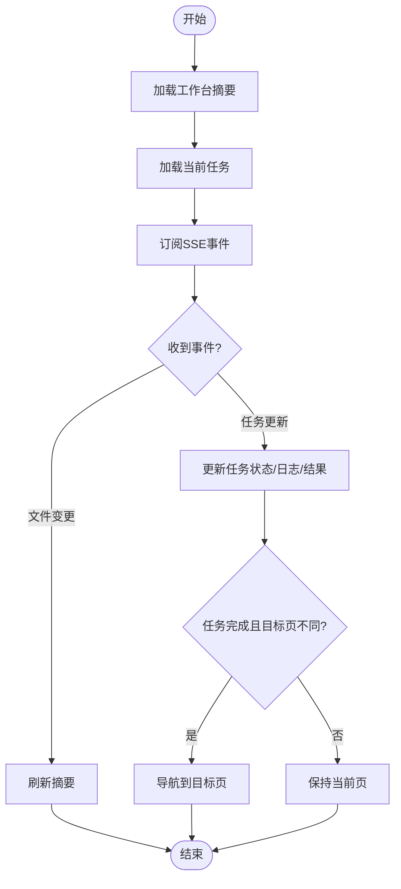
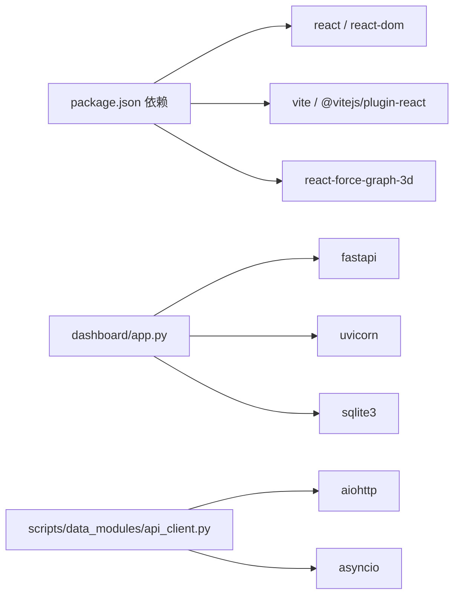

# API使用示例

<cite>
**本文引用的文件**
- [webnovel-writer/dashboard/frontend/src/api.js](file://webnovel-writer/dashboard/frontend/src/api.js)
- [webnovel-writer/dashboard/frontend/src/App.jsx](file://webnovel-writer/dashboard/frontend/src/App.jsx)
- [webnovel-writer/dashboard/app.py](file://webnovel-writer/dashboard/app.py)
- [webnovel-writer/dashboard/server.py](file://webnovel-writer/dashboard/server.py)
- [webnovel-writer/scripts/data_modules/api_client.py](file://webnovel-writer/scripts/data_modules/api_client.py)
- [webnovel-writer/scripts/data_modules/config.py](file://webnovel-writer/scripts/data_modules/config.py)
- [webnovel-writer/dashboard/frontend/package.json](file://webnovel-writer/dashboard/frontend/package.json)
- [webnovel-writer/docs/operations.md](file://webnovel-writer/docs/operations.md)
- [webnovel-writer/docs/rag-and-config.md](file://webnovel-writer/docs/rag-and-config.md)
- [webnovel-writer/webnovel-writer/dashboard/frontend/tests/workbench.data.test.mjs](file://webnovel-writer/webnovel-writer/dashboard/frontend/tests/workbench.data.test.mjs)
</cite>

## 目录
1. [简介](#简介)
2. [项目结构](#项目结构)
3. [核心组件](#核心组件)
4. [架构总览](#架构总览)
5. [详细组件分析](#详细组件分析)
6. [依赖分析](#依赖分析)
7. [性能考虑](#性能考虑)
8. [故障排查指南](#故障排查指南)
9. [结论](#结论)
10. [附录](#附录)

## 简介
本文件面向JavaScript/Node.js客户端开发者，提供Webnovel Writer工作台API的完整使用示例与最佳实践。内容涵盖：
- 项目信息获取、实体查询、文件读写、任务创建与状态查询、实时事件订阅
- 错误处理、数据解析与状态管理
- Postman集合导出、curl命令示例
- SDK开发指南（基于现有前端API封装模式）
- 性能优化、缓存策略与并发控制建议

## 项目结构
后端采用FastAPI提供REST与SSE服务，前端React应用通过封装的API工具发起请求并订阅事件流。

**图示来源**
- [webnovel-writer/dashboard/app.py:67-490](file://webnovel-writer/dashboard/app.py#L67-L490)
- [webnovel-writer/dashboard/frontend/src/api.js:1-78](file://webnovel-writer/dashboard/frontend/src/api.js#L1-78)
- [webnovel-writer/dashboard/frontend/src/App.jsx:1-417](file://webnovel-writer/dashboard/frontend/src/App.jsx#L1-417)

**章节来源**
- [webnovel-writer/dashboard/app.py:67-490](file://webnovel-writer/dashboard/app.py#L67-L490)
- [webnovel-writer/dashboard/server.py:43-72](file://webnovel-writer/dashboard/server.py#L43-L72)

## 核心组件
- 前端API封装：提供统一的fetch/post封装、文件树/文件读写、任务创建与查询、聊天、以及SSE订阅。
- 后端FastAPI：提供项目信息、实体查询、文件读写、任务管理、聊天、SSE事件等接口。
- 数据模块API客户端（Python）：演示了并发、重试、超时与批量处理的工程化实践，可作为Node.js SDK设计参考。

**章节来源**
- [webnovel-writer/dashboard/frontend/src/api.js:1-78](file://webnovel-writer/dashboard/frontend/src/api.js#L1-78)
- [webnovel-writer/dashboard/app.py:80-438](file://webnovel-writer/dashboard/app.py#L80-L438)
- [webnovel-writer/scripts/data_modules/api_client.py:41-496](file://webnovel-writer/scripts/data_modules/api_client.py#L41-L496)

## 架构总览
以下序列图展示了典型交互流程：前端初始化加载、任务创建、SSE事件驱动的任务状态更新、文件变更通知。

**图示来源**
- [webnovel-writer/dashboard/frontend/src/App.jsx:64-273](file://webnovel-writer/dashboard/frontend/src/App.jsx#L64-L273)
- [webnovel-writer/dashboard/frontend/src/api.js:43-77](file://webnovel-writer/dashboard/frontend/src/api.js#L43-L77)
- [webnovel-writer/dashboard/app.py:395-460](file://webnovel-writer/dashboard/app.py#L395-L460)

## 详细组件分析

### 1) 项目信息与工作台摘要
- 接口：GET /api/workbench/summary
- 用途：加载项目概览、近期任务、变更等信息，用于初始化界面。
- 前端调用：在应用启动时拉取，失败时显示错误提示。

**章节来源**
- [webnovel-writer/dashboard/app.py:88-90](file://webnovel-writer/dashboard/app.py#L88-L90)
- [webnovel-writer/dashboard/frontend/src/App.jsx:64-74](file://webnovel-writer/dashboard/frontend/src/App.jsx#L64-L74)

### 2) 实体查询（entities/relationships/...）
- 接口：GET /api/entities、/api/entities/{id}、/api/relationships、/api/relationship-events、/api/chapters、/api/scenes、/api/reading-power、/api/review-metrics、/api/state-changes、/api/aliases、/api/overrides、/api/debts、/api/debt-events、/api/invalid-facts、/api/rag-queries、/api/tool-stats、/api/checklist-scores
- 用途：只读查询实体、关系、章节、场景、阅读力、评审指标、状态变更、别名、覆盖合约、债务、无效事实、RAG查询日志、工具调用统计、写作清单评分等。
- 参数与行为：多数接口支持分页与条件过滤，内部对不存在的表进行安全降级。

**章节来源**
- [webnovel-writer/dashboard/app.py:114-347](file://webnovel-writer/dashboard/app.py#L114-L347)

### 3) 文件读写与浏览
- 接口：
  - GET /api/files/tree：列出正文/大纲/设定集三类目录树
  - GET /api/files/read：读取指定文件内容（仅限三大目录）
  - POST /api/files/save：保存文件内容
- 用途：工作台侧边栏文件浏览与编辑、保存。
- 安全：路径解析与二次白名单限制，防止越权访问。

**章节来源**
- [webnovel-writer/dashboard/app.py:352-394](file://webnovel-writer/dashboard/app.py#L352-L394)

### 4) 任务管理
- 接口：
  - GET /api/tasks/current：获取当前任务
  - POST /api/tasks：创建任务（合并上下文，注入项目根）
  - GET /api/tasks/{task_id}：查询指定任务
- 用途：触发后台任务（如写章节、审校、规划大纲、检查设定等），并轮询或订阅其状态。
- 前端状态：创建后立即在UI中占位，随后由SSE事件流更新。

**章节来源**
- [webnovel-writer/dashboard/app.py:395-418](file://webnovel-writer/dashboard/app.py#L395-L418)
- [webnovel-writer/dashboard/frontend/src/App.jsx:76-157](file://webnovel-writer/dashboard/frontend/src/App.jsx#L76-L157)

### 5) 聊天与建议
- 接口：POST /api/chat {message, context}
- 用途：根据消息与上下文生成回复、建议动作、作用域等。
- 前端集成：发送消息后将回复与建议动作注入右侧栏。

**章节来源**
- [webnovel-writer/dashboard/app.py:420-428](file://webnovel-writer/dashboard/app.py#L420-L428)
- [webnovel-writer/dashboard/frontend/src/App.jsx:316-359](file://webnovel-writer/dashboard/frontend/src/App.jsx#L316-L359)

### 6) 实时事件订阅（SSE）
- 接口：GET /api/events
- 用途：推送文件变更与任务状态变化，前端通过EventSource订阅。
- 前端封装：subscribeSSE提供onOpen/onError回调与取消订阅函数。

**图示来源**
- [webnovel-writer/dashboard/frontend/src/api.js:61-77](file://webnovel-writer/dashboard/frontend/src/api.js#L61-L77)
- [webnovel-writer/dashboard/app.py:434-460](file://webnovel-writer/dashboard/app.py#L434-L460)

**章节来源**
- [webnovel-writer/dashboard/frontend/src/api.js:61-77](file://webnovel-writer/dashboard/frontend/src/api.js#L61-L77)
- [webnovel-writer/dashboard/app.py:434-460](file://webnovel-writer/dashboard/app.py#L434-L460)

### 7) 前端API封装与状态管理
- 封装函数：fetchJSON、postJSON、fetchFileTree、readFile、saveFile、sendChat、fetchCurrentTask、createTask、fetchTask、subscribeSSE
- 状态管理：App.jsx中维护工作台状态、当前任务、聊天消息、建议动作、页面切换与引导步骤等。

**图示来源**
- [webnovel-writer/dashboard/frontend/src/App.jsx:190-273](file://webnovel-writer/dashboard/frontend/src/App.jsx#L190-L273)

**章节来源**
- [webnovel-writer/dashboard/frontend/src/api.js:1-78](file://webnovel-writer/dashboard/frontend/src/api.js#L1-78)
- [webnovel-writer/dashboard/frontend/src/App.jsx:1-417](file://webnovel-writer/dashboard/frontend/src/App.jsx#L1-L417)

## 依赖分析
- 前端依赖：React、React DOM、Vite（开发/构建）、React Force Graph 3D（可视化）。
- 后端依赖：FastAPI、Uvicorn（ASGI服务器）、SQLite（只读查询）。
- 数据模块（Python）：aiohttp、asyncio、重试/并发/超时/批量处理。

**图示来源**
- [webnovel-writer/dashboard/frontend/package.json:11-22](file://webnovel-writer/dashboard/frontend/package.json#L11-L22)
- [webnovel-writer/dashboard/app.py:15-24](file://webnovel-writer/dashboard/app.py#L15-L24)
- [webnovel-writer/scripts/data_modules/api_client.py:24-30](file://webnovel-writer/scripts/data_modules/api_client.py#L24-L30)

**章节来源**
- [webnovel-writer/dashboard/frontend/package.json:11-22](file://webnovel-writer/dashboard/frontend/package.json#L11-L22)
- [webnovel-writer/dashboard/app.py:15-24](file://webnovel-writer/dashboard/app.py#L15-L24)
- [webnovel-writer/scripts/data_modules/api_client.py:24-30](file://webnovel-writer/scripts/data_modules/api_client.py#L24-L30)

## 性能考虑
- 并发与限流：数据模块客户端使用信号量限制并发，避免过载上游API。
- 指数退避重试：对429/500/502/503/504等可重试状态码采用指数退避，降低雪崩风险。
- 超时控制：区分冷启动与正常请求的超时时间，提升稳定性。
- 批量处理：Embedding支持分批处理，失败策略可选择跳过或整体失败。
- SSE复用：前端通过单个EventSource订阅多个事件源，减少连接开销。

**章节来源**
- [webnovel-writer/scripts/data_modules/api_client.py:50-195](file://webnovel-writer/scripts/data_modules/api_client.py#L50-L195)
- [webnovel-writer/scripts/data_modules/api_client.py:248-381](file://webnovel-writer/scripts/data_modules/api_client.py#L248-L381)
- [webnovel-writer/scripts/data_modules/config.py:144-156](file://webnovel-writer/scripts/data_modules/config.py#L144-L156)

## 故障排查指南
- CORS与静态资源：后端启用CORS并提供SPA回退，确保前端静态资源可访问。
- 路径安全：文件读取接口严格限制在正文/大纲/设定集目录，越权访问会被拒绝。
- 任务不存在：查询任务ID不存在时返回404，前端应提示用户刷新或检查任务ID。
- SSE连接：EventSource会自动重连，onError可用于提示网络问题；onOpen用于标记连接状态。
- 前端状态：工作台摘要加载失败时显示错误信息；任务创建失败时在UI中展示错误状态。

**章节来源**
- [webnovel-writer/dashboard/app.py:69-74](file://webnovel-writer/dashboard/app.py#L69-L74)
- [webnovel-writer/dashboard/app.py:365-394](file://webnovel-writer/dashboard/app.py#L365-L394)
- [webnovel-writer/dashboard/app.py:413-418](file://webnovel-writer/dashboard/app.py#L413-L418)
- [webnovel-writer/dashboard/frontend/src/api.js:61-77](file://webnovel-writer/dashboard/frontend/src/api.js#L61-L77)
- [webnovel-writer/dashboard/frontend/src/App.jsx:64-83](file://webnovel-writer/dashboard/frontend/src/App.jsx#L64-L83)

## 结论
本文基于现有前端封装与后端API，提供了JavaScript/Node.js客户端的完整使用示例与最佳实践。通过统一的API封装、SSE事件驱动与严谨的错误处理，可构建稳定、可扩展的工作台客户端。建议在生产环境中结合缓存、并发控制与指数退避重试策略，进一步提升性能与可靠性。

## 附录

### A. JavaScript/Node.js客户端调用示例（路径指引）
- 使用fetch或axios进行API请求的示例可参考以下路径：
  - 项目摘要加载：[webnovel-writer/dashboard/frontend/src/App.jsx:64-74](file://webnovel-writer/dashboard/frontend/src/App.jsx#L64-L74)
  - 任务创建与状态更新：[webnovel-writer/dashboard/frontend/src/App.jsx:87-157](file://webnovel-writer/dashboard/frontend/src/App.jsx#L87-L157)
  - SSE订阅与事件处理：[webnovel-writer/dashboard/frontend/src/api.js:61-77](file://webnovel-writer/dashboard/frontend/src/api.js#L61-L77)
  - 文件树/读取/保存：[webnovel-writer/dashboard/frontend/src/api.js:27-37](file://webnovel-writer/dashboard/frontend/src/api.js#L27-L37)
  - 聊天接口：[webnovel-writer/dashboard/frontend/src/api.js:39-41](file://webnovel-writer/dashboard/frontend/src/api.js#L39-L41)

### B. Postman集合导出
- 导出步骤：
  1) 在浏览器中打开API文档页面：[http://127.0.0.1:8765/docs](http://127.0.0.1:8765/docs)
  2) 点击右上角“Export”按钮，选择“Postman Collection”导出。
  3) 在Postman中导入集合，设置环境变量（如BASE_URL）以适配本地运行。
- 常用集合项：
  - GET /api/workbench/summary
  - GET /api/files/tree
  - GET /api/files/read?path=...
  - POST /api/files/save
  - POST /api/tasks
  - GET /api/tasks/{task_id}
  - POST /api/chat
  - GET /api/events（SSE）

**章节来源**
- [webnovel-writer/dashboard/server.py:60-67](file://webnovel-writer/dashboard/server.py#L60-L67)

### C. curl命令示例
- 获取工作台摘要
  - curl -i http://127.0.0.1:8765/api/workbench/summary
- 列举实体（可选类型与归档过滤）
  - curl "http://127.0.0.1:8765/api/entities?type=角色&include_archived=false"
- 读取文件
  - curl "http://127.0.0.1:8765/api/files/read?path=正文/第1章.md"
- 保存文件
  - curl -X POST http://127.0.0.1:8765/api/files/save -H "Content-Type: application/json" -d '{"path":"正文/草稿.md","content":"文件内容"}'
- 创建任务
  - curl -X POST http://127.0.0.1:8765/api/tasks -H "Content-Type: application/json" -d '{"action":{"type":"write_chapter","label":"写章节"},"context":{"selectedPath":"正文/第1章.md"}}'
- 查询任务
  - curl http://127.0.0.1:8765/api/tasks/{task_id}
- 聊天
  - curl -X POST http://127.0.0.1:8765/api/chat -H "Content-Type: application/json" -d '{"message":"请帮我润色这段话","context":{"page":"chapters","selectedPath":"正文/第1章.md"}}'

**章节来源**
- [webnovel-writer/dashboard/app.py:88-428](file://webnovel-writer/dashboard/app.py#L88-L428)

### D. SDK开发指南（基于现有前端封装）
- 设计要点：
  - 统一封装HTTP方法：GET/POST，统一错误处理（非2xx抛错）。
  - 文件操作：封装tree/read/save，参数校验与路径安全。
  - 任务管理：封装current/create/get，合并上下文并注入项目根。
  - 聊天接口：封装消息发送与上下文传递。
  - SSE订阅：封装EventSource，提供onOpen/onError与取消函数。
- 状态管理建议：
  - 维护工作台摘要、当前任务、聊天消息、建议动作、页面状态等。
  - 任务完成后自动刷新摘要并触发页面跳转或刷新令牌。
- 错误处理：
  - 对404/400/403等错误进行明确提示；对SSE连接失败进行重连与状态提示。
- 并发与性能：
  - 参考数据模块客户端的信号量、指数退避与批量处理策略，避免对上游造成压力。

**章节来源**
- [webnovel-writer/dashboard/frontend/src/api.js:1-78](file://webnovel-writer/dashboard/frontend/src/api.js#L1-78)
- [webnovel-writer/dashboard/frontend/src/App.jsx:1-417](file://webnovel-writer/dashboard/frontend/src/App.jsx#L1-L417)
- [webnovel-writer/scripts/data_modules/api_client.py:41-496](file://webnovel-writer/scripts/data_modules/api_client.py#L41-L496)

### E. 环境与配置
- 项目根定位与工作区映射参见运维文档。
- RAG相关环境变量与最小配置示例参见RAG与配置文档。

**章节来源**
- [webnovel-writer/docs/operations.md:1-100](file://webnovel-writer/docs/operations.md#L1-L100)
- [webnovel-writer/docs/rag-and-config.md:1-37](file://webnovel-writer/docs/rag-and-config.md#L1-L37)