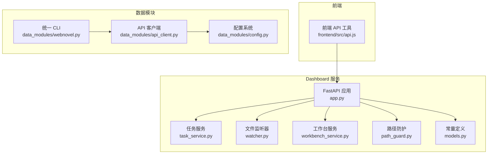
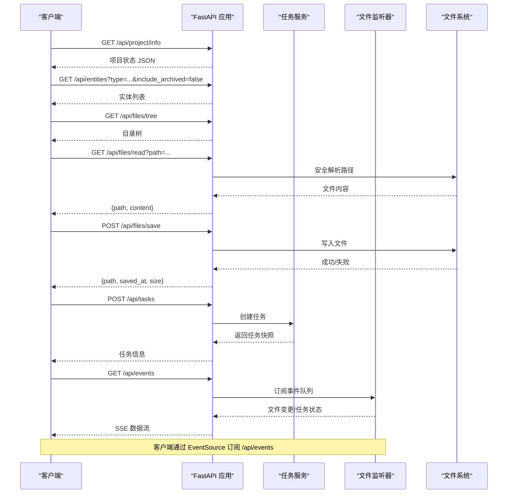
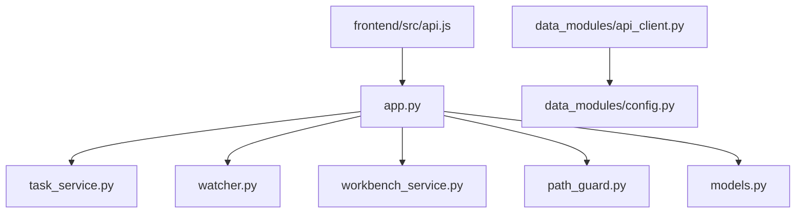

# API参考文档

<cite>
**本文档引用的文件**
- [app.py](file://webnovel-writer/dashboard/app.py)
- [server.py](file://webnovel-writer/dashboard/server.py)
- [task_service.py](file://webnovel-writer/dashboard/task_service.py)
- [watcher.py](file://webnovel-writer/dashboard/watcher.py)
- [workbench_service.py](file://webnovel-writer/dashboard/workbench_service.py)
- [models.py](file://webnovel-writer/dashboard/models.py)
- [path_guard.py](file://webnovel-writer/dashboard/path_guard.py)
- [api.js](file://webnovel-writer/dashboard/frontend/src/api.js)
- [api_client.py](file://webnovel-writer/webnovel-writer/scripts/data_modules/api_client.py)
- [config.py](file://webnovel-writer/webnovel-writer/scripts/data_modules/config.py)
- [webnovel.py](file://webnovel-writer/webnovel-writer/scripts/data_modules/webnovel.py)
- [README.md](file://README.md)
</cite>

## 目录
1. [简介](#简介)
2. [项目结构](#项目结构)
3. [核心组件](#核心组件)
4. [架构概览](#架构概览)
5. [详细组件分析](#详细组件分析)
6. [依赖分析](#依赖分析)
7. [性能考虑](#性能考虑)
8. [故障排除指南](#故障排除指南)
9. [结论](#结论)
10. [附录](#附录)

## 简介
本文件为 Webnovel Writer 的完整 API 参考文档，涵盖：
- RESTful API 的 HTTP 方法、URL 模式、请求/响应格式与认证机制
- 项目信息查询、实体数据库查询、文件系统操作、任务调度、实时事件推送
- WebSocket API、Socket API、IPC 通信的协议规范与实现细节
- 客户端实现指南、性能优化建议与安全注意事项

本项目采用 FastAPI 提供 Dashboard REST API，支持只读查询与最小写入能力，配合 SSE 实现实时事件推送，并通过统一 CLI 入口管理数据模块与外部 API（Embedding/Rerank）。

## 项目结构
Dashboard 服务由以下关键模块组成：
- 应用入口与路由：FastAPI 应用工厂，注册所有 API 路由
- 任务服务：任务创建、执行、状态管理与事件分发
- 文件监听器：基于 Watchdog 的文件变更监听与 SSE 推送
- 工作台服务：项目摘要、文件读写、聊天建议生成
- 路径防护：防止路径穿越的安全校验
- 前端 API 工具：封装 /api/* 请求与 SSE 订阅
- 数据模块 API 客户端：统一 Embedding/Rerank 客户端，兼容 OpenAI 与 Modal 接口
- 配置系统：通过环境变量与 .env 文件加载 API 配置
- 统一 CLI：面向 skills/agents 的稳定入口，自动解析项目根目录

**图表来源**
- [app.py:50-490](file://webnovel-writer/dashboard/app.py#L50-L490)
- [task_service.py:14-166](file://webnovel-writer/dashboard/task_service.py#L14-L166)
- [watcher.py:40-95](file://webnovel-writer/dashboard/watcher.py#L40-L95)
- [workbench_service.py:18-171](file://webnovel-writer/dashboard/workbench_service.py#L18-L171)
- [path_guard.py:11-29](file://webnovel-writer/dashboard/path_guard.py#L11-L29)
- [models.py:3-23](file://webnovel-writer/dashboard/models.py#L3-L23)
- [api.js:1-78](file://webnovel-writer/dashboard/frontend/src/api.js#L1-L78)
- [api_client.py:41-496](file://webnovel-writer/webnovel-writer/scripts/data_modules/api_client.py#L41-L496)
- [config.py:90-349](file://webnovel-writer/webnovel-writer/scripts/data_modules/config.py#L90-L349)
- [webnovel.py:189-312](file://webnovel-writer/webnovel-writer/scripts/data_modules/webnovel.py#L189-L312)

**章节来源**
- [app.py:50-490](file://webnovel-writer/dashboard/app.py#L50-L490)
- [server.py:43-72](file://webnovel-writer/dashboard/server.py#L43-L72)

## 核心组件
- FastAPI 应用工厂：创建应用实例，注册 CORS、静态资源与所有 API 路由
- 任务服务：线程池执行任务，异步事件队列分发任务状态变更
- 文件监听器：监控 .webnovel 目录关键文件变更，通过 SSE 推送
- 工作台服务：读取项目状态、生成项目摘要、安全写入文件
- 路径防护：严格校验文件路径，防止越权访问
- 前端 API 工具：封装 GET/POST 请求与 SSE 订阅
- 数据模块 API 客户端：统一 Embedding/Rerank 客户端，支持并发、重试与预热
- 配置系统：通过环境变量与 .env 文件加载 API 配置
- 统一 CLI：面向 skills/agents 的稳定入口，自动解析项目根目录

**章节来源**
- [task_service.py:14-166](file://webnovel-writer/dashboard/task_service.py#L14-L166)
- [watcher.py:40-95](file://webnovel-writer/dashboard/watcher.py#L40-L95)
- [workbench_service.py:18-171](file://webnovel-writer/dashboard/workbench_service.py#L18-L171)
- [path_guard.py:11-29](file://webnovel-writer/dashboard/path_guard.py#L11-L29)
- [api.js:1-78](file://webnovel-writer/dashboard/frontend/src/api.js#L1-L78)
- [api_client.py:41-496](file://webnovel-writer/webnovel-writer/scripts/data_modules/api_client.py#L41-L496)
- [config.py:90-349](file://webnovel-writer/webnovel-writer/scripts/data_modules/config.py#L90-L349)
- [webnovel.py:189-312](file://webnovel-writer/webnovel-writer/scripts/data_modules/webnovel.py#L189-L312)

## 架构概览
Dashboard 服务通过 FastAPI 提供 REST API，前端通过 EventSource 订阅 SSE 实时事件。任务执行在后台线程进行，状态通过队列异步广播。文件系统访问均经路径防护校验，确保安全性。

**图表来源**
- [app.py:80-461](file://webnovel-writer/dashboard/app.py#L80-L461)
- [task_service.py:36-166](file://webnovel-writer/dashboard/task_service.py#L36-L166)
- [watcher.py:50-95](file://webnovel-writer/dashboard/watcher.py#L50-L95)
- [workbench_service.py:58-71](file://webnovel-writer/dashboard/workbench_service.py#L58-L71)
- [path_guard.py:11-29](file://webnovel-writer/dashboard/path_guard.py#L11-L29)

## 详细组件分析

### REST API 总览
- 基础路径：/api/*
- 认证：本项目未实现专用认证机制，建议在反向代理层添加鉴权策略
- CORS：允许 GET/POST，跨域来源为 *
- 静态资源：前端构建产物托管于 /assets

**章节来源**
- [app.py:67-74](file://webnovel-writer/dashboard/app.py#L67-L74)
- [app.py:466-489](file://webnovel-writer/dashboard/app.py#L466-L489)

### 项目信息查询
- GET /api/project/info
  - 功能：返回 .webnovel/state.json 的完整内容（只读）
  - 成功：200，返回 JSON
  - 错误：404（state.json 不存在）

- GET /api/workbench/summary
  - 功能：生成工作台摘要（项目标题、进度、工作空间统计等）
  - 成功：200，返回摘要对象
  - 说明：聚合 .webnovel/state.json 与各工作空间文件数量

**章节来源**
- [app.py:80-91](file://webnovel-writer/dashboard/app.py#L80-L91)
- [workbench_service.py:18-55](file://webnovel-writer/dashboard/workbench_service.py#L18-L55)

### 实体数据库查询（index.db 只读）
- GET /api/entities
  - 参数：type（可选）、include_archived（布尔）
  - 功能：按类型过滤并排除归档实体，按最后出现时间倒序
  - 成功：200，返回实体数组

- GET /api/entities/{entity_id}
  - 参数：entity_id（路径参数）
  - 功能：按 ID 查询实体
  - 成功：200，返回实体对象
  - 错误：404（实体不存在）

- GET /api/relationships
  - 参数：entity（可选）、limit（默认 200）
  - 功能：查询关系或某实体相关关系，按章节倒序

- GET /api/relationship-events
  - 参数：entity（可选）、from_chapter（可选）、to_chapter（可选）、limit（默认 200）
  - 功能：查询关系事件，支持章节范围过滤

- GET /api/chapters
  - 功能：查询章节列表，按章节号升序

- GET /api/scenes
  - 参数：chapter（可选）、limit（默认 500）
  - 功能：查询场景，支持按章节过滤

- GET /api/reading-power
  - 参数：limit（默认 50）
  - 功能：查询章节阅读力

- GET /api/review-metrics
  - 参数：limit（默认 20）
  - 功能：查询评审指标

- GET /api/state-changes
  - 参数：entity（可选）、limit（默认 100）
  - 功能：查询状态变更，支持按实体过滤

- GET /api/aliases
  - 参数：entity（可选）
  - 功能：查询别名，支持按实体过滤

- 扩展表查询（v5.3+/v5.4+）
  - GET /api/overrides：支持 status 过滤与 limit
  - GET /api/debts：支持 status 过滤与 limit
  - GET /api/debt-events：支持 debt_id 过滤与 limit
  - GET /api/invalid-facts：支持 status 过滤与 limit
  - GET /api/rag-queries：支持 query_type 过滤与 limit
  - GET /api/tool-stats：支持 tool_name 过滤与 limit
  - GET /api/checklist-scores：支持 limit

- 错误处理
  - 表不存在：返回空列表（扩展表）
  - 其他数据库错误：500

**章节来源**
- [app.py:114-347](file://webnovel-writer/dashboard/app.py#L114-L347)
- [app.py:96-113](file://webnovel-writer/dashboard/app.py#L96-L113)

### 文档浏览（只读）
- GET /api/files/tree
  - 功能：列出 正文/大纲/设定集 三个目录的树结构
  - 成功：200，返回对象（键为目录名，值为文件/目录列表）

- GET /api/files/read
  - 参数：path（查询参数）
  - 功能：只读读取指定文件内容
  - 安全：路径经安全解析与越权校验，仅允许三大目录
  - 成功：200，返回 {path, content}
  - 错误：403（越权）、404（文件不存在）、Unicode 解码错误返回占位信息

- POST /api/files/save
  - 请求体：{path, content}
  - 功能：安全写入文件（仅允许三大目录）
  - 成功：200，返回 {path, saved_at, size}
  - 错误：400（参数类型错误）、403（越权）

**章节来源**
- [app.py:352-394](file://webnovel-writer/dashboard/app.py#L352-L394)
- [workbench_service.py:58-71](file://webnovel-writer/dashboard/workbench_service.py#L58-L71)
- [path_guard.py:11-29](file://webnovel-writer/dashboard/path_guard.py#L11-L29)

### 任务调度
- GET /api/tasks/current
  - 功能：获取当前任务快照（若无任务返回空闲状态）
  - 成功：200，返回任务对象

- POST /api/tasks
  - 请求体：{action, context}
  - 功能：创建任务，合并上下文（含 projectRoot）
  - 成功：200，返回任务创建快照
  - 错误：400（参数类型错误）

- GET /api/tasks/{task_id}
  - 功能：按 ID 获取任务详情
  - 成功：200，返回任务对象
  - 错误：404（任务不存在）

- 任务状态与日志
  - 状态：idle、pending、running、completed、failed、cancelled
  - 日志：最多保留最近 200 条，包含时间戳
  - 结果：completed 时包含 result，failed 时包含 error

**章节来源**
- [app.py:395-418](file://webnovel-writer/dashboard/app.py#L395-L418)
- [models.py:9-22](file://webnovel-writer/dashboard/models.py#L9-L22)
- [task_service.py:36-166](file://webnovel-writer/dashboard/task_service.py#L36-L166)

### 实时事件推送（SSE）
- GET /api/events
  - 功能：Server-Sent Events，推送文件变更与任务状态
  - 事件类型：
    - file.changed：文件变更事件，包含 {type, file, kind, ts}
    - task.updated：任务状态更新，包含 {type, taskId, task}
  - 客户端：使用 EventSource 订阅，自动重连

**章节来源**
- [app.py:434-461](file://webnovel-writer/dashboard/app.py#L434-L461)
- [watcher.py:63-78](file://webnovel-writer/dashboard/watcher.py#L63-L78)
- [task_service.py:144-156](file://webnovel-writer/dashboard/task_service.py#L144-L156)
- [api.js:61-77](file://webnovel-writer/dashboard/frontend/src/api.js#L61-L77)

### 聊天与建议（工作台）
- POST /api/chat
  - 请求体：{message, context}
  - 功能：根据消息与上下文生成建议动作与回复
  - 上下文：page、selectedPath、dirty
  - 返回：reply、suggested_actions、reason、scope

**章节来源**
- [app.py:420-429](file://webnovel-writer/dashboard/app.py#L420-L429)
- [workbench_service.py:74-162](file://webnovel-writer/dashboard/workbench_service.py#L74-L162)

### WebSocket API
- 本项目未实现专用 WebSocket 端点
- 实时事件通过 SSE（/api/events）提供，客户端使用 EventSource 订阅
- 若需 WebSocket，可在现有 SSE 基础上扩展，或新增 /ws 路由

**章节来源**
- [app.py:434-461](file://webnovel-writer/dashboard/app.py#L434-L461)

### Socket API 与 IPC 通信
- 本项目未实现专用 Socket API 或 IPC 通道
- 任务执行通过线程池与异步队列实现，事件通过队列广播
- 如需进程间通信，可基于现有队列机制扩展或引入消息中间件

**章节来源**
- [task_service.py:14-35](file://webnovel-writer/dashboard/task_service.py#L14-L35)
- [watcher.py:40-78](file://webnovel-writer/dashboard/watcher.py#L40-L78)

### 外部 API 客户端（Embedding/Rerank）
- 支持两种 API 类型：
  - openai：OpenAI 兼容接口（/v1/embeddings、/v1/rerank）
  - modal：Modal 自定义接口
- 配置项（通过环境变量或 .env）：
  - EMBED_BASE_URL、EMBED_MODEL、EMBED_API_KEY
  - RERANK_BASE_URL、RERANK_MODEL、RERANK_API_KEY
- 并发与超时：
  - embed_concurrency、rerank_concurrency
  - cold_start_timeout、normal_timeout
  - api_max_retries、api_retry_delay
- 功能：
  - EmbeddingAPIClient：单次/批量嵌入，带重试与预热
  - RerankAPIClient：重排，带重试与预热
  - ModalAPIClient：统一封装，兼容旧接口

**章节来源**
- [api_client.py:41-496](file://webnovel-writer/webnovel-writer/scripts/data_modules/api_client.py#L41-L496)
- [config.py:124-156](file://webnovel-writer/webnovel-writer/scripts/data_modules/config.py#L124-L156)

### 统一 CLI（skills/agents 入口）
- 用途：统一入口命令，自动解析项目根目录，转发到具体模块
- 常用命令：
  - where：打印解析出的 project_root
  - preflight：校验运行环境与 project_root
  - use：绑定当前工作区使用的书项目
  - index/state/rag/style/entity/context/migrate/workflow/status/update-state/backup/archive/init/extract-context：转发到相应模块
- 参数：支持在任意位置传入 --project-root

**章节来源**
- [webnovel.py:189-312](file://webnovel-writer/webnovel-writer/scripts/data_modules/webnovel.py#L189-L312)

## 依赖分析
- 组件耦合
  - app.py 依赖 task_service、watcher、workbench_service、path_guard、models
  - task_service 与 watcher 通过队列解耦
  - workbench_service 依赖 path_guard 与 models
  - 前端 api.js 仅依赖 app.py 暴露的 /api/* 接口
  - 数据模块客户端独立于 Dashboard，通过配置系统加载环境变量

**图表来源**
- [app.py:20-24](file://webnovel-writer/dashboard/app.py#L20-L24)
- [task_service.py:10-11](file://webnovel-writer/dashboard/task_service.py#L10-L11)
- [watcher.py:14-15](file://webnovel-writer/dashboard/watcher.py#L14-L15)
- [workbench_service.py:12-13](file://webnovel-writer/dashboard/workbench_service.py#L12-L13)
- [path_guard.py:7-8](file://webnovel-writer/dashboard/path_guard.py#L7-L8)
- [models.py:2-3](file://webnovel-writer/dashboard/models.py#L2-L3)
- [api.js:1-78](file://webnovel-writer/dashboard/frontend/src/api.js#L1-L78)
- [api_client.py:30-31](file://webnovel-writer/webnovel-writer/scripts/data_modules/api_client.py#L30-L31)
- [config.py:11-17](file://webnovel-writer/webnovel-writer/scripts/data_modules/config.py#L11-L17)

**章节来源**
- [app.py:50-490](file://webnovel-writer/dashboard/app.py#L50-L490)

## 性能考虑
- 并发控制
  - Embedding/Rerank 客户端使用 asyncio.Semaphore 控制并发
  - 建议根据外部 API 速率限制调整 embed_concurrency/rerank_concurrency
- 重试与退避
  - 对 429/500/502/503/504 状态码采用指数退避重试
  - 建议结合外部 API 的 QPS 限额设置合理的重试次数与初始延迟
- 批处理
  - Embedding 支持分批处理，减少请求次数
  - 建议根据外部 API 的 batch_size 限制设置 embed_batch_size
- 超时设置
  - 冷启动与正常请求分别使用不同超时，避免长时间阻塞
- SSE 队列容量
  - 任务事件队列最大 128，文件事件队列最大 64，可根据负载调整

**章节来源**
- [api_client.py:50-56](file://webnovel-writer/webnovel-writer/scripts/data_modules/api_client.py#L50-L56)
- [api_client.py:123-126](file://webnovel-writer/webnovel-writer/scripts/data_modules/api_client.py#L123-L126)
- [api_client.py:197-231](file://webnovel-writer/webnovel-writer/scripts/data_modules/api_client.py#L197-L231)
- [task_service.py:25-28](file://webnovel-writer/dashboard/task_service.py#L25-L28)
- [watcher.py:50-53](file://webnovel-writer/dashboard/watcher.py#L50-L53)

## 故障排除指南
- 403 路径越界
  - 现象：访问非允许目录或尝试路径穿越
  - 处理：确认 relative_path 属于 正文/大纲/设定集 任一根目录
  - 参考：path_guard.safe_resolve

- 404 文件/数据库不存在
  - 现象：state.json/index.db 不存在或文件被删除
  - 处理：检查项目根目录与 .webnovel 目录完整性

- 400 请求参数错误
  - 现象：POST /api/files/save 缺少 path/content 或类型不正确
  - 处理：确保请求体为 {path, content} 字符串

- SSE 连接问题
  - 现象：EventSource 断开或无法接收消息
  - 处理：确认 /api/events 可达，检查网络与反代配置

- 外部 API 调用失败
  - 现象：Embedding/Rerank 返回错误或超时
  - 处理：检查 EMBED_* / RERANK_* 环境变量，调整并发与重试参数

**章节来源**
- [path_guard.py:11-29](file://webnovel-writer/dashboard/path_guard.py#L11-L29)
- [app.py:84-86](file://webnovel-writer/dashboard/app.py#L84-L86)
- [app.py:391-393](file://webnovel-writer/dashboard/app.py#L391-L393)
- [api.js:61-77](file://webnovel-writer/dashboard/frontend/src/api.js#L61-L77)
- [api_client.py:157-169](file://webnovel-writer/webnovel-writer/scripts/data_modules/api_client.py#L157-L169)

## 结论
本项目提供了完整的 Dashboard REST API 与实时事件推送能力，满足只读查询、实体数据库浏览、文件系统安全访问、任务调度与工作台交互等需求。通过统一 CLI 与数据模块客户端，可无缝对接多种 Embedding/Rerank 服务。建议在生产环境中通过反向代理启用认证与限流，并根据外部 API 的 SLA 调优并发与重试策略。

## 附录

### 客户端实现指南
- 基础请求
  - GET /api/project/info：获取项目状态
  - GET /api/workbench/summary：获取工作台摘要
  - GET /api/entities?type=...：查询实体列表
  - GET /api/files/tree：获取目录树
  - GET /api/files/read?path=...：读取文件内容
  - POST /api/files/save：保存文件
  - POST /api/tasks：创建任务
  - GET /api/tasks/current：获取当前任务
  - GET /api/tasks/{task_id}：查询任务详情
  - POST /api/chat：发送聊天消息
  - GET /api/events：订阅实时事件

- 前端集成
  - 使用 frontend/src/api.js 封装的 fetchJSON/postJSON 与 subscribeSSE
  - 订阅 SSE 时注意 onOpen/onError 回调处理

**章节来源**
- [api.js:7-77](file://webnovel-writer/dashboard/frontend/src/api.js#L7-L77)
- [app.py:80-461](file://webnovel-writer/dashboard/app.py#L80-L461)

### 安全考虑
- 路径防护
  - 所有文件读取/写入必须通过 safe_resolve 校验，防止路径穿越
- 认证与授权
  - Dashboard 未内置认证，建议在反向代理层添加 Basic Auth/JWT
- CORS
  - 默认允许 GET/POST，跨域来源为 *，生产环境建议限定来源
- 传输安全
  - 建议启用 HTTPS，避免敏感数据明文传输

**章节来源**
- [path_guard.py:11-29](file://webnovel-writer/dashboard/path_guard.py#L11-L29)
- [app.py:69-74](file://webnovel-writer/dashboard/app.py#L69-L74)

### 外部 API 配置
- 环境变量
  - EMBED_BASE_URL、EMBED_MODEL、EMBED_API_KEY
  - RERANK_BASE_URL、RERANK_MODEL、RERANK_API_KEY
- .env 文件
  - 支持项目级与用户级 .env，用户级路径 ~/.claude/webnovel-writer/.env
- 配置优先级
  - 显式传入 > .env > 环境变量

**章节来源**
- [config.py:51-77](file://webnovel-writer/webnovel-writer/scripts/data_modules/config.py#L51-L77)
- [config.py:124-156](file://webnovel-writer/webnovel-writer/scripts/data_modules/config.py#L124-L156)