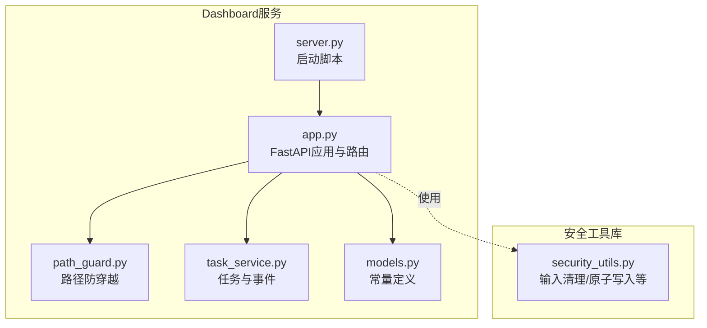
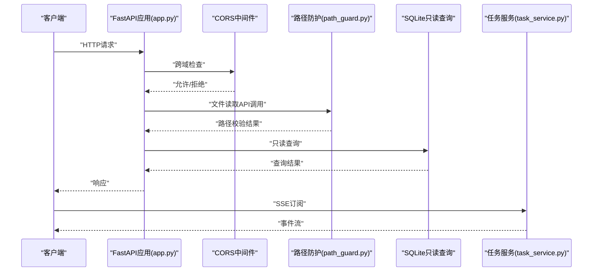
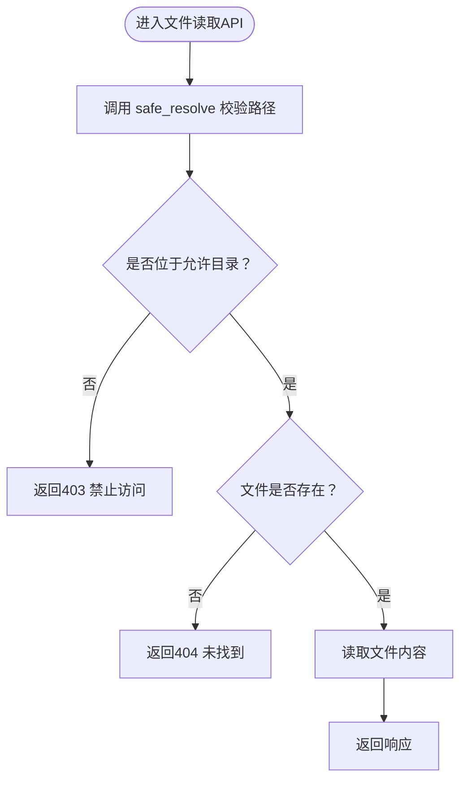
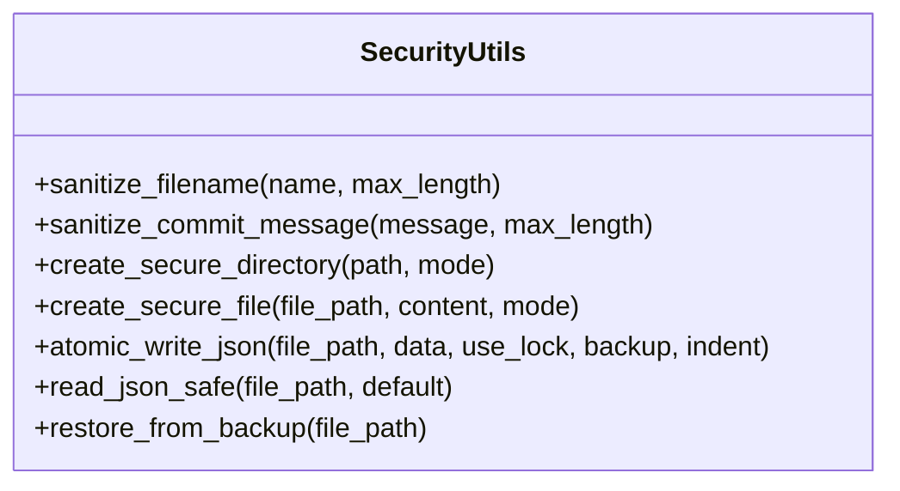
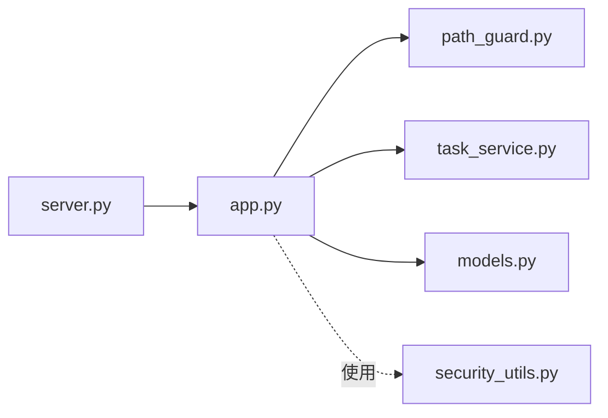

# API认证与安全

<cite>
**本文引用的文件**
- [path_guard.py](file://webnovel-writer/dashboard/path_guard.py)
- [security_utils.py](file://webnovel-writer/scripts/security_utils.py)
- [app.py](file://webnovel-writer/dashboard/app.py)
- [server.py](file://webnovel-writer/dashboard/server.py)
- [models.py](file://webnovel-writer/dashboard/models.py)
- [task_service.py](file://webnovel-writer/dashboard/task_service.py)
</cite>

## 目录
1. [简介](#简介)
2. [项目结构](#项目结构)
3. [核心组件](#核心组件)
4. [架构总览](#架构总览)
5. [详细组件分析](#详细组件分析)
6. [依赖关系分析](#依赖关系分析)
7. [性能考虑](#性能考虑)
8. [故障排查指南](#故障排查指南)
9. [结论](#结论)
10. [附录](#附录)

## 简介
本文件聚焦于API认证与安全机制，结合代码库中的实际实现，系统阐述以下主题：
- CORS跨域配置策略与影响范围
- 请求头与路径访问控制机制
- 文件路径保护（path_guard）与SQL注入、XSS防护现状
- API访问控制、权限验证与安全最佳实践
- 认证配置示例、安全测试方法与漏洞防护指南
- 生产环境部署的安全注意事项与监控策略

说明：当前代码库未实现基于令牌（Token）或会话（Session）的认证与授权机制，API端点对所有来源开放。本文在“安全现状”基础上，提供可落地的加固建议与实施步骤。

## 项目结构
本项目采用前后端分离的FastAPI服务，Dashboard作为API服务器，提供只读查询与有限写能力，并通过path_guard进行路径访问控制。核心文件分布如下：
- 服务入口与路由：dashboard/app.py
- 路径安全防护：dashboard/path_guard.py
- 安全工具库：scripts/security_utils.py
- 任务调度与事件：dashboard/task_service.py
- 模型常量：dashboard/models.py
- 启动脚本：dashboard/server.py

图表来源
- [app.py:1-513](file://webnovel-writer/dashboard/app.py#L1-L513)
- [path_guard.py:1-29](file://webnovel-writer/dashboard/path_guard.py#L1-L29)
- [task_service.py:1-166](file://webnovel-writer/dashboard/task_service.py#L1-L166)
- [models.py:1-23](file://webnovel-writer/dashboard/models.py#L1-L23)
- [server.py:1-72](file://webnovel-writer/dashboard/server.py#L1-L72)
- [security_utils.py:1-590](file://webnovel-writer/scripts/security_utils.py#L1-L590)

章节来源
- [app.py:1-513](file://webnovel-writer/dashboard/app.py#L1-L513)
- [server.py:1-72](file://webnovel-writer/dashboard/server.py#L1-L72)

## 核心组件
- CORS中间件：在应用初始化时添加，允许来自任意源的GET/POST请求，允许任意请求头。
- 路径安全：所有文件读取API在访问磁盘前必须经由path_guard.safe_resolve校验，确保路径不逃逸项目根目录。
- 任务与事件：TaskService负责任务生命周期管理与SSE事件推送，订阅队列容量受控。
- 安全工具库：提供文件名清理、提交消息清理、原子写入、安全目录/文件创建等能力，用于系统内部数据持久化与外部输入处理。

章节来源
- [app.py:69-74](file://webnovel-writer/dashboard/app.py#L69-L74)
- [path_guard.py:11-29](file://webnovel-writer/dashboard/path_guard.py#L11-L29)
- [task_service.py:14-166](file://webnovel-writer/dashboard/task_service.py#L14-L166)
- [security_utils.py:29-134](file://webnovel-writer/scripts/security_utils.py#L29-L134)
- [security_utils.py:345-444](file://webnovel-writer/scripts/security_utils.py#L345-L444)
- [security_utils.py:137-195](file://webnovel-writer/scripts/security_utils.py#L137-L195)

## 架构总览
下图展示API请求在服务端的关键流转与安全控制点：

图表来源
- [app.py:69-74](file://webnovel-writer/dashboard/app.py#L69-L74)
- [path_guard.py:11-29](file://webnovel-writer/dashboard/path_guard.py#L11-L29)
- [app.py:104-113](file://webnovel-writer/dashboard/app.py#L104-L113)
- [task_service.py:144-166](file://webnovel-writer/dashboard/task_service.py#L144-L166)

## 详细组件分析

### CORS跨域配置
- 当前配置：允许任意源、任意方法（GET/POST）、任意请求头。
- 影响范围：所有API端点均受此策略约束，未区分路由或凭据需求。
- 安全建议：
  - 限定allow_origins为可信域名白名单
  - 明确allow_methods与allow_headers
  - 如需携带Cookie或Authorization，需禁用allow_credentials=False并明确暴露响应头
  - 对敏感端点增加额外鉴权层

章节来源
- [app.py:69-74](file://webnovel-writer/dashboard/app.py#L69-L74)

### 请求头验证与路径安全防护
- 请求头验证：当前未实现基于请求头的认证与授权逻辑，API对所有请求放行。
- 路径安全：
  - safe_resolve：将相对路径解析为绝对路径，并确保位于项目根目录内，否则返回403。
  - 文件读取API在safe_resolve基础上，进一步限制仅允许“正文/大纲/设定集”三大目录内的文件访问。
  - 该策略有效阻断路径遍历（CWE-22）与越界访问。

图表来源
- [app.py:365-385](file://webnovel-writer/dashboard/app.py#L365-L385)
- [path_guard.py:11-29](file://webnovel-writer/dashboard/path_guard.py#L11-L29)

章节来源
- [app.py:365-385](file://webnovel-writer/dashboard/app.py#L365-L385)
- [path_guard.py:11-29](file://webnovel-writer/dashboard/path_guard.py#L11-L29)

### SQL注入防护现状
- 查询模式：所有实体查询均为只读，使用参数化查询（例如“WHERE id = ?”）。
- 异常处理：对“表不存在”等操作错误进行捕获并返回标准错误响应。
- 防护现状：参数化查询与严格的异常分支处理有效降低SQL注入风险；但未实现数据库用户权限最小化与连接池安全配置。

章节来源
- [app.py:104-113](file://webnovel-writer/dashboard/app.py#L104-L113)
- [app.py:114-337](file://webnovel-writer/dashboard/app.py#L114-L337)

### XSS攻击防范
- 当前实现：API返回文本内容，未见专门的XSS过滤或转义逻辑。
- 风险点：若前端渲染原始文本，可能引入XSS；但API侧未主动注入脚本。
- 建议：对输出内容进行HTML转义或使用安全的渲染框架；对富文本场景采用白名单过滤。

章节来源
- [app.py:380-385](file://webnovel-writer/dashboard/app.py#L380-L385)

### API访问控制与权限验证
- 访问控制：当前未实现基于用户身份的访问控制，所有API端点对任意来源开放。
- 权限验证：未见JWT、OAuth、API Key或RBAC等机制。
- 建议：引入FastAPI的依赖注入与安全中间件，结合用户角色与资源权限矩阵进行细粒度控制。

章节来源
- [app.py:1-513](file://webnovel-writer/dashboard/app.py#L1-L513)

### 任务与事件安全
- 事件发布：TaskService通过SSE向订阅者推送任务状态更新，队列容量受控，避免内存膨胀。
- 日志与状态：任务日志最多保留固定数量，减少敏感信息泄露风险。
- 建议：对SSE通道增加访问控制与速率限制，防止滥用。

章节来源
- [task_service.py:25-28](file://webnovel-writer/dashboard/task_service.py#L25-L28)
- [task_service.py:83-84](file://webnovel-writer/dashboard/task_service.py#L83-L84)
- [app.py:434-460](file://webnovel-writer/dashboard/app.py#L434-L460)

### 安全工具库（输入清理与原子写入）
- 文件名清理：移除路径分隔符、限制字符集、长度与首尾下划线，防止路径遍历与非法字符。
- 提交消息清理：移除换行符、Git标志、引号与单字母标志，降低命令注入风险。
- 原子写入：先写临时文件，再原子重命名，支持可选备份与文件锁，提升并发安全性。
- 安全目录/文件：创建时设置严格权限（仅所有者可读写），跨平台兼容。

图表来源
- [security_utils.py:29-80](file://webnovel-writer/scripts/security_utils.py#L29-L80)
- [security_utils.py:83-134](file://webnovel-writer/scripts/security_utils.py#L83-L134)
- [security_utils.py:137-195](file://webnovel-writer/scripts/security_utils.py#L137-L195)
- [security_utils.py:345-444](file://webnovel-writer/scripts/security_utils.py#L345-L444)

章节来源
- [security_utils.py:29-134](file://webnovel-writer/scripts/security_utils.py#L29-L134)
- [security_utils.py:137-195](file://webnovel-writer/scripts/security_utils.py#L137-L195)
- [security_utils.py:345-444](file://webnovel-writer/scripts/security_utils.py#L345-L444)

## 依赖关系分析
- app.py依赖path_guard进行路径校验，并在文件读取API中二次限定允许目录。
- app.py通过TaskService提供SSE事件，任务状态变更通过异步队列广播。
- server.py负责解析项目根目录与启动Uvicorn服务，延迟导入app.py以确保路径解析优先。

图表来源
- [server.py:54-58](file://webnovel-writer/dashboard/server.py#L54-L58)
- [app.py:20-24](file://webnovel-writer/dashboard/app.py#L20-L24)
- [task_service.py:10-11](file://webnovel-writer/dashboard/task_service.py#L10-L11)
- [models.py:1-23](file://webnovel-writer/dashboard/models.py#L1-L23)
- [security_utils.py:1-27](file://webnovel-writer/scripts/security_utils.py#L1-L27)

章节来源
- [server.py:54-58](file://webnovel-writer/dashboard/server.py#L54-L58)
- [app.py:20-24](file://webnovel-writer/dashboard/app.py#L20-L24)

## 性能考虑
- CORS配置：允许任意源与请求头会带来额外的预检开销，建议在生产中收敛到必要来源与方法。
- SQLite只读查询：参数化查询与异常分支处理良好，建议对热点查询建立索引以优化性能。
- SSE事件：队列容量受控，注意订阅端消费速度，避免积压。
- 原子写入：临时文件与原子重命名避免了长时间锁持有，适合高并发场景。

## 故障排查指南
- CORS问题
  - 现象：浏览器报跨域错误或预检失败
  - 排查：确认allow_origins、allow_methods、allow_headers配置是否与前端一致
  - 参考：[app.py:69-74](file://webnovel-writer/dashboard/app.py#L69-L74)
- 路径访问被拒
  - 现象：返回403“路径越界：禁止访问 PROJECT_ROOT 之外的文件”
  - 排查：确认请求路径是否位于“正文/大纲/设定集”三大目录内
  - 参考：[app.py:365-385](file://webnovel-writer/dashboard/app.py#L365-L385)，[path_guard.py:11-29](file://webnovel-writer/dashboard/path_guard.py#L11-L29)
- 文件读取失败
  - 现象：返回404“文件不存在”
  - 排查：确认文件路径与编码（UTF-8），二进制文件会返回占位信息
  - 参考：[app.py:376-385](file://webnovel-writer/dashboard/app.py#L376-L385)
- 数据库查询异常
  - 现象：返回500“数据库查询失败”
  - 排查：确认表是否存在、参数绑定是否正确
  - 参考：[app.py:104-113](file://webnovel-writer/dashboard/app.py#L104-L113)
- 任务事件未推送
  - 现象：SSE无事件
  - 排查：确认订阅队列容量与消费者是否及时消费
  - 参考：[task_service.py:25-28](file://webnovel-writer/dashboard/task_service.py#L25-L28)，[app.py:434-460](file://webnovel-writer/dashboard/app.py#L434-L460)

## 结论
- 当前实现具备基础的路径安全与只读查询能力，有效阻断路径遍历与越界访问。
- CORS配置过于宽松，建议收敛至可信来源与必要方法。
- 未实现认证与授权，API对所有来源开放，生产部署需立即引入鉴权与权限控制。
- 建议尽快集成安全工具库中的输入清理与原子写入能力，完善输入验证与数据持久化安全。

## 附录

### 认证配置示例（建议）
- JWT令牌
  - 使用FastAPI的Security依赖注入，结合OAuth2密码流或Bearer Token
  - 在每个路由上增加依赖项以校验令牌与用户角色
- API Key
  - 在请求头中携带X-API-Key，服务端校验白名单与有效期
- CORS细化
  - allow_origins限定为前端域名
  - allow_methods与allow_headers仅包含必要项
  - 如需凭证，设置allow_credentials并明确暴露响应头

### 安全测试方法
- 路径遍历测试
  - 使用“../../../etc/passwd”、“C:\Windows\System32”等构造路径，验证403响应
  - 参考：[security_utils.py:56-80](file://webnovel-writer/scripts/security_utils.py#L56-L80)
- 提交消息注入测试
  - 注入换行符、Git标志、引号与单字母标志，验证清理效果
  - 参考：[security_utils.py:108-134](file://webnovel-writer/scripts/security_utils.py#L108-L134)
- 原子写入测试
  - 并发写入同一文件，验证备份与原子重命名行为
  - 参考：[security_utils.py:345-444](file://webnovel-writer/scripts/security_utils.py#L345-L444)

### 漏洞防护指南
- 路径遍历（CWE-22）
  - 严格路径解析与目录白名单
  - 参考：[path_guard.py:11-29](file://webnovel-writer/dashboard/path_guard.py#L11-L29)，[app.py:365-385](file://webnovel-writer/dashboard/app.py#L365-L385)
- 命令注入（CWE-77）
  - 清洗外部输入，避免拼接系统命令
  - 参考：[security_utils.py:83-134](file://webnovel-writer/scripts/security_utils.py#L83-L134)
- SQL注入
  - 参数化查询与异常处理
  - 参考：[app.py:104-113](file://webnovel-writer/dashboard/app.py#L104-L113)
- XSS
  - 输出转义与白名单渲染
  - 参考：[app.py:380-385](file://webnovel-writer/dashboard/app.py#L380-L385)

### 生产环境部署安全注意事项
- CORS
  - 限定allow_origins为可信域名
  - 仅允许必要方法与请求头
- 认证与授权
  - 引入JWT/OAuth2与RBAC
  - 对敏感端点强制鉴权
- 日志与监控
  - 记录访问日志与异常事件
  - 监控SSE订阅与任务队列积压
- 数据安全
  - 使用安全工具库进行原子写入与权限设置
  - 参考：[security_utils.py:137-195](file://webnovel-writer/scripts/security_utils.py#L137-L195)，[security_utils.py:345-444](file://webnovel-writer/scripts/security_utils.py#L345-L444)