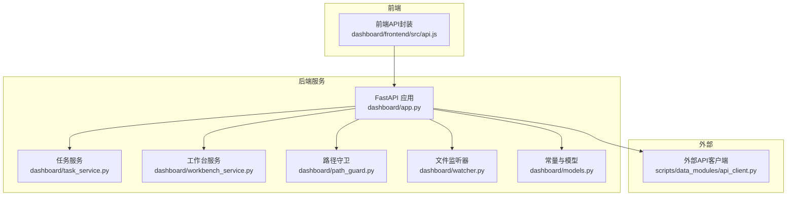
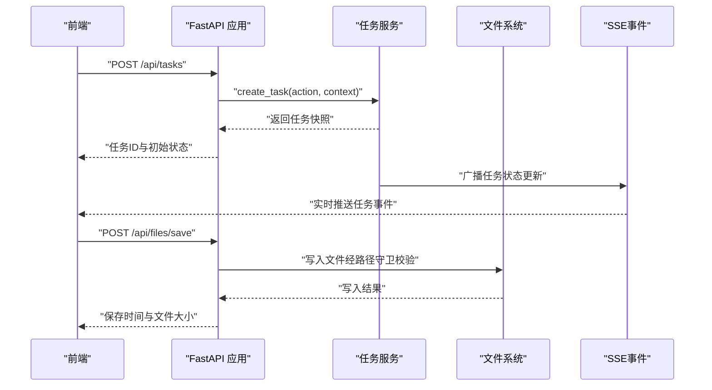
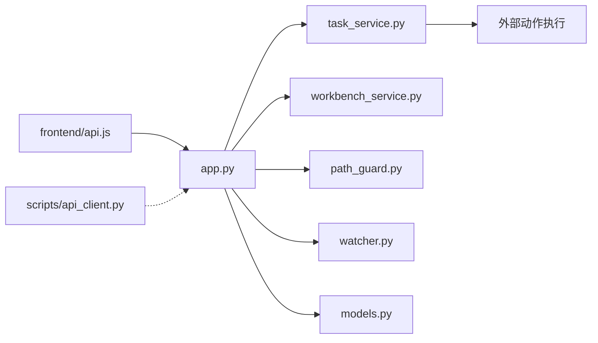

# RESTful API规范

<cite>
**本文引用的文件**
- [app.py](file://webnovel-writer/dashboard/app.py)
- [server.py](file://webnovel-writer/dashboard/server.py)
- [task_service.py](file://webnovel-writer/dashboard/task_service.py)
- [workbench_service.py](file://webnovel-writer/dashboard/workbench_service.py)
- [models.py](file://webnovel-writer/dashboard/models.py)
- [path_guard.py](file://webnovel-writer/dashboard/path_guard.py)
- [watcher.py](file://webnovel-writer/dashboard/watcher.py)
- [api.js](file://webnovel-writer/dashboard/frontend/src/api.js)
- [api_client.py](file://webnovel-writer/webnovel-writer/scripts/data_modules/api_client.py)
</cite>

## 目录
1. [简介](#简介)
2. [项目结构](#项目结构)
3. [核心组件](#核心组件)
4. [架构总览](#架构总览)
5. [详细组件分析](#详细组件分析)
6. [依赖分析](#依赖分析)
7. [性能考量](#性能考量)
8. [故障排查指南](#故障排查指南)
9. [结论](#结论)
10. [附录](#附录)

## 简介
本规范文档面向Webnovel Writer项目的RESTful API，覆盖项目信息查询、工作台摘要、实体数据库查询、文件系统操作、任务管理、聊天与SSE事件推送等核心接口。文档提供每个端点的URL模式、请求方法、参数规范、响应格式、错误处理、请求头要求、状态码定义、数据验证规则与安全考虑，并给出典型使用场景与示例。

## 项目结构
后端基于FastAPI实现，采用模块化组织：
- 应用入口与路由定义：dashboard/app.py
- 启动脚本与运行参数：dashboard/server.py
- 任务调度与事件：dashboard/task_service.py
- 工作台辅助逻辑：dashboard/workbench_service.py
- 常量与模型：dashboard/models.py
- 路径安全防护：dashboard/path_guard.py
- 文件变更监听与SSE：dashboard/watcher.py
- 前端API封装：dashboard/frontend/src/api.js
- 数据模块与外部API客户端：scripts/data_modules/api_client.py

图表来源
- [app.py:1-490](file://webnovel-writer/dashboard/app.py#L1-L490)
- [task_service.py:1-166](file://webnovel-writer/dashboard/task_service.py#L1-L166)
- [workbench_service.py:1-171](file://webnovel-writer/dashboard/workbench_service.py#L1-L171)
- [path_guard.py:1-29](file://webnovel-writer/dashboard/path_guard.py#L1-L29)
- [watcher.py:1-95](file://webnovel-writer/dashboard/watcher.py#L1-L95)
- [models.py:1-23](file://webnovel-writer/dashboard/models.py#L1-L23)
- [api.js:1-78](file://webnovel-writer/dashboard/frontend/src/api.js#L1-L78)
- [api_client.py:1-496](file://webnovel-writer/webnovel-writer/scripts/data_modules/api_client.py#L1-L496)

章节来源
- [app.py:50-490](file://webnovel-writer/dashboard/app.py#L50-L490)
- [server.py:43-72](file://webnovel-writer/dashboard/server.py#L43-L72)

## 核心组件
- FastAPI应用与路由：集中定义所有HTTP端点，包括只读查询、文件系统操作、任务管理、聊天与SSE事件推送。
- 任务服务：负责任务生命周期管理、并发控制、事件广播与日志记录。
- 工作台服务：提供项目摘要、文件保存与聊天动作建议。
- 路径守卫：防止路径穿越，确保文件操作仅限于项目根目录内指定工作区。
- 文件监听器：监控关键文件变更并通过SSE推送给前端。
- 前端API封装：统一的GET/POST与SSE订阅封装，便于前端集成。

章节来源
- [app.py:76-490](file://webnovel-writer/dashboard/app.py#L76-L490)
- [task_service.py:14-166](file://webnovel-writer/dashboard/task_service.py#L14-L166)
- [workbench_service.py:18-171](file://webnovel-writer/dashboard/workbench_service.py#L18-L171)
- [path_guard.py:11-29](file://webnovel-writer/dashboard/path_guard.py#L11-L29)
- [watcher.py:40-95](file://webnovel-writer/dashboard/watcher.py#L40-L95)
- [models.py:3-23](file://webnovel-writer/dashboard/models.py#L3-L23)
- [api.js:7-78](file://webnovel-writer/dashboard/frontend/src/api.js#L7-L78)

## 架构总览
系统采用前后端分离架构，后端提供REST API与SSE事件推送，前端通过封装的工具函数进行调用。文件系统操作受路径守卫保护，任务执行异步化并通过队列广播状态变化。

图表来源
- [app.py:395-429](file://webnovel-writer/dashboard/app.py#L395-L429)
- [task_service.py:36-109](file://webnovel-writer/dashboard/task_service.py#L36-L109)
- [workbench_service.py:58-71](file://webnovel-writer/dashboard/workbench_service.py#L58-L71)
- [path_guard.py:11-29](file://webnovel-writer/dashboard/path_guard.py#L11-L29)

## 详细组件分析

### 项目信息查询
- 端点：GET /api/project/info
- 功能：返回项目状态文件的完整内容（只读）。
- 参数：无
- 成功响应：state.json的内容（JSON对象）
- 错误：
  - 404：state.json不存在
- 安全：无特殊头部要求
- 使用场景：初始化工作台时加载项目元信息

章节来源
- [app.py:80-87](file://webnovel-writer/dashboard/app.py#L80-L87)

### 工作台摘要
- 端点：GET /api/workbench/summary
- 功能：汇总项目标题、类型、进度与工作区统计。
- 参数：无
- 成功响应：包含页面列表、项目信息、进度、工作区根目录、工作区统计等字段的JSON对象
- 错误：无（内部聚合，不存在即为空）
- 使用场景：渲染工作台概览页

章节来源
- [app.py:88-90](file://webnovel-writer/dashboard/app.py#L88-L90)
- [workbench_service.py:18-55](file://webnovel-writer/dashboard/workbench_service.py#L18-L55)

### 实体数据库查询（index.db 只读）
- 端点：GET /api/entities
- 功能：列出实体，支持按类型过滤与归档过滤
- 查询参数：
  - type（可选）：实体类型
  - include_archived（布尔，默认false）：是否包含归档
- 成功响应：实体数组（按最后出现时间倒序）
- 错误：
  - 404：index.db不存在
- 安全：无
- 使用场景：实体列表展示与筛选

章节来源
- [app.py:114-134](file://webnovel-writer/dashboard/app.py#L114-L134)

- 端点：GET /api/entities/{entity_id}
- 功能：按ID获取单个实体
- 路径参数：
  - entity_id（必需）：实体ID
- 成功响应：实体对象
- 错误：
  - 404：实体不存在
- 使用场景：详情查看

章节来源
- [app.py:135-142](file://webnovel-writer/dashboard/app.py#L135-L142)

- 端点：GET /api/relationships
- 功能：列出关系，支持按实体过滤
- 查询参数：
  - entity（可选）：实体ID
  - limit（默认200）：最大条数
- 成功响应：关系数组（按章节倒序）
- 使用场景：关系图谱浏览

章节来源
- [app.py:143-157](file://webnovel-writer/dashboard/app.py#L143-L157)

- 端点：GET /api/relationship-events
- 功能：列出关系事件，支持实体与章节范围过滤
- 查询参数：
  - entity（可选）：实体ID
  - from_chapter（可选）：起始章节
  - to_chapter（可选）：结束章节
  - limit（默认200）：最大条数
- 成功响应：事件数组（按章节倒序，同章节按ID倒序）
- 使用场景：事件追踪

章节来源
- [app.py:158-184](file://webnovel-writer/dashboard/app.py#L158-L184)

- 端点：GET /api/chapters
- 功能：列出章节
- 查询参数：无
- 成功响应：章节数组（按章节正序）
- 使用场景：章节导航

章节来源
- [app.py:185-189](file://webnovel-writer/dashboard/app.py#L185-L189)

- 端点：GET /api/scenes
- 功能：列出场景，支持按章节过滤
- 查询参数：
  - chapter（可选）：章节号
  - limit（默认500）：最大条数
- 成功响应：场景数组（按章节与场景索引排序）
- 使用场景：场景管理

章节来源
- [app.py:191-203](file://webnovel-writer/dashboard/app.py#L191-L203)

- 端点：GET /api/reading-power
- 功能：列出阅读力指标
- 查询参数：
  - limit（默认50）：最大条数
- 成功响应：指标数组（按章节倒序）
- 使用场景：阅读节奏分析

章节来源
- [app.py:204-210](file://webnovel-writer/dashboard/app.py#L204-L210)

- 端点：GET /api/review-metrics
- 功能：列出评审指标
- 查询参数：
  - limit（默认20）：最大条数
- 成功响应：指标数组（按结束章节倒序）
- 使用场景：质量评估

章节来源
- [app.py:212-218](file://webnovel-writer/dashboard/app.py#L212-L218)

- 端点：GET /api/state-changes
- 功能：列出状态变更，支持按实体过滤
- 查询参数：
  - entity（可选）：实体ID
  - limit（默认100）：最大条数
- 成功响应：变更数组（按章节倒序）
- 使用场景：变更追踪

章节来源
- [app.py:220-232](file://webnovel-writer/dashboard/app.py#L220-L232)

- 端点：GET /api/aliases
- 功能：列出别名，支持按实体过滤
- 查询参数：
  - entity（可选）：实体ID
- 成功响应：别名数组
- 使用场景：名称一致性检查

章节来源
- [app.py:234-243](file://webnovel-writer/dashboard/app.py#L234-L243)

- 端点：GET /api/overrides
- 功能：列出覆盖合同，支持按状态过滤
- 查询参数：
  - status（可选）：状态
  - limit（默认100）：最大条数
- 成功响应：覆盖合同数组（按章节倒序）
- 错误：当表不存在时返回空数组
- 使用场景：合同管理

章节来源
- [app.py:249-262](file://webnovel-writer/dashboard/app.py#L249-L262)

- 端点：GET /api/debts
- 功能：列出债务，支持按状态过滤
- 查询参数：
  - status（可选）：状态
  - limit（默认100）：最大条数
- 成功响应：债务数组（按更新时间倒序）
- 错误：当表不存在时返回空数组
- 使用场景：债务追踪

章节来源
- [app.py:264-277](file://webnovel-writer/dashboard/app.py#L264-L277)

- 端点：GET /api/debt-events
- 功能：列出债务事件，支持按债务ID过滤
- 查询参数：
  - debt_id（可选）：债务ID
  - limit（默认200）：最大条数
- 成功响应：事件数组（按章节倒序，同章节按ID倒序）
- 错误：当表不存在时返回空数组
- 使用场景：债务明细

章节来源
- [app.py:279-292](file://webnovel-writer/dashboard/app.py#L279-L292)

- 端点：GET /api/invalid-facts
- 功能：列出无效事实，支持按状态过滤
- 查询参数：
  - status（可选）：状态
  - limit（默认100）：最大条数
- 成功响应：无效事实数组（按标记时间倒序）
- 错误：当表不存在时返回空数组
- 使用场景：事实核查

章节来源
- [app.py:294-307](file://webnovel-writer/dashboard/app.py#L294-L307)

- 端点：GET /api/rag-queries
- 功能：列出RAG查询，支持按查询类型过滤
- 查询参数：
  - query_type（可选）：查询类型
  - limit（默认100）：最大条数
- 成功响应：查询记录数组（按创建时间倒序）
- 错误：当表不存在时返回空数组
- 使用场景：检索审计

章节来源
- [app.py:309-322](file://webnovel-writer/dashboard/app.py#L309-L322)

- 端点：GET /api/tool-stats
- 功能：列出工具调用统计，支持按工具名过滤
- 查询参数：
  - tool_name（可选）：工具名
  - limit（默认200）：最大条数
- 成功响应：统计数组（按创建时间倒序）
- 错误：当表不存在时返回空数组
- 使用场景：工具使用分析

章节来源
- [app.py:324-337](file://webnovel-writer/dashboard/app.py#L324-L337)

- 端点：GET /api/checklist-scores
- 功能：列出清单评分
- 查询参数：
  - limit（默认100）：最大条数
- 成功响应：评分数组（按章节倒序）
- 错误：当表不存在时返回空数组
- 使用场景：写作清单评估

章节来源
- [app.py:339-347](file://webnovel-writer/dashboard/app.py#L339-L347)

### 文件系统操作
- 端点：GET /api/files/tree
- 功能：列出“正文”、“大纲”、“设定集”三个目录的树形结构
- 参数：无
- 成功响应：包含各目录树的JSON对象
- 错误：无（目录不存在时返回空数组）
- 使用场景：文件树展示

章节来源
- [app.py:352-364](file://webnovel-writer/dashboard/app.py#L352-L364)

- 端点：GET /api/files/read
- 功能：只读读取文件内容，仅允许访问三大目录
- 查询参数：
  - path（必需）：相对路径
- 成功响应：包含路径与内容的对象（文本文件UTF-8解码，二进制文件返回占位提示）
- 错误：
  - 403：路径越界或不在允许目录
  - 404：文件不存在
- 安全：路径经安全解析与白名单校验
- 使用场景：文件预览

章节来源
- [app.py:365-386](file://webnovel-writer/dashboard/app.py#L365-L386)
- [path_guard.py:11-29](file://webnovel-writer/dashboard/path_guard.py#L11-L29)

- 端点：POST /api/files/save
- 功能：保存文件内容至工作区
- 请求体：
  - path（必需，字符串）：相对路径
  - content（必需，字符串）：内容
- 成功响应：包含保存时间与文件大小的对象
- 错误：
  - 400：参数类型错误
  - 403：路径越界或不在允许目录
  - 500：写入异常
- 安全：路径经安全解析与白名单校验
- 使用场景：编辑器保存

章节来源
- [app.py:387-394](file://webnovel-writer/dashboard/app.py#L387-L394)
- [workbench_service.py:58-71](file://webnovel-writer/dashboard/workbench_service.py#L58-L71)
- [path_guard.py:11-29](file://webnovel-writer/dashboard/path_guard.py#L11-L29)

### 任务管理
- 端点：POST /api/tasks
- 功能：创建任务
- 请求体：
  - action（必需，对象）：动作定义
  - context（可选，对象）：上下文（将注入项目根路径）
- 成功响应：任务快照（包含ID、状态、日志、结果等）
- 错误：
  - 400：action或context类型错误
- 使用场景：触发后台任务

章节来源
- [app.py:399-412](file://webnovel-writer/dashboard/app.py#L399-L412)

- 端点：GET /api/tasks/current
- 功能：获取当前任务
- 参数：无
- 成功响应：当前任务快照（若无任务则返回空闲状态）
- 使用场景：显示当前任务状态

章节来源
- [app.py:395-398](file://webnovel-writer/dashboard/app.py#L395-L398)
- [models.py:17-22](file://webnovel-writer/dashboard/models.py#L17-L22)

- 端点：GET /api/tasks/{task_id}
- 功能：按ID获取任务
- 路径参数：
  - task_id（必需）：任务ID
- 成功响应：任务对象
- 错误：
  - 404：任务不存在
- 使用场景：查看详情与日志

章节来源
- [app.py:413-419](file://webnovel-writer/dashboard/app.py#L413-L419)

- 端点：POST /api/chat
- 功能：聊天并生成建议动作
- 请求体：
  - message（必需，字符串）：消息内容
  - context（可选，对象）：页面与选中路径等上下文
- 成功响应：包含回复、建议动作、原因与作用域的对象
- 错误：
  - 400：message或context类型错误
- 使用场景：智能助手交互

章节来源
- [app.py:420-429](file://webnovel-writer/dashboard/app.py#L420-L429)
- [workbench_service.py:74-162](file://webnovel-writer/dashboard/workbench_service.py#L74-L162)

### SSE：实时变更推送
- 端点：GET /api/events
- 功能：Server-Sent Events，推送文件变更与任务状态
- 成功响应：事件流（data: JSON）
- 事件类型：
  - file.changed：文件变更（文件名、变更类型、时间戳）
  - task.updated：任务状态更新（任务ID与任务快照）
- 使用场景：前端自动刷新

章节来源
- [app.py:434-460](file://webnovel-writer/dashboard/app.py#L434-L460)
- [watcher.py:63-78](file://webnovel-writer/dashboard/watcher.py#L63-L78)
- [task_service.py:144-156](file://webnovel-writer/dashboard/task_service.py#L144-L156)

### 请求头与CORS
- CORS策略：允许GET/POST，允许任意源与头部
- Content-Type：application/json（POST请求）
- Authorization：如需鉴权，由具体实现决定

章节来源
- [app.py:69-74](file://webnovel-writer/dashboard/app.py#L69-L74)
- [api.js:17-25](file://webnovel-writer/dashboard/frontend/src/api.js#L17-L25)

### 响应状态码
- 200：成功
- 400：请求参数类型错误
- 403：路径越界或权限不足
- 404：资源不存在
- 500：服务器内部错误

章节来源
- [app.py:84-86](file://webnovel-writer/dashboard/app.py#L84-L86)
- [app.py:98-99](file://webnovel-writer/dashboard/app.py#L98-L99)
- [app.py:139-141](file://webnovel-writer/dashboard/app.py#L139-L141)
- [app.py:391-393](file://webnovel-writer/dashboard/app.py#L391-L393)
- [app.py:403-406](file://webnovel-writer/dashboard/app.py#L403-L406)
- [app.py:416-418](file://webnovel-writer/dashboard/app.py#L416-L418)
- [path_guard.py:20-26](file://webnovel-writer/dashboard/path_guard.py#L20-L26)

### 数据验证规则
- 字段类型：明确要求字符串或对象类型
- 默认值：部分查询参数提供默认值
- 过滤与排序：多数列表接口提供过滤与排序能力

章节来源
- [app.py:115-133](file://webnovel-writer/dashboard/app.py#L115-L133)
- [app.py:144-156](file://webnovel-writer/dashboard/app.py#L144-L156)
- [app.py:159-183](file://webnovel-writer/dashboard/app.py#L159-L183)
- [app.py:391-393](file://webnovel-writer/dashboard/app.py#L391-L393)
- [app.py:403-406](file://webnovel-writer/dashboard/app.py#L403-L406)

### 安全考虑
- 路径安全：所有文件读写均通过安全解析与白名单校验
- CORS：开发环境允许任意源，生产需按需收紧
- 任务隔离：任务执行独立线程，事件通过队列广播

章节来源
- [path_guard.py:11-29](file://webnovel-writer/dashboard/path_guard.py#L11-L29)
- [app.py:69-74](file://webnovel-writer/dashboard/app.py#L69-L74)
- [task_service.py:54-58](file://webnovel-writer/dashboard/task_service.py#L54-L58)

### 请求与响应示例
以下示例描述典型交互流程，不包含具体代码内容：

- 获取项目信息
  - 请求：GET /api/project/info
  - 响应：包含项目状态的JSON对象

- 列出实体
  - 请求：GET /api/entities?type=角色&include_archived=false
  - 响应：实体数组（按最后出现时间倒序）

- 读取文件
  - 请求：GET /api/files/read?path=正文/第1章.md
  - 响应：包含路径与内容的对象

- 保存文件
  - 请求：POST /api/files/save，Body: {"path":"大纲/卷1.md","content":"..."}
  - 响应：包含保存时间与文件大小的对象

- 创建任务
  - 请求：POST /api/tasks，Body: {"action":{"type":"write_chapter","params":{"path":"正文/第1章.md"}},"context":{"page":"chapters"}}
  - 响应：任务快照（含ID、状态、日志）

- 订阅SSE
  - 请求：GET /api/events
  - 响应：事件流，包含文件变更与任务更新

章节来源
- [app.py:80-87](file://webnovel-writer/dashboard/app.py#L80-L87)
- [app.py:114-134](file://webnovel-writer/dashboard/app.py#L114-L134)
- [app.py:365-386](file://webnovel-writer/dashboard/app.py#L365-L386)
- [app.py:387-394](file://webnovel-writer/dashboard/app.py#L387-L394)
- [app.py:399-412](file://webnovel-writer/dashboard/app.py#L399-L412)
- [app.py:434-460](file://webnovel-writer/dashboard/app.py#L434-L460)

## 依赖分析
- 组件耦合
  - app.py 依赖 task_service、workbench_service、path_guard、watcher、models
  - task_service 依赖 claude_runner（外部动作执行）
  - workbench_service 依赖 path_guard 与 models
  - watcher 与 SSE 广播
- 外部依赖
  - 外部API客户端（scripts/data_modules/api_client.py）用于嵌入与重排序服务，与REST API并行存在

图表来源
- [app.py:20-24](file://webnovel-writer/dashboard/app.py#L20-L24)
- [task_service.py:10-11](file://webnovel-writer/dashboard/task_service.py#L10-L11)
- [workbench_service.py:12-13](file://webnovel-writer/dashboard/workbench_service.py#L12-L13)
- [api.js:1-78](file://webnovel-writer/dashboard/frontend/src/api.js#L1-L78)
- [api_client.py:1-496](file://webnovel-writer/webnovel-writer/scripts/data_modules/api_client.py#L1-L496)

章节来源
- [app.py:20-24](file://webnovel-writer/dashboard/app.py#L20-L24)
- [task_service.py:10-11](file://webnovel-writer/dashboard/task_service.py#L10-L11)
- [workbench_service.py:12-13](file://webnovel-writer/dashboard/workbench_service.py#L12-L13)
- [api.js:1-78](file://webnovel-writer/dashboard/frontend/src/api.js#L1-L78)
- [api_client.py:1-496](file://webnovel-writer/webnovel-writer/scripts/data_modules/api_client.py#L1-L496)

## 性能考量
- 数据库查询：列表接口默认限制数量，避免一次性返回过多数据
- 任务执行：异步线程执行，避免阻塞主线程
- SSE：事件队列有容量限制，过载时清理死连接
- 文件读写：文本文件按UTF-8读取，二进制文件返回占位提示，避免大文件预览

## 故障排查指南
- 404 Not Found
  - 项目状态文件或index.db不存在：确认项目根目录与“.webnovel”目录结构
  - 文件不存在：检查相对路径与允许目录
- 403 Forbidden
  - 路径越界：确保路径在项目根目录内且属于允许的工作区
- 400 Bad Request
  - 参数类型错误：检查请求体字段类型（字符串/对象）
- 500 Internal Server Error
  - 写入异常或数据库异常：检查权限与磁盘空间

章节来源
- [app.py:84-86](file://webnovel-writer/dashboard/app.py#L84-L86)
- [app.py:98-99](file://webnovel-writer/dashboard/app.py#L98-L99)
- [app.py:376-378](file://webnovel-writer/dashboard/app.py#L376-L378)
- [app.py:391-393](file://webnovel-writer/dashboard/app.py#L391-L393)
- [path_guard.py:20-26](file://webnovel-writer/dashboard/path_guard.py#L20-L26)

## 结论
本RESTful API规范覆盖了项目信息、工作台摘要、实体数据库查询、文件系统操作、任务管理与SSE事件推送等核心功能。通过严格的路径安全校验、合理的错误处理与默认限制，系统在保证易用性的同时兼顾安全性与稳定性。建议在生产环境中进一步收紧CORS策略并增加鉴权机制。

## 附录
- 启动与运行
  - 通过命令行参数指定项目根目录、主机与端口，支持自动打开浏览器
- 前端集成
  - 前端通过封装的工具函数发起请求与订阅SSE，简化集成复杂度

章节来源
- [server.py:43-72](file://webnovel-writer/dashboard/server.py#L43-L72)
- [api.js:7-78](file://webnovel-writer/dashboard/frontend/src/api.js#L7-L78)