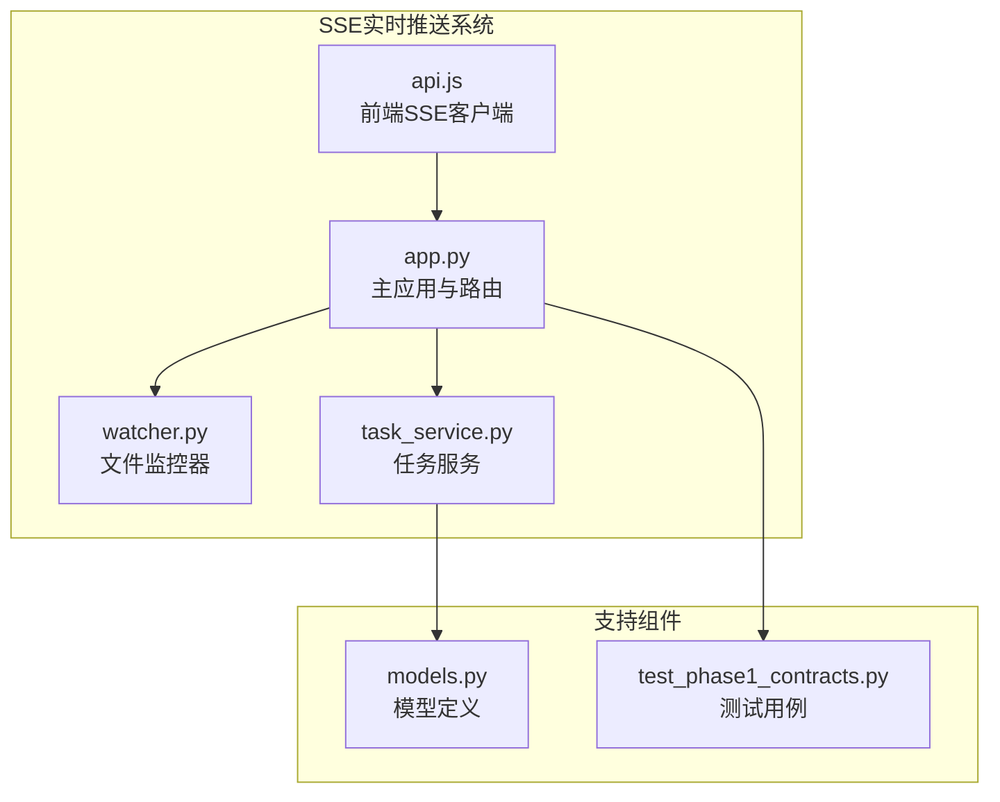
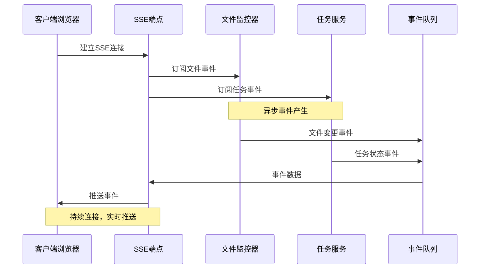
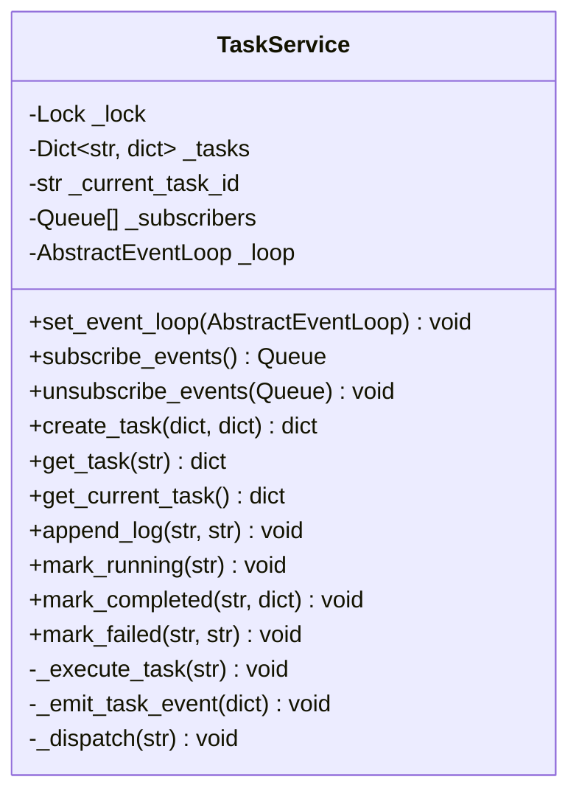
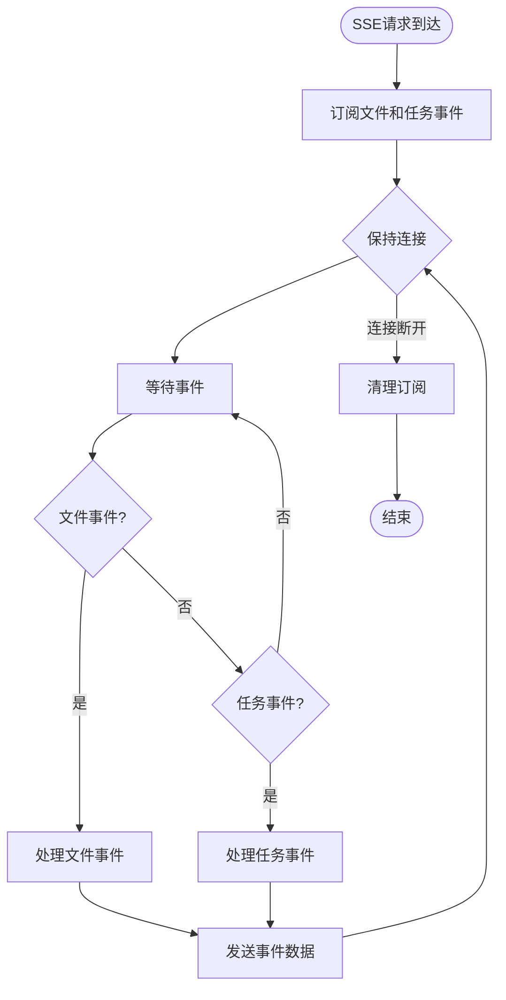
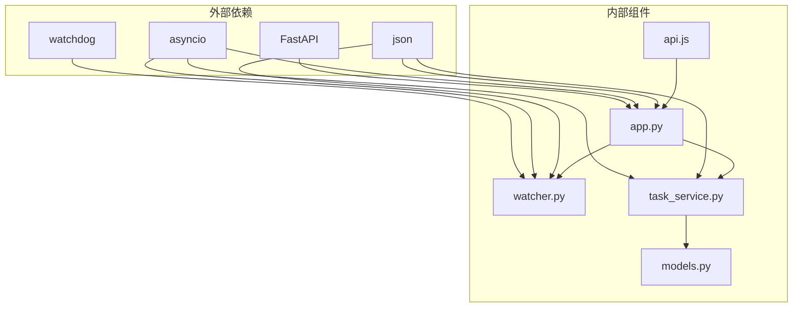
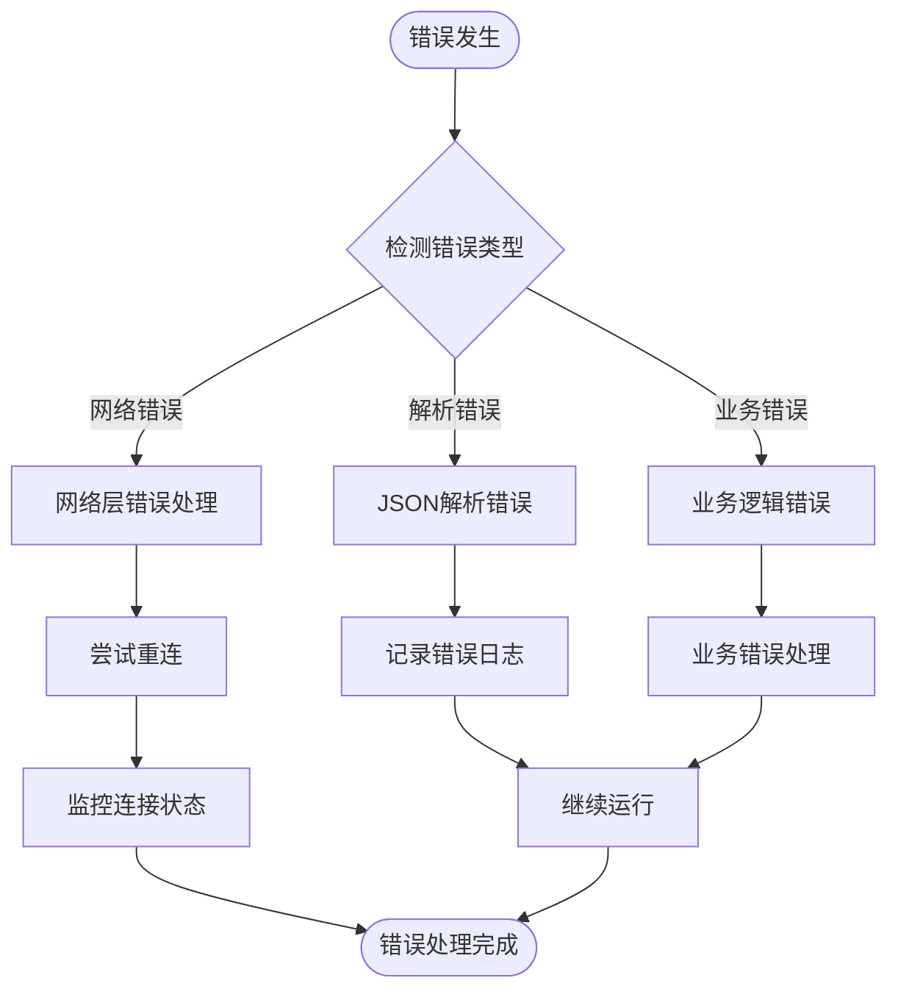

# SSE实时推送API

<cite>
**本文档引用的文件**
- [app.py](file://webnovel-writer/dashboard/app.py)
- [watcher.py](file://webnovel-writer/dashboard/watcher.py)
- [task_service.py](file://webnovel-writer/dashboard/task_service.py)
- [api.js](file://webnovel-writer/dashboard/frontend/src/api.js)
- [models.py](file://webnovel-writer/dashboard/models.py)
- [test_phase1_contracts.py](file://webnovel-writer/dashboard/tests/test_phase1_contracts.py)
</cite>

## 目录
1. [简介](#简介)
2. [项目结构](#项目结构)
3. [核心组件](#核心组件)
4. [架构概览](#架构概览)
5. [详细组件分析](#详细组件分析)
6. [依赖关系分析](#依赖关系分析)
7. [性能考虑](#性能考虑)
8. [故障排除指南](#故障排除指南)
9. [结论](#结论)

## 简介

SSE实时推送API是Webnovel Writer项目中的核心通信机制，基于Server-Sent Events技术实现实时事件推送。该API负责向客户端推送两类关键事件：文件变更通知和任务状态更新，确保前端界面能够实时响应后端数据变化。

该系统采用异步事件驱动架构，通过FastAPI的StreamingResponse实现持久连接，结合watchdog文件监控和自定义任务服务，为用户提供流畅的实时协作体验。

## 项目结构

SSE实时推送功能主要分布在以下文件中：



**图表来源**
- [app.py:434-460](file://webnovel-writer/dashboard/app.py#L434-L460)
- [watcher.py:40-95](file://webnovel-writer/dashboard/watcher.py#L40-L95)
- [task_service.py:14-166](file://webnovel-writer/dashboard/task_service.py#L14-L166)

**章节来源**
- [app.py:1-513](file://webnovel-writer/dashboard/app.py#L1-L513)
- [watcher.py:1-95](file://webnovel-writer/dashboard/watcher.py#L1-L95)
- [task_service.py:1-166](file://webnovel-writer/dashboard/task_service.py#L1-L166)

## 核心组件

### SSE事件类型定义

系统定义了两种核心事件类型：

1. **文件变更事件** (`file.changed`)
   - 触发条件：监控的关键文件发生修改或创建
   - 监控范围：`.webnovel/`目录下的`state.json`、`index.db`、`workflow_state.json`
   - 事件特征：包含文件名、变更类型和时间戳

2. **任务状态事件** (`task.updated`)
   - 触发条件：任务状态发生变化（创建、运行中、完成、失败等）
   - 状态转换：pending → running → completed/failed
   - 事件特征：包含完整的任务状态快照

### 事件流格式规范

SSE事件遵循标准的Server-Sent Events格式：

```
data: {"type":"file.changed","file":"state.json","kind":"modified","ts":1699123456.789}

data: {"type":"task.updated","taskId":"abc123","task":{"id":"abc123","status":"running","..."}}
```

每个事件包含：
- **type字段**：事件类型标识
- **payload数据**：具体事件内容
- **自动换行**：每条事件以`\n\n`结尾

**章节来源**
- [watcher.py:63-68](file://webnovel-writer/dashboard/watcher.py#L63-L68)
- [task_service.py:144-155](file://webnovel-writer/dashboard/task_service.py#L144-L155)

## 架构概览

SSE实时推送系统采用事件驱动架构，实现了高效的异步事件分发机制：



**图表来源**
- [app.py:434-460](file://webnovel-writer/dashboard/app.py#L434-L460)
- [watcher.py:50-58](file://webnovel-writer/dashboard/watcher.py#L50-L58)
- [task_service.py:25-34](file://webnovel-writer/dashboard/task_service.py#L25-L34)

### 连接管理策略

系统实现了智能的连接生命周期管理：

1. **订阅管理**
   - 使用`asyncio.Queue`实现事件队列
   - 支持动态订阅和取消订阅
   - 队列容量限制防止内存泄漏

2. **断线重连机制**
   - 基于浏览器EventSource的自动重连
   - 服务器端优雅关闭资源
   - 客户端侧错误状态回调

3. **资源清理**
   - 连接关闭时自动取消订阅
   - 队列满载时移除死连接
   - 事件循环结束时清理资源

**章节来源**
- [app.py:434-460](file://webnovel-writer/dashboard/app.py#L434-L460)
- [watcher.py:55-59](file://webnovel-writer/dashboard/watcher.py#L55-L59)
- [task_service.py:30-34](file://webnovel-writer/dashboard/task_service.py#L30-L34)

## 详细组件分析

### 文件监控组件

文件监控组件负责监听项目关键文件的变更事件：

```mermaid
classDiagram
class FileWatcher {
-Observer _observer
-Queue[] _subscribers
-AbstractEventLoop _loop
+subscribe() Queue
+unsubscribe(Queue) void
+start(Path, AbstractEventLoop) void
+stop() void
-_on_change(str, str) void
-_dispatch(str) void
}
class _WebnovelFileHandler {
+Set~str~ WATCH_NAMES
+on_modified(FileSystemEvent) void
+on_created(FileSystemEvent) void
}
FileWatcher --> _WebnovelFileHandler : uses
FileWatcher --> "asyncio.Queue" : manages
```

**图表来源**
- [watcher.py:40-95](file://webnovel-writer/dashboard/watcher.py#L40-L95)

#### 文件监控策略

- **监控范围**：仅监控`.webnovel/`目录下的关键文件
- **事件类型**：区分文件创建和修改事件
- **线程安全**：通过事件循环线程安全地调度事件
- **性能优化**：使用固定大小的事件队列避免内存溢出

**章节来源**
- [watcher.py:18-38](file://webnovel-writer/dashboard/watcher.py#L18-L38)
- [watcher.py:63-78](file://webnovel-writer/dashboard/watcher.py#L63-L78)

### 任务服务组件

任务服务组件管理异步任务的状态变更和事件推送：



**图表来源**
- [task_service.py:14-166](file://webnovel-writer/dashboard/task_service.py#L14-L166)

#### 任务状态管理

- **状态转换**：pending → running → completed/failed
- **日志记录**：维护最近200条日志
- **并发控制**：使用锁保证线程安全
- **异步执行**：后台线程执行耗时操作

**章节来源**
- [task_service.py:36-143](file://webnovel-writer/dashboard/task_service.py#L36-L143)

### SSE端点实现

主应用中的SSE端点实现了事件流的聚合和分发：



**图表来源**
- [app.py:434-460](file://webnovel-writer/dashboard/app.py#L434-L460)

#### 异步事件处理

- **并发等待**：使用`asyncio.wait`等待多个事件源
- **事件优先级**：任一事件到达即刻响应
- **资源管理**：正确处理取消和异常情况
- **内存控制**：及时清理已完成的任务

**章节来源**
- [app.py:440-459](file://webnovel-writer/dashboard/app.py#L440-L459)

## 依赖关系分析

SSE系统的依赖关系清晰且职责分离：



**图表来源**
- [app.py:15-24](file://webnovel-writer/dashboard/app.py#L15-L24)
- [watcher.py:14-15](file://webnovel-writer/dashboard/watcher.py#L14-L15)
- [task_service.py:3-11](file://webnovel-writer/dashboard/task_service.py#L3-L11)

### 组件耦合度分析

- **低耦合设计**：各组件职责明确，接口简洁
- **事件驱动**：通过事件队列实现松散耦合
- **线程安全**：合理使用锁和事件循环确保并发安全
- **可扩展性**：易于添加新的事件源和处理逻辑

**章节来源**
- [app.py:29-31](file://webnovel-writer/dashboard/app.py#L29-L31)
- [watcher.py:43-46](file://webnovel-writer/dashboard/watcher.py#L43-L46)

## 性能考虑

### 内存优化策略

1. **队列容量限制**
   - 文件监控队列：最大64个事件
   - 任务事件队列：最大128个事件
   - 自动清理满载队列，防止内存泄漏

2. **事件去重机制**
   - 监控特定关键文件，避免无关文件频繁触发
   - 合并相似事件，减少网络传输

3. **连接池管理**
   - 动态管理订阅者数量
   - 及时清理断开的连接

### 并发性能优化

- **异步I/O**：完全基于asyncio实现非阻塞操作
- **事件循环**：单线程事件循环避免锁竞争
- **后台线程**：耗时任务在独立线程执行
- **批量处理**：事件合并减少CPU占用

### 网络传输优化

- **压缩传输**：JSON数据直接传输，无额外压缩
- **连接复用**：单连接多事件推送
- **心跳机制**：浏览器自动维持连接活跃

## 故障排除指南

### 常见问题诊断

1. **连接无法建立**
   - 检查CORS配置
   - 验证API端点可达性
   - 确认浏览器EventSource支持

2. **事件接收异常**
   - 检查JSON格式有效性
   - 验证事件类型识别
   - 确认客户端解析逻辑

3. **性能问题**
   - 监控队列长度
   - 检查事件产生频率
   - 分析内存使用情况

### 错误处理机制



**图表来源**
- [api.js:67-75](file://webnovel-writer/dashboard/frontend/src/api.js#L67-L75)

### 调试技巧

1. **服务端调试**
   - 启用FastAPI调试模式
   - 监控事件队列长度
   - 检查文件监控状态

2. **客户端调试**
   - 使用浏览器开发者工具Network面板
   - 监控EventSource连接状态
   - 检查事件接收和解析

3. **性能监控**
   - 监控内存使用情况
   - 检查事件处理延迟
   - 分析连接数变化

**章节来源**
- [api.js:55-77](file://webnovel-writer/dashboard/frontend/src/api.js#L55-L77)

## 结论

SSE实时推送API通过精心设计的事件驱动架构，成功实现了高效、可靠的实时通信机制。系统具备以下优势：

1. **架构简洁**：职责分离，接口清晰
2. **性能优异**：异步处理，内存友好
3. **可靠性高**：完善的错误处理和重连机制
4. **扩展性强**：易于添加新的事件源和处理逻辑

该实现为Webnovel Writer项目提供了流畅的实时协作体验，为类似场景的实时通信需求提供了优秀的参考实现。通过合理的性能优化和错误处理策略，系统能够在生产环境中稳定运行，满足用户对实时性的需求。