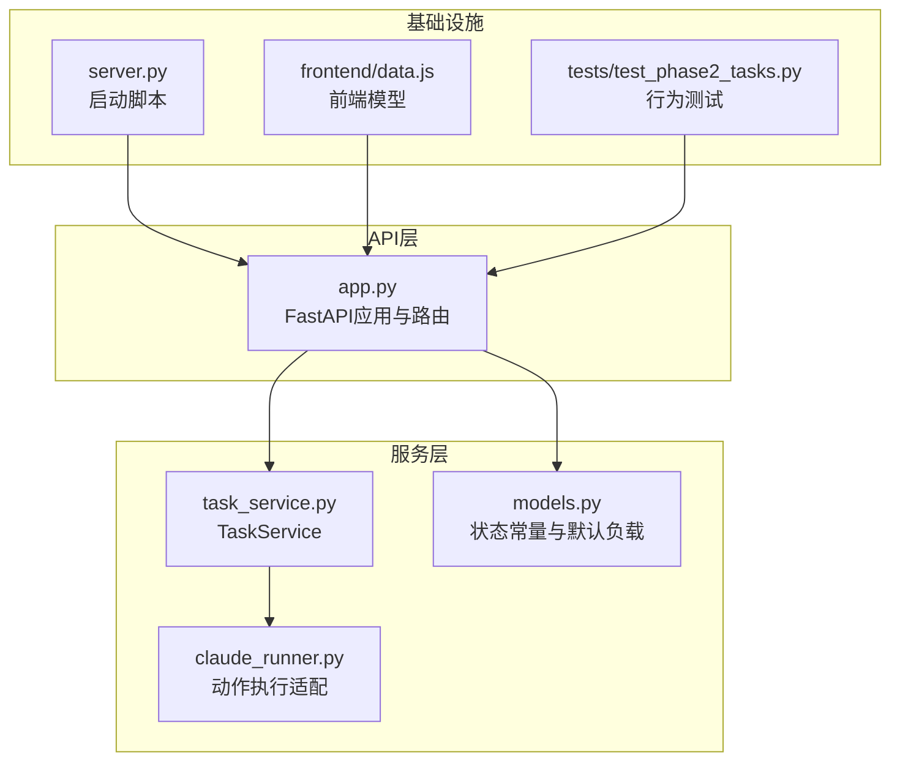
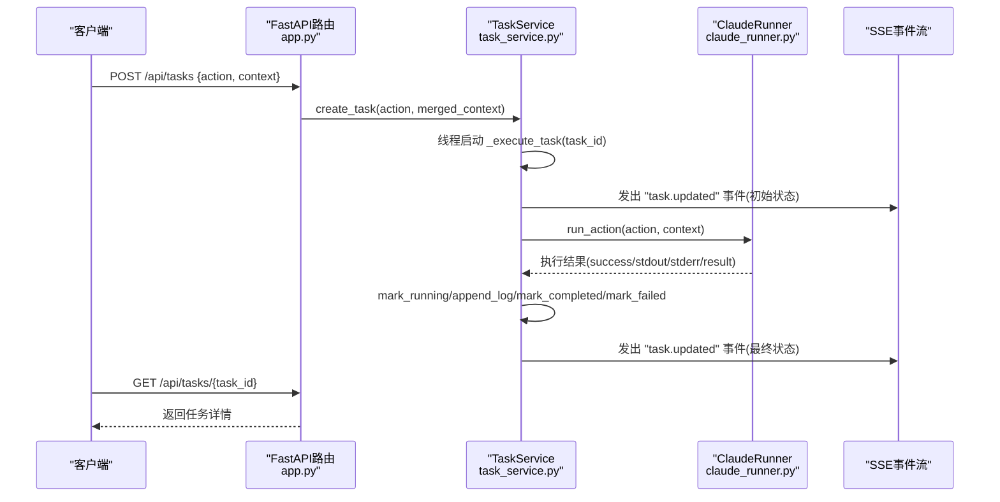
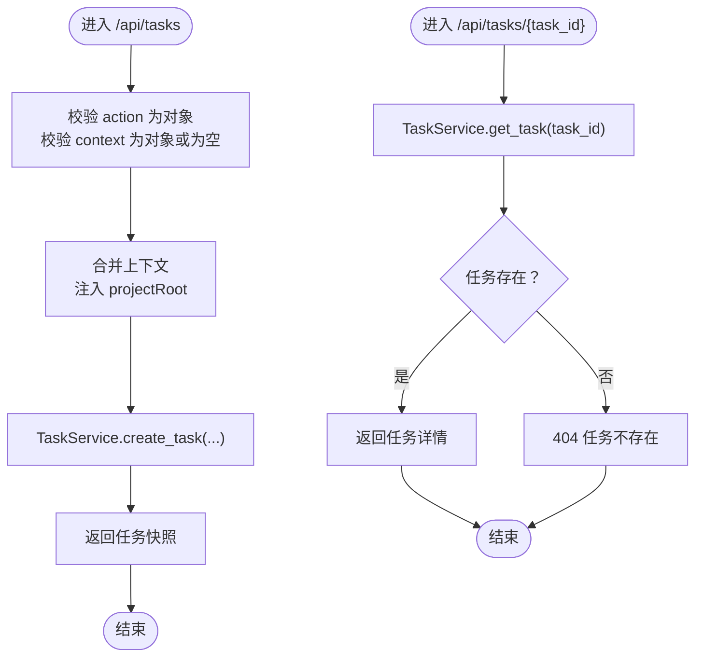
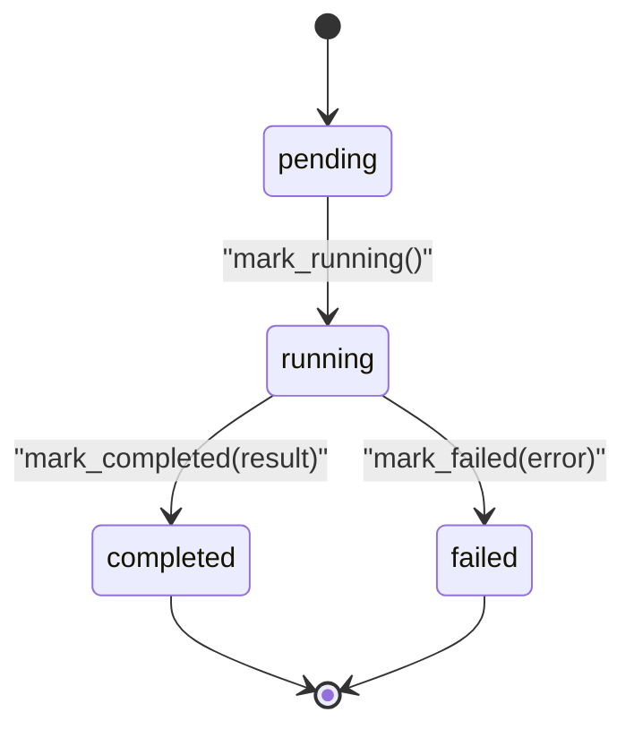
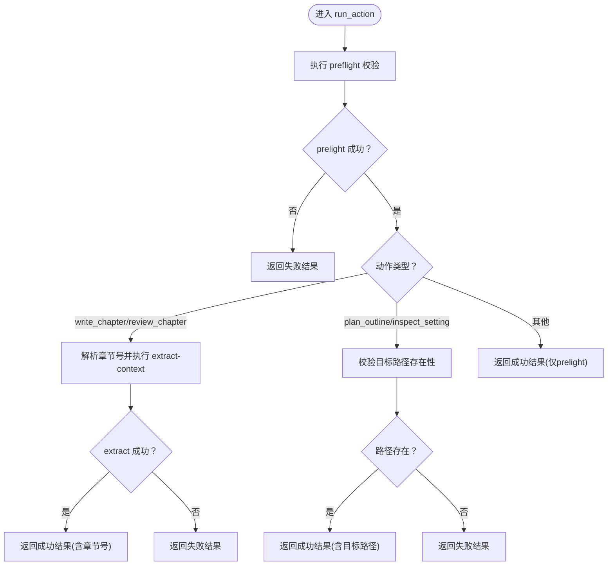
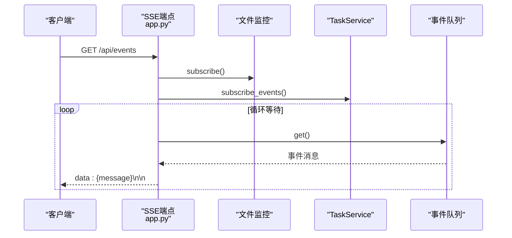
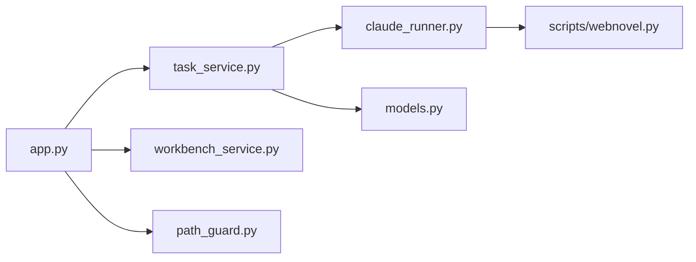

# 任务管理API

<cite>
**本文引用的文件**
- [app.py](file://webnovel-writer/dashboard/app.py)
- [task_service.py](file://webnovel-writer/dashboard/task_service.py)
- [models.py](file://webnovel-writer/dashboard/models.py)
- [claude_runner.py](file://webnovel-writer/dashboard/claude_runner.py)
- [server.py](file://webnovel-writer/dashboard/server.py)
- [test_phase2_tasks.py](file://webnovel-writer/dashboard/tests/test_phase2_tasks.py)
- [data.js](file://webnovel-writer/dashboard/frontend/src/workbench/data.js)
</cite>

## 目录
1. [简介](#简介)
2. [项目结构](#项目结构)
3. [核心组件](#核心组件)
4. [架构概览](#架构概览)
5. [详细组件分析](#详细组件分析)
6. [依赖分析](#依赖分析)
7. [性能考虑](#性能考虑)
8. [故障排除指南](#故障排除指南)
9. [结论](#结论)
10. [附录](#附录)

## 简介
本文件面向任务管理API的使用者与维护者，系统性梳理以下能力与规范：
- 当前任务查询：/api/tasks/current 的状态获取流程
- 任务创建：/api/tasks 的动作执行与上下文合并策略
- 任务详情查询：/api/tasks/{task_id} 的ID验证与状态检查
- TaskService的任务调度机制、异步执行模型、任务队列管理与状态跟踪
- 任务上下文参数、执行结果格式、错误处理与重试机制
- 任务生命周期管理与调试指南

本API基于FastAPI构建，采用线程池+事件队列的方式实现后台任务执行与状态推送，支持通过Server-Sent Events实时订阅任务更新。

## 项目结构
围绕任务管理API的关键文件组织如下：
- API入口与路由定义：dashboard/app.py
- 任务服务与状态管理：dashboard/task_service.py
- 任务状态常量与默认负载：dashboard/models.py
- 动作执行适配层（CLI桥接）：dashboard/claude_runner.py
- 服务器启动脚本：dashboard/server.py
- 前端工作台数据模型与UI集成：dashboard/frontend/src/workbench/data.js
- 测试用例（行为契约）：dashboard/tests/test_phase2_tasks.py

**图表来源**
- [app.py:1-513](file://webnovel-writer/dashboard/app.py#L1-L513)
- [task_service.py:1-166](file://webnovel-writer/dashboard/task_service.py#L1-L166)
- [models.py:1-23](file://webnovel-writer/dashboard/models.py#L1-L23)
- [claude_runner.py:1-142](file://webnovel-writer/dashboard/claude_runner.py#L1-L142)
- [server.py:1-72](file://webnovel-writer/dashboard/server.py#L1-L72)
- [data.js:1-163](file://webnovel-writer/dashboard/frontend/src/workbench/data.js#L1-L163)
- [test_phase2_tasks.py:1-147](file://webnovel-writer/dashboard/tests/test_phase2_tasks.py#L1-L147)

**章节来源**
- [app.py:1-513](file://webnovel-writer/dashboard/app.py#L1-L513)
- [task_service.py:1-166](file://webnovel-writer/dashboard/task_service.py#L1-L166)
- [models.py:1-23](file://webnovel-writer/dashboard/models.py#L1-L23)
- [claude_runner.py:1-142](file://webnovel-writer/dashboard/claude_runner.py#L1-L142)
- [server.py:1-72](file://webnovel-writer/dashboard/server.py#L1-L72)
- [data.js:1-163](file://webnovel-writer/dashboard/frontend/src/workbench/data.js#L1-L163)
- [test_phase2_tasks.py:1-147](file://webnovel-writer/dashboard/tests/test_phase2_tasks.py#L1-L147)

## 核心组件
- TaskService：负责任务生命周期管理、状态转换、日志累积、事件分发与并发安全
- ClaudeRunner：将动作映射为CLI命令，执行预检与上下文提取，返回标准化执行结果
- FastAPI应用：提供REST接口、SSE事件流、CORS与静态资源托管
- 前端工作台：消费任务状态并渲染用户界面

关键职责边界：
- API层：输入校验、上下文合并、错误响应
- 服务层：任务持久化、状态机、事件通知
- 执行层：动作到CLI的桥接与结果封装

**章节来源**
- [task_service.py:14-166](file://webnovel-writer/dashboard/task_service.py#L14-L166)
- [claude_runner.py:13-142](file://webnovel-writer/dashboard/claude_runner.py#L13-L142)
- [app.py:395-418](file://webnovel-writer/dashboard/app.py#L395-L418)

## 架构概览
任务管理API采用“请求-线程-事件”的异步执行模型：
- 请求进入：FastAPI路由接收请求并进行基础校验
- 创建任务：TaskService生成任务快照并启动后台线程执行
- 执行动作：ClaudeRunner执行预检与上下文提取，返回标准化结果
- 状态更新：TaskService更新状态、日志与结果，并通过事件队列广播
- 实时推送：SSE端点将任务事件推送给客户端

**图表来源**
- [app.py:395-418](file://webnovel-writer/dashboard/app.py#L395-L418)
- [task_service.py:36-143](file://webnovel-writer/dashboard/task_service.py#L36-L143)
- [claude_runner.py:13-112](file://webnovel-writer/dashboard/claude_runner.py#L13-L112)

## 详细组件分析

### API端点与输入校验
- /api/tasks/current
  - 返回当前任务快照，若无活动任务则返回空闲负载
  - 路由实现：app.py 中的 current_task()
- /api/tasks
  - 接收 {action, context}，校验action为对象，context为对象或为空
  - 合并上下文：将 projectRoot 注入到 context 中
  - 调用 TaskService.create_task 并返回任务快照
- /api/tasks/{task_id}
  - 校验任务是否存在，不存在返回404
  - 存在则返回完整任务详情

**图表来源**
- [app.py:395-418](file://webnovel-writer/dashboard/app.py#L395-L418)

**章节来源**
- [app.py:395-418](file://webnovel-writer/dashboard/app.py#L395-L418)

### TaskService任务调度与状态机
- 数据结构
  - 任务字典：以任务ID为键，存储状态、动作、上下文、时间戳、日志、结果、错误
  - 当前任务ID：指向最近创建的任务
  - 订阅者队列：用于SSE事件广播
  - 互斥锁：保证多线程下对任务状态的原子更新
- 关键方法
  - create_task：生成任务快照、设置当前任务ID、发出初始事件、启动后台线程执行
  - get_task/get_current_task：安全读取任务副本
  - append_log/mark_running/mark_completed/mark_failed：状态转换与日志累积
  - _execute_task：执行动作、捕获异常、更新状态与日志
  - _emit_task_event/_dispatch：跨线程事件分发，丢弃过载队列
- 状态流转
  - pending → running → completed 或 failed
  - 日志最多保留200条，更新时间随每次变更而更新

**图表来源**
- [task_service.py:88-120](file://webnovel-writer/dashboard/task_service.py#L88-L120)
- [models.py:9-22](file://webnovel-writer/dashboard/models.py#L9-L22)

**章节来源**
- [task_service.py:14-166](file://webnovel-writer/dashboard/task_service.py#L14-L166)
- [models.py:1-23](file://webnovel-writer/dashboard/models.py#L1-L23)

### ClaudeRunner动作执行适配
- 输入：action（type/label/params）、context（含projectRoot）
- 执行步骤
  - 预检：执行预检命令，失败即返回失败结果
  - 章节类动作：解析章节号，执行上下文提取，成功时返回包含章节号的结果
  - 大纲/设定类动作：校验目标路径存在性，成功时返回包含目标路径的结果
  - 其他动作：仅执行预检
- 输出：标准化执行结果，包含success、stdout、stderr、result
- 特殊动作：force_fail用于测试失败场景

**图表来源**
- [claude_runner.py:13-112](file://webnovel-writer/dashboard/claude_runner.py#L13-L112)

**章节来源**
- [claude_runner.py:13-142](file://webnovel-writer/dashboard/claude_runner.py#L13-L142)

### SSE事件推送与前端集成
- SSE端点：/api/events
  - 订阅文件变更与任务事件队列
  - 使用asyncio.wait等待任一队列可用，返回data:消息
- 事件格式：包含type、taskId、task
- 前端模型：前端工作台使用IDLE_TASK与normalize逻辑渲染任务状态与提示

**图表来源**
- [app.py:434-460](file://webnovel-writer/dashboard/app.py#L434-L460)
- [task_service.py:25-28](file://webnovel-writer/dashboard/task_service.py#L25-L28)

**章节来源**
- [app.py:434-460](file://webnovel-writer/dashboard/app.py#L434-L460)
- [data.js:10-32](file://webnovel-writer/dashboard/frontend/src/workbench/data.js#L10-L32)

## 依赖分析
- TaskService依赖
  - models.TASK_IDLE_PAYLOAD：空闲状态负载
  - claude_runner.run_action：动作执行适配
  - asyncio/queue：事件分发
  - threading：后台线程执行
- FastAPI应用依赖
  - TaskService全局实例
  - workbench_service（聊天与摘要）
  - path_guard（文件访问安全）
- ClaudeRunner依赖
  - scripts/webnovel.py（CLI入口）
  - 正则表达式解析章节号

**图表来源**
- [app.py:20-24](file://webnovel-writer/dashboard/app.py#L20-L24)
- [task_service.py:10-11](file://webnovel-writer/dashboard/task_service.py#L10-L11)
- [claude_runner.py:10](file://webnovel-writer/dashboard/claude_runner.py#L10)

**章节来源**
- [app.py:20-24](file://webnovel-writer/dashboard/app.py#L20-L24)
- [task_service.py:10-11](file://webnovel-writer/dashboard/task_service.py#L10-L11)
- [claude_runner.py:10](file://webnovel-writer/dashboard/claude_runner.py#L10)

## 性能考虑
- 线程模型
  - 任务执行在后台线程中进行，避免阻塞主线程
  - 事件分发通过loop.call_soon_threadsafe确保线程安全
- 队列容量
  - 事件队列最大128，过载时移除订阅者，防止内存膨胀
- 日志截断
  - 任务日志最多保留200条，降低存储与传输开销
- 并发控制
  - 使用Lock保护任务字典与状态字段，避免竞态条件
- I/O优化
  - SSE端点使用asyncio.wait选择性等待，减少轮询成本

[本节为通用性能讨论，无需特定文件来源]

## 故障排除指南
- 常见错误与处理
  - /api/tasks 缺少action或context类型错误：返回400，提示action必须为对象，context必须为对象或为空
  - /api/tasks/{task_id} 任务不存在：返回404
  - 任务执行失败：检查stdout/stderr与error字段，定位具体失败原因
  - 事件未到达：确认SSE连接正常，检查队列是否过载导致订阅者被移除
- 调试建议
  - 使用测试用例验证任务生命周期：pending → running → completed/failed
  - 在前端工作台观察任务状态变化与提示
  - 检查projectRoot是否正确注入，确保CLI执行环境一致

**章节来源**
- [app.py:395-418](file://webnovel-writer/dashboard/app.py#L395-L418)
- [task_service.py:129-142](file://webnovel-writer/dashboard/task_service.py#L129-L142)
- [test_phase2_tasks.py:9-147](file://webnovel-writer/dashboard/tests/test_phase2_tasks.py#L9-L147)
- [data.js:132-140](file://webnovel-writer/dashboard/frontend/src/workbench/data.js#L132-L140)

## 结论
任务管理API通过清晰的路由设计、健壮的服务层与事件驱动的实时推送，实现了从任务创建、执行到状态跟踪的完整闭环。TaskService的状态机与日志机制为调试提供了充分依据，ClaudeRunner的CLI桥接保证了与现有工具链的一致性。建议在生产环境中关注事件队列容量与日志截断策略，确保系统在高并发下的稳定性。

[本节为总结性内容，无需特定文件来源]

## 附录

### API定义与示例
- GET /api/tasks/current
  - 响应：当前任务快照或空闲负载
- POST /api/tasks
  - 请求体：{action: 对象, context?: 对象}
  - 响应：任务快照（包含id/status/action/context/logs等）
- GET /api/tasks/{task_id}
  - 响应：任务详情（包含status/result/error/logs等）
- GET /api/events
  - 响应：Server-Sent Events，推送任务更新

**章节来源**
- [app.py:395-418](file://webnovel-writer/dashboard/app.py#L395-L418)
- [app.py:434-460](file://webnovel-writer/dashboard/app.py#L434-L460)

### 任务上下文参数与执行结果
- 上下文参数
  - projectRoot：项目根目录（由API自动注入）
  - page/selectedPath：页面与选中路径（可选）
- 执行结果
  - success：布尔值，表示执行是否成功
  - stdout/stderr：标准输出与错误输出
  - result：执行结果对象，包含actionType/label/params/context/summary等
  - exit_code：退出码

**章节来源**
- [app.py:407-411](file://webnovel-writer/dashboard/app.py#L407-L411)
- [claude_runner.py:57-70](file://webnovel-writer/dashboard/claude_runner.py#L57-L70)
- [claude_runner.py:85-98](file://webnovel-writer/dashboard/claude_runner.py#L85-L98)
- [claude_runner.py:100-112](file://webnovel-writer/dashboard/claude_runner.py#L100-L112)

### 错误处理与重试机制
- 错误处理
  - 输入校验失败：400
  - 任务不存在：404
  - 执行异常：捕获异常并标记failed，记录异常信息
- 重试机制
  - 当前实现未内置自动重试；可通过前端或上层业务在失败后发起重试

**章节来源**
- [app.py:403-406](file://webnovel-writer/dashboard/app.py#L403-L406)
- [task_service.py:140-142](file://webnovel-writer/dashboard/task_service.py#L140-L142)
- [test_phase2_tasks.py:110-147](file://webnovel-writer/dashboard/tests/test_phase2_tasks.py#L110-L147)

### 任务生命周期管理
- 生命周期阶段
  - 创建：pending
  - 执行：running
  - 结束：completed 或 failed
- 状态变更触发
  - TaskService内部方法触发状态变更与事件广播
- 前端提示
  - 成功完成后根据actionType生成导航提示
  - 失败时提供恢复建议

**章节来源**
- [task_service.py:88-120](file://webnovel-writer/dashboard/task_service.py#L88-L120)
- [data.js:108-140](file://webnovel-writer/dashboard/frontend/src/workbench/data.js#L108-L140)