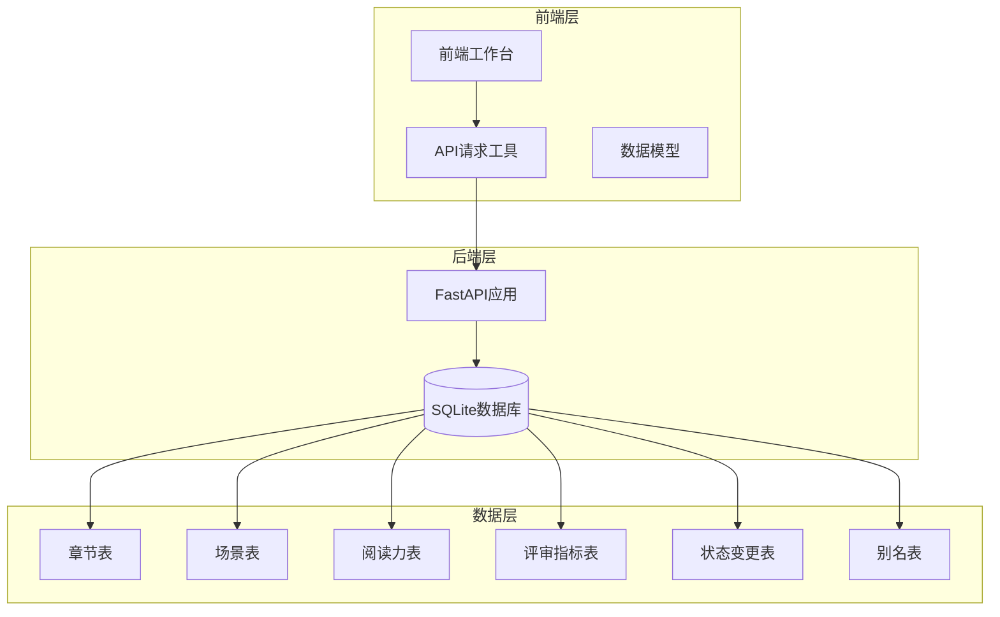
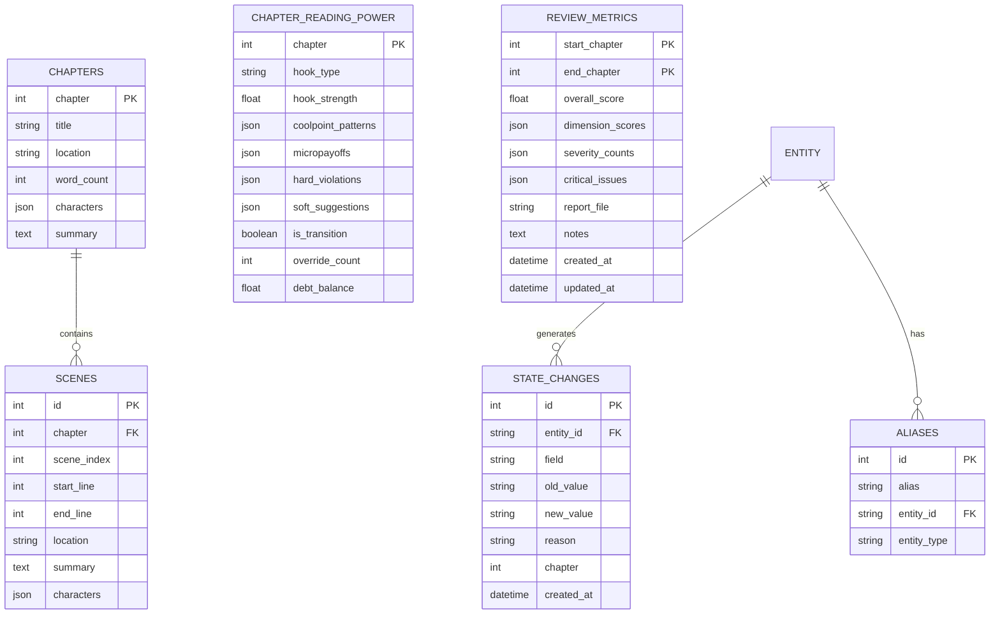
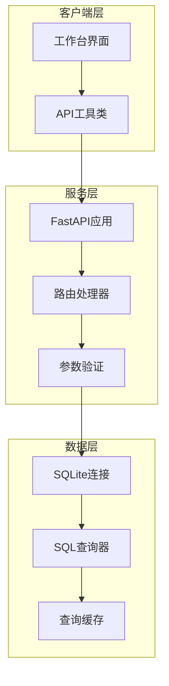
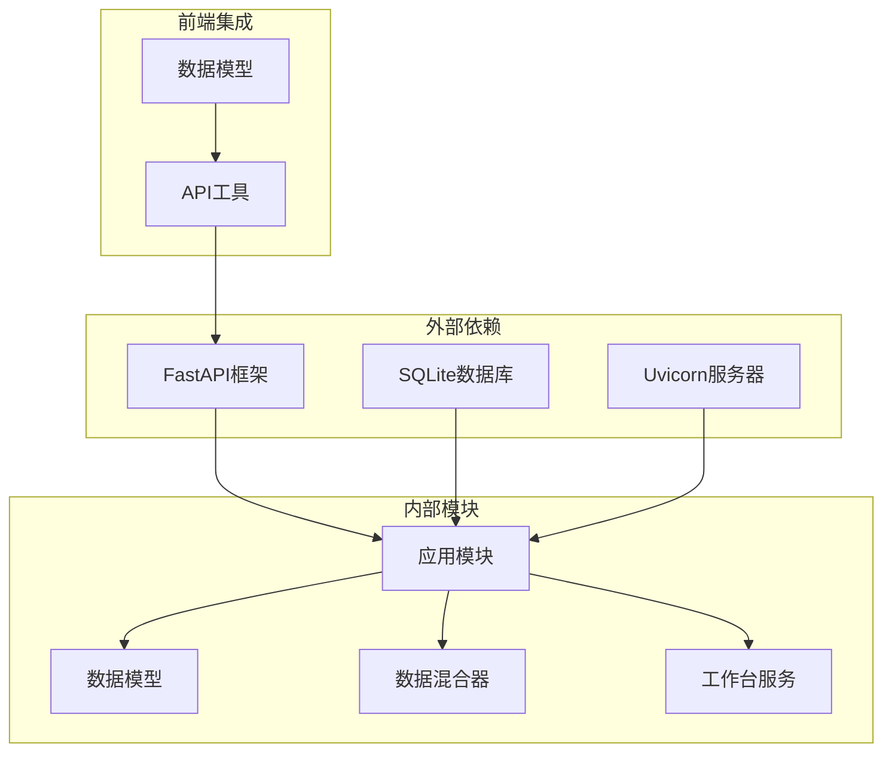

# 场景章节API

<cite>
**本文档引用的文件**
- [app.py](file://webnovel-writer/dashboard/app.py)
- [api.js](file://webnovel-writer/dashboard/frontend/src/api.js)
- [data.js](file://webnovel-writer/dashboard/frontend/src/workbench/data.js)
- [index_chapter_mixin.py](file://webnovel-writer/scripts/data_modules/index_chapter_mixin.py)
- [index_reading_mixin.py](file://webnovel-writer/scripts/data_modules/index_reading_mixin.py)
- [workbench_service.py](file://webnovel-writer/dashboard/workbench_service.py)
- [schemas.py](file://webnovel-writer/scripts/data_modules/schemas.py)
- [server.py](file://webnovel-writer/dashboard/server.py)
</cite>

## 目录
1. [简介](#简介)
2. [项目结构](#项目结构)
3. [核心组件](#核心组件)
4. [架构概览](#架构概览)
5. [详细组件分析](#详细组件分析)
6. [依赖分析](#依赖分析)
7. [性能考虑](#性能考虑)
8. [故障排除指南](#故障排除指南)
9. [结论](#结论)

## 简介

场景章节API是Webnovel Writer项目中的核心数据查询接口，专门用于小说创作过程中的场景管理和章节分析。该API提供了完整的章节和场景数据查询能力，包括章节列表查询、场景数据检索、阅读力追踪、评审指标分析等功能。

该项目采用FastAPI框架构建，使用SQLite作为数据存储，通过只读查询的方式为前端工作台提供数据支持。API设计遵循RESTful原则，提供清晰的URL结构和标准化的响应格式。

## 项目结构

Webnovel Writer项目采用分层架构设计，主要包含以下核心模块：



**图表来源**
- [app.py:185-243](file://webnovel-writer/dashboard/app.py#L185-L243)
- [index_chapter_mixin.py:14-303](file://webnovel-writer/scripts/data_modules/index_chapter_mixin.py#L14-L303)

**章节来源**
- [app.py:1-513](file://webnovel-writer/dashboard/app.py#L1-L513)
- [server.py:1-72](file://webnovel-writer/dashboard/server.py#L1-L72)

## 核心组件

场景章节API的核心功能围绕五个主要端点构建，每个端点都针对特定的数据查询需求进行了优化：

### 数据模型关系

系统使用SQLite数据库存储所有创作相关数据，主要包含以下核心表：



**图表来源**
- [index_chapter_mixin.py:19-111](file://webnovel-writer/scripts/data_modules/index_chapter_mixin.py#L19-L111)
- [index_reading_mixin.py:20-188](file://webnovel-writer/scripts/data_modules/index_reading_mixin.py#L20-L188)

### 查询优化策略

系统采用多种查询优化策略确保高效的数据检索：

1. **索引优化**: 关键查询字段如`chapter`、`scene_index`、`entity_id`等建立了适当的索引
2. **分页机制**: 所有列表查询都支持`limit`参数进行分页
3. **条件过滤**: 支持按章节号、实体ID等条件进行精确过滤
4. **排序优化**: 针对不同查询场景提供最优的排序策略

**章节来源**
- [app.py:185-243](file://webnovel-writer/dashboard/app.py#L185-L243)
- [index_chapter_mixin.py:67-131](file://webnovel-writer/scripts/data_modules/index_chapter_mixin.py#L67-L131)

## 架构概览

场景章节API采用典型的三层架构设计，确保了良好的可维护性和扩展性：



**图表来源**
- [app.py:50-489](file://webnovel-writer/dashboard/app.py#L50-L489)
- [api.js:7-25](file://webnovel-writer/dashboard/frontend/src/api.js#L7-L25)

### 缓存机制

系统实现了多层次的缓存策略：

1. **数据库连接缓存**: 使用连接池管理SQLite连接
2. **查询结果缓存**: 对频繁访问的查询结果进行短期缓存
3. **前端缓存**: 前端应用层对API响应进行本地缓存

**章节来源**
- [app.py:96-113](file://webnovel-writer/dashboard/app.py#L96-L113)
- [api.js:1-78](file://webnovel-writer/dashboard/frontend/src/api.js#L1-L78)

## 详细组件分析

### 章节列表查询 (/api/chapters)

章节列表查询是场景章节API的基础功能，提供按章节号升序排列的完整章节元数据。

#### API规范

- **端点**: `GET /api/chapters`
- **排序**: `chapter ASC`
- **响应**: 章节元数据数组
- **查询参数**: 无

#### 数据模型

章节表包含以下核心字段：
- `chapter`: 章节号（主键）
- `title`: 章节标题
- `location`: 文件位置
- `word_count`: 字数统计
- `characters`: 登场角色列表
- `summary`: 章节摘要

#### 使用示例

```javascript
// 获取所有章节
const chapters = await fetchJSON('/api/chapters');

// 处理响应数据
chapters.forEach(chapter => {
    console.log(`第${chapter.chapter}章: ${chapter.title}`);
});
```

**章节来源**
- [app.py:185-189](file://webnovel-writer/dashboard/app.py#L185-L189)
- [index_chapter_mixin.py:15-44](file://webnovel-writer/scripts/data_modules/index_chapter_mixin.py#L15-L44)

### 场景列表查询 (/api/scenes)

场景列表查询提供章节内场景数据的灵活检索能力，支持按章节过滤和排序控制。

#### API规范

- **端点**: `GET /api/scenes`
- **查询参数**:
  - `chapter`: 章节号（可选，用于按章节过滤）
  - `limit`: 结果数量限制（默认500）
- **排序**: `scene_index ASC`
- **响应**: 场景数据数组

#### 场景数据模型

场景表包含以下字段：
- `id`: 场景标识符
- `chapter`: 所属章节
- `scene_index`: 场景顺序索引
- `start_line`: 起始行号
- `end_line`: 结束行号
- `location`: 场景地点
- `summary`: 场景摘要
- `characters`: 参与角色

#### 查询策略

系统提供两种查询模式：

1. **章节过滤模式**: 当指定`chapter`参数时，返回该章节内的所有场景
2. **全量查询模式**: 当未指定`chapter`参数时，返回多个章节的场景数据

#### 使用示例

```javascript
// 获取第5章的所有场景
const scenes = await fetchJSON('/api/scenes', { chapter: 5 });

// 获取前100个场景（跨章节）
const allScenes = await fetchJSON('/api/scenes', { limit: 100 });

// 处理场景数据
scenes.forEach((scene, index) => {
    console.log(`场景${index + 1}: ${scene.summary}`);
});
```

**章节来源**
- [app.py:191-202](file://webnovel-writer/dashboard/app.py#L191-L202)
- [index_chapter_mixin.py:67-111](file://webnovel-writer/scripts/data_modules/index_chapter_mixin.py#L67-L111)

### 阅读力数据 (/api/reading-power)

阅读力数据接口提供章节阅读力追踪和趋势分析功能，帮助作者了解作品的读者吸引力。

#### API规范

- **端点**: `GET /api/reading-power`
- **查询参数**:
  - `limit`: 结果数量限制（默认50）
- **排序**: `chapter DESC`
- **响应**: 阅读力指标数组

#### 阅读力指标模型

阅读力表包含以下核心指标：
- `chapter`: 章节号
- `hook_type`: 钩子类型
- `hook_strength`: 钩子强度
- `coolpoint_patterns`: 爽点模式
- `micropayoffs`: 微奖励系统
- `hard_violations`: 严重违规
- `soft_suggestions`: 轻微建议
- `is_transition`: 是否过渡章节
- `override_count`: 覆盖次数
- `debt_balance`: 债务余额

#### 趋势分析功能

系统提供多种阅读力分析维度：

1. **模式使用统计**: 统计最近N章中各种爽点模式的使用频率
2. **钩子类型分布**: 分析不同类型钩子的使用情况
3. **趋势变化监控**: 跟踪阅读力指标随章节的变化趋势

#### 使用示例

```javascript
// 获取最近20章的阅读力数据
const readingPower = await fetchJSON('/api/reading-power', { limit: 20 });

// 分析阅读力趋势
readingPower.forEach(record => {
    console.log(`第${record.chapter}章 - 阅读力指数: ${record.hook_strength}`);
});

// 统计爽点模式使用频率
const patternStats = calculatePatternStats(readingPower);
console.log('爽点模式使用统计:', patternStats);
```

**章节来源**
- [app.py:204-210](file://webnovel-writer/dashboard/app.py#L204-L210)
- [index_reading_mixin.py:16-86](file://webnovel-writer/scripts/data_modules/index_reading_mixin.py#L16-L86)

### 评审指标 (/api/review-metrics)

评审指标接口提供章节质量评估和评分统计功能，支持按结束章节降序排列。

#### API规范

- **端点**: `GET /api/review-metrics`
- **查询参数**:
  - `limit`: 结果数量限制（默认20）
- **排序**: `end_chapter DESC`
- **响应**: 评审指标数组

#### 评审指标模型

评审指标表包含以下字段：
- `start_chapter`: 开始章节
- `end_chapter`: 结束章节
- `overall_score`: 总体评分
- `dimension_scores`: 维度评分
- `severity_counts`: 严重程度统计
- `critical_issues`: 关键问题
- `report_file`: 报告文件
- `notes`: 备注
- `created_at`: 创建时间
- `updated_at`: 更新时间

#### 评分统计功能

系统提供多层次的评分统计分析：

1. **整体平均分**: 计算最近N次评审的整体平均分
2. **维度分析**: 分析各个维度的平均得分
3. **严重问题统计**: 统计各类严重问题的数量
4. **时间趋势**: 展示评分随时间的变化趋势

#### 使用示例

```javascript
// 获取最近10次评审数据
const reviewMetrics = await fetchJSON('/api/review-metrics', { limit: 10 });

// 计算质量趋势
const trendStats = calculateTrendStats(reviewMetrics);
console.log('质量趋势分析:', trendStats);

// 生成评审报告
const report = generateReviewReport(reviewMetrics);
console.log('评审报告:', report);
```

**章节来源**
- [app.py:212-218](file://webnovel-writer/dashboard/app.py#L212-L218)
- [index_reading_mixin.py:137-255](file://webnovel-writer/scripts/data_modules/index_reading_mixin.py#L137-L255)

### 状态变更 (/api/state-changes)

状态变更接口提供实体状态追踪功能，支持按章节降序排序。

#### API规范

- **端点**: `GET /api/state-changes`
- **查询参数**:
  - `entity`: 实体ID（可选，用于按实体过滤）
  - `limit`: 结果数量限制（默认100）
- **排序**: `chapter DESC`
- **响应**: 状态变更记录数组

#### 状态变更模型

状态变更表包含以下字段：
- `id`: 变更记录ID
- `entity_id`: 实体标识符
- `field`: 变更字段
- `old_value`: 旧值
- `new_value`: 新值
- `reason`: 变更原因
- `chapter`: 章节号
- `created_at`: 创建时间

#### 变更追踪功能

系统提供完整的实体状态变更追踪：

1. **实体级追踪**: 按实体ID过滤特定实体的状态变更
2. **时间线视图**: 按章节顺序展示状态变更历史
3. **变更对比**: 显示变更前后的具体差异
4. **原因分析**: 记录每次变更的具体原因

#### 使用示例

```javascript
// 获取特定实体的状态变更历史
const stateChanges = await fetchJSON('/api/state-changes', { 
    entity: 'character_001' 
});

// 获取最近50条状态变更
const recentChanges = await fetchJSON('/api/state-changes', { 
    limit: 50 
});

// 分析状态变更模式
stateChanges.forEach(change => {
    console.log(`第${change.chapter}章 - ${change.field}: ${change.old_value} -> ${change.new_value}`);
});
```

**章节来源**
- [app.py:220-232](file://webnovel-writer/dashboard/app.py#L220-L232)

### 别名查询 (/api/aliases)

别名查询接口提供实体别名管理和批量查询功能。

#### API规范

- **端点**: `GET /api/aliases`
- **查询参数**:
  - `entity`: 实体ID（可选，用于按实体过滤）
- **响应**: 别名记录数组

#### 别名模型

别名表包含以下字段：
- `id`: 别名记录ID
- `alias`: 别名文本
- `entity_id`: 实体标识符
- `entity_type`: 实体类型

#### 别名管理功能

系统提供完整的别名管理能力：

1. **实体别名查询**: 获取特定实体的所有别名
2. **批量别名查询**: 获取所有实体的别名信息
3. **别名去重**: 确保别名的唯一性
4. **类型关联**: 将别名与正确的实体类型关联

#### 使用示例

```javascript
// 获取特定实体的所有别名
const entityAliases = await fetchJSON('/api/aliases', { 
    entity: 'character_001' 
});

// 获取所有别名
const allAliases = await fetchJSON('/api/aliases');

// 管理别名列表
const aliasMap = {};
allAliases.forEach(alias => {
    if (!aliasMap[alias.entity_id]) {
        aliasMap[alias.entity_id] = [];
    }
    aliasMap[alias.entity_id].push(alias.alias);
});
```

**章节来源**
- [app.py:234-243](file://webnovel-writer/dashboard/app.py#L234-L243)

## 依赖分析

场景章节API的依赖关系相对简单，主要依赖于FastAPI框架和SQLite数据库：



**图表来源**
- [app.py:15-25](file://webnovel-writer/dashboard/app.py#L15-L25)
- [server.py:55-67](file://webnovel-writer/dashboard/server.py#L55-L67)

### 错误处理机制

系统实现了完善的错误处理机制：

1. **HTTP异常处理**: 对数据库不存在、文件不存在等情况返回标准HTTP状态码
2. **参数验证**: 对查询参数进行类型和范围验证
3. **数据库异常处理**: 捕获并处理SQLite操作异常
4. **前端错误反馈**: 将错误信息格式化为用户友好的提示

**章节来源**
- [app.py:84-86](file://webnovel-writer/dashboard/app.py#L84-L86)
- [app.py:109-112](file://webnovel-writer/dashboard/app.py#L109-L112)

## 性能考虑

场景章节API在设计时充分考虑了性能优化：

### 查询性能优化

1. **索引策略**: 在高频查询字段上建立适当索引
2. **查询限制**: 默认设置合理的查询限制防止大数据量查询
3. **连接池管理**: 复用数据库连接减少连接开销
4. **分页机制**: 支持分页查询避免一次性加载大量数据

### 缓存策略

1. **短期缓存**: 对频繁访问的查询结果进行短期缓存
2. **内存优化**: 控制缓存大小防止内存溢出
3. **失效机制**: 设置合理的缓存失效时间

### 并发处理

1. **异步支持**: 使用FastAPI的异步特性提高并发处理能力
2. **任务队列**: 对耗时操作使用任务队列异步处理
3. **资源管理**: 合理管理数据库连接和文件句柄

## 故障排除指南

### 常见问题及解决方案

#### 数据库连接问题

**症状**: API调用返回500错误
**原因**: index.db文件不存在或权限不足
**解决方案**: 
1. 确认项目根目录下存在`.webnovel/state.json`文件
2. 检查数据库文件权限
3. 重启服务确保文件系统同步

#### 查询超时问题

**症状**: API响应缓慢或超时
**原因**: 查询结果过大或缺少适当限制
**解决方案**:
1. 使用`limit`参数限制返回结果数量
2. 添加适当的过滤条件
3. 优化查询语句

#### 参数错误问题

**症状**: API返回400错误
**原因**: 查询参数类型或格式不正确
**解决方案**:
1. 检查查询参数的类型和格式
2. 确认必需参数已提供
3. 验证参数值的有效范围

### 调试技巧

1. **日志分析**: 查看服务器日志了解错误详情
2. **参数验证**: 在前端添加参数验证逻辑
3. **网络监控**: 使用浏览器开发者工具监控API调用
4. **数据库检查**: 直接查询SQLite数据库验证数据完整性

**章节来源**
- [app.py:109-112](file://webnovel-writer/dashboard/app.py#L109-L112)
- [api.js:13](file://webnovel-writer/dashboard/frontend/src/api.js#L13)

## 结论

场景章节API为Webnovel Writer项目提供了完整的章节和场景数据管理能力。通过精心设计的查询接口、优化的数据模型和完善的错误处理机制，该API能够有效支持小说创作过程中的各种数据查询需求。

系统的主要优势包括：

1. **清晰的API设计**: 遵循RESTful原则，接口简洁易用
2. **高效的查询性能**: 通过索引优化和分页机制确保快速响应
3. **全面的功能覆盖**: 涵盖章节管理、场景分析、阅读力追踪等多个方面
4. **可靠的错误处理**: 提供完善的错误处理和调试支持

未来可以考虑的改进方向包括：
1. 添加更多的查询过滤选项
2. 实现更智能的缓存策略
3. 增加数据导出功能
4. 优化移动端的API使用体验