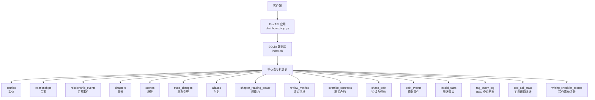
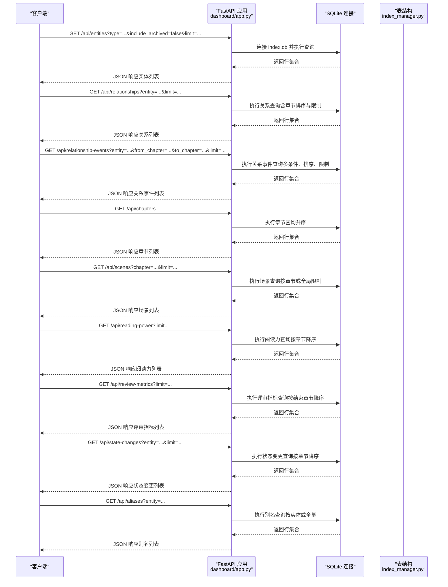
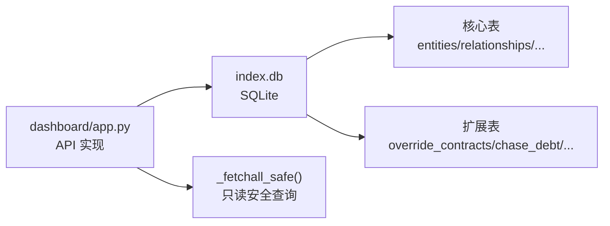

# 实体数据库API

<cite>
**本文引用的文件**
- [webnovel-writer/dashboard/app.py](file://webnovel-writer/dashboard/app.py)
- [webnovel-writer/scripts/data_modules/index_manager.py](file://webnovel-writer/scripts/data_modules/index_manager.py)
- [webnovel-writer/scripts/data_modules/index_entity_mixin.py](file://webnovel-writer/scripts/data_modules/index_entity_mixin.py)
</cite>

## 目录
1. [简介](#简介)
2. [项目结构](#项目结构)
3. [核心组件](#核心组件)
4. [架构总览](#架构总览)
5. [详细组件分析](#详细组件分析)
6. [依赖分析](#依赖分析)
7. [性能考虑](#性能考虑)
8. [故障排查指南](#故障排查指南)
9. [结论](#结论)

## 简介
本文件面向“实体数据库API”的使用者与维护者，系统化梳理基于只读查询的 index.db 数据库接口，涵盖实体、关系、章节、场景、阅读力、评审指标、状态变更、别名等核心与扩展表的端点定义、查询参数、过滤条件、排序规则与分页机制。所有端点均为只读，确保在不破坏索引数据的前提下提供稳定的数据检索能力。

## 项目结构
- API 服务位于 dashboard 子模块，通过 FastAPI 提供 REST 接口。
- index.db 由 scripts/data_modules 下的 IndexManager/混合类负责建表与索引维护。
- 所有只读查询端点均在 dashboard/app.py 中实现，统一使用 SQLite 连接与安全查询封装。

图表来源
- [webnovel-writer/dashboard/app.py:96-243](file://webnovel-writer/dashboard/app.py#L96-L243)
- [webnovel-writer/scripts/data_modules/index_manager.py:240-620](file://webnovel-writer/scripts/data_modules/index_manager.py#L240-L620)

章节来源
- [webnovel-writer/dashboard/app.py:96-243](file://webnovel-writer/dashboard/app.py#L96-L243)
- [webnovel-writer/scripts/data_modules/index_manager.py:240-620](file://webnovel-writer/scripts/data_modules/index_manager.py#L240-L620)

## 核心组件
- 数据库连接与只读封装
  - 通过 _get_db() 获取 SQLite 连接，设置行工厂为字典式访问。
  - 通过 _fetchall_safe() 执行只读查询，对“表不存在”异常进行兼容处理（返回空列表），避免因旧版本库导致的 500 错误。
- 实体数据库只读查询端点群
  - /api/entities：按类型过滤与归档状态筛选，支持排序与分页。
  - /api/entities/{entity_id}：按主键查询实体详情。
  - /api/relationships：按实体关联与章节范围过滤，支持分页。
  - /api/relationship-events：多条件查询（实体、章节范围），支持排序与分页。
  - /api/chapters：按章节升序列出。
  - /api/scenes：按章节或全局限制列出。
  - /api/reading-power：按章节降序列出。
  - /api/review-metrics：按结束章节降序列出。
  - /api/state-changes：按实体或全局过滤，按章节降序列出。
  - /api/aliases：按实体过滤或全量列出。
- 扩展表接口（v5.3+ / v5.4+）
  - /api/overrides、/api/debts、/api/debt-events、/api/invalid-facts、/api/rag-queries、/api/tool-stats、/api/checklist-scores

章节来源
- [webnovel-writer/dashboard/app.py:96-243](file://webnovel-writer/dashboard/app.py#L96-L243)

## 架构总览
下图展示 API 层到数据库层的交互关系与关键查询路径：

图表来源
- [webnovel-writer/dashboard/app.py:114-243](file://webnovel-writer/dashboard/app.py#L114-L243)
- [webnovel-writer/scripts/data_modules/index_manager.py:240-620](file://webnovel-writer/scripts/data_modules/index_manager.py#L240-L620)

## 详细组件分析

### 实体查询 /api/entities
- 功能概述
  - 支持按实体类型过滤与归档状态筛选；默认排除已归档实体。
  - 结果按“最后出场章节”降序排列。
  - 支持 limit 参数进行分页控制。
- 查询参数
  - type: 实体类型（可选）
  - include_archived: 是否包含归档实体（布尔，默认 false）
  - limit: 最大返回条数（默认由后端实现决定）
- 过滤条件
  - 类型精确匹配；归档状态默认仅返回 is_archived = 0 的记录。
- 排序规则
  - last_appearance DESC
- 分页机制
  - 通过 SQL LIMIT 控制返回数量。
- 错误处理
  - 若 index.db 不存在，返回 404。
- 典型用途
  - 快速获取某类型实体列表（如“角色”），并排除历史归档项。

章节来源
- [webnovel-writer/dashboard/app.py:114-133](file://webnovel-writer/dashboard/app.py#L114-L133)

### 实体详情 /api/entities/{entity_id}
- 功能概述
  - 按实体 ID 返回单条实体记录。
- 查询参数
  - 无查询参数，实体 ID 作为路径参数传入。
- 过滤条件
  - 主键精确匹配。
- 排序规则
  - 无排序。
- 分页机制
  - 无分页。
- 错误处理
  - 若实体不存在，返回 404。

章节来源
- [webnovel-writer/dashboard/app.py:135-141](file://webnovel-writer/dashboard/app.py#L135-L141)

### 关系查询 /api/relationships
- 功能概述
  - 支持按实体关联过滤（from_entity 或 to_entity 匹配）。
  - 默认按章节降序返回，支持 limit 控制。
- 查询参数
  - entity: 实体 ID（可选）
  - limit: 最大返回条数（默认 200）
- 过滤条件
  - entity 存在时，查询 from_entity 或 to_entity 等于该 ID。
- 排序规则
  - chapter DESC
- 分页机制
  - LIMIT 控制。
- 错误处理
  - 若 index.db 不存在，返回 404。

章节来源
- [webnovel-writer/dashboard/app.py:143-156](file://webnovel-writer/dashboard/app.py#L143-L156)

### 关系事件 /api/relationship-events
- 功能概述
  - 支持多条件查询：实体（from_entity 或 to_entity）、起止章节范围、limit。
  - 结果按章节降序、事件 ID 降序排序，保证同一章节内的事件顺序稳定。
- 查询参数
  - entity: 实体 ID（可选）
  - from_chapter: 起始章节（可选）
  - to_chapter: 终止章节（可选）
  - limit: 最大返回条数（默认 200）
- 过滤条件
  - entity 存在时，from_entity 或 to_entity 等于该 ID。
  - from_chapter/to_chapter 分别对应 >= 或 <= 条件。
- 排序规则
  - chapter DESC, id DESC
- 分页机制
  - LIMIT 控制。
- 错误处理
  - 若 index.db 不存在，返回 404。

章节来源
- [webnovel-writer/dashboard/app.py:158-183](file://webnovel-writer/dashboard/app.py#L158-L183)

### 章节列表 /api/chapters
- 功能概述
  - 返回全部章节记录，按章节号升序排列。
- 查询参数
  - 无。
- 过滤条件
  - 无。
- 排序规则
  - chapter ASC
- 分页机制
  - 无分页。
- 错误处理
  - 若 index.db 不存在，返回 404。

章节来源
- [webnovel-writer/dashboard/app.py:185-189](file://webnovel-writer/dashboard/app.py#L185-L189)

### 场景列表 /api/scenes
- 功能概述
  - 支持按章节过滤；若未指定章节，则按全局限制返回。
  - 按章节与场景序号升序排列。
- 查询参数
  - chapter: 章节号（可选）
  - limit: 最大返回条数（默认 500）
- 过滤条件
  - chapter 存在时，仅返回该章节的场景。
  - 未指定章节时，按 LIMIT 限制返回。
- 排序规则
  - chapter ASC, scene_index ASC
- 分页机制
  - LIMIT 控制。
- 错误处理
  - 若 index.db 不存在，返回 404。

章节来源
- [webnovel-writer/dashboard/app.py:191-202](file://webnovel-writer/dashboard/app.py#L191-L202)

### 阅读力数据 /api/reading-power
- 功能概述
  - 返回章节级阅读力元数据，按章节降序排列。
- 查询参数
  - limit: 最大返回条数（默认 50）
- 过滤条件
  - 无。
- 排序规则
  - chapter DESC
- 分页机制
  - LIMIT 控制。
- 错误处理
  - 若 index.db 不存在，返回 404。

章节来源
- [webnovel-writer/dashboard/app.py:204-210](file://webnovel-writer/dashboard/app.py#L204-L210)

### 评审指标 /api/review-metrics
- 功能概述
  - 返回评审指标记录，按结束章节降序排列。
- 查询参数
  - limit: 最大返回条数（默认 20）
- 过滤条件
  - 无。
- 排序规则
  - end_chapter DESC
- 分页机制
  - LIMIT 控制。
- 错误处理
  - 若 index.db 不存在，返回 404。

章节来源
- [webnovel-writer/dashboard/app.py:212-218](file://webnovel-writer/dashboard/app.py#L212-L218)

### 状态变更 /api/state-changes
- 功能概述
  - 支持按实体过滤或全局查询，按章节降序排列。
- 查询参数
  - entity: 实体 ID（可选）
  - limit: 最大返回条数（默认 100）
- 过滤条件
  - entity 存在时，仅返回该实体的状态变更。
- 排序规则
  - chapter DESC
- 分页机制
  - LIMIT 控制。
- 错误处理
  - 若 index.db 不存在，返回 404。

章节来源
- [webnovel-writer/dashboard/app.py:220-232](file://webnovel-writer/dashboard/app.py#L220-L232)

### 别名查询 /api/aliases
- 功能概述
  - 支持按实体过滤或全量列出。
- 查询参数
  - entity: 实体 ID（可选）
- 过滤条件
  - entity 存在时，仅返回该实体的别名记录。
- 排序规则
  - 无排序。
- 分页机制
  - 无分页。
- 错误处理
  - 若 index.db 不存在，返回 404。

章节来源
- [webnovel-writer/dashboard/app.py:234-243](file://webnovel-writer/dashboard/app.py#L234-L243)

### 扩展表接口（v5.3+ / v5.4+）
以下端点均采用“安全查询”模式，当目标表不存在时返回空列表，避免 500 错误。

- /api/overrides
  - 查询参数：status（可选）、limit（默认 100）
  - 过滤：按 status 精确匹配
  - 排序：chapter DESC
  - 分页：LIMIT 控制
  - 章节来源：[webnovel-writer/dashboard/app.py:249-262](file://webnovel-writer/dashboard/app.py#L249-L262)

- /api/debts
  - 查询参数：status（可选）、limit（默认 100）
  - 过滤：按 status 精确匹配
  - 排序：updated_at DESC
  - 分页：LIMIT 控制
  - 章节来源：[webnovel-writer/dashboard/app.py:264-277](file://webnovel-writer/dashboard/app.py#L264-L277)

- /api/debt-events
  - 查询参数：debt_id（可选）、limit（默认 200）
  - 过滤：按 debt_id 精确匹配
  - 排序：chapter DESC, id DESC
  - 分页：LIMIT 控制
  - 章节来源：[webnovel-writer/dashboard/app.py:279-292](file://webnovel-writer/dashboard/app.py#L279-L292)

- /api/invalid-facts
  - 查询参数：status（可选）、limit（默认 100）
  - 过滤：按 status 精确匹配
  - 排序：marked_at DESC
  - 分页：LIMIT 控制
  - 章节来源：[webnovel-writer/dashboard/app.py:294-307](file://webnovel-writer/dashboard/app.py#L294-L307)

- /api/rag-queries
  - 查询参数：query_type（可选）、limit（默认 100）
  - 过滤：按 query_type 精确匹配
  - 排序：created_at DESC
  - 分页：LIMIT 控制
  - 章节来源：[webnovel-writer/dashboard/app.py:309-322](file://webnovel-writer/dashboard/app.py#L309-L322)

- /api/tool-stats
  - 查询参数：tool_name（可选）、limit（默认 200）
  - 过滤：按 tool_name 精确匹配
  - 排序：created_at DESC
  - 分页：LIMIT 控制
  - 章节来源：[webnovel-writer/dashboard/app.py:324-337](file://webnovel-writer/dashboard/app.py#L324-L337)

- /api/checklist-scores
  - 查询参数：limit（默认 100）
  - 过滤：无
  - 排序：chapter DESC
  - 分页：LIMIT 控制
  - 章节来源：[webnovel-writer/dashboard/app.py:339-346](file://webnovel-writer/dashboard/app.py#L339-L346)

## 依赖分析
- API 层依赖
  - 仅依赖 SQLite 文件 index.db，不进行写操作。
  - 使用 _get_db() 统一获取连接，_fetchall_safe() 统一处理只读查询与表缺失兼容。
- 数据模型与索引
  - 核心表与索引由 IndexManager 初始化时创建，包含 entities、relationships、relationship_events、chapters、scenes、state_changes、aliases、chapter_reading_power、review_metrics 等。
  - 扩展表（v5.3+/v5.4+）由相应模块维护，API 层通过 _fetchall_safe() 安全访问。
- 性能与稳定性
  - 多处查询带有索引支持（如 entities/type、relationships/from_entity、relationship_events/chapter 等），有助于提升过滤与排序效率。
  - 对“表不存在”异常进行捕获并返回空列表，增强向前兼容性。

图表来源
- [webnovel-writer/dashboard/app.py:96-112](file://webnovel-writer/dashboard/app.py#L96-L112)
- [webnovel-writer/scripts/data_modules/index_manager.py:240-620](file://webnovel-writer/scripts/data_modules/index_manager.py#L240-L620)

章节来源
- [webnovel-writer/dashboard/app.py:96-112](file://webnovel-writer/dashboard/app.py#L96-L112)
- [webnovel-writer/scripts/data_modules/index_manager.py:240-620](file://webnovel-writer/scripts/data_modules/index_manager.py#L240-L620)

## 性能考虑
- 索引利用
  - entities/type、entities/tier、entities/is_protagonist 等索引可加速实体类型与重要度过滤。
  - relationships/from_entity、relationships/to_entity、relationships/chapter 等索引可加速关系查询与排序。
  - relationship_events/chapter、relationship_events/from_entity/chapter、relationship_events/to_entity/chapter、relationship_events/type/chapter 等索引可显著提升关系事件的多维过滤与排序性能。
- 查询优化建议
  - 在高频过滤字段上尽量使用实体 ID、类型、章节范围等条件，减少全表扫描。
  - 合理设置 limit，避免一次性返回过多数据。
  - 对于复杂组合查询（如关系事件），优先使用 entity + 章节范围，以命中复合索引。
- I/O 与连接
  - 每次请求新建连接并在上下文关闭时释放，避免连接泄漏。
  - 对旧版本库的“表不存在”异常进行兼容，避免阻断服务。

## 故障排查指南
- index.db 不存在
  - 现象：返回 404 Not Found。
  - 处理：确认项目根目录下的 .webnovel/index.db 是否存在；若不存在，请先完成索引构建流程。
  - 章节来源：[webnovel-writer/dashboard/app.py:96-102](file://webnovel-writer/dashboard/app.py#L96-L102)
- 表不存在（扩展表）
  - 现象：扩展表查询返回空列表而非 500。
  - 处理：确认目标版本是否包含该表；若不包含，API 已自动兼容。
  - 章节来源：[webnovel-writer/dashboard/app.py:104-112](file://webnovel-writer/dashboard/app.py#L104-L112)
- 实体不存在
  - 现象：/api/entities/{entity_id} 返回 404。
  - 处理：确认实体 ID 是否正确；检查 entities 表中是否存在该记录。
  - 章节来源：[webnovel-writer/dashboard/app.py:135-141](file://webnovel-writer/dashboard/app.py#L135-L141)
- 查询结果为空
  - 现象：某些过滤条件下返回空列表。
  - 处理：检查过滤参数（类型、实体 ID、章节范围、状态等）是否合理；确认目标表中是否存在匹配数据。
  - 章节来源：[webnovel-writer/dashboard/app.py:114-243](file://webnovel-writer/dashboard/app.py#L114-L243)

## 结论
本套实体数据库 API 以 index.db 为核心数据源，提供覆盖实体、关系、章节、场景、阅读力、评审指标、状态变更、别名及扩展表的完整只读查询能力。通过严格的参数化查询、索引优化与异常兼容策略，既满足多样化的检索需求，又保障了系统的稳定性与可维护性。建议在生产环境中结合业务场景合理设置 limit，并优先使用带索引的过滤条件以获得最佳性能。