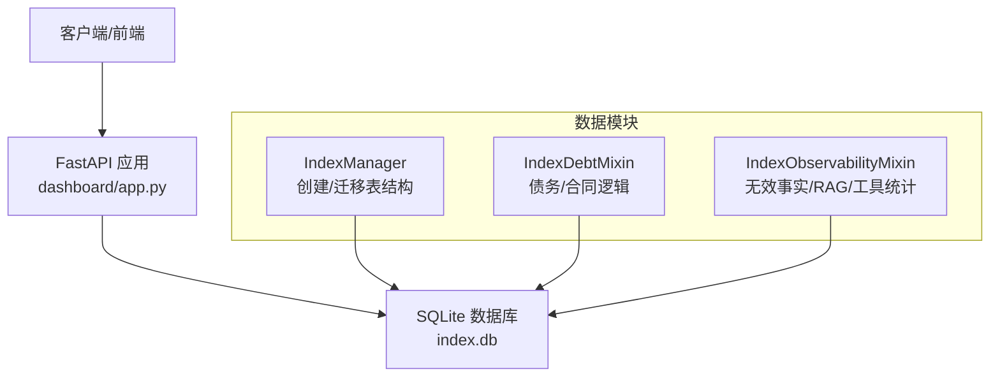
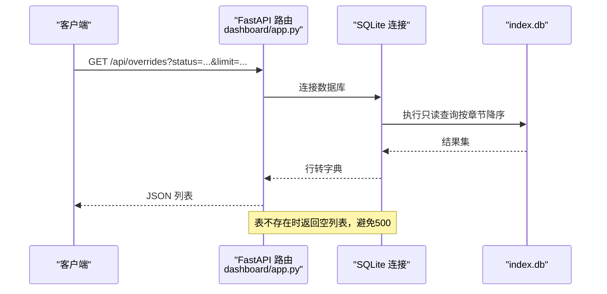
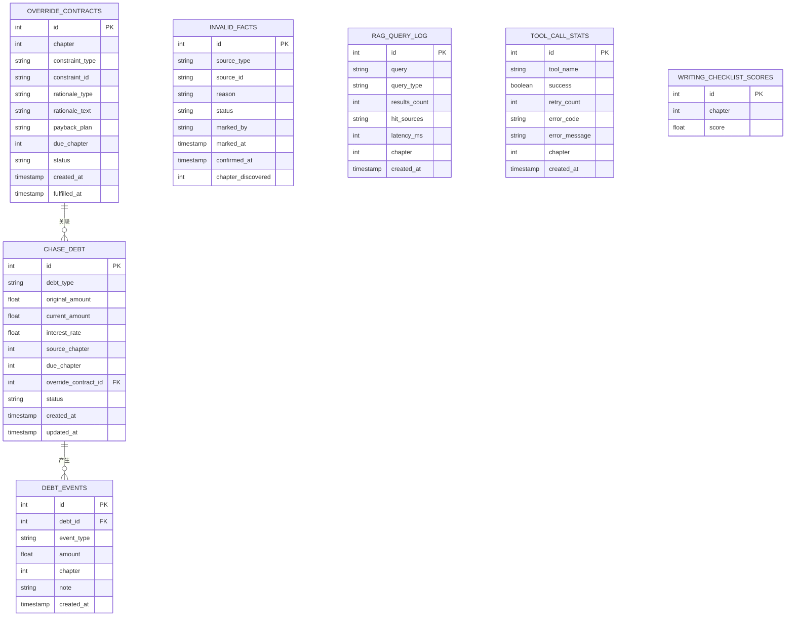
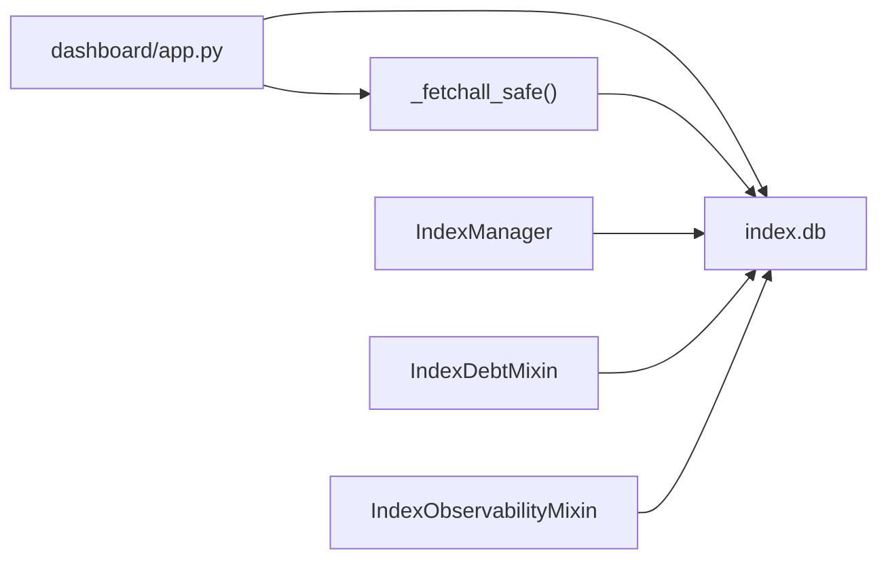

# 扩展表API

<cite>
**本文引用的文件**
- [dashboard/app.py](file://webnovel-writer/dashboard/app.py)
- [scripts/data_modules/index_debt_mixin.py](file://webnovel-writer/scripts/data_modules/index_debt_mixin.py)
- [scripts/data_modules/index_manager.py](file://webnovel-writer/scripts/data_modules/index_manager.py)
- [scripts/data_modules/index_observability_mixin.py](file://webnovel-writer/scripts/data_modules/index_observability_mixin.py)
- [dashboard/frontend/src/api.js](file://webnovel-writer/dashboard/frontend/src/api.js)
- [scripts/data_modules/tests/test_data_modules.py](file://webnovel-writer/scripts/data_modules/tests/test_data_modules.py)
</cite>

## 目录
1. [简介](#简介)
2. [项目结构](#项目结构)
3. [核心组件](#核心组件)
4. [架构总览](#架构总览)
5. [详细组件分析](#详细组件分析)
6. [依赖分析](#依赖分析)
7. [性能考虑](#性能考虑)
8. [故障排查指南](#故障排查指南)
9. [结论](#结论)
10. [附录](#附录)

## 简介
本文件系统化梳理“扩展表API”，覆盖以下端点与其数据模型、业务逻辑、查询优化与版本兼容性：
- 合同扩展表：/api/overrides（状态筛选与章节降序）
- 追读力债务：/api/debts（时间戳降序与状态管理）
- 债务事件：/api/debt-events（债务ID过滤与事件追踪）
- 无效事实：/api/invalid-facts（事实标记与状态控制）
- RAG查询日志：/api/rag-queries（查询类型分类与时间序列）
- 工具统计：/api/tool-stats（调用次数统计与性能监控）
- 写作清单分数：/api/checklist-scores（质量评估与进度追踪）

同时给出参数验证、分页机制、版本兼容性处理与典型使用场景/集成示例。

## 项目结构
后端采用FastAPI，扩展表API位于dashboard应用中，通过只读查询index.db暴露扩展表数据；底层数据模型由数据模块的IndexManager/IndexDebtMixin/IndexObservabilityMixin负责创建与维护。

图表来源
- [dashboard/app.py:249-346](file://webnovel-writer/dashboard/app.py#L249-L346)
- [scripts/data_modules/index_manager.py:415-593](file://webnovel-writer/scripts/data_modules/index_manager.py#L415-L593)

章节来源
- [dashboard/app.py:249-346](file://webnovel-writer/dashboard/app.py#L249-L346)
- [scripts/data_modules/index_manager.py:415-593](file://webnovel-writer/scripts/data_modules/index_manager.py#L415-L593)

## 核心组件
- 扩展表API路由：在dashboard应用中定义，统一走只读查询，异常表不存在时返回空列表，保障向前兼容。
- 数据模型与索引：
  - override_contracts：约束类型+约束ID+章节唯一键，状态机驱动。
  - chase_debt：债务类型、金额、利率、到期章节、状态、外键关联合同。
  - debt_events：债务事件流水（创建/计息/逾期/还款等）。
  - invalid_facts：无效事实标记与状态流转。
  - rag_query_log：RAG查询日志，带查询类型与章节索引。
  - tool_call_stats：工具调用统计，带成功/失败、重试、错误信息。
  - writing_checklist_scores：写作清单分数（章节降序）。
- 版本兼容性：通过只读查询与“表不存在即空”的策略，兼容旧库；新增表通过迁移脚本创建索引。

章节来源
- [dashboard/app.py:104-113](file://webnovel-writer/dashboard/app.py#L104-L113)
- [scripts/data_modules/index_manager.py:415-593](file://webnovel-writer/scripts/data_modules/index_manager.py#L415-L593)

## 架构总览
扩展表API的请求-响应流程如下：

图表来源
- [dashboard/app.py:249-262](file://webnovel-writer/dashboard/app.py#L249-L262)
- [dashboard/app.py:104-113](file://webnovel-writer/dashboard/app.py#L104-L113)

## 详细组件分析

### 合同扩展表 /api/overrides
- 功能要点
  - 状态筛选：status参数可选，过滤pending/fulfilled/cancelled等状态。
  - 排序规则：按章节降序，便于追踪最新约束。
  - 分页：limit默认100，避免超大数据集一次性返回。
  - 兼容性：表不存在时返回空列表。
- 参数与行为
  - status: 可选字符串，过滤状态。
  - limit: 可选整数，默认100。
  - 返回：按章节降序的合同记录列表。
- 数据模型与索引
  - 表：override_contracts（章节+约束类型+约束ID唯一键）。
  - 索引：UNIQUE(chapter, constraint_type, constraint_id)，保证UPSERT幂等。
- 业务逻辑
  - 合同创建/更新采用SQLite ON CONFLICT实现原子UPSERT，终态冻结字段。
  - 支持获取待偿还/逾期合同，用于计划与提醒。
- 使用场景
  - 追踪章节内约束到期与偿还计划。
  - 生成约束到期提醒与审计报告。
- 集成示例（前端）
  - 使用fetchJSON拼装查询参数，如status与limit，订阅SSE获取实时变更。

章节来源
- [dashboard/app.py:249-262](file://webnovel-writer/dashboard/app.py#L249-L262)
- [scripts/data_modules/index_manager.py:415-433](file://webnovel-writer/scripts/data_modules/index_manager.py#L415-L433)
- [scripts/data_modules/index_debt_mixin.py:15-98](file://webnovel-writer/scripts/data_modules/index_debt_mixin.py#L15-L98)
- [scripts/data_modules/tests/test_data_modules.py:625-667](file://webnovel-writer/scripts/data_modules/tests/test_data_modules.py#L625-L667)

### 追读力债务 /api/debts
- 功能要点
  - 状态筛选：status参数可选，过滤active/overdue/paid等状态。
  - 排序规则：updated_at降序，反映最近变动。
  - 分页：limit默认100。
  - 兼容性：表不存在时返回空列表。
- 参数与行为
  - status: 可选字符串。
  - limit: 可选整数，默认100。
  - 返回：按updated_at降序的债务记录列表。
- 数据模型与索引
  - 表：chase_debt（含外键关联override_contracts）。
  - 索引：按due_chapter、status等维度查询。
- 业务逻辑
  - 利息按章计算，幂等保护避免重复计息；逾期自动标记。
  - 偿还支持部分/完全，完全偿还时原子检查并标记关联合同为fulfilled。
- 使用场景
  - 监控债务余额与逾期趋势。
  - 生成财务健康度报告。
- 集成示例（前端）
  - 使用fetchJSON传入status与limit，结合SSE事件流实时刷新。

章节来源
- [dashboard/app.py:264-277](file://webnovel-writer/dashboard/app.py#L264-L277)
- [scripts/data_modules/index_manager.py:435-465](file://webnovel-writer/scripts/data_modules/index_manager.py#L435-L465)
- [scripts/data_modules/index_debt_mixin.py:164-434](file://webnovel-writer/scripts/data_modules/index_debt_mixin.py#L164-L434)

### 债务事件 /api/debt-events
- 功能要点
  - 债务ID过滤：debt_id参数可选，按债务ID筛选事件。
  - 排序规则：按章节降序、事件ID降序，保证事件顺序与稳定排序。
  - 分页：limit默认200。
  - 兼容性：表不存在时返回空列表。
- 参数与行为
  - debt_id: 可选整数。
  - limit: 可选整数，默认200。
  - 返回：按章节与事件ID降序的事件列表。
- 数据模型与索引
  - 表：debt_events（外键chase_debt）。
  - 索引：按debt_id、chapter、created_at建立。
- 业务逻辑
  - 事件类型涵盖created、interest_accrued、overdue、full_payment、partial_payment等。
  - 事件记录用于审计与可视化。
- 使用场景
  - 追踪单个债务的生命周期事件。
  - 生成事件时间线与报表。
- 集成示例（前端）
  - 通过fetchJSON传入debt_id与limit，渲染事件表格。

章节来源
- [dashboard/app.py:279-292](file://webnovel-writer/dashboard/app.py#L279-L292)
- [scripts/data_modules/index_manager.py:453-465](file://webnovel-writer/scripts/data_modules/index_manager.py#L453-L465)

### 无效事实 /api/invalid-facts
- 功能要点
  - 状态筛选：status参数可选，过滤pending/confirmed/dismissed等状态。
  - 排序规则：按标记时间降序，便于追踪最新发现。
  - 分页：limit默认100。
  - 兼容性：表不存在时返回空列表。
- 参数与行为
  - status: 可选字符串。
  - limit: 可选整数，默认100。
  - 返回：按marked_at降序的事实列表。
- 数据模型与索引
  - 表：invalid_facts（含source_type/source_id、status、marked_at等）。
  - 索引：按status、source_type+source_id建立。
- 业务逻辑
  - 支持用户标记无效事实，管理员确认或撤销。
  - 提供按source_type/status检索无效ID集合的能力。
- 使用场景
  - 质量治理：标记与追踪无效事实。
  - 数据清洗与去重。
- 集成示例（前端）
  - 通过fetchJSON传入status与limit，配合确认/撤销操作。

章节来源
- [dashboard/app.py:294-307](file://webnovel-writer/dashboard/app.py#L294-L307)
- [scripts/data_modules/index_manager.py:511-533](file://webnovel-writer/scripts/data_modules/index_manager.py#L511-L533)
- [scripts/data_modules/index_observability_mixin.py:37-91](file://webnovel-writer/scripts/data_modules/index_observability_mixin.py#L37-L91)

### RAG查询日志 /api/rag-queries
- 功能要点
  - 查询类型分类：query_type参数可选，按类型过滤。
  - 排序规则：按创建时间降序，形成时间序列。
  - 分页：limit默认100。
  - 兼容性：表不存在时返回空列表。
- 参数与行为
  - query_type: 可选字符串。
  - limit: 可选整数，默认100。
  - 返回：按created_at降序的查询日志列表。
- 数据模型与索引
  - 表：rag_query_log（含query、query_type、results_count、hit_sources、latency_ms、chapter等）。
  - 索引：按query_type、chapter建立。
- 业务逻辑
  - 记录每次RAG查询的关键指标，支持性能分析与趋势观察。
- 使用场景
  - 查询性能监控与异常检测。
  - 按类型归因分析。
- 集成示例（前端）
  - 通过fetchJSON传入query_type与limit，渲染查询时间线。

章节来源
- [dashboard/app.py:309-322](file://webnovel-writer/dashboard/app.py#L309-L322)
- [scripts/data_modules/index_manager.py:555-573](file://webnovel-writer/scripts/data_modules/index_manager.py#L555-L573)
- [scripts/data_modules/index_observability_mixin.py:105-124](file://webnovel-writer/scripts/data_modules/index_observability_mixin.py#L105-L124)

### 工具统计 /api/tool-stats
- 功能要点
  - 工具名称过滤：tool_name参数可选，按工具名过滤。
  - 排序规则：按创建时间降序，形成时间序列。
  - 分页：limit默认200。
  - 兼容性：表不存在时返回空列表。
- 参数与行为
  - tool_name: 可选字符串。
  - limit: 可选整数，默认200。
  - 返回：按created_at降序的调用统计列表。
- 数据模型与索引
  - 表：tool_call_stats（含tool_name、success、retry_count、error_code、error_message、chapter等）。
  - 索引：按tool_name、chapter建立。
- 业务逻辑
  - 记录每次工具调用结果与错误信息，支持成功率与延迟分析。
- 使用场景
  - 工具调用监控与告警。
  - 性能与稳定性评估。
- 集成示例（前端）
  - 通过fetchJSON传入tool_name与limit，渲染调用统计图。

章节来源
- [dashboard/app.py:324-337](file://webnovel-writer/dashboard/app.py#L324-L337)
- [scripts/data_modules/index_manager.py:575-593](file://webnovel-writer/scripts/data_modules/index_manager.py#L575-L593)
- [scripts/data_modules/index_observability_mixin.py:126-145](file://webnovel-writer/scripts/data_modules/index_observability_mixin.py#L126-L145)

### 写作清单分数 /api/checklist-scores
- 功能要点
  - 排序规则：按章节降序，反映最新评估。
  - 分页：limit默认100。
  - 兼容性：表不存在时返回空列表。
- 参数与行为
  - limit: 可选整数，默认100。
  - 返回：按章节降序的清单分数列表。
- 数据模型与索引
  - 表：writing_checklist_scores（含章节与分数等）。
- 业务逻辑
  - 用于质量评估与进度追踪。
- 使用场景
  - 质量趋势可视化与里程碑跟踪。
- 集成示例（前端）
  - 通过fetchJSON传入limit，渲染分数折线图。

章节来源
- [dashboard/app.py:339-346](file://webnovel-writer/dashboard/app.py#L339-L346)

### 数据模型与关系图

图表来源
- [scripts/data_modules/index_manager.py:415-593](file://webnovel-writer/scripts/data_modules/index_manager.py#L415-L593)

## 依赖分析
- 路由到数据库：所有扩展表API均通过只读查询index.db，异常表不存在时返回空列表。
- 数据模块依赖：IndexManager负责创建/迁移表结构与索引；IndexDebtMixin与IndexObservabilityMixin提供业务逻辑与日志统计。
- 前端集成：前端通过fetchJSON封装GET请求，自动拼装查询参数与URLSearchParams。

图表来源
- [dashboard/app.py:104-113](file://webnovel-writer/dashboard/app.py#L104-L113)
- [scripts/data_modules/index_manager.py:415-593](file://webnovel-writer/scripts/data_modules/index_manager.py#L415-L593)

章节来源
- [dashboard/app.py:104-113](file://webnovel-writer/dashboard/app.py#L104-L113)
- [scripts/data_modules/index_manager.py:415-593](file://webnovel-writer/scripts/data_modules/index_manager.py#L415-L593)

## 性能考虑
- 只读查询与连接复用：路由层使用上下文管理器获取连接，减少资源开销。
- 幂等UPSERT：合同创建使用SQLite ON CONFLICT，避免重复索引冲突与锁竞争。
- 索引策略：各表按常用查询维度建立索引（状态、类型、章节、唯一键），降低扫描成本。
- 分页与限制：默认limit控制单次返回量，避免大结果集导致内存压力。
- 幂等计息：债务利息按章计息前检查事件表，避免重复计息与额外写放大。

章节来源
- [dashboard/app.py:104-113](file://webnovel-writer/dashboard/app.py#L104-L113)
- [scripts/data_modules/index_manager.py:415-593](file://webnovel-writer/scripts/data_modules/index_manager.py#L415-L593)
- [scripts/data_modules/index_debt_mixin.py:28-98](file://webnovel-writer/scripts/data_modules/index_debt_mixin.py#L28-L98)

## 故障排查指南
- 表不存在
  - 现象：返回空列表而非报错。
  - 处理：确认index.db是否包含对应扩展表；如无，等待数据模块初始化或迁移。
- 查询异常
  - 现象：数据库操作异常。
  - 处理：检查SQL拼接与参数类型；确认表结构与索引存在。
- 参数非法
  - 现象：limit非整数或负数。
  - 处理：前端/调用方确保limit为正整数；后端未做严格类型转换，建议在调用层校验。
- 事件重复计息
  - 现象：利息重复累计。
  - 处理：确认debt_events中已存在interest_accrued事件；检查章节边界与幂等逻辑。

章节来源
- [dashboard/app.py:104-113](file://webnovel-writer/dashboard/app.py#L104-L113)
- [scripts/data_modules/index_debt_mixin.py:274-336](file://webnovel-writer/scripts/data_modules/index_debt_mixin.py#L274-L336)

## 结论
扩展表API以只读查询为核心，围绕合同、债务、事件、无效事实、RAG日志、工具统计与清单分数构建了完整的可观测与治理体系。通过幂等UPSERT、索引优化与默认分页，兼顾功能完整性与性能稳定性。建议在生产环境配合SSE事件流与前端分页组件，实现高效的数据浏览与分析。

## 附录

### API参数与分页规范
- 通用参数
  - status: 可选字符串，用于状态过滤。
  - limit: 可选整数，默认100~200不等，具体见各端点。
  - debt_id: 债务事件端点可选整数，按债务ID过滤。
  - tool_name/query_type: 工具统计/RAG查询端点可选字符串，按名称/类型过滤。
- 分页机制
  - 默认limit：overrides/debts/invalid-facts/rag-queries/tool-stats为100；checklist-scores为100；debt-events为200。
  - 排序：按指定字段降序或复合排序，确保最新数据优先。
- 版本兼容性
  - 表不存在时返回空列表，避免破坏性升级。
  - 新增表通过迁移脚本创建，包含必要索引。

章节来源
- [dashboard/app.py:249-346](file://webnovel-writer/dashboard/app.py#L249-L346)
- [scripts/data_modules/index_manager.py:415-593](file://webnovel-writer/scripts/data_modules/index_manager.py#L415-L593)

### 典型使用场景与集成示例
- 合同到期提醒
  - 场景：按status=pending与due_chapter范围查询，结合SSE推送。
  - 示例：前端调用fetchJSON拼装status与limit，订阅/api/events接收变更。
- 债务健康度监控
  - 场景：按updated_at降序查看最新债务，统计active/overdue数量与余额。
  - 示例：调用/api/debts?status=active|overdue&limit=100。
- 债务事件追踪
  - 场景：按debt_id过滤事件，生成事件时间线。
  - 示例：调用/api/debt-events?debt_id=123&limit=200。
- 无效事实治理
  - 场景：按status=pending查看待处理事实，支持确认/撤销。
  - 示例：调用/api/invalid-facts?status=pending&limit=100。
- RAG性能分析
  - 场景：按query_type分类统计查询耗时与命中源。
  - 示例：调用/api/rag-queries?query_type=...&limit=100。
- 工具调用监控
  - 场景：按tool_name统计成功率与错误分布。
  - 示例：调用/api/tool-stats?tool_name=...&limit=200。
- 清单分数进度
  - 场景：按章节降序查看质量趋势。
  - 示例：调用/api/checklist-scores?limit=100。

章节来源
- [dashboard/frontend/src/api.js:7-25](file://webnovel-writer/dashboard/frontend/src/api.js#L7-L25)
- [dashboard/app.py:249-346](file://webnovel-writer/dashboard/app.py#L249-L346)