# 核心实体查询API

<cite>
**本文档引用的文件**
- [dashboard/app.py](file://webnovel-writer/dashboard/app.py)
- [scripts/data_modules/index_manager.py](file://webnovel-writer/scripts/data_modules/index_manager.py)
- [scripts/data_modules/index_entity_mixin.py](file://webnovel-writer/scripts/data_modules/index_entity_mixin.py)
- [scripts/data_modules/sql_state_manager.py](file://webnovel-writer/scripts/data_modules/sql_state_manager.py)
- [scripts/data_modules/migrate_state_to_sqlite.py](file://webnovel-writer/scripts/data_modules/migrate_state_to_sqlite.py)
</cite>

## 目录
1. [简介](#简介)
2. [项目结构](#项目结构)
3. [核心组件](#核心组件)
4. [架构概览](#架构概览)
5. [详细组件分析](#详细组件分析)
6. [依赖关系分析](#依赖关系分析)
7. [性能考虑](#性能考虑)
8. [故障排除指南](#故障排除指南)
9. [结论](#结论)

## 简介

核心实体查询API是Webnovel Writer项目中的关键数据访问层，负责提供小说创作过程中的实体管理功能。该API基于FastAPI框架构建，采用SQLite数据库作为数据存储，提供了实体列表查询、实体详情查询、关系查询和关系事件查询等核心功能。

本API的主要特点包括：
- 基于SQLite的高性能只读查询
- 支持实体类型过滤和归档状态控制
- 按最后出现时间降序排序的实体列表
- 双向实体关联的关系查询
- 多条件过滤的关系事件查询
- 自动表不存在兼容性处理
- 查询性能优化策略

## 项目结构

Webnovel Writer项目采用模块化架构设计，核心API位于dashboard目录中，数据管理逻辑位于scripts/data_modules目录中。

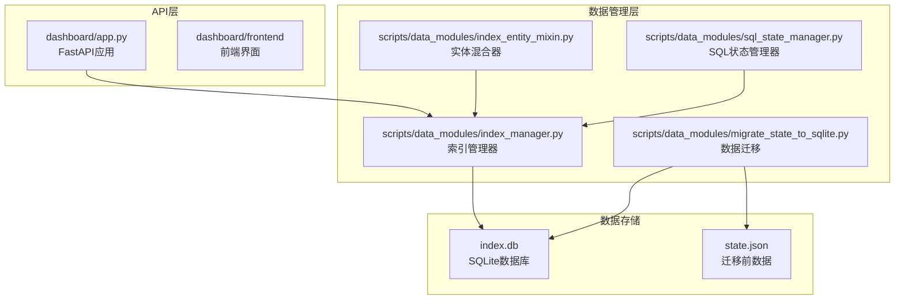

**图表来源**
- [dashboard/app.py:1-513](file://webnovel-writer/dashboard/app.py#L1-L513)
- [scripts/data_modules/index_manager.py:1-200](file://webnovel-writer/scripts/data_modules/index_manager.py#L1-L200)

**章节来源**
- [dashboard/app.py:1-513](file://webnovel-writer/dashboard/app.py#L1-L513)
- [scripts/data_modules/index_manager.py:1-200](file://webnovel-writer/scripts/data_modules/index_manager.py#L1-L200)

## 核心组件

### 数据库连接管理

API采用单例模式管理SQLite连接，确保资源的有效利用和安全性：

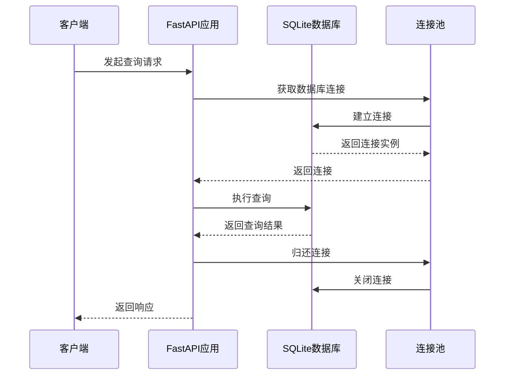

**图表来源**
- [dashboard/app.py:96-102](file://webnovel-writer/dashboard/app.py#L96-L102)

### 查询执行机制

API实现了多种查询模式，包括基础查询、条件过滤和排序控制：

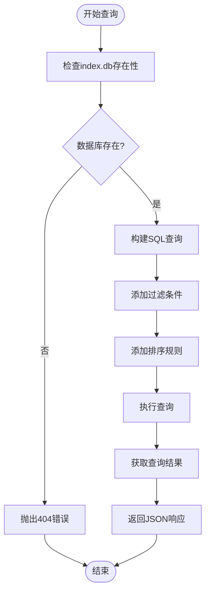

**图表来源**
- [dashboard/app.py:114-183](file://webnovel-writer/dashboard/app.py#L114-L183)

**章节来源**
- [dashboard/app.py:96-183](file://webnovel-writer/dashboard/app.py#L96-L183)

## 架构概览

核心实体查询API采用分层架构设计，确保关注点分离和代码可维护性。

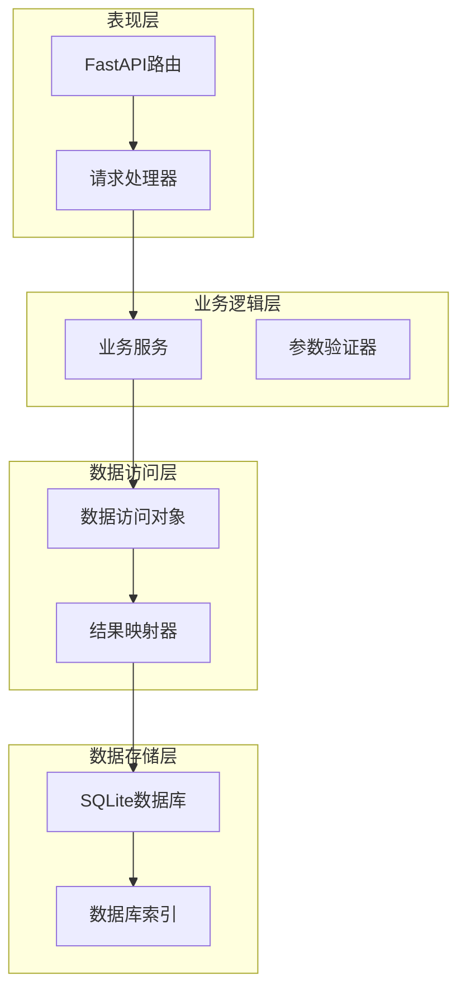

**图表来源**
- [dashboard/app.py:114-183](file://webnovel-writer/dashboard/app.py#L114-L183)
- [scripts/data_modules/index_manager.py:228-382](file://webnovel-writer/scripts/data_modules/index_manager.py#L228-L382)

## 详细组件分析

### 实体列表查询 (/api/entities)

实体列表查询提供了灵活的过滤和排序功能，支持按实体类型过滤和归档状态控制。

#### 查询参数

| 参数名 | 类型 | 必填 | 默认值 | 描述 |
|--------|------|------|--------|------|
| type | string | 否 | null | 实体类型过滤器 |
| include_archived | boolean | 否 | false | 是否包含归档实体 |

#### 查询逻辑

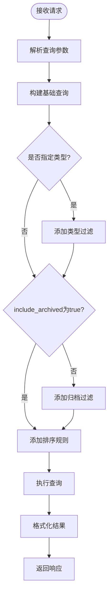

**图表来源**
- [dashboard/app.py:114-133](file://webnovel-writer/dashboard/app.py#L114-L133)

#### 排序规则

实体列表按照最后出现章节降序排列，确保最新的实体显示在前面。

#### 响应格式

```json
[
  {
    "id": "string",
    "type": "string",
    "canonical_name": "string",
    "tier": "string",
    "desc": "string",
    "current": {},
    "first_appearance": 0,
    "last_appearance": 0,
    "is_protagonist": false,
    "is_archived": false
  }
]
```

**章节来源**
- [dashboard/app.py:114-133](file://webnovel-writer/dashboard/app.py#L114-L133)

### 实体详情查询 (/api/entities/{entity_id})

实体详情查询提供了精确的实体检索功能，包含完整的ID验证和错误处理机制。

#### 查询流程

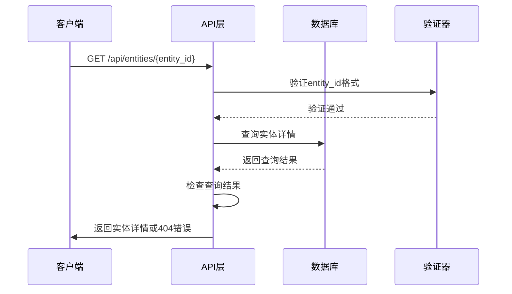

**图表来源**
- [dashboard/app.py:135-141](file://webnovel-writer/dashboard/app.py#L135-L141)

#### 错误处理

当实体不存在时，API返回HTTP 404状态码和"实体不存在"的错误消息。

#### 响应格式

```json
{
  "id": "string",
  "type": "string",
  "canonical_name": "string",
  "tier": "string",
  "desc": "string",
  "current": {},
  "first_appearance": 0,
  "last_appearance": 0,
  "is_protagonist": false,
  "is_archived": false
}
```

**章节来源**
- [dashboard/app.py:135-141](file://webnovel-writer/dashboard/app.py#L135-L141)

### 关系查询 (/api/relationships)

关系查询支持双向实体关联，提供章节降序排序和结果限制功能。

#### 查询参数

| 参数名 | 类型 | 必填 | 默认值 | 描述 |
|--------|------|------|--------|------|
| entity | string | 否 | null | 实体ID过滤器 |
| limit | integer | 否 | 200 | 结果数量限制 |

#### 查询逻辑

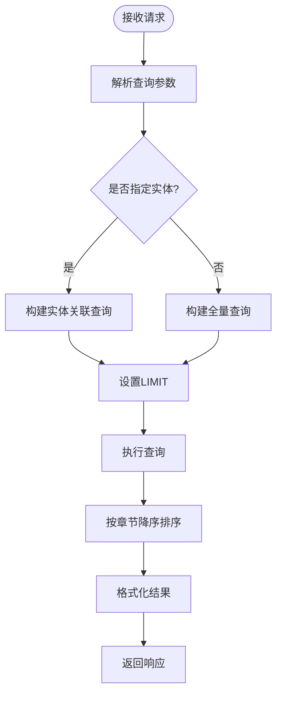

**图表来源**
- [dashboard/app.py:143-156](file://webnovel-writer/dashboard/app.py#L143-L156)

#### 排序规则

关系数据按照章节编号降序排列，确保最新的关系显示在前面。

#### 响应格式

```json
[
  {
    "id": 0,
    "from_entity": "string",
    "to_entity": "string",
    "type": "string",
    "description": "string",
    "chapter": 0,
    "created_at": "string",
    "unique": "string"
  }
]
```

**章节来源**
- [dashboard/app.py:143-156](file://webnovel-writer/dashboard/app.py#L143-L156)

### 关系事件查询 (/api/relationship-events)

关系事件查询提供了复杂的多条件过滤功能，支持实体ID、章节范围和复合排序规则。

#### 查询参数

| 参数名 | 类型 | 必填 | 默认值 | 描述 |
|--------|------|------|--------|------|
| entity | string | 否 | null | 实体ID过滤器 |
| from_chapter | integer | 否 | null | 起始章节过滤器 |
| to_chapter | integer | 否 | null | 结束章节过滤器 |
| limit | integer | 否 | 200 | 结果数量限制 |

#### 查询逻辑

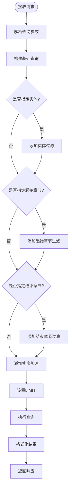

**图表来源**
- [dashboard/app.py:158-183](file://webnovel-writer/dashboard/app.py#L158-L183)

#### 排序规则

关系事件按照章节降序、ID降序进行复合排序，确保时间顺序和唯一性。

#### 响应格式

```json
[
  {
    "id": 0,
    "from_entity": "string",
    "to_entity": "string",
    "type": "string",
    "action": "string",
    "polarity": 0,
    "strength": 0.0,
    "description": "string",
    "chapter": 0,
    "scene_index": 0,
    "evidence": "string",
    "confidence": 0.0,
    "created_at": "string"
  }
]
```

**章节来源**
- [dashboard/app.py:158-183](file://webnovel-writer/dashboard/app.py#L158-L183)

## 依赖关系分析

### 数据库表结构

API依赖于SQLite数据库中的多个表，每个表都有特定的用途和索引。

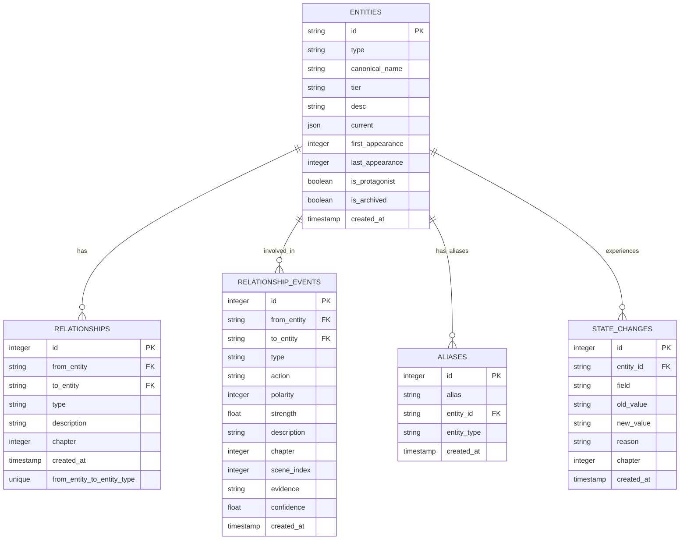

**图表来源**
- [scripts/data_modules/index_manager.py:324-413](file://webnovel-writer/scripts/data_modules/index_manager.py#L324-L413)

### 索引优化

数据库为关键查询字段建立了专门的索引，确保查询性能：

| 索引名称 | 表名 | 列 | 用途 |
|----------|------|----|------|
| idx_entities_type | entities | type | 实体类型查询 |
| idx_entities_tier | entities | tier | 实体层级查询 |
| idx_entities_protagonist | entities | is_protagonist | 主角查询 |
| idx_aliases_entity | aliases | entity_id | 别名解析 |
| idx_aliases_alias | aliases | alias | 别名搜索 |
| idx_state_changes_entity | state_changes | entity_id | 状态变化查询 |
| idx_state_changes_chapter | state_changes | chapter | 章节状态查询 |
| idx_relationships_from | relationships | from_entity | 关系源查询 |
| idx_relationships_to | relationships | to_entity | 关系目标查询 |
| idx_relationships_chapter | relationships | chapter | 关系时间线查询 |
| idx_relationship_events_from_chapter | relationship_events | from_entity, chapter | 关系事件查询 |
| idx_relationship_events_to_chapter | relationship_events | to_entity, chapter | 关系事件查询 |
| idx_relationship_events_chapter | relationship_events | chapter | 关系事件时间线 |
| idx_relationship_events_type_chapter | relationship_events | type, chapter | 关系事件分类查询 |

**章节来源**
- [scripts/data_modules/index_manager.py:352-413](file://webnovel-writer/scripts/data_modules/index_manager.py#L352-L413)

## 性能考虑

### 查询优化策略

1. **索引优化**: 为常用查询字段建立索引，减少全表扫描
2. **参数化查询**: 使用参数绑定防止SQL注入并提高查询缓存效率
3. **连接池管理**: 使用上下文管理器确保连接正确释放
4. **结果限制**: 默认限制查询结果数量，防止内存溢出

### 数据库兼容性

API实现了自动表不存在的兼容性处理，确保在不同版本的数据结构下正常运行：

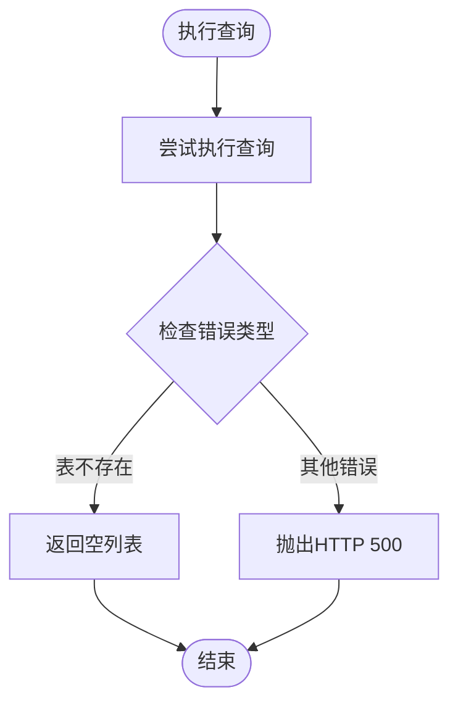

**图表来源**
- [dashboard/app.py:104-112](file://webnovel-writer/dashboard/app.py#L104-L112)

### 迁移策略

系统支持从旧版本的state.json数据结构迁移到新的SQLite结构：

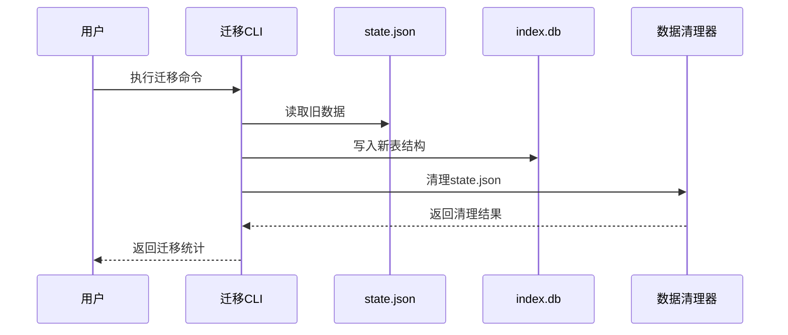

**图表来源**
- [scripts/data_modules/migrate_state_to_sqlite.py:39-277](file://webnovel-writer/scripts/data_modules/migrate_state_to_sqlite.py#L39-L277)

**章节来源**
- [scripts/data_modules/migrate_state_to_sqlite.py:39-277](file://webnovel-writer/scripts/data_modules/migrate_state_to_sqlite.py#L39-L277)

## 故障排除指南

### 常见错误及解决方案

#### 1. index.db不存在

**错误信息**: "index.db 不存在"

**原因**: 项目根目录下缺少index.db文件

**解决方案**:
- 确保项目已完成数据初始化
- 检查项目根目录结构
- 运行数据迁移脚本

#### 2. 实体不存在

**错误信息**: "实体不存在"

**原因**: 查询的实体ID在数据库中不存在

**解决方案**:
- 验证实体ID的正确性
- 检查实体是否已被删除
- 使用实体列表查询确认实体存在

#### 3. 数据库查询失败

**错误信息**: "数据库查询失败: {具体错误}"

**原因**: SQL语法错误或数据库锁定

**解决方案**:
- 检查查询语句的正确性
- 确认数据库文件权限
- 重新启动数据库服务

### 性能问题诊断

#### 查询缓慢

可能的原因和解决方案：

1. **缺少索引**: 检查相关列是否建立了适当的索引
2. **查询过于复杂**: 简化WHERE条件或添加适当的过滤器
3. **结果集过大**: 调整LIMIT参数或添加更多过滤条件

#### 内存使用过高

**解决方案**:
- 减少默认LIMIT值
- 实施分页查询
- 优化WHERE条件

**章节来源**
- [dashboard/app.py:96-112](file://webnovel-writer/dashboard/app.py#L96-L112)

## 结论

核心实体查询API为Webnovel Writer项目提供了强大而灵活的数据访问能力。通过SQLite数据库的高效查询和精心设计的索引策略，API能够满足大规模小说创作项目的数据管理需求。

主要优势包括：
- **高性能**: 基于SQLite的快速查询和完善的索引优化
- **灵活性**: 支持多种过滤条件和排序规则
- **兼容性**: 自动处理不同版本的数据结构
- **可靠性**: 完善的错误处理和异常恢复机制
- **可扩展性**: 模块化的架构设计便于功能扩展

未来可以考虑的改进方向：
- 实现更精细的查询权限控制
- 添加查询缓存机制
- 增强批量查询功能
- 优化移动端访问体验