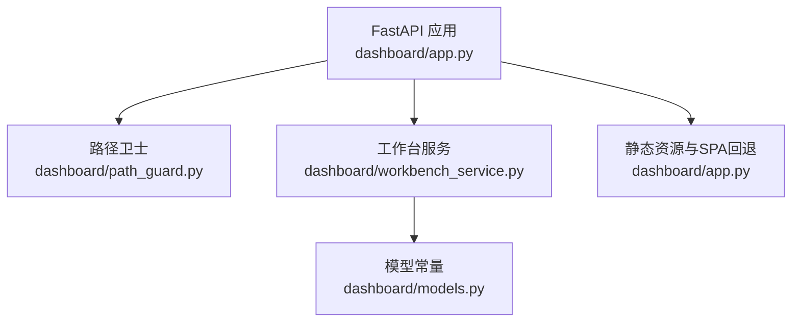
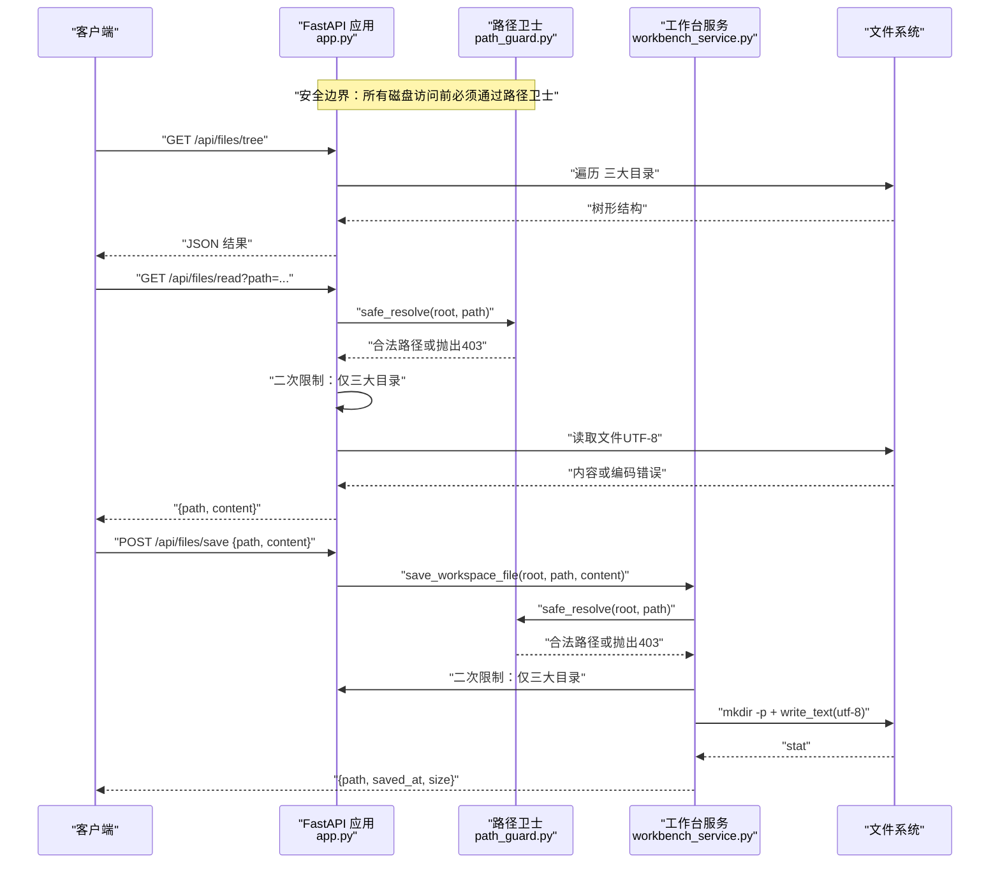
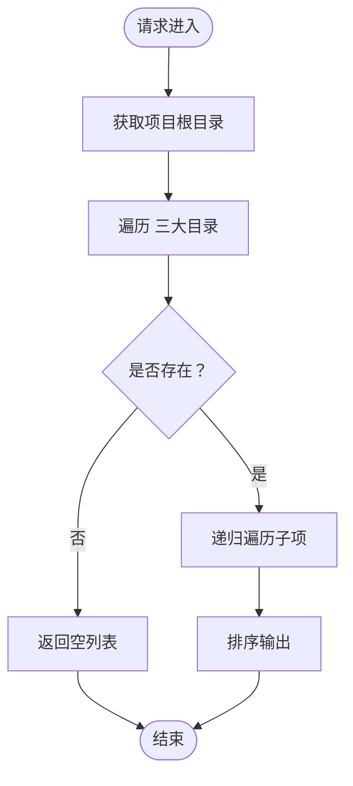
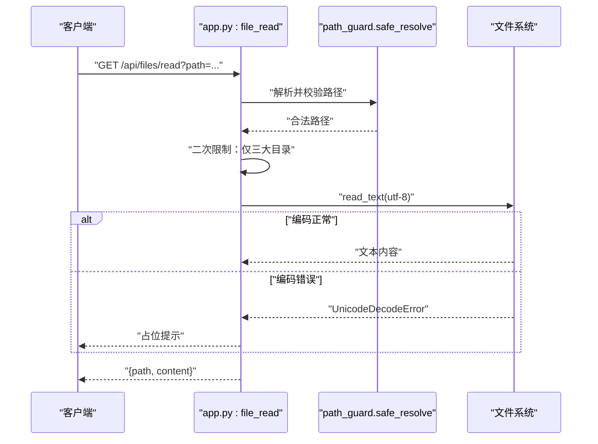
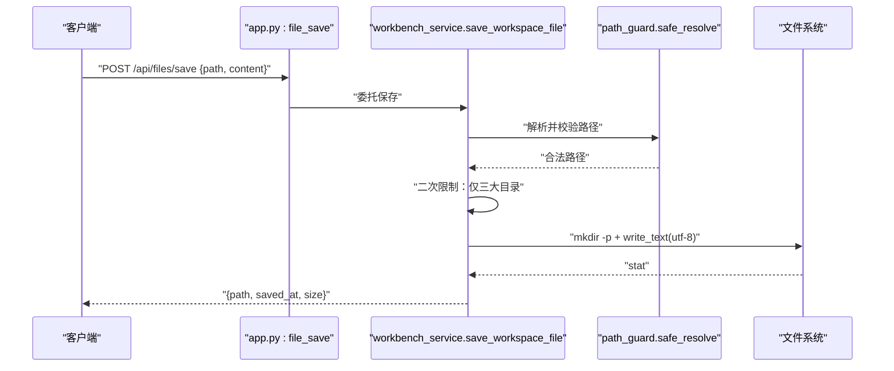
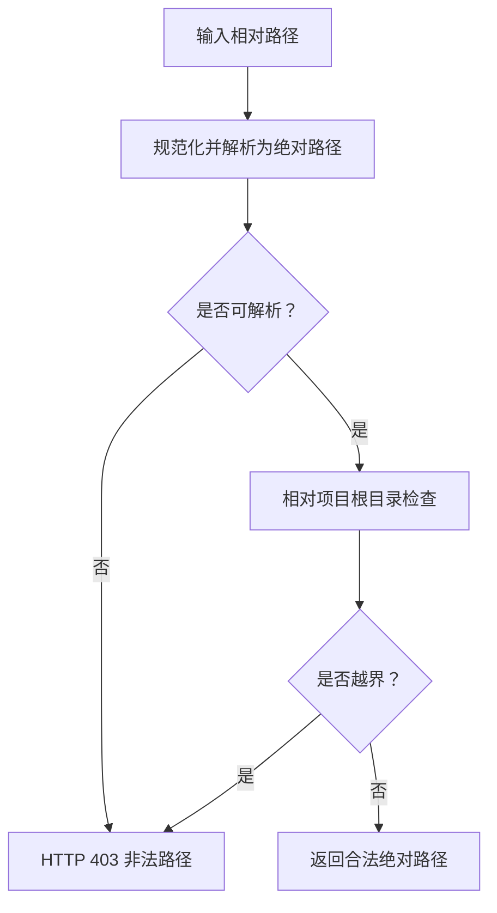
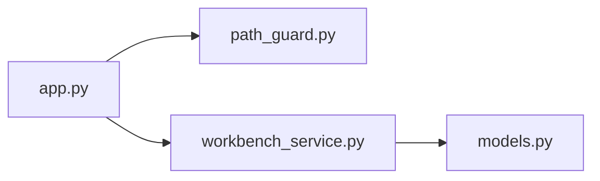

# 文件系统API

<cite>
**本文引用的文件**
- [dashboard/app.py](file://webnovel-writer/dashboard/app.py)
- [dashboard/path_guard.py](file://webnovel-writer/dashboard/path_guard.py)
- [dashboard/workbench_service.py](file://webnovel-writer/dashboard/workbench_service.py)
- [dashboard/models.py](file://webnovel-writer/dashboard/models.py)
</cite>

## 目录
1. [简介](#简介)
2. [项目结构](#项目结构)
3. [核心组件](#核心组件)
4. [架构总览](#架构总览)
5. [详细组件分析](#详细组件分析)
6. [依赖分析](#依赖分析)
7. [性能考量](#性能考量)
8. [故障排查指南](#故障排查指南)
9. [结论](#结论)
10. [附录](#附录)

## 简介
本文件系统API面向“正文/大纲/设定集”三大工作空间，提供文件树查询、只读文件读取与最小化写入能力。其设计遵循严格的路径安全策略，通过统一的路径卫士模块进行越界防护，并对文件读取的内容编码进行兼容处理，对文件保存进行写入范围与权限控制。本文档将系统性阐述三类核心API的实现原理、数据流、安全机制与最佳实践。

## 项目结构
- API入口与路由集中在主应用模块，负责注册文件系统相关端点并装配中间件。
- 路径安全由独立的路径卫士模块提供，所有涉及磁盘访问的API均需经其校验。
- 工作台服务封装了写入逻辑，确保仅允许写入受控的工作空间根目录。
- 模型常量定义了工作空间根目录名称映射，用于读写范围约束。

图表来源
- [dashboard/app.py:352-494](file://webnovel-writer/dashboard/app.py#L352-L494)
- [dashboard/path_guard.py:11-28](file://webnovel-writer/dashboard/path_guard.py#L11-L28)
- [dashboard/workbench_service.py:58-71](file://webnovel-writer/dashboard/workbench_service.py#L58-L71)
- [dashboard/models.py:4-8](file://webnovel-writer/dashboard/models.py#L4-L8)

章节来源
- [dashboard/app.py:352-494](file://webnovel-writer/dashboard/app.py#L352-L494)
- [dashboard/models.py:4-8](file://webnovel-writer/dashboard/models.py#L4-L8)

## 核心组件
- 路径卫士（Path Guard）
  - 提供统一的安全路径解析，防止路径穿越逃逸至项目根目录之外。
  - 对异常输入抛出明确的HTTP 403错误。
- 文件树查询（/api/files/tree）
  - 仅扫描“正文/大纲/设定集”三大目录，输出树形结构（含文件大小）。
  - 使用递归遍历，保持稳定排序与跨平台路径分隔符转换。
- 文件读取（/api/files/read）
  - 通过路径卫士解析并二次限定于三大目录。
  - UTF-8解码文本文件；遇到编码错误返回占位提示。
- 文件保存（/api/files/save）
  - 通过路径卫士解析并二次限定于三大目录。
  - 自动创建父目录，使用UTF-8写入文本内容，返回保存元信息。

章节来源
- [dashboard/path_guard.py:11-28](file://webnovel-writer/dashboard/path_guard.py#L11-L28)
- [dashboard/app.py:352-404](file://webnovel-writer/dashboard/app.py#L352-L404)
- [dashboard/workbench_service.py:58-71](file://webnovel-writer/dashboard/workbench_service.py#L58-L71)

## 架构总览
下图展示文件系统API的调用链与安全边界：

图表来源
- [dashboard/app.py:352-404](file://webnovel-writer/dashboard/app.py#L352-L404)
- [dashboard/path_guard.py:11-28](file://webnovel-writer/dashboard/path_guard.py#L11-L28)
- [dashboard/workbench_service.py:58-71](file://webnovel-writer/dashboard/workbench_service.py#L58-L71)

## 详细组件分析

### 文件树结构查询（/api/files/tree）
- 控制流
  - 读取项目根目录，依次遍历“正文/大纲/设定集”。
  - 对每个子项进行排序、递归展开，文件项附带大小。
- 数据结构
  - 输出为字典，键为目录名，值为条目数组；条目包含名称、类型、相对路径、（文件时）大小。
- 复杂度
  - 时间复杂度近似 O(N)，N为三大目录下文件总数；空间复杂度与树深线性相关。
- 安全性
  - 仅扫描受控目录，不进行跨目录访问。
- 错误处理
  - 目录不存在时返回空列表；遍历过程异常按FastAPI默认处理。

图表来源
- [dashboard/app.py:352-363](file://webnovel-writer/dashboard/app.py#L352-L363)
- [dashboard/app.py:496-504](file://webnovel-writer/dashboard/app.py#L496-L504)

章节来源
- [dashboard/app.py:352-363](file://webnovel-writer/dashboard/app.py#L352-L363)
- [dashboard/app.py:496-504](file://webnovel-writer/dashboard/app.py#L496-L504)

### 文件读取（/api/files/read）
- 安全路径解析
  - 使用路径卫士解析并校验，拒绝越界路径。
  - 二次限制：仅允许“正文/大纲/设定集”目录内文件。
- 文件类型与编码
  - 优先按UTF-8读取文本；遇到编码错误返回占位提示，避免崩溃。
- 错误处理
  - 非法路径/越界：HTTP 403。
  - 文件不存在：HTTP 404。
  - 编码错误：返回占位内容。

图表来源
- [dashboard/app.py:365-385](file://webnovel-writer/dashboard/app.py#L365-L385)
- [dashboard/path_guard.py:11-28](file://webnovel-writer/dashboard/path_guard.py#L11-L28)

章节来源
- [dashboard/app.py:365-385](file://webnovel-writer/dashboard/app.py#L365-L385)
- [dashboard/path_guard.py:11-28](file://webnovel-writer/dashboard/path_guard.py#L11-L28)

### 文件保存（/api/files/save）
- 写入范围与权限
  - 解析路径并通过路径卫士校验；二次限制仅允许三大目录。
  - 自动创建父目录（必要时），使用UTF-8写入文本内容。
- 冲突处理
  - 采用覆盖式写入；如需冲突保护，应在上层业务或版本控制中实现。
- 返回信息
  - 包含原始请求路径、保存时间（UTC）、文件大小。

图表来源
- [dashboard/app.py:387-394](file://webnovel-writer/dashboard/app.py#L387-L394)
- [dashboard/workbench_service.py:58-71](file://webnovel-writer/dashboard/workbench_service.py#L58-L71)
- [dashboard/path_guard.py:11-28](file://webnovel-writer/dashboard/path_guard.py#L11-L28)

章节来源
- [dashboard/app.py:387-394](file://webnovel-writer/dashboard/app.py#L387-L394)
- [dashboard/workbench_service.py:58-71](file://webnovel-writer/dashboard/workbench_service.py#L58-L71)

### 路径卫士（Path Guard）与安全边界
- 设计要点
  - 解析阶段：对任意相对路径进行规范化与绝对化，捕获异常并返回403。
  - 越界检查：要求解析后路径必须为项目根目录的子路径或自身。
  - 与二次限制配合：API层进一步限定仅三大目录，形成双重安全边界。
- 防护效果
  - 有效抵御路径穿越（如 ../）、符号链接逃逸等常见攻击向量。
  - 保证所有磁盘访问均处于受控范围内。

图表来源
- [dashboard/path_guard.py:11-28](file://webnovel-writer/dashboard/path_guard.py#L11-L28)

章节来源
- [dashboard/path_guard.py:11-28](file://webnovel-writer/dashboard/path_guard.py#L11-L28)

## 依赖分析
- 组件耦合
  - 应用模块依赖路径卫士与工作台服务；工作台服务依赖模型常量以确定允许的根目录集合。
  - 读取与保存API均依赖路径卫士，体现统一安全策略。
- 外部依赖
  - FastAPI用于路由与响应；pathlib用于路径操作；sqlite3用于只读查询（与文件系统API同属应用层）。
- 循环依赖
  - 未发现循环导入；模块职责清晰，边界明确。

图表来源
- [dashboard/app.py:20-24](file://webnovel-writer/dashboard/app.py#L20-L24)
- [dashboard/workbench_service.py:12-13](file://webnovel-writer/dashboard/workbench_service.py#L12-L13)
- [dashboard/models.py:4-8](file://webnovel-writer/dashboard/models.py#L4-L8)

章节来源
- [dashboard/app.py:20-24](file://webnovel-writer/dashboard/app.py#L20-L24)
- [dashboard/workbench_service.py:12-13](file://webnovel-writer/dashboard/workbench_service.py#L12-L13)
- [dashboard/models.py:4-8](file://webnovel-writer/dashboard/models.py#L4-L8)

## 性能考量
- 文件树查询
  - 遍历规模受限于三大目录；建议在大项目中启用文件系统缓存或增量更新策略。
- 文件读取
  - UTF-8解码失败时返回占位提示，避免额外重试开销；对超大文件建议分块传输或懒加载。
- 文件保存
  - 写入为同步I/O；在高并发场景建议引入队列与批量写入，降低锁竞争与落盘压力。
- 编码处理
  - 统一使用UTF-8；对二进制文件返回占位提示，避免不必要的解码尝试。

## 故障排查指南
- HTTP 403 非法路径/越界
  - 检查请求路径是否包含上溯序列（如“../”）；确认最终解析路径确在项目根目录内。
  - 确认API层二次限制是否命中（仅三大目录）。
- HTTP 404 文件不存在
  - 确认目标文件是否存在于受控目录；检查大小写与路径分隔符。
- 编码错误导致读取失败
  - 读取接口会返回占位提示；如需查看原始内容，可在外部工具中以二进制方式打开。
- 写入失败
  - 确认目标路径为三大目录之一；检查父目录权限与磁盘配额；避免并发写同一文件。

章节来源
- [dashboard/app.py:365-385](file://webnovel-writer/dashboard/app.py#L365-L385)
- [dashboard/app.py:387-394](file://webnovel-writer/dashboard/app.py#L387-L394)
- [dashboard/path_guard.py:11-28](file://webnovel-writer/dashboard/path_guard.py#L11-L28)

## 结论
该文件系统API通过“路径卫士 + 二次目录限制”的双重安全策略，确保所有磁盘访问均在受控范围内；读取与保存流程分别针对文本与写入场景做了稳健的容错与编码处理。建议在生产环境中结合缓存、队列与版本控制完善性能与一致性保障。

## 附录
- API清单与行为摘要
  - GET /api/files/tree：仅扫描“正文/大纲/设定集”，返回树形结构。
  - GET /api/files/read：仅读取受控目录文件，UTF-8解码文本，编码错误返回占位。
  - POST /api/files/save：仅写入受控目录，自动创建父目录，UTF-8写入并返回保存元信息。
- 安全最佳实践
  - 始终通过路径卫士解析并校验路径。
  - 严格限制写入范围，避免将用户输入直接作为写入目标。
  - 对超大文件采用流式或分块处理，避免内存峰值。
  - 在高并发场景引入写入队列与幂等写入策略。