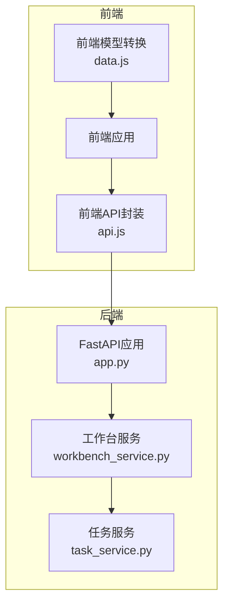
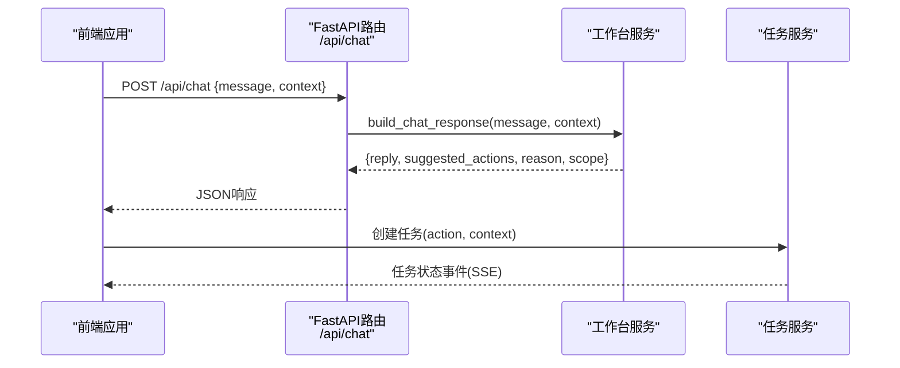
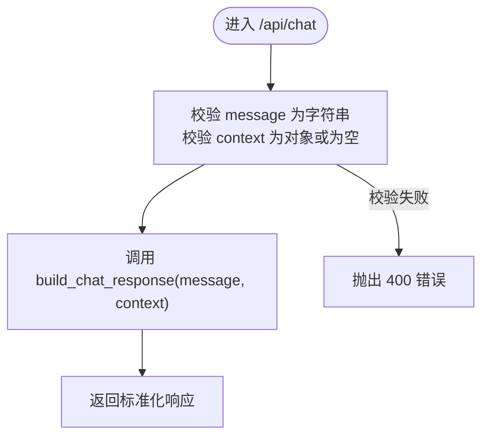
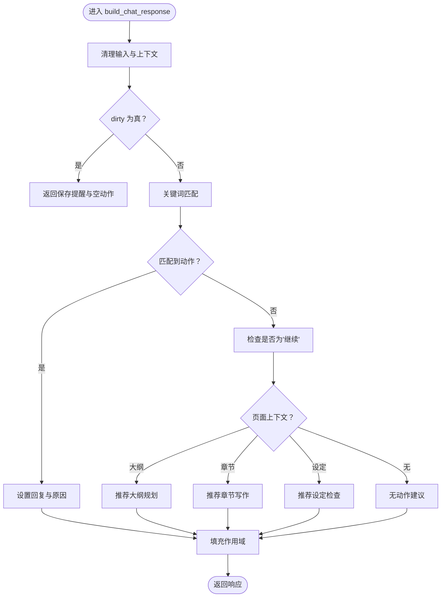
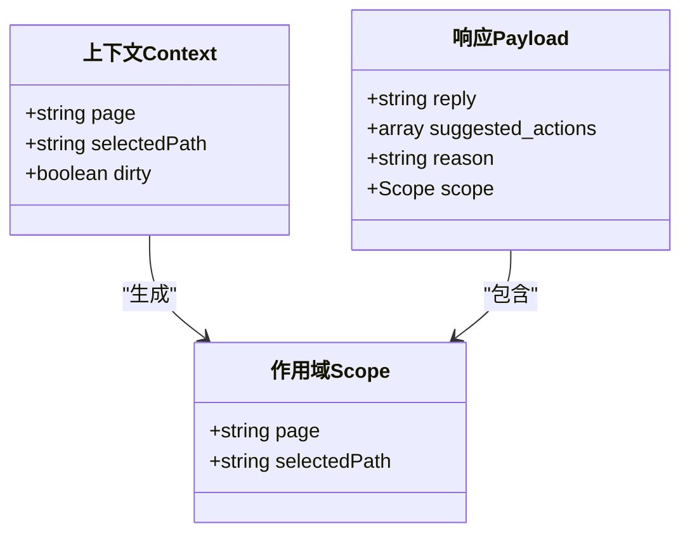
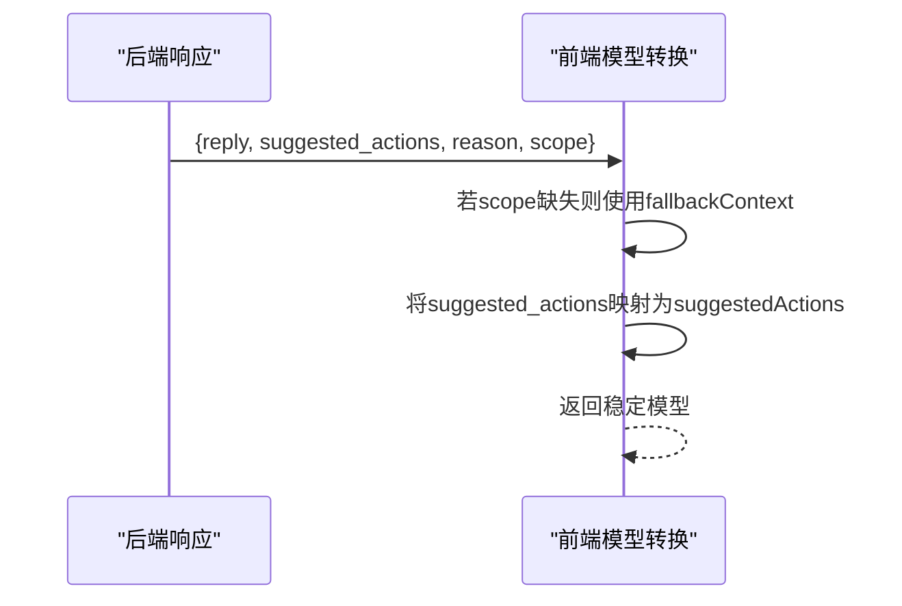
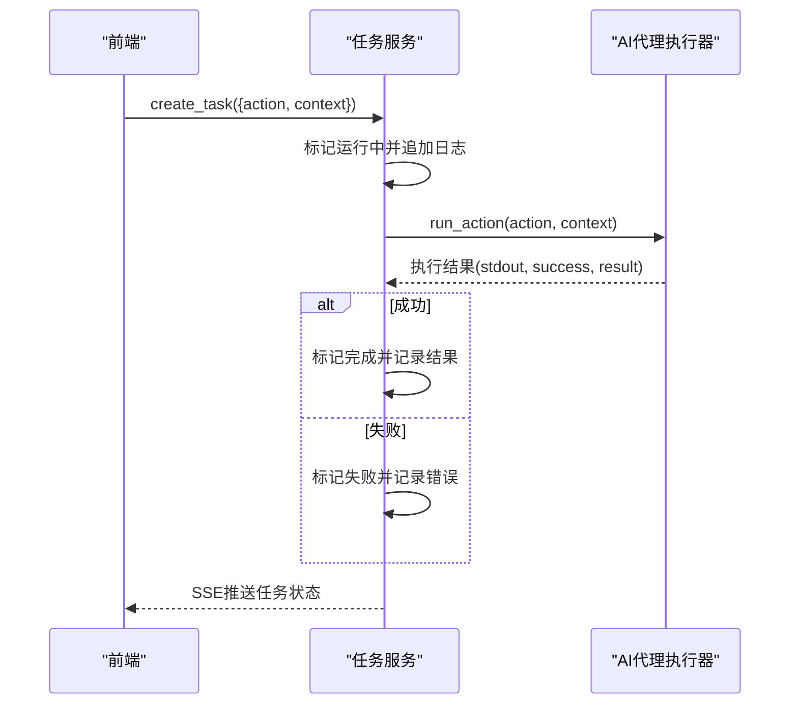
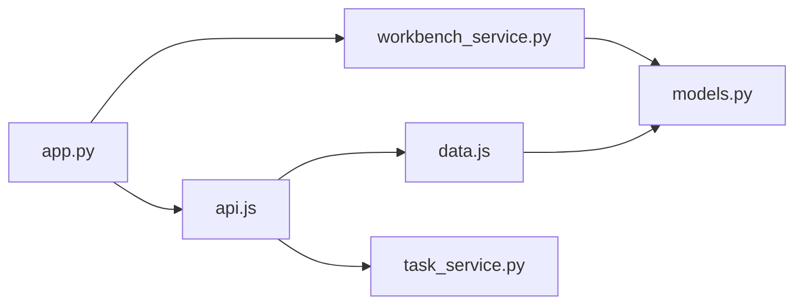

# 聊天通信API

<cite>
**本文引用的文件**
- [app.py](file://webnovel-writer/dashboard/app.py)
- [workbench_service.py](file://webnovel-writer/dashboard/workbench_service.py)
- [api.js](file://webnovel-writer/dashboard/frontend/src/api.js)
- [data.js](file://webnovel-writer/dashboard/frontend/src/workbench/data.js)
- [task_service.py](file://webnovel-writer/dashboard/task_service.py)
- [models.py](file://webnovel-writer/dashboard/models.py)
- [test_phase3_chat.py](file://webnovel-writer/dashboard/tests/test_phase3_chat.py)
- [workbench.chat.test.mjs](file://webnovel-writer/dashboard/frontend/tests/workbench.chat.test.mjs)
</cite>

## 目录
1. [简介](#简介)
2. [项目结构](#项目结构)
3. [核心组件](#核心组件)
4. [架构概览](#架构概览)
5. [详细组件分析](#详细组件分析)
6. [依赖分析](#依赖分析)
7. [性能考虑](#性能考虑)
8. [故障排除指南](#故障排除指南)
9. [结论](#结论)

## 简介
本文档详细记录了聊天通信API（/api/chat）的设计与实现，涵盖消息处理、上下文传递、响应生成机制以及与AI代理的集成方式。系统通过FastAPI提供REST接口，后端逻辑集中在Python服务中，前端通过JavaScript发起请求并展示交互结果。聊天接口的核心职责是将自然语言消息解析为可执行的操作建议，并附带解释原因与作用域信息，从而指导用户在工作台的不同页面（总览、章节、大纲、设定）中进行下一步操作。

## 项目结构
聊天API涉及前后端协作的关键文件如下：
- 后端FastAPI应用：定义路由与请求验证
- 工作台服务：实现聊天响应构建逻辑
- 前端API封装：封装HTTP请求与SSE事件
- 前端模型转换：将后端响应转换为前端可用的数据结构
- 任务服务：与AI代理集成，执行具体动作
- 测试用例：覆盖聊天行为与响应结构

**图示来源**
- [app.py:420-429](file://webnovel-writer/dashboard/app.py#L420-L429)
- [workbench_service.py:74-162](file://webnovel-writer/dashboard/workbench_service.py#L74-L162)
- [task_service.py:36-59](file://webnovel-writer/dashboard/task_service.py#L36-L59)
- [api.js:39-41](file://webnovel-writer/dashboard/frontend/src/api.js#L39-L41)
- [data.js:150-162](file://webnovel-writer/dashboard/frontend/src/workbench/data.js#L150-L162)

**章节来源**
- [app.py:420-429](file://webnovel-writer/dashboard/app.py#L420-L429)
- [workbench_service.py:74-162](file://webnovel-writer/dashboard/workbench_service.py#L74-L162)
- [api.js:39-41](file://webnovel-writer/dashboard/frontend/src/api.js#L39-L41)
- [data.js:150-162](file://webnovel-writer/dashboard/frontend/src/workbench/data.js#L150-L162)
- [task_service.py:36-59](file://webnovel-writer/dashboard/task_service.py#L36-L59)

## 核心组件
- 聊天接口路由：接收消息与上下文，返回标准化响应
- 聊天响应构建器：基于关键词与页面上下文选择动作类型
- 前端响应模型转换：确保前端稳定渲染与回退逻辑
- 任务执行服务：与AI代理集成，执行具体动作并推送事件

**章节来源**
- [app.py:420-429](file://webnovel-writer/dashboard/app.py#L420-L429)
- [workbench_service.py:74-162](file://webnovel-writer/dashboard/workbench_service.py#L74-L162)
- [data.js:150-162](file://webnovel-writer/dashboard/frontend/src/workbench/data.js#L150-L162)
- [task_service.py:14-166](file://webnovel-writer/dashboard/task_service.py#L14-L166)

## 架构概览
聊天API的端到端流程如下：
1. 前端通过POST /api/chat发送消息与上下文
2. FastAPI路由进行参数校验并调用工作台服务
3. 工作台服务根据消息内容与上下文生成回复、动作建议、原因与作用域
4. 前端将响应转换为可渲染模型并展示
5. 用户点击动作建议时，前端创建任务并交由任务服务执行

**图示来源**
- [app.py:420-429](file://webnovel-writer/dashboard/app.py#L420-L429)
- [workbench_service.py:74-162](file://webnovel-writer/dashboard/workbench_service.py#L74-L162)
- [task_service.py:36-59](file://webnovel-writer/dashboard/task_service.py#L36-L59)

## 详细组件分析

### 聊天接口路由与消息处理
- 路由定义：/api/chat为POST端点，接收JSON负载
- 参数校验：message必须为字符串；context可选但必须为对象
- 响应生成：调用工作台服务的build_chat_response生成标准响应

**图示来源**
- [app.py:420-429](file://webnovel-writer/dashboard/app.py#L420-L429)

**章节来源**
- [app.py:420-429](file://webnovel-writer/dashboard/app.py#L420-L429)

### build_chat_response 对话处理流程
- 输入处理：去除空白字符，确保上下文为字典
- 脏状态检查：若上下文标记dirty为真，直接返回保存提醒与空动作列表
- 关键词匹配：根据消息中的关键词识别动作类型（规划、设定、审查、写作）
- 上下文路由：当消息为“继续”时，依据当前页面选择相应动作
- 输出结构：包含回复文本、动作建议数组、原因说明与作用域信息

**图示来源**
- [workbench_service.py:74-162](file://webnovel-writer/dashboard/workbench_service.py#L74-L162)

**章节来源**
- [workbench_service.py:74-162](file://webnovel-writer/dashboard/workbench_service.py#L74-L162)

### 上下文管理策略
- 上下文字段：
  - page：当前页面标识（overview、chapters、outline、settings）
  - selectedPath：当前选中文件路径
  - dirty：是否存在未保存修改
- 作用域scope：始终包含page与selectedPath，确保前端可定位当前上下文
- 回退策略：当后端响应缺少scope时，前端以传入的上下文作为回退

**图示来源**
- [workbench_service.py:74-162](file://webnovel-writer/dashboard/workbench_service.py#L74-L162)
- [data.js:150-162](file://webnovel-writer/dashboard/frontend/src/workbench/data.js#L150-L162)

**章节来源**
- [workbench_service.py:74-162](file://webnovel-writer/dashboard/workbench_service.py#L74-L162)
- [data.js:150-162](file://webnovel-writer/dashboard/frontend/src/workbench/data.js#L150-L162)

### 响应数据结构与前端模型转换
- 后端响应字段：
  - reply：回复文本
  - suggested_actions：动作建议数组（每个元素含type、label、params）
  - reason：动作选择的原因说明
  - scope：作用域（page、selectedPath）
- 前端模型转换：
  - 将后端的suggested_actions映射为前端的suggestedActions
  - 当scope为null时，使用传入的fallbackContext作为回退
  - 提供默认值保证渲染稳定性

**图示来源**
- [workbench_service.py:154-162](file://webnovel-writer/dashboard/workbench_service.py#L154-L162)
- [data.js:150-162](file://webnovel-writer/dashboard/frontend/src/workbench/data.js#L150-L162)

**章节来源**
- [workbench_service.py:154-162](file://webnovel-writer/dashboard/workbench_service.py#L154-L162)
- [data.js:150-162](file://webnovel-writer/dashboard/frontend/src/workbench/data.js#L150-L162)

### AI代理集成与任务执行
- 动作执行：前端创建任务时携带action与context，任务服务内部调用run_action执行
- 事件推送：任务状态变更通过SSE实时推送给前端
- 错误处理：捕获异常并标记任务失败，同时记录日志

**图示来源**
- [task_service.py:36-59](file://webnovel-writer/dashboard/task_service.py#L36-L59)
- [task_service.py:121-143](file://webnovel-writer/dashboard/task_service.py#L121-L143)

**章节来源**
- [task_service.py:36-59](file://webnovel-writer/dashboard/task_service.py#L36-L59)
- [task_service.py:121-143](file://webnovel-writer/dashboard/task_service.py#L121-L143)

### 聊天会话管理与历史记录
- 会话状态：前端维护chatMessages数组，每次发送新消息即追加用户消息
- 历史记录：当前设计聚焦于即时响应与动作建议，未在聊天接口中持久化历史
- 建议：可在前端本地存储或后端引入会话ID以支持历史记录

**章节来源**
- [data.js:24-32](file://webnovel-writer/dashboard/frontend/src/workbench/data.js#L24-L32)

## 依赖分析
- 路由依赖：/api/chat依赖工作台服务的build_chat_response
- 前端依赖：sendChat通过api.js封装请求；data.js负责响应模型转换
- 任务依赖：任务服务依赖AI代理执行器run_action
- 常量依赖：工作台页面与工作空间根目录由models.py定义

**图示来源**
- [app.py:22-23](file://webnovel-writer/dashboard/app.py#L22-L23)
- [workbench_service.py:12](file://webnovel-writer/dashboard/workbench_service.py#L12)
- [models.py:3-8](file://webnovel-writer/dashboard/models.py#L3-L8)

**章节来源**
- [app.py:22-23](file://webnovel-writer/dashboard/app.py#L22-L23)
- [workbench_service.py:12](file://webnovel-writer/dashboard/workbench_service.py#L12)
- [models.py:3-8](file://webnovel-writer/dashboard/models.py#L3-L8)

## 性能考虑
- 响应构建：关键词匹配与简单分支判断，时间复杂度为O(n)，其中n为关键词数量
- 上下文传递：上下文为轻量字典，序列化开销极低
- 前端渲染：模型转换为纯函数，避免DOM操作
- 任务执行：异步线程执行，不影响主线程
- 建议：
  - 对高频关键词匹配可考虑预编译正则表达式
  - 对长消息可限制长度并做截断处理
  - 对重复请求可引入缓存策略（如基于消息哈希）

## 故障排除指南
- 常见错误
  - 400 Bad Request：message非字符串或context非对象
  - 500 Internal Server Error：工作台服务内部异常
- 排查步骤
  - 检查请求体格式与字段类型
  - 查看后端日志与任务服务日志
  - 使用测试用例验证预期行为
- 测试参考
  - 聊天响应包含reason与scope
  - 同一消息在不同页面上下文路由到不同动作
  - 脏状态阻止高风险动作
  - selectedPath透传到动作参数

**章节来源**
- [test_phase3_chat.py:8-32](file://webnovel-writer/dashboard/tests/test_phase3_chat.py#L8-L32)
- [test_phase3_chat.py:35-70](file://webnovel-writer/dashboard/tests/test_phase3_chat.py#L35-L70)
- [test_phase3_chat.py:94-115](file://webnovel-writer/dashboard/tests/test_phase3_chat.py#L94-L115)
- [test_phase3_chat.py:117-136](file://webnovel-writer/dashboard/tests/test_phase3_chat.py#L117-L136)
- [workbench.chat.test.mjs:10-30](file://webnovel-writer/dashboard/frontend/tests/workbench.chat.test.mjs#L10-L30)
- [workbench.chat.test.mjs:32-46](file://webnovel-writer/dashboard/frontend/tests/workbench.chat.test.mjs#L32-L46)
- [workbench.chat.test.mjs:48-57](file://webnovel-writer/dashboard/frontend/tests/workbench.chat.test.mjs#L48-L57)

## 结论
聊天通信API通过简洁的请求结构与明确的响应规范，实现了从自然语言到可执行动作的智能路由。其核心优势在于：
- 清晰的上下文传递与作用域管理
- 可解释的动作建议与原因说明
- 与AI代理的无缝集成与实时事件推送
- 前端稳定的模型转换与回退机制

未来可进一步增强历史记录、会话管理和性能优化，以提升用户体验与系统吞吐能力。