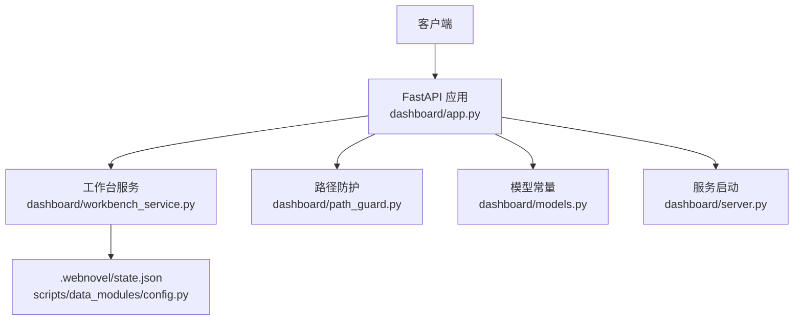
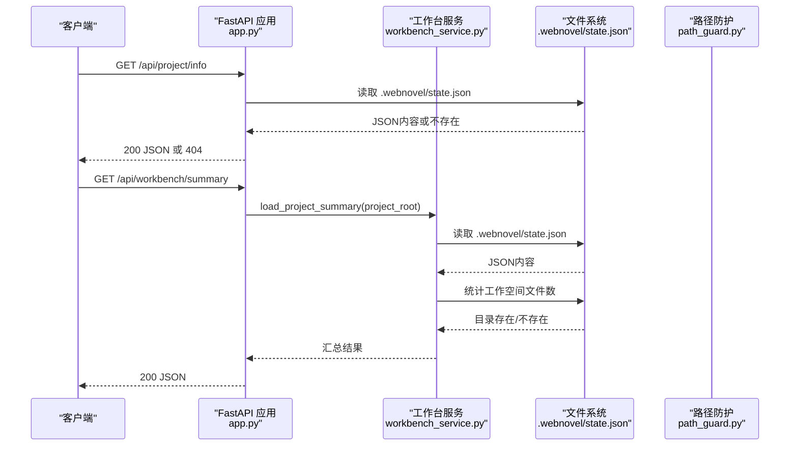
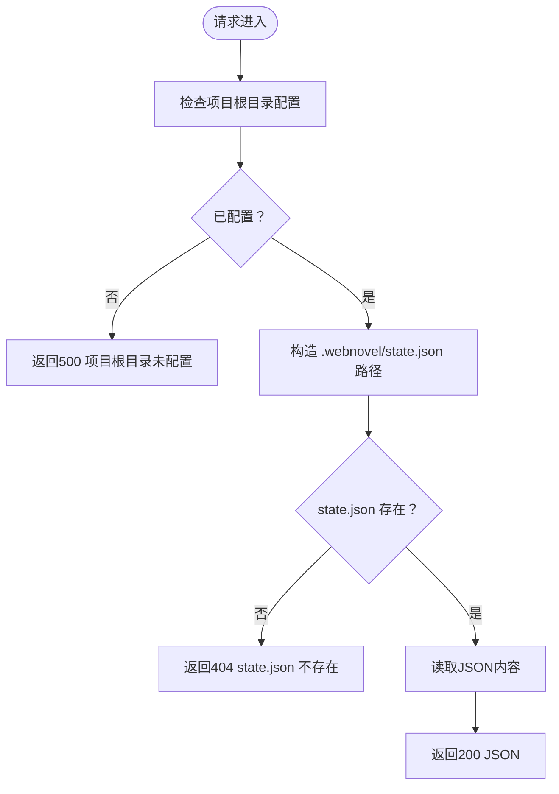
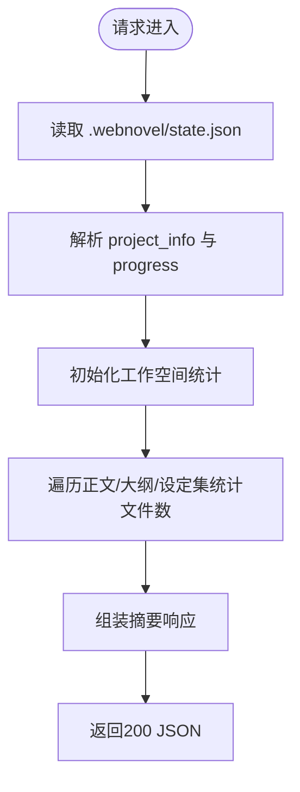
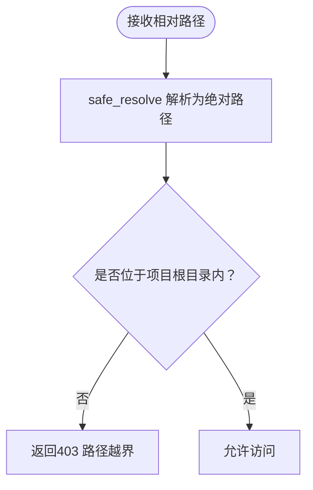
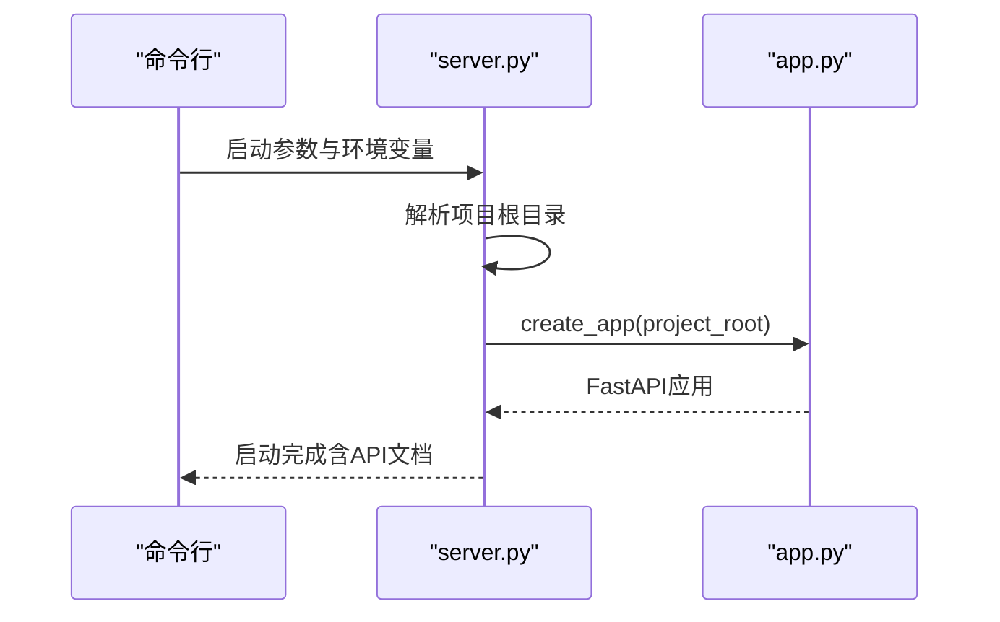
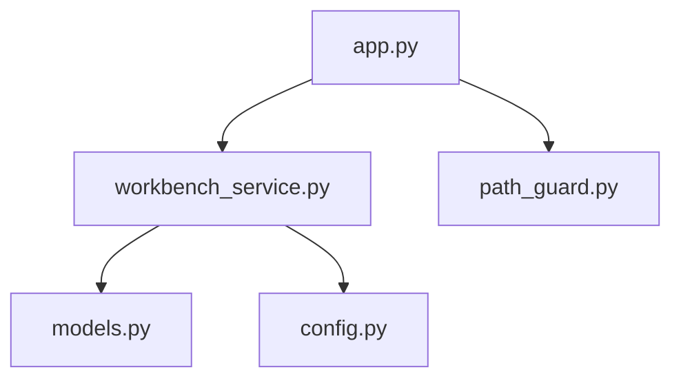

# 项目管理API

<cite>
**本文档引用的文件**
- [app.py](file://webnovel-writer/dashboard/app.py)
- [workbench_service.py](file://webnovel-writer/dashboard/workbench_service.py)
- [path_guard.py](file://webnovel-writer/dashboard/path_guard.py)
- [server.py](file://webnovel-writer/dashboard/server.py)
- [models.py](file://webnovel-writer/dashboard/models.py)
- [test_phase1_contracts.py](file://webnovel-writer/dashboard/tests/test_phase1_contracts.py)
- [config.py](file://webnovel-writer/scripts/data_modules/config.py)
</cite>

## 目录
1. [简介](#简介)
2. [项目结构](#项目结构)
3. [核心组件](#核心组件)
4. [架构总览](#架构总览)
5. [详细组件分析](#详细组件分析)
6. [依赖分析](#依赖分析)
7. [性能考虑](#性能考虑)
8. [故障排除指南](#故障排除指南)
9. [结论](#结论)
10. [附录](#附录)

## 简介
本文件面向项目管理API，聚焦以下两个端点的完整规范：
- 项目信息查询接口：/api/project/info（只读返回 .webnovel/state.json 完整内容）
- 工作台摘要接口：/api/workbench/summary（聚合项目状态、章节统计与工作空间信息）

文档涵盖：
- 请求与响应规范
- 错误处理与状态码
- 数据格式与字段说明
- 路径安全验证机制
- 工作台摘要生成逻辑
- 常见使用场景与最佳实践

## 项目结构
该项目采用FastAPI作为后端框架，API集中在dashboard子模块中，核心文件如下：
- app.py：FastAPI应用与路由定义（含项目信息与工作台摘要端点）
- workbench_service.py：工作台摘要生成与聊天建议逻辑
- path_guard.py：路径安全解析与越界防护
- server.py：服务启动与项目根目录解析
- models.py：工作台页面与工作空间根目录常量
- tests/test_phase1_contracts.py：契约测试，验证端点行为
- scripts/data_modules/config.py：项目路径与配置常量（.webnovel目录、state.json、index.db）

**图表来源**
- [app.py:76-90](file://webnovel-writer/dashboard/app.py#L76-L90)
- [workbench_service.py:18-55](file://webnovel-writer/dashboard/workbench_service.py#L18-L55)
- [path_guard.py:11-29](file://webnovel-writer/dashboard/path_guard.py#L11-L29)
- [models.py:3-8](file://webnovel-writer/dashboard/models.py#L3-L8)
- [config.py:98-103](file://webnovel-writer/scripts/data_modules/config.py#L98-L103)
- [server.py:43-67](file://webnovel-writer/dashboard/server.py#L43-L67)

**章节来源**
- [app.py:50-489](file://webnovel-writer/dashboard/app.py#L50-L489)
- [workbench_service.py:18-171](file://webnovel-writer/dashboard/workbench_service.py#L18-L171)
- [path_guard.py:11-29](file://webnovel-writer/dashboard/path_guard.py#L11-L29)
- [models.py:3-23](file://webnovel-writer/dashboard/models.py#L3-L23)
- [config.py:90-122](file://webnovel-writer/scripts/data_modules/config.py#L90-L122)
- [server.py:16-67](file://webnovel-writer/dashboard/server.py#L16-L67)

## 核心组件
- 项目信息端点（/api/project/info）
  - 功能：只读返回 .webnovel/state.json 的完整JSON内容
  - 安全：通过项目根目录解析与路径校验，确保仅访问受控范围
  - 错误：state.json不存在时返回404
- 工作台摘要端点（/api/workbench/summary）
  - 功能：聚合项目基础信息、进度、工作空间统计与页面清单
  - 数据来源：读取 .webnovel/state.json 中的project_info与progress，统计各工作空间文件数量
  - 容错：工作空间目录缺失时返回exists=false与file_count=0

**章节来源**
- [app.py:80-86](file://webnovel-writer/dashboard/app.py#L80-L86)
- [workbench_service.py:18-55](file://webnovel-writer/dashboard/workbench_service.py#L18-L55)

## 架构总览
下图展示API调用链与数据流向：

**图表来源**
- [app.py:80-90](file://webnovel-writer/dashboard/app.py#L80-L90)
- [workbench_service.py:18-55](file://webnovel-writer/dashboard/workbench_service.py#L18-L55)
- [config.py:98-103](file://webnovel-writer/scripts/data_modules/config.py#L98-L103)

## 详细组件分析

### 项目信息端点（/api/project/info）
- 路径与方法
  - GET /api/project/info
- 功能描述
  - 返回 .webnovel/state.json 的完整JSON内容
  - 仅支持只读访问，不修改任何文件
- 数据来源
  - 通过项目根目录解析确定 .webnovel 目录位置
  - 读取 state.json 并返回其JSON内容
- 错误处理
  - 若state.json不存在：返回404 Not Found
- 安全机制
  - 项目根目录必须配置（否则返回500）
  - 所有文件访问均受路径防护约束（适用于其他文件端点）
- 响应格式
  - 成功：200 OK，返回state.json的完整JSON对象
  - 失败：404 Not Found（state.json不存在）
  - 异常：500 Internal Server Error（项目根目录未配置）

**图表来源**
- [app.py:36-39](file://webnovel-writer/dashboard/app.py#L36-L39)
- [app.py:80-86](file://webnovel-writer/dashboard/app.py#L80-L86)

**章节来源**
- [app.py:80-86](file://webnovel-writer/dashboard/app.py#L80-L86)
- [config.py:98-103](file://webnovel-writer/scripts/data_modules/config.py#L98-L103)

### 工作台摘要端点（/api/workbench/summary）
- 路径与方法
  - GET /api/workbench/summary
- 功能描述
  - 聚合项目基础信息、进度与工作空间统计
  - 返回页面清单、项目标题/类型/目标、当前进度、工作空间存在性与文件数量
- 数据来源
  - 读取 .webnovel/state.json 中的project_info与progress
  - 统计正文/大纲/设定集目录的文件数量（递归）
- 错误处理
  - 若state.json不存在：仍可返回摘要（project_info/progress为空对象），工作空间统计为0
  - 工作空间目录不存在：返回exists=false与file_count=0
- 响应格式
  - pages：工作台页面清单（overview、chapters、outline、settings）
  - project：项目标题、类型、目标字数、目标章节数
  - progress：当前章节数、当前卷数、总字数
  - workspace_roots：允许的工作空间根目录清单（正文、大纲、设定集）
  - workspaces：每个工作空间的root、exists、file_count
  - recent_tasks、recent_changes、next_suggestions：占位字段（空数组）

**图表来源**
- [workbench_service.py:18-55](file://webnovel-writer/dashboard/workbench_service.py#L18-L55)
- [models.py:3-8](file://webnovel-writer/dashboard/models.py#L3-L8)

**章节来源**
- [workbench_service.py:18-55](file://webnovel-writer/dashboard/workbench_service.py#L18-L55)
- [models.py:3-8](file://webnovel-writer/dashboard/models.py#L3-L8)

### 路径安全验证机制
- 目标
  - 防止路径穿越，确保文件访问仅限于项目根目录内的受控范围
- 关键实现
  - safe_resolve：将相对路径解析为绝对路径，并校验是否位于项目根目录内
  - 对于文件读取与保存，均需通过safe_resolve进行校验
- 影响范围
  - /api/files/read 与 /api/files/save 端点均强制使用路径防护
  - project_info端点通过项目根目录解析间接受益

**图表来源**
- [path_guard.py:11-29](file://webnovel-writer/dashboard/path_guard.py#L11-L29)

**章节来源**
- [path_guard.py:11-29](file://webnovel-writer/dashboard/path_guard.py#L11-L29)

### 项目根目录配置与启动流程
- 项目根目录解析优先级
  - CLI参数 > 环境变量 > .claude指针 > 当前目录
  - 必须包含 .webnovel/state.json 才能被识别为有效项目根
- 服务启动
  - 创建FastAPI应用并挂载静态资源
  - 启动文件监控与任务服务
  - 提供API文档（/docs）

**图表来源**
- [server.py:16-67](file://webnovel-writer/dashboard/server.py#L16-L67)
- [app.py:50-67](file://webnovel-writer/dashboard/app.py#L50-L67)

**章节来源**
- [server.py:16-67](file://webnovel-writer/dashboard/server.py#L16-L67)
- [app.py:50-67](file://webnovel-writer/dashboard/app.py#L50-L67)

## 依赖分析
- 组件耦合
  - app.py 依赖 workbench_service.py 生成工作台摘要
  - app.py 依赖 path_guard.py 进行路径安全校验
  - workbench_service.py 依赖 models.py 的页面与工作空间常量
  - config.py 提供 .webnovel/state.json 的路径常量
- 外部依赖
  - FastAPI、uvicorn（服务运行）
  - SQLite（index.db，与本API关联不大，但影响整体项目状态）

**图表来源**
- [app.py:20-24](file://webnovel-writer/dashboard/app.py#L20-L24)
- [workbench_service.py:12-13](file://webnovel-writer/dashboard/workbench_service.py#L12-L13)
- [models.py:3-8](file://webnovel-writer/dashboard/models.py#L3-L8)
- [config.py:98-103](file://webnovel-writer/scripts/data_modules/config.py#L98-L103)

**章节来源**
- [app.py:20-24](file://webnovel-writer/dashboard/app.py#L20-L24)
- [workbench_service.py:12-13](file://webnovel-writer/dashboard/workbench_service.py#L12-L13)
- [models.py:3-8](file://webnovel-writer/dashboard/models.py#L3-L8)
- [config.py:98-103](file://webnovel-writer/scripts/data_modules/config.py#L98-L103)

## 性能考虑
- 只读查询
  - project_info与workbench_summary均为只读，无需数据库连接
  - 工作空间文件统计为递归遍历，建议在大型项目中避免频繁调用
- 路径解析
  - safe_resolve使用相对路径计算与校验，开销较小
- 建议
  - 对于高频调用，可在客户端进行缓存
  - 对于大规模工作空间，可考虑分页或增量统计策略

## 故障排除指南
- 404 Not Found
  - /api/project/info：.webnovel/state.json不存在
  - /api/workbench/summary：工作空间目录不存在（不影响摘要返回，但file_count为0）
- 500 Internal Server Error
  - 项目根目录未配置（_get_project_root抛出异常）
- 403 Forbidden
  - 路径越界访问（仅限正文/大纲/设定集目录）
- 400 Bad Request
  - /api/files/save：payload字段类型不正确（path/content必须为字符串）
  - /api/chat：message必须为字符串，context必须为对象

**章节来源**
- [app.py:36-39](file://webnovel-writer/dashboard/app.py#L36-L39)
- [app.py:84-85](file://webnovel-writer/dashboard/app.py#L84-L85)
- [workbench_service.py:58-71](file://webnovel-writer/dashboard/workbench_service.py#L58-L71)
- [path_guard.py:22-26](file://webnovel-writer/dashboard/path_guard.py#L22-L26)
- [test_phase1_contracts.py:178-189](file://webnovel-writer/dashboard/tests/test_phase1_contracts.py#L178-L189)

## 结论
本API提供了简洁稳定的项目信息与工作台摘要能力：
- /api/project/info以只读方式暴露state.json，便于外部系统集成
- /api/workbench/summary提供工作台所需的项目与工作空间概览
- 路径安全机制确保访问边界可控
- 测试覆盖验证了关键行为与错误处理

## 附录

### 请求与响应示例

- GET /api/project/info
  - 请求：无参数
  - 成功响应：200，返回state.json的完整JSON对象
  - 失败响应：404，detail为state.json不存在
  - 参考测试：[test_project_info_endpoint:108-118](file://webnovel-writer/dashboard/tests/test_phase1_contracts.py#L108-L118)

- GET /api/workbench/summary
  - 请求：无参数
  - 成功响应：200，返回页面清单、项目信息、进度与工作空间统计
  - 参考测试：
    - [test_workbench_summary_exposes_overview_and_workspace_roots:108-118](file://webnovel-writer/dashboard/tests/test_phase1_contracts.py#L108-L118)
    - [test_workbench_summary_degrades_when_workspace_directories_are_missing:191-204](file://webnovel-writer/dashboard/tests/test_phase1_contracts.py#L191-L204)

- POST /api/files/save
  - 请求体：{"path": "正文/第001章.md", "content": "正文内容"}
  - 成功响应：200，返回保存信息（path、saved_at、size）
  - 失败响应：400（字段类型错误）、403（越界访问）
  - 参考测试：
    - [test_save_file_writes_allowed_workspace_file:160-174](file://webnovel-writer/dashboard/tests/test_phase1_contracts.py#L160-L174)
    - [test_save_file_rejects_path_outside_workspace_roots:178-189](file://webnovel-writer/dashboard/tests/test_phase1_contracts.py#L178-L189)
    - [test_save_file_rejects_non_string_payload_fields:223-234](file://webnovel-writer/dashboard/tests/test_phase1_contracts.py#L223-L234)

- POST /api/chat
  - 请求体：{"message": "规划章节", "context": {"page": "outline", "selectedPath": "大纲/卷一.md"}}
  - 成功响应：200，返回回复、建议动作与原因
  - 失败响应：400（message或context类型错误）
  - 参考测试：
    - [test_chat_returns_outline_action_for_outline_request:136-156](file://webnovel-writer/dashboard/tests/test_phase1_contracts.py#L136-L156)
    - [test_chat_rejects_non_string_message:237-248](file://webnovel-writer/dashboard/tests/test_phase1_contracts.py#L237-L248)
    - [test_chat_rejects_non_object_context:251-262](file://webnovel-writer/dashboard/tests/test_phase1_contracts.py#L251-L262)

### 字段说明

- /api/project/info
  - 返回：state.json的完整JSON对象（结构取决于项目状态文件）

- /api/workbench/summary
  - pages：["overview", "chapters", "outline", "settings"]
  - project：title（标题）、genre（类型）、target_words（目标字数）、target_chapters（目标章节数）
  - progress：current_chapter（当前章节数）、current_volume（当前卷数）、total_words（总字数）
  - workspace_roots：["正文", "大纲", "设定集"]
  - workspaces：每个页面对应{"root": 目录名, "exists": 是否存在, "file_count": 文件数}

**章节来源**
- [workbench_service.py:18-55](file://webnovel-writer/dashboard/workbench_service.py#L18-L55)
- [models.py:3-8](file://webnovel-writer/dashboard/models.py#L3-L8)