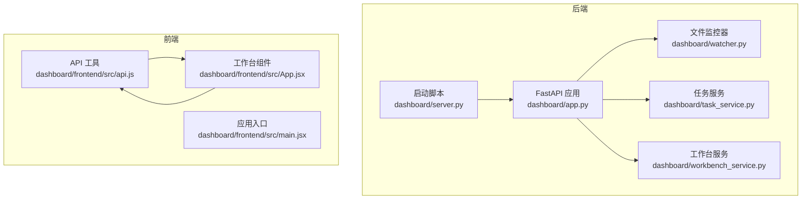
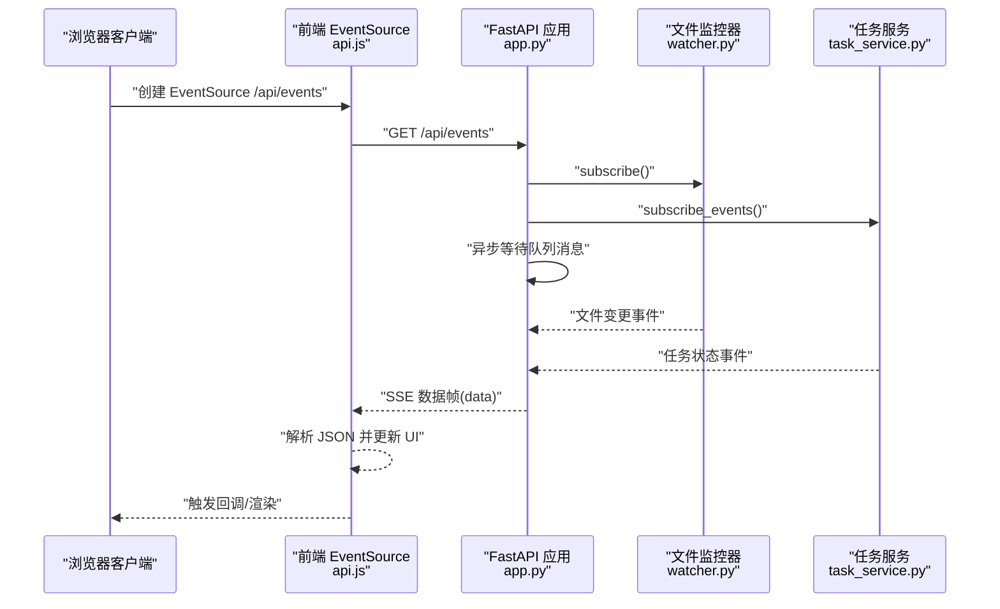
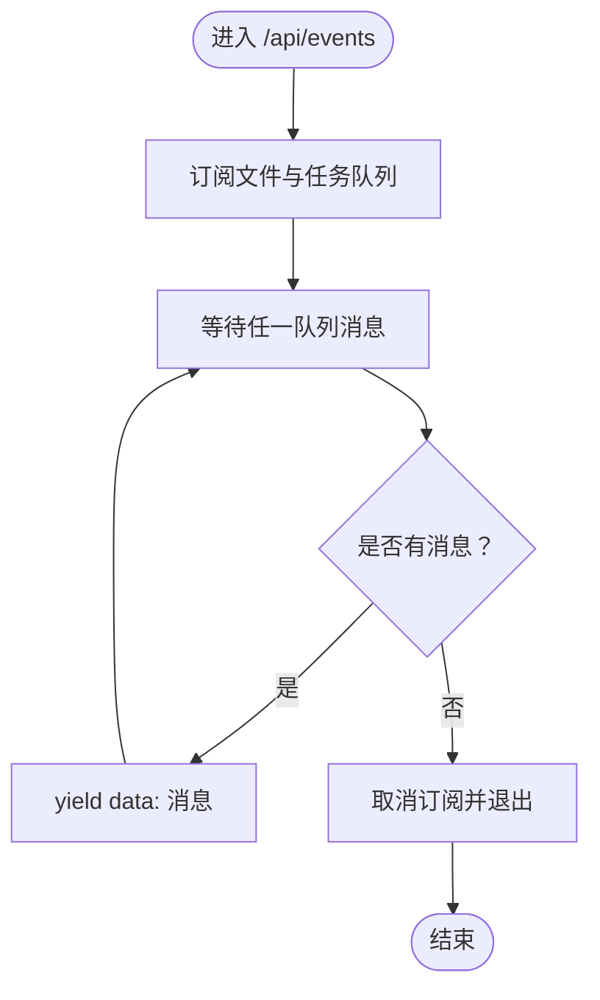
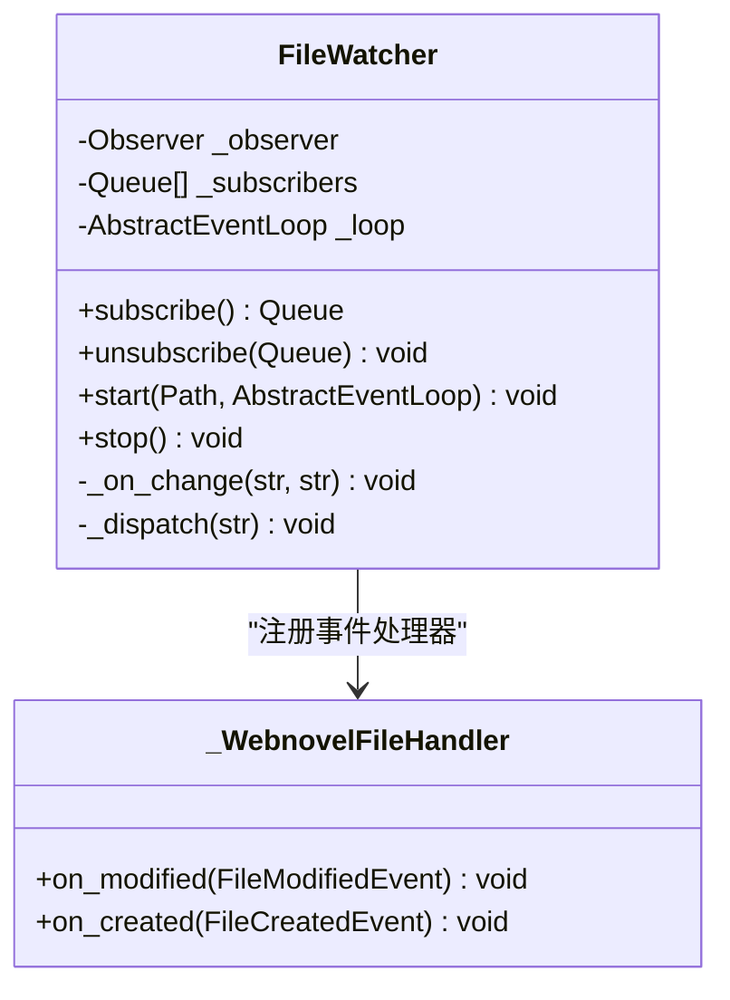
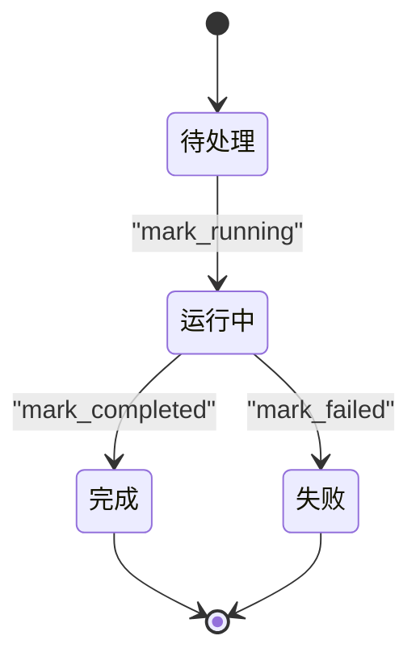
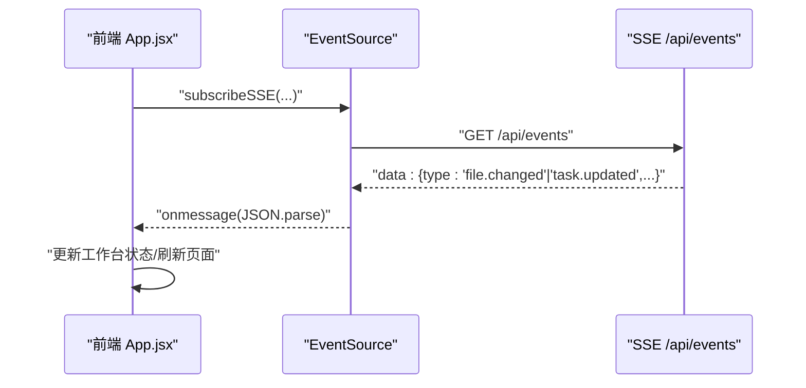
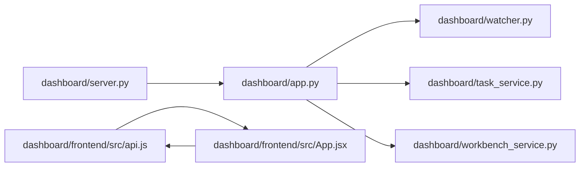

# WebSocket实时接口

<cite>
**本文引用的文件**
- [dashboard/app.py](file://webnovel-writer/dashboard/app.py)
- [dashboard/server.py](file://webnovel-writer/dashboard/server.py)
- [dashboard/watcher.py](file://webnovel-writer/dashboard/watcher.py)
- [dashboard/task_service.py](file://webnovel-writer/dashboard/task_service.py)
- [dashboard/workbench_service.py](file://webnovel-writer/dashboard/workbench_service.py)
- [dashboard/frontend/src/api.js](file://webnovel-writer/dashboard/frontend/src/api.js)
- [dashboard/frontend/src/App.jsx](file://webnovel-writer/dashboard/frontend/src/App.jsx)
</cite>

## 目录
1. [简介](#简介)
2. [项目结构](#项目结构)
3. [核心组件](#核心组件)
4. [架构总览](#架构总览)
5. [详细组件分析](#详细组件分析)
6. [依赖关系分析](#依赖关系分析)
7. [性能考虑](#性能考虑)
8. [故障排查指南](#故障排查指南)
9. [结论](#结论)
10. [附录](#附录)

## 简介
本文件面向“WebSocket实时接口”的文档目标，聚焦于 Server-Sent Events (SSE) 的连接建立、消息格式与事件类型，以及文件变更事件推送 (/api/events) 的工作机制。文档将详细说明：
- 文件监控、事件队列与消息序列化
- 实时任务状态更新、文件系统变更通知与工作台状态同步
- 连接管理、重连机制、错误处理与性能优化策略
- 客户端连接示例、事件监听代码与调试技巧

注意：该项目采用 SSE（Server-Sent Events）而非 WebSocket。SSE 是单向服务器到客户端的推送协议，适合本项目“只推送，不回传”的实时场景。

## 项目结构
后端基于 FastAPI 提供 API 与 SSE 端点；前端使用原生 EventSource 订阅 /api/events 并在 React 组件中消费事件，驱动工作台状态更新与页面刷新。

图表来源
- [dashboard/app.py:434-461](file://webnovel-writer/dashboard/app.py#L434-L461)
- [dashboard/watcher.py:40-95](file://webnovel-writer/dashboard/watcher.py#L40-L95)
- [dashboard/task_service.py:14-166](file://webnovel-writer/dashboard/task_service.py#L14-L166)
- [dashboard/workbench_service.py:18-71](file://webnovel-writer/dashboard/workbench_service.py#L18-L71)
- [dashboard/server.py:43-72](file://webnovel-writer/dashboard/server.py#L43-L72)
- [dashboard/frontend/src/api.js:61-77](file://webnovel-writer/dashboard/frontend/src/api.js#L61-L77)
- [dashboard/frontend/src/App.jsx:195-273](file://webnovel-writer/dashboard/frontend/src/App.jsx#L195-L273)

章节来源
- [dashboard/app.py:50-490](file://webnovel-writer/dashboard/app.py#L50-L490)
- [dashboard/server.py:16-72](file://webnovel-writer/dashboard/server.py#L16-L72)
- [dashboard/frontend/src/api.js:1-78](file://webnovel-writer/dashboard/frontend/src/api.js#L1-L78)
- [dashboard/frontend/src/App.jsx:1-417](file://webnovel-writer/dashboard/frontend/src/App.jsx#L1-L417)

## 核心组件
- SSE 端点与事件聚合：/api/events 聚合文件变更与任务事件，使用异步生成器输出 text/event-stream。
- 文件监控器：基于 watchdog，仅监控 .webnovel 目录的关键文件，转换为统一事件并投递到订阅队列。
- 任务服务：负责任务生命周期管理与事件分发，将任务状态变化转化为 SSE 消息。
- 前端订阅：使用 EventSource 订阅 /api/events，解析 data 字段并更新工作台状态。

章节来源
- [dashboard/app.py:434-461](file://webnovel-writer/dashboard/app.py#L434-L461)
- [dashboard/watcher.py:40-95](file://webnovel-writer/dashboard/watcher.py#L40-L95)
- [dashboard/task_service.py:14-166](file://webnovel-writer/dashboard/task_service.py#L14-L166)
- [dashboard/frontend/src/api.js:61-77](file://webnovel-writer/dashboard/frontend/src/api.js#L61-L77)

## 架构总览
SSE 通道通过异步等待两个队列之一产生消息，优先返回最先到达的消息，保证文件变更与任务事件的及时推送。

图表来源
- [dashboard/app.py:434-461](file://webnovel-writer/dashboard/app.py#L434-L461)
- [dashboard/watcher.py:50-78](file://webnovel-writer/dashboard/watcher.py#L50-L78)
- [dashboard/task_service.py:25-34](file://webnovel-writer/dashboard/task_service.py#L25-L34)
- [dashboard/frontend/src/api.js:61-77](file://webnovel-writer/dashboard/frontend/src/api.js#L61-L77)

## 详细组件分析

### SSE 端点与事件聚合 (/api/events)
- 连接建立：客户端发起 GET /api/events，后端返回 StreamingResponse，媒体类型为 text/event-stream。
- 事件来源：
  - 文件变更：来自 FileWatcher.subscribe() 返回的队列。
  - 任务事件：来自 TaskService.subscribe_events() 返回的队列。
- 并发处理：使用 asyncio.wait(FIRST_COMPLETED) 等待任一队列产生消息，取消未完成的等待任务，确保资源释放。
- 关闭清理：捕获取消异常并在 finally 中取消订阅，防止内存泄漏。

图表来源
- [dashboard/app.py:434-461](file://webnovel-writer/dashboard/app.py#L434-L461)

章节来源
- [dashboard/app.py:434-461](file://webnovel-writer/dashboard/app.py#L434-L461)

### 文件变更事件推送
- 监控范围：仅监控 PROJECT_ROOT/.webnovel/ 目录下的关键文件（如 state.json、index.db、workflow_state.json）。
- 事件类型：仅在文件被修改或创建时触发，事件类型固定为 file.changed。
- 消息格式：JSON 对象，包含 type、file、kind（modified 或 created）、ts（时间戳）。
- 分发策略：遍历订阅者队列，尝试非阻塞放入；若队列满则标记该订阅者为“死亡”，稍后清理。

图表来源
- [dashboard/watcher.py:40-95](file://webnovel-writer/dashboard/watcher.py#L40-L95)

章节来源
- [dashboard/watcher.py:18-38](file://webnovel-writer/dashboard/watcher.py#L18-L38)
- [dashboard/watcher.py:63-78](file://webnovel-writer/dashboard/watcher.py#L63-L78)
- [dashboard/watcher.py:81-95](file://webnovel-writer/dashboard/watcher.py#L81-L95)

### 任务状态事件推送
- 事件类型：task.updated，携带 taskId 与完整任务快照。
- 生命周期事件：
  - 创建：创建任务即发布一次 pending 事件。
  - 运行：切换为 running 并追加日志。
  - 完成/失败：分别标记 completed/failed，附带结果或错误。
- 日志上限：保留最近 N 条日志，避免消息过大。
- 分发策略：与文件事件一致，使用队列与非阻塞投递，队列满则移除订阅者。

图表来源
- [dashboard/task_service.py:88-120](file://webnovel-writer/dashboard/task_service.py#L88-L120)

章节来源
- [dashboard/task_service.py:36-59](file://webnovel-writer/dashboard/task_service.py#L36-L59)
- [dashboard/task_service.py:121-143](file://webnovel-writer/dashboard/task_service.py#L121-L143)
- [dashboard/task_service.py:144-166](file://webnovel-writer/dashboard/task_service.py#L144-L166)

### 前端事件监听与工作台同步
- 订阅方式：使用 EventSource 订阅 /api/events，自动处理连接与重连。
- 事件处理：
  - file.changed：触发工作台摘要刷新与相关页面的重载令牌更新。
  - task.updated：更新当前任务状态、日志、结果或错误，并在完成后触发摘要刷新与页面跳转提示。
- 连接状态：onOpen/onError 回调用于更新 UI 连接指示。

图表来源
- [dashboard/frontend/src/api.js:61-77](file://webnovel-writer/dashboard/frontend/src/api.js#L61-L77)
- [dashboard/frontend/src/App.jsx:195-273](file://webnovel-writer/dashboard/frontend/src/App.jsx#L195-L273)

章节来源
- [dashboard/frontend/src/api.js:61-77](file://webnovel-writer/dashboard/frontend/src/api.js#L61-L77)
- [dashboard/frontend/src/App.jsx:195-273](file://webnovel-writer/dashboard/frontend/src/App.jsx#L195-L273)

### 消息格式与事件类型
- 通用字段
  - type：事件类型（file.changed、task.updated）
  - ts：事件时间戳（秒）
- file.changed
  - file：文件名（如 state.json）
  - kind：事件种类（modified、created）
- task.updated
  - taskId：任务 ID
  - task：任务快照（含 status、logs、result、error 等）

章节来源
- [dashboard/watcher.py:65](file://webnovel-writer/dashboard/watcher.py#L65)
- [dashboard/task_service.py:147-154](file://webnovel-writer/dashboard/task_service.py#L147-L154)

### 连接管理与重连机制
- 自动重连：EventSource 默认具备断线重连能力，无需手动实现指数退避。
- 连接状态反馈：前端通过 onOpen/onError 更新 UI，便于用户感知。
- 后端清理：/api/events 在取消时主动取消订阅，避免僵尸订阅者。

章节来源
- [dashboard/frontend/src/api.js:61-77](file://webnovel-writer/dashboard/frontend/src/api.js#L61-L77)
- [dashboard/app.py:454-459](file://webnovel-writer/dashboard/app.py#L454-L459)

### 错误处理
- SSE 异常：捕获 CancelledError 并安全退出，finally 中取消订阅。
- 队列满处理：丢弃消息并移除“死亡”订阅者，避免阻塞。
- 前端容错：解析失败时忽略，避免影响后续消息。

章节来源
- [dashboard/app.py:454-459](file://webnovel-writer/dashboard/app.py#L454-L459)
- [dashboard/watcher.py:70-78](file://webnovel-writer/dashboard/watcher.py#L70-L78)
- [dashboard/task_service.py:157-166](file://webnovel-writer/dashboard/task_service.py#L157-L166)
- [dashboard/frontend/src/api.js:67-71](file://webnovel-writer/dashboard/frontend/src/api.js#L67-L71)

### 性能优化策略
- 队列容量控制：文件事件队列 maxsize=64，任务事件队列 maxsize=128，避免内存膨胀。
- 非阻塞投递：使用 put_nowait，队列满时快速失败并清理。
- 事件合并：仅监控关键文件，减少无关事件。
- 前端节流：收到 file.changed 时触发摘要刷新与页面重载，避免频繁无意义渲染。

章节来源
- [dashboard/watcher.py:50-53](file://webnovel-writer/dashboard/watcher.py#L50-L53)
- [dashboard/task_service.py:25-28](file://webnovel-writer/dashboard/task_service.py#L25-L28)
- [dashboard/frontend/src/App.jsx:198-201](file://webnovel-writer/dashboard/frontend/src/App.jsx#L198-L201)

## 依赖关系分析
- app.py 依赖 watcher.py 与 task_service.py 提供事件源；依赖 workbench_service.py 提供工作台摘要。
- server.py 负责解析项目根目录与启动 Uvicorn。
- 前端通过 api.js 调用后端 API 与订阅 SSE。

图表来源
- [dashboard/server.py:55-67](file://webnovel-writer/dashboard/server.py#L55-L67)
- [dashboard/app.py:20-24](file://webnovel-writer/dashboard/app.py#L20-L24)
- [dashboard/frontend/src/api.js:1-78](file://webnovel-writer/dashboard/frontend/src/api.js#L1-L78)
- [dashboard/frontend/src/App.jsx:1-417](file://webnovel-writer/dashboard/frontend/src/App.jsx#L1-L417)

章节来源
- [dashboard/server.py:43-72](file://webnovel-writer/dashboard/server.py#L43-L72)
- [dashboard/app.py:50-490](file://webnovel-writer/dashboard/app.py#L50-L490)

## 性能考虑
- 队列大小与背压：合理设置 maxsize，避免事件风暴导致内存占用过高。
- 事件粒度：仅监控必要文件，降低事件频率。
- 前端渲染：对高频事件进行去抖或节流，避免重复渲染。
- 日志截断：任务日志保留最近 N 条，控制消息体积。

[本节为通用指导，无需特定文件引用]

## 故障排查指南
- 无法连接 /api/events
  - 检查后端是否正确挂载 SSE 端点与返回 text/event-stream。
  - 查看前端 EventSource 是否抛出 onerror，确认网络与跨域设置。
- 事件不推送
  - 确认 watchdog 是否在运行，监控目录是否正确。
  - 检查文件事件是否命中监控名单（仅关键文件）。
- 任务事件缺失
  - 确认任务服务已 set_event_loop 并在 lifespan 中初始化。
  - 检查订阅队列是否被清理（队列满时会移除订阅者）。
- 前端不更新
  - 检查事件解析逻辑，确认 JSON.parse 成功。
  - 确认 UI 使用了受控刷新（如重载令牌）。

章节来源
- [dashboard/app.py:434-461](file://webnovel-writer/dashboard/app.py#L434-L461)
- [dashboard/watcher.py:81-95](file://webnovel-writer/dashboard/watcher.py#L81-L95)
- [dashboard/task_service.py:22-23](file://webnovel-writer/dashboard/task_service.py#L22-L23)
- [dashboard/frontend/src/api.js:67-71](file://webnovel-writer/dashboard/frontend/src/api.js#L67-L71)

## 结论
本项目通过 SSE 实现了低耦合、易维护的实时推送：文件变更与任务状态均以统一事件模型驱动前端工作台状态更新。通过合理的队列容量、非阻塞投递与前端节流，系统在高并发与频繁变更场景下仍能保持稳定与高效。

[本节为总结性内容，无需特定文件引用]

## 附录

### 客户端连接示例（EventSource）
- 订阅与取消
  - 订阅：使用 subscribeSSE(onMessage, { onOpen, onError })。
  - 取消：调用返回的取消函数关闭连接。
- 事件监听
  - file.changed：触发工作台摘要刷新与页面重载。
  - task.updated：更新当前任务状态、日志与结果。

章节来源
- [dashboard/frontend/src/api.js:61-77](file://webnovel-writer/dashboard/frontend/src/api.js#L61-L77)
- [dashboard/frontend/src/App.jsx:195-273](file://webnovel-writer/dashboard/frontend/src/App.jsx#L195-L273)

### 事件监听代码片段路径
- 前端订阅与处理：[dashboard/frontend/src/api.js:61-77](file://webnovel-writer/dashboard/frontend/src/api.js#L61-L77)
- 事件消费与 UI 更新：[dashboard/frontend/src/App.jsx:195-273](file://webnovel-writer/dashboard/frontend/src/App.jsx#L195-L273)

### 调试技巧
- 浏览器开发者工具：Network 面板观察 /api/events 的 SSE 流，确认 data 字段与事件类型。
- 控制台日志：在前端 onmessage 中打印事件，验证 JSON 解析与字段完整性。
- 后端日志：确认 watchdog 事件回调与任务事件分发是否触发。
- 网络诊断：检查 CORS 设置与代理配置，确保 EventSource 能正常建立连接。

章节来源
- [dashboard/app.py:69-74](file://webnovel-writer/dashboard/app.py#L69-L74)
- [dashboard/frontend/src/api.js:67-71](file://webnovel-writer/dashboard/frontend/src/api.js#L67-L71)