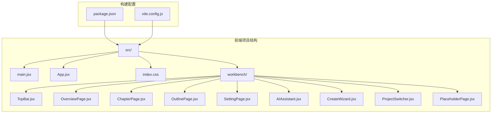
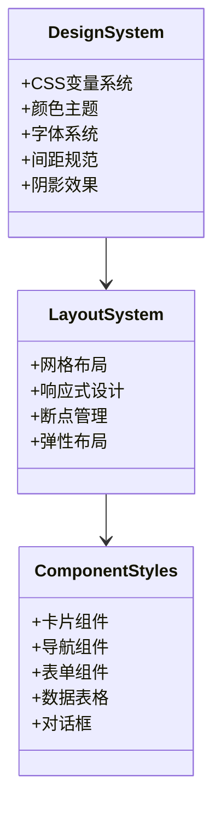
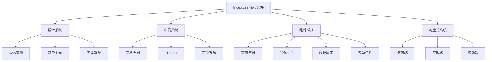
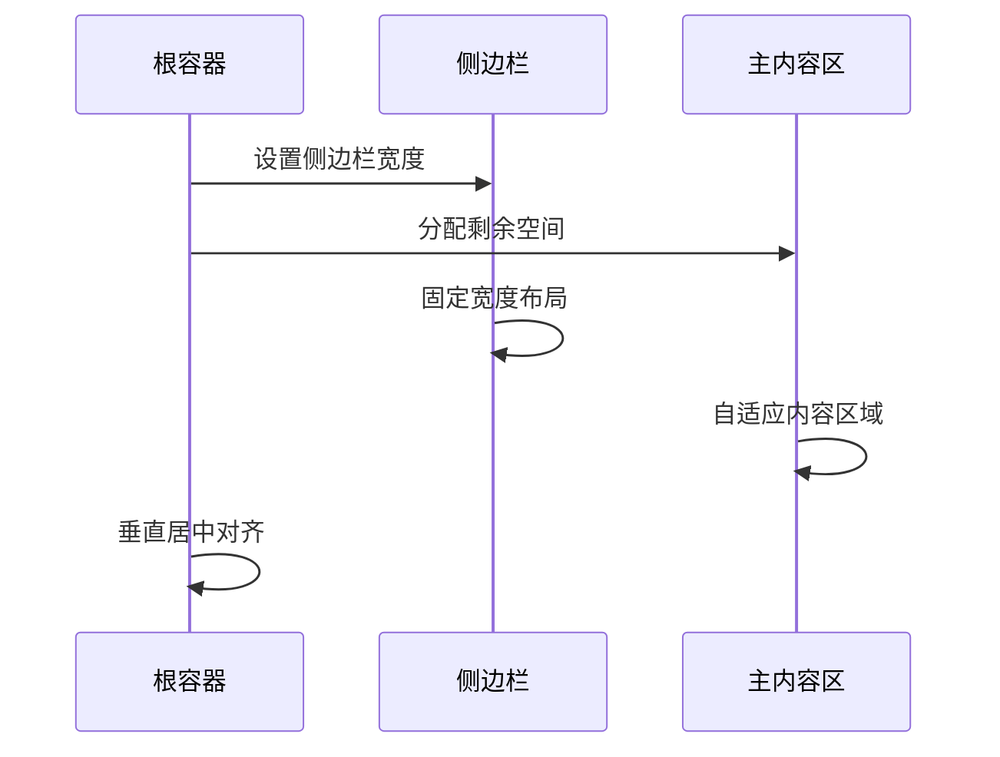
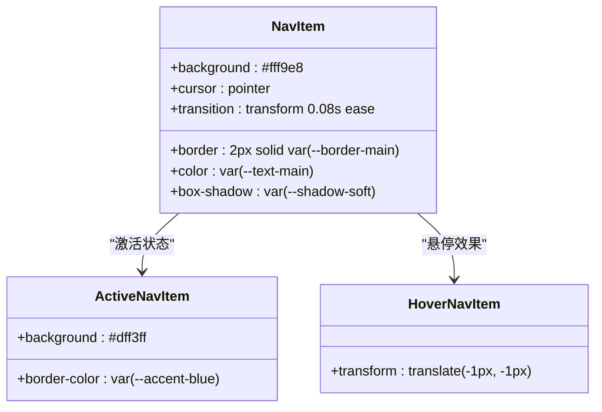
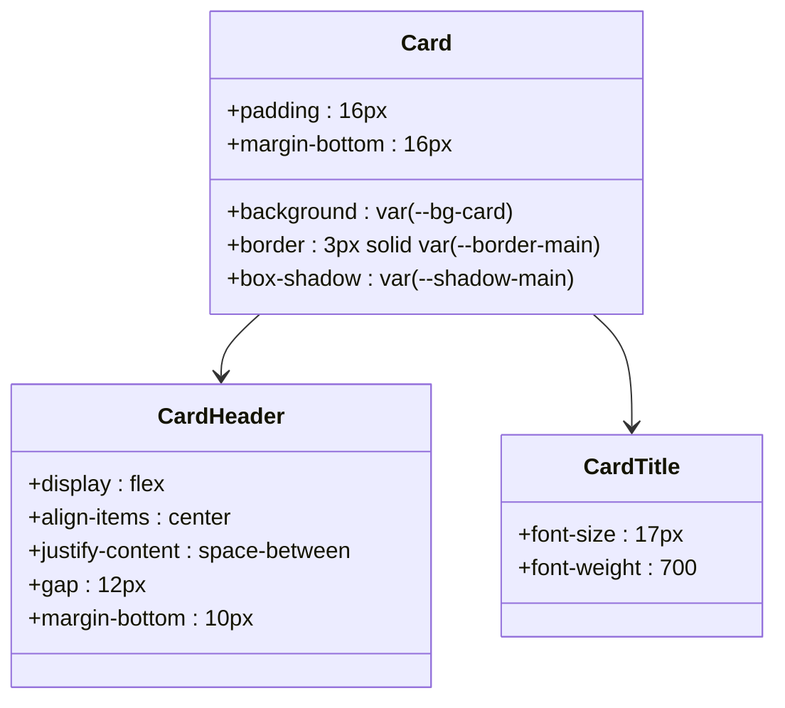
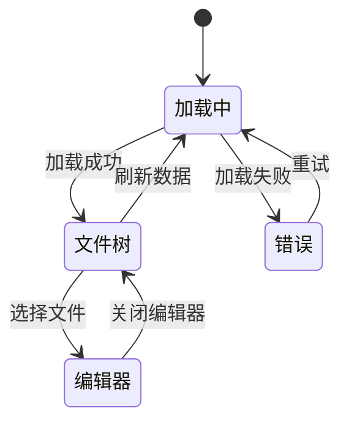
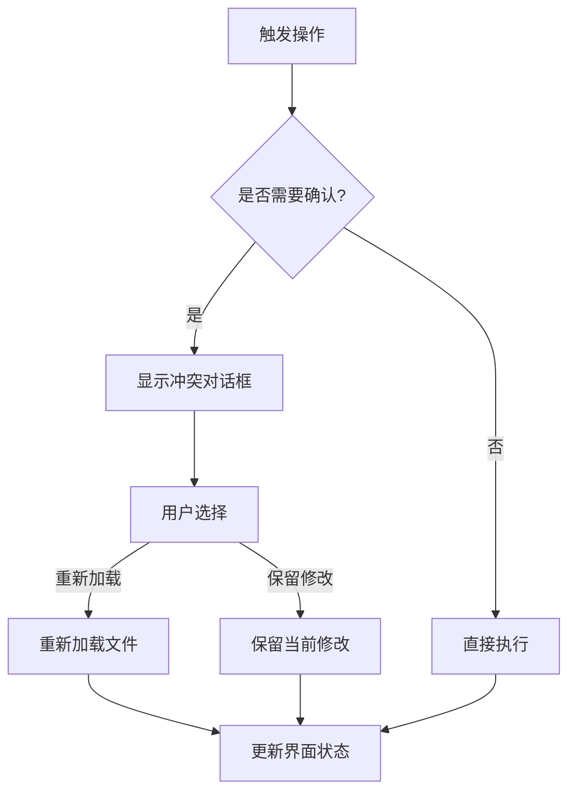
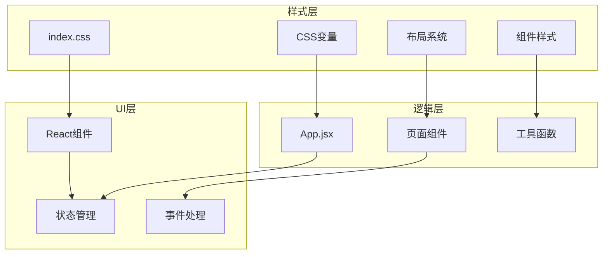

# Index Css 文档

<cite>
**本文档引用的文件**
- [index.css](file://webnovel-writer/dashboard/frontend/src/index.css)
- [main.jsx](file://webnovel-writer/dashboard/frontend/src/main.jsx)
- [App.jsx](file://webnovel-writer/dashboard/frontend/src/App.jsx)
- [TopBar.jsx](file://webnovel-writer/dashboard/frontend/src/workbench/TopBar.jsx)
- [OverviewPage.jsx](file://webnovel-writer/dashboard/frontend/src/workbench/OverviewPage.jsx)
- [ChapterPage.jsx](file://webnovel-writer/dashboard/frontend/src/workbench/ChapterPage.jsx)
- [OutlinePage.jsx](file://webnovel-writer/dashboard/frontend/src/workbench/OutlinePage.jsx)
- [SettingPage.jsx](file://webnovel-writer/dashboard/frontend/src/workbench/SettingPage.jsx)
- [AIAssistant.jsx](file://webnovel-writer/dashboard/frontend/src/workbench/AIAssistant.jsx)
- [CreateWizard.jsx](file://webnovel-writer/dashboard/frontend/src/workbench/CreateWizard.jsx)
- [ProjectSwitcher.jsx](file://webnovel-writer/dashboard/frontend/src/workbench/ProjectSwitcher.jsx)
- [PlaceholderPage.jsx](file://webnovel-writer/dashboard/frontend/src/workbench/PlaceholderPage.jsx)
- [package.json](file://webnovel-writer/dashboard/frontend/package.json)
</cite>

## 目录
1. [简介](#简介)
2. [项目结构](#项目结构)
3. [核心组件](#核心组件)
4. [架构概览](#架构概览)
5. [详细组件分析](#详细组件分析)
6. [依赖关系分析](#依赖关系分析)
7. [性能考虑](#性能考虑)
8. [故障排除指南](#故障排除指南)
9. [结论](#结论)

## 简介

Index Css 是 WebNovel Writer 项目中前端界面样式系统的核心文件，负责定义整个工作台应用的视觉设计和响应式布局。该样式系统采用现代 CSS 技术，包括 CSS 变量、网格布局、媒体查询等，为创作工作台提供了统一且美观的用户界面。

该项目是一个基于 React 的全栈应用，专注于网络文学创作，提供了从项目创建到内容编写的完整工作流程。Index Css 文件作为样式基础，为所有页面组件提供了统一的设计语言和交互体验。

## 项目结构

WebNovel Writer 项目采用模块化架构，前端部分主要包含以下关键目录：

**图表来源**
- [main.jsx:1-11](file://webnovel-writer/dashboard/frontend/src/main.jsx#L1-L11)
- [App.jsx:1-600](file://webnovel-writer/dashboard/frontend/src/App.jsx#L1-L600)
- [package.json:1-23](file://webnovel-writer/dashboard/frontend/package.json#L1-L23)

**章节来源**
- [main.jsx:1-11](file://webnovel-writer/dashboard/frontend/src/main.jsx#L1-L11)
- [package.json:1-23](file://webnovel-writer/dashboard/frontend/package.json#L1-L23)

## 核心组件

Index Css 文件定义了整个应用的样式系统，包含以下核心组件：

### 设计系统基础

**图表来源**
- [index.css:1-800](file://webnovel-writer/dashboard/frontend/src/index.css#L1-L800)

### 颜色系统

Index Css 实现了一个完整的颜色系统，包含主色调、辅助色和语义化颜色：

- **主背景色**: `--bg-main: #fff7e8`
- **面板背景**: `--bg-panel: #fffdf6`
- **卡片背景**: `--bg-card: #fffaf0`
- **文本颜色**: `--text-main: #2a220f`
- **强调色**: 多种品牌色彩（蓝色、紫色、绿色、琥珀色等）

### 响应式设计

系统支持多设备适配，通过媒体查询实现：

- **桌面端**: 1280px+ 屏幕宽度
- **平板端**: 960px-1280px 屏幕宽度  
- **移动端**: 720px-960px 屏幕宽度
- **小屏移动设备**: 720px- 下屏幕宽度

**章节来源**
- [index.css:1-800](file://webnovel-writer/dashboard/frontend/src/index.css#L1-L800)

## 架构概览

Index Css 的架构基于模块化设计原则，将样式分为多个功能域：

**图表来源**
- [index.css:52-800](file://webnovel-writer/dashboard/frontend/src/index.css#L52-L800)

### 样式组织结构

样式文件按照功能域进行组织，每个功能域都有明确的职责边界：

1. **全局样式** (`*:root`, `body`, `html`) - 定义基础样式和变量
2. **布局系统** (`app-layout`, `sidebar`, `main-content`) - 管理页面整体布局
3. **组件样式** - 各个页面组件的专用样式
4. **响应式样式** - 不同设备尺寸下的样式调整

**章节来源**
- [index.css:52-800](file://webnovel-writer/dashboard/frontend/src/index.css#L52-L800)

## 详细组件分析

### 应用布局系统

应用采用双栏布局设计，提供流畅的用户体验：

**图表来源**
- [index.css:52-153](file://webnovel-writer/dashboard/frontend/src/index.css#L52-L153)

#### 侧边栏设计

侧边栏实现了完整的导航功能，包含：

- **头部区域**: 项目标题和副标题显示
- **导航菜单**: 页面切换按钮
- **状态指示**: 连接状态和任务状态
- **响应式适配**: 小屏幕下的图标化显示

#### 主内容区

主内容区提供灵活的内容展示区域，支持：

- **滚动区域**: 满足长内容浏览
- **卡片布局**: 信息分组展示
- **网格系统**: 数据表格和统计卡片

**章节来源**
- [index.css:52-153](file://webnovel-writer/dashboard/frontend/src/index.css#L52-L153)

### 导航组件系统

导航系统采用统一的设计语言，确保用户界面的一致性：

**图表来源**
- [index.css:97-126](file://webnovel-writer/dashboard/frontend/src/index.css#L97-L126)

#### 导航项特性

- **视觉反馈**: 悬停时的位移效果
- **状态指示**: 激活状态的颜色变化
- **无障碍设计**: 焦点可见性
- **响应式适配**: 不同屏幕尺寸下的显示优化

**章节来源**
- [index.css:97-126](file://webnovel-writer/dashboard/frontend/src/index.css#L97-L126)

### 数据展示组件

系统提供了多种数据展示组件，满足不同场景的需求：

#### 卡片组件

卡片组件是信息展示的基础单元：

**图表来源**
- [index.css:173-200](file://webnovel-writer/dashboard/frontend/src/index.css#L173-L200)

#### 统计卡片

统计卡片用于展示关键指标：

- **数值显示**: 大字号突出显示重要数据
- **标签系统**: 使用徽章标识数据类型
- **进度条**: 展示完成度和目标达成情况

#### 表格组件

数据表格支持复杂的数据展示需求：

- **响应式表格**: 水平滚动支持长表格
- **悬停效果**: 行级交互反馈
- **分页功能**: 大数据集的分页浏览

**章节来源**
- [index.css:173-395](file://webnovel-writer/dashboard/frontend/src/index.css#L173-L395)

### 文件管理系统

文件管理是创作工作台的核心功能之一：

**图表来源**
- [index.css:476-526](file://webnovel-writer/dashboard/frontend/src/index.css#L476-L526)

#### 文件树组件

文件树组件提供层次化的文件浏览功能：

- **折叠展开**: 支持目录的层级展开
- **活动状态**: 当前选中文件的高亮显示
- **悬停效果**: 提供清晰的交互反馈

#### 编辑器区域

编辑器区域支持 Markdown 和纯文本编辑：

- **语法高亮**: 支持 Markdown 语法高亮
- **自动换行**: 长文本的自动换行处理
- **字数统计**: 实时字数统计功能

**章节来源**
- [index.css:476-577](file://webnovel-writer/dashboard/frontend/src/index.css#L476-L577)

### 对话框系统

应用提供了多种类型的对话框，用于特殊操作和确认：

**图表来源**
- [index.css:34-71](file://webnovel-writer/dashboard/frontend/src/index.css#L34-L71)

#### 冲突解决对话框

冲突解决对话框用于处理文件修改冲突：

- **状态提示**: 明确显示当前文件状态
- **操作选项**: 提供两种解决方案
- **确认机制**: 防止误操作导致的数据丢失

#### 向导系统

项目创建向导采用多步骤设计：

- **步骤指示器**: 清晰显示当前步骤位置
- **表单验证**: 实时验证用户输入
- **进度反馈**: 创建过程中的状态显示

**章节来源**
- [index.css:34-71](file://webnovel-writer/dashboard/frontend/src/index.css#L34-L71)

## 依赖关系分析

Index Css 与 React 组件之间的依赖关系体现了现代前端开发的最佳实践：

**图表来源**
- [main.jsx:1-11](file://webnovel-writer/dashboard/frontend/src/main.jsx#L1-L11)
- [App.jsx:73-599](file://webnovel-writer/dashboard/frontend/src/App.jsx#L73-L599)

### 样式导入机制

应用采用集中式样式管理：

1. **入口文件**: main.jsx 中导入全局样式
2. **组件样式**: 每个组件维护独立的样式类
3. **变量共享**: CSS 变量在所有组件间共享
4. **响应式规则**: 媒体查询在全局范围内生效

### 组件通信与样式

React 组件通过 props 传递状态，样式系统响应这些状态变化：

- **激活状态**: 导航项根据当前页面高亮显示
- **加载状态**: 通过不同的样式类显示加载进度
- **错误状态**: 错误信息使用特定的视觉样式
- **交互状态**: 按钮和链接的状态变化

**章节来源**
- [main.jsx:1-11](file://webnovel-writer/dashboard/frontend/src/main.jsx#L1-L11)
- [App.jsx:73-599](file://webnovel-writer/dashboard/frontend/src/App.jsx#L73-L599)

## 性能考虑

Index Css 在设计时充分考虑了性能优化：

### 样式计算优化

- **CSS 变量缓存**: 减少重复计算和内存占用
- **选择器优化**: 使用高效的 CSS 选择器减少渲染开销
- **动画性能**: 使用 transform 和 opacity 实现硬件加速

### 响应式性能

- **媒体查询优化**: 合理使用媒体查询避免频繁重排
- **图片优化**: 使用 CSS 背景图减少 HTTP 请求
- **字体加载**: 通过 @font-face 优化字体加载性能

### 组件性能

- **样式隔离**: 每个组件的样式独立，避免全局污染
- **条件渲染**: 根据状态动态应用样式类
- **事件委托**: 减少事件处理器的数量

## 故障排除指南

### 常见问题及解决方案

#### 样式不生效

**问题症状**:
- 组件样式显示异常
- 媒体查询不生效
- CSS 变量未正确解析

**解决方案**:
1. 检查 CSS 变量的定义和使用
2. 验证媒体查询的断点设置
3. 确认组件类名的正确性

#### 响应式布局问题

**问题症状**:
- 移动端显示异常
- 桌面端布局错乱
- 组件尺寸不正确

**解决方案**:
1. 检查断点设置是否合理
2. 验证 flexbox 和 grid 的使用
3. 确认容器的尺寸设置

#### 性能问题

**问题症状**:
- 页面加载缓慢
- 滚动卡顿
- 动画不流畅

**解决方案**:
1. 检查 CSS 选择器的复杂度
2. 优化动画属性的使用
3. 减少重绘和重排的操作

**章节来源**
- [index.css:644-743](file://webnovel-writer/dashboard/frontend/src/index.css#L644-L743)

## 结论

Index Css 作为 WebNovel Writer 项目的核心样式系统，展现了现代前端开发的最佳实践。通过精心设计的 CSS 变量系统、响应式布局和组件化样式架构，为用户提供了一致且美观的创作体验。

该样式系统的成功体现在以下几个方面：

1. **设计一致性**: 统一的设计语言确保了良好的用户体验
2. **响应式适配**: 多设备支持提供了灵活的使用方式
3. **性能优化**: 合理的样式架构保证了优秀的性能表现
4. **可维护性**: 模块化的样式组织便于长期维护和扩展

未来可以考虑的方向包括：
- 进一步优化动画性能
- 增强主题系统的灵活性
- 扩展组件样式的可定制性
- 改进无障碍访问的支持

通过持续的优化和改进，Index Css 将为 WebNovel Writer 项目提供更加出色的视觉体验和技术支撑。