# 测试新 API 文档

<cite>
**本文档引用的文件**
- [test_new_apis.py](file://webnovel-writer/dashboard/tests/test_new_apis.py)
- [app.py](file://webnovel-writer/dashboard/app.py)
- [api.js](file://webnovel-writer/dashboard/frontend/src/api.js)
- [genre_service.py](file://webnovel-writer/dashboard/genre_service.py)
- [project_service.py](file://webnovel-writer/dashboard/project_service.py)
- [workbench_service.py](file://webnovel-writer/dashboard/workbench_service.py)
- [server.py](file://webnovel-writer/dashboard/server.py)
- [pytest.ini](file://pytest.ini)
</cite>

## 目录
1. [简介](#简介)
2. [项目结构](#项目结构)
3. [核心组件](#核心组件)
4. [架构概览](#架构概览)
5. [详细组件分析](#详细组件分析)
6. [依赖关系分析](#依赖关系分析)
7. [性能考虑](#性能考虑)
8. [故障排除指南](#故障排除指南)
9. [结论](#结论)

## 简介

本文档详细分析了 Webnovel Writer 项目中新增的 7 个 API 接口的测试实现。这些 API 是项目从 Phase 1 向 Phase 2 过渡的关键组件，主要涉及题材管理、金手指类型、项目管理和大纲树构建等功能。

该项目采用 FastAPI 框架构建，结合 React 前端界面，提供了完整的网络小说创作工作台解决方案。新增的 API 测试涵盖了从基础的数据查询到复杂的项目管理操作，确保系统的稳定性和可靠性。

## 项目结构

Webnovel Writer 项目采用模块化设计，主要分为以下几个核心部分：

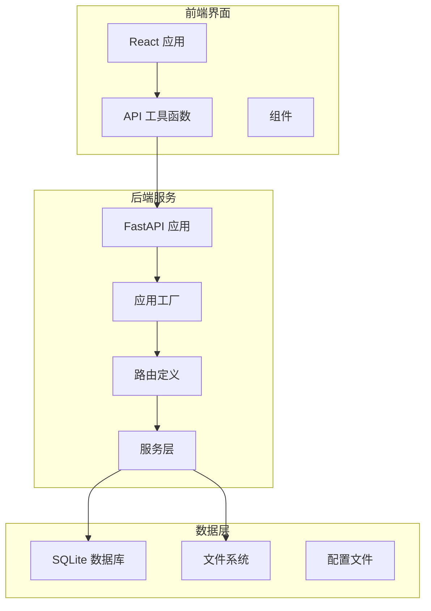

**图表来源**
- [app.py:54-573](file://webnovel-writer/dashboard/app.py#L54-L573)
- [api.js:1-101](file://webnovel-writer/dashboard/frontend/src/api.js#L1-L101)

**章节来源**
- [app.py:1-597](file://webnovel-writer/dashboard/app.py#L1-L597)
- [server.py:1-75](file://webnovel-writer/dashboard/server.py#L1-L75)

## 核心组件

### API 测试套件

新增的 API 测试套件包含了以下 7 个核心接口的契约测试：

1. **GET /api/genres** - 获取题材列表
2. **GET /api/golden-finger-types** - 获取金手指类型列表
3. **GET /api/outline/tree** - 获取大纲树结构
4. **GET /api/recent-activity** - 获取最近活动
5. **GET /api/projects** - 获取项目列表
6. **POST /api/project/create** - 创建新项目
7. **POST /api/project/switch** - 切换项目

每个测试都遵循 TDD 红灯阶段的模式，使用 ASGI raw scope 直接调用 FastAPI 应用程序，确保测试的独立性和准确性。

**章节来源**
- [test_new_apis.py:117-317](file://webnovel-writer/dashboard/tests/test_new_apis.py#L117-L317)

### 应用架构

应用采用工厂模式创建，支持多种部署方式：

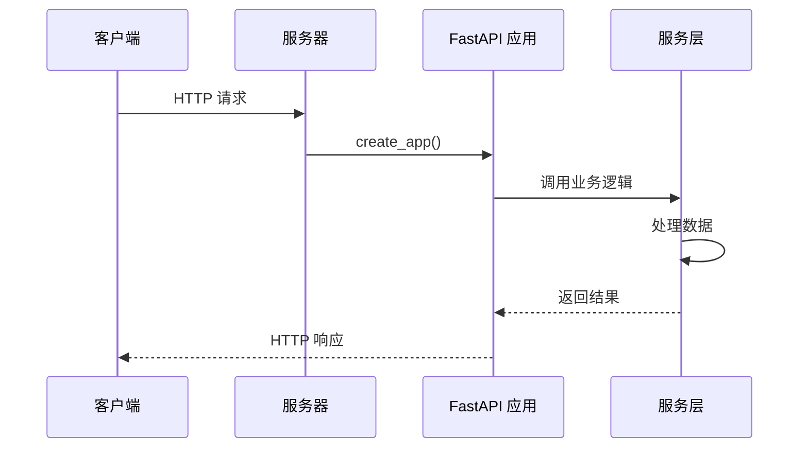

**图表来源**
- [app.py:54-72](file://webnovel-writer/dashboard/app.py#L54-L72)
- [server.py:61-70](file://webnovel-writer/dashboard/server.py#L61-L70)

**章节来源**
- [app.py:54-573](file://webnovel-writer/dashboard/app.py#L54-L573)
- [server.py:43-75](file://webnovel-writer/dashboard/server.py#L43-L75)

## 架构概览

### 系统架构图

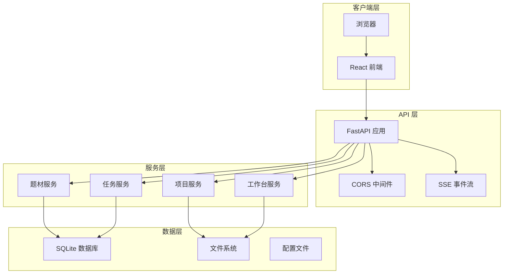

**图表来源**
- [app.py:15-26](file://webnovel-writer/dashboard/app.py#L15-L26)
- [genre_service.py:1-152](file://webnovel-writer/dashboard/genre_service.py#L1-L152)
- [project_service.py:1-181](file://webnovel-writer/dashboard/project_service.py#L1-L181)

### API 路由结构

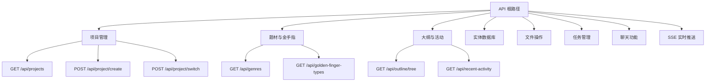

**图表来源**
- [app.py:85-174](file://webnovel-writer/dashboard/app.py#L85-L174)

**章节来源**
- [app.py:85-573](file://webnovel-writer/dashboard/app.py#L85-L573)

## 详细组件分析

### 题材管理 API

#### GET /api/genres

该接口负责返回所有可用的题材信息，包括题材的键值、标签、模板和配置文件关联。

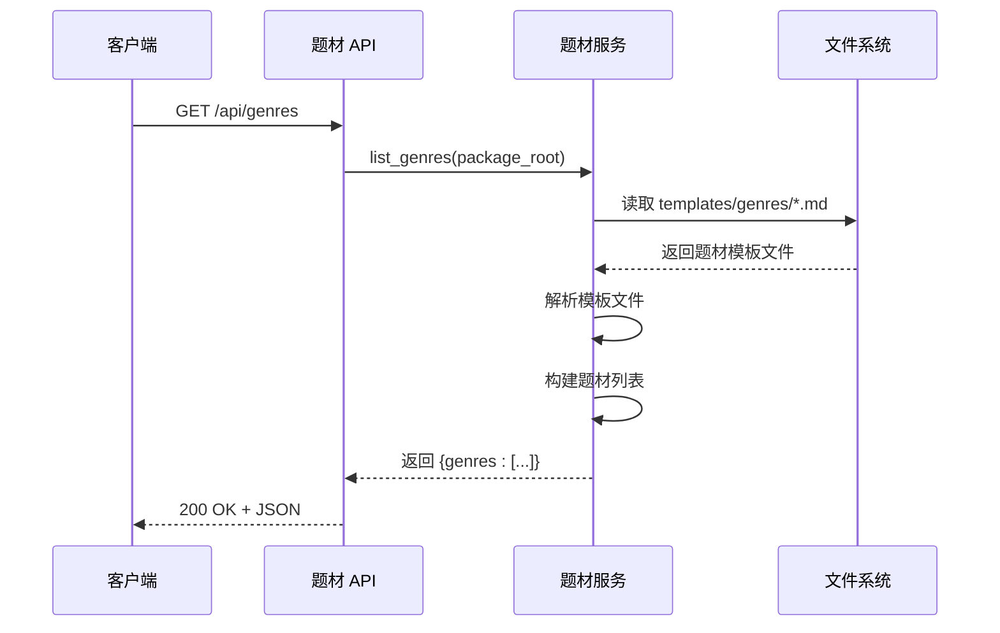

**图表来源**
- [app.py:124-126](file://webnovel-writer/dashboard/app.py#L124-L126)
- [genre_service.py:37-93](file://webnovel-writer/dashboard/genre_service.py#L37-L93)

#### GET /api/golden-finger-types

金手指类型接口提供所有可用的金手指类型配置，支持从模板文件中解析类型信息。

**章节来源**
- [app.py:128-130](file://webnovel-writer/dashboard/app.py#L128-L130)
- [genre_service.py:109-151](file://webnovel-writer/dashboard/genre_service.py#L109-L151)

### 项目管理 API

#### POST /api/project/create

项目创建接口支持完整的项目初始化流程，包括目录创建、配置文件生成和注册表更新。

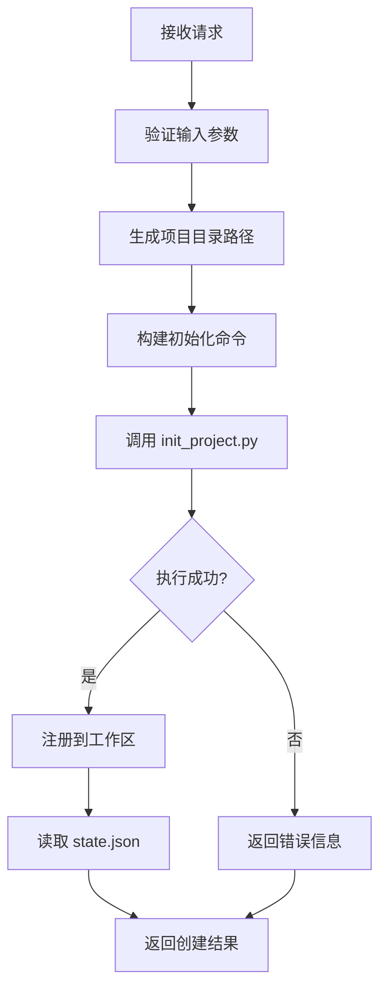

**图表来源**
- [app.py:136-147](file://webnovel-writer/dashboard/app.py#L136-L147)
- [project_service.py:81-136](file://webnovel-writer/dashboard/project_service.py#L81-L136)

**章节来源**
- [app.py:136-147](file://webnovel-writer/dashboard/app.py#L136-L147)
- [project_service.py:81-136](file://webnovel-writer/dashboard/project_service.py#L81-L136)

#### POST /api/project/switch

项目切换接口负责在多个项目之间进行切换，确保文件监控器正确更新。

**章节来源**
- [app.py:153-162](file://webnovel-writer/dashboard/app.py#L153-L162)
- [project_service.py:170-180](file://webnovel-writer/dashboard/project_service.py#L170-L180)

### 大纲树构建 API

#### GET /api/outline/tree

大纲树构建接口分析项目的大纲结构，生成卷号、章节范围和详细大纲的存在状态。

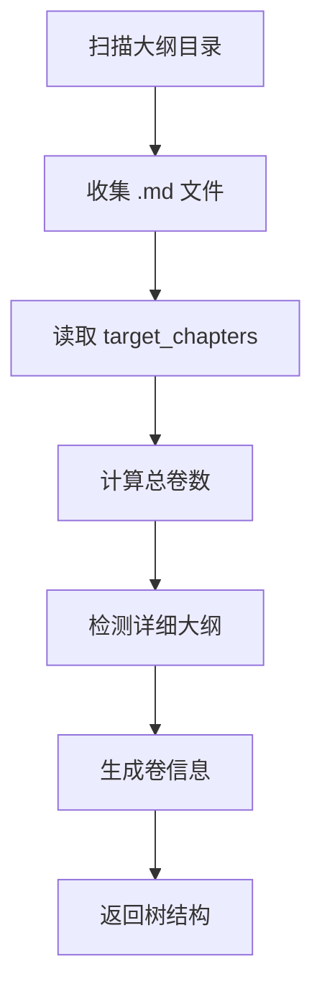

**图表来源**
- [workbench_service.py:174-238](file://webnovel-writer/dashboard/workbench_service.py#L174-L238)

**章节来源**
- [workbench_service.py:174-238](file://webnovel-writer/dashboard/workbench_service.py#L174-L238)

### 前端 API 工具

前端提供了专门的 API 工具函数，封装了所有新的 API 调用：

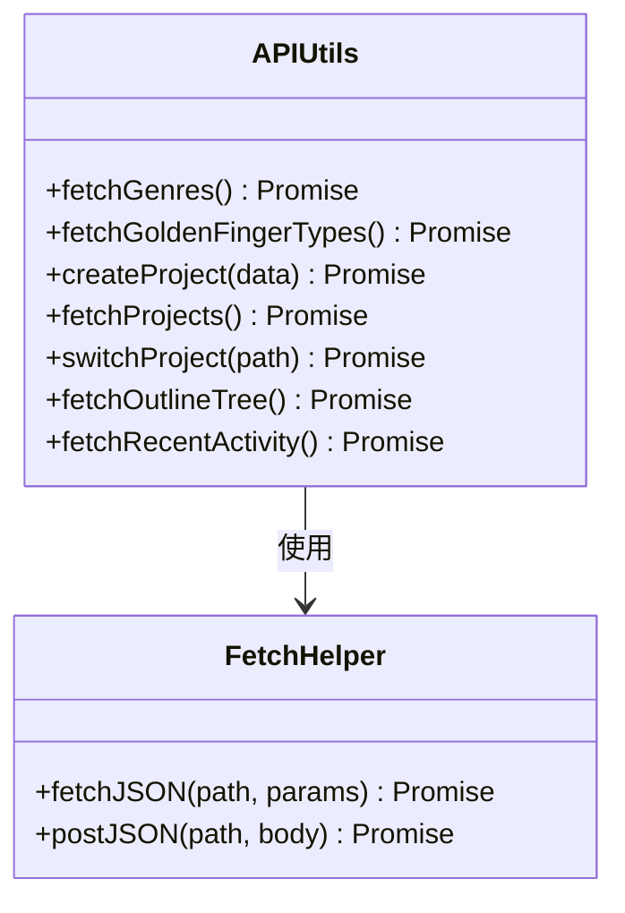

**图表来源**
- [api.js:79-100](file://webnovel-writer/dashboard/frontend/src/api.js#L79-L100)

**章节来源**
- [api.js:1-101](file://webnovel-writer/dashboard/frontend/src/api.js#L1-101)

## 依赖关系分析

### 服务层依赖图

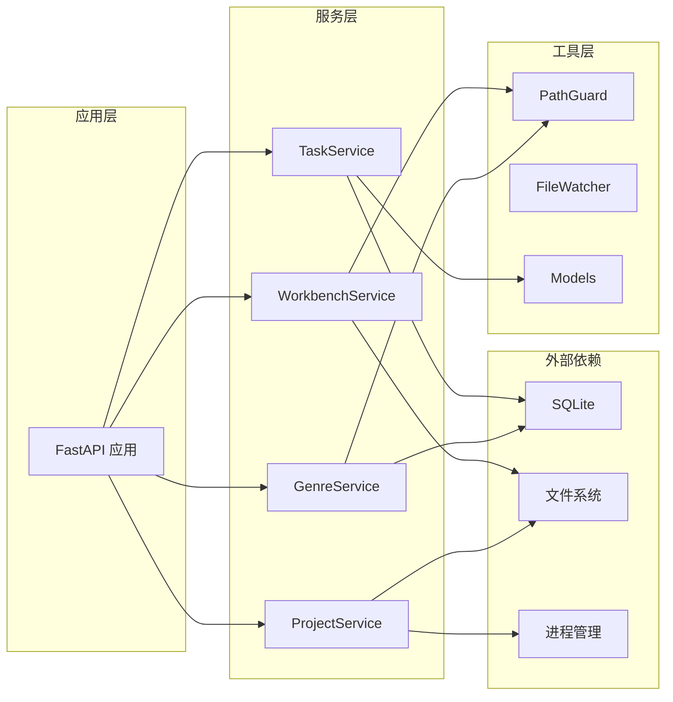

**图表来源**
- [app.py:20-26](file://webnovel-writer/dashboard/app.py#L20-L26)
- [genre_service.py:10-14](file://webnovel-writer/dashboard/genre_service.py#L10-L14)

### 测试依赖关系

测试套件展示了清晰的依赖层次结构：

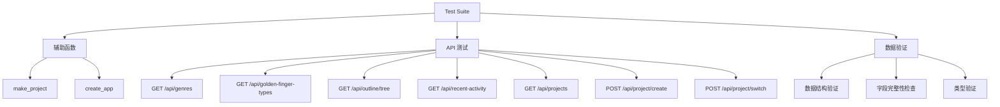

**图表来源**
- [test_new_apis.py:25-317](file://webnovel-writer/dashboard/tests/test_new_apis.py#L25-L317)

**章节来源**
- [test_new_apis.py:1-318](file://webnovel-writer/dashboard/tests/test_new_apis.py#L1-L318)

## 性能考虑

### 异步处理机制

应用采用了异步编程模型来处理并发请求：

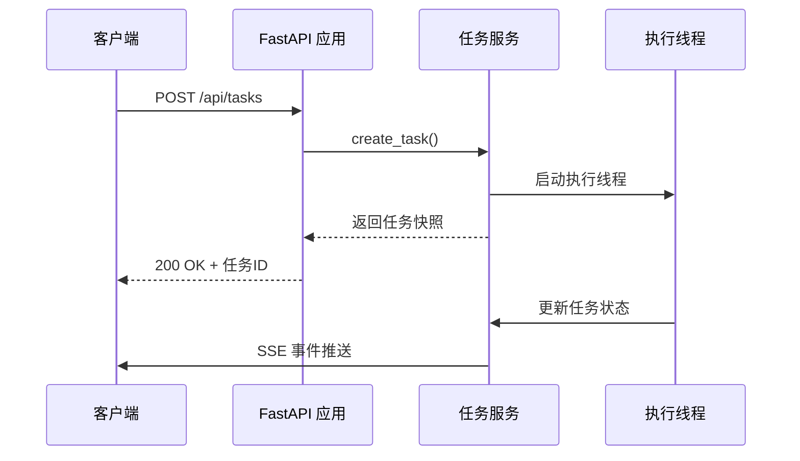

**图表来源**
- [task_service.py:36-59](file://webnovel-writer/dashboard/task_service.py#L36-L59)

### 数据库优化策略

对于只读查询，应用实现了智能的数据库连接管理：

- **连接池管理**：使用上下文管理器确保连接正确关闭
- **错误处理**：对表不存在的情况提供优雅降级
- **性能优化**：使用 row_factory 提高查询效率

**章节来源**
- [app.py:180-197](file://webnovel-writer/dashboard/app.py#L180-L197)
- [task_service.py:14-166](file://webnovel-writer/dashboard/task_service.py#L14-L166)

## 故障排除指南

### 常见问题诊断

#### API 响应状态码

| 状态码 | 含义 | 可能原因 | 解决方案 |
|--------|------|----------|----------|
| 200 | 成功 | 请求格式正确，数据有效 | 验证响应数据结构 |
| 400 | 参数错误 | 缺少必需参数或参数类型错误 | 检查请求体格式 |
| 403 | 权限不足 | 文件访问超出允许范围 | 验证路径安全 |
| 404 | 资源不存在 | 文件或数据库表不存在 | 检查文件路径或数据库 |

#### 调试技巧

1. **启用 CORS 调试**：检查跨域请求头设置
2. **验证文件权限**：确保应用程序有适当的文件系统访问权限
3. **检查数据库连接**：验证 SQLite 数据库文件的可访问性
4. **监控 SSE 连接**：使用浏览器开发者工具查看事件流状态

**章节来源**
- [app.py:74-79](file://webnovel-writer/dashboard/app.py#L74-L79)
- [app.py:450-469](file://webnovel-writer/dashboard/app.py#L450-L469)

### 测试环境配置

测试套件提供了完整的环境隔离机制：

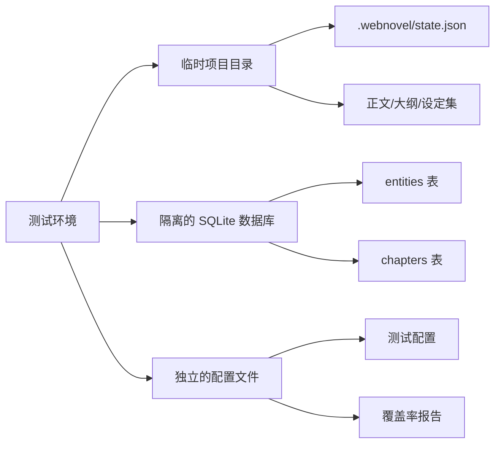

**图表来源**
- [test_new_apis.py:25-110](file://webnovel-writer/dashboard/tests/test_new_apis.py#L25-L110)

**章节来源**
- [pytest.ini:1-8](file://pytest.ini#L1-L8)
- [test_new_apis.py:13-18](file://webnovel-writer/dashboard/tests/test_new_apis.py#L13-L18)

## 结论

新增的 7 个 API 接口为 Webnovel Writer 项目提供了强大的项目管理能力和丰富的创作工具。通过全面的契约测试，确保了接口的稳定性和可靠性。

### 主要成就

1. **完整的 API 覆盖**：从基础数据查询到复杂项目管理操作的完整接口链
2. **严格的测试保障**：采用 TDD 方法，确保每个接口的功能正确性
3. **模块化架构设计**：清晰的服务层分离，便于维护和扩展
4. **前后端协同**：统一的 API 设计，确保前端和后端的一致性

### 未来发展方向

1. **性能优化**：进一步优化数据库查询和文件系统操作
2. **安全性增强**：加强输入验证和权限控制
3. **监控完善**：增加更详细的日志记录和性能指标
4. **文档扩展**：完善 API 文档和开发指南

这些新增的 API 为网络小说创作提供了坚实的技术基础，标志着项目从原型阶段向生产就绪阶段的重要转变。