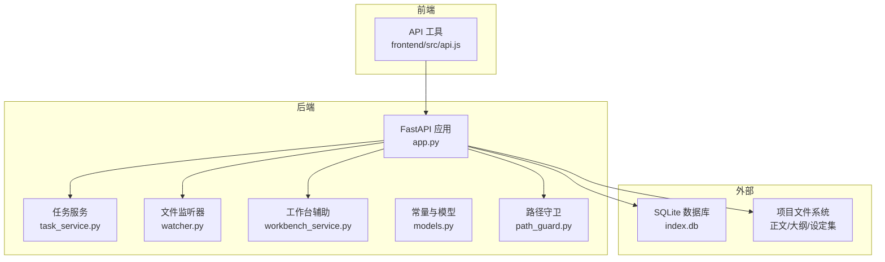
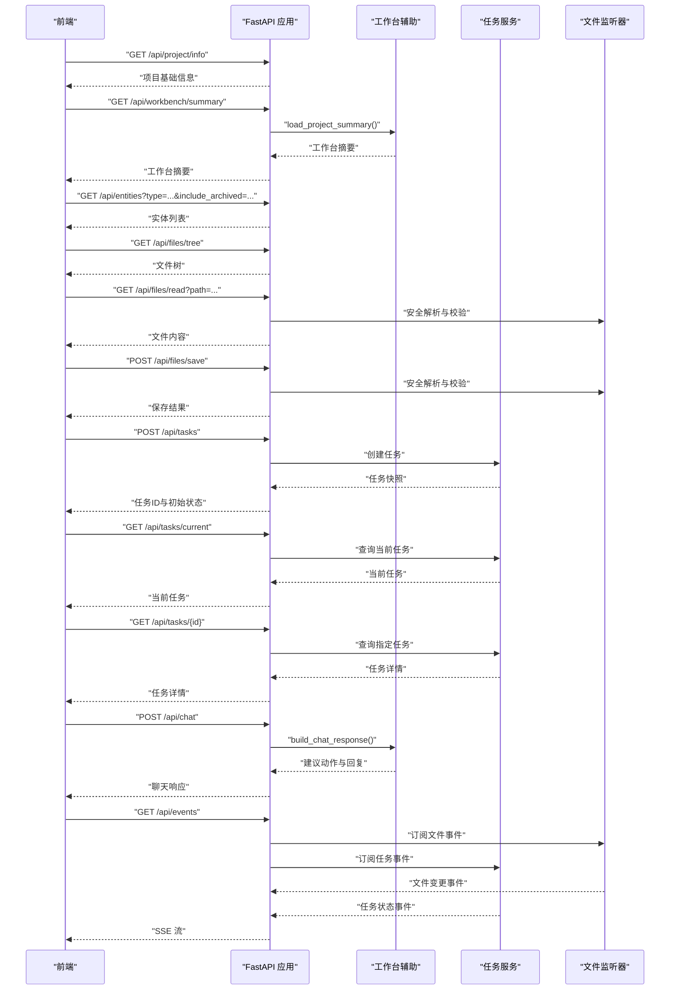
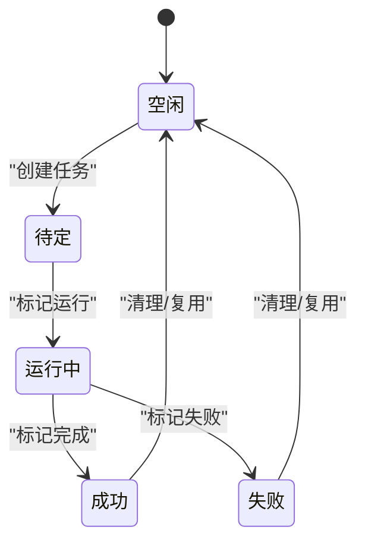
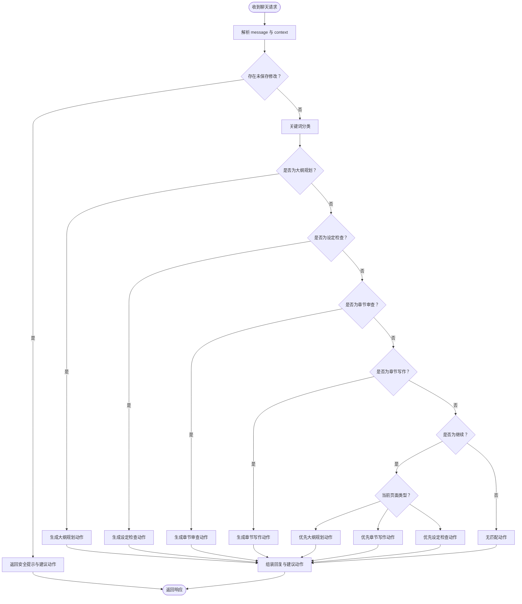
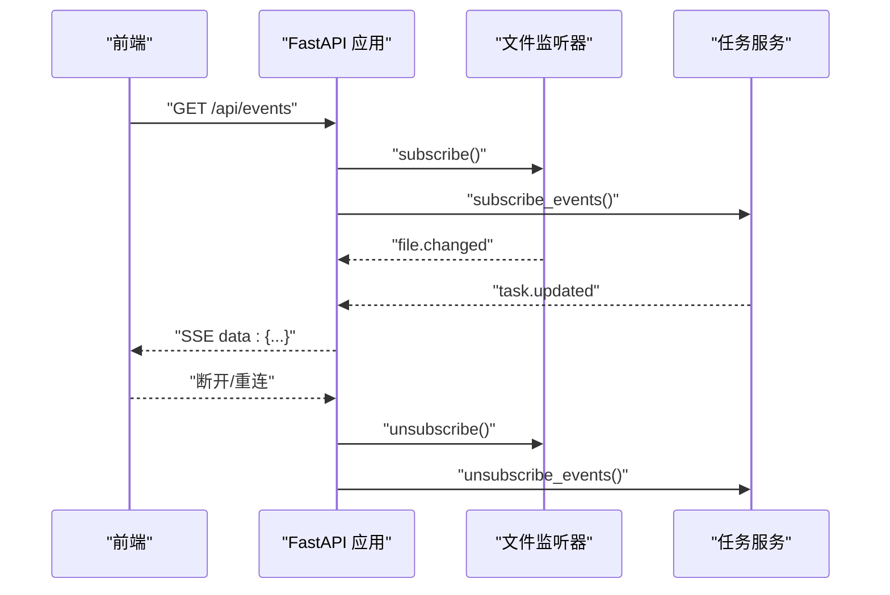
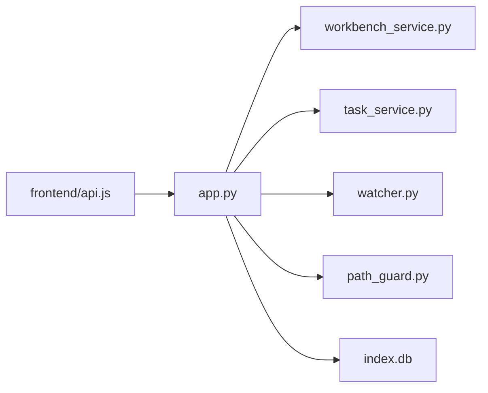

# API接口规范

<cite>
**本文引用的文件**
- [webnovel-writer/dashboard/app.py](file://webnovel-writer/dashboard/app.py)
- [webnovel-writer/dashboard/server.py](file://webnovel-writer/dashboard/server.py)
- [webnovel-writer/dashboard/task_service.py](file://webnovel-writer/dashboard/task_service.py)
- [webnovel-writer/dashboard/workbench_service.py](file://webnovel-writer/dashboard/workbench_service.py)
- [webnovel-writer/dashboard/models.py](file://webnovel-writer/dashboard/models.py)
- [webnovel-writer/dashboard/path_guard.py](file://webnovel-writer/dashboard/path_guard.py)
- [webnovel-writer/dashboard/watcher.py](file://webnovel-writer/dashboard/watcher.py)
- [webnovel-writer/dashboard/frontend/src/api.js](file://webnovel-writer/dashboard/frontend/src/api.js)
- [webnovel-writer/scripts/data_modules/api_client.py](file://webnovel-writer/scripts/data_modules/api_client.py)
</cite>

## 目录
1. [简介](#简介)
2. [项目结构](#项目结构)
3. [核心组件](#核心组件)
4. [架构总览](#架构总览)
5. [详细组件分析](#详细组件分析)
6. [依赖关系分析](#依赖关系分析)
7. [性能考虑](#性能考虑)
8. [故障排查指南](#故障排查指南)
9. [结论](#结论)
10. [附录](#附录)

## 简介
本文件为 Webnovel Writer 的 Web 工作台 API 接口规范参考文档，覆盖以下能力：
- 项目信息查询：返回工作台所需的基础项目信息与进度概览
- 实体数据库查询：对只读索引数据库 index.db 的统一查询接口
- 文件操作：树形目录浏览、只读读取、安全写入
- 任务管理：创建任务、查询任务、当前任务状态
- 聊天交互：基于自然语言的意图识别与建议动作
- 实时事件推送：文件变更与任务状态的 SSE 推送

同时，文档阐述认证机制（无内置认证）、错误处理策略、数据验证规则、版本兼容性与使用场景，并提供请求/响应示例、状态码说明、集成指南与测试用例。

## 项目结构
Web 工作台后端采用 FastAPI，提供 RESTful API 与 SSE；前端通过 EventSource 订阅实时事件；文件系统访问通过路径守卫进行安全校验；任务执行通过线程池异步调度。

图表来源
- [webnovel-writer/dashboard/app.py:50-489](file://webnovel-writer/dashboard/app.py#L50-L489)
- [webnovel-writer/dashboard/task_service.py:14-166](file://webnovel-writer/dashboard/task_service.py#L14-L166)
- [webnovel-writer/dashboard/watcher.py:40-95](file://webnovel-writer/dashboard/watcher.py#L40-L95)
- [webnovel-writer/dashboard/workbench_service.py:18-55](file://webnovel-writer/dashboard/workbench_service.py#L18-L55)
- [webnovel-writer/dashboard/models.py:3-22](file://webnovel-writer/dashboard/models.py#L3-L22)
- [webnovel-writer/dashboard/path_guard.py:11-28](file://webnovel-writer/dashboard/path_guard.py#L11-L28)
- [webnovel-writer/dashboard/frontend/src/api.js:1-78](file://webnovel-writer/dashboard/frontend/src/api.js#L1-L78)

章节来源
- [webnovel-writer/dashboard/app.py:50-489](file://webnovel-writer/dashboard/app.py#L50-L489)
- [webnovel-writer/dashboard/server.py:43-72](file://webnovel-writer/dashboard/server.py#L43-L72)

## 核心组件
- FastAPI 应用：集中定义所有 REST API 与 SSE 端点，负责路由、中间件与生命周期管理
- 任务服务：维护任务队列、状态机与事件分发，支持并发订阅
- 文件监听器：监控 .webnovel 关键文件变更并通过 SSE 推送
- 工作台辅助：汇总项目摘要、执行安全文件写入与聊天意图识别
- 路径守卫：防止路径穿越，限定文件访问范围
- 前端 API 工具：封装 GET/POST 与 SSE 订阅

章节来源
- [webnovel-writer/dashboard/app.py:50-489](file://webnovel-writer/dashboard/app.py#L50-L489)
- [webnovel-writer/dashboard/task_service.py:14-166](file://webnovel-writer/dashboard/task_service.py#L14-L166)
- [webnovel-writer/dashboard/watcher.py:40-95](file://webnovel-writer/dashboard/watcher.py#L40-L95)
- [webnovel-writer/dashboard/workbench_service.py:18-171](file://webnovel-writer/dashboard/workbench_service.py#L18-L171)
- [webnovel-writer/dashboard/path_guard.py:11-28](file://webnovel-writer/dashboard/path_guard.py#L11-L28)
- [webnovel-writer/dashboard/models.py:3-22](file://webnovel-writer/dashboard/models.py#L3-L22)
- [webnovel-writer/dashboard/frontend/src/api.js:1-78](file://webnovel-writer/dashboard/frontend/src/api.js#L1-L78)

## 架构总览
后端通过 FastAPI 提供统一入口，实体数据库查询走只读路径，文件读写受路径守卫约束，任务执行与文件变更通过事件总线推送至前端。

图表来源
- [webnovel-writer/dashboard/app.py:80-461](file://webnovel-writer/dashboard/app.py#L80-L461)
- [webnovel-writer/dashboard/workbench_service.py:74-162](file://webnovel-writer/dashboard/workbench_service.py#L74-L162)
- [webnovel-writer/dashboard/task_service.py:36-120](file://webnovel-writer/dashboard/task_service.py#L36-L120)
- [webnovel-writer/dashboard/watcher.py:63-77](file://webnovel-writer/dashboard/watcher.py#L63-L77)
- [webnovel-writer/dashboard/frontend/src/api.js:61-77](file://webnovel-writer/dashboard/frontend/src/api.js#L61-L77)

## 详细组件分析

### 项目信息与工作台摘要
- 端点
  - GET /api/project/info：返回 .webnovel/state.json 的完整内容（只读）
  - GET /api/workbench/summary：聚合项目标题、体裁、目标字数/章节数、进度与工作区统计
- 请求参数
  - 无
- 响应格式
  - 返回 JSON 对象，包含 pages、project、progress、workspace_roots、workspaces 等字段
- 使用场景
  - 初始化工作台界面、展示项目概览与进度

章节来源
- [webnovel-writer/dashboard/app.py:80-91](file://webnovel-writer/dashboard/app.py#L80-L91)
- [webnovel-writer/dashboard/workbench_service.py:18-55](file://webnovel-writer/dashboard/workbench_service.py#L18-L55)

### 实体数据库查询（index.db 只读）
- 端点
  - GET /api/entities：列出实体，支持按类型过滤与是否包含归档
  - GET /api/entities/{entity_id}：按 ID 查询实体
  - GET /api/relationships：按实体或全局查询关系，支持限制条数
  - GET /api/relationship-events：按实体与章节区间查询关系事件
  - GET /api/chapters：查询全部章节
  - GET /api/scenes：按章节或全局查询场景
  - GET /api/reading-power：查询阅读力指标
  - GET /api/review-metrics：查询评审指标
  - GET /api/state-changes：按实体或全局查询状态变更
  - GET /api/aliases：按实体或全局查询别名
  - GET /api/overrides、/api/debts、/api/debt-events、/api/invalid-facts、/api/rag-queries、/api/tool-stats、/api/checklist-scores：扩展表查询（v5.3+/v5.4+），支持状态过滤与限制条数
- 请求参数
  - 除路径参数外，多数端点支持 limit、status、entity、from_chapter、to_chapter 等查询参数
- 响应格式
  - 返回 JSON 数组或对象，字段与表结构一致
- 错误处理
  - index.db 不存在返回 404；表不存在时返回空数组（扩展表）
- 版本兼容性
  - 扩展表仅在 v5.3+ 或 v5.4+ 存在时可用

章节来源
- [webnovel-writer/dashboard/app.py:114-347](file://webnovel-writer/dashboard/app.py#L114-L347)

### 文件操作（只读浏览、安全读取、写入）
- 端点
  - GET /api/files/tree：返回“正文/大纲/设定集”三类目录树
  - GET /api/files/read：只读读取文件内容，路径受安全校验
  - POST /api/files/save：安全写入文件，仅允许写入三大目录
- 请求参数
  - read：path（字符串）
  - save：payload 包含 path、content（均为字符串）
- 响应格式
  - tree：返回各目录的树形结构
  - read：返回 { path, content }
  - save：返回 { path, saved_at, size }
- 安全机制
  - 所有文件访问均通过路径守卫校验，禁止逃逸 PROJECT_ROOT
  - 仅允许读取/写入“正文/大纲/设定集”目录
- 使用场景
  - 展示与编辑正文、大纲、设定集文件

章节来源
- [webnovel-writer/dashboard/app.py:352-394](file://webnovel-writer/dashboard/app.py#L352-L394)
- [webnovel-writer/dashboard/path_guard.py:11-28](file://webnovel-writer/dashboard/path_guard.py#L11-L28)
- [webnovel-writer/dashboard/workbench_service.py:58-71](file://webnovel-writer/dashboard/workbench_service.py#L58-L71)

### 任务管理
- 端点
  - GET /api/tasks/current：查询当前任务
  - POST /api/tasks：创建任务，合并上下文并注入项目根路径
  - GET /api/tasks/{task_id}：查询指定任务
- 请求参数
  - POST /api/tasks：payload 包含 action（对象，必填）与 context（对象，可选）
- 响应格式
  - 创建任务返回任务快照（包含 id、status、action、context、时间戳、日志、结果/错误）
  - 查询任务返回完整任务对象
- 任务状态
  - idle、pending、running、completed、failed、cancelled（部分状态）
- 使用场景
  - 异步执行规划、审查、写作、设定检查等动作

图表来源
- [webnovel-writer/dashboard/models.py:9-22](file://webnovel-writer/dashboard/models.py#L9-L22)
- [webnovel-writer/dashboard/task_service.py:66-120](file://webnovel-writer/dashboard/task_service.py#L66-L120)

章节来源
- [webnovel-writer/dashboard/app.py:395-419](file://webnovel-writer/dashboard/app.py#L395-L419)
- [webnovel-writer/dashboard/task_service.py:14-166](file://webnovel-writer/dashboard/task_service.py#L14-L166)
- [webnovel-writer/dashboard/models.py:3-22](file://webnovel-writer/dashboard/models.py#L3-L22)

### 聊天交互
- 端点
  - POST /api/chat：根据用户消息与上下文生成建议动作
- 请求参数
  - payload 包含 message（字符串，必填）与 context（对象，可选）
- 响应格式
  - 返回 { reply, suggested_actions, reason, scope }
  - 若检测到未保存修改，返回安全提示与建议动作列表
- 使用场景
  - 通过自然语言触发大纲规划、设定检查、章节审查、章节写作等动作

图表来源
- [webnovel-writer/dashboard/workbench_service.py:74-162](file://webnovel-writer/dashboard/workbench_service.py#L74-L162)

章节来源
- [webnovel-writer/dashboard/app.py:420-429](file://webnovel-writer/dashboard/app.py#L420-L429)
- [webnovel-writer/dashboard/workbench_service.py:74-162](file://webnovel-writer/dashboard/workbench_service.py#L74-L162)

### 实时事件推送（SSE）
- 端点
  - GET /api/events：Server-Sent Events，推送文件变更与任务状态
- 事件类型
  - file.changed：文件变更事件，包含文件名、变更类型与时间戳
  - task.updated：任务状态更新事件，包含任务ID与任务快照
- 使用场景
  - 前端自动刷新数据、跟踪任务执行进度

图表来源
- [webnovel-writer/dashboard/app.py:434-461](file://webnovel-writer/dashboard/app.py#L434-L461)
- [webnovel-writer/dashboard/watcher.py:50-77](file://webnovel-writer/dashboard/watcher.py#L50-L77)
- [webnovel-writer/dashboard/task_service.py:25-34](file://webnovel-writer/dashboard/task_service.py#L25-L34)

章节来源
- [webnovel-writer/dashboard/app.py:434-461](file://webnovel-writer/dashboard/app.py#L434-L461)
- [webnovel-writer/dashboard/watcher.py:40-95](file://webnovel-writer/dashboard/watcher.py#L40-L95)
- [webnovel-writer/dashboard/task_service.py:14-166](file://webnovel-writer/dashboard/task_service.py#L14-L166)

## 依赖关系分析
- 组件耦合
  - app.py 作为入口，依赖工作台辅助、任务服务、文件监听器与路径守卫
  - 任务服务与文件监听器通过事件队列与异步循环解耦
- 外部依赖
  - SQLite：index.db 只读查询
  - watchdog：文件系统事件监听
  - FastAPI：路由与中间件
  - 前端 EventSource：SSE 客户端

图表来源
- [webnovel-writer/dashboard/app.py:20-24](file://webnovel-writer/dashboard/app.py#L20-L24)
- [webnovel-writer/dashboard/task_service.py:10-11](file://webnovel-writer/dashboard/task_service.py#L10-L11)
- [webnovel-writer/dashboard/watcher.py:14-15](file://webnovel-writer/dashboard/watcher.py#L14-L15)
- [webnovel-writer/dashboard/frontend/src/api.js:61-77](file://webnovel-writer/dashboard/frontend/src/api.js#L61-L77)

章节来源
- [webnovel-writer/dashboard/app.py:20-24](file://webnovel-writer/dashboard/app.py#L20-L24)

## 性能考虑
- 并发与限流
  - 任务服务使用线程池与锁保证并发安全，最大订阅队列容量控制内存占用
  - SSE 订阅队列设置上限，超限自动移除死订阅
- I/O 优化
  - 实体查询统一走只读连接，Row 工厂便于序列化
  - 文件读取对二进制文件返回占位信息，避免大文件阻塞
- 网络与缓存
  - SSE 自动重连，前端无需手动处理断线
  - 建议前端对高频查询做本地缓存与去抖

## 故障排查指南
- 404：index.db 或 state.json 不存在
  - 检查 .webnovel 目录完整性
- 404：文件不存在或路径越界
  - 确认路径在“正文/大纲/设定集”范围内，使用安全解析
- 403：路径越界或禁止写入
  - 禁止访问 PROJECT_ROOT 之外的文件；仅允许写入三大目录
- 400：请求体参数类型错误
  - 确保 message、path、content 为字符串，action/context 为对象
- SSE 不接收事件
  - 检查浏览器网络面板与 EventSource 连接状态，确认后端未关闭队列

章节来源
- [webnovel-writer/dashboard/app.py:84-86](file://webnovel-writer/dashboard/app.py#L84-L86)
- [webnovel-writer/dashboard/app.py:96-102](file://webnovel-writer/dashboard/app.py#L96-L102)
- [webnovel-writer/dashboard/app.py:376-377](file://webnovel-writer/dashboard/app.py#L376-L377)
- [webnovel-writer/dashboard/app.py:388-393](file://webnovel-writer/dashboard/app.py#L388-L393)
- [webnovel-writer/dashboard/app.py:403-406](file://webnovel-writer/dashboard/app.py#L403-L406)
- [webnovel-writer/dashboard/path_guard.py:20-26](file://webnovel-writer/dashboard/path_guard.py#L20-L26)

## 结论
本规范覆盖了 Webnovel Writer 工作台的核心 API，强调只读查询、安全文件访问、异步任务与实时事件推送。通过路径守卫与严格的参数校验，保障系统安全性与稳定性。建议在生产环境结合反向代理与鉴权网关增强安全防护。

## 附录

### 认证机制
- 无内置认证：所有端点默认开放
- 建议在网关层添加鉴权与速率限制

### 错误处理策略
- 明确的 HTTP 状态码与错误信息
- 对数据库与文件系统的异常进行捕获与转换
- SSE 订阅队列满时自动清理无效订阅

### 数据验证规则
- 字符串参数必须为字符串类型
- 对象参数必须为 JSON 对象
- 路径参数必须通过安全解析与目录白名单校验

### 版本兼容性
- 扩展表接口仅在 v5.3+ 或 v5.4+ 可用
- index.db 表结构变化时，查询逻辑具备容错（表不存在返回空）

### 请求/响应示例与状态码
- 示例
  - GET /api/project/info：返回 state.json 内容
  - GET /api/workbench/summary：返回 pages、project、progress、workspaces 等
  - GET /api/entities?type=character&include_archived=false：返回实体列表
  - GET /api/files/read?path=正文/01.md：返回 { path, content }
  - POST /api/files/save：返回 { path, saved_at, size }
  - POST /api/tasks：返回任务快照
  - POST /api/chat：返回 { reply, suggested_actions, reason, scope }
  - GET /api/events：SSE 流，推送 file.changed 与 task.updated
- 状态码
  - 200：成功
  - 400：参数错误
  - 403：路径越界或权限不足
  - 404：资源不存在
  - 500：服务器内部错误

### 使用场景演示
- 初始化工作台：调用 /api/project/info 与 /api/workbench/summary
- 查看实体：调用 /api/entities 列表与 /api/entities/{id}
- 编辑文件：先读取 /api/files/read，再写入 /api/files/save
- 执行动作：POST /api/chat 获取建议动作，再 POST /api/tasks 创建任务
- 实时同步：GET /api/events 订阅文件与任务事件

### API 集成指南
- 后端启动
  - 使用 dashboard/server.py 指定项目根目录、主机与端口
  - 默认监听 127.0.0.1:8765，自动打开浏览器并指向 /docs
- 前端接入
  - 使用 frontend/src/api.js 中的工具函数封装请求
  - 通过 EventSource 订阅 /api/events，处理 file.changed 与 task.updated
- 任务执行
  - 创建任务后轮询 /api/tasks/{id} 获取结果
  - 或订阅 SSE 获取实时状态

章节来源
- [webnovel-writer/dashboard/server.py:43-72](file://webnovel-writer/dashboard/server.py#L43-L72)
- [webnovel-writer/dashboard/frontend/src/api.js:1-78](file://webnovel-writer/dashboard/frontend/src/api.js#L1-L78)

### 客户端实现模板
- JavaScript（Fetch + EventSource）
  - 参考路径：[webnovel-writer/dashboard/frontend/src/api.js:7-77](file://webnovel-writer/dashboard/frontend/src/api.js#L7-L77)
- Python（requests + sseclient）
  - 参考路径：[webnovel-writer/scripts/data_modules/api_client.py:1-496](file://webnovel-writer/scripts/data_modules/api_client.py#L1-L496)

### 测试用例
- 单元测试
  - 实体查询：覆盖表存在/不存在、过滤条件与排序
  - 文件安全：路径越界、非文本文件读取
  - 任务状态：创建、运行、完成、失败
  - SSE：事件推送与断线重连
- 端到端测试
  - 工作台摘要：聚合项目信息与进度
  - 聊天意图：关键词匹配与动作建议
  - 文件树：三大目录遍历与大小统计

章节来源
- [webnovel-writer/dashboard/app.py:114-347](file://webnovel-writer/dashboard/app.py#L114-L347)
- [webnovel-writer/dashboard/path_guard.py:11-28](file://webnovel-writer/dashboard/path_guard.py#L11-L28)
- [webnovel-writer/dashboard/task_service.py:66-120](file://webnovel-writer/dashboard/task_service.py#L66-L120)
- [webnovel-writer/dashboard/workbench_service.py:18-55](file://webnovel-writer/dashboard/workbench_service.py#L18-L55)
- [webnovel-writer/dashboard/watcher.py:63-77](file://webnovel-writer/dashboard/watcher.py#L63-L77)
- [webnovel-writer/dashboard/frontend/src/api.js:61-77](file://webnovel-writer/dashboard/frontend/src/api.js#L61-L77)