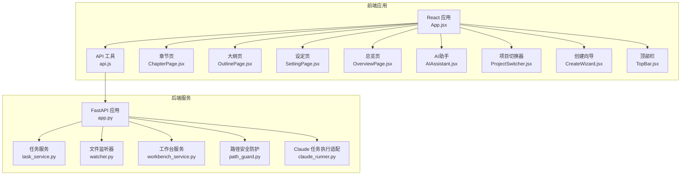
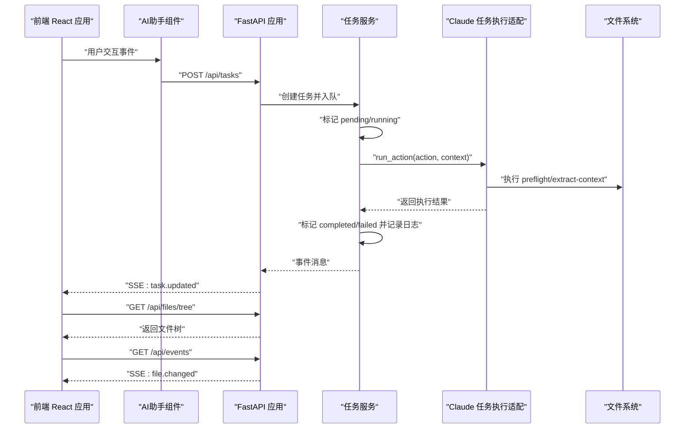
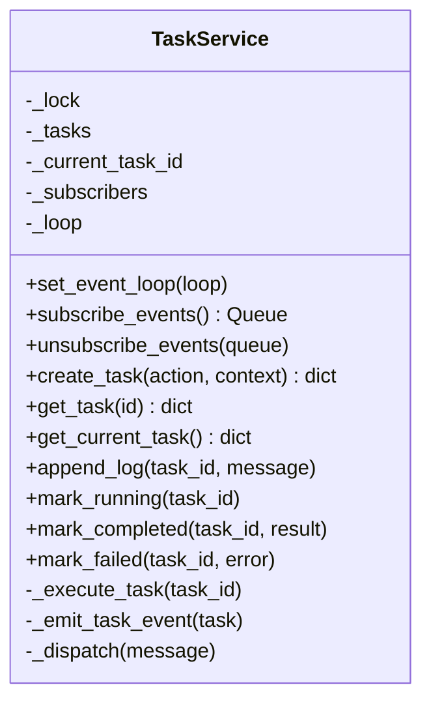
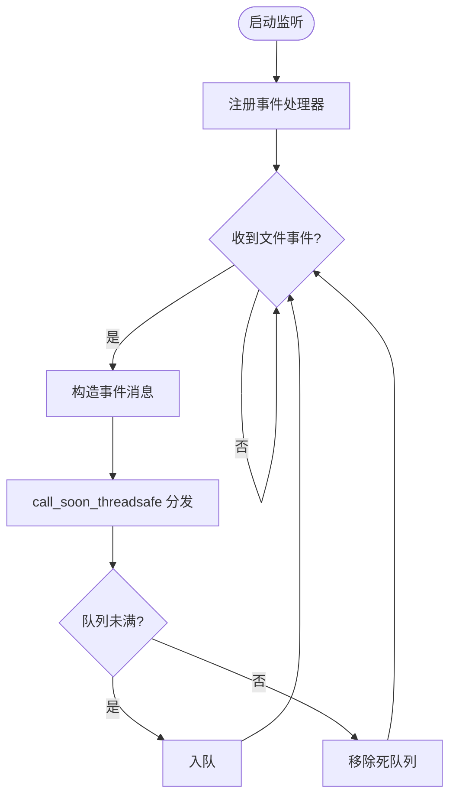
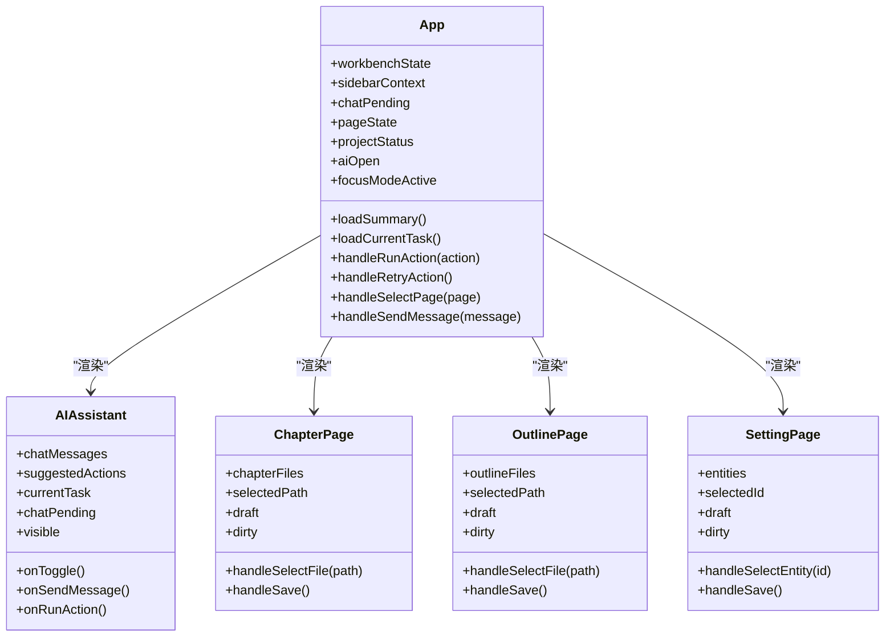
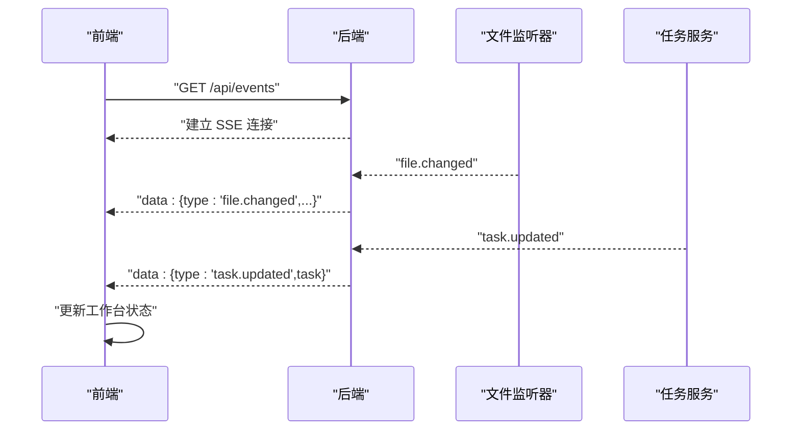
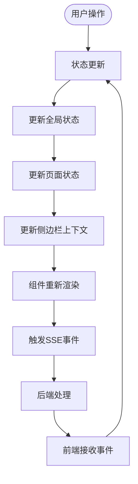
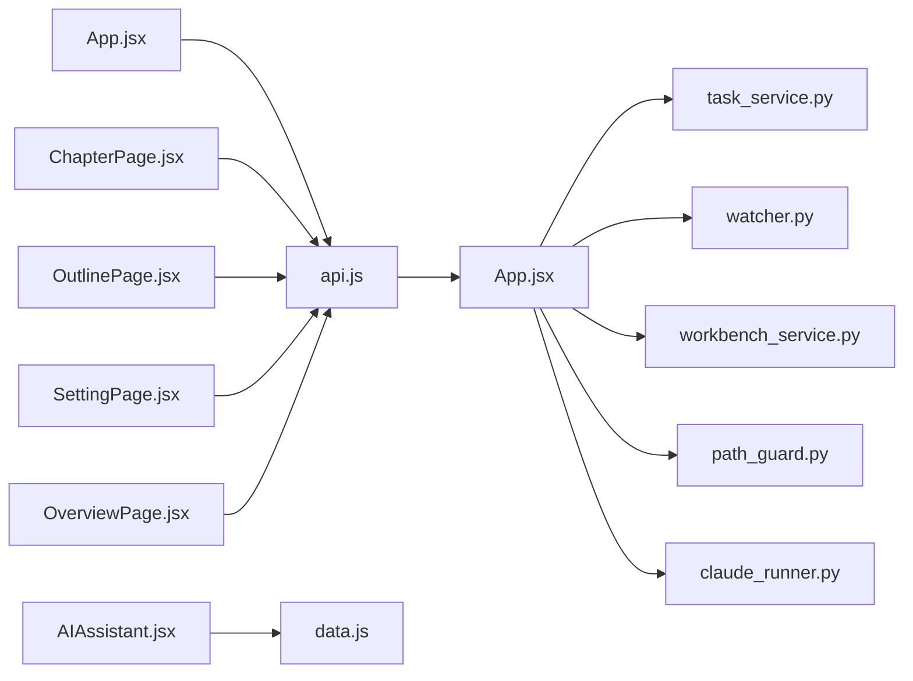

# 写作工作台

<cite>
**本文引用的文件**
- [README.md](file://README.md)
- [app.py](file://webnovel-writer/dashboard/app.py)
- [server.py](file://webnovel-writer/dashboard/server.py)
- [workbench_service.py](file://webnovel-writer/dashboard/workbench_service.py)
- [task_service.py](file://webnovel-writer/dashboard/task_service.py)
- [models.py](file://webnovel-writer/dashboard/models.py)
- [watcher.py](file://webnovel-writer/dashboard/watcher.py)
- [path_guard.py](file://webnovel-writer/dashboard/path_guard.py)
- [claude_runner.py](file://webnovel-writer/dashboard/claude_runner.py)
- [api.js](file://webnovel-writer/dashboard/frontend/src/api.js)
- [App.jsx](file://webnovel-writer/dashboard/frontend/src/App.jsx)
- [AIAssistant.jsx](file://webnovel-writer/dashboard/frontend/src/workbench/AIAssistant.jsx)
- [ChapterPage.jsx](file://webnovel-writer/dashboard/frontend/src/workbench/ChapterPage.jsx)
- [OutlinePage.jsx](file://webnovel-writer/dashboard/frontend/src/workbench/OutlinePage.jsx)
- [SettingPage.jsx](file://webnovel-writer/dashboard/frontend/src/workbench/SettingPage.jsx)
- [OverviewPage.jsx](file://webnovel-writer/dashboard/frontend/src/workbench/OverviewPage.jsx)
- [TopBar.jsx](file://webnovel-writer/dashboard/frontend/src/workbench/TopBar.jsx)
- [ProjectSwitcher.jsx](file://webnovel-writer/dashboard/frontend/src/workbench/ProjectSwitcher.jsx)
- [CreateWizard.jsx](file://webnovel-writer/dashboard/frontend/src/workbench/CreateWizard.jsx)
- [data.js](file://webnovel-writer/dashboard/frontend/src/workbench/data.js)
- [main.jsx](file://webnovel-writer/dashboard/frontend/src/main.jsx)
</cite>

## 更新摘要
**所做更改**
- 更新了前端架构重大重构部分，重点介绍AI助手组件替代原有RightSidebar和OnboardingGuide
- 新增了App.jsx重构为工作台主架构的详细说明
- 增加了多种页面状态管理的架构分析
- 更新了组件关系图和状态管理流程图
- 补充了新的对话框组件和向导组件说明

## 目录
1. [引言](#引言)
2. [项目结构](#项目结构)
3. [核心组件](#核心组件)
4. [架构总览](#架构总览)
5. [详细组件分析](#详细组件分析)
6. [依赖分析](#依赖分析)
7. [性能考虑](#性能考虑)
8. [故障排除指南](#故障排除指南)
9. [结论](#结论)
10. [附录](#附录)

## 引言
本技术文档面向 Webnovel Writer 写作工作台，系统化阐述前后端一体化架构、实时协作（SSE）机制、任务调度与事件处理、以及用户界面设计与数据绑定。文档覆盖项目概览、章节管理、大纲规划、设定集管理等核心功能模块的实现原理，并提供 API 接口规范、前端 React 组件架构、状态同步策略与错误处理方案，帮助开发者快速理解与扩展工作台功能。

**更新** 本次更新重点关注前端架构的重大重构：AI助手组件完全替代原有的RightSidebar和OnboardingGuide，App.jsx重构为工作台主架构，新增多种页面状态管理机制。

## 项目结构
工作台由后端 FastAPI 服务与前端 React SPA 组成，二者通过 REST API 与 Server-Sent Events 实时通信。后端负责：
- 项目元信息与工作台摘要
- 实体数据库只读查询
- 文件树浏览与只读/可写文件操作
- 任务创建与生命周期管理
- SSE 事件推送（文件变更与任务状态）

前端负责：
- 页面路由与状态管理
- 数据绑定与用户交互
- SSE 订阅与状态同步
- 任务执行与聊天助手

**图表来源**
- [app.py:1-490](file://webnovel-writer/dashboard/app.py#L1-L490)
- [task_service.py:1-166](file://webnovel-writer/dashboard/task_service.py#L1-L166)
- [watcher.py:1-95](file://webnovel-writer/dashboard/watcher.py#L1-L95)
- [workbench_service.py:1-171](file://webnovel-writer/dashboard/workbench_service.py#L1-L171)
- [path_guard.py:1-29](file://webnovel-writer/dashboard/path_guard.py#L1-L29)
- [claude_runner.py:1-142](file://webnovel-writer/dashboard/claude_runner.py#L1-L142)
- [api.js:1-78](file://webnovel-writer/dashboard/frontend/src/api.js#L1-L78)
- [App.jsx:1-600](file://webnovel-writer/dashboard/frontend/src/App.jsx#L1-L600)
- [AIAssistant.jsx:1-186](file://webnovel-writer/dashboard/frontend/src/workbench/AIAssistant.jsx#L1-L186)
- [ChapterPage.jsx:1-200](file://webnovel-writer/dashboard/frontend/src/workbench/ChapterPage.jsx#L1-L200)
- [OutlinePage.jsx:1-200](file://webnovel-writer/dashboard/frontend/src/workbench/OutlinePage.jsx#L1-L200)
- [SettingPage.jsx:1-200](file://webnovel-writer/dashboard/frontend/src/workbench/SettingPage.jsx#L1-L200)
- [OverviewPage.jsx:1-200](file://webnovel-writer/dashboard/frontend/src/workbench/OverviewPage.jsx#L1-L200)
- [TopBar.jsx:1-35](file://webnovel-writer/dashboard/frontend/src/workbench/TopBar.jsx#L1-L35)
- [ProjectSwitcher.jsx:1-68](file://webnovel-writer/dashboard/frontend/src/workbench/ProjectSwitcher.jsx#L1-L68)
- [CreateWizard.jsx:1-309](file://webnovel-writer/dashboard/frontend/src/workbench/CreateWizard.jsx#L1-L309)

**章节来源**
- [README.md:1-170](file://README.md#L1-L170)
- [server.py:1-72](file://webnovel-writer/dashboard/server.py#L1-L72)

## 核心组件
- 后端应用与路由：提供项目信息、实体查询、文件读写、任务管理、聊天与 SSE 事件端点。
- 任务服务：线程池执行外部 CLI 动作，维护任务生命周期并通过事件队列广播状态。
- 文件监听器：基于 watchdog 监控 .webnovel 关键文件变更，通过 SSE 推送事件。
- 工作台服务：计算工作台摘要、保存工作区文件、构建聊天建议动作。
- 前端 React 应用：页面模型驱动、SSE 订阅、任务执行、文件读写与状态同步。
- 路径安全：统一的路径解析与越界校验，防止任意文件访问。
- Claude 任务执行适配：将前端动作映射为项目 CLI 命令链，封装 preflight 与上下文提取。

**更新** 前端架构重构后，核心组件包括：
- App.jsx 作为工作台主架构，统一管理所有页面状态和组件协调
- AIAssistant.jsx 替代原有 RightSidebar 和 OnboardingGuide，提供智能对话和任务执行
- 多种页面状态管理：sidebarContext、pageState、projectStatus 等
- 新增对话框组件：ConflictDialog、UnsavedChangesDialog
- CreateWizard.jsx 作为项目创建向导

**章节来源**
- [app.py:76-490](file://webnovel-writer/dashboard/app.py#L76-L490)
- [task_service.py:14-166](file://webnovel-writer/dashboard/task_service.py#L14-L166)
- [watcher.py:40-95](file://webnovel-writer/dashboard/watcher.py#L40-L95)
- [workbench_service.py:18-171](file://webnovel-writer/dashboard/workbench_service.py#L18-L171)
- [path_guard.py:11-29](file://webnovel-writer/dashboard/path_guard.py#L11-L29)
- [claude_runner.py:13-142](file://webnovel-writer/dashboard/claude_runner.py#L13-L142)
- [api.js:1-78](file://webnovel-writer/dashboard/frontend/src/api.js#L1-L78)
- [App.jsx:1-600](file://webnovel-writer/dashboard/frontend/src/App.jsx#L1-L600)
- [AIAssistant.jsx:1-186](file://webnovel-writer/dashboard/frontend/src/workbench/AIAssistant.jsx#L1-L186)

## 架构总览
工作台采用"后端 API + 前端 SPA"的前后端一体化模式。后端以 FastAPI 提供 REST API 与 SSE，前端通过 EventSource 订阅实时事件，实现文件变更与任务状态的即时同步。任务执行通过线程池异步触发外部 CLI，保证 UI 流畅与可观测性。

**更新** 架构重构后的特点：
- App.jsx 作为单一入口点，集中管理所有工作台状态
- AIAssistant.jsx 作为浮动助手，提供智能对话和任务执行
- 多层状态管理：全局状态（workbenchState）、页面状态（pageState）、项目状态（projectStatus）
- 组件间通过 props 和回调函数进行解耦通信

**图表来源**
- [app.py:395-461](file://webnovel-writer/dashboard/app.py#L395-L461)
- [task_service.py:36-143](file://webnovel-writer/dashboard/task_service.py#L36-L143)
- [claude_runner.py:13-112](file://webnovel-writer/dashboard/claude_runner.py#L13-L112)
- [api.js:43-77](file://webnovel-writer/dashboard/frontend/src/api.js#L43-L77)
- [App.jsx:177-244](file://webnovel-writer/dashboard/frontend/src/App.jsx#L177-L244)

## 详细组件分析

### 后端应用与路由（FastAPI）
- 项目信息与工作台摘要：读取 .webnovel/state.json 返回项目概览与进度。
- 实体数据库查询：对 index.db 提供只读查询接口，支持按类型、章节范围筛选。
- 文件浏览与读写：提供文件树、只读读取与保存接口，均经路径安全校验。
- 任务管理：创建任务、查询当前任务、按 ID 查询任务。
- 聊天助手：根据用户消息与上下文生成建议动作。
- SSE 事件：聚合文件变更与任务事件，统一推送至前端。

**章节来源**
- [app.py:80-461](file://webnovel-writer/dashboard/app.py#L80-L461)

### 任务服务（TaskService）
- 任务生命周期：pending → running → completed 或 failed，维护日志与时间戳。
- 线程池执行：后台线程执行外部 CLI，主线程通过事件循环安全分发事件。
- 事件订阅：支持多客户端订阅，自动清理阻塞队列。
- 错误处理：捕获异常并标记失败，保留最近 200 条日志。

**图表来源**
- [task_service.py:14-166](file://webnovel-writer/dashboard/task_service.py#L14-L166)

**章节来源**
- [task_service.py:14-166](file://webnovel-writer/dashboard/task_service.py#L14-L166)

### 文件监听器（FileWatcher）
- 监控 .webnovel 目录关键文件（state.json、index.db、workflow_state.json）变更。
- 通过 watchdog 事件回调，将变更事件投递到事件循环，再分发到订阅队列。
- 支持订阅/取消订阅，自动清理阻塞队列。

**图表来源**
- [watcher.py:40-95](file://webnovel-writer/dashboard/watcher.py#L40-L95)

**章节来源**
- [watcher.py:18-95](file://webnovel-writer/dashboard/watcher.py#L18-L95)

### 工作台服务（WorkbenchService）
- 工作台摘要：统计各工作区文件数量、项目标题与目标，汇总进度信息。
- 文件保存：安全解析路径，仅允许写入正文/大纲/设定集目录，返回保存元信息。
- 聊天建议：根据关键词识别动作类型（规划/设定/审查/写作），并给出理由与作用域。

**章节来源**
- [workbench_service.py:18-171](file://webnovel-writer/dashboard/workbench_service.py#L18-L171)

### 路径安全（PathGuard）
- 解析相对路径为绝对路径，严格校验不得逃逸项目根目录。
- 对非法路径与越界访问统一抛出 403。

**章节来源**
- [path_guard.py:11-29](file://webnovel-writer/dashboard/path_guard.py#L11-L29)

### Claude 任务执行适配（ClaudeRunner）
- 适配现有 CLI：统一 preflight 校验，章节类动作附加 extract-context，其余动作进行路径校验。
- 章节号解析：从路径中提取章节编号，用于上下文提取。
- 结果封装：返回成功/失败、标准输出、标准错误与结果摘要。

**章节来源**
- [claude_runner.py:13-142](file://webnovel-writer/dashboard/claude_runner.py#L13-L142)

### 前端 React 组件架构
**更新** 前端架构经过重大重构，主要变化：

#### App.jsx - 工作台主架构
- **单一状态管理**：集中管理 workbenchState、sidebarContext、chatPending 等核心状态
- **页面状态管理**：pageState 对每个页面单独管理 selectedPath 和 dirty 状态
- **项目状态管理**：projectStatus、projectInfo、projects 等项目级状态
- **对话框管理**：conflictDialog、unsavedDialog 等用户交互状态
- **组件协调**：通过 props 和回调函数协调各个子组件

#### AIAssistant.jsx - 智能助手组件
- **浮动对话框**：替代原有 RightSidebar 和 OnboardingGuide
- **聊天功能**：支持自然语言对话，自动生成建议动作
- **任务执行**：直接执行用户选择的动作，无需额外确认
- **状态显示**：实时显示当前任务状态和日志

#### 新增对话框组件
- **ConflictDialog**：文件冲突处理对话框
- **UnsavedChangesDialog**：未保存修改确认对话框

**图表来源**
- [App.jsx:73-600](file://webnovel-writer/dashboard/frontend/src/App.jsx#L73-L600)
- [AIAssistant.jsx:4-186](file://webnovel-writer/dashboard/frontend/src/workbench/AIAssistant.jsx#L4-L186)
- [ChapterPage.jsx:21-200](file://webnovel-writer/dashboard/frontend/src/workbench/ChapterPage.jsx#L21-L200)
- [OutlinePage.jsx:19-200](file://webnovel-writer/dashboard/frontend/src/workbench/OutlinePage.jsx#L19-L200)
- [SettingPage.jsx:5-200](file://webnovel-writer/dashboard/frontend/src/workbench/SettingPage.jsx#L5-L200)

**章节来源**
- [App.jsx:1-600](file://webnovel-writer/dashboard/frontend/src/App.jsx#L1-L600)
- [AIAssistant.jsx:1-186](file://webnovel-writer/dashboard/frontend/src/workbench/AIAssistant.jsx#L1-L186)
- [ChapterPage.jsx:1-200](file://webnovel-writer/dashboard/frontend/src/workbench/ChapterPage.jsx#L1-L200)
- [OutlinePage.jsx:1-200](file://webnovel-writer/dashboard/frontend/src/workbench/OutlinePage.jsx#L1-L200)
- [SettingPage.jsx:1-200](file://webnovel-writer/dashboard/frontend/src/workbench/SettingPage.jsx#L1-L200)

### SSE 事件推送机制
- 事件源：文件变更（state.json/index.db/workflow_state.json）与任务状态变更。
- 订阅方式：前端使用 EventSource 订阅 /api/events，自动重连。
- 事件类型：file.changed、task.updated，前端据此刷新摘要与任务面板。

**图表来源**
- [app.py:434-461](file://webnovel-writer/dashboard/app.py#L434-L461)
- [watcher.py:63-78](file://webnovel-writer/dashboard/watcher.py#L63-L78)
- [task_service.py:144-155](file://webnovel-writer/dashboard/task_service.py#L144-L155)

**章节来源**
- [app.py:434-461](file://webnovel-writer/dashboard/app.py#L434-L461)

### API 接口规范
- 项目信息
  - GET /api/project/info：返回 state.json 内容
  - GET /api/workbench/summary：返回工作台摘要
- 实体与索引
  - GET /api/entities、/api/entities/{id}
  - GET /api/relationships、/api/relationship-events
  - GET /api/chapters、/api/scenes
  - GET /api/reading-power、/api/review-metrics
  - GET /api/state-changes、/api/aliases
  - GET /api/overrides、/api/debts、/api/debt-events
  - GET /api/invalid-facts、/api/rag-queries、/api/tool-stats、/api/checklist-scores
- 文件浏览与读写
  - GET /api/files/tree：返回正文/大纲/设定集树
  - GET /api/files/read：只读读取指定文件
  - POST /api/files/save：保存文件（受路径安全限制）
- 任务与聊天
  - GET /api/tasks/current：当前任务
  - POST /api/tasks：创建任务
  - GET /api/tasks/{id}：查询任务
  - POST /api/chat：聊天助手，返回建议动作
- SSE
  - GET /api/events：实时事件流

**章节来源**
- [app.py:80-461](file://webnovel-writer/dashboard/app.py#L80-L461)

### 状态管理架构
**更新** 新增的状态管理机制：

#### 多层次状态管理
- **全局状态**：workbenchState（页面、摘要、当前任务、聊天消息）
- **页面状态**：pageState（每个页面独立的 selectedPath 和 dirty 状态）
- **上下文状态**：sidebarContext（当前页面上下文）
- **项目状态**：projectStatus、projectInfo、projects（项目级状态）
- **对话框状态**：conflictDialog、unsavedDialog（用户交互状态）

#### 状态更新流程

**图表来源**
- [App.jsx:121-130](file://webnovel-writer/dashboard/frontend/src/App.jsx#L121-L130)
- [App.jsx:265-267](file://webnovel-writer/dashboard/frontend/src/App.jsx#L265-L267)
- [App.jsx:440-444](file://webnovel-writer/dashboard/frontend/src/App.jsx#L440-L444)

**章节来源**
- [App.jsx:89-118](file://webnovel-writer/dashboard/frontend/src/App.jsx#L89-L118)
- [App.jsx:121-130](file://webnovel-writer/dashboard/frontend/src/App.jsx#L121-L130)
- [App.jsx:265-267](file://webnovel-writer/dashboard/frontend/src/App.jsx#L265-L267)
- [App.jsx:440-444](file://webnovel-writer/dashboard/frontend/src/App.jsx#L440-L444)

## 依赖分析
- 组件耦合
  - app.py 作为统一入口，依赖 task_service、watcher、workbench_service、path_guard、claude_runner。
  - 前端通过 api.js 调用后端 API，订阅 SSE。
  - App.jsx 作为中心协调者，依赖所有子组件和工具函数。
- 外部依赖
  - watchdog：文件系统事件监听
  - sqlite3：只读查询 index.db
  - FastAPI/uvicorn：HTTP 服务器与 SSE
  - EventSource：前端 SSE 客户端

**更新** 重构后的依赖关系更加清晰：
- App.jsx 依赖所有页面组件和工具函数
- AIAssistant.jsx 依赖 data.js 中的状态管理函数
- 各页面组件相互独立，通过 App.jsx 协调

**图表来源**
- [app.py:20-24](file://webnovel-writer/dashboard/app.py#L20-L24)
- [api.js:1-78](file://webnovel-writer/dashboard/frontend/src/api.js#L1-L78)
- [App.jsx:1-31](file://webnovel-writer/dashboard/frontend/src/App.jsx#L1-L31)
- [AIAssistant.jsx:1-25](file://webnovel-writer/dashboard/frontend/src/workbench/AIAssistant.jsx#L1-L25)

**章节来源**
- [app.py:20-24](file://webnovel-writer/dashboard/app.py#L20-L24)

## 性能考虑
- SSE 队列容量：任务与文件事件队列均设置上限，避免内存膨胀；超过容量的订阅会被清理。
- 事件合并：前端在收到任务更新时批量更新 UI，减少重渲染次数。
- 只读查询：数据库查询封装异常处理，表不存在时返回空列表，避免中断。
- 路径安全：统一解析与校验，避免无效 IO 与潜在攻击。
- 任务执行：后台线程执行 CLI，主线程仅负责事件分发，保证响应性。
- **更新** 状态管理优化：App.jsx 集中管理状态，减少组件间重复状态，提高性能。

## 故障排除指南
- 项目根未配置
  - 现象：/api/project/info 返回 500
  - 处理：通过启动参数或环境变量设置项目根目录
- index.db 不存在
  - 现象：实体查询返回 404
  - 处理：确认项目已完成初始化并生成索引
- 文件保存失败
  - 现象：/api/files/save 返回 403 或 404
  - 处理：检查路径是否在正文/大纲/设定集目录内，文件是否存在
- 任务执行失败
  - 现象：任务状态为 failed，日志中包含错误信息
  - 处理：查看任务日志，确认 preflight 与 extract-context 是否成功
- SSE 连接断开
  - 现象：前端显示离线状态
  - 处理：检查后端日志与网络连通性，EventSource 会自动重连
- **更新** AI助手无响应
  - 现象：AI助手无法打开或无响应
  - 处理：检查网络连接，确认后端聊天接口正常，重启浏览器缓存

**章节来源**
- [app.py:80-113](file://webnovel-writer/dashboard/app.py#L80-L113)
- [path_guard.py:11-29](file://webnovel-writer/dashboard/path_guard.py#L11-L29)
- [task_service.py:110-143](file://webnovel-writer/dashboard/task_service.py#L110-L143)
- [api.js:61-77](file://webnovel-writer/dashboard/frontend/src/api.js#L61-L77)

## 结论
写作工作台通过前后端一体化架构实现了高效、可观测的长篇创作协同环境。后端以 FastAPI 提供稳定的 API 与 SSE，前端以 React 驱动的页面模型实现流畅的交互体验。路径安全、任务生命周期与事件推送机制共同保障了系统的可靠性与可扩展性。

**更新** 本次前端架构重构显著提升了用户体验：
- AI助手组件提供智能化的创作辅助
- 集中式状态管理提高了代码可维护性
- 多层次页面状态管理增强了用户体验
- 浮动对话框设计更加符合现代交互习惯

开发者可在此基础上进一步增强任务编排、聊天助手与实体图谱可视化能力。

## 附录
- 启动与使用
  - 后端启动：python -m dashboard.server [--project-root PATH] [--host HOST] [--port PORT]
  - 前端：使用已发布的静态资源，无需本地构建
- 常见问题
  - 项目根解析顺序：CLI 参数 > 环境变量 > .claude 指针 > 当前目录
  - 插件市场安装与版本发布流程参考项目根 README
- **更新** 架构重构说明
  - AI助手完全替代原有 RightSidebar 和 OnboardingGuide
  - App.jsx 作为工作台主架构，统一管理所有状态和组件
  - 新增多种页面状态管理机制，提升用户体验
  - 新增对话框组件，改善用户交互流程

**章节来源**
- [server.py:16-72](file://webnovel-writer/dashboard/server.py#L16-L72)
- [README.md:21-93](file://README.md#L21-L93)
- [App.jsx:1-600](file://webnovel-writer/dashboard/frontend/src/App.jsx#L1-L600)
- [AIAssistant.jsx:1-186](file://webnovel-writer/dashboard/frontend/src/workbench/AIAssistant.jsx#L1-L186)