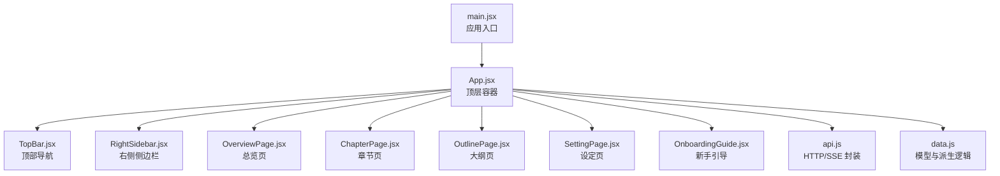
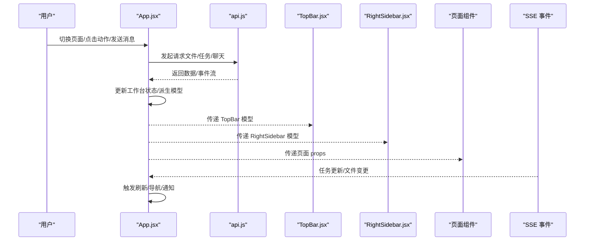
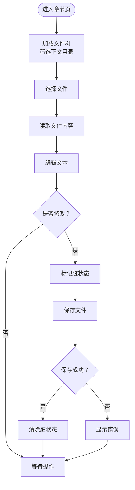
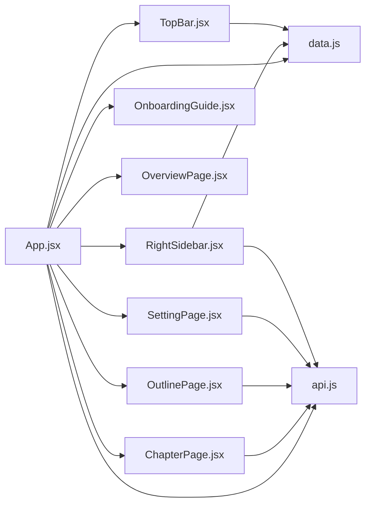

# 前端界面设计

<cite>
**本文引用的文件**
- [App.jsx](file://webnovel-writer/dashboard/frontend/src/App.jsx)
- [main.jsx](file://webnovel-writer/dashboard/frontend/src/main.jsx)
- [index.css](file://webnovel-writer/dashboard/frontend/src/index.css)
- [package.json](file://webnovel-writer/dashboard/frontend/package.json)
- [vite.config.js](file://webnovel-writer/dashboard/frontend/vite.config.js)
- [TopBar.jsx](file://webnovel-writer/dashboard/frontend/src/workbench/TopBar.jsx)
- [RightSidebar.jsx](file://webnovel-writer/dashboard/frontend/src/workbench/RightSidebar.jsx)
- [OverviewPage.jsx](file://webnovel-writer/dashboard/frontend/src/workbench/OverviewPage.jsx)
- [ChapterPage.jsx](file://webnovel-writer/dashboard/frontend/src/workbench/ChapterPage.jsx)
- [OutlinePage.jsx](file://webnovel-writer/dashboard/frontend/src/workbench/OutlinePage.jsx)
- [SettingPage.jsx](file://webnovel-writer/dashboard/frontend/src/workbench/SettingPage.jsx)
- [api.js](file://webnovel-writer/dashboard/frontend/src/api.js)
- [data.js](file://webnovel-writer/dashboard/frontend/src/workbench/data.js)
- [OnboardingGuide.jsx](file://webnovel-writer/dashboard/frontend/src/workbench/OnboardingGuide.jsx)
- [workbench.shell.test.mjs](file://webnovel-writer/dashboard/frontend/tests/workbench.shell.test.mjs)
- [workbench.data.test.mjs](file://webnovel-writer/dashboard/frontend/tests/workbench.data.test.mjs)
</cite>

## 目录
1. [简介](#简介)
2. [项目结构](#项目结构)
3. [核心组件](#核心组件)
4. [架构总览](#架构总览)
5. [详细组件分析](#详细组件分析)
6. [依赖关系分析](#依赖关系分析)
7. [性能考量](#性能考量)
8. [故障排查指南](#故障排查指南)
9. [结论](#结论)
10. [附录](#附录)

## 简介
本文件面向 Webnovel Writer 前端界面，系统化梳理基于 React 的工作台（Workbench）架构与组件层次，重点覆盖以下方面：
- 整体架构与控制流：顶层容器 App 如何协调页面渲染、侧边栏交互、任务与聊天、SSE 实时事件。
- 组件层次与职责：TopBar、RightSidebar、各工作台页面（总览/章节/大纲/设定）的职责边界与协作方式。
- 状态管理模式：集中式工作台状态、派生模型构建、页面级状态缓存与刷新令牌。
- 数据绑定与用户交互：文件树读取、内容读写、动作卡执行、聊天对话、任务订阅。
- UI 设计与响应式：主题变量、网格布局、断点适配与无障碍焦点。
- 开发与优化：组件开发指南、样式定制、性能优化建议。

## 项目结构
前端位于 dashboard/frontend，采用 Vite 构建，React 19，核心入口为 main.jsx，顶层容器为 App.jsx，页面与侧边栏组件位于 src/workbench 下，样式集中在 index.css，API 封装在 api.js，工作台数据模型在 data.js。

图表来源
- [main.jsx:1-11](file://webnovel-writer/dashboard/frontend/src/main.jsx#L1-L11)
- [App.jsx:1-417](file://webnovel-writer/dashboard/frontend/src/App.jsx#L1-L417)
- [TopBar.jsx:1-29](file://webnovel-writer/dashboard/frontend/src/workbench/TopBar.jsx#L1-L29)
- [RightSidebar.jsx:1-145](file://webnovel-writer/dashboard/frontend/src/workbench/RightSidebar.jsx#L1-L145)
- [OverviewPage.jsx:1-56](file://webnovel-writer/dashboard/frontend/src/workbench/OverviewPage.jsx#L1-L56)
- [ChapterPage.jsx:1-199](file://webnovel-writer/dashboard/frontend/src/workbench/ChapterPage.jsx#L1-L199)
- [OutlinePage.jsx:1-209](file://webnovel-writer/dashboard/frontend/src/workbench/OutlinePage.jsx#L1-L209)
- [SettingPage.jsx:1-240](file://webnovel-writer/dashboard/frontend/src/workbench/SettingPage.jsx#L1-L240)
- [OnboardingGuide.jsx:1-161](file://webnovel-writer/dashboard/frontend/src/workbench/OnboardingGuide.jsx#L1-L161)
- [api.js:1-78](file://webnovel-writer/dashboard/frontend/src/api.js#L1-L78)
- [data.js:1-163](file://webnovel-writer/dashboard/frontend/src/workbench/data.js#L1-L163)

章节来源
- [main.jsx:1-11](file://webnovel-writer/dashboard/frontend/src/main.jsx#L1-L11)
- [package.json:1-23](file://webnovel-writer/dashboard/frontend/package.json#L1-L23)
- [vite.config.js:1-16](file://webnovel-writer/dashboard/frontend/vite.config.js#L1-L16)

## 核心组件
- 顶层容器 App：负责工作台状态、SSE 订阅、页面渲染分发、动作执行、聊天交互、向导状态与页面刷新令牌。
- 顶部导航 TopBar：展示项目标题、页面导航按钮、任务状态指示。
- 右侧侧边栏 RightSidebar：上下文显示、聊天面板、动作卡、当前任务面板与日志。
- 页面组件：OverviewPage（总览）、ChapterPage（章节）、OutlinePage（大纲）、SettingPage（设定）。
- 数据模型 data.js：页面常量、初始状态、派生模型（TopBar、RightSidebar、Overview、完成提示、恢复建议等）。
- API 封装 api.js：文件树、文件读写、聊天、任务、SSE 订阅。
- 新手引导 OnboardingGuide：步骤化引导与高亮。

章节来源
- [App.jsx:21-417](file://webnovel-writer/dashboard/frontend/src/App.jsx#L21-L417)
- [TopBar.jsx:1-29](file://webnovel-writer/dashboard/frontend/src/workbench/TopBar.jsx#L1-L29)
- [RightSidebar.jsx:1-145](file://webnovel-writer/dashboard/frontend/src/workbench/RightSidebar.jsx#L1-L145)
- [OverviewPage.jsx:1-56](file://webnovel-writer/dashboard/frontend/src/workbench/OverviewPage.jsx#L1-L56)
- [ChapterPage.jsx:1-199](file://webnovel-writer/dashboard/frontend/src/workbench/ChapterPage.jsx#L1-L199)
- [OutlinePage.jsx:1-209](file://webnovel-writer/dashboard/frontend/src/workbench/OutlinePage.jsx#L1-L209)
- [SettingPage.jsx:1-240](file://webnovel-writer/dashboard/frontend/src/workbench/SettingPage.jsx#L1-L240)
- [data.js:1-163](file://webnovel-writer/dashboard/frontend/src/workbench/data.js#L1-L163)
- [api.js:1-78](file://webnovel-writer/dashboard/frontend/src/api.js#L1-L78)
- [OnboardingGuide.jsx:1-161](file://webnovel-writer/dashboard/frontend/src/workbench/OnboardingGuide.jsx#L1-L161)

## 架构总览
工作台采用“容器组件 + 展示组件”的分层模式：
- 容器层：App 负责状态、副作用、事件订阅与模型派生。
- 展示层：TopBar、RightSidebar、各页面组件仅负责 UI 呈现与简单交互。
- 数据流：通过 props 向下传递，通过回调向上反馈；SSE 提供实时事件驱动的状态变更。

图表来源
- [App.jsx:64-273](file://webnovel-writer/dashboard/frontend/src/App.jsx#L64-L273)
- [api.js:27-78](file://webnovel-writer/dashboard/frontend/src/api.js#L27-L78)
- [TopBar.jsx:1-29](file://webnovel-writer/dashboard/frontend/src/workbench/TopBar.jsx#L1-L29)
- [RightSidebar.jsx:1-145](file://webnovel-writer/dashboard/frontend/src/workbench/RightSidebar.jsx#L1-L145)

## 详细组件分析

### 顶层容器 App：状态、副作用与渲染分发
- 状态管理
  - 工作台全局状态：页面、摘要、当前任务、聊天消息、建议动作。
  - 页面级状态缓存：章节/大纲/设置页的选中路径与脏状态。
  - 刷新令牌：根据动作类型触发对应页面的 reloadToken，强制刷新。
- 副作用
  - 首次加载摘要与当前任务。
  - 订阅 SSE 事件：文件变更触发摘要刷新；任务更新动态更新任务面板与聊天通知。
  - 页面切换前的脏状态确认与 beforeunload 阻止误关闭。
- 模型派生
  - TopBar 模型：标题、页面列表、活动页、任务徽标。
  - 右侧侧边栏模型：上下文、聊天消息、建议动作、当前任务（含完成提示与恢复建议）。
- 渲染分发
  - 根据活动页渲染总览/章节/大纲/设定页面，并注入页面 props（摘要、加载状态、错误、回调、缓存路径、刷新令牌）。

章节来源
- [App.jsx:21-417](file://webnovel-writer/dashboard/frontend/src/App.jsx#L21-L417)
- [data.js:54-97](file://webnovel-writer/dashboard/frontend/src/workbench/data.js#L54-L97)

### 顶部导航 TopBar：页面导航与任务状态
- 职责：展示项目标题、页面导航按钮、连接状态与任务徽标。
- 交互：点击按钮切换活动页；连接状态通过类名切换。

章节来源
- [TopBar.jsx:1-29](file://webnovel-writer/dashboard/frontend/src/workbench/TopBar.jsx#L1-L29)
- [data.js:54-65](file://webnovel-writer/dashboard/frontend/src/workbench/data.js#L54-L65)

### 右侧侧边栏 RightSidebar：上下文、聊天与动作
- 上下文：显示当前页面、选中路径、是否脏。
- 聊天：历史消息、输入框、发送禁用态；支持跳转到目标页面。
- 动作卡：列出建议动作，点击执行；执行前进行脏状态确认。
- 当前任务：状态、任务名、步骤、更新时间、错误、恢复建议、日志、结果摘要；支持重试。
- 导航：当任务完成后，若非当前页，提供“前往页面”按钮。

章节来源
- [RightSidebar.jsx:1-145](file://webnovel-writer/dashboard/frontend/src/workbench/RightSidebar.jsx#L1-L145)
- [data.js:67-97](file://webnovel-writer/dashboard/frontend/src/workbench/data.js#L67-L97)
- [data.js:108-140](file://webnovel-writer/dashboard/frontend/src/workbench/data.js#L108-L140)

### 总览页 OverviewPage：数据聚合与引导
- 职责：展示项目信息、最近任务、最近修改、AI 建议；提供重新加载与重启引导。
- 数据来源：通过 buildOverviewModel 从摘要数据派生。

章节来源
- [OverviewPage.jsx:1-56](file://webnovel-writer/dashboard/frontend/src/workbench/OverviewPage.jsx#L1-L56)
- [data.js:34-52](file://webnovel-writer/dashboard/frontend/src/workbench/data.js#L34-L52)

### 章节页 ChapterPage：编辑器集成与文件管理
- 文件树：从 /api/files/tree 获取，筛选“正文”目录下的文件。
- 选中与加载：选中文件后读取内容；支持缓存上次选中路径。
- 编辑与保存：文本域编辑，脏状态管理，保存成功/失败提示。
- 刷新：通过 reloadToken 强制刷新文件列表与内容。

图表来源
- [ChapterPage.jsx:16-199](file://webnovel-writer/dashboard/frontend/src/workbench/ChapterPage.jsx#L16-L199)
- [api.js:27-37](file://webnovel-writer/dashboard/frontend/src/api.js#L27-L37)

章节来源
- [ChapterPage.jsx:1-199](file://webnovel-writer/dashboard/frontend/src/workbench/ChapterPage.jsx#L1-L199)
- [api.js:27-37](file://webnovel-writer/dashboard/frontend/src/api.js#L27-L37)

### 大纲页 OutlinePage：可视化与结构化规划
- 文件树：从 /api/files/tree 获取，筛选“大纲”目录下的文件。
- 类型推断：根据路径关键字推断“总纲/卷纲/章纲/其他”。
- 编辑与保存：与章节页一致的编辑与保存流程。
- 刷新：通过 reloadToken 强制刷新。

章节来源
- [OutlinePage.jsx:1-209](file://webnovel-writer/dashboard/frontend/src/workbench/OutlinePage.jsx#L1-L209)
- [api.js:27-37](file://webnovel-writer/dashboard/frontend/src/api.js#L27-L37)

### 设定页 SettingPage：分类筛选与实体管理
- 文件树：从 /api/files/tree 获取，筛选“设定集”目录下的文件。
- 分类：根据路径关键字推断“全部/人物/势力/地点/世界观”，支持分类筛选。
- 编辑与保存：与章节页一致的编辑与保存流程。
- 刷新：通过 reloadToken 强制刷新。

章节来源
- [SettingPage.jsx:1-240](file://webnovel-writer/dashboard/frontend/src/workbench/SettingPage.jsx#L1-L240)
- [api.js:27-37](file://webnovel-writer/dashboard/frontend/src/api.js#L27-L37)

### 数据模型 data.js：派生与规则
- 页面常量与默认页：overview。
- 初始状态：包含页面、摘要、当前任务（空闲态）、聊天消息、建议动作。
- TopBar 模型：从摘要与当前任务派生标题、页面列表、活动页、任务徽标。
- RightSidebar 模型：标准化任务字段，注入完成提示与恢复建议。
- 目标页解析：根据动作类型解析应跳转的页面。
- 完成提示：根据当前页与动作类型生成“刷新/导航/无”三态提示。
- 恢复建议：任务失败时的三条建议。
- 聊天回复模型：从服务端响应派生回复、理由、作用域与建议动作。
- 脏状态确认：导航与动作执行前的确认逻辑。

章节来源
- [data.js:1-163](file://webnovel-writer/dashboard/frontend/src/workbench/data.js#L1-L163)

### API 封装 api.js：统一请求与事件订阅
- JSON 请求：fetchJSON/postJSON，处理错误码。
- 文件操作：/api/files/tree、/api/files/read、/api/files/save。
- 聊天与任务：/api/chat、/api/tasks/*。
- SSE：/api/events，自动重连，onOpen/onError 回调。

章节来源
- [api.js:1-78](file://webnovel-writer/dashboard/frontend/src/api.js#L1-L78)

### 新手引导 OnboardingGuide：步骤化体验
- 步骤：欢迎、页面导航、工作区、AI 助手。
- 高亮：根据目标节点计算气泡位置，动态添加/移除高亮类。
- 存储：本地存储完成标记，支持重置。

章节来源
- [OnboardingGuide.jsx:1-161](file://webnovel-writer/dashboard/frontend/src/workbench/OnboardingGuide.jsx#L1-L161)

## 依赖关系分析
- 依赖图
  - App 依赖 data.js（模型）、api.js（请求/SSE）、各页面组件。
  - 页面组件依赖 api.js（文件树/读写）、data.js（类型推断/分类）。
  - 侧边栏依赖 data.js（模型/提示）、api.js（聊天/任务）。
  - TopBar 仅依赖 data.js 派生模型。
  - OnboardingGuide 依赖 DOM 引用与本地存储。

图表来源
- [App.jsx:1-417](file://webnovel-writer/dashboard/frontend/src/App.jsx#L1-L417)
- [data.js:1-163](file://webnovel-writer/dashboard/frontend/src/workbench/data.js#L1-L163)
- [api.js:1-78](file://webnovel-writer/dashboard/frontend/src/api.js#L1-L78)

章节来源
- [App.jsx:1-417](file://webnovel-writer/dashboard/frontend/src/App.jsx#L1-L417)
- [data.js:1-163](file://webnovel-writer/dashboard/frontend/src/workbench/data.js#L1-L163)
- [api.js:1-78](file://webnovel-writer/dashboard/frontend/src/api.js#L1-L78)

## 性能考量
- 渲染优化
  - 使用 useMemo 派生模型，避免重复计算。
  - 页面组件通过 reloadToken 强制刷新，减少不必要的重渲染。
- 网络与事件
  - SSE 自动重连，onerror 仅更新连接状态，不阻塞 UI。
  - 请求失败时提供错误提示与重试按钮。
- 交互体验
  - 脏状态确认与 beforeunload 防止误关。
  - 保存状态机（idle/loading/saving/saved/error）提升反馈即时性。
- 样式与布局
  - CSS Grid 与媒体查询实现响应式布局，断点内自适应网格与面板高度。
  - 主题变量统一色彩与阴影，便于主题定制。

[本节为通用指导，无需特定文件引用]

## 故障排查指南
- 加载失败
  - 检查 /api/workbench/summary 与 /api/tasks/current 是否可达；查看错误消息与重试按钮。
- 文件读写异常
  - 确认 /api/files/tree、/api/files/read、/api/files/save 的路径正确；查看具体错误信息。
- 聊天与动作
  - 发送失败时查看侧边栏错误消息；失败任务可重试。
- SSE 连接
  - 连接状态以类名区分；断开时关注 onerror 回调。
- 导航与保存
  - 切换文件前若有未保存修改，确认弹窗；保存按钮禁用态表示不可操作。

章节来源
- [App.jsx:64-83](file://webnovel-writer/dashboard/frontend/src/App.jsx#L64-L83)
- [api.js:27-53](file://webnovel-writer/dashboard/frontend/src/api.js#L27-L53)
- [RightSidebar.jsx:123-127](file://webnovel-writer/dashboard/frontend/src/workbench/RightSidebar.jsx#L123-L127)

## 结论
该前端以 App 为核心容器，结合 data.js 的模型派生与 api.js 的统一请求封装，形成清晰的“容器-展示”分层。页面组件围绕文件树与内容读写展开，配合右侧侧边栏的聊天、动作与任务面板，构成完整的创作工作流。通过 SSE 实时事件与刷新令牌，确保页面与后端状态的一致性。响应式样式与主题变量提升了跨设备体验。建议在后续迭代中进一步完善编辑器能力（如语法高亮、预览）与任务执行的可观测性（日志与回溯）。

[本节为总结，无需特定文件引用]

## 附录

### 组件开发指南
- 新增页面
  - 在 data.js 中定义页面常量与默认页；在 App.jsx 中注册路由与刷新令牌。
  - 创建页面组件，使用 api.js 的文件树/读写接口；通过 props 接收摘要、加载状态、错误与回调。
  - 在 RightSidebar 模型中补充必要的上下文字段。
- 交互增强
  - 对需要保存的编辑器，维护 draft/dirty/saveState 状态机。
  - 在动作执行前调用 shouldConfirmAction 进行脏状态确认。
- 样式定制
  - 修改主题变量（颜色、字体、阴影）以适配品牌风格。
  - 基于现有 Grid 与断点，扩展卡片与表格布局。

章节来源
- [data.js:1-163](file://webnovel-writer/dashboard/frontend/src/workbench/data.js#L1-L163)
- [App.jsx:169-178](file://webnovel-writer/dashboard/frontend/src/App.jsx#L169-L178)
- [index.css:1-1250](file://webnovel-writer/dashboard/frontend/src/index.css#L1-L1250)

### 测试参考
- 单元测试覆盖了数据模型的派生逻辑与默认值，可作为新增模型的参考模板。

章节来源
- [workbench.shell.test.mjs:1-111](file://webnovel-writer/dashboard/frontend/tests/workbench.shell.test.mjs#L1-L111)
- [workbench.data.test.mjs:1-86](file://webnovel-writer/dashboard/frontend/tests/workbench.data.test.mjs#L1-L86)