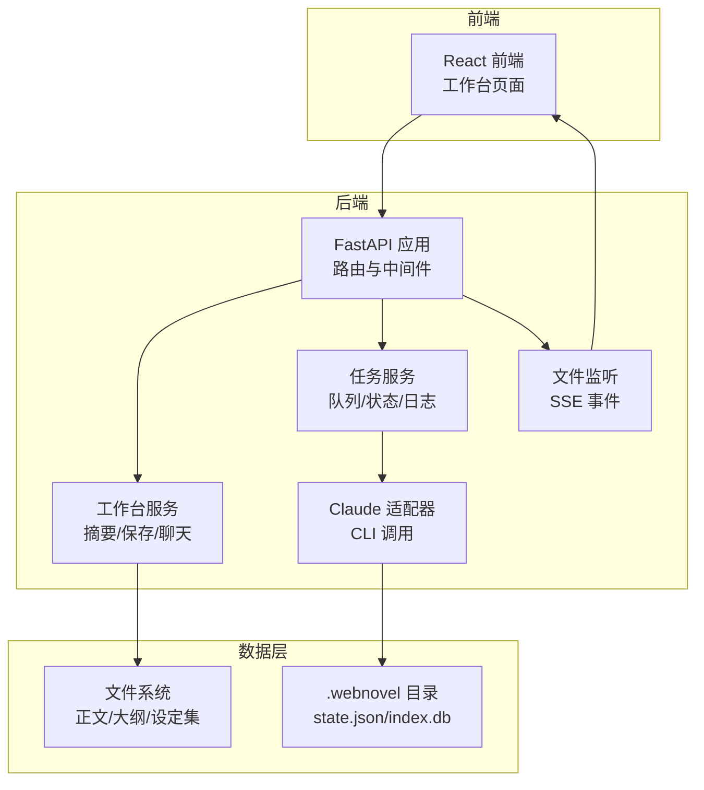
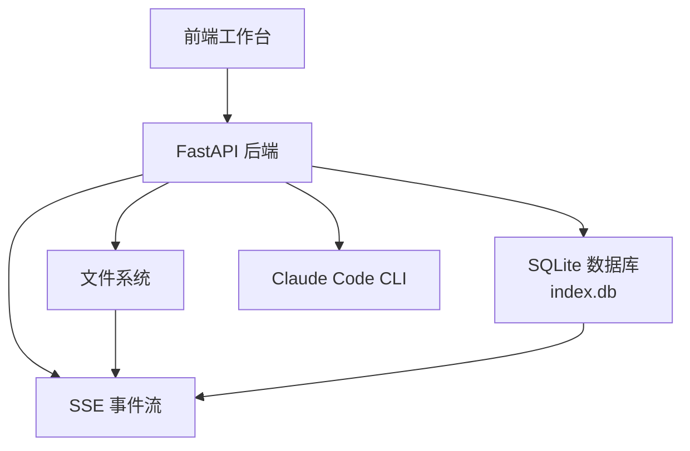
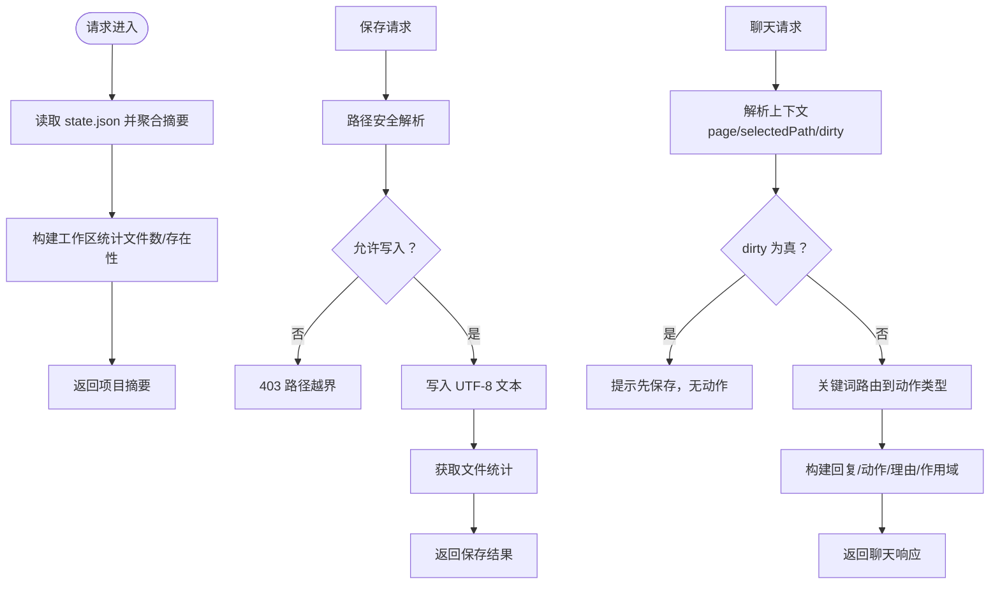
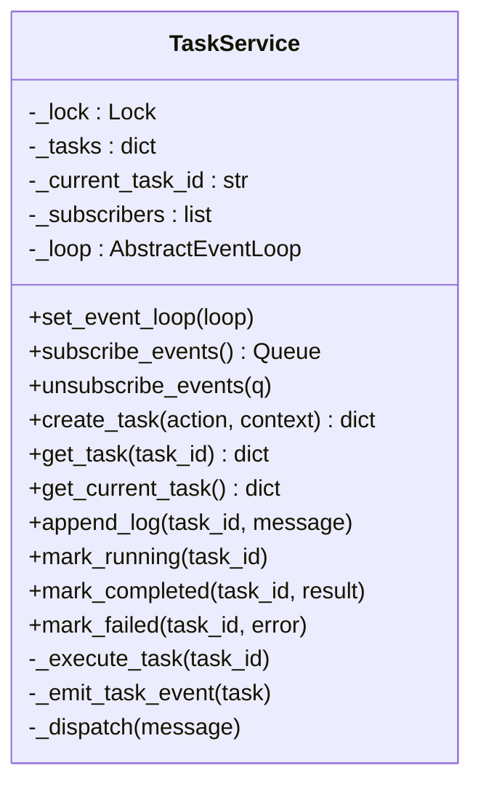
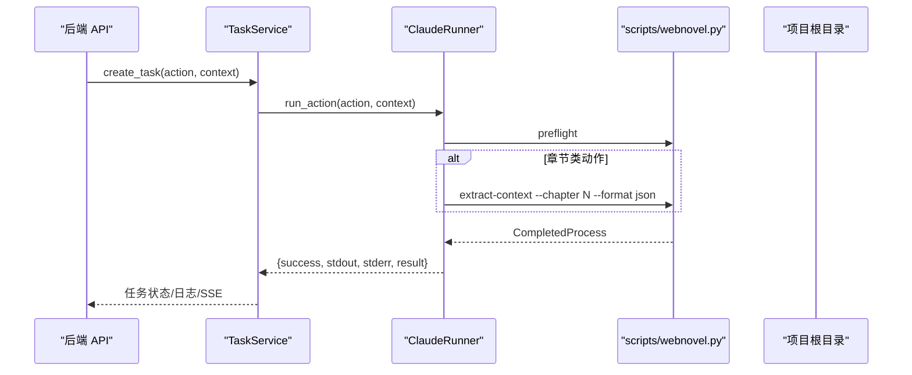
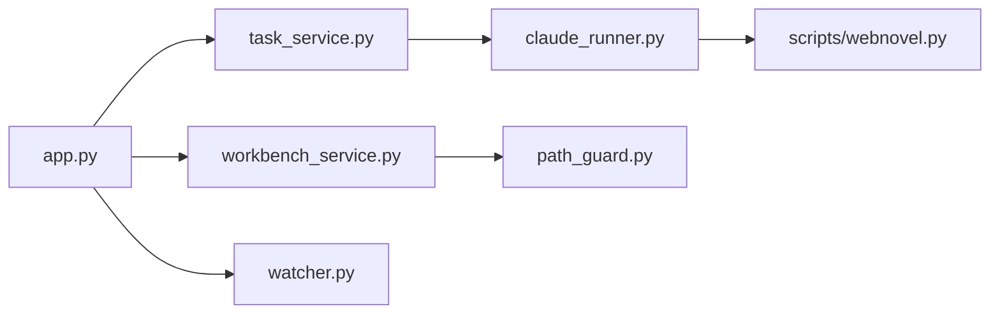

# 后端服务实现

<cite>
**本文引用的文件**
- [app.py](file://webnovel-writer/dashboard/app.py)
- [server.py](file://webnovel-writer/dashboard/server.py)
- [workbench_service.py](file://webnovel-writer/dashboard/workbench_service.py)
- [task_service.py](file://webnovel-writer/dashboard/task_service.py)
- [models.py](file://webnovel-writer/dashboard/models.py)
- [watcher.py](file://webnovel-writer/dashboard/watcher.py)
- [claude_runner.py](file://webnovel-writer/dashboard/claude_runner.py)
- [path_guard.py](file://webnovel-writer/dashboard/path_guard.py)
- [web-workbench.md](file://docs/web-workbench.md)
- [2026-04-12-web-workbench-design.md](file://docs/superpowers/specs/2026-04-12-web-workbench-design.md)
- [webnovel.py](file://webnovel-writer/scripts/webnovel.py)
- [test_phase2_tasks.py](file://webnovel-writer/dashboard/tests/test_phase2_tasks.py)
- [test_phase3_chat.py](file://webnovel-writer/dashboard/tests/test_phase3_chat.py)
</cite>

## 目录
1. [简介](#简介)
2. [项目结构](#项目结构)
3. [核心组件](#核心组件)
4. [架构总览](#架构总览)
5. [详细组件分析](#详细组件分析)
6. [依赖分析](#依赖分析)
7. [性能考量](#性能考量)
8. [故障排查指南](#故障排查指南)
9. [结论](#结论)
10. [附录](#附录)

## 简介
本技术文档面向 Webnovel Writer 后端服务，聚焦工作台服务、任务服务、聊天编排与事件流等核心能力，系统阐述项目摘要加载、工作台状态管理、文件保存处理与聊天响应构建的实现原理，详解任务队列管理、事件订阅机制、状态同步策略与错误处理方案，并提供服务间通信协议、数据流转过程与并发控制机制说明，辅以服务扩展指南、性能调优方法与监控指标建议，帮助开发者高效理解与维护后端服务架构。

## 项目结构
后端以 FastAPI 为核心，提供只读查询与最小写接口，结合文件监听与任务队列，形成“前端工作台 + 后端服务 + Claude Code 执行链”的整体架构。关键模块包括：
- 应用工厂与生命周期：创建 FastAPI 应用、注册中间件、挂载静态资源、管理生命周期
- 工作台服务：项目摘要加载、文件保存、聊天响应构建
- 任务服务：任务创建、状态流转、日志记录、事件推送
- 文件监听：监控 .webnovel 目录关键文件变更，通过 SSE 推送
- Claude 适配：将动作映射为 CLI 调用，封装执行结果
- 路径安全：防止路径穿越，限定文件访问范围



**图表来源**
- [app.py:50-490](file://webnovel-writer/dashboard/app.py#L50-L490)
- [workbench_service.py:18-171](file://webnovel-writer/dashboard/workbench_service.py#L18-L171)
- [task_service.py:14-166](file://webnovel-writer/dashboard/task_service.py#L14-L166)
- [watcher.py:40-95](file://webnovel-writer/dashboard/watcher.py#L40-L95)
- [claude_runner.py:13-142](file://webnovel-writer/dashboard/claude_runner.py#L13-L142)

**章节来源**
- [app.py:50-490](file://webnovel-writer/dashboard/app.py#L50-L490)
- [web-workbench.md:1-192](file://docs/web-workbench.md#L1-L192)
- [2026-04-12-web-workbench-design.md:72-85](file://docs/superpowers/specs/2026-04-12-web-workbench-design.md#L72-L85)

## 核心组件
- 应用工厂与生命周期管理：负责 CORS、静态资源挂载、SPA 回退、生命周期事件（启动/停止）
- 工作台服务：项目摘要聚合、文件保存、聊天响应构建
- 任务服务：线程池执行、状态机、事件订阅、SSE 推送
- 文件监听：Watchdog 观察关键文件变更，主线程安全投递消息
- Claude 适配器：统一 CLI 调用，封装执行结果与错误
- 路径安全：严格的路径解析与越界校验

**章节来源**
- [app.py:50-490](file://webnovel-writer/dashboard/app.py#L50-L490)
- [workbench_service.py:18-171](file://webnovel-writer/dashboard/workbench_service.py#L18-L171)
- [task_service.py:14-166](file://webnovel-writer/dashboard/task_service.py#L14-L166)
- [watcher.py:40-95](file://webnovel-writer/dashboard/watcher.py#L40-L95)
- [claude_runner.py:13-142](file://webnovel-writer/dashboard/claude_runner.py#L13-L142)
- [path_guard.py:11-29](file://webnovel-writer/dashboard/path_guard.py#L11-L29)

## 架构总览
后端采用“薄前端 + 后端任务代理层”的方案，前端负责交互与调度，后端负责文件读写、任务调度与事件推送，底层继续复用现有的 Claude Code 命令与工作流。



**图表来源**
- [2026-04-12-web-workbench-design.md:35-48](file://docs/superpowers/specs/2026-04-12-web-workbench-design.md#L35-L48)
- [app.py:434-461](file://webnovel-writer/dashboard/app.py#L434-L461)

## 详细组件分析

### 工作台服务（项目摘要/保存/聊天）
- 项目摘要加载：读取 .webnovel/state.json，聚合项目信息、进度与工作区统计
- 文件保存：路径安全校验 + 写入 UTF-8 文本，返回保存元信息
- 聊天响应构建：基于消息与上下文（页面、选中路径、脏状态）匹配动作类型，输出建议动作、理由与作用域



**图表来源**
- [workbench_service.py:18-171](file://webnovel-writer/dashboard/workbench_service.py#L18-L171)
- [path_guard.py:11-29](file://webnovel-writer/dashboard/path_guard.py#L11-L29)

**章节来源**
- [workbench_service.py:18-171](file://webnovel-writer/dashboard/workbench_service.py#L18-L171)
- [path_guard.py:11-29](file://webnovel-writer/dashboard/path_guard.py#L11-L29)

### 任务服务（异步任务队列与事件）
- 任务创建：深拷贝上下文与动作，分配 ID，入队并启动后台线程执行
- 状态机：pending → running → completed 或 failed，记录日志与更新时间
- 事件订阅：SSE 队列订阅，主线程安全投递任务事件
- 错误处理：捕获异常并标记失败，保证事件推送与日志完整性



**图表来源**
- [task_service.py:14-166](file://webnovel-writer/dashboard/task_service.py#L14-L166)

**章节来源**
- [task_service.py:14-166](file://webnovel-writer/dashboard/task_service.py#L14-L166)

### 文件监听与事件流（SSE）
- Watchdog 观察 .webnovel 目录关键文件（state.json、index.db、workflow_state.json）变更
- 主线程安全投递消息至订阅队列，前端通过 /api/events 接收实时事件
- 订阅容量限制与失效队列清理，保证事件流稳定

```mermaid
sequenceDiagram
participant WD as "Watchdog Observer"
participant FW as "FileWatcher"
participant Loop as "主线程事件循环"
participant Sub as "订阅队列"
participant SSE as "SSE 客户端"
WD->>FW : on_created/on_modified
FW->>Loop : call_soon_threadsafe(_dispatch)
Loop->>Sub : put_nowait(message)
SSE->>FW : subscribe()
FW-->>SSE : 返回队列句柄
SSE->>SSE : await queue.get()
SSE-->>SSE : data : {event payload}
```

**图表来源**
- [watcher.py:18-95](file://webnovel-writer/dashboard/watcher.py#L18-L95)
- [app.py:434-461](file://webnovel-writer/dashboard/app.py#L434-L461)

**章节来源**
- [watcher.py:18-95](file://webnovel-writer/dashboard/watcher.py#L18-L95)
- [app.py:434-461](file://webnovel-writer/dashboard/app.py#L434-L461)

### Claude 适配器（动作到 CLI 的映射）
- 统一 CLI 调用入口，先执行 preflight 校验，再按动作类型执行相应流程
- 章节类动作额外执行 extract-context，形成真实命令链
- 返回标准化执行结果，包含 success、stdout、stderr、result 等字段



**图表来源**
- [claude_runner.py:13-142](file://webnovel-writer/dashboard/claude_runner.py#L13-L142)
- [webnovel.py:24-37](file://webnovel-writer/scripts/webnovel.py#L24-L37)

**章节来源**
- [claude_runner.py:13-142](file://webnovel-writer/dashboard/claude_runner.py#L13-L142)
- [webnovel.py:24-37](file://webnovel-writer/scripts/webnovel.py#L24-L37)

### 路径安全与文件访问控制
- safe_resolve：解析相对路径为绝对路径，严格校验不得越出项目根目录
- 文件读取 API：在访问磁盘前必须经路径校验，仅允许正文/大纲/设定集目录
- 保存接口：写入 UTF-8 文本，创建父目录，返回保存元信息

**章节来源**
- [path_guard.py:11-29](file://webnovel-writer/dashboard/path_guard.py#L11-L29)
- [app.py:365-394](file://webnovel-writer/dashboard/app.py#L365-L394)
- [workbench_service.py:58-71](file://webnovel-writer/dashboard/workbench_service.py#L58-L71)

## 依赖分析
- 组件耦合与内聚：工作台服务与任务服务通过 API 路由耦合，文件监听与任务服务通过 SSE 解耦
- 外部依赖：FastAPI、Watchdog、SQLite、subprocess（调用 CLI）
- 潜在环依赖：未发现直接环依赖；事件流通过队列与线程安全投递避免环路
- 接口契约：SSE 事件类型（file.changed、task.updated）与任务状态机（pending/running/completed/failed）



**图表来源**
- [app.py:20-25](file://webnovel-writer/dashboard/app.py#L20-L25)
- [task_service.py:10-11](file://webnovel-writer/dashboard/task_service.py#L10-L11)
- [claude_runner.py:10](file://webnovel-writer/dashboard/claude_runner.py#L10)

**章节来源**
- [app.py:20-25](file://webnovel-writer/dashboard/app.py#L20-L25)
- [task_service.py:10-11](file://webnovel-writer/dashboard/task_service.py#L10-L11)
- [claude_runner.py:10](file://webnovel-writer/dashboard/claude_runner.py#L10)

## 性能考量
- 事件流背压：SSE 队列设置合理上限（文件监听 64，任务事件 128），避免内存膨胀
- 线程与锁：任务服务使用 Lock 保护共享状态，后台线程执行耗时操作，避免阻塞主线程
- I/O 优化：文件读写使用 UTF-8，路径解析与越界校验在进入磁盘前完成
- 数据库只读：实体查询封装异常处理，表不存在时返回空列表，避免中断
- 并发控制：Watchdog 与任务执行均通过主线程安全投递，避免竞态条件

[本节为通用性能指导，无需特定文件来源]

## 故障排查指南
- 403 路径越界：检查路径是否位于允许的三大目录内，确认 safe_resolve 与 allowed_parents
- 404 文件不存在：确认文件路径与项目根目录拼接正确，检查 .webnovel 目录是否存在
- 任务失败：查看任务日志末尾，定位 stdout/stderr；确认 preflight 与 extract-context 执行状态
- SSE 不推送：确认订阅队列未满，观察 _dispatch 中死队列清理逻辑
- 数据库查询失败：确认 index.db 存在，表名拼写正确；旧库缺少扩展表时返回空列表

**章节来源**
- [path_guard.py:11-29](file://webnovel-writer/dashboard/path_guard.py#L11-L29)
- [app.py:80-113](file://webnovel-writer/dashboard/app.py#L80-L113)
- [task_service.py:121-143](file://webnovel-writer/dashboard/task_service.py#L121-L143)
- [watcher.py:69-78](file://webnovel-writer/dashboard/watcher.py#L69-L78)

## 结论
该后端服务以 FastAPI 为基础，结合任务队列、文件监听与 Claude CLI 适配，实现了从只读 Dashboard 到可编辑工作台的平滑演进。通过严格的路径安全、事件流与状态机设计，保障了服务的稳定性与可观测性。后续可在任务取消、草稿对比、受影响章节提示等方面扩展，逐步完善创作工作台的用户体验。

[本节为总结，无需特定文件来源]

## 附录

### API 定义与行为
- 项目信息：GET /api/project/info（只读 state.json）
- 工作台摘要：GET /api/workbench/summary（聚合项目/进度/工作区）
- 实体查询：GET /api/entities、/api/relationships、/api/relationship-events、/api/chapters、/api/scenes、/api/reading-power、/api/review-metrics、/api/state-changes、/api/aliases
- 扩展表查询：GET /api/overrides、/api/debts、/api/debt-events、/api/invalid-facts、/api/rag-queries、/api/tool-stats、/api/checklist-scores
- 文件浏览：GET /api/files/tree、/api/files/read（路径安全校验）
- 文件保存：POST /api/files/save（UTF-8 写入）
- 任务管理：POST /api/tasks、GET /api/tasks/current、GET /api/tasks/{id}
- 聊天编排：POST /api/chat（动作建议与理由）
- 实时事件：GET /api/events（SSE：file.changed、task.updated）

**章节来源**
- [app.py:80-461](file://webnovel-writer/dashboard/app.py#L80-L461)

### 数据模型与状态
- 工作台页面与工作区根目录：overview/chapters/outline/settings 与 正文/大纲/设定集
- 任务状态：idle/pending/running/completed/failed
- 任务载荷：包含 action、context、logs、result、error、时间戳等

**章节来源**
- [models.py:3-23](file://webnovel-writer/dashboard/models.py#L3-L23)

### 测试要点
- 任务创建：验证 pending 状态、ID、时间戳、日志初始为空
- 任务执行：验证状态从 pending/running 转为 completed，包含日志与结果
- 任务失败：验证状态为 failed，包含错误与日志
- 聊天路由：同一消息在不同页面给出不同动作建议，dirty 上下文优先提示保存

**章节来源**
- [test_phase2_tasks.py:9-147](file://webnovel-writer/dashboard/tests/test_phase2_tasks.py#L9-L147)
- [test_phase3_chat.py:8-184](file://webnovel-writer/dashboard/tests/test_phase3_chat.py#L8-L184)