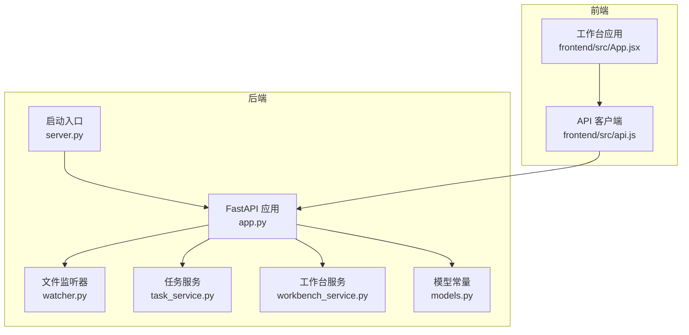
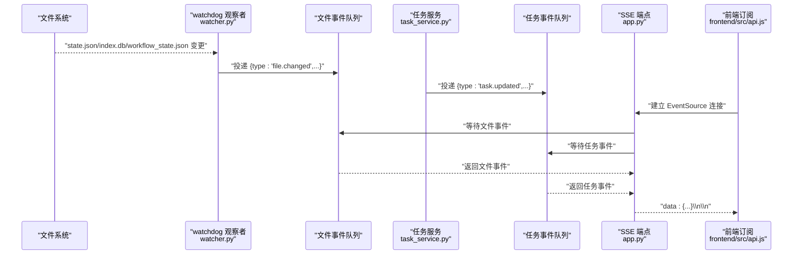
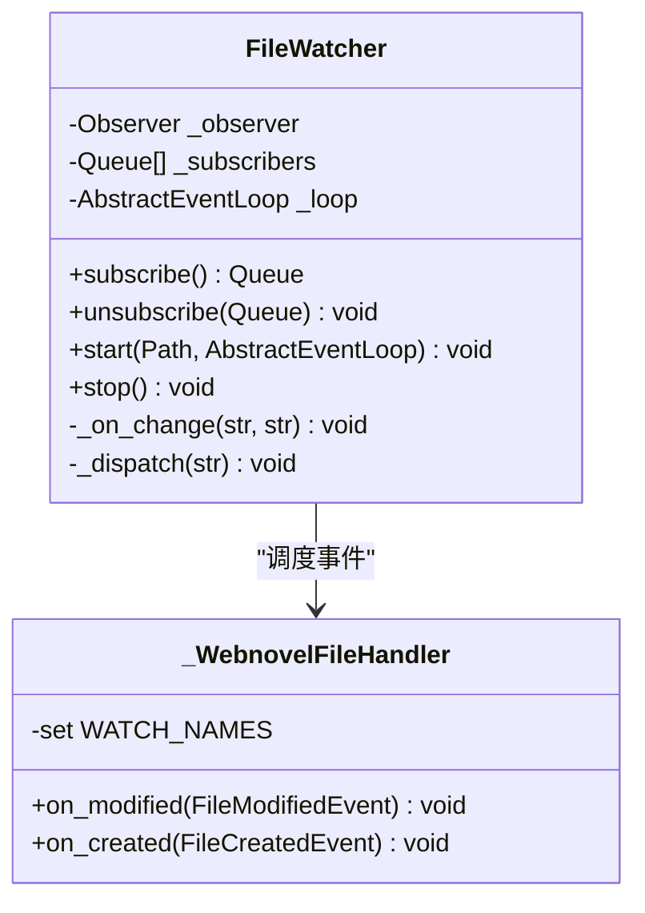
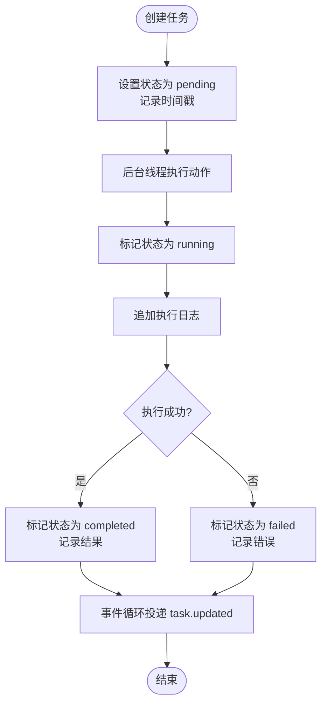
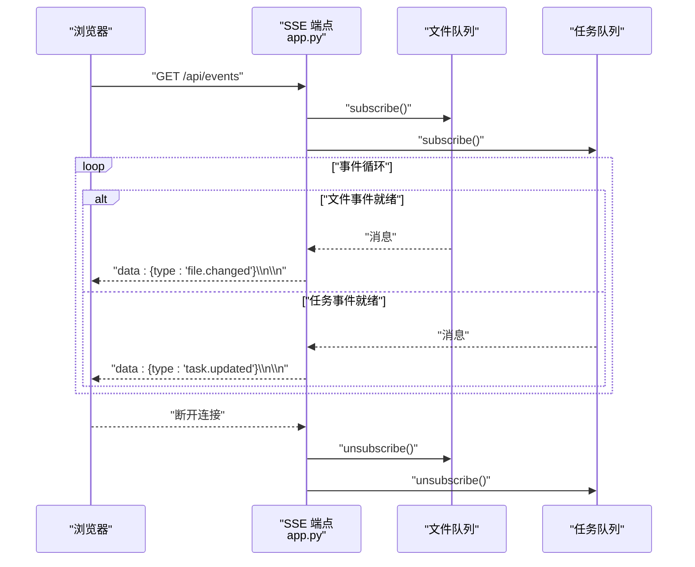
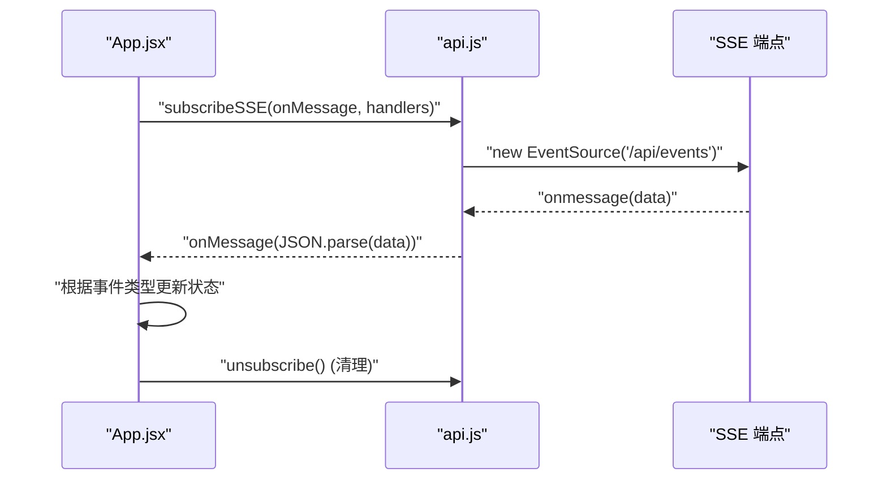
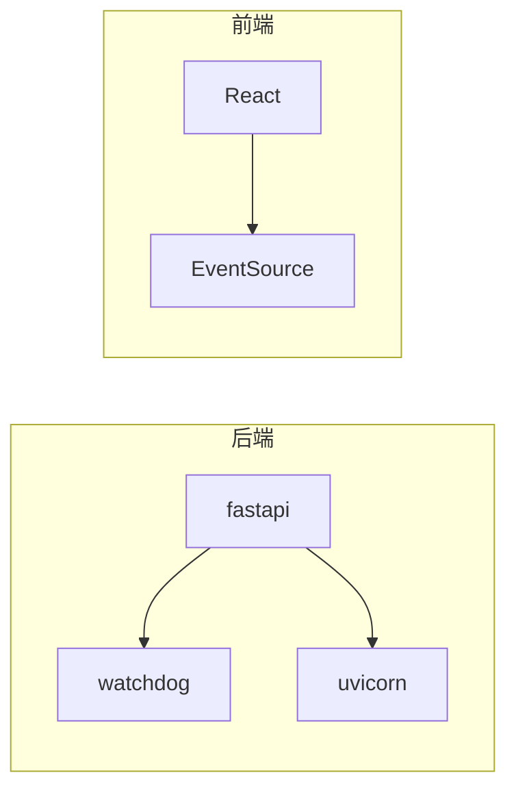

# 实时协作机制

<cite>
**本文引用的文件**
- [dashboard/server.py](file://webnovel-writer/dashboard/server.py)
- [dashboard/app.py](file://webnovel-writer/dashboard/app.py)
- [dashboard/watcher.py](file://webnovel-writer/dashboard/watcher.py)
- [dashboard/task_service.py](file://webnovel-writer/dashboard/task_service.py)
- [dashboard/workbench_service.py](file://webnovel-writer/dashboard/workbench_service.py)
- [dashboard/models.py](file://webnovel-writer/dashboard/models.py)
- [dashboard/frontend/src/api.js](file://webnovel-writer/dashboard/frontend/src/api.js)
- [dashboard/frontend/src/App.jsx](file://webnovel-writer/dashboard/frontend/src/App.jsx)
- [dashboard/requirements.txt](file://webnovel-writer/dashboard/requirements.txt)
</cite>

## 目录
1. [引言](#引言)
2. [项目结构](#项目结构)
3. [核心组件](#核心组件)
4. [架构总览](#架构总览)
5. [详细组件分析](#详细组件分析)
6. [依赖分析](#依赖分析)
7. [性能考量](#性能考量)
8. [故障排查指南](#故障排查指南)
9. [结论](#结论)
10. [附录](#附录)

## 引言
本文件面向需要在 Webnovel Writer 中实现“实时协作”的开发者，系统性阐述基于 Server-Sent Events (SSE) 的实时事件推送机制，包括文件变更监听、任务状态通知、事件队列管理与客户端连接处理。文档同时覆盖异步事件处理、消息格式规范、错误重连策略、连接生命周期管理、安全与性能优化、故障恢复机制，并提供客户端集成指南、事件处理最佳实践与调试技巧。

## 项目结构
后端采用 FastAPI 提供 REST API 与 SSE 流，前端使用 React 组件与 EventSource 订阅实时事件。文件变更通过 watchdog 监听，任务状态通过线程池执行并回传到事件循环，最终统一经 SSE 推送给前端。

图表来源
- [dashboard/server.py:43-72](file://webnovel-writer/dashboard/server.py#L43-L72)
- [dashboard/app.py:50-490](file://webnovel-writer/dashboard/app.py#L50-L490)
- [dashboard/watcher.py:40-95](file://webnovel-writer/dashboard/watcher.py#L40-L95)
- [dashboard/task_service.py:14-166](file://webnovel-writer/dashboard/task_service.py#L14-L166)
- [dashboard/workbench_service.py:18-171](file://webnovel-writer/dashboard/workbench_service.py#L18-L171)
- [dashboard/models.py:1-23](file://webnovel-writer/dashboard/models.py#L1-L23)
- [dashboard/frontend/src/api.js:61-78](file://webnovel-writer/dashboard/frontend/src/api.js#L61-L78)
- [dashboard/frontend/src/App.jsx:195-273](file://webnovel-writer/dashboard/frontend/src/App.jsx#L195-L273)

章节来源
- [dashboard/server.py:16-72](file://webnovel-writer/dashboard/server.py#L16-L72)
- [dashboard/app.py:50-490](file://webnovel-writer/dashboard/app.py#L50-L490)

## 核心组件
- 文件监听与事件分发：watcher.FileWatcher 使用 watchdog 监控 .webnovel 目录的关键文件，将变更事件投递到 asyncio.Queue，再由 SSE 端点统一推送。
- 任务状态管理：task_service.TaskService 在独立线程中执行动作，更新任务状态并通过事件循环安全地将事件投递到队列。
- SSE 端点：app.py 中的 /api/events 作为事件流出口，聚合文件与任务两类事件，使用 asyncio.wait(FIRST_COMPLETED) 实现多路复用。
- 前端订阅：frontend/src/api.js 的 subscribeSSE 封装 EventSource，App.jsx 订阅并根据事件类型刷新 UI。
- 模型与常量：models.py 定义页面与任务状态等常量，workbench_service.py 提供工作台摘要与安全路径解析。

章节来源
- [dashboard/watcher.py:18-95](file://webnovel-writer/dashboard/watcher.py#L18-L95)
- [dashboard/task_service.py:14-166](file://webnovel-writer/dashboard/task_service.py#L14-L166)
- [dashboard/app.py:434-461](file://webnovel-writer/dashboard/app.py#L434-L461)
- [dashboard/frontend/src/api.js:61-78](file://webnovel-writer/dashboard/frontend/src/api.js#L61-L78)
- [dashboard/frontend/src/App.jsx:195-273](file://webnovel-writer/dashboard/frontend/src/App.jsx#L195-L273)
- [dashboard/models.py:1-23](file://webnovel-writer/dashboard/models.py#L1-L23)
- [dashboard/workbench_service.py:18-171](file://webnovel-writer/dashboard/workbench_service.py#L18-L171)

## 架构总览
SSE 实时协作由“文件变更 + 任务状态”双通道组成，均通过 asyncio.Queue 实现事件队列化，最终由单一 SSE 端点进行多路复用推送。

图表来源
- [dashboard/watcher.py:63-78](file://webnovel-writer/dashboard/watcher.py#L63-L78)
- [dashboard/task_service.py:144-166](file://webnovel-writer/dashboard/task_service.py#L144-L166)
- [dashboard/app.py:434-461](file://webnovel-writer/dashboard/app.py#L434-L461)
- [dashboard/frontend/src/api.js:61-78](file://webnovel-writer/dashboard/frontend/src/api.js#L61-L78)

## 详细组件分析

### 文件变更监听与事件推送
- 监听范围：仅关注 .webnovel 目录下的 state.json、index.db、workflow_state.json。
- 事件来源：watchdog 的 FileSystemEventHandler 在 on_modified/on_created 中筛选目标文件名并回调通知。
- 事件投递：在 watchdog 线程中通过 asyncio.loop.call_soon_threadsafe 将 JSON 消息投递至事件循环，再批量分发到各订阅队列。
- 队列容量与清理：每个订阅者拥有固定大小的 asyncio.Queue；当队列满时，订阅者被视为“掉线”，自动从订阅列表移除。

图表来源
- [dashboard/watcher.py:40-95](file://webnovel-writer/dashboard/watcher.py#L40-L95)

章节来源
- [dashboard/watcher.py:18-38](file://webnovel-writer/dashboard/watcher.py#L18-L38)
- [dashboard/watcher.py:63-78](file://webnovel-writer/dashboard/watcher.py#L63-L78)
- [dashboard/watcher.py:81-95](file://webnovel-writer/dashboard/watcher.py#L81-L95)

### 任务状态事件与异步处理
- 任务生命周期：pending → running → completed 或 failed；支持追加日志、记录时间戳。
- 执行线程：任务在独立线程中运行，避免阻塞事件循环；执行完成后通过事件循环安全投递事件。
- 事件格式：包含 type、taskId、task 对象；前端据此更新当前任务视图与聊天提示。
- 队列管理：与文件事件共享同一队列模型，满载时自动清理“死亡”订阅者。

图表来源
- [dashboard/task_service.py:36-143](file://webnovel-writer/dashboard/task_service.py#L36-L143)
- [dashboard/task_service.py:144-166](file://webnovel-writer/dashboard/task_service.py#L144-L166)

章节来源
- [dashboard/task_service.py:14-166](file://webnovel-writer/dashboard/task_service.py#L14-L166)

### SSE 端点与事件聚合
- 订阅与取消：进入 /api/events 时分别订阅文件与任务事件队列；断开连接时取消订阅并清理资源。
- 多路复用：使用 asyncio.wait(FIRST_COMPLETED) 同时等待两个队列中的事件，任一到达即推送，避免阻塞。
- 响应格式：标准 SSE data: 行，末尾双换行表示一条完整事件。
- 生命周期：应用 lifespan 在启动时初始化监听器，在关闭时停止。

图表来源
- [dashboard/app.py:434-461](file://webnovel-writer/dashboard/app.py#L434-L461)

章节来源
- [dashboard/app.py:56-66](file://webnovel-writer/dashboard/app.py#L56-L66)
- [dashboard/app.py:434-461](file://webnovel-writer/dashboard/app.py#L434-L461)

### 前端订阅与事件处理
- 订阅封装：subscribeSSE 返回取消函数，自动处理 onopen/onmessage/onerror。
- 事件解析：忽略解析失败的消息，保证健壮性。
- 事件路由：根据事件类型更新工作台摘要、任务状态、聊天消息与页面导航提示。
- 连接状态：onOpen/onError 更新 connected 标志，用于 UI 展示。

图表来源
- [dashboard/frontend/src/api.js:61-78](file://webnovel-writer/dashboard/frontend/src/api.js#L61-L78)
- [dashboard/frontend/src/App.jsx:195-273](file://webnovel-writer/dashboard/frontend/src/App.jsx#L195-L273)

章节来源
- [dashboard/frontend/src/api.js:61-78](file://webnovel-writer/dashboard/frontend/src/api.js#L61-L78)
- [dashboard/frontend/src/App.jsx:195-273](file://webnovel-writer/dashboard/frontend/src/App.jsx#L195-L273)

### 消息格式规范
- 文件变更事件
  - 类型：file.changed
  - 字段：file（文件名）、kind（modified/created）、ts（时间戳）
- 任务更新事件
  - 类型：task.updated
  - 字段：taskId（任务 ID）、task（任务快照对象）

章节来源
- [dashboard/watcher.py:65](file://webnovel-writer/dashboard/watcher.py#L65)
- [dashboard/task_service.py:147-154](file://webnovel-writer/dashboard/task_service.py#L147-L154)

## 依赖分析
- 后端依赖
  - fastapi：提供 ASGI 应用、路由、中间件与生命周期管理。
  - watchdog：文件系统事件监听。
  - uvicorn：ASGI 服务器。
- 前端依赖
  - React：组件化 UI。
  - EventSource：SSE 客户端。

图表来源
- [dashboard/requirements.txt:1-4](file://webnovel-writer/dashboard/requirements.txt#L1-L4)
- [dashboard/frontend/src/api.js:61-78](file://webnovel-writer/dashboard/frontend/src/api.js#L61-L78)

章节来源
- [dashboard/requirements.txt:1-4](file://webnovel-writer/dashboard/requirements.txt#L1-L4)

## 性能考量
- 队列容量与背压
  - 文件订阅队列上限：64；任务订阅队列上限：128。队列满时自动剔除订阅者，避免内存膨胀。
  - 建议：前端应合理控制刷新频率，避免短时间内产生过多事件；必要时合并 UI 刷新。
- 事件循环与线程隔离
  - watchdog 回调通过 call_soon_threadsafe 进入事件循环，避免跨线程访问共享状态。
  - 任务执行在独立线程，避免阻塞 SSE 推送。
- SSE 多路复用
  - 使用 FIRST_COMPLETED 等待，降低延迟，提升吞吐。
- 数据库查询
  - index.db 查询为只读，异常时返回空列表或抛出明确错误，前端可降级处理。

章节来源
- [dashboard/watcher.py:50-58](file://webnovel-writer/dashboard/watcher.py#L50-L58)
- [dashboard/task_service.py:25-34](file://webnovel-writer/dashboard/task_service.py#L25-L34)
- [dashboard/app.py:445-453](file://webnovel-writer/dashboard/app.py#L445-L453)

## 故障排查指南
- 无法定位项目根目录
  - 现象：启动时报错提示无法定位 PROJECT_ROOT。
  - 排查：确认命令行参数、环境变量、.claude 指针或当前目录是否包含 .webnovel/state.json。
- SSE 无法接收事件
  - 现象：前端 connected 为 false，或 onerror 被触发。
  - 排查：检查 CORS 配置、/api/events 是否可达、网络代理与防火墙；确认前端 EventSource 自动重连行为。
- 事件丢失或积压
  - 现象：界面未及时刷新。
  - 排查：检查队列是否频繁满载；适当增大 maxsize 或减少事件频率；确认订阅者被正确移除。
- 任务未执行或状态不更新
  - 现象：任务创建后无 running/completed/failure 状态。
  - 排查：确认后台线程执行逻辑、call_soon_threadsafe 是否生效、事件循环是否正常运行。
- 数据库查询失败
  - 现象：某些只读查询返回 500。
  - 排查：确认 index.db 存在且表结构符合预期；旧库缺少表时返回空列表属预期行为。

章节来源
- [dashboard/server.py:16-41](file://webnovel-writer/dashboard/server.py#L16-L41)
- [dashboard/app.py:69-74](file://webnovel-writer/dashboard/app.py#L69-L74)
- [dashboard/app.py:109-113](file://webnovel-writer/dashboard/app.py#L109-L113)

## 结论
该实时协作机制以 SSE 为核心，结合 watchdog 与任务线程池，实现了低耦合、高可用的事件推送体系。通过严格的队列容量控制、事件循环与线程隔离以及前端自动重连策略，系统在复杂场景下仍能保持稳定与高效。建议在生产环境中进一步完善心跳、幂等与鉴权策略，并对高频事件进行去抖与合并优化。

## 附录

### 客户端集成指南
- 订阅事件流
  - 使用 subscribeSSE 注册 onOpen/onmessage/onerror 回调。
  - 在组件卸载时调用返回的取消函数，确保资源释放。
- 处理事件
  - file.changed：触发工作台摘要刷新与对应工作区重载。
  - task.updated：更新当前任务状态、日志与结果，必要时显示完成/失败提示并导航到目标页面。
- 错误重连
  - EventSource 默认自动重连；可在 onError 中更新 UI 状态并记录日志。
- 最佳实践
  - 合理拆分事件处理逻辑，避免在 onmessage 中执行耗时操作。
  - 对高频事件进行节流/去抖，减少 UI 刷新压力。
  - 为每个订阅者维护唯一标识，便于诊断与统计。

章节来源
- [dashboard/frontend/src/api.js:61-78](file://webnovel-writer/dashboard/frontend/src/api.js#L61-L78)
- [dashboard/frontend/src/App.jsx:195-273](file://webnovel-writer/dashboard/frontend/src/App.jsx#L195-L273)

### 安全与合规建议
- CORS 与来源控制
  - 当前允许任意来源，建议在生产环境限定可信域。
- 路径安全
  - 文件读写严格限制在正文/大纲/设定集目录内，防止路径穿越。
- 事件内容
  - 仅推送必要字段，避免泄露内部状态；对敏感字段进行脱敏处理。

章节来源
- [dashboard/app.py:69-74](file://webnovel-writer/dashboard/app.py#L69-L74)
- [dashboard/workbench_service.py:58-71](file://webnovel-writer/dashboard/workbench_service.py#L58-L71)