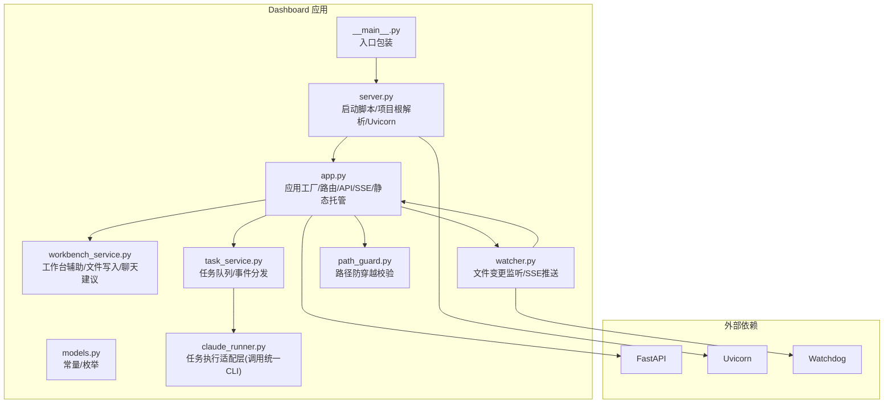
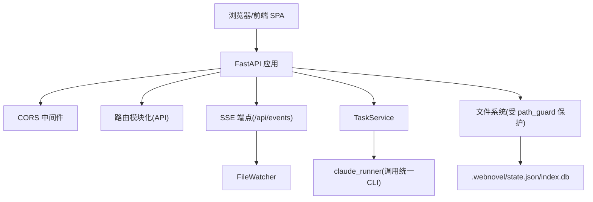
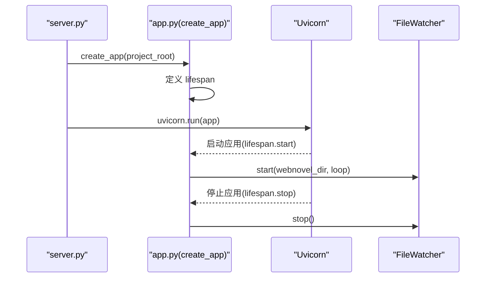
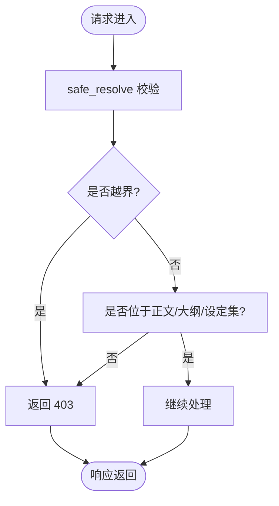
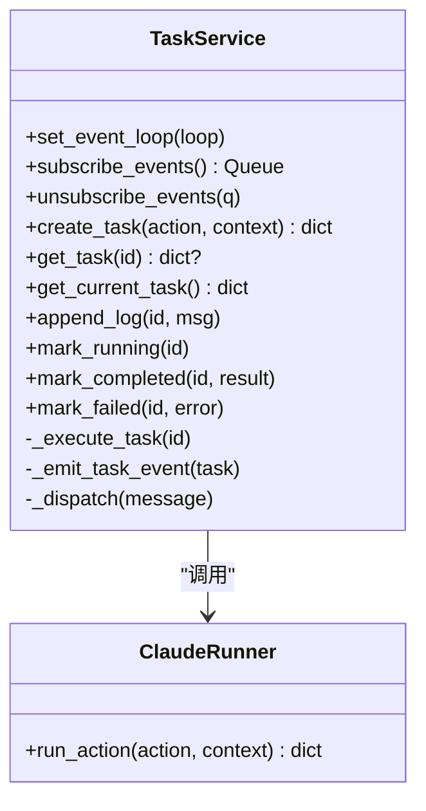
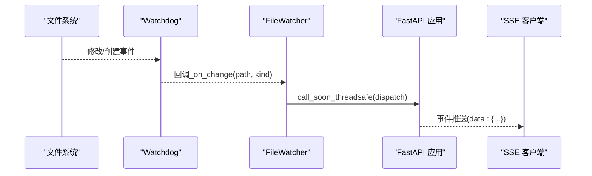
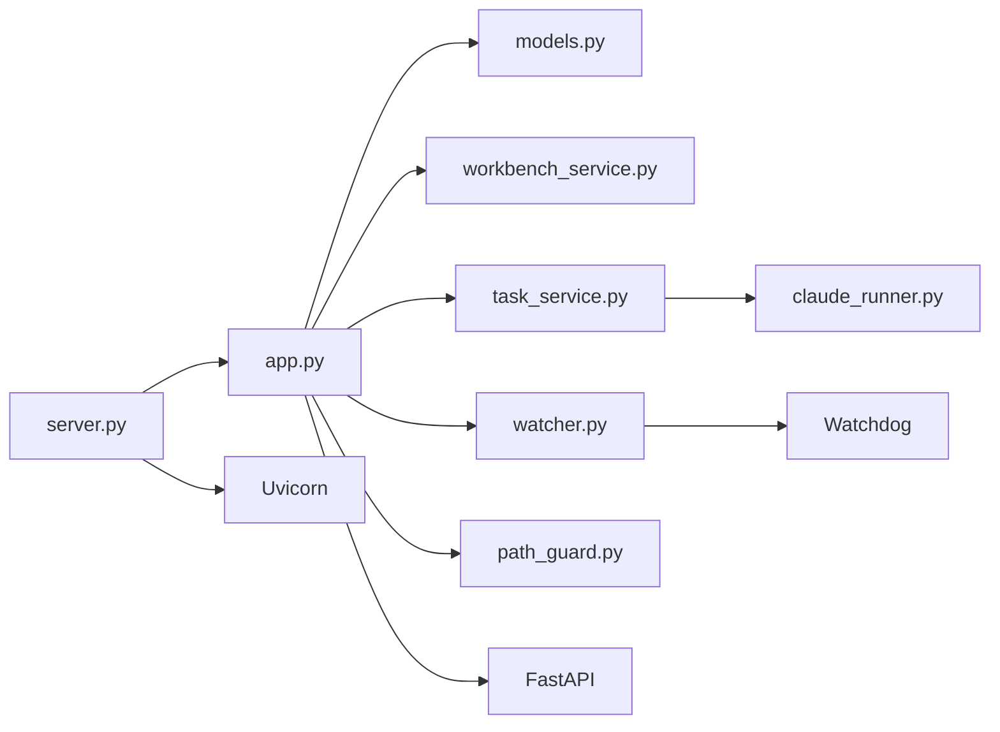

# 工作台架构概览

<cite>
**本文引用的文件**
- [webnovel-writer/dashboard/app.py](file://webnovel-writer/dashboard/app.py)
- [webnovel-writer/dashboard/server.py](file://webnovel-writer/dashboard/server.py)
- [webnovel-writer/dashboard/__main__.py](file://webnovel-writer/dashboard/__main__.py)
- [webnovel-writer/dashboard/models.py](file://webnovel-writer/dashboard/models.py)
- [webnovel-writer/dashboard/workbench_service.py](file://webnovel-writer/dashboard/workbench_service.py)
- [webnovel-writer/dashboard/task_service.py](file://webnovel-writer/dashboard/task_service.py)
- [webnovel-writer/dashboard/watcher.py](file://webnovel-writer/dashboard/watcher.py)
- [webnovel-writer/dashboard/path_guard.py](file://webnovel-writer/dashboard/path_guard.py)
- [webnovel-writer/dashboard/claude_runner.py](file://webnovel-writer/dashboard/claude_runner.py)
- [webnovel-writer/dashboard/requirements.txt](file://webnovel-writer/dashboard/requirements.txt)
- [webnovel-writer/README.md](file://README.md)
- [webnovel-writer/docs/web-workbench.md](file://docs/web-workbench.md)
- [webnovel-writer/docs/architecture.md](file://docs/architecture.md)
- [webnovel-writer/webnovel-writer/scripts/webnovel.py](file://webnovel-writer/scripts/webnovel.py)
</cite>

## 目录
1. [引言](#引言)
2. [项目结构](#项目结构)
3. [核心组件](#核心组件)
4. [架构总览](#架构总览)
5. [组件详细分析](#组件详细分析)
6. [依赖关系分析](#依赖关系分析)
7. [性能考虑](#性能考虑)
8. [故障排查指南](#故障排查指南)
9. [结论](#结论)
10. [附录](#附录)

## 引言
本文件面向 Webnovel Writer 写作工作台（Dashboard）的架构与实现，聚焦 FastAPI 主应用的设计模式、应用工厂模式、生命周期管理、中间件与安全策略、全局状态与项目根目录解析、静态文件托管与 SPA 回退、CORS 跨域配置、启动流程、资源清理与异常处理策略，并给出性能优化与扩展性建议。文档同时结合 Phase 1 的只读查询与最小写接口设计，帮助开发者快速理解整体设计思路与落地实现。

## 项目结构
工作台位于 webnovel-writer/dashboard 子包，采用“应用工厂 + 生命周期 + 中间件 + 路由模块化”的组织方式，配合独立的启动脚本与前端静态资源托管策略，形成清晰的前后端分离与职责边界。

图表来源
- [webnovel-writer/dashboard/app.py:1-490](file://webnovel-writer/dashboard/app.py#L1-L490)
- [webnovel-writer/dashboard/server.py:1-72](file://webnovel-writer/dashboard/server.py#L1-L72)
- [webnovel-writer/dashboard/__main__.py:1-5](file://webnovel-writer/dashboard/__main__.py#L1-L5)
- [webnovel-writer/dashboard/models.py:1-23](file://webnovel-writer/dashboard/models.py#L1-L23)
- [webnovel-writer/dashboard/workbench_service.py:1-171](file://webnovel-writer/dashboard/workbench_service.py#L1-L171)
- [webnovel-writer/dashboard/task_service.py:1-166](file://webnovel-writer/dashboard/task_service.py#L1-L166)
- [webnovel-writer/dashboard/watcher.py:1-95](file://webnovel-writer/dashboard/watcher.py#L1-L95)
- [webnovel-writer/dashboard/path_guard.py:1-29](file://webnovel-writer/dashboard/path_guard.py#L1-L29)
- [webnovel-writer/dashboard/claude_runner.py:1-142](file://webnovel-writer/dashboard/claude_runner.py#L1-L142)

章节来源
- [webnovel-writer/dashboard/app.py:1-490](file://webnovel-writer/dashboard/app.py#L1-L490)
- [webnovel-writer/dashboard/server.py:1-72](file://webnovel-writer/dashboard/server.py#L1-L72)
- [webnovel-writer/dashboard/__main__.py:1-5](file://webnovel-writer/dashboard/__main__.py#L1-L5)

## 核心组件
- 应用工厂与生命周期：通过 create_app(project_root) 构建 FastAPI 实例，使用 lifespan 管理文件监听器的启动与停止。
- 全局状态：项目根目录、文件监听器、任务服务实例在模块级全局变量中维护。
- 安全与路径控制：所有文件读写均经 path_guard.safe_resolve 校验，防止路径穿越。
- 任务系统：TaskService 提供任务创建、状态流转、日志累积与事件分发，后台线程执行实际动作。
- 文件监听：FileWatcher 基于 Watchdog 监控 .webnovel 关键文件变更，通过 asyncio Queue 推送至 SSE。
- 前端静态托管：SPA 回退策略，非 /api 路由回退到 index.html；assets 目录静态挂载。
- CORS：允许 GET/POST 方法与任意来源/头，便于本地开发与前端联调。
- 项目根解析：server.py 提供多级解析策略，优先 CLI 参数，其次环境变量，再尝试 .claude 指针，最后回退到当前目录。

章节来源
- [webnovel-writer/dashboard/app.py:26-489](file://webnovel-writer/dashboard/app.py#L26-L489)
- [webnovel-writer/dashboard/server.py:16-67](file://webnovel-writer/dashboard/server.py#L16-L67)
- [webnovel-writer/dashboard/path_guard.py:11-29](file://webnovel-writer/dashboard/path_guard.py#L11-L29)
- [webnovel-writer/dashboard/task_service.py:14-166](file://webnovel-writer/dashboard/task_service.py#L14-L166)
- [webnovel-writer/dashboard/watcher.py:40-95](file://webnovel-writer/dashboard/watcher.py#L40-L95)

## 架构总览
工作台采用“应用工厂 + 生命周期 + 中间件 + 路由模块化”的设计，结合任务系统与文件监听，形成“只读查询 + 最小写入 + 实时事件”的核心能力。前端通过 SPA 与后端 API 通信，SSE 实时推送文件变更与任务状态，保障用户体验与数据一致性。

图表来源
- [webnovel-writer/dashboard/app.py:67-489](file://webnovel-writer/dashboard/app.py#L67-L489)
- [webnovel-writer/dashboard/watcher.py:40-95](file://webnovel-writer/dashboard/watcher.py#L40-L95)
- [webnovel-writer/dashboard/task_service.py:14-166](file://webnovel-writer/dashboard/task_service.py#L14-L166)
- [webnovel-writer/dashboard/claude_runner.py:13-112](file://webnovel-writer/dashboard/claude_runner.py#L13-L112)

## 组件详细分析

### 应用工厂与生命周期管理
- 应用工厂 create_app(project_root)：接收可选的项目根目录参数，内部通过 asynccontextmanager 定义 lifespan，在应用启动时初始化事件循环、启动文件监听器；在应用关闭时停止监听器，确保资源回收。
- 全局状态：模块级变量维护项目根目录、文件监听器与任务服务实例，避免重复初始化。
- 生命周期要点：lifespan 在异步上下文中运行，确保与 asyncio 事件循环正确绑定；停止阶段调用 watcher.stop()，避免线程资源泄漏。

图表来源
- [webnovel-writer/dashboard/server.py:54-67](file://webnovel-writer/dashboard/server.py#L54-L67)
- [webnovel-writer/dashboard/app.py:50-67](file://webnovel-writer/dashboard/app.py#L50-L67)
- [webnovel-writer/dashboard/watcher.py:81-95](file://webnovel-writer/dashboard/watcher.py#L81-L95)

章节来源
- [webnovel-writer/dashboard/app.py:50-67](file://webnovel-writer/dashboard/app.py#L50-L67)
- [webnovel-writer/dashboard/server.py:54-67](file://webnovel-writer/dashboard/server.py#L54-L67)

### 中间件与安全策略（CORS 与路径防穿越）
- CORS：允许任意来源与方法（GET/POST），以及任意请求头，便于本地开发与前端联调。
- 路径防穿越：所有文件读取与写入均通过 safe_resolve 校验，确保解析后的路径位于项目根目录之内；对非法路径或越界访问抛出 403。
- 二次限制：文件读取还限定在“正文/大纲/设定集”三大目录范围内，进一步降低风险面。

图表来源
- [webnovel-writer/dashboard/path_guard.py:11-29](file://webnovel-writer/dashboard/path_guard.py#L11-L29)
- [webnovel-writer/dashboard/app.py:365-385](file://webnovel-writer/dashboard/app.py#L365-L385)

章节来源
- [webnovel-writer/dashboard/app.py:69-74](file://webnovel-writer/dashboard/app.py#L69-L74)
- [webnovel-writer/dashboard/app.py:365-385](file://webnovel-writer/dashboard/app.py#L365-L385)
- [webnovel-writer/dashboard/path_guard.py:11-29](file://webnovel-writer/dashboard/path_guard.py#L11-L29)

### 全局状态管理与项目根目录解析
- 全局状态：项目根目录、文件监听器、任务服务在模块级维护，避免重复初始化与跨模块耦合。
- 项目根解析：server.py 提供多级解析策略，优先 CLI 参数，其次环境变量，再尝试 .claude 指针，最后回退到当前目录；若无法定位则退出并提示错误。
- 作用域：解析结果传递给 create_app，作为后续所有文件操作的基础路径。

章节来源
- [webnovel-writer/dashboard/app.py:29-44](file://webnovel-writer/dashboard/app.py#L29-L44)
- [webnovel-writer/dashboard/server.py:16-41](file://webnovel-writer/dashboard/server.py#L16-L41)

### 静态文件托管与 SPA 回退
- 静态资源：当 dist/assets 存在时挂载 /assets；否则忽略。
- SPA 回退：除 /api 路由外的所有请求，均返回 index.html，实现前端路由的单页应用回退。
- 前端缺失：若未构建前端，提供友好提示与 API 文档链接。

章节来源
- [webnovel-writer/dashboard/app.py:466-487](file://webnovel-writer/dashboard/app.py#L466-L487)

### API 路由与数据访问
- 项目元信息：/api/project/info 返回 .webnovel/state.json 内容（只读）。
- 实体数据库查询：/api/entities、/api/relationships、/api/chapters、/api/scenes 等，均从 .webnovel/index.db 只读查询；对旧库表不存在的情况进行容错处理。
- 扩展表查询：/api/overrides、/api/debts、/api/rag-queries 等，使用 _fetchall_safe 安全执行，避免因表不存在导致异常。
- 文档浏览：/api/files/tree 与 /api/files/read 提供只读目录树与文件内容读取；/api/files/save 支持最小写入能力。
- 任务与聊天：/api/tasks 与 /api/chat 提供任务创建与聊天建议生成。
- SSE：/api/events 通过 asyncio.Queue 并发等待文件与任务事件，统一推送。

章节来源
- [webnovel-writer/dashboard/app.py:80-461](file://webnovel-writer/dashboard/app.py#L80-L461)

### 任务系统与事件分发
- 任务生命周期：pending → running → completed/failed；支持日志累积与最近 200 条截断。
- 线程执行：任务在后台线程中执行，主线程仅负责状态更新与事件分发。
- 事件分发：通过 asyncio loop 调度到各订阅队列，自动剔除满载的死队列。
- 与 CLI 集成：通过 claude_runner 调用统一 CLI，完成 preflight 与上下文提取等步骤。

图表来源
- [webnovel-writer/dashboard/task_service.py:14-166](file://webnovel-writer/dashboard/task_service.py#L14-L166)
- [webnovel-writer/dashboard/claude_runner.py:13-112](file://webnovel-writer/dashboard/claude_runner.py#L13-L112)

章节来源
- [webnovel-writer/dashboard/task_service.py:14-166](file://webnovel-writer/dashboard/task_service.py#L14-L166)
- [webnovel-writer/dashboard/claude_runner.py:13-112](file://webnovel-writer/dashboard/claude_runner.py#L13-L112)

### 文件监听与 SSE 推送
- 监听范围：仅关注 .webnovel 目录下的 state.json、index.db、workflow_state.json 等关键文件。
- 事件推送：通过 asyncio Queue 将文件变更事件推送给 SSE 客户端；自动剔除满载的死队列。
- 生命周期：在 lifespan.start 中启动 Observer，在 lifespan.stop 中停止并回收资源。

图表来源
- [webnovel-writer/dashboard/watcher.py:18-95](file://webnovel-writer/dashboard/watcher.py#L18-L95)
- [webnovel-writer/dashboard/app.py:434-461](file://webnovel-writer/dashboard/app.py#L434-L461)

章节来源
- [webnovel-writer/dashboard/watcher.py:40-95](file://webnovel-writer/dashboard/watcher.py#L40-L95)
- [webnovel-writer/dashboard/app.py:434-461](file://webnovel-writer/dashboard/app.py#L434-L461)

### 启动流程与资源清理
- 启动流程：解析项目根目录 → 导入并创建应用 → 启动 Uvicorn → 打开浏览器（可选）。
- 资源清理：lifespan.stop 中停止 FileWatcher；后台线程在任务执行结束后自然结束，避免阻塞。
- 错误处理：项目根解析失败时直接退出；API 层对缺失文件/表等场景返回明确错误。

章节来源
- [webnovel-writer/dashboard/server.py:43-67](file://webnovel-writer/dashboard/server.py#L43-L67)
- [webnovel-writer/dashboard/app.py:56-65](file://webnovel-writer/dashboard/app.py#L56-L65)

### 异常处理策略
- 路径异常：非法路径或越界访问统一返回 403。
- 资源缺失：state.json/index.db 不存在时返回 404；SSE 回退时 index.html 不存在返回 404。
- 数据库异常：表不存在时返回空列表，避免中断；其他操作异常返回 500。
- 任务异常：捕获执行期异常，标记失败并记录日志；保持任务状态可用。

章节来源
- [webnovel-writer/dashboard/path_guard.py:17-26](file://webnovel-writer/dashboard/path_guard.py#L17-L26)
- [webnovel-writer/dashboard/app.py:84-99](file://webnovel-writer/dashboard/app.py#L84-L99)
- [webnovel-writer/dashboard/app.py:104-113](file://webnovel-writer/dashboard/app.py#L104-L113)
- [webnovel-writer/dashboard/task_service.py:140-143](file://webnovel-writer/dashboard/task_service.py#L140-L143)

## 依赖关系分析
- 外部依赖：FastAPI、Uvicorn、Watchdog。
- 内部模块：app.py 依赖 models、workbench_service、task_service、watcher、path_guard；server.py 依赖 app.py 与 uvicorn；task_service 依赖 claude_runner；watcher 依赖 watchdog。

图表来源
- [webnovel-writer/dashboard/server.py:54-67](file://webnovel-writer/dashboard/server.py#L54-L67)
- [webnovel-writer/dashboard/app.py:20-24](file://webnovel-writer/dashboard/app.py#L20-L24)
- [webnovel-writer/dashboard/task_service.py:10-11](file://webnovel-writer/dashboard/task_service.py#L10-L11)
- [webnovel-writer/dashboard/watcher.py:14-15](file://webnovel-writer/dashboard/watcher.py#L14-L15)
- [webnovel-writer/dashboard/requirements.txt:1-4](file://webnovel-writer/dashboard/requirements.txt#L1-L4)

章节来源
- [webnovel-writer/dashboard/requirements.txt:1-4](file://webnovel-writer/dashboard/requirements.txt#L1-L4)
- [webnovel-writer/dashboard/app.py:20-24](file://webnovel-writer/dashboard/app.py#L20-L24)

## 性能考虑
- I/O 与并发
  - 使用 asyncio.Queue 管理 SSE 事件，避免阻塞主线程；队列容量按场景设置，防止内存膨胀。
  - 任务执行在后台线程进行，避免阻塞事件循环。
- 数据库访问
  - 只读查询使用连接池化（sqlite3 连接按需创建与关闭），减少连接持有时间。
  - 对旧库表不存在的场景进行容错，避免异常中断。
- 文件系统
  - 路径解析与权限校验前置，尽早失败，减少无效 I/O。
  - 目录遍历使用迭代器与有序输出，避免一次性加载大目录。
- 前端资源
  - 静态资源挂载与 SPA 回退分离，减少不必要的路由处理。
- 可观测性
  - 任务日志保留最近 N 条，避免无限增长；SSE 事件按需推送，避免冗余。

## 故障排查指南
- 无法定位项目根目录
  - 检查 CLI 参数、环境变量、.claude 指针与当前目录是否存在 .webnovel/state.json。
  - 参考：[项目根解析逻辑:16-41](file://webnovel-writer/dashboard/server.py#L16-L41)
- API 返回 404
  - state.json 或 index.db 不存在；确认项目初始化与索引构建是否完成。
  - 参考：[项目信息与实体查询:80-102](file://webnovel-writer/dashboard/app.py#L80-L102)
- 路径访问被拒绝
  - 越界访问或不在允许的三大目录内；检查相对路径与项目根目录。
  - 参考：[路径防穿越校验:11-29](file://webnovel-writer/dashboard/path_guard.py#L11-L29)
- SSE 不推送
  - 确认 .webnovel 目录下关键文件是否发生修改；检查 watcher 是否启动。
  - 参考：[文件监听与 SSE:40-95](file://webnovel-writer/dashboard/watcher.py#L40-L95)
- 任务执行失败
  - 查看任务日志与错误信息；确认 CLI 调用是否成功。
  - 参考：[任务执行与日志:121-143](file://webnovel-writer/dashboard/task_service.py#L121-L143)

章节来源
- [webnovel-writer/dashboard/server.py:16-41](file://webnovel-writer/dashboard/server.py#L16-L41)
- [webnovel-writer/dashboard/app.py:80-102](file://webnovel-writer/dashboard/app.py#L80-L102)
- [webnovel-writer/dashboard/path_guard.py:11-29](file://webnovel-writer/dashboard/path_guard.py#L11-L29)
- [webnovel-writer/dashboard/watcher.py:40-95](file://webnovel-writer/dashboard/watcher.py#L40-L95)
- [webnovel-writer/dashboard/task_service.py:121-143](file://webnovel-writer/dashboard/task_service.py#L121-L143)

## 结论
工作台通过应用工厂模式与生命周期管理，实现了清晰的启动与清理流程；借助 CORS、路径防穿越与只读查询策略，确保了安全性与稳定性；任务系统与文件监听结合 SSE，提供了良好的实时体验。整体设计兼顾了可维护性与扩展性，为后续 Phase 2 的技能集成与功能增强打下坚实基础。

## 附录
- 相关文档
  - [工作台页面说明:1-192](file://docs/web-workbench.md#L1-L192)
  - [系统架构与模块设计:1-61](file://docs/architecture.md#L1-L61)
  - [项目 README:1-170](file://README.md#L1-L170)
- 统一 CLI 入口
  - [scripts/webnovel.py:1-37](file://webnovel-writer/scripts/webnovel.py#L1-L37)