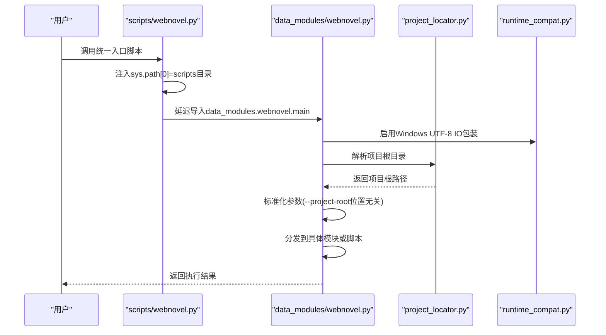
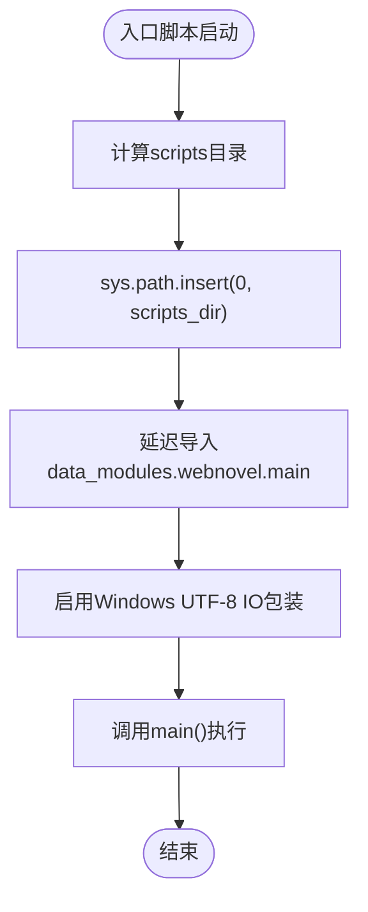
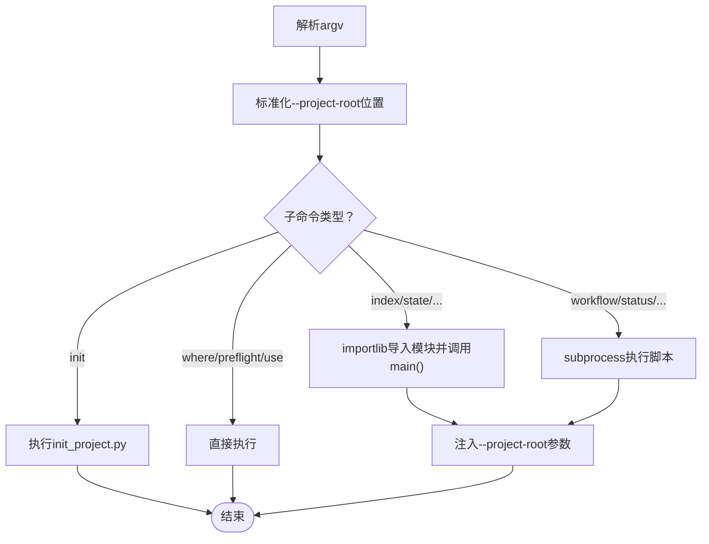
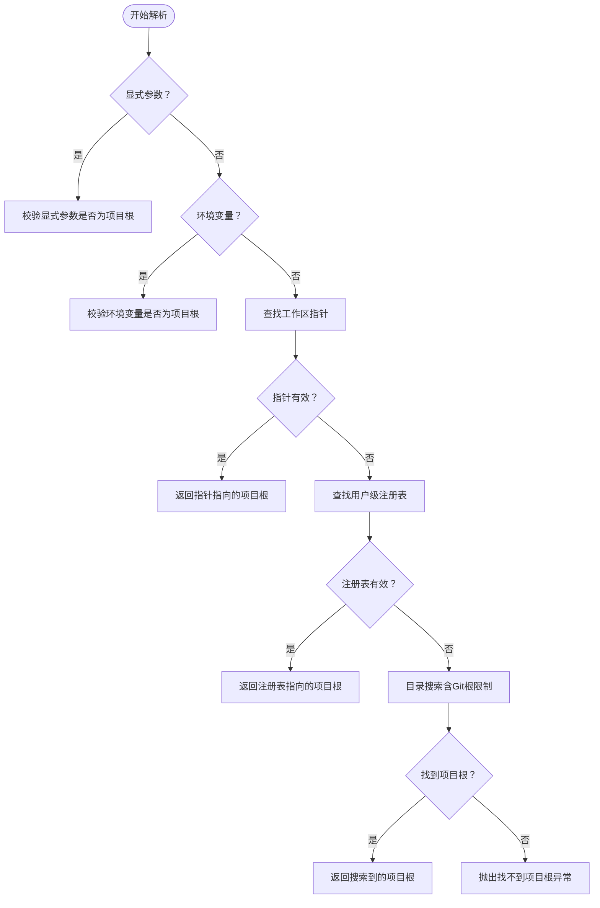
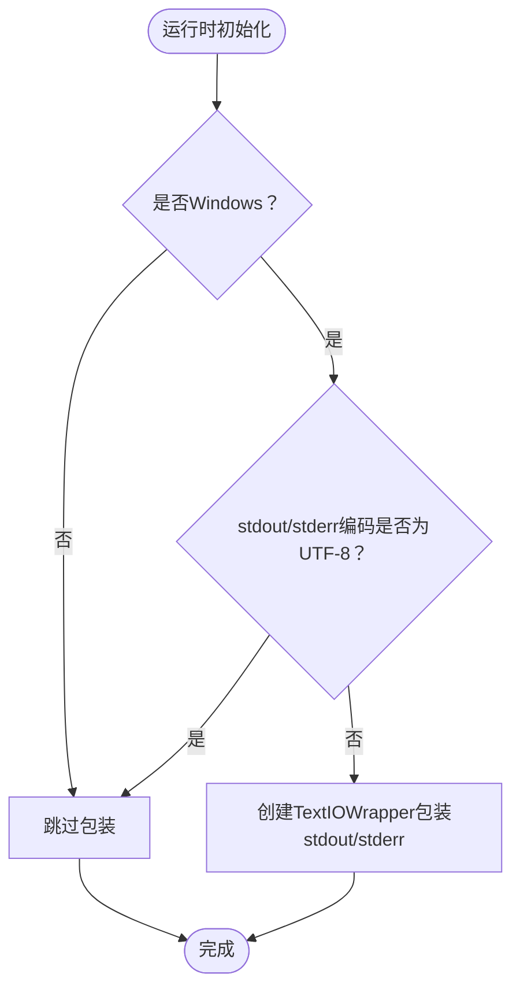
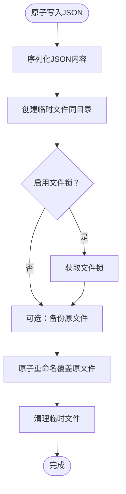
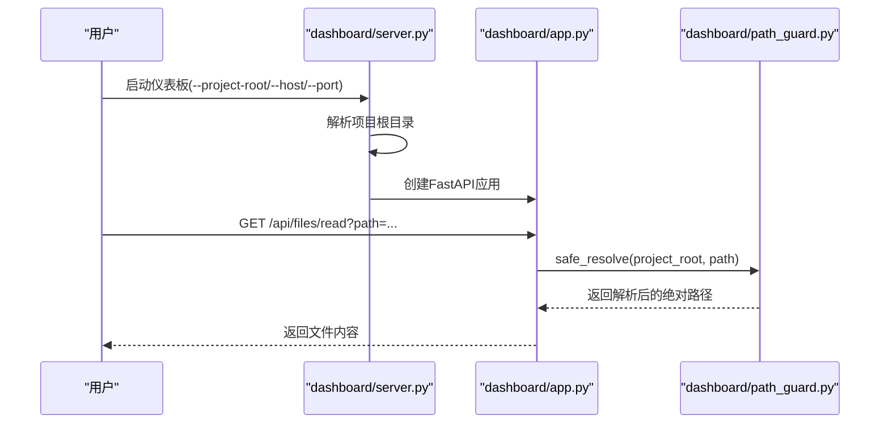
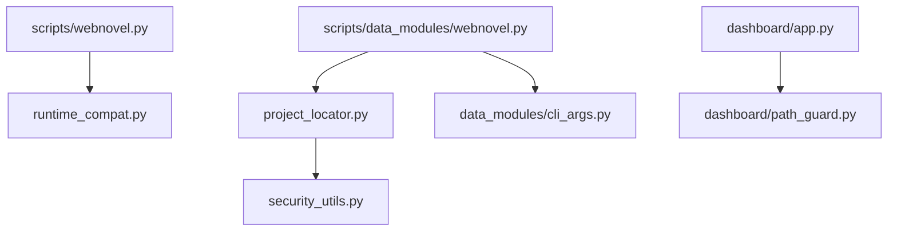

# CLI架构概览

<cite>
**本文档引用的文件**
- [webnovel.py](file://webnovel-writer/scripts/webnovel.py)
- [runtime_compat.py](file://webnovel-writer/scripts/runtime_compat.py)
- [webnovel.py](file://webnovel-writer/scripts/data_modules/webnovel.py)
- [project_locator.py](file://webnovel-writer/scripts/project_locator.py)
- [cli_args.py](file://webnovel-writer/scripts/data_modules/cli_args.py)
- [security_utils.py](file://webnovel-writer/scripts/security_utils.py)
- [server.py](file://webnovel-writer/dashboard/server.py)
- [app.py](file://webnovel-writer/dashboard/app.py)
- [path_guard.py](file://webnovel-writer/dashboard/path_guard.py)
- [__main__.py](file://webnovel-writer/dashboard/__main__.py)
- [README.md](file://README.md)
- [docs/architecture.md](file://docs/architecture.md)
- [docs/commands.md](file://docs/commands.md)
</cite>

## 目录
1. [简介](#简介)
2. [项目结构](#项目结构)
3. [核心组件](#核心组件)
4. [架构总览](#架构总览)
5. [详细组件分析](#详细组件分析)
6. [依赖关系分析](#依赖关系分析)
7. [性能考虑](#性能考虑)
8. [故障排除指南](#故障排除指南)
9. [结论](#结论)

## 简介
本文件面向Webnovel Writer的CLI架构，系统性阐述统一入口脚本设计理念、sys.path动态注入机制、项目级与用户级安装的适配策略，以及CLI初始化流程、运行时兼容性处理与模块导入策略。文档还解释了架构如何支持skills与agents在不同安装位置的调用，给出架构决策的技术考量、性能优化与扩展性设计，并提供架构图表与组件交互说明，帮助开发者快速理解CLI的整体设计思路。

## 项目结构
Webnovel Writer采用“统一入口 + 模块化转发”的CLI组织方式：
- 统一入口脚本位于scripts目录，负责动态注入sys.path并转发到data_modules模块。
- data_modules目录包含所有具体工具模块，每个模块提供独立的main()入口。
- scripts/runtime_compat.py提供跨平台运行时兼容性处理。
- scripts/project_locator.py负责项目根目录解析与工作区指针管理。
- scripts/security_utils.py提供安全工具函数，包括原子写入、路径清理等。
- dashboard子系统提供只读可视化面板，与CLI共享项目根解析逻辑。

```mermaid
graph TB
subgraph "CLI层"
A["scripts/webnovel.py<br/>统一入口"]
B["scripts/data_modules/webnovel.py<br/>统一CLI入口"]
C["scripts/runtime_compat.py<br/>运行时兼容"]
D["scripts/project_locator.py<br/>项目根解析"]
E["scripts/data_modules/cli_args.py<br/>参数兼容"]
F["scripts/security_utils.py<br/>安全工具"]
end
subgraph "数据模块层"
M1["data_modules/index_manager.py"]
M2["data_modules/state_manager.py"]
M3["data_modules/rag_adapter.py"]
M4["data_modules/style_sampler.py"]
M5["data_modules/entity_linker.py"]
M6["data_modules/context_manager.py"]
M7["data_modules/migrate_state_to_sqlite.py"]
S1["scripts/workflow_manager.py"]
S2["scripts/status_reporter.py"]
S3["scripts/update_state.py"]
S4["scripts/backup_manager.py"]
S5["scripts/archive_manager.py"]
S6["scripts/init_project.py"]
S7["scripts/extract_chapter_context.py"]
end
subgraph "仪表板层"
DA["dashboard/server.py<br/>仪表板服务"]
DB["dashboard/app.py<br/>FastAPI应用"]
DC["dashboard/path_guard.py<br/>路径防穿越"]
DD["dashboard/__main__.py"]
end
A --> B
B --> C
B --> D
B --> E
B --> F
B --> M1
B --> M2
B --> M3
B --> M4
B --> M5
B --> M6
B --> M7
B --> S1
B --> S2
B --> S3
B --> S4
B --> S5
B --> S6
B --> S7
DA --> DB
DB --> DC
```

**图表来源**
- [webnovel.py:1-37](file://webnovel-writer/scripts/webnovel.py#L1-L37)
- [webnovel.py:1-312](file://webnovel-writer/scripts/data_modules/webnovel.py#L1-L312)
- [runtime_compat.py:1-79](file://webnovel-writer/scripts/runtime_compat.py#L1-L79)
- [project_locator.py:1-430](file://webnovel-writer/scripts/project_locator.py#L1-L430)
- [cli_args.py:1-97](file://webnovel-writer/scripts/data_modules/cli_args.py#L1-L97)
- [security_utils.py:1-590](file://webnovel-writer/scripts/security_utils.py#L1-L590)
- [server.py:1-72](file://webnovel-writer/dashboard/server.py#L1-L72)
- [app.py:1-513](file://webnovel-writer/dashboard/app.py#L1-L513)
- [path_guard.py:1-29](file://webnovel-writer/dashboard/path_guard.py#L1-L29)

**章节来源**
- [webnovel.py:1-37](file://webnovel-writer/scripts/webnovel.py#L1-L37)
- [webnovel.py:1-312](file://webnovel-writer/scripts/data_modules/webnovel.py#L1-L312)
- [runtime_compat.py:1-79](file://webnovel-writer/scripts/runtime_compat.py#L1-L79)
- [project_locator.py:1-430](file://webnovel-writer/scripts/project_locator.py#L1-L430)
- [cli_args.py:1-97](file://webnovel-writer/scripts/data_modules/cli_args.py#L1-L97)
- [security_utils.py:1-590](file://webnovel-writer/scripts/security_utils.py#L1-L590)
- [server.py:1-72](file://webnovel-writer/dashboard/server.py#L1-L72)
- [app.py:1-513](file://webnovel-writer/dashboard/app.py#L1-L513)
- [path_guard.py:1-29](file://webnovel-writer/dashboard/path_guard.py#L1-L29)

## 核心组件
- 统一入口脚本：scripts/webnovel.py负责将scripts目录插入sys.path，延迟导入data_modules.webnovel.main并执行。
- 统一CLI入口：scripts/data_modules/webnovel.py提供子命令分发、参数标准化、项目根解析与模块导入策略。
- 运行时兼容：runtime_compat.py处理Windows UTF-8标准IO包装与路径规范化。
- 项目根解析：project_locator.py实现多层级解析策略，支持工作区指针、用户级注册表与环境变量。
- 参数兼容：cli_args.py提供--project-root位置无关的参数预处理。
- 安全工具：security_utils.py提供原子写入、路径清理、Git降级等安全能力。
- 仪表板：dashboard/server.py与dashboard/app.py提供只读可视化面板，共享项目根解析逻辑。

**章节来源**
- [webnovel.py:24-36](file://webnovel-writer/scripts/webnovel.py#L24-L36)
- [webnovel.py:189-308](file://webnovel-writer/scripts/data_modules/webnovel.py#L189-L308)
- [runtime_compat.py:16-79](file://webnovel-writer/scripts/runtime_compat.py#L16-L79)
- [project_locator.py:333-408](file://webnovel-writer/scripts/project_locator.py#L333-L408)
- [cli_args.py:63-75](file://webnovel-writer/scripts/data_modules/cli_args.py#L63-L75)
- [security_utils.py:345-444](file://webnovel-writer/scripts/security_utils.py#L345-L444)
- [server.py:16-67](file://webnovel-writer/dashboard/server.py#L16-L67)
- [app.py:50-489](file://webnovel-writer/dashboard/app.py#L50-L489)

## 架构总览
Webnovel Writer的CLI采用“单入口、多模块、统一转发”的设计：
- 单一入口命令：统一使用python -m data_modules.webnovel或scripts/webnovel.py，避免繁琐的python -m data_modules.xxx ...调用。
- 动态sys.path注入：入口脚本在执行前将scripts目录加入sys.path，确保模块导入的确定性。
- 项目根解析：统一解析项目根目录，支持工作区指针、用户级注册表与环境变量，兼容不同安装位置。
- 模块导入策略：通过importlib.import_module动态导入data_modules.*模块，或通过subprocess调用无main()脚本。
- 运行时兼容：在Windows环境下启用UTF-8标准IO包装，处理WSL/Git Bash路径风格。
- 安全隔离：所有写入类命令统一前置--project-root参数，确保下游模块的一致性。

**图表来源**
- [webnovel.py:24-36](file://webnovel-writer/scripts/webnovel.py#L24-L36)
- [webnovel.py:189-308](file://webnovel-writer/scripts/data_modules/webnovel.py#L189-L308)
- [runtime_compat.py:16-42](file://webnovel-writer/scripts/runtime_compat.py#L16-L42)
- [project_locator.py:333-408](file://webnovel-writer/scripts/project_locator.py#L333-L408)

**章节来源**
- [webnovel.py:24-36](file://webnovel-writer/scripts/webnovel.py#L24-L36)
- [webnovel.py:189-308](file://webnovel-writer/scripts/data_modules/webnovel.py#L189-L308)
- [runtime_compat.py:16-42](file://webnovel-writer/scripts/runtime_compat.py#L16-L42)
- [project_locator.py:333-408](file://webnovel-writer/scripts/project_locator.py#L333-L408)

## 详细组件分析

### 统一入口脚本（scripts/webnovel.py）
- 设计理念：仅负责将scripts目录加入sys.path并转发到data_modules.webnovel.main，简化调用方式。
- 关键流程：
  - 计算scripts目录并插入sys.path[0]。
  - 延迟导入data_modules.webnovel.main，避免sys.path未就绪。
  - 在Windows环境下启用UTF-8标准IO包装。
- 适配策略：支持skills/agents在项目级或用户级（~/.claude）安装时的调用。

**图表来源**
- [webnovel.py:24-36](file://webnovel-writer/scripts/webnovel.py#L24-L36)

**章节来源**
- [webnovel.py:24-36](file://webnovel-writer/scripts/webnovel.py#L24-L36)

### 统一CLI入口（scripts/data_modules/webnovel.py）
- 设计目标：单一入口命令，自动解析项目根目录，统一注入--project-root参数。
- 子命令分发：
  - index/state/rag/style/entity/context/migrate：转发到对应data_modules模块。
  - workflow/status/update-state/backup/archive：通过subprocess调用脚本。
  - init：创建项目，不依赖现有项目根。
  - where/preflight/use：直接执行，不转发。
- 参数标准化：通过normalize_global_project_root将--project-root移动到子命令前。
- 项目根注入：除init外，其余工具统一前置--project-root到下游模块。

**图表来源**
- [webnovel.py:189-308](file://webnovel-writer/scripts/data_modules/webnovel.py#L189-L308)
- [cli_args.py:63-75](file://webnovel-writer/scripts/data_modules/cli_args.py#L63-L75)

**章节来源**
- [webnovel.py:189-308](file://webnovel-writer/scripts/data_modules/webnovel.py#L189-L308)
- [cli_args.py:63-75](file://webnovel-writer/scripts/data_modules/cli_args.py#L63-L75)

### 项目根解析（scripts/project_locator.py）
- 解析策略：
  - 显式参数 > 环境变量 > 工作区指针 > 用户级注册表 > 目录搜索。
  - 支持Git仓库根目录限制，避免误解析到无关父目录。
  - 支持工作区指针与用户级注册表，兼容不同安装位置。
- 安全策略：
  - Windows路径大小写/分隔符不敏感键生成。
  - last_used兜底默认关闭，避免误命中。
  - best-effort写入，不影响主流程。

**图表来源**
- [project_locator.py:333-408](file://webnovel-writer/scripts/project_locator.py#L333-L408)

**章节来源**
- [project_locator.py:333-408](file://webnovel-writer/scripts/project_locator.py#L333-L408)

### 运行时兼容（scripts/runtime_compat.py）
- Windows UTF-8标准IO包装：在stdout/stderr缓冲区上创建TextIOWrapper，确保中文显示正确。
- 路径规范化：将Git Bash/WSL的POSIX路径转换为Windows盘符路径，提升跨平台一致性。

**图表来源**
- [runtime_compat.py:16-42](file://webnovel-writer/scripts/runtime_compat.py#L16-L42)
- [runtime_compat.py:48-79](file://webnovel-writer/scripts/runtime_compat.py#L48-L79)

**章节来源**
- [runtime_compat.py:16-42](file://webnovel-writer/scripts/runtime_compat.py#L16-L42)
- [runtime_compat.py:48-79](file://webnovel-writer/scripts/runtime_compat.py#L48-L79)

### 安全工具（scripts/security_utils.py）
- 原子写入：通过临时文件+原子重命名，防止并发冲突与数据损坏。
- 路径清理：sanitize_filename防止路径遍历攻击。
- Git降级：git_graceful_operation在Git不可用时优雅降级。
- JSON安全：atomic_write_json支持备份与文件锁，read_json_safe提供默认值与错误处理。

**图表来源**
- [security_utils.py:345-444](file://webnovel-writer/scripts/security_utils.py#L345-L444)

**章节来源**
- [security_utils.py:345-444](file://webnovel-writer/scripts/security_utils.py#L345-L444)

### 仪表板集成（dashboard/server.py, dashboard/app.py, dashboard/path_guard.py）
- 项目根解析：支持CLI参数、环境变量、工作区指针与CWD解析。
- 路径防穿越：safe_resolve确保文件读取API访问的路径位于项目根内。
- 只读API：提供项目状态、实体数据库、章节/场景、阅读力等只读查询。

**图表来源**
- [server.py:16-67](file://webnovel-writer/dashboard/server.py#L16-L67)
- [app.py:36-386](file://webnovel-writer/dashboard/app.py#L36-L386)
- [path_guard.py:11-29](file://webnovel-writer/dashboard/path_guard.py#L11-L29)

**章节来源**
- [server.py:16-67](file://webnovel-writer/dashboard/server.py#L16-L67)
- [app.py:36-386](file://webnovel-writer/dashboard/app.py#L36-L386)
- [path_guard.py:11-29](file://webnovel-writer/dashboard/path_guard.py#L11-L29)

## 依赖关系分析
- 入口脚本依赖：
  - scripts/webnovel.py依赖runtime_compat.py进行运行时兼容。
  - scripts/data_modules/webnovel.py依赖project_locator.py解析项目根，依赖cli_args.py进行参数标准化。
- 模块导入：
  - data_modules/webnovel.py通过importlib导入data_modules.*模块。
  - 对于无main()的脚本，通过subprocess调用。
- 安全依赖：
  - project_locator.py依赖security_utils.py的原子写入能力。
  - dashboard/app.py依赖path_guard.py进行路径校验。

**图表来源**
- [webnovel.py:21-36](file://webnovel-writer/scripts/webnovel.py#L21-L36)
- [webnovel.py:33-35](file://webnovel-writer/scripts/data_modules/webnovel.py#L33-L35)
- [project_locator.py:109-116](file://webnovel-writer/scripts/project_locator.py#L109-L116)
- [app.py:20-24](file://webnovel-writer/dashboard/app.py#L20-L24)

**章节来源**
- [webnovel.py:21-36](file://webnovel-writer/scripts/webnovel.py#L21-L36)
- [webnovel.py:33-35](file://webnovel-writer/scripts/data_modules/webnovel.py#L33-L35)
- [project_locator.py:109-116](file://webnovel-writer/scripts/project_locator.py#L109-L116)
- [app.py:20-24](file://webnovel-writer/dashboard/app.py#L20-L24)

## 性能考虑
- 动态sys.path注入：仅在入口阶段执行一次，成本极低。
- 延迟导入：避免不必要的模块加载，减少启动时间。
- 参数预处理：normalize_global_project_root为O(n)扫描，仅在解析argv时执行。
- 原子写入：通过临时文件与原子重命名减少磁盘竞争，提升并发安全性。
- 路径解析：工作区指针与注册表查找为O(1)哈希查找，优于全盘扫描。

[本节为一般性指导，无需特定文件分析]

## 故障排除指南
- 项目根解析失败：
  - 检查是否在项目根目录或其子目录执行。
  - 使用where命令确认解析结果。
  - 设置WEBNOVEL_PROJECT_ROOT环境变量。
- Windows终端乱码：
  - 确认已启用UTF-8标准IO包装。
  - 使用python -X utf8运行入口脚本。
- 参数位置错误：
  - 使用--project-root位置无关的调用方式。
  - 避免在子命令后遗漏--project-root。
- 路径越界访问：
  - 仪表板API会拒绝越界路径请求。
  - 检查safe_resolve逻辑与allowed_parents限制。

**章节来源**
- [webnovel.py:103-155](file://webnovel-writer/scripts/data_modules/webnovel.py#L103-L155)
- [runtime_compat.py:16-42](file://webnovel-writer/scripts/runtime_compat.py#L16-L42)
- [cli_args.py:63-75](file://webnovel-writer/scripts/data_modules/cli_args.py#L63-L75)
- [path_guard.py:11-29](file://webnovel-writer/dashboard/path_guard.py#L11-L29)

## 结论
Webnovel Writer的CLI架构通过“单一入口、动态注入、统一转发”的设计，实现了对skills与agents在不同安装位置的无缝适配。项目根解析策略兼顾了灵活性与安全性，运行时兼容处理提升了跨平台体验，模块导入策略保证了扩展性与维护性。配合安全工具与只读仪表板，整体架构在易用性、稳定性与可扩展性之间取得了良好平衡。