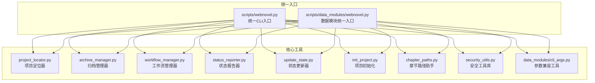
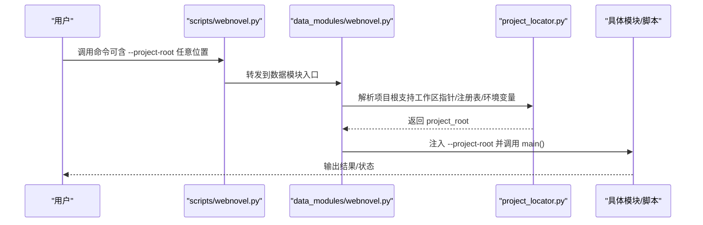
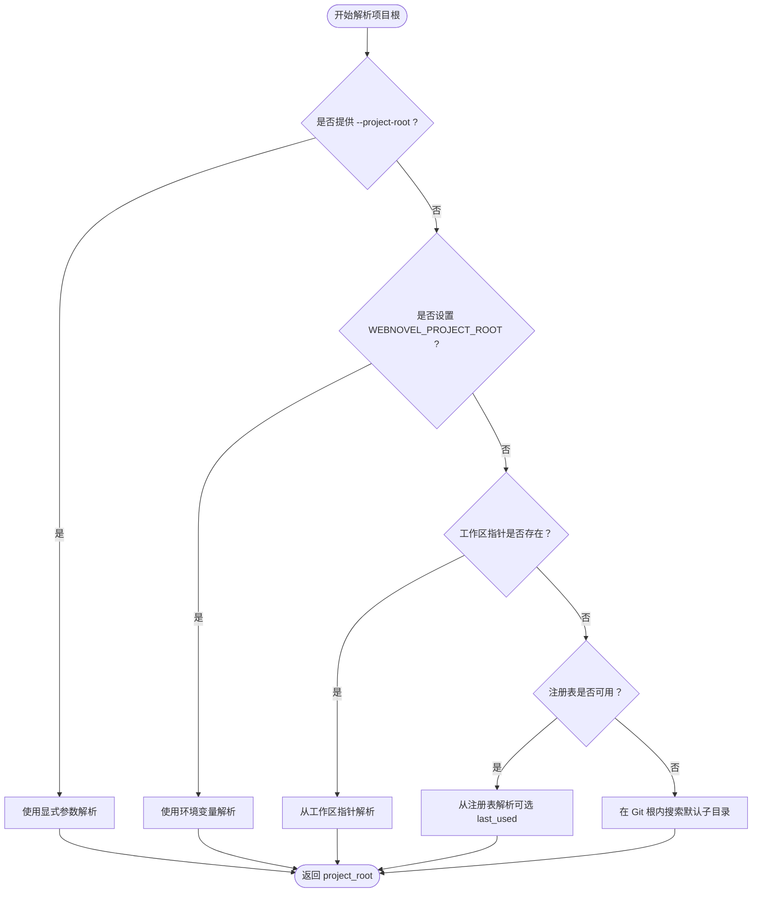
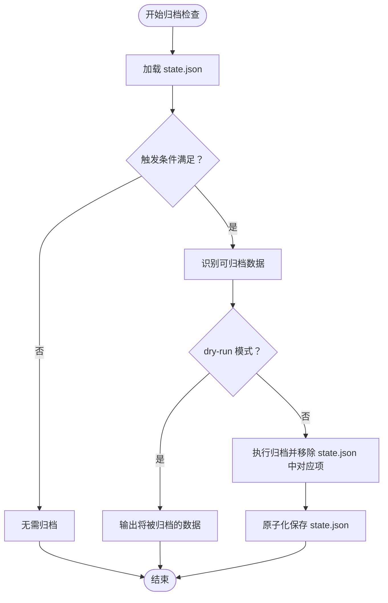
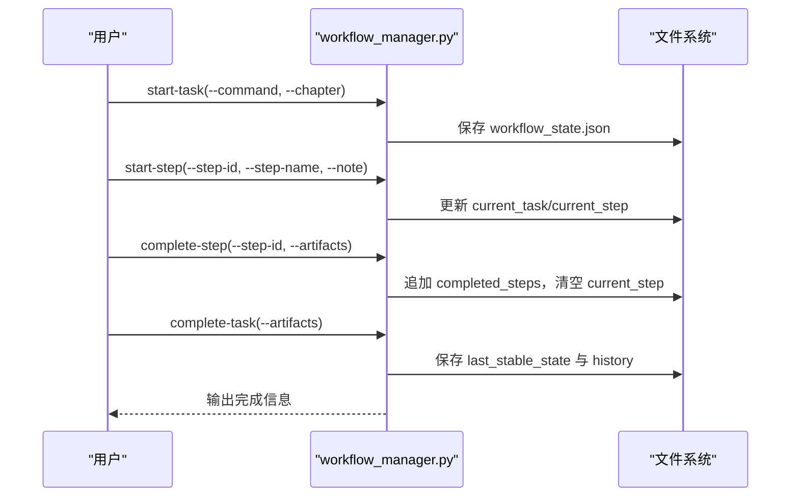
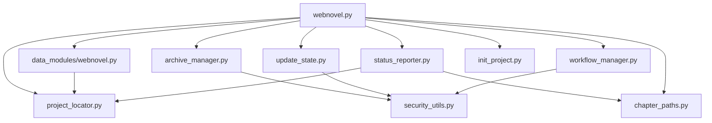

# 命令行工具

<cite>
**本文引用的文件**
- [webnovel.py](file://webnovel-writer/scripts/webnovel.py)
- [webnovel.py](file://webnovel-writer/scripts/data_modules/webnovel.py)
- [project_locator.py](file://webnovel-writer/scripts/project_locator.py)
- [archive_manager.py](file://webnovel-writer/scripts/archive_manager.py)
- [workflow_manager.py](file://webnovel-writer/scripts/workflow_manager.py)
- [status_reporter.py](file://webnovel-writer/scripts/status_reporter.py)
- [update_state.py](file://webnovel-writer/scripts/update_state.py)
- [init_project.py](file://webnovel-writer/scripts/init_project.py)
- [chapter_paths.py](file://webnovel-writer/scripts/chapter_paths.py)
- [security_utils.py](file://webnovel-writer/scripts/security_utils.py)
- [cli_args.py](file://webnovel-writer/scripts/data_modules/cli_args.py)
- [commands.md](file://docs/commands.md)
- [README.md](file://README.md)
</cite>

## 目录
1. [简介](#简介)
2. [项目结构](#项目结构)
3. [核心组件](#核心组件)
4. [架构总览](#架构总览)
5. [详细组件分析](#详细组件分析)
6. [依赖分析](#依赖分析)
7. [性能考虑](#性能考虑)
8. [故障排查指南](#故障排查指南)
9. [结论](#结论)
10. [附录](#附录)

## 简介
本文件面向系统管理员与高级用户，系统性梳理 Webnovel Writer 的命令行工具体系，涵盖统一 CLI 入口、项目定位器、数据处理工具与状态查询接口。文档重点解释：
- 统一 CLI 入口如何屏蔽路径与参数顺序差异，实现稳定可复用的调用方式；
- 项目定位器的多策略路径解析与全局注册机制；
- 归档管理器的智能归档策略与安全备份；
- 工作流管理器的任务调度与中断恢复；
- 状态报告器的可视化健康报告与指标分析；
- 更新状态工具的安全原子写入与 Schema 校验；
- 初始化脚本的项目骨架生成与 Git 集成。

## 项目结构
命令行工具主要分布在 scripts/ 与 scripts/data_modules/ 两个目录：
- scripts/webnovel.py：统一 CLI 入口，负责参数规范化、项目根解析与模块转发。
- scripts/data_modules/webnovel.py：数据模块的统一入口，面向 skills/agents 的稳定 CLI。
- scripts/project_locator.py：项目根解析与全局注册中心。
- scripts/archive_manager.py：state.json 数据归档与恢复。
- scripts/workflow_manager.py：工作流状态跟踪、步骤调度与中断恢复。
- scripts/status_reporter.py：健康报告生成与可视化图表。
- scripts/update_state.py：安全更新 state.json 的工具。
- scripts/init_project.py：项目初始化与模板生成。
- scripts/chapter_paths.py：章节文件路径解析与标题提取。
- scripts/security_utils.py：安全工具函数（原子写入、权限控制、输入清理）。
- scripts/data_modules/cli_args.py：CLI 参数兼容工具（支持 --project-root 任意位置）。

**图表来源**
- [webnovel.py:1-37](file://webnovel-writer/scripts/webnovel.py#L1-L37)
- [webnovel.py:1-312](file://webnovel-writer/scripts/data_modules/webnovel.py#L1-L312)
- [project_locator.py:1-430](file://webnovel-writer/scripts/project_locator.py#L1-L430)
- [archive_manager.py:1-568](file://webnovel-writer/scripts/archive_manager.py#L1-L568)
- [workflow_manager.py:1-823](file://webnovel-writer/scripts/workflow_manager.py#L1-L823)
- [status_reporter.py:1-1214](file://webnovel-writer/scripts/status_reporter.py#L1-L1214)
- [update_state.py:1-634](file://webnovel-writer/scripts/update_state.py#L1-L634)
- [init_project.py:1-845](file://webnovel-writer/scripts/init_project.py#L1-L845)
- [chapter_paths.py:1-156](file://webnovel-writer/scripts/chapter_paths.py#L1-L156)
- [security_utils.py:1-590](file://webnovel-writer/scripts/security_utils.py#L1-L590)
- [cli_args.py:1-97](file://webnovel-writer/scripts/data_modules/cli_args.py#L1-L97)

**章节来源**
- [webnovel.py:1-37](file://webnovel-writer/scripts/webnovel.py#L1-L37)
- [webnovel.py:1-312](file://webnovel-writer/scripts/data_modules/webnovel.py#L1-L312)
- [README.md:1-170](file://README.md#L1-L170)

## 核心组件
- 统一 CLI 入口：提供稳定命令入口，自动解析项目根，统一前置 --project-root，兼容参数位置。
- 项目定位器：多策略解析项目根目录，支持工作区指针、全局注册表与环境变量。
- 归档管理器：基于章节与文件大小的触发条件，智能归档角色、伏笔与审查报告。
- 工作流管理器：任务/步骤生命周期管理、中断检测与恢复选项、可观测性追踪。
- 状态报告器：生成健康报告，包含角色活跃度、伏笔紧急度、节奏分布与关系图。
- 状态更新器：安全原子写入 state.json，Schema 校验与备份回滚。
- 初始化脚本：生成项目骨架、模板与 Git 初始化。
- 安全工具库：原子写入、权限控制、输入清理与 Git 优雅降级。

**章节来源**
- [webnovel.py:1-37](file://webnovel-writer/scripts/webnovel.py#L1-L37)
- [webnovel.py:1-312](file://webnovel-writer/scripts/data_modules/webnovel.py#L1-L312)
- [project_locator.py:1-430](file://webnovel-writer/scripts/project_locator.py#L1-L430)
- [archive_manager.py:1-568](file://webnovel-writer/scripts/archive_manager.py#L1-L568)
- [workflow_manager.py:1-823](file://webnovel-writer/scripts/workflow_manager.py#L1-L823)
- [status_reporter.py:1-1214](file://webnovel-writer/scripts/status_reporter.py#L1-L1214)
- [update_state.py:1-634](file://webnovel-writer/scripts/update_state.py#L1-L634)
- [init_project.py:1-845](file://webnovel-writer/scripts/init_project.py#L1-L845)
- [security_utils.py:1-590](file://webnovel-writer/scripts/security_utils.py#L1-L590)

## 架构总览
统一 CLI 入口负责参数规范化与项目根解析，随后将请求转发至具体模块或脚本。数据模块入口进一步将参数标准化并注入 --project-root，确保下游模块无需关心路径解析细节。

**图表来源**
- [webnovel.py:1-37](file://webnovel-writer/scripts/webnovel.py#L1-L37)
- [webnovel.py:1-312](file://webnovel-writer/scripts/data_modules/webnovel.py#L1-L312)
- [project_locator.py:1-430](file://webnovel-writer/scripts/project_locator.py#L1-L430)

**章节来源**
- [webnovel.py:1-37](file://webnovel-writer/scripts/webnovel.py#L1-L37)
- [webnovel.py:1-312](file://webnovel-writer/scripts/data_modules/webnovel.py#L1-L312)

## 详细组件分析

### 统一 CLI 入口（scripts/webnovel.py）
- 功能要点
  - 接受 --project-root 任意位置，通过参数兼容工具规范化。
  - 解析项目根目录，统一注入 --project-root 转发给下游模块。
  - 提供 where/preflight/use 等诊断与绑定命令。
  - 将 index/state/rag/style/entity/context/migrate/workflow/status/update-state/backup/archive/extract-context/init 等子命令转发到 data_modules 或 scripts。
- 参数与行为
  - --project-root：显式指定项目根或工作区根。
  - where：打印解析出的项目根。
  - preflight：环境与项目根预检，支持 text/json 输出。
  - use：绑定当前工作区使用的书项目（写入工作区指针与全局注册表）。
  - 子命令：按需转发到 data_modules.* 或 scripts.*。
- 输出格式
  - where：纯文本路径。
  - preflight：文本或 JSON，包含各项检查结果与错误详情。
  - use：打印工作区指针与全局注册表路径（若执行）。

**章节来源**
- [webnovel.py:1-37](file://webnovel-writer/scripts/webnovel.py#L1-L37)
- [webnovel.py:1-312](file://webnovel-writer/scripts/data_modules/webnovel.py#L1-L312)

### 项目定位器（scripts/project_locator.py）
- 功能要点
  - 多策略解析项目根：显式参数、环境变量、工作区指针、全局注册表、Git 根目录、默认子目录。
  - 支持工作区根与书项目根的混合布局，兼容 .claude/ 指针与用户级注册表。
  - 提供 resolve_project_root/resolve_state_file/write_current_project_pointer/update_global_registry_current_project 等 API。
- 解析顺序与安全
  - 显式参数优先，其次环境变量，再按工作区指针与注册表回退，最后在 Git 根内搜索默认子目录。
  - 严格校验 .webnovel/state.json 存在性，避免误判。
- 全局注册表
  - 记录 workspace_root -> current_project_root 的映射，支持 last_used fallback（仅在有上下文提示时启用）。

**图表来源**
- [project_locator.py:333-408](file://webnovel-writer/scripts/project_locator.py#L333-L408)

**章节来源**
- [project_locator.py:1-430](file://webnovel-writer/scripts/project_locator.py#L1-L430)

### 归档管理器（scripts/archive_manager.py）
- 功能要点
  - 触发条件：state.json 文件大小超过阈值或每 N 章检查一次。
  - 归档对象：不活跃角色（超过阈值章未出场）、已回收伏笔（status="已回收"/resolved 且超过阈值章）、旧审查报告（超过阈值章）。
  - 安全策略：原子化写入 state.json，安全目录创建，可 dry-run 预览。
- 数据结构与复杂度
  - 识别不活跃角色：遍历 SQLite 中的角色实体，O(N)。
  - 识别已回收伏笔：遍历 plot_threads，O(M)。
  - 识别旧审查报告：解析 review_checkpoints，O(K)。
- 恢复流程
  - 从 archive/*.json 中恢复角色，更新实体状态为 active。

**图表来源**
- [archive_manager.py:409-478](file://webnovel-writer/scripts/archive_manager.py#L409-L478)

**章节来源**
- [archive_manager.py:1-568](file://webnovel-writer/scripts/archive_manager.py#L1-L568)

### 工作流管理器（scripts/workflow_manager.py）
- 功能要点
  - 任务/步骤生命周期：start-task/start-step/complete-step/complete-task/fail-task/clear。
  - 中断检测与恢复选项：根据当前步骤提供多种恢复路径（从头开始、回滚到上一章、跳过审查等）。
  - 可观测性：call_trace.jsonl 记录事件与负载。
  - 原子化保存 workflow_state.json，安全目录创建。
- 步骤序列与约束
  - webnovel-write：Step 1 → Step 2A → Step 2B → Step 3 → Step 4 → Step 5 → Step 6。
  - webnovel-review：Step 1 → Step 2 → Step 3 → Step 4 → Step 5 → Step 6 → Step 7 → Step 8。
- 清理与回滚
  - cleanup 支持高风险删除与 Git 重置，提供备份与确认机制。

**图表来源**
- [workflow_manager.py:191-363](file://webnovel-writer/scripts/workflow_manager.py#L191-L363)

**章节来源**
- [workflow_manager.py:1-823](file://webnovel-writer/scripts/workflow_manager.py#L1-L823)

### 状态报告器（scripts/status_reporter.py）
- 功能要点
  - 角色活跃度分析：统计最后出场章节与掉线状态。
  - 伏笔紧急度排序：基于层级权重与回收期限计算紧急度。
  - 爽点节奏分布：按 N 章为段统计字数/爽点密度与评级。
  - Strand Weave 节奏分析：统计 Quest/Fire/Constellation 三线占比与违规检查。
  - 人际关系图：基于 index.db 构建子图并渲染 Mermaid。
- 输出格式
  - Markdown 报告（.webnovel/health_report.md），包含表格与 Mermaid 图。
- 数据来源
  - state.json 与 SQLite index.db（IndexManager）。

**章节来源**
- [status_reporter.py:1-1214](file://webnovel-writer/scripts/status_reporter.py#L1-L1214)

### 状态更新器（scripts/update_state.py）
- 功能要点
  - 安全更新 state.json：原子写入、备份、Dry-run、Schema 校验。
  - 支持多项更新：主角状态、人际关系、伏笔、进度、卷规划、审查记录、主导情节线。
- 安全特性
  - atomic_write_json（带 filelock 与备份）。
  - 备份文件命名含时间戳，失败自动回滚。
  - 参数类型严格校验（如整数章节号）。

**章节来源**
- [update_state.py:1-634](file://webnovel-writer/scripts/update_state.py#L1-L634)
- [security_utils.py:345-444](file://webnovel-writer/scripts/security_utils.py#L345-L444)

### 项目初始化（scripts/init_project.py）
- 功能要点
  - 生成项目骨架：.webnovel/state.json、设定集、大纲、审查报告目录。
  - 模板注入：根据题材与输入参数填充模板内容。
  - Git 初始化：检测可用性后初始化并提交。
  - 写入工作区指针与全局注册表，便于后续定位。
- 输出文件
  - .webnovel/state.json、设定集/*、大纲/*、审查报告/*、.env.example、.gitignore（若启用 Git）。

**章节来源**
- [init_project.py:1-845](file://webnovel-writer/scripts/init_project.py#L1-L845)

### 章节路径助手（scripts/chapter_paths.py）
- 功能要点
  - 从文件名/大纲/章节标题提取章节号与标题。
  - 支持卷布局与扁平布局，提供默认草稿路径。
- 使用场景
  - workflow_manager 与 status_reporter 读取章节文件与标题。

**章节来源**
- [chapter_paths.py:1-156](file://webnovel-writer/scripts/chapter_paths.py#L1-L156)

### 安全工具库（scripts/security_utils.py）
- 功能要点
  - 原子写入：atomic_write_json（临时文件+原子重命名+可选备份+可选锁）。
  - 权限控制：create_secure_directory/create_secure_file（仅所有者可访问）。
  - 输入清理：sanitize_filename/sanitize_commit_message/validate_integer_input。
  - Git 优雅降级：is_git_available/is_git_repo/git_graceful_operation。
- 性能与可靠性
  - 原子写入避免并发冲突与数据损坏。
  - Windows 下权限策略与类 Unix 系统区分处理。

**章节来源**
- [security_utils.py:1-590](file://webnovel-writer/scripts/security_utils.py#L1-L590)

### 参数兼容工具（scripts/data_modules/cli_args.py）
- 功能要点
  - 将 --project-root 从任意位置提取并前置，兼容 skills/agents 的调用习惯。
  - 支持 JSON 参数的 @ 文件路径与 stdin 读取。

**章节来源**
- [cli_args.py:1-97](file://webnovel-writer/scripts/data_modules/cli_args.py#L1-L97)

## 依赖分析
- 组件耦合
  - webnovel.py 与 data_modules/webnovel.py 依赖 project_locator 解析项目根。
  - 归档/状态/工作流等工具均依赖 security_utils 的原子写入与安全目录。
  - 状态报告器依赖 IndexManager 与 SQLite 数据源。
- 外部依赖
  - filelock（可选，用于原子写入锁）。
  - Git（可选，优雅降级）。
- 循环依赖
  - 未发现循环导入；模块间通过函数调用解耦。

**图表来源**
- [webnovel.py:1-37](file://webnovel-writer/scripts/webnovel.py#L1-L37)
- [webnovel.py:1-312](file://webnovel-writer/scripts/data_modules/webnovel.py#L1-L312)
- [project_locator.py:1-430](file://webnovel-writer/scripts/project_locator.py#L1-L430)
- [archive_manager.py:1-568](file://webnovel-writer/scripts/archive_manager.py#L1-L568)
- [workflow_manager.py:1-823](file://webnovel-writer/scripts/workflow_manager.py#L1-L823)
- [status_reporter.py:1-1214](file://webnovel-writer/scripts/status_reporter.py#L1-L1214)
- [update_state.py:1-634](file://webnovel-writer/scripts/update_state.py#L1-L634)
- [init_project.py:1-845](file://webnovel-writer/scripts/init_project.py#L1-L845)
- [chapter_paths.py:1-156](file://webnovel-writer/scripts/chapter_paths.py#L1-L156)
- [security_utils.py:1-590](file://webnovel-writer/scripts/security_utils.py#L1-L590)

**章节来源**
- [webnovel.py:1-37](file://webnovel-writer/scripts/webnovel.py#L1-L37)
- [webnovel.py:1-312](file://webnovel-writer/scripts/data_modules/webnovel.py#L1-L312)

## 性能考虑
- 原子写入与锁
  - 使用 atomic_write_json 与可选 filelock，避免并发写入冲突，减少磁盘碎片与损坏风险。
- I/O 优化
  - 归档管理器仅在触发条件满足时执行，避免频繁 I/O。
  - 状态报告器对 SQLite 查询进行缓存（如阅读功率），减少重复查询。
- 路径解析
  - project_locator 限定搜索范围（Git 根内），避免跨文件系统遍历。
- 可观测性
  - workflow_manager 的 call_trace.jsonl 便于定位瓶颈与异常。

[本节为通用指导，无需特定文件引用]

## 故障排查指南
- 项目根解析失败
  - 使用 preflight 检查 scripts_dir、entry_script、skill_root 与 project_root 解析。
  - 确认 .webnovel/state.json 存在，或使用 --project-root 指定工作区根。
- 归档未触发
  - 检查 state.json 大小与当前章节数是否达到阈值；使用 --dry-run 预览将被归档的数据。
- 状态更新失败
  - 查看备份文件（.backup_TIMESTAMP.json），必要时手动回滚。
  - 确认参数类型（如章节号）与 JSON 格式。
- 工作流中断
  - 使用 detect 与 analyze_recovery_options 获取恢复选项；cleanup 支持高风险删除与 Git 重置，需 --confirm。
- 安全相关
  - 确认安全目录权限（仅所有者可访问）；检查 filelock 是否可用。
  - Git 不可用时，相关操作会优雅降级，查看提示信息。

**章节来源**
- [webnovel.py:103-154](file://webnovel-writer/scripts/webnovel.py#L103-L154)
- [archive_manager.py:409-478](file://webnovel-writer/scripts/archive_manager.py#L409-L478)
- [update_state.py:159-200](file://webnovel-writer/scripts/update_state.py#L159-L200)
- [workflow_manager.py:365-564](file://webnovel-writer/scripts/workflow_manager.py#L365-L564)
- [security_utils.py:345-444](file://webnovel-writer/scripts/security_utils.py#L345-L444)

## 结论
Webnovel Writer 的命令行工具体系以统一 CLI 入口为核心，结合项目定位器、安全工具库与各类数据处理脚本，形成稳定、可扩展且安全的 CLI 生态。通过参数兼容、原子写入、可观测性与优雅降级，系统在复杂写作流程中提供了可靠的工程化支撑。建议在生产环境中：
- 使用统一 CLI 入口与 --project-root 规范化参数。
- 对写入类操作启用备份与 Dry-run 预检。
- 借助工作流管理器与状态报告器进行过程监控与健康评估。
- 在团队协作中统一使用 preflight 与 use 命令，确保项目根一致性。

[本节为总结，无需特定文件引用]

## 附录
- 常用命令速查
  - 初始化项目：/webnovel-init（见 docs/commands.md）
  - 预检与绑定：python -X utf8 "<CLAUDE_PLUGIN_ROOT>/scripts/webnovel.py" --project-root "<WORKSPACE_ROOT>" preflight/use
  - 归档检查：python -m data_modules.webnovel archive --auto-check/--force/--dry-run
  - 状态更新：python -m data_modules.webnovel update-state ...
  - 工作流管理：python -m data_modules.webnovel workflow ...
  - 健康报告：python -m data_modules.webnovel status ...

**章节来源**
- [commands.md:1-102](file://docs/commands.md#L1-L102)
- [README.md:78-82](file://README.md#L78-L82)