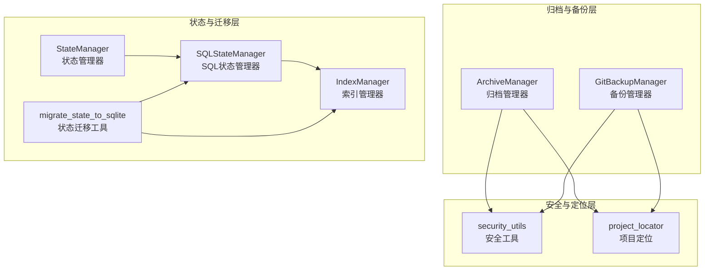
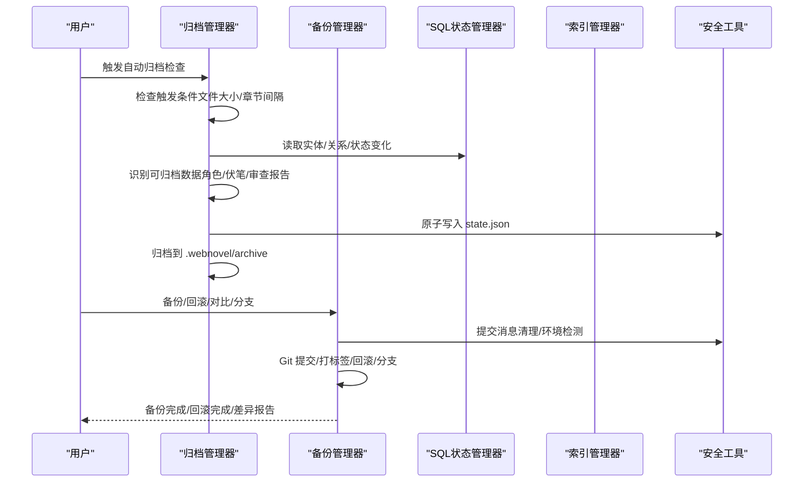
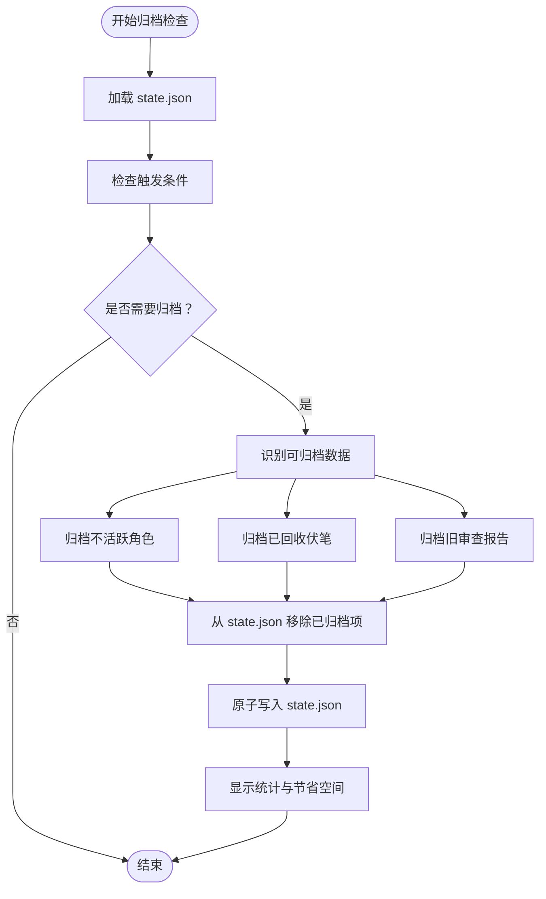
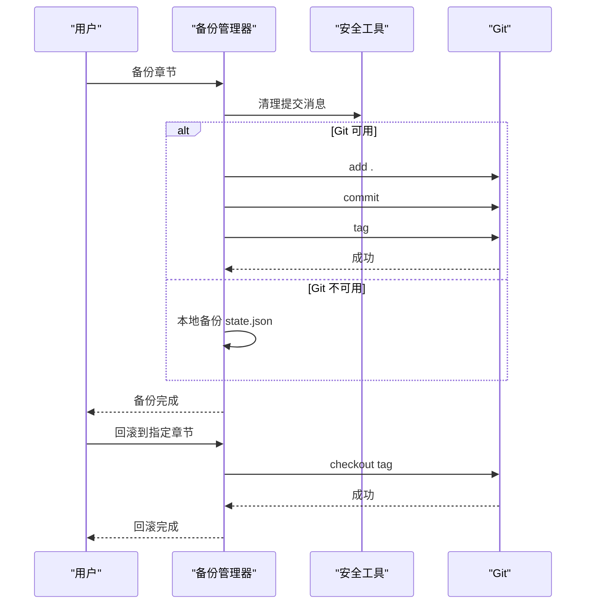
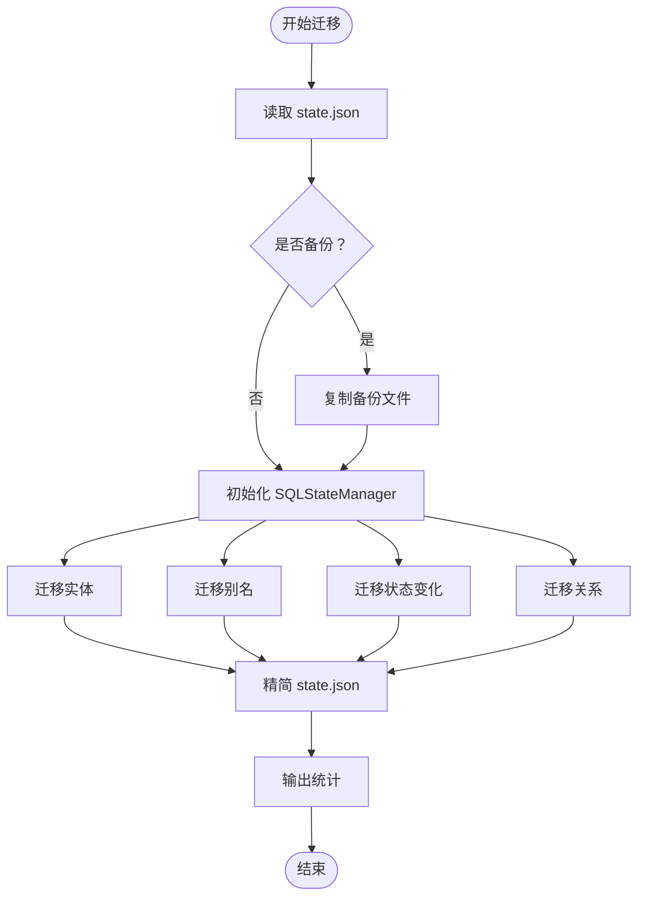
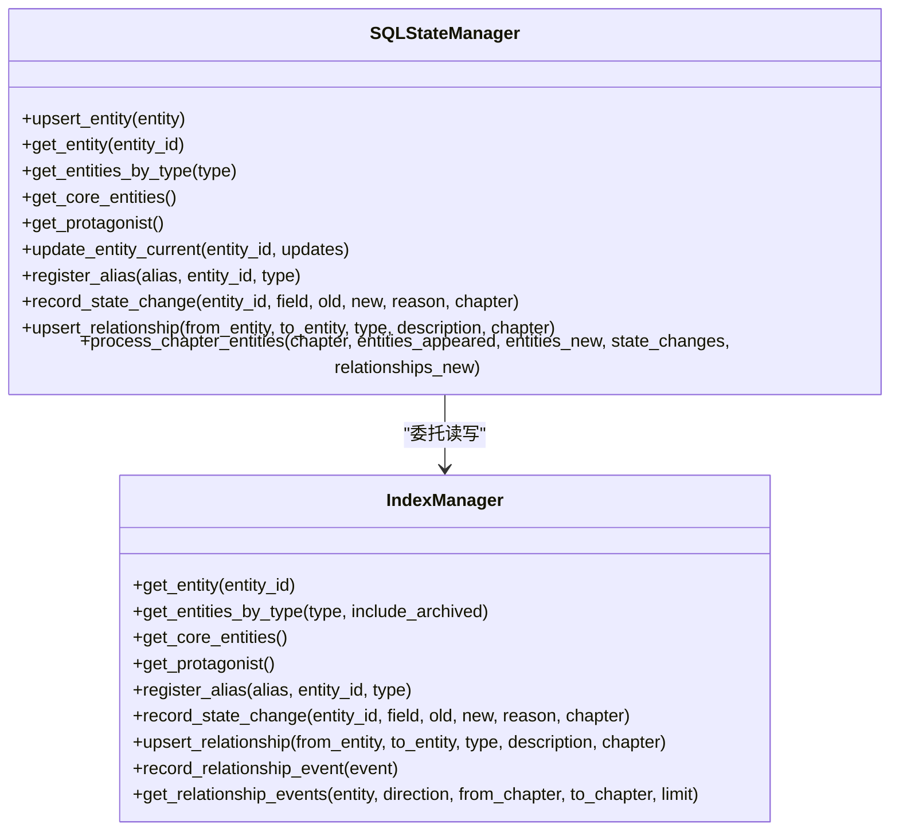
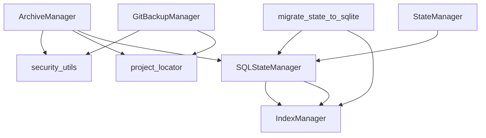

# 归档管理工具

<cite>
**本文档引用的文件**
- [archive_manager.py](file://webnovel-writer/scripts/archive_manager.py)
- [backup_manager.py](file://webnovel-writer/scripts/backup_manager.py)
- [migrate_state_to_sqlite.py](file://webnovel-writer/scripts/data_modules/migrate_state_to_sqlite.py)
- [sql_state_manager.py](file://webnovel-writer/scripts/data_modules/sql_state_manager.py)
- [index_manager.py](file://webnovel-writer/scripts/data_modules/index_manager.py)
- [security_utils.py](file://webnovel-writer/scripts/security_utils.py)
- [project_locator.py](file://webnovel-writer/scripts/project_locator.py)
- [state_manager.py](file://webnovel-writer/scripts/data_modules/state_manager.py)
- [test_archive_manager.py](file://webnovel-writer/scripts/data_modules/tests/test_archive_manager.py)
- [test_migrate_state_to_sqlite.py](file://webnovel-writer/scripts/data_modules/tests/test_migrate_state_to_sqlite.py)
</cite>

## 目录
1. [简介](#简介)
2. [项目结构](#项目结构)
3. [核心组件](#核心组件)
4. [架构总览](#架构总览)
5. [详细组件分析](#详细组件分析)
6. [依赖关系分析](#依赖关系分析)
7. [性能考量](#性能考量)
8. [故障排除指南](#故障排除指南)
9. [结论](#结论)
10. [附录](#附录)

## 简介
本文件为 Webnovel Writer 的归档管理工具提供全面的使用与维护文档。内容涵盖：
- 归档管理器的数据备份策略、触发机制与存储管理
- 备份管理器的增量备份、全量备份与恢复流程
- 状态迁移工具的 SQLite 转换过程、数据完整性保证与迁移验证机制
- 备份策略配置、存储空间管理、备份加密与安全考虑
- 灾难恢复计划、备份测试与数据修复最佳实践

本指南面向系统管理员与数据保护专员，旨在提供可靠的数据归档与恢复解决方案。

## 项目结构
归档管理工具由多个模块协同组成，围绕 state.json 的生命周期进行管理，并通过 SQLite 实现大数据的高效存储与查询。

**图表来源**
- [archive_manager.py:63-100](file://webnovel-writer/scripts/archive_manager.py#L63-L100)
- [backup_manager.py:70-88](file://webnovel-writer/scripts/backup_manager.py#L70-L88)
- [state_manager.py:90-140](file://webnovel-writer/scripts/data_modules/state_manager.py#L90-L140)
- [sql_state_manager.py:46-92](file://webnovel-writer/scripts/data_modules/sql_state_manager.py#L46-L92)
- [index_manager.py:228-234](file://webnovel-writer/scripts/data_modules/index_manager.py#L228-L234)
- [migrate_state_to_sqlite.py:39-85](file://webnovel-writer/scripts/data_modules/migrate_state_to_sqlite.py#L39-L85)
- [security_utils.py:137-173](file://webnovel-writer/scripts/security_utils.py#L137-L173)
- [project_locator.py:333-407](file://webnovel-writer/scripts/project_locator.py#L333-L407)

**章节来源**
- [archive_manager.py:1-568](file://webnovel-writer/scripts/archive_manager.py#L1-L568)
- [backup_manager.py:1-470](file://webnovel-writer/scripts/backup_manager.py#L1-L470)
- [migrate_state_to_sqlite.py:1-380](file://webnovel-writer/scripts/data_modules/migrate_state_to_sqlite.py#L1-L380)
- [sql_state_manager.py:1-595](file://webnovel-writer/scripts/data_modules/sql_state_manager.py#L1-L595)
- [index_manager.py:1-800](file://webnovel-writer/scripts/data_modules/index_manager.py#L1-L800)
- [security_utils.py:1-590](file://webnovel-writer/scripts/security_utils.py#L1-L590)
- [project_locator.py:1-430](file://webnovel-writer/scripts/project_locator.py#L1-L430)
- [state_manager.py:1-800](file://webnovel-writer/scripts/data_modules/state_manager.py#L1-L800)

## 核心组件
- 归档管理器（ArchiveManager）：负责 state.json 的智能归档、触发条件检测、归档与恢复、统计展示。
- 备份管理器（GitBackupManager）：基于 Git 的增量备份与原子性回滚，支持优雅降级至本地备份。
- 状态迁移工具（migrate_state_to_sqlite）：将 state.json 中的大数据字段迁移到 SQLite，实现精简 state.json。
- SQL状态管理器（SQLStateManager）：提供与 StateManager 兼容的接口，数据存储于 SQLite。
- 索引管理器（IndexManager）：SQLite 数据库的读写与查询接口，承载实体、别名、状态变化、关系等表。
- 安全工具（security_utils）：提供文件名清理、提交消息清理、安全目录/文件创建、原子写入、Git 环境检测等。
- 项目定位（project_locator）：统一解析项目根目录，支持工作区根目录与指针文件定位。

**章节来源**
- [archive_manager.py:63-100](file://webnovel-writer/scripts/archive_manager.py#L63-L100)
- [backup_manager.py:70-88](file://webnovel-writer/scripts/backup_manager.py#L70-L88)
- [migrate_state_to_sqlite.py:39-85](file://webnovel-writer/scripts/data_modules/migrate_state_to_sqlite.py#L39-L85)
- [sql_state_manager.py:46-92](file://webnovel-writer/scripts/data_modules/sql_state_manager.py#L46-L92)
- [index_manager.py:228-234](file://webnovel-writer/scripts/data_modules/index_manager.py#L228-L234)
- [security_utils.py:137-173](file://webnovel-writer/scripts/security_utils.py#L137-L173)
- [project_locator.py:333-407](file://webnovel-writer/scripts/project_locator.py#L333-L407)

## 架构总览
归档与备份体系采用“分层解耦 + 原子性保障”的设计原则：
- 归档层：对 state.json 中的冗余数据进行周期性归档，降低文件体积，提升运行稳定性。
- 备份层：以 Git 为核心实现增量备份与原子回滚，确保数据一致性与可追溯性。
- 迁移层：将膨胀字段迁移至 SQLite，state.json 仅保留精简数据，提高 I/O 性能。
- 安全层：通过安全工具函数统一处理输入清理、权限控制与原子写入，防止并发冲突与数据损坏。
- 定位层：统一解析项目根目录，兼容多种工作区布局与环境变量。

**图表来源**
- [archive_manager.py:409-478](file://webnovel-writer/scripts/archive_manager.py#L409-L478)
- [backup_manager.py:192-304](file://webnovel-writer/scripts/backup_manager.py#L192-L304)
- [sql_state_manager.py:267-417](file://webnovel-writer/scripts/data_modules/sql_state_manager.py#L267-L417)
- [security_utils.py:345-444](file://webnovel-writer/scripts/security_utils.py#L345-L444)

## 详细组件分析

### 归档管理器（ArchiveManager）
- 触发机制
  - 文件大小阈值：当 state.json 超过配置的 MB 数时触发。
  - 章节间隔：每 N 章检查一次，N 由配置决定。
- 归档策略
  - 不活跃角色：超过阈值章节数未出场的次要角色归档。
  - 已回收伏笔：status 为“已回收”的伏笔，超过阈值章节数后归档。
  - 旧审查报告：审查报告结束章节距当前章节数超过阈值后归档。
- 安全与可靠性
  - 使用安全目录创建函数，确保归档目录权限最小化。
  - 原子写入 state.json，支持备份与锁机制。
  - 恢复角色时更新 SQLite 实体状态，确保一致性。
- 统计与 Dry-run
  - 提供统计输出与 Dry-run 模式，便于预演与审计。

**图表来源**
- [archive_manager.py:130-147](file://webnovel-writer/scripts/archive_manager.py#L130-L147)
- [archive_manager.py:149-296](file://webnovel-writer/scripts/archive_manager.py#L149-L296)
- [archive_manager.py:298-407](file://webnovel-writer/scripts/archive_manager.py#L298-L407)
- [archive_manager.py:409-478](file://webnovel-writer/scripts/archive_manager.py#L409-L478)

**章节来源**
- [archive_manager.py:63-100](file://webnovel-writer/scripts/archive_manager.py#L63-L100)
- [archive_manager.py:130-147](file://webnovel-writer/scripts/archive_manager.py#L130-L147)
- [archive_manager.py:149-296](file://webnovel-writer/scripts/archive_manager.py#L149-L296)
- [archive_manager.py:298-407](file://webnovel-writer/scripts/archive_manager.py#L298-L407)
- [archive_manager.py:409-478](file://webnovel-writer/scripts/archive_manager.py#L409-L478)
- [archive_manager.py:479-528](file://webnovel-writer/scripts/archive_manager.py#L479-L528)
- [archive_manager.py:529-568](file://webnovel-writer/scripts/archive_manager.py#L529-L568)

### 备份管理器（GitBackupManager）
- 增量备份与原子回滚
  - 每次章节完成后自动提交，形成“章节=提交+标签”的版本模型。
  - 回滚时使用 git checkout，确保 state.json 与正文 .md 同步回滚。
- 优雅降级
  - Git 不可用时自动切换到本地备份模式，备份 state.json。
- 差异对比与分支管理
  - 支持任意版本对比与分支创建，便于“平行世界”创作与回归分析。

**图表来源**
- [backup_manager.py:192-249](file://webnovel-writer/scripts/backup_manager.py#L192-L249)
- [backup_manager.py:251-304](file://webnovel-writer/scripts/backup_manager.py#L251-L304)
- [backup_manager.py:306-335](file://webnovel-writer/scripts/backup_manager.py#L306-L335)
- [backup_manager.py:336-372](file://webnovel-writer/scripts/backup_manager.py#L336-L372)
- [backup_manager.py:373-398](file://webnovel-writer/scripts/backup_manager.py#L373-L398)
- [security_utils.py:83-134](file://webnovel-writer/scripts/security_utils.py#L83-L134)

**章节来源**
- [backup_manager.py:70-88](file://webnovel-writer/scripts/backup_manager.py#L70-L88)
- [backup_manager.py:192-249](file://webnovel-writer/scripts/backup_manager.py#L192-L249)
- [backup_manager.py:251-304](file://webnovel-writer/scripts/backup_manager.py#L251-L304)
- [backup_manager.py:306-372](file://webnovel-writer/scripts/backup_manager.py#L306-L372)
- [backup_manager.py:373-398](file://webnovel-writer/scripts/backup_manager.py#L373-L398)
- [backup_manager.py:400-470](file://webnovel-writer/scripts/backup_manager.py#L400-L470)

### 状态迁移工具（migrate_state_to_sqlite）
- 迁移范围
  - entities_v3 → entities 表
  - alias_index → aliases 表
  - state_changes → state_changes 表
  - structured_relationships → relationships 表
- 数据精简
  - 迁移后 state.json 仅保留精简字段（进度、主线状态、情节线索、关系骨架、审查检查点等）。
- 完整性与验证
  - 迁移前自动备份 state.json。
  - 提供 dry-run 与详细统计，支持错误计数与跳过条目统计。
  - 测试覆盖多种边界场景（缺失文件、非字典条目、错误分支）。

**图表来源**
- [migrate_state_to_sqlite.py:65-85](file://webnovel-writer/scripts/data_modules/migrate_state_to_sqlite.py#L65-L85)
- [migrate_state_to_sqlite.py:79-85](file://webnovel-writer/scripts/data_modules/migrate_state_to_sqlite.py#L79-L85)
- [migrate_state_to_sqlite.py:86-131](file://webnovel-writer/scripts/data_modules/migrate_state_to_sqlite.py#L86-L131)
- [migrate_state_to_sqlite.py:132-164](file://webnovel-writer/scripts/data_modules/migrate_state_to_sqlite.py#L132-L164)
- [migrate_state_to_sqlite.py:165-199](file://webnovel-writer/scripts/data_modules/migrate_state_to_sqlite.py#L165-L199)
- [migrate_state_to_sqlite.py:200-234](file://webnovel-writer/scripts/data_modules/migrate_state_to_sqlite.py#L200-L234)
- [migrate_state_to_sqlite.py:235-277](file://webnovel-writer/scripts/data_modules/migrate_state_to_sqlite.py#L235-L277)

**章节来源**
- [migrate_state_to_sqlite.py:39-85](file://webnovel-writer/scripts/data_modules/migrate_state_to_sqlite.py#L39-L85)
- [migrate_state_to_sqlite.py:86-131](file://webnovel-writer/scripts/data_modules/migrate_state_to_sqlite.py#L86-L131)
- [migrate_state_to_sqlite.py:132-164](file://webnovel-writer/scripts/data_modules/migrate_state_to_sqlite.py#L132-L164)
- [migrate_state_to_sqlite.py:165-199](file://webnovel-writer/scripts/data_modules/migrate_state_to_sqlite.py#L165-L199)
- [migrate_state_to_sqlite.py:200-234](file://webnovel-writer/scripts/data_modules/migrate_state_to_sqlite.py#L200-L234)
- [migrate_state_to_sqlite.py:235-277](file://webnovel-writer/scripts/data_modules/migrate_state_to_sqlite.py#L235-L277)
- [test_migrate_state_to_sqlite.py:28-86](file://webnovel-writer/scripts/data_modules/tests/test_migrate_state_to_sqlite.py#L28-L86)
- [test_migrate_state_to_sqlite.py:106-139](file://webnovel-writer/scripts/data_modules/tests/test_migrate_state_to_sqlite.py#L106-L139)
- [test_migrate_state_to_sqlite.py:140-168](file://webnovel-writer/scripts/data_modules/tests/test_migrate_state_to_sqlite.py#L140-L168)
- [test_migrate_state_to_sqlite.py:170-210](file://webnovel-writer/scripts/data_modules/tests/test_migrate_state_to_sqlite.py#L170-L210)

### SQL状态管理器与索引管理器
- SQL状态管理器
  - 提供与 StateManager 兼容的接口，数据存储在 SQLite。
  - 支持实体、别名、状态变化、关系的写入与查询。
  - 提供批量处理章节数据的入口，支持增量更新与出场记录。
- 索引管理器
  - 负责 SQLite 表的初始化与索引创建。
  - 提供实体、别名、状态变化、关系、债务管理、无效事实、审查指标等表的读写接口。
  - 支持关系事件与时序回放，便于图谱分析与回溯。

**图表来源**
- [sql_state_manager.py:103-139](file://webnovel-writer/scripts/data_modules/sql_state_manager.py#L103-L139)
- [sql_state_manager.py:141-177](file://webnovel-writer/scripts/data_modules/sql_state_manager.py#L141-L177)
- [sql_state_manager.py:179-189](file://webnovel-writer/scripts/data_modules/sql_state_manager.py#L179-L189)
- [sql_state_manager.py:193-215](file://webnovel-writer/scripts/data_modules/sql_state_manager.py#L193-L215)
- [sql_state_manager.py:231-251](file://webnovel-writer/scripts/data_modules/sql_state_manager.py#L231-L251)
- [sql_state_manager.py:267-417](file://webnovel-writer/scripts/data_modules/sql_state_manager.py#L267-L417)
- [index_manager.py:295-351](file://webnovel-writer/scripts/data_modules/index_manager.py#L295-L351)
- [index_manager.py:384-414](file://webnovel-writer/scripts/data_modules/index_manager.py#L384-L414)
- [index_manager.py:415-510](file://webnovel-writer/scripts/data_modules/index_manager.py#L415-L510)
- [index_manager.py:511-594](file://webnovel-writer/scripts/data_modules/index_manager.py#L511-L594)

**章节来源**
- [sql_state_manager.py:46-92](file://webnovel-writer/scripts/data_modules/sql_state_manager.py#L46-L92)
- [sql_state_manager.py:103-139](file://webnovel-writer/scripts/data_modules/sql_state_manager.py#L103-L139)
- [sql_state_manager.py:141-177](file://webnovel-writer/scripts/data_modules/sql_state_manager.py#L141-L177)
- [sql_state_manager.py:179-189](file://webnovel-writer/scripts/data_modules/sql_state_manager.py#L179-L189)
- [sql_state_manager.py:193-215](file://webnovel-writer/scripts/data_modules/sql_state_manager.py#L193-L215)
- [sql_state_manager.py:231-251](file://webnovel-writer/scripts/data_modules/sql_state_manager.py#L231-L251)
- [sql_state_manager.py:267-417](file://webnovel-writer/scripts/data_modules/sql_state_manager.py#L267-L417)
- [index_manager.py:228-234](file://webnovel-writer/scripts/data_modules/index_manager.py#L228-L234)
- [index_manager.py:295-351](file://webnovel-writer/scripts/data_modules/index_manager.py#L295-L351)
- [index_manager.py:384-414](file://webnovel-writer/scripts/data_modules/index_manager.py#L384-L414)
- [index_manager.py:415-510](file://webnovel-writer/scripts/data_modules/index_manager.py#L415-L510)
- [index_manager.py:511-594](file://webnovel-writer/scripts/data_modules/index_manager.py#L511-L594)

### 安全工具与项目定位
- 安全工具
  - 文件名清理：防止路径遍历攻击。
  - 提交消息清理：防止 Git 命令注入。
  - 安全目录/文件创建：仅所有者可访问。
  - 原子写入：防止并发冲突与数据损坏。
  - Git 环境检测：支持优雅降级。
- 项目定位
  - 统一解析项目根目录，支持工作区根目录、指针文件与全局注册表。
  - 提供 state.json 路径解析辅助。

**章节来源**
- [security_utils.py:29-81](file://webnovel-writer/scripts/security_utils.py#L29-L81)
- [security_utils.py:83-134](file://webnovel-writer/scripts/security_utils.py#L83-L134)
- [security_utils.py:137-173](file://webnovel-writer/scripts/security_utils.py#L137-L173)
- [security_utils.py:345-444](file://webnovel-writer/scripts/security_utils.py#L345-L444)
- [security_utils.py:234-333](file://webnovel-writer/scripts/security_utils.py#L234-L333)
- [project_locator.py:333-407](file://webnovel-writer/scripts/project_locator.py#L333-L407)
- [project_locator.py:410-429](file://webnovel-writer/scripts/project_locator.py#L410-L429)

## 依赖关系分析

**图表来源**
- [archive_manager.py:47-86](file://webnovel-writer/scripts/archive_manager.py#L47-L86)
- [backup_manager.py:63-64](file://webnovel-writer/scripts/backup_manager.py#L63-L64)
- [migrate_state_to_sqlite.py:35-36](file://webnovel-writer/scripts/data_modules/migrate_state_to_sqlite.py#L35-L36)
- [state_manager.py:113-117](file://webnovel-writer/scripts/data_modules/state_manager.py#L113-L117)
- [sql_state_manager.py:99-99](file://webnovel-writer/scripts/data_modules/sql_state_manager.py#L99-L99)
- [index_manager.py:228-229](file://webnovel-writer/scripts/data_modules/index_manager.py#L228-L229)

**章节来源**
- [archive_manager.py:47-86](file://webnovel-writer/scripts/archive_manager.py#L47-L86)
- [backup_manager.py:63-64](file://webnovel-writer/scripts/backup_manager.py#L63-L64)
- [migrate_state_to_sqlite.py:35-36](file://webnovel-writer/scripts/data_modules/migrate_state_to_sqlite.py#L35-L36)
- [state_manager.py:113-117](file://webnovel-writer/scripts/data_modules/state_manager.py#L113-L117)
- [sql_state_manager.py:99-99](file://webnovel-writer/scripts/data_modules/sql_state_manager.py#L99-L99)
- [index_manager.py:228-229](file://webnovel-writer/scripts/data_modules/index_manager.py#L228-L229)

## 性能考量
- 归档管理器
  - 通过阈值与间隔控制归档频率，避免频繁 I/O。
  - 归档后显著降低 state.json 体积，提升后续读写性能。
- 备份管理器
  - Git 增量存储大幅节省空间；原子回滚避免数据撕裂。
- 状态迁移
  - 将大数据迁移至 SQLite，state.json 保持极小体积，I/O 效率更高。
- 安全写入
  - 原子写入与锁机制减少并发冲突，提升稳定性。

[本节为通用性能讨论，无需具体文件分析]

## 故障排除指南
- 归档管理器
  - 触发条件未满足：检查文件大小与章节间隔配置。
  - 归档后 state.json 未更新：确认原子写入与备份机制是否生效。
  - 恢复角色失败：检查 SQLite 实体状态更新与 IndexManager 权限。
- 备份管理器
  - Git 不可用：自动降级为本地备份；检查 Git 安装与 PATH。
  - 回滚失败：确认 tag 是否存在，是否存在未提交变更。
  - 提交消息注入风险：确保使用安全工具清理提交消息。
- 状态迁移
  - 迁移前备份缺失：检查备份开关与权限。
  - 迁移错误过多：查看统计中的错误计数，定位异常条目。
  - 测试失败：参考测试用例覆盖的边界场景进行排查。

**章节来源**
- [archive_manager.py:409-478](file://webnovel-writer/scripts/archive_manager.py#L409-L478)
- [backup_manager.py:251-304](file://webnovel-writer/scripts/backup_manager.py#L251-L304)
- [backup_manager.py:306-335](file://webnovel-writer/scripts/backup_manager.py#L306-L335)
- [migrate_state_to_sqlite.py:79-85](file://webnovel-writer/scripts/data_modules/migrate_state_to_sqlite.py#L79-L85)
- [migrate_state_to_sqlite.py:200-234](file://webnovel-writer/scripts/data_modules/migrate_state_to_sqlite.py#L200-L234)
- [test_archive_manager.py:33-75](file://webnovel-writer/scripts/data_modules/tests/test_archive_manager.py#L33-L75)
- [test_migrate_state_to_sqlite.py:170-210](file://webnovel-writer/scripts/data_modules/tests/test_migrate_state_to_sqlite.py#L170-L210)

## 结论
本归档管理工具通过“归档 + 备份 + 迁移 + 安全”的组合策略，实现了对大型项目数据的高效管理与可靠保护。归档管理器降低 state.json 体积，备份管理器提供原子性回滚与增量存储，状态迁移工具将大数据迁移至 SQLite，安全工具与项目定位确保操作的安全性与一致性。配合完善的测试与监控，可为系统管理员与数据保护专员提供稳定可靠的解决方案。

[本节为总结性内容，无需具体文件分析]

## 附录

### 备份策略配置与存储管理
- 归档策略配置
  - 不活跃角色阈值、已回收伏笔阈值、旧审查报告阈值、文件大小触发阈值、章节触发间隔。
- 存储空间管理
  - 归档后 state.json 显著减小；Git 增量存储；SQLite 表按需查询，避免全量加载。
- 备份加密与安全
  - 使用安全工具进行文件名与提交消息清理，安全目录/文件创建，原子写入与锁机制。
  - Git 仓库权限与密钥管理建议遵循 Git 官方最佳实践。

**章节来源**
- [archive_manager.py:94-100](file://webnovel-writer/scripts/archive_manager.py#L94-L100)
- [security_utils.py:137-173](file://webnovel-writer/scripts/security_utils.py#L137-L173)
- [security_utils.py:345-444](file://webnovel-writer/scripts/security_utils.py#L345-L444)

### 灾难恢复计划与备份测试
- 灾难恢复
  - 使用 Git 标签与分支进行快速回滚与并行创作。
  - 本地备份作为 Git 不可用时的兜底方案。
- 备份测试
  - 归档与迁移均提供 dry-run 与详细统计，便于测试与审计。
  - 单元测试覆盖边界场景与错误分支，确保稳定性。

**章节来源**
- [backup_manager.py:336-372](file://webnovel-writer/scripts/backup_manager.py#L336-L372)
- [test_archive_manager.py:33-75](file://webnovel-writer/scripts/data_modules/tests/test_archive_manager.py#L33-L75)
- [test_migrate_state_to_sqlite.py:106-139](file://webnovel-writer/scripts/data_modules/tests/test_migrate_state_to_sqlite.py#L106-L139)
- [test_migrate_state_to_sqlite.py:170-210](file://webnovel-writer/scripts/data_modules/tests/test_migrate_state_to_sqlite.py#L170-L210)