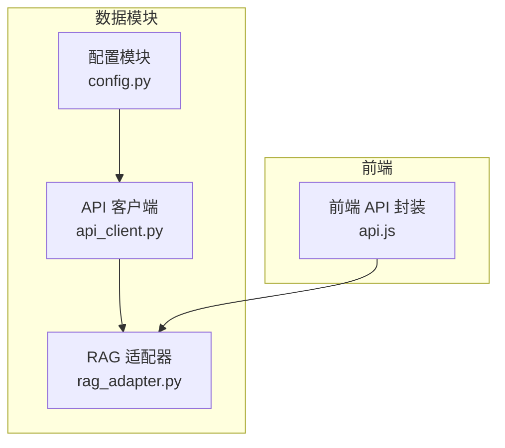
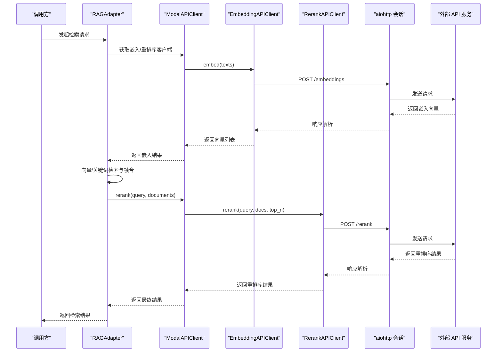
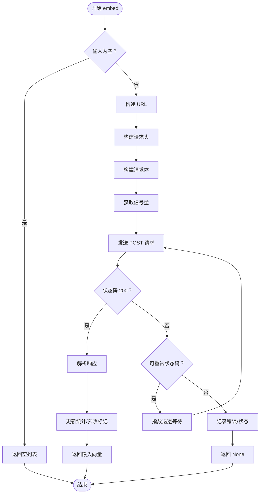
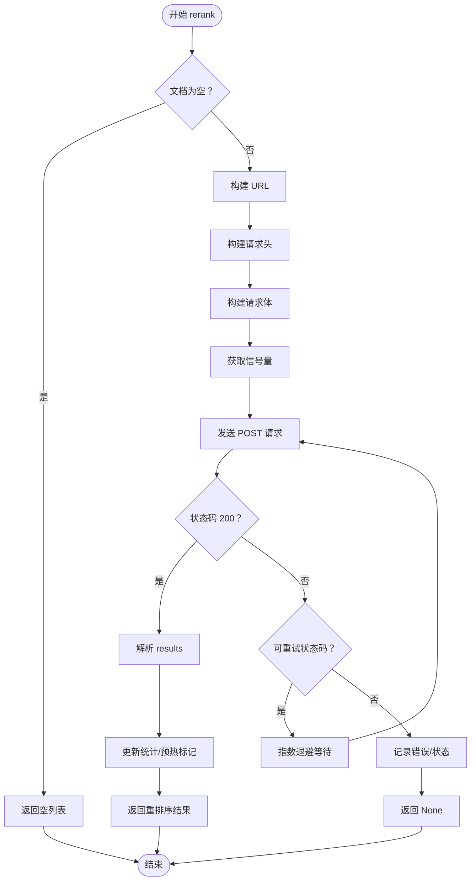
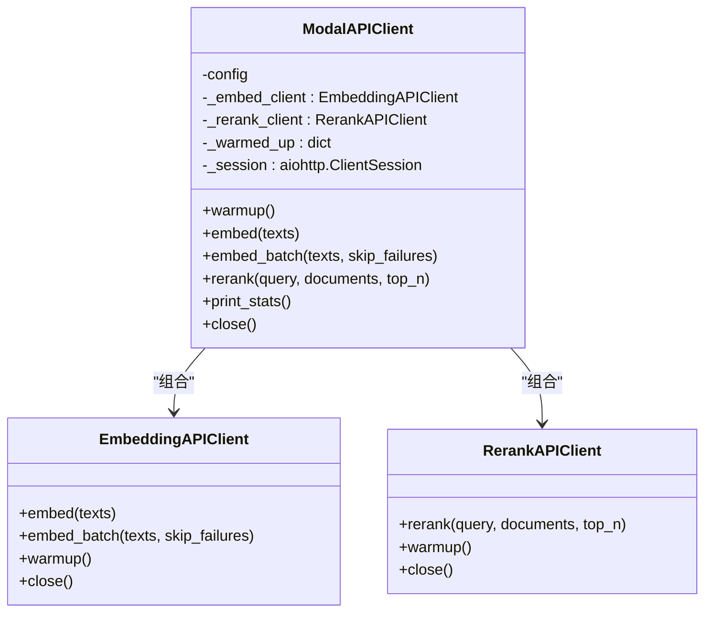
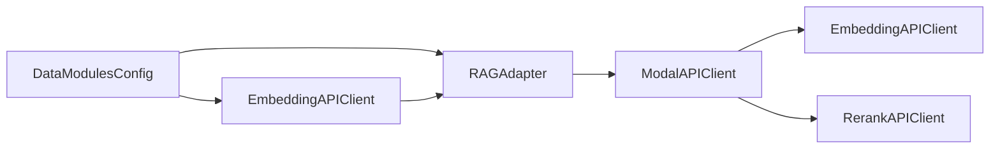

# API客户端

<cite>
**本文引用的文件**
- [api_client.py](file://webnovel-writer/scripts/data_modules/api_client.py)
- [config.py](file://webnovel-writer/scripts/data_modules/config.py)
- [rag_adapter.py](file://webnovel-writer/scripts/data_modules/rag_adapter.py)
- [api.js](file://webnovel-writer/dashboard/frontend/src/api.js)
- [test_api_client.py](file://webnovel-writer/scripts/data_modules/tests/test_api_client.py)
</cite>

## 目录
1. [简介](#简介)
2. [项目结构](#项目结构)
3. [核心组件](#核心组件)
4. [架构总览](#架构总览)
5. [详细组件分析](#详细组件分析)
6. [依赖关系分析](#依赖关系分析)
7. [性能考量](#性能考量)
8. [故障排查指南](#故障排查指南)
9. [结论](#结论)
10. [附录](#附录)

## 简介
本文件为 Webnovel Writer 的 API 客户端模块提供完整的技术文档，涵盖设计架构、HTTP 请求处理机制、认证与授权流程、端点调用方式、参数与响应结构、错误处理策略、重试机制与超时配置、初始化与连接池管理、并发控制、以及最佳实践与调试技巧。该客户端同时支持 OpenAI 兼容接口与 Modal 自定义接口，适配多种嵌入与重排序服务，并在 RAG 检索链路中被广泛使用。

## 项目结构
API 客户端位于数据模块 scripts/data_modules 下，核心文件包括：
- api_client.py：Embedding/Rerank/Modal 统一客户端实现
- config.py：配置加载与环境变量解析
- rag_adapter.py：RAG 检索适配器，内部使用 API 客户端
- api.js：前端侧 API 请求封装（与后端交互）
- test_api_client.py：单元测试，验证重试、超时、解析等行为

图表来源
- [api_client.py:1-496](file://webnovel-writer/scripts/data_modules/api_client.py#L1-L496)
- [config.py:1-349](file://webnovel-writer/scripts/data_modules/config.py#L1-L349)
- [rag_adapter.py:1-1583](file://webnovel-writer/scripts/data_modules/rag_adapter.py#L1-L1583)
- [api.js:1-78](file://webnovel-writer/dashboard/frontend/src/api.js#L1-L78)

章节来源
- [api_client.py:1-496](file://webnovel-writer/scripts/data_modules/api_client.py#L1-L496)
- [config.py:1-349](file://webnovel-writer/scripts/data_modules/config.py#L1-L349)
- [rag_adapter.py:1-1583](file://webnovel-writer/scripts/data_modules/rag_adapter.py#L1-L1583)
- [api.js:1-78](file://webnovel-writer/dashboard/frontend/src/api.js#L1-L78)

## 核心组件
- EmbeddingAPIClient：负责调用嵌入接口，支持 OpenAI 兼容与 Modal 自定义格式，内置并发与重试机制。
- RerankAPIClient：负责调用重排序接口，支持 OpenAI 兼容与 Modal 自定义格式，内置并发与重试机制。
- ModalAPIClient：统一客户端，整合 Embedding 与 Rerank 客户端，提供向后兼容的接口与统计信息。
- DataModulesConfig：集中配置项，包括 API 类型、Base URL、模型、密钥、并发、超时、重试、检索参数等。
- RAGAdapter：RAG 检索适配器，内部通过 get_client 获取 ModalAPIClient，调用嵌入与重排序完成混合检索。

章节来源
- [api_client.py:41-496](file://webnovel-writer/scripts/data_modules/api_client.py#L41-L496)
- [config.py:90-349](file://webnovel-writer/scripts/data_modules/config.py#L90-L349)
- [rag_adapter.py:68-1387](file://webnovel-writer/scripts/data_modules/rag_adapter.py#L68-L1387)

## 架构总览
API 客户端采用异步 HTTP 客户端封装，通过 aiohttp 实现连接池与并发控制；配置模块支持环境变量与 .env 文件加载；RAG 适配器在检索链路中组合嵌入、BM25、RRF 融合与重排序，形成完整的检索管线。

图表来源
- [rag_adapter.py:1156-1302](file://webnovel-writer/scripts/data_modules/rag_adapter.py#L1156-L1302)
- [api_client.py:118-195](file://webnovel-writer/scripts/data_modules/api_client.py#L118-L195)
- [api_client.py:312-383](file://webnovel-writer/scripts/data_modules/api_client.py#L312-L383)

## 详细组件分析

### 配置模块（DataModulesConfig）
- 环境变量加载：支持项目级与用户级 .env 文件，优先级为“项目级 > 用户级 > 系统环境变量”。
- API 配置项：
  - embed_api_type / embed_base_url / embed_model / embed_api_key
  - rerank_api_type / rerank_base_url / rerank_model / rerank_api_key
- 并发与批处理：embed_concurrency、rerank_concurrency、embed_batch_size
- 超时与重试：cold_start_timeout、normal_timeout、api_max_retries、api_retry_delay
- 检索参数：vector_top_k、bm25_top_k、rerank_top_n、rrf_k 等
- 其他：Graph-RAG、实体提取、上下文权重等

章节来源
- [config.py:51-77](file://webnovel-writer/scripts/data_modules/config.py#L51-L77)
- [config.py:124-166](file://webnovel-writer/scripts/data_modules/config.py#L124-L166)
- [config.py:329-349](file://webnovel-writer/scripts/data_modules/config.py#L329-L349)

### EmbeddingAPIClient
- 功能：调用嵌入接口，支持 OpenAI 兼容与 Modal 自定义格式；内置并发控制、重试与超时。
- 并发控制：通过 asyncio.Semaphore 控制最大并发数。
- 会话管理：使用 aiohttp.ClientSession，TCPConnector 限制连接数与每主机连接数。
- URL 构建：根据 embed_api_type 自动补全 /v1/embeddings 或直接使用配置 URL。
- 请求体：OpenAI 兼容格式包含 encoding_format，Modal 格式不含。
- 响应解析：OpenAI 格式按 index 排序，Modal 格式直接取 data 字段。
- 重试策略：对 429/500/502/503/504 状态码进行指数退避重试；超时与异常同样重试。
- 统计与预热：维护调用次数、耗时、错误数；warmup 预热服务。

图表来源
- [api_client.py:118-195](file://webnovel-writer/scripts/data_modules/api_client.py#L118-L195)

章节来源
- [api_client.py:41-195](file://webnovel-writer/scripts/data_modules/api_client.py#L41-L195)

### RerankAPIClient
- 功能：调用重排序接口，支持 OpenAI 兼容与 Modal 自定义格式；内置并发控制、重试与超时。
- URL 构建：根据 rerank_api_type 自动补全 /v1/rerank 或直接使用配置 URL。
- 请求体：OpenAI 兼容格式包含 query、documents、model、可选 top_n；Modal 格式包含 query、documents、可选 top_n。
- 响应解析：OpenAI 兼容格式取 results 字段；Modal 格式取 results 字段。
- 重试策略：对 429/500/502/503/504 状态码进行指数退避重试；超时与异常同样重试。

图表来源
- [api_client.py:312-383](file://webnovel-writer/scripts/data_modules/api_client.py#L312-L383)

章节来源
- [api_client.py:239-383](file://webnovel-writer/scripts/data_modules/api_client.py#L239-L383)

### ModalAPIClient（统一客户端）
- 功能：整合 EmbeddingAPIClient 与 RerankAPIClient，提供向后兼容接口；支持预热、统计与会话复用。
- 预热：并行预热嵌入与重排序服务。
- 统计：聚合两个子客户端的调用统计。
- 会话：复用嵌入客户端的 aiohttp 会话。

图表来源
- [api_client.py:390-496](file://webnovel-writer/scripts/data_modules/api_client.py#L390-L496)

章节来源
- [api_client.py:390-496](file://webnovel-writer/scripts/data_modules/api_client.py#L390-L496)

### RAGAdapter（检索适配器）
- 功能：在检索链路中调用 API 客户端，完成向量检索、BM25 检索、RRF 融合与重排序。
- 关键流程：
  - 混合检索：向量与 BM25 并行检索，RRF 融合，再调用 rerank 精排。
  - 图谱增强混合检索：基于实体关系图扩展候选，向量重算并加入图谱先验，再 rerank。
  - 降级模式：当嵌入 API 返回失败时进入降级模式，提示原因。
- 并发与性能：在大规模向量库时采用预筛选候选集，避免全表扫描。

章节来源
- [rag_adapter.py:68-1387](file://webnovel-writer/scripts/data_modules/rag_adapter.py#L68-L1387)

### 前端 API 封装（api.js）
- 功能：前端侧封装 GET/POST 请求、SSE 订阅，便于与后端交互。
- 方法：fetchJSON、postJSON、fetchFileTree、readFile、saveFile、sendChat、fetchCurrentTask、createTask、fetchTask、subscribeSSE。
- 注意：前端通过 Vite Proxy 代理到后端 FastAPI，无需关心跨域问题。

章节来源
- [api.js:1-78](file://webnovel-writer/dashboard/frontend/src/api.js#L1-L78)

## 依赖关系分析
- 配置依赖：API 客户端依赖 DataModulesConfig 提供的 Base URL、模型、密钥、并发、超时、重试等参数。
- 会话依赖：EmbeddingAPIClient 与 RerankAPIClient 共享 aiohttp.ClientSession，通过 TCPConnector 控制连接池。
- RAG 依赖：RAGAdapter 通过 get_client 获取 ModalAPIClient，在检索链路中调用嵌入与重排序。
- 测试依赖：单元测试通过 FakeSession/FakeResponse 模拟 HTTP 响应，验证重试、超时、解析等逻辑。

图表来源
- [config.py:329-349](file://webnovel-writer/scripts/data_modules/config.py#L329-L349)
- [api_client.py:390-496](file://webnovel-writer/scripts/data_modules/api_client.py#L390-L496)
- [rag_adapter.py:68-1387](file://webnovel-writer/scripts/data_modules/rag_adapter.py#L68-L1387)

章节来源
- [config.py:329-349](file://webnovel-writer/scripts/data_modules/config.py#L329-L349)
- [api_client.py:390-496](file://webnovel-writer/scripts/data_modules/api_client.py#L390-L496)
- [rag_adapter.py:68-1387](file://webnovel-writer/scripts/data_modules/rag_adapter.py#L68-L1387)

## 性能考量
- 并发控制：通过 Semaphore 控制最大并发，避免过度占用外部 API 速率限制。
- 连接池：aiohttp.TCPConnector 限制总连接数与每主机连接数，提升稳定性与吞吐。
- 批处理：embed_batch 将大批文本分批提交，降低请求开销。
- 预热：首次调用 warmup 预热服务，缩短冷启动时间。
- 大规模向量库：在 RAG 中采用预筛选候选集，避免全表扫描。
- 指数退避：对可重试错误采用指数退避，缓解瞬时拥塞。

章节来源
- [api_client.py:57-61](file://webnovel-writer/scripts/data_modules/api_client.py#L57-L61)
- [api_client.py:197-231](file://webnovel-writer/scripts/data_modules/api_client.py#L197-L231)
- [rag_adapter.py:1180-1241](file://webnovel-writer/scripts/data_modules/rag_adapter.py#L1180-L1241)

## 故障排查指南
- 认证失败（401）：RAGAdapter 会检测嵌入 API 的 last_error_status，进入降级模式并提示原因。
- 重试与超时：客户端对 429/500/502/503/504 状态码与超时进行指数退避重试；可通过 api_max_retries 与 api_retry_delay 调整。
- 响应解析：OpenAI 兼容格式按 index 排序，确保顺序正确；Modal 格式直接取 data/results 字段。
- 单元测试参考：通过测试用例验证重试、超时、解析、批处理等行为，便于定位问题。

章节来源
- [rag_adapter.py:83-89](file://webnovel-writer/scripts/data_modules/rag_adapter.py#L83-L89)
- [api_client.py:157-193](file://webnovel-writer/scripts/data_modules/api_client.py#L157-L193)
- [test_api_client.py:61-129](file://webnovel-writer/scripts/data_modules/tests/test_api_client.py#L61-L129)

## 结论
Webnovel Writer 的 API 客户端模块提供了高可用、可扩展、可重试的异步 HTTP 客户端，支持 OpenAI 兼容与 Modal 自定义接口，具备完善的并发控制、连接池管理、错误处理与重试机制。结合 RAG 适配器，实现了从嵌入、BM25、RRF 融合到重排序的完整检索链路，满足大规模文本检索与重排序需求。通过合理的配置与最佳实践，可在保证性能的同时提升系统的稳定性与可维护性。

## 附录

### API 端点与调用方式
- 嵌入接口（Embedding）
  - OpenAI 兼容：POST /v1/embeddings
  - Modal 自定义：POST 配置的 embed_base_url
  - 参数：input（文本数组）、model、encoding_format（OpenAI 兼容）
  - 响应：data（按 index 排序的向量列表）
- 重排序接口（Rerank）
  - OpenAI 兼容（Jina/Cohere）：POST /v1/rerank
  - Modal 自定义：POST 配置的 rerank_base_url
  - 参数：query、documents、model、top_n（可选）
  - 响应：results（包含 index 与 relevance_score）

章节来源
- [api_client.py:74-116](file://webnovel-writer/scripts/data_modules/api_client.py#L74-L116)
- [api_client.py:270-311](file://webnovel-writer/scripts/data_modules/api_client.py#L270-L311)

### 配置项说明
- API 类型与地址：embed_api_type、embed_base_url、rerank_api_type、rerank_base_url
- 模型与密钥：embed_model、embed_api_key、rerank_model、rerank_api_key
- 并发与批处理：embed_concurrency、rerank_concurrency、embed_batch_size
- 超时与重试：cold_start_timeout、normal_timeout、api_max_retries、api_retry_delay
- 检索参数：vector_top_k、bm25_top_k、rerank_top_n、rrf_k

章节来源
- [config.py:124-166](file://webnovel-writer/scripts/data_modules/config.py#L124-L166)

### 初始化与使用
- 初始化：通过 get_client(config) 获取单例客户端实例，内部使用 DataModulesConfig。
- 使用：在 RAGAdapter 中通过 get_client(config) 获取 ModalAPIClient，调用 embed/embed_batch 与 rerank。
- 关闭：调用 close() 关闭底层 aiohttp 会话。

章节来源
- [api_client.py:487-496](file://webnovel-writer/scripts/data_modules/api_client.py#L487-L496)
- [rag_adapter.py:71-73](file://webnovel-writer/scripts/data_modules/rag_adapter.py#L71-L73)

### 最佳实践与调试建议
- 环境变量：优先使用 .env 文件管理 API 密钥与地址，避免硬编码。
- 并发与批处理：根据外部 API 速率限制调整 embed_concurrency 与 embed_batch_size。
- 重试策略：合理设置 api_max_retries 与 api_retry_delay，避免对下游造成压力。
- 预热：在应用启动时调用 warmup，减少首次请求延迟。
- 监控：通过 print_stats 查看调用统计，及时发现异常。
- 调试：利用单元测试中的 FakeSession/FakeResponse 快速验证逻辑分支。

章节来源
- [config.py:51-77](file://webnovel-writer/scripts/data_modules/config.py#L51-L77)
- [api_client.py:476-485](file://webnovel-writer/scripts/data_modules/api_client.py#L476-L485)
- [test_api_client.py:44-59](file://webnovel-writer/scripts/data_modules/tests/test_api_client.py#L44-L59)