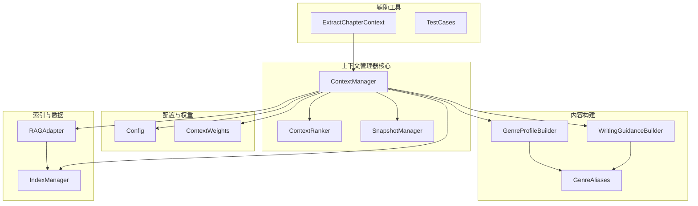
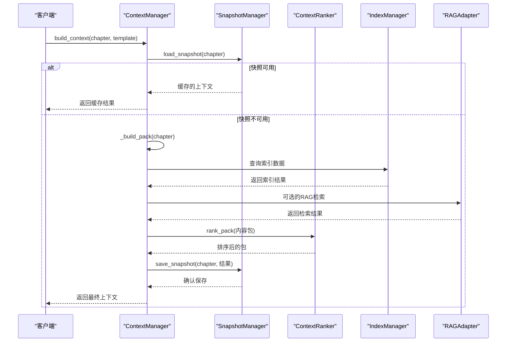
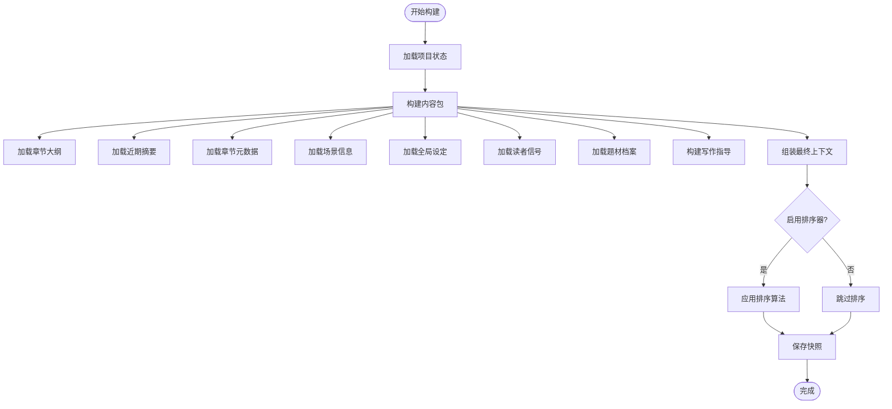
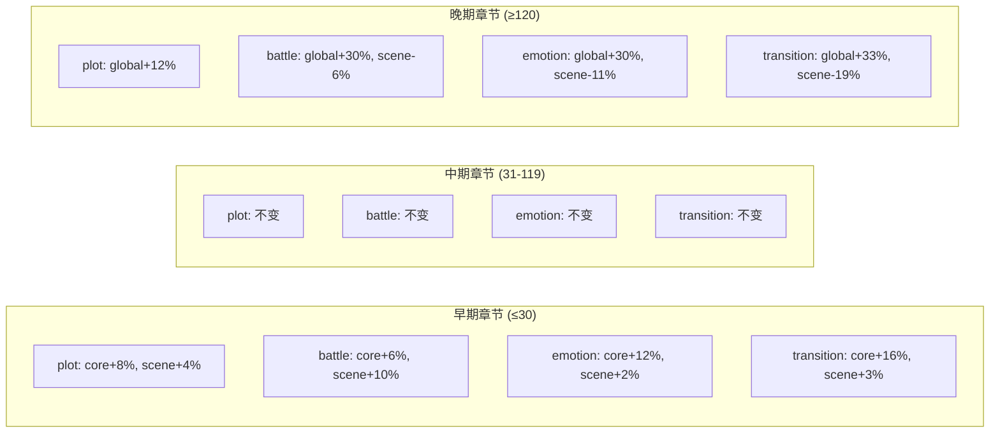
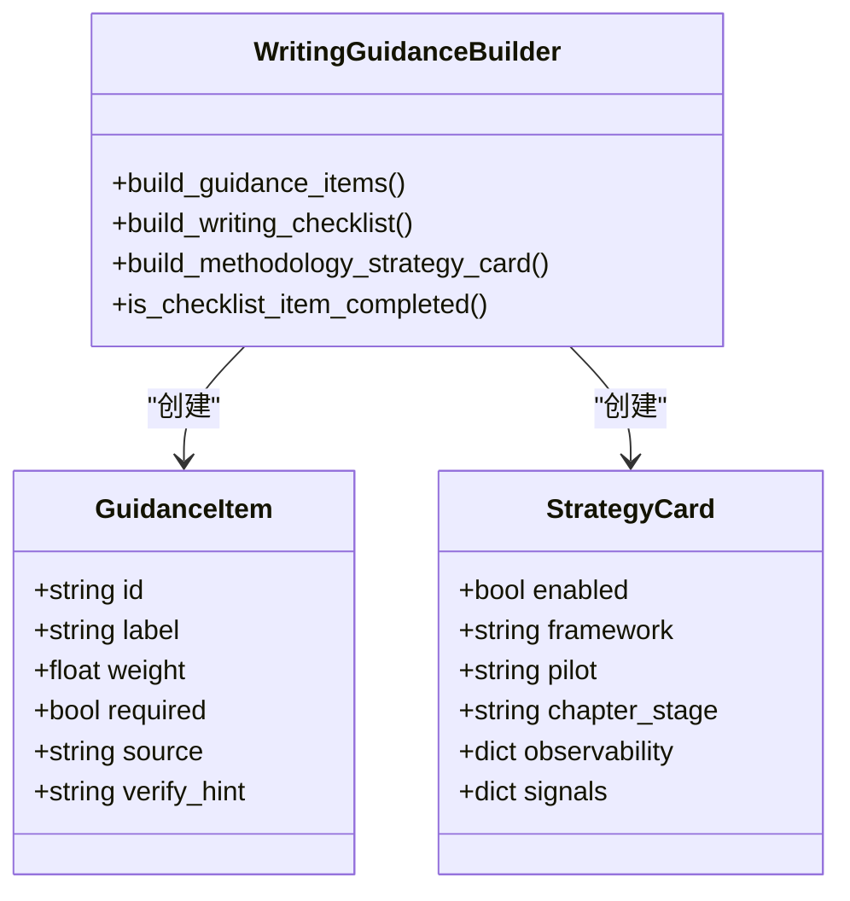
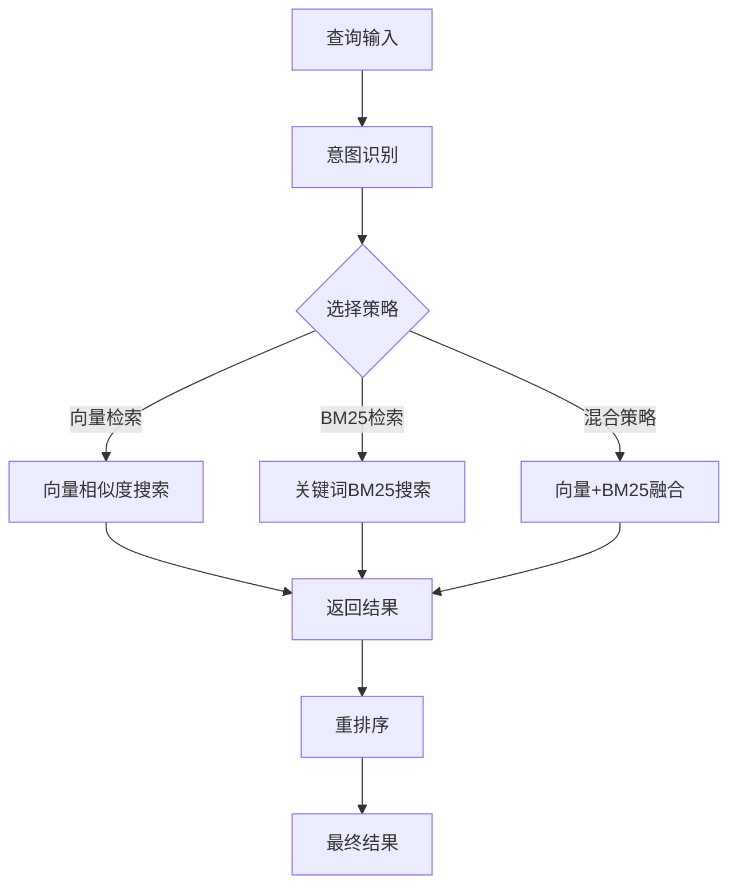
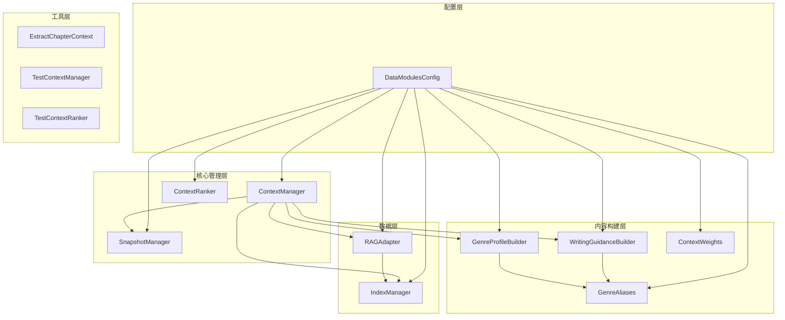

# 上下文管理器

<cite>
**本文档引用的文件**
- [context_manager.py](file://webnovel-writer/scripts/data_modules/context_manager.py)
- [context_ranker.py](file://webnovel-writer/scripts/data_modules/context_ranker.py)
- [context_weights.py](file://webnovel-writer/scripts/data_modules/context_weights.py)
- [snapshot_manager.py](file://webnovel-writer/scripts/data_modules/snapshot_manager.py)
- [writing_guidance_builder.py](file://webnovel-writer/scripts/data_modules/writing_guidance_builder.py)
- [genre_profile_builder.py](file://webnovel-writer/scripts/data_modules/genre_profile_builder.py)
- [genre_aliases.py](file://webnovel-writer/scripts/data_modules/genre_aliases.py)
- [config.py](file://webnovel-writer/scripts/data_modules/config.py)
- [index_manager.py](file://webnovel-writer/scripts/data_modules/index_manager.py)
- [rag_adapter.py](file://webnovel-writer/scripts/data_modules/rag_adapter.py)
- [extract_chapter_context.py](file://webnovel-writer/scripts/extract_chapter_context.py)
- [test_context_manager.py](file://webnovel-writer/scripts/data_modules/tests/test_context_manager.py)
- [test_context_ranker.py](file://webnovel-writer/scripts/data_modules/tests/test_context_ranker.py)
</cite>

## 目录
1. [简介](#简介)
2. [项目结构](#项目结构)
3. [核心组件](#核心组件)
4. [架构概览](#架构概览)
5. [详细组件分析](#详细组件分析)
6. [依赖关系分析](#依赖关系分析)
7. [性能考虑](#性能考虑)
8. [故障排除指南](#故障排除指南)
9. [结论](#结论)
10. [附录](#附录)

## 简介

Webnovel Writer的上下文管理器是一个高度模块化的系统，专门设计用于为网络小说创作提供智能上下文支持。该系统通过整合章节内容、角色信息、题材特征和读者反馈等多维度数据，构建出结构化的创作上下文，帮助作者在不同创作阶段获得针对性的指导和建议。

该上下文管理器的核心特点包括：
- **动态权重分配**：根据章节阶段自动调整各部分内容的权重
- **智能排序机制**：基于时间敏感性和重要性对内容进行排序
- **缓存机制**：提供快照缓存以提升性能
- **RAG集成**：支持向量检索增强的上下文获取
- **写作指导**：生成个性化的写作执行清单和建议

## 项目结构

Webnovel Writer的上下文管理器位于`scripts/data_modules/`目录下，采用模块化设计，每个功能都有独立的文件和职责分工：



**图表来源**
- [context_manager.py:1-778](file://webnovel-writer/scripts/data_modules/context_manager.py#L1-L778)
- [context_ranker.py:1-211](file://webnovel-writer/scripts/data_modules/context_ranker.py#L1-L211)
- [config.py:1-349](file://webnovel-writer/scripts/data_modules/config.py#L1-L349)

**章节来源**
- [context_manager.py:1-778](file://webnovel-writer/scripts/data_modules/context_manager.py#L1-L778)
- [config.py:1-349](file://webnovel-writer/scripts/data_modules/config.py#L1-L349)

## 核心组件

### ContextManager - 主要管理器

ContextManager是整个上下文管理系统的核心，负责协调各个组件的工作流程。它实现了以下关键功能：

- **上下文构建**：组装包含章节大纲、角色信息、世界设定等内容的完整上下文包
- **权重管理**：根据章节阶段和模板类型动态调整各部分权重
- **排序机制**：对相关内容进行智能排序，确保最重要的信息优先展示
- **缓存管理**：提供快照缓存功能，避免重复计算
- **RAG集成**：可选的向量检索增强功能

### ContextRanker - 排序器

ContextRanker实现了轻量级的确定性启发式排序算法，主要针对以下内容进行排序：

- **近期摘要**：根据章节时间和摘要长度排序
- **角色出场**：基于最后出场章节和总出场次数排序
- **故事骨架**：按章节距离和摘要长度排序
- **告警信息**：根据严重程度和关键词匹配排序

### SnapshotManager - 缓存管理器

SnapshotManager提供了完整的快照缓存机制，包括：
- **版本控制**：确保缓存兼容性
- **原子写入**：防止并发访问时的数据损坏
- **文件锁定**：使用FileLock确保线程安全
- **清理机制**：支持删除和列出缓存文件

**章节来源**
- [context_manager.py:50-131](file://webnovel-writer/scripts/data_modules/context_manager.py#L50-L131)
- [context_ranker.py:20-56](file://webnovel-writer/scripts/data_modules/context_ranker.py#L20-L56)
- [snapshot_manager.py:41-93](file://webnovel-writer/scripts/data_modules/snapshot_manager.py#L41-L93)

## 架构概览

上下文管理器采用分层架构设计，各层职责明确，耦合度低：



**图表来源**
- [context_manager.py:99-131](file://webnovel-writer/scripts/data_modules/context_manager.py#L99-L131)
- [snapshot_manager.py:70-80](file://webnovel-writer/scripts/data_modules/snapshot_manager.py#L70-L80)
- [context_ranker.py:28-56](file://webnovel-writer/scripts/data_modules/context_ranker.py#L28-L56)

## 详细组件分析

### 上下文构建流程

ContextManager的构建过程遵循严格的步骤顺序：



**图表来源**
- [context_manager.py:189-248](file://webnovel-writer/scripts/data_modules/context_manager.py#L189-L248)
- [context_manager.py:133-165](file://webnovel-writer/scripts/data_modules/context_manager.py#L133-L165)

### 权重计算策略

上下文管理器实现了复杂的权重计算机制，主要分为静态权重和动态权重两部分：

#### 静态权重模板

系统预定义了多种模板类型的权重分配方案：

| 模板类型 | 核心部分权重 | 场景部分权重 | 全局部分权重 |
|---------|-------------|-------------|-------------|
| plot | 0.40 | 0.35 | 0.25 |
| battle | 0.35 | 0.45 | 0.20 |
| emotion | 0.45 | 0.35 | 0.20 |
| transition | 0.50 | 0.25 | 0.25 |

#### 动态权重调整

权重会根据章节阶段进行调整：



**图表来源**
- [context_weights.py:19-38](file://webnovel-writer/scripts/data_modules/context_weights.py#L19-L38)
- [context_manager.py:517-542](file://webnovel-writer/scripts/data_modules/context_manager.py#L517-L542)

### 排序算法实现

ContextRanker实现了多种排序算法，每种算法针对不同类型的内容进行了优化：

#### 时间敏感性排序

对于具有明确时间戳的内容，使用指数衰减函数计算时间权重：

```
时间权重 = 1 / (1 + 章节差距)
```

#### 出场频率排序

角色出场频率使用对数缩放避免过度偏向高频角色：

```
出场权重 = min(1.0, log(1.0 + 总出场次数) / log(11.0))
```

#### 长度奖励排序

摘要和元数据的长度提供额外奖励，但设置上限防止过度偏向长文本：

```
长度权重 = min(1.0, 文本长度 / 1200.0) × 长度奖励上限
```

#### 关键词检测

系统内置了特定的关键词检测机制，为包含特定词汇的内容提供额外权重：

```python
SUMMARY_HOOK_HINTS = ("?", "？", "悬念", "钩子", "反转", "冲突")
```

**章节来源**
- [context_ranker.py:58-146](file://webnovel-writer/scripts/data_modules/context_ranker.py#L58-L146)

### 写作指导系统

写作指导系统是上下文管理器的重要组成部分，提供了个性化的创作建议：

#### 指导项目生成

系统根据读者信号、题材特征和写作策略生成具体的指导项目：



**图表来源**
- [writing_guidance_builder.py:206-275](file://webnovel-writer/scripts/data_modules/writing_guidance_builder.py#L206-L275)
- [writing_guidance_builder.py:278-449](file://webnovel-writer/scripts/data_modules/writing_guidance_builder.py#L278-L449)

#### 检查清单评分

系统实现了综合的评分机制，考虑多个维度：

```
综合评分 = 0.5 × 加权完成率 + 0.3 × 必做完成率 + 0.2 × 总完成率
```

并结合读者趋势进行调整：

```python
if 基线分数 > 0:
    score += max(-10.0, min(10.0, (score - 基线) × 0.1))
```

**章节来源**
- [writing_guidance_builder.py:423-484](file://webnovel-writer/scripts/data_modules/writing_guidance_builder.py#L423-L484)

### RAG检索集成

上下文管理器集成了RAG（Retrieval-Augmented Generation）功能，提供智能的内容检索：

#### 检索策略

系统支持多种检索策略，包括向量检索、BM25关键词检索和混合策略：



**图表来源**
- [rag_adapter.py:560-650](file://webnovel-writer/scripts/data_modules/rag_adapter.py#L560-L650)

#### 检索优化

系统实现了多项优化技术：
- **批量嵌入**：支持批量获取向量表示
- **参数分片**：避免SQLite参数数量限制
- **降级模式**：API失败时自动切换到BM25模式
- **性能监控**：记录查询性能和结果统计

**章节来源**
- [rag_adapter.py:379-484](file://webnovel-writer/scripts/data_modules/rag_adapter.py#L379-L484)

## 依赖关系分析

上下文管理器的依赖关系呈现星型结构，所有组件都依赖于Config配置：



**图表来源**
- [config.py:90-349](file://webnovel-writer/scripts/data_modules/config.py#L90-L349)
- [context_manager.py:22-44](file://webnovel-writer/scripts/data_modules/context_manager.py#L22-L44)

### 关键依赖关系

1. **配置依赖**：所有组件都依赖DataModulesConfig提供的配置参数
2. **索引依赖**：ContextManager和RAGAdapter都需要IndexManager访问数据库
3. **权重依赖**：ContextManager依赖ContextWeights定义权重模板
4. **写作指导依赖**：写作指导系统依赖题材别名映射进行个性化建议

**章节来源**
- [context_manager.py:77-81](file://webnovel-writer/scripts/data_modules/context_manager.py#L77-L81)
- [config.py:315-343](file://webnovel-writer/scripts/data_modules/config.py#L315-L343)

## 性能考虑

上下文管理器在设计时充分考虑了性能优化：

### 缓存策略

- **快照缓存**：使用原子写入和文件锁确保并发安全
- **版本控制**：支持快照版本兼容性检查
- **智能重建**：当快照不兼容时自动重建

### 查询优化

- **索引使用**：合理使用SQLite索引提高查询性能
- **批量操作**：支持批量插入和查询减少数据库往返
- **参数分片**：避免SQLite参数数量限制

### 内存管理

- **流式处理**：大文件读取采用流式方式
- **及时释放**：确保数据库连接和文件句柄及时关闭
- **内存限制**：对大型数据结构设置合理的内存限制

### 并发控制

- **文件锁**：使用FileLock防止并发访问冲突
- **超时机制**：设置合理的超时时间避免死锁
- **重试机制**：在网络异常时自动重试

## 故障排除指南

### 常见问题及解决方案

#### 快照版本不兼容

**问题症状**：加载快照时报错"快照版本不兼容"

**解决方法**：
1. 检查快照文件版本号
2. 删除不兼容的快照文件
3. 重新生成快照

#### 数据库连接问题

**问题症状**：SQLite连接失败或文件被占用

**解决方法**：
1. 确保数据库文件权限正确
2. 检查是否有其他进程占用数据库
3. 重启应用程序释放连接

#### RAG检索失败

**问题症状**：向量检索API调用失败

**解决方法**：
1. 检查API密钥配置
2. 验证网络连接
3. 查看降级模式原因
4. 切换到BM25检索模式

### 调试技巧

#### 启用调试模式

通过设置配置参数启用详细日志：
- `context_ranker_debug: True` - 启用排序器调试
- `context_compact_text_enabled: True` - 启用紧凑文本模式

#### 性能监控

使用以下方法监控系统性能：
1. 查看查询日志了解慢查询
2. 监控数据库连接池使用情况
3. 分析RAG检索性能指标

**章节来源**
- [context_manager.py:570-596](file://webnovel-writer/scripts/data_modules/context_manager.py#L570-L596)
- [snapshot_manager.py:27-32](file://webnovel-writer/scripts/data_modules/snapshot_manager.py#L27-L32)

## 结论

Webnovel Writer的上下文管理器是一个设计精良、功能完备的创作辅助系统。它通过模块化的设计、智能的排序算法和灵活的配置选项，为网络小说创作者提供了强大的上下文支持。

该系统的主要优势包括：
- **高度可配置**：通过配置文件可以轻松调整各种行为
- **智能排序**：基于时间敏感性和重要性的排序算法
- **性能优化**：完善的缓存机制和查询优化
- **扩展性强**：模块化设计便于功能扩展
- **稳定性好**：完善的错误处理和降级机制

对于内容处理和AI集成开发者来说，这个系统提供了良好的参考架构，展示了如何在实际项目中实现复杂的上下文管理功能。

## 附录

### 配置参数参考

系统提供了丰富的配置参数，主要包括：

#### 上下文权重配置
- `context_dynamic_budget_enabled`: 启用动态权重
- `context_dynamic_budget_early_chapter`: 早期章节阈值
- `context_dynamic_budget_late_chapter`: 晚期章节阈值

#### 排序器配置
- `context_ranker_recency_weight`: 时间权重系数
- `context_ranker_frequency_weight`: 频率权重系数
- `context_ranker_hook_bonus`: 钩子奖励系数

#### 写作指导配置
- `context_writing_guidance_max_items`: 最大指导项目数
- `context_writing_checklist_min_items`: 最小检查清单项目数
- `context_writing_checklist_max_items`: 最大检查清单项目数

### 开发最佳实践

1. **模块化开发**：保持每个模块职责单一
2. **配置驱动**：尽量通过配置而非硬编码实现灵活性
3. **错误处理**：完善异常处理和降级机制
4. **性能监控**：建立完善的性能监控体系
5. **测试覆盖**：编写全面的单元测试和集成测试