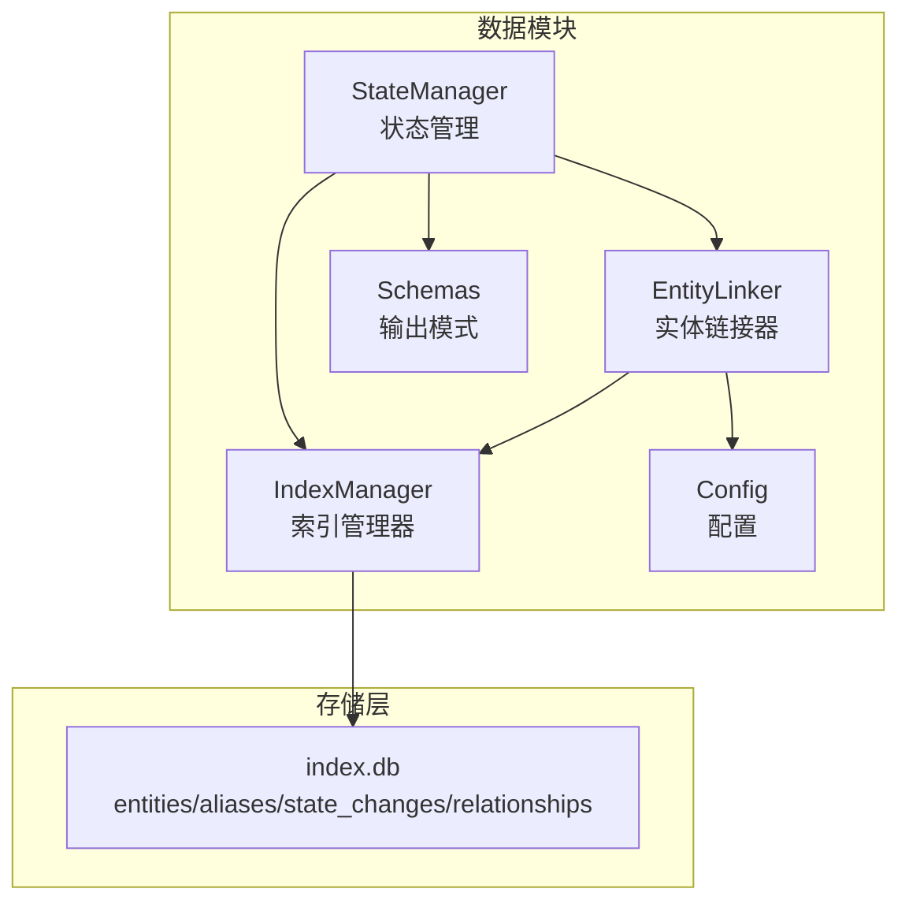
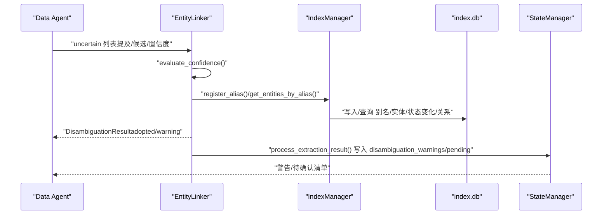
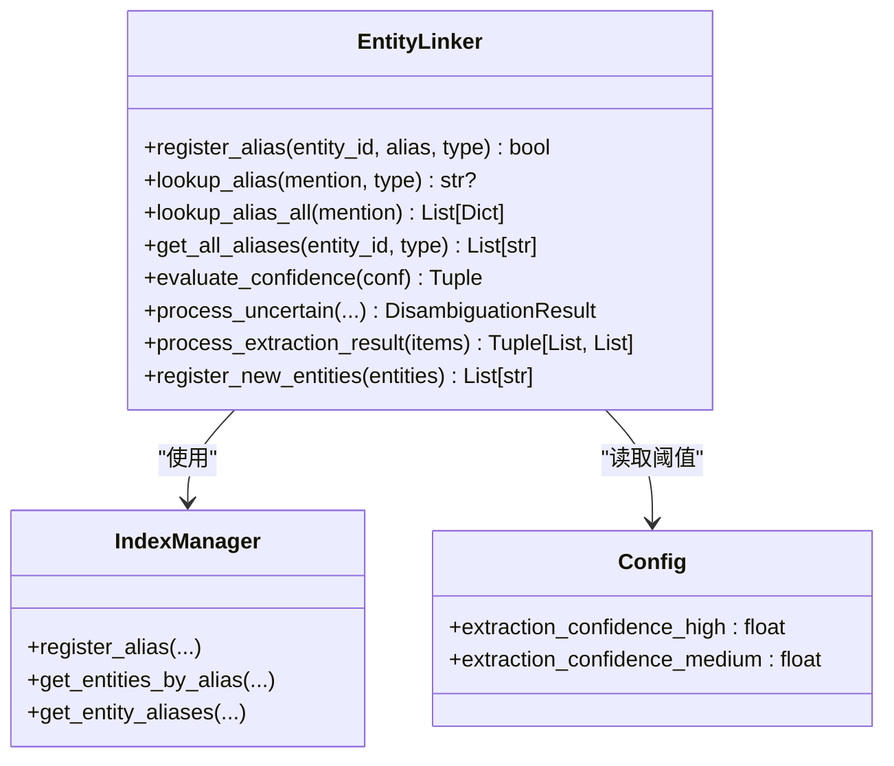
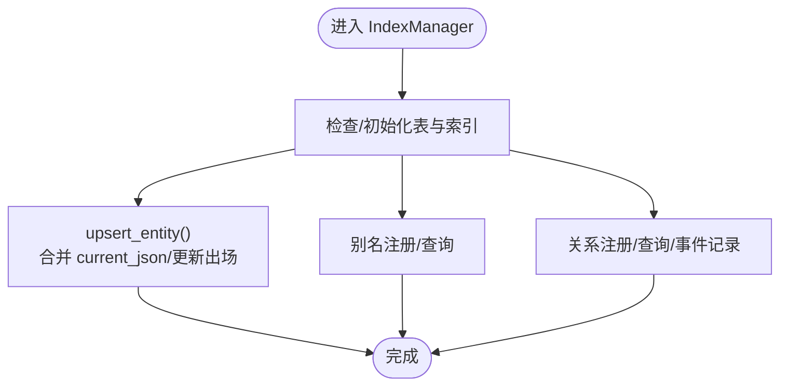
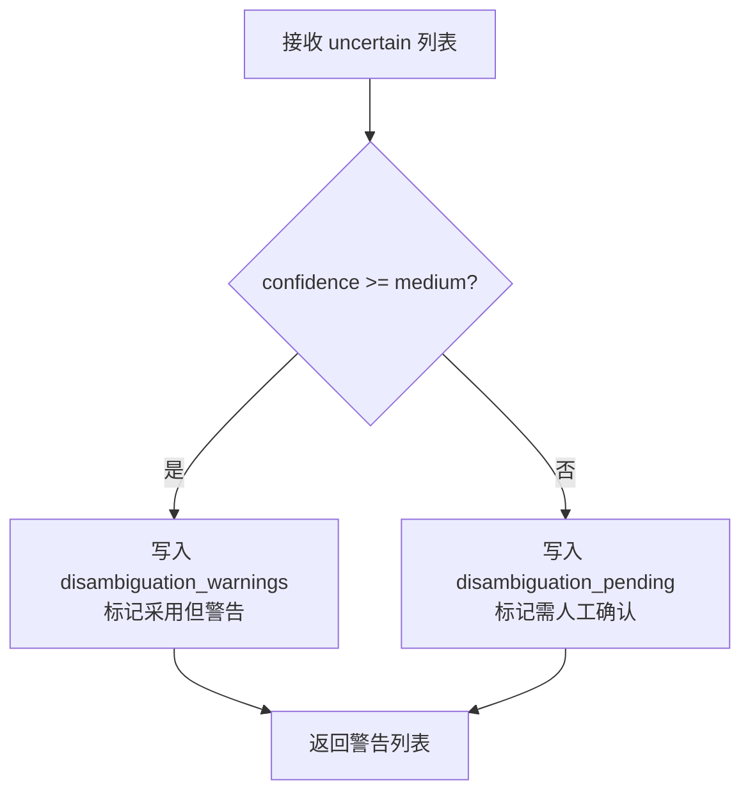
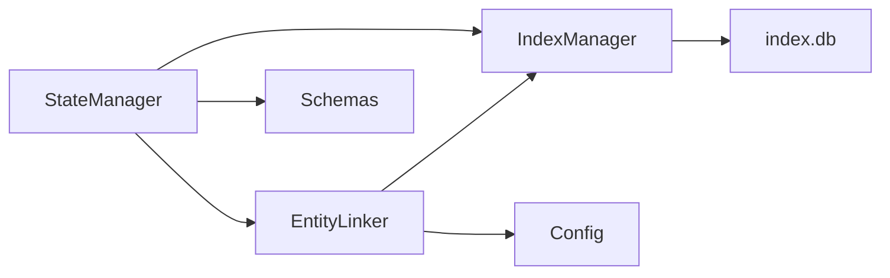

# 实体链接器

<cite>
**本文引用的文件**   
- [entity_linker.py](file://webnovel-writer/scripts/data_modules/entity_linker.py)
- [index_manager.py](file://webnovel-writer/scripts/data_modules/index_manager.py)
- [config.py](file://webnovel-writer/scripts/data_modules/config.py)
- [schemas.py](file://webnovel-writer/scripts/data_modules/schemas.py)
- [state_manager.py](file://webnovel-writer/scripts/data_modules/state_manager.py)
- [entity-management-spec.md](file://webnovel-writer/references/entity-management-spec.md)
- [test_entity_linker_cli.py](file://webnovel-writer/scripts/data_modules/tests/test_entity_linker_cli.py)
- [cli_args.py](file://webnovel-writer/scripts/data_modules/cli_args.py)
- [index_entity_mixin.py](file://webnovel-writer/scripts/data_modules/index_entity_mixin.py)
</cite>

## 目录
1. [简介](#简介)
2. [项目结构](#项目结构)
3. [核心组件](#核心组件)
4. [架构总览](#架构总览)
5. [组件详解](#组件详解)
6. [依赖关系分析](#依赖关系分析)
7. [性能考量](#性能考量)
8. [故障排查指南](#故障排查指南)
9. [结论](#结论)
10. [附录](#附录)

## 简介
本文件为 Webnovel Writer 的实体链接器提供系统化、可操作的使用与开发文档。内容涵盖：
- 实体识别与链接的技术原理、命名实体识别（NER）与实体消歧（Disambiguation）流程
- 实体数据库（index.db）的构建、维护与关系图谱能力
- 批量实体处理、增量更新与缓存策略
- 自定义实体类型、链接规则配置、置信度阈值设置等高级功能
- 最佳实践、性能优化与准确性提升策略，面向 NLP 与知识图谱开发者

## 项目结构
实体链接器位于 data_modules 子系统中，围绕 SQLite 数据库 index.db 组织实体、别名、状态变化与关系等数据，并通过配置模块统一管理阈值与检索参数。

图表来源
- [entity_linker.py:36-176](file://webnovel-writer/scripts/data_modules/entity_linker.py#L36-L176)
- [index_manager.py:228-620](file://webnovel-writer/scripts/data_modules/index_manager.py#L228-L620)
- [config.py:90-349](file://webnovel-writer/scripts/data_modules/config.py#L90-L349)
- [schemas.py:67-98](file://webnovel-writer/scripts/data_modules/schemas.py#L67-L98)
- [state_manager.py:1010-1096](file://webnovel-writer/scripts/data_modules/state_manager.py#L1010-L1096)

章节来源
- [entity_linker.py:1-275](file://webnovel-writer/scripts/data_modules/entity_linker.py#L1-L275)
- [index_manager.py:1-800](file://webnovel-writer/scripts/data_modules/index_manager.py#L1-L800)
- [config.py:1-349](file://webnovel-writer/scripts/data_modules/config.py#L1-L349)
- [schemas.py:1-126](file://webnovel-writer/scripts/data_modules/schemas.py#L1-L126)
- [state_manager.py:900-1099](file://webnovel-writer/scripts/data_modules/state_manager.py#L900-L1099)

## 核心组件
- 实体链接器（EntityLinker）
  - 负责别名注册与查询、置信度评估、不确定项处理与批量处理
  - 依赖 IndexManager 进行 SQLite 存取，依赖 Config 获取阈值
- 索引管理器（IndexManager）
  - 统一封装 index.db 的 CRUD 与查询接口，提供实体、别名、状态变化、关系等表的访问
  - 提供关系子图构建、Mermaid 渲染等图谱能力
- 配置（Config）
  - 定义实体提取置信度阈值、并发与超时、检索参数等
- 输出模式（Schemas）
  - 对 Data Agent 输出进行结构化校验与归一化
- 状态管理（StateManager）
  - 将不确定项写入 state.json 的 disambiguation_warnings/pending，驱动后续人工确认与审计

章节来源
- [entity_linker.py:36-176](file://webnovel-writer/scripts/data_modules/entity_linker.py#L36-L176)
- [index_manager.py:228-620](file://webnovel-writer/scripts/data_modules/index_manager.py#L228-L620)
- [config.py:178-181](file://webnovel-writer/scripts/data_modules/config.py#L178-L181)
- [schemas.py:67-98](file://webnovel-writer/scripts/data_modules/schemas.py#L67-L98)
- [state_manager.py:921-1008](file://webnovel-writer/scripts/data_modules/state_manager.py#L921-L1008)

## 架构总览
实体链接器在 Data Agent 产出的 uncertain 列表上进行消歧决策，并通过 IndexManager 写入 index.db，同时将需要人工确认的条目沉淀至 state.json，形成“自动-警告-人工”的三层处理链路。

图表来源
- [entity_linker.py:76-144](file://webnovel-writer/scripts/data_modules/entity_linker.py#L76-L144)
- [index_manager.py:295-350](file://webnovel-writer/scripts/data_modules/index_manager.py#L295-L350)
- [state_manager.py:921-1008](file://webnovel-writer/scripts/data_modules/state_manager.py#L921-L1008)

## 组件详解

### 实体链接器（EntityLinker）
- 别名管理
  - 注册别名：register_alias(entity_id, alias, type)
  - 查询别名：lookup_alias(mention, type?) 返回首个匹配或按类型过滤
  - 查询全部：lookup_alias_all(mention) 返回所有候选（类型+ID）
  - 列出别名：get_all_aliases(entity_id, type?)
- 置信度评估
  - evaluate_confidence(confidence) 返回 (action, adopt, warning)
  - 阈值来自配置：extraction_confidence_high、extraction_confidence_medium
- 不确定项处理
  - process_uncertain(mention, candidates, suggested, confidence, context)
  - process_extraction_result(uncertain_items) 批量处理并汇总 warnings
- 新实体注册
  - register_new_entities(new_entities) 为新实体注册主名与提及别名

图表来源
- [entity_linker.py:36-176](file://webnovel-writer/scripts/data_modules/entity_linker.py#L36-L176)
- [index_manager.py:228-620](file://webnovel-writer/scripts/data_modules/index_manager.py#L228-L620)
- [config.py:178-181](file://webnovel-writer/scripts/data_modules/config.py#L178-L181)

章节来源
- [entity_linker.py:45-176](file://webnovel-writer/scripts/data_modules/entity_linker.py#L45-L176)
- [config.py:178-181](file://webnovel-writer/scripts/data_modules/config.py#L178-L181)

### 索引管理器（IndexManager）
- 数据表与索引
  - entities、aliases、state_changes、relationships、appearance、relationship_events 等
  - 为高频查询建立索引（entities/type、aliases/alias、relationships/from/to/chapter 等）
- 实体与别名
  - upsert_entity(EntityMeta, update_metadata?) 智能合并 current_json、更新出场章节
  - get_entity/get_entities_by_type/get_core_entities/get_protagonist 查询接口
- 关系图谱
  - build_relationship_subgraph(center, depth, chapter?, top_edges)
  - render_relationship_subgraph_mermaid(graph) 渲染 Mermaid 图
- CLI 命令
  - get-entity、get-entities-by-type、get-by-alias、register-alias、get-relationships、get-relationship-events、get-relationship-graph、record-relationship-event 等

图表来源
- [index_manager.py:295-414](file://webnovel-writer/scripts/data_modules/index_manager.py#L295-L414)
- [index_entity_mixin.py:20-200](file://webnovel-writer/scripts/data_modules/index_entity_mixin.py#L20-L200)
- [index_entity_mixin.py:815-925](file://webnovel-writer/scripts/data_modules/index_entity_mixin.py#L815-L925)

章节来源
- [index_manager.py:228-620](file://webnovel-writer/scripts/data_modules/index_manager.py#L228-L620)
- [index_entity_mixin.py:20-200](file://webnovel-writer/scripts/data_modules/index_entity_mixin.py#L20-L200)
- [index_entity_mixin.py:815-925](file://webnovel-writer/scripts/data_modules/index_entity_mixin.py#L815-L925)

### 状态管理（StateManager）
- 将 uncertain 项写入 state.json 的 disambiguation_warnings 或 disambiguation_pending
- 依据阈值（extraction_confidence_medium）决定是否采用并发出警告
- 与 Data Agent 的章节处理流程衔接，同步 chapter_meta、进度与主角状态

图表来源
- [state_manager.py:921-1008](file://webnovel-writer/scripts/data_modules/state_manager.py#L921-L1008)
- [config.py:178-181](file://webnovel-writer/scripts/data_modules/config.py#L178-L181)

章节来源
- [state_manager.py:921-1008](file://webnovel-writer/scripts/data_modules/state_manager.py#L921-L1008)
- [config.py:178-181](file://webnovel-writer/scripts/data_modules/config.py#L178-L181)

### 配置与输出模式
- 配置（Config）
  - extraction_confidence_high/extraction_confidence_medium：控制自动采用与警告阈值
  - 检索与并发参数：vector_top_k、rerank_top_n、embed_concurrency 等
- 输出模式（Schemas）
  - DataAgentOutput：entities_appeared、entities_new、state_changes、relationships_new、uncertain、warnings
  - 校验与归一化：validate_data_agent_output、normalize_data_agent_output

章节来源
- [config.py:178-181](file://webnovel-writer/scripts/data_modules/config.py#L178-L181)
- [schemas.py:67-126](file://webnovel-writer/scripts/data_modules/schemas.py#L67-L126)

### CLI 与测试
- CLI
  - register-alias、lookup、lookup-all、list-aliases 等子命令
  - 支持 --project-root 任意位置传参（通过 cli_args.normalize_global_project_root）
- 测试
  - test_process_extraction_and_register_new_entities：验证批量处理与新实体注册
  - test_entity_linker_cli：覆盖别名注册、查找、列出等 CLI 行为

章节来源
- [entity_linker.py:181-275](file://webnovel-writer/scripts/data_modules/entity_linker.py#L181-L275)
- [cli_args.py:63-74](file://webnovel-writer/scripts/data_modules/cli_args.py#L63-L74)
- [test_entity_linker_cli.py:23-98](file://webnovel-writer/scripts/data_modules/tests/test_entity_linker_cli.py#L23-L98)

## 依赖关系分析
- 组件耦合
  - EntityLinker 依赖 IndexManager 与 Config，职责清晰、内聚性高
  - IndexManager 通过 Mixin 扩展章节、实体、债务、可观测性等功能，降低单体复杂度
  - StateManager 与 EntityLinker 协作，将不确定项沉淀至 state.json
- 外部依赖
  - SQLite（index.db）作为主要持久化介质
  - 环境变量（.env）注入 Embed/Rerank API 配置（非实体链接核心，但影响检索与图谱）

图表来源
- [entity_linker.py:36-176](file://webnovel-writer/scripts/data_modules/entity_linker.py#L36-L176)
- [index_manager.py:228-620](file://webnovel-writer/scripts/data_modules/index_manager.py#L228-L620)
- [state_manager.py:1010-1096](file://webnovel-writer/scripts/data_modules/state_manager.py#L1010-L1096)

章节来源
- [entity_linker.py:36-176](file://webnovel-writer/scripts/data_modules/entity_linker.py#L36-L176)
- [index_manager.py:228-620](file://webnovel-writer/scripts/data_modules/index_manager.py#L228-L620)
- [state_manager.py:1010-1096](file://webnovel-writer/scripts/data_modules/state_manager.py#L1010-L1096)

## 性能考量
- 索引与查询
  - 为 entities/type、aliases/alias、relationships/from/to/chapter 等建立索引，显著降低高频查询成本
  - 关系子图构建支持 depth/top_edges 控制扩展规模，避免 OOM 与长尾计算
- 批量处理
  - process_extraction_result 一次性处理 uncertain 列表，减少 IO 次数
  - register_new_entities 批量注册主名与提及别名，降低重复写入
- 阈值与缓存
  - 高置信度直接采用，减少人工干预与二次写入
  - state.json 仅保留精简进度与消歧记录，避免膨胀
- 并发与超时
  - 配置 embed_concurrency/rerank_concurrency/vector_top_k 等参数，平衡吞吐与稳定性

章节来源
- [index_manager.py:352-414](file://webnovel-writer/scripts/data_modules/index_manager.py#L352-L414)
- [index_entity_mixin.py:815-925](file://webnovel-writer/scripts/data_modules/index_entity_mixin.py#L815-L925)
- [config.py:144-166](file://webnovel-writer/scripts/data_modules/config.py#L144-L166)

## 故障排查指南
- 别名冲突
  - 现象：同一别名命中多个实体
  - 处理：使用 id 或补充 type 属性精确消歧
- 置信度过低
  - 现象：自动采用阈值不足，进入 disambiguation_pending
  - 处理：在 Writer/Context Agent 中审阅并选择最终实体
- CLI 参数位置
  - 现象：--project-root 放在子命令后导致 unrecognized arguments
  - 处理：使用 normalize_global_project_root 兼容任意位置
- 数据一致性
  - 现象：state.json 与 index.db 不一致
  - 处理：通过迁移脚本与 stats 命令核对，确保 SQLite 成为主数据源

章节来源
- [entity-management-spec.md:235-247](file://webnovel-writer/references/entity-management-spec.md#L235-L247)
- [state_manager.py:921-1008](file://webnovel-writer/scripts/data_modules/state_manager.py#L921-L1008)
- [cli_args.py:63-74](file://webnovel-writer/scripts/data_modules/cli_args.py#L63-L74)
- [index_manager.py:637-800](file://webnovel-writer/scripts/data_modules/index_manager.py#L637-L800)

## 结论
实体链接器通过“置信度评估 + 别名索引 + 关系图谱”的组合，实现了从 AI 提取到人工审阅的闭环。SQLite 主存储与精简 state.json 的设计，兼顾了可扩展性与运行时性能。配合阈值配置与批量处理，可在保证准确性的同时提升吞吐效率。建议在生产环境中结合关系子图与 Mermaid 可视化进行定期审计，持续优化阈值与规则。

## 附录

### 技术原理与最佳实践
- 命名实体识别（NER）
  - 基于 Data Agent 语义抽取实体与提及，结合别名表进行匹配
- 实体消歧（Disambiguation）
  - 高置信度自动采用，中置信度记录警告，低置信度人工确认
- 关系图谱
  - 基于 relationships/relationship_events 构建子图，支持按章节与类型筛选
- 自定义实体类型
  - 通过 type 字段区分“角色/地点/物品/势力/招式”，并在别名查询时按类型过滤
- 置信度阈值设置
  - extraction_confidence_high/extraction_confidence_medium 可在配置中调整
- 增量更新与缓存
  - 通过 appearance 表记录出场，结合 last_appearance/first_appearance 进行增量统计
  - state.json 仅保留消歧记录与进度，避免膨胀

章节来源
- [entity-management-spec.md:101-131](file://webnovel-writer/references/entity-management-spec.md#L101-L131)
- [config.py:178-181](file://webnovel-writer/scripts/data_modules/config.py#L178-L181)
- [index_manager.py:270-281](file://webnovel-writer/scripts/data_modules/index_manager.py#L270-L281)