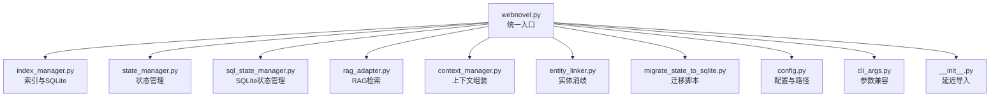
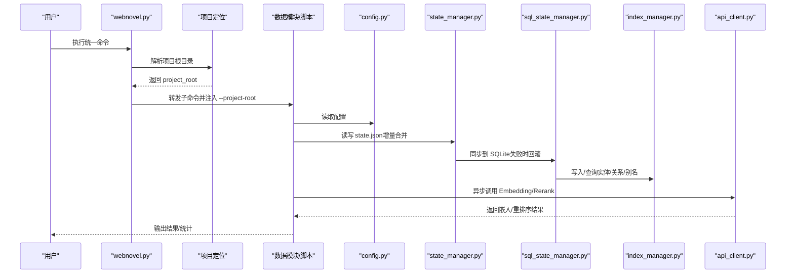
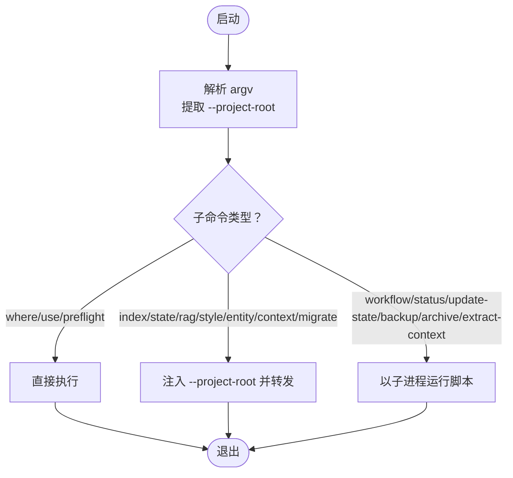
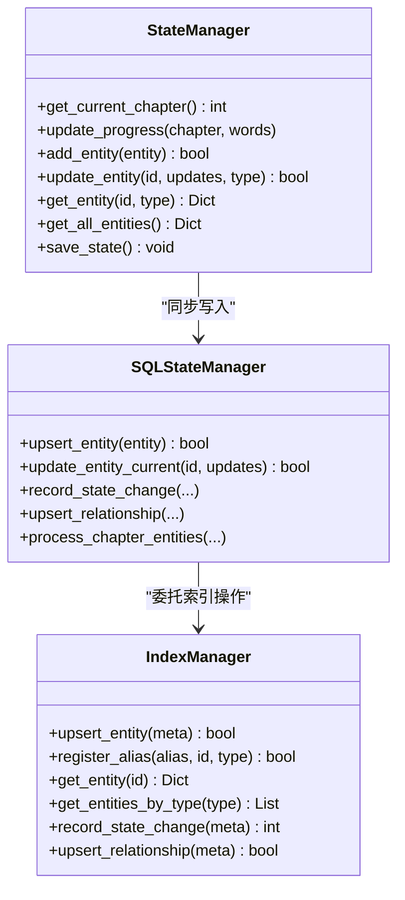
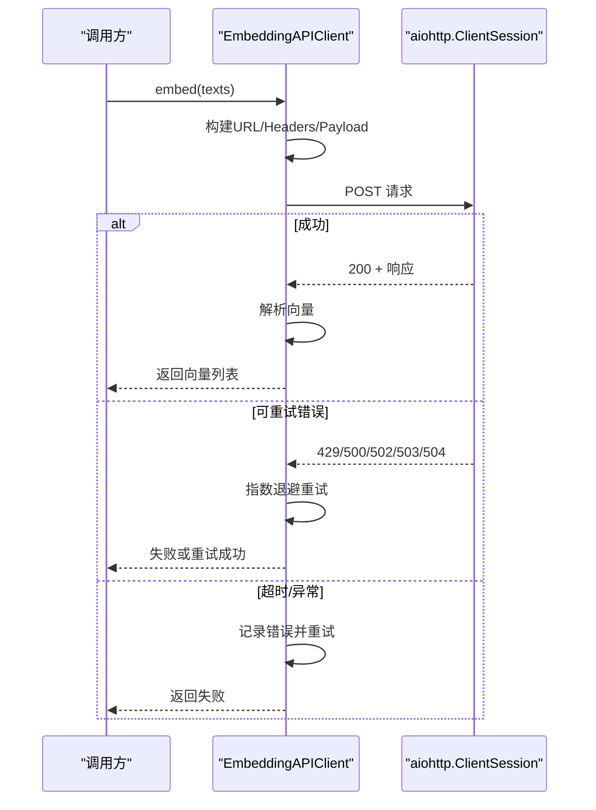
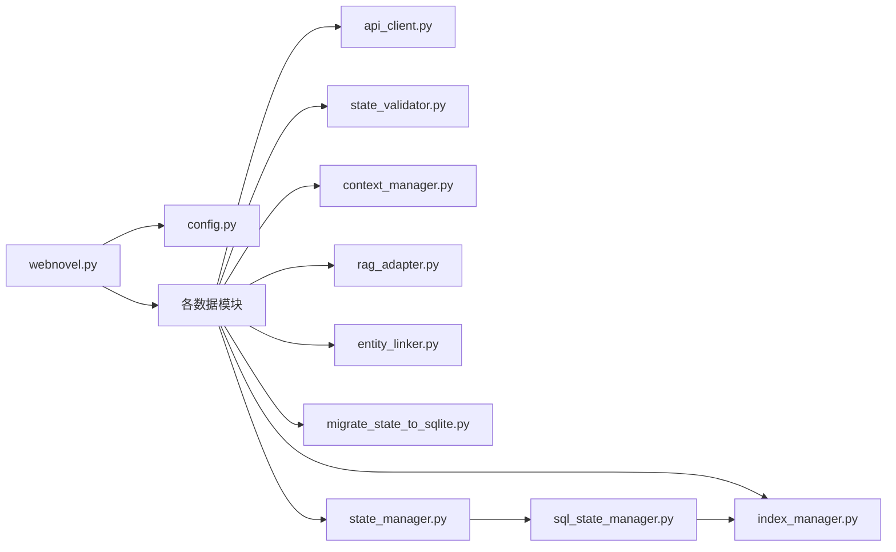

# 数据处理工具

<cite>
**本文引用的文件**
- [webnovel.py](file://webnovel-writer/scripts/data_modules/webnovel.py)
- [__init__.py](file://webnovel-writer/scripts/data_modules/__init__.py)
- [config.py](file://webnovel-writer/scripts/data_modules/config.py)
- [cli_args.py](file://webnovel-writer/scripts/data_modules/cli_args.py)
- [state_manager.py](file://webnovel-writer/scripts/data_modules/state_manager.py)
- [sql_state_manager.py](file://webnovel-writer/scripts/data_modules/sql_state_manager.py)
- [index_manager.py](file://webnovel-writer/scripts/data_modules/index_manager.py)
- [api_client.py](file://webnovel-writer/scripts/data_modules/api_client.py)
- [migrate_state_to_sqlite.py](file://webnovel-writer/scripts/data_modules/migrate_state_to_sqlite.py)
- [state_validator.py](file://webnovel-writer/scripts/data_modules/state_validator.py)
- [context_manager.py](file://webnovel-writer/scripts/data_modules/context_manager.py)
- [rag_adapter.py](file://webnovel-writer/scripts/data_modules/rag_adapter.py)
- [entity_linker.py](file://webnovel-writer/scripts/data_modules/entity_linker.py)
- [test_webnovel_unified_cli.py](file://webnovel-writer/scripts/data_modules/tests/test_webnovel_unified_cli.py)
</cite>

## 目录
1. [简介](#简介)
2. [项目结构](#项目结构)
3. [核心组件](#核心组件)
4. [架构总览](#架构总览)
5. [详细组件分析](#详细组件分析)
6. [依赖分析](#依赖分析)
7. [性能考虑](#性能考虑)
8. [故障排除指南](#故障排除指南)
9. [结论](#结论)
10. [附录](#附录)

## 简介
本文件面向数据工程师与高级用户，系统化阐述 Webnovel Writer 的数据处理工具体系。内容涵盖统一入口设计、API 客户端请求处理机制、状态管理器的数据持久化策略，以及各类数据处理命令的功能、参数与输出格式。文档同时总结了数据验证规则、错误处理机制与性能优化策略，并提供数据迁移、批量处理、增量更新等高级功能的使用指南与最佳实践。

## 项目结构
数据模块位于 scripts/data_modules 目录，采用“统一入口 + 模块化子命令”的组织方式：
- 统一入口：webnovel.py 提供单一 CLI，负责解析项目根目录、路由到各子模块或脚本。
- 模块化子命令：index_manager、state_manager、rag_adapter、context_manager、entity_linker、migrate_state_to_sqlite 等。
- 配置与工具：config.py 提供配置加载与环境变量解析；cli_args.py 提供参数兼容与 JSON 参数加载；__init__.py 提供延迟导入的统一导出。

图表来源
- [webnovel.py:189-308](file://webnovel-writer/scripts/data_modules/webnovel.py#L189-L308)
- [index_manager.py:1-200](file://webnovel-writer/scripts/data_modules/index_manager.py#L1-L200)
- [state_manager.py:90-140](file://webnovel-writer/scripts/data_modules/state_manager.py#L90-L140)
- [sql_state_manager.py:46-100](file://webnovel-writer/scripts/data_modules/sql_state_manager.py#L46-L100)
- [rag_adapter.py:68-82](file://webnovel-writer/scripts/data_modules/rag_adapter.py#L68-L82)
- [context_manager.py:50-82](file://webnovel-writer/scripts/data_modules/context_manager.py#L50-L82)
- [entity_linker.py:36-43](file://webnovel-writer/scripts/data_modules/entity_linker.py#L36-L43)
- [migrate_state_to_sqlite.py:39-88](file://webnovel-writer/scripts/data_modules/migrate_state_to_sqlite.py#L39-L88)
- [config.py:90-120](file://webnovel-writer/scripts/data_modules/config.py#L90-L120)
- [cli_args.py:63-75](file://webnovel-writer/scripts/data_modules/cli_args.py#L63-L75)
- [__init__.py:57-107](file://webnovel-writer/scripts/data_modules/__init__.py#L57-L107)

章节来源
- [webnovel.py:1-312](file://webnovel-writer/scripts/data_modules/webnovel.py#L1-L312)
- [__init__.py:1-107](file://webnovel-writer/scripts/data_modules/__init__.py#L1-L107)

## 核心组件
- 统一入口与路由：webnovel.py 提供 where、preflight、use、index、state、rag、style、entity、context、migrate、workflow、status、update-state、backup、archive、init、extract-context 等子命令，并自动解析项目根目录，将 --project-root 注入下游模块。
- 配置系统：config.py 提供 DataModulesConfig，集中管理 API 基础地址、模型、并发、超时、重试、检索参数、上下文权重、查询限制等。
- 状态管理：state_manager.py 与 sql_state_manager.py 协同，前者维护 state.json 的精简数据与增量写入，后者将大数据（实体、别名、状态变化、关系）迁移至 SQLite，实现高性能读写与持久化。
- 索引与查询：index_manager.py 管理 SQLite 数据库（entities、aliases、state_changes、relationships 等表），提供快速查询与统计。
- API 客户端：api_client.py 封装 Embedding 与 Rerank 的异步调用，支持 OpenAI/Jina/Cohere 兼容接口与 Modal 自定义接口，内置并发、重试与指数退避。
- 上下文与 RAG：context_manager.py 组装上下文包，rag_adapter.py 提供向量检索、混合检索与重排序能力。
- 实体消歧：entity_linker.py 提供别名注册、解析与置信度评估。
- 迁移工具：migrate_state_to_sqlite.py 将 state.json 的大数据字段迁移至 SQLite，并精简 state.json。

章节来源
- [webnovel.py:189-308](file://webnovel-writer/scripts/data_modules/webnovel.py#L189-L308)
- [config.py:90-349](file://webnovel-writer/scripts/data_modules/config.py#L90-L349)
- [state_manager.py:90-140](file://webnovel-writer/scripts/data_modules/state_manager.py#L90-L140)
- [sql_state_manager.py:46-100](file://webnovel-writer/scripts/data_modules/sql_state_manager.py#L46-L100)
- [index_manager.py:1-200](file://webnovel-writer/scripts/data_modules/index_manager.py#L1-L200)
- [api_client.py:41-496](file://webnovel-writer/scripts/data_modules/api_client.py#L41-L496)
- [context_manager.py:50-200](file://webnovel-writer/scripts/data_modules/context_manager.py#L50-L200)
- [rag_adapter.py:68-200](file://webnovel-writer/scripts/data_modules/rag_adapter.py#L68-L200)
- [entity_linker.py:36-200](file://webnovel-writer/scripts/data_modules/entity_linker.py#L36-L200)
- [migrate_state_to_sqlite.py:39-380](file://webnovel-writer/scripts/data_modules/migrate_state_to_sqlite.py#L39-L380)

## 架构总览
统一入口负责参数标准化与项目根目录解析，随后将命令转发到具体模块或脚本。状态管理器与 SQLite 同步写入，确保高并发下的数据一致性与可靠性。API 客户端以异步方式调用外部服务，结合重试与指数退避提升稳定性。RAG 与上下文模块基于 SQLite 索引与向量数据库提供高效检索与组装。

图表来源
- [webnovel.py:263-307](file://webnovel-writer/scripts/data_modules/webnovel.py#L263-L307)
- [config.py:318-349](file://webnovel-writer/scripts/data_modules/config.py#L318-L349)
- [state_manager.py:208-371](file://webnovel-writer/scripts/data_modules/state_manager.py#L208-L371)
- [sql_state_manager.py:371-417](file://webnovel-writer/scripts/data_modules/sql_state_manager.py#L371-L417)
- [index_manager.py:1-200](file://webnovel-writer/scripts/data_modules/index_manager.py#L1-L200)
- [api_client.py:118-196](file://webnovel-writer/scripts/data_modules/api_client.py#L118-L196)

## 详细组件分析

### 统一入口与路由（webnovel.py）
- 设计目标：提供单一入口命令，自动解析项目根目录，统一注入 --project-root，避免参数位置与引号问题。
- 关键流程：
  - 解析 --project-root（支持工作区根目录与书项目根目录）。
  - 将子命令转发到 data_modules.<module> 的 main() 或 scripts/*.py。
  - 对 extract-context 等特殊命令注入 --chapter 与 --format。
  - 对 where/use/preflight 等命令直接执行。
- 参数兼容：通过 cli_args.normalize_global_project_root 将 --project-root 移动到子命令前，兼容两种写法。

图表来源
- [webnovel.py:189-308](file://webnovel-writer/scripts/data_modules/webnovel.py#L189-L308)
- [cli_args.py:63-75](file://webnovel-writer/scripts/data_modules/cli_args.py#L63-L75)

章节来源
- [webnovel.py:189-308](file://webnovel-writer/scripts/data_modules/webnovel.py#L189-L308)
- [cli_args.py:1-97](file://webnovel-writer/scripts/data_modules/cli_args.py#L1-L97)

### 配置系统（config.py）
- 功能：集中管理 API 基础地址、模型、并发、超时、重试、检索参数、上下文权重、查询限制等。
- 环境变量：支持 .env 文件加载，优先级为项目级 .env > 全局 ~/.claude/webnovel-writer/.env。
- 路径：提供 webnovel_dir、state_file、index_db、vector_db、rag_db 等路径属性。
- 工具函数：from_project_root 与 set_project_root 支持动态切换项目根目录。

章节来源
- [config.py:1-349](file://webnovel-writer/scripts/data_modules/config.py#L1-L349)

### 状态管理器（state_manager.py + sql_state_manager.py）
- 设计要点：
  - state.json 仅保留精简数据（进度、主线角色状态、故事线、审查节点等）。
  - 大数据（实体、别名、状态变化、关系）迁移至 SQLite（index.db），通过 SQLStateManager 同步写入。
  - 增量写入：save_state 采用文件锁 + 内存 pending 队列合并，避免并发覆盖。
  - SQLite 同步：失败时回滚 pending，确保不丢数据。
- 数据结构：
  - EntityState、Relationship、StateChange 等数据类。
  - _EntityPatch 用于增量合并与 current 字段更新。
- 关键接口：
  - add_entity/update_entity：新增或更新实体，支持别名注册。
  - update_progress：更新当前章节与字数。
  - get_entity/get_all_entities：优先从 SQLite 读取，回退到内存 state。
  - process_chapter_entities：Data Agent 批量写入入口。

图表来源
- [state_manager.py:90-140](file://webnovel-writer/scripts/data_modules/state_manager.py#L90-L140)
- [sql_state_manager.py:46-100](file://webnovel-writer/scripts/data_modules/sql_state_manager.py#L46-L100)
- [index_manager.py:1-200](file://webnovel-writer/scripts/data_modules/index_manager.py#L1-L200)

章节来源
- [state_manager.py:90-800](file://webnovel-writer/scripts/data_modules/state_manager.py#L90-L800)
- [sql_state_manager.py:46-595](file://webnovel-writer/scripts/data_modules/sql_state_manager.py#L46-L595)
- [index_manager.py:1-200](file://webnovel-writer/scripts/data_modules/index_manager.py#L1-L200)

### API 客户端（api_client.py）
- 支持类型：OpenAI 兼容接口（/v1/embeddings、/v1/rerank）与 Modal 自定义接口。
- 异步与并发：使用 asyncio.Semaphore 控制并发，aiohttp.ClientSession 复用连接。
- 重试与退避：对 429/500/502/503/504 状态码与超时进行指数退避重试。
- 批处理：embed_batch 支持分批嵌入，可选择跳过失败项或整体失败。
- 统计：记录总调用次数、总耗时与错误数。

图表来源
- [api_client.py:118-196](file://webnovel-writer/scripts/data_modules/api_client.py#L118-L196)

章节来源
- [api_client.py:41-496](file://webnovel-writer/scripts/data_modules/api_client.py#L41-L496)

### 上下文与 RAG（context_manager.py + rag_adapter.py）
- 上下文组装：根据模板权重与预算压缩 JSON 内容，生成 sections 与权重信息。
- RAG 检索：初始化向量数据库，支持向量检索、BM25、重排序与混合检索；具备降级模式与模式切换。
- 查询路由：QueryRouter 根据查询特征选择最优检索策略。

章节来源
- [context_manager.py:50-200](file://webnovel-writer/scripts/data_modules/context_manager.py#L50-L200)
- [rag_adapter.py:68-200](file://webnovel-writer/scripts/data_modules/rag_adapter.py#L68-L200)

### 实体消歧（entity_linker.py）
- 功能：注册/解析别名、置信度评估（高/中/低）、批量处理不确定匹配项。
- SQLite 集成：通过 IndexManager 读写 aliases 表，避免直接操作 state.json。

章节来源
- [entity_linker.py:36-200](file://webnovel-writer/scripts/data_modules/entity_linker.py#L36-L200)
- [index_manager.py:1-200](file://webnovel-writer/scripts/data_modules/index_manager.py#L1-L200)

### 数据迁移（migrate_state_to_sqlite.py）
- 目标：将 state.json 中的 entities_v3、alias_index、state_changes、structured_relationships 迁移至 SQLite。
- 流程：读取 state.json → 初始化 SQLStateManager → 逐项迁移 → 精简 state.json → 统计输出。
- 安全：支持 dry-run 与备份，失败时可回滚。

章节来源
- [migrate_state_to_sqlite.py:39-380](file://webnovel-writer/scripts/data_modules/migrate_state_to_sqlite.py#L39-L380)

### 数据验证与规范化（state_validator.py）
- 功能：对 state.json 中的伏笔（foreshadowing）状态、层级、章节字段进行规范化与标准化。
- 方法：正则拆分、去重、章节字段解析、状态/层级映射等。

章节来源
- [state_validator.py:1-250](file://webnovel-writer/scripts/data_modules/state_validator.py#L1-L250)

## 依赖分析
- 统一入口依赖配置与项目定位，将 --project-root 注入下游。
- 状态管理器依赖 SQLite 状态管理器与 IndexManager，实现 SQLite 同步与查询。
- API 客户端依赖配置与异步网络库，提供稳定的外部服务访问。
- 上下文与 RAG 依赖 IndexManager 与 API 客户端，实现检索与组装。
- 实体消歧依赖 IndexManager 的别名索引能力。
- 迁移脚本依赖 SQLStateManager 与配置。

图表来源
- [webnovel.py:263-307](file://webnovel-writer/scripts/data_modules/webnovel.py#L263-L307)
- [config.py:318-349](file://webnovel-writer/scripts/data_modules/config.py#L318-L349)
- [state_manager.py:90-140](file://webnovel-writer/scripts/data_modules/state_manager.py#L90-L140)
- [sql_state_manager.py:46-100](file://webnovel-writer/scripts/data_modules/sql_state_manager.py#L46-L100)
- [index_manager.py:1-200](file://webnovel-writer/scripts/data_modules/index_manager.py#L1-L200)
- [api_client.py:41-100](file://webnovel-writer/scripts/data_modules/api_client.py#L41-L100)
- [context_manager.py:50-82](file://webnovel-writer/scripts/data_modules/context_manager.py#L50-L82)
- [rag_adapter.py:68-82](file://webnovel-writer/scripts/data_modules/rag_adapter.py#L68-L82)
- [entity_linker.py:36-43](file://webnovel-writer/scripts/data_modules/entity_linker.py#L36-L43)
- [migrate_state_to_sqlite.py:39-88](file://webnovel-writer/scripts/data_modules/migrate_state_to_sqlite.py#L39-L88)
- [state_validator.py:1-50](file://webnovel-writer/scripts/data_modules/state_validator.py#L1-L50)

章节来源
- [webnovel.py:263-307](file://webnovel-writer/scripts/data_modules/webnovel.py#L263-L307)
- [state_manager.py:90-140](file://webnovel-writer/scripts/data_modules/state_manager.py#L90-L140)
- [sql_state_manager.py:46-100](file://webnovel-writer/scripts/data_modules/sql_state_manager.py#L46-L100)
- [index_manager.py:1-200](file://webnovel-writer/scripts/data_modules/index_manager.py#L1-L200)
- [api_client.py:41-100](file://webnovel-writer/scripts/data_modules/api_client.py#L41-L100)
- [context_manager.py:50-82](file://webnovel-writer/scripts/data_modules/context_manager.py#L50-L82)
- [rag_adapter.py:68-82](file://webnovel-writer/scripts/data_modules/rag_adapter.py#L68-L82)
- [entity_linker.py:36-43](file://webnovel-writer/scripts/data_modules/entity_linker.py#L36-L43)
- [migrate_state_to_sqlite.py:39-88](file://webnovel-writer/scripts/data_modules/migrate_state_to_sqlite.py#L39-L88)
- [state_validator.py:1-50](file://webnovel-writer/scripts/data_modules/state_validator.py#L1-L50)

## 性能考虑
- 并发控制：API 客户端使用信号量限制并发，避免资源争用。
- 异步 I/O：aiohttp 与 asyncio 提升吞吐，降低等待时间。
- 增量写入：state_manager 的 pending 队列与文件锁合并，减少磁盘写入频率。
- SQLite 优先：实体、别名、状态变化、关系迁移至 SQLite，提高查询与写入性能。
- 检索优化：向量检索与 BM25 混合，重排序提升相关性；支持预过滤与候选限制。
- 预热与降级：API 客户端支持预热；当鉴权失败时进入降级模式并提示原因。

## 故障排除指南
- 项目根目录解析失败：检查 --project-root 是否指向包含 .webnovel/state.json 的目录；使用 where 子命令确认解析结果。
- API 调用失败：关注 last_error_status 与 last_error_message；401 进入降级模式；检查 EMBED_/RERANK_ 环境变量与 .env 文件。
- 并发与超时：调整 embed_concurrency、normal_timeout、api_max_retries；观察指数退避日志。
- SQLite 同步失败：save_state 会在失败时回滚 pending；检查 index.db 权限与磁盘空间。
- CLI 参数位置：统一入口已兼容 --project-root 任意位置，如仍报错，检查子命令拼写与参数格式。
- 测试与验证：参考测试用例验证 extract-context、preflight、迁移等流程。

章节来源
- [webnovel.py:103-155](file://webnovel-writer/scripts/data_modules/webnovel.py#L103-L155)
- [api_client.py:160-193](file://webnovel-writer/scripts/data_modules/api_client.py#L160-L193)
- [state_manager.py:368-371](file://webnovel-writer/scripts/data_modules/state_manager.py#L368-L371)
- [test_webnovel_unified_cli.py:1-169](file://webnovel-writer/scripts/data_modules/tests/test_webnovel_unified_cli.py#L1-L169)

## 结论
Webnovel Writer 的数据处理工具通过统一入口、模块化设计与 SQLite 持久化，实现了高可靠、高性能的数据处理能力。API 客户端的异步与重试机制保障外部服务的稳定性；状态管理器的增量写入与 SQLite 同步确保并发安全；上下文与 RAG 模块提供高效的检索与组装能力。配合迁移脚本与验证工具，可满足从单机到大规模项目的多样化需求。

## 附录
- 常用命令与参数
  - where：打印解析出的项目根目录。
  - preflight [--format json|text]：校验运行环境与项目根目录。
  - use <project_root> [--workspace-root]：绑定当前工作区使用的书项目。
  - index/state/rag/style/entity/context/migrate/workflow/status/update-state/backup/archive：转发到对应模块或脚本，并自动注入 --project-root。
  - extract-context --chapter N [--format text|json]：抽取指定章节上下文。
- 最佳实践
  - 使用统一入口命令，避免复杂的 PYTHONPATH 与路径问题。
  - 在大型项目中启用 SQLite 同步与迁移，减少 state.json 体积。
  - 合理配置并发与超时，结合指数退避应对外部服务波动。
  - 使用 dry-run 与备份进行迁移与批量处理，确保可回滚。
  - 定期清理与截断历史数据（如 disambiguation_*、state_changes），控制文件大小。