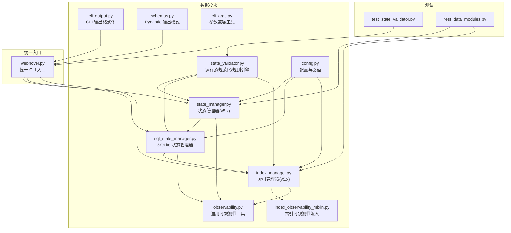
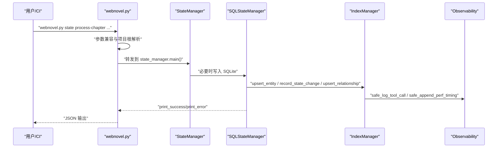
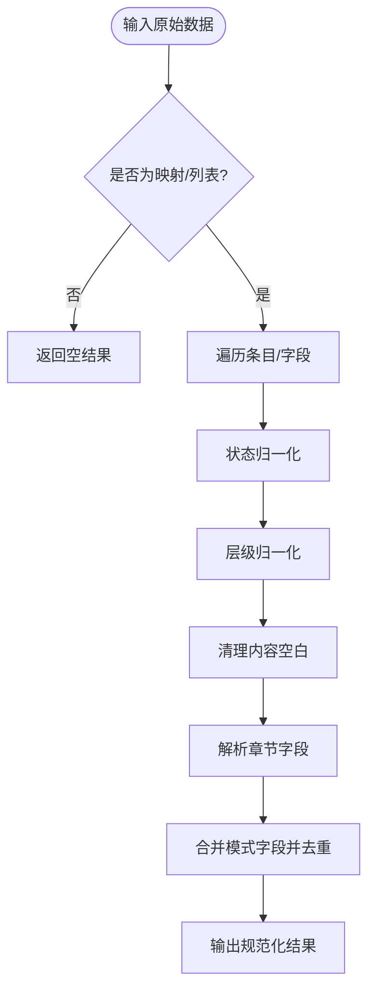
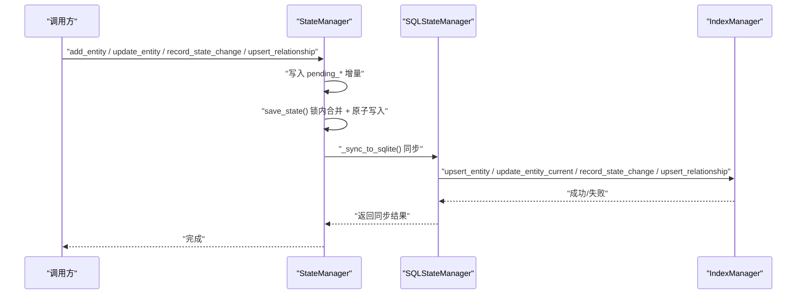
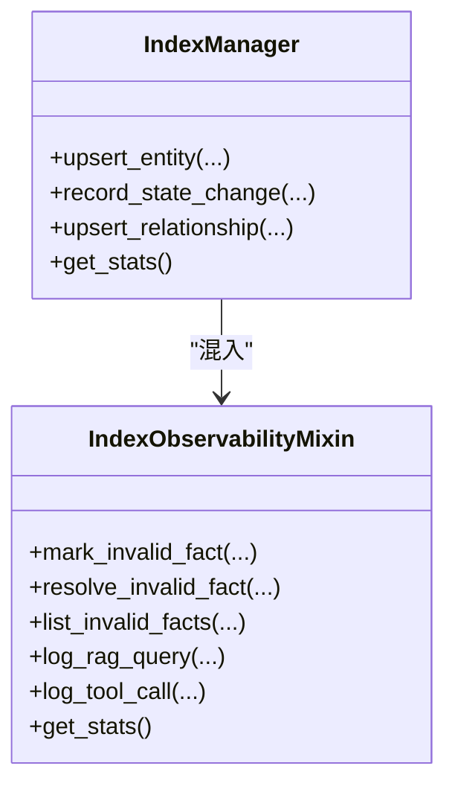
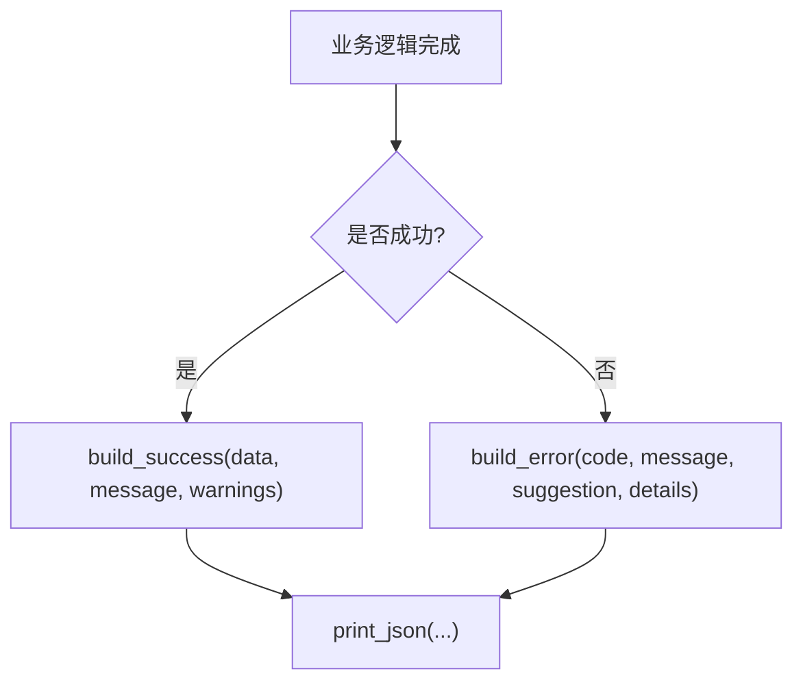
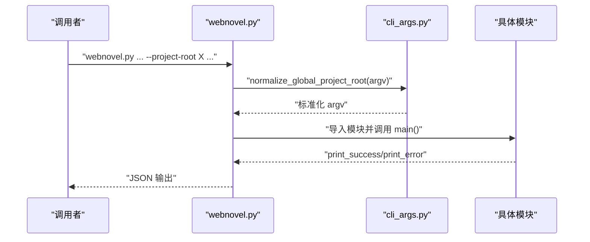
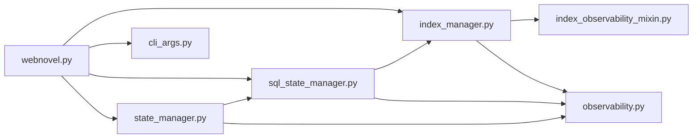

# 数据工具集

<cite>
**本文引用的文件**
- [state_validator.py](file://webnovel-writer/scripts/data_modules/state_validator.py)
- [observability.py](file://webnovel-writer/scripts/data_modules/observability.py)
- [cli_output.py](file://webnovel-writer/scripts/data_modules/cli_output.py)
- [schemas.py](file://webnovel-writer/scripts/data_modules/schemas.py)
- [index_observability_mixin.py](file://webnovel-writer/scripts/data_modules/index_observability_mixin.py)
- [state_manager.py](file://webnovel-writer/scripts/data_modules/state_manager.py)
- [sql_state_manager.py](file://webnovel-writer/scripts/data_modules/sql_state_manager.py)
- [webnovel.py](file://webnovel-writer/scripts/data_modules/webnovel.py)
- [cli_args.py](file://webnovel-writer/scripts/data_modules/cli_args.py)
- [config.py](file://webnovel-writer/scripts/data_modules/config.py)
- [index_manager.py](file://webnovel-writer/scripts/data_modules/index_manager.py)
- [test_state_validator.py](file://webnovel-writer/scripts/data_modules/tests/test_state_validator.py)
- [test_data_modules.py](file://webnovel-writer/scripts/data_modules/tests/test_data_modules.py)
- [README.md](file://README.md)
</cite>

## 目录
1. [简介](#简介)
2. [项目结构](#项目结构)
3. [核心组件](#核心组件)
4. [架构总览](#架构总览)
5. [详细组件分析](#详细组件分析)
6. [依赖分析](#依赖分析)
7. [性能考量](#性能考量)
8. [故障排查指南](#故障排查指南)
9. [结论](#结论)
10. [附录](#附录)

## 简介
本文件面向运维与测试工程师，系统化梳理 Webnovel Writer 数据工具集的设计与实现，重点覆盖：
- 数据验证器的规则引擎与模式匹配机制
- 数据完整性检查与运行态规范化
- 可观测性监控指标、日志记录与性能追踪
- CLI 输出格式化、错误消息标准化与调试信息收集
- 高级能力：自定义验证规则、监控指标扩展、输出格式定制
- 最佳实践与调试技巧，形成完整的数据质量保障方案

## 项目结构
数据工具集位于 scripts/data_modules 目录，围绕“状态管理 + 索引管理 + 规则与模式 + 可观测性 + CLI 输出 + 配置”六大维度组织，既支持单模块独立使用，也通过统一入口 webnovel.py 提供稳定的 CLI 调用体验。

图表来源
- [webnovel.py:189-312](file://webnovel-writer/scripts/data_modules/webnovel.py#L189-L312)
- [state_manager.py:90-140](file://webnovel-writer/scripts/data_modules/state_manager.py#L90-L140)
- [sql_state_manager.py:46-100](file://webnovel-writer/scripts/data_modules/sql_state_manager.py#L46-L100)
- [index_manager.py:1-53](file://webnovel-writer/scripts/data_modules/index_manager.py#L1-L53)
- [state_validator.py:1-250](file://webnovel-writer/scripts/data_modules/state_validator.py#L1-L250)
- [observability.py:1-88](file://webnovel-writer/scripts/data_modules/observability.py#L1-L88)
- [cli_output.py:1-70](file://webnovel-writer/scripts/data_modules/cli_output.py#L1-L70)
- [schemas.py:1-126](file://webnovel-writer/scripts/data_modules/schemas.py#L1-L126)
- [config.py:90-120](file://webnovel-writer/scripts/data_modules/config.py#L90-L120)
- [cli_args.py:63-97](file://webnovel-writer/scripts/data_modules/cli_args.py#L63-L97)

章节来源
- [README.md:1-170](file://README.md#L1-L170)
- [webnovel.py:189-312](file://webnovel-writer/scripts/data_modules/webnovel.py#L189-L312)

## 核心组件
- 规则引擎与模式匹配：state_validator 提供状态/层级/章节字段解析、模式字符串切分与去重、章节元数据合并等运行态规范化函数，构成数据质量的“第一道防线”。
- 状态与索引管理：state_manager 与 sql_state_manager 提供实体、关系、状态变化、别名等的读写与一致性保障；index_manager 提供 SQLite 索引层的快速查询与统计。
- 可观测性：observability 提供安全的日志与性能追踪；index_observability_mixin 提供无效事实、工具调用统计、查询日志等索引层可观测性能力。
- CLI 输出与模式：cli_output 提供统一的成功/错误输出结构；schemas 提供 Pydantic 模式校验与输出归一化。
- 配置与参数：config 提供路径、API、检索、预算等配置；cli_args 提供 --project-root 位置无关的参数兼容。

章节来源
- [state_validator.py:156-250](file://webnovel-writer/scripts/data_modules/state_validator.py#L156-L250)
- [state_manager.py:90-140](file://webnovel-writer/scripts/data_modules/state_manager.py#L90-L140)
- [sql_state_manager.py:46-100](file://webnovel-writer/scripts/data_modules/sql_state_manager.py#L46-L100)
- [index_manager.py:1-53](file://webnovel-writer/scripts/data_modules/index_manager.py#L1-L53)
- [observability.py:19-88](file://webnovel-writer/scripts/data_modules/observability.py#L19-L88)
- [index_observability_mixin.py:18-228](file://webnovel-writer/scripts/data_modules/index_observability_mixin.py#L18-L228)
- [cli_output.py:15-70](file://webnovel-writer/scripts/data_modules/cli_output.py#L15-L70)
- [schemas.py:67-126](file://webnovel-writer/scripts/data_modules/schemas.py#L67-L126)
- [config.py:90-120](file://webnovel-writer/scripts/data_modules/config.py#L90-L120)
- [cli_args.py:63-97](file://webnovel-writer/scripts/data_modules/cli_args.py#L63-L97)

## 架构总览
数据工具集采用“运行态规范化 + 状态/索引双层存储 + 统一 CLI + 可观测性”的分层架构。统一入口 webnovel.py 将参数标准化后转发至各模块，模块间通过 SQLite 索引层协同，确保大数据量场景下的高性能与一致性。

图表来源
- [webnovel.py:270-307](file://webnovel-writer/scripts/data_modules/webnovel.py#L270-L307)
- [state_manager.py:371-407](file://webnovel-writer/scripts/data_modules/state_manager.py#L371-L407)
- [sql_state_manager.py:267-417](file://webnovel-writer/scripts/data_modules/sql_state_manager.py#L267-L417)
- [index_manager.py:52-53](file://webnovel-writer/scripts/data_modules/index_manager.py#L52-L53)
- [observability.py:19-88](file://webnovel-writer/scripts/data_modules/observability.py#L19-L88)

## 详细组件分析

### 规则引擎与模式匹配（state_validator）
- 功能要点
  - 状态/层级归一化：将中文/英文状态与层级映射到统一枚举，提升跨模块一致性。
  - 章节字段解析：从多种键名中解析章节号，支持“第N章”等文本格式。
  - 模式字符串切分与去重：支持多种分隔符，合并章节元数据中的模式字段。
  - 运行态规范化：对 plot_threads.foreshadowing 与 chapter_meta 进行清洗与补全。
- 复杂度与性能
  - 切分与去重为线性复杂度 O(n)，整体处理批量数据时具备良好扩展性。
- 错误处理
  - 对空值、非法类型、空字符串进行安全处理，避免异常传播。
- 测试覆盖
  - 单测覆盖了数值解析、状态/层级归一化、模式切分与计数、条目与章节元数据规范化。

图表来源
- [state_validator.py:156-250](file://webnovel-writer/scripts/data_modules/state_validator.py#L156-L250)

章节来源
- [state_validator.py:54-250](file://webnovel-writer/scripts/data_modules/state_validator.py#L54-L250)
- [test_state_validator.py:24-108](file://webnovel-writer/scripts/data_modules/tests/test_state_validator.py#L24-L108)

### 状态管理器（StateManager）与 SQLite 状态管理器（SQLStateManager）
- 设计目标
  - v5.x 引入 SQLite-first 模式，state.json 仅保留精简数据，大数据迁移至 index.db，提升并发与稳定性。
  - 通过 pending 队列与原子写入，避免多 Agent 并发写入覆盖问题。
- 关键流程
  - 增量合并：锁内重读磁盘 state.json，仅合并本实例产生的 pending_*，原子写入。
  - SQLite 同步：支持两类同步路径（章节批量处理与增量补丁），失败时保留 pending 快照以便回滚。
  - 运行态规范化：调用 state_validator 对运行态 sections 进行清洗。
- 性能与可靠性
  - 文件锁 + 原子写 + 失败回滚，保障高并发场景下的数据一致性。
  - SQLite 写入采用批处理与幂等更新，减少重复写入。

图表来源
- [state_manager.py:208-370](file://webnovel-writer/scripts/data_modules/state_manager.py#L208-L370)
- [state_manager.py:371-560](file://webnovel-writer/scripts/data_modules/state_manager.py#L371-L560)
- [sql_state_manager.py:267-417](file://webnovel-writer/scripts/data_modules/sql_state_manager.py#L267-L417)
- [index_manager.py:1-53](file://webnovel-writer/scripts/data_modules/index_manager.py#L1-L53)

章节来源
- [state_manager.py:90-560](file://webnovel-writer/scripts/data_modules/state_manager.py#L90-L560)
- [sql_state_manager.py:46-417](file://webnovel-writer/scripts/data_modules/sql_state_manager.py#L46-L417)
- [test_data_modules.py:165-361](file://webnovel-writer/scripts/data_modules/tests/test_data_modules.py#L165-L361)

### 索引管理器（IndexManager）与可观测性混入（IndexObservabilityMixin）
- 功能范围
  - 索引层：章节、场景、实体、别名、状态变化、关系、债务与追读力等。
  - 观测性：无效事实标记与确认、工具调用统计、RAG 查询日志、性能追踪文件。
- 统计与查询
  - 提供丰富的 get_stats 与各类查询接口，支撑仪表盘与报告生成。
- 可观测性
  - 安全日志：失败时仅记录警告，不影响主流程。
  - 性能追踪：以 JSONL 追加写入，便于离线分析。

图表来源
- [index_observability_mixin.py:18-228](file://webnovel-writer/scripts/data_modules/index_observability_mixin.py#L18-L228)
- [index_manager.py:1-53](file://webnovel-writer/scripts/data_modules/index_manager.py#L1-L53)

章节来源
- [index_manager.py:1-200](file://webnovel-writer/scripts/data_modules/index_manager.py#L1-L200)
- [index_observability_mixin.py:18-228](file://webnovel-writer/scripts/data_modules/index_observability_mixin.py#L18-L228)

### CLI 输出格式化与错误标准化（cli_output 与 schemas）
- 输出结构
  - 成功：包含 status、message、可选 data 与 warnings。
  - 错误：包含 status、error.code、error.message、可选 suggestion 与 details。
- 模式校验
  - schemas 提供 Pydantic 模式，支持输出归一化与校验错误格式化。
- 使用建议
  - 所有 CLI 工具统一通过 print_success/print_error 输出，便于上层系统解析。

图表来源
- [cli_output.py:23-70](file://webnovel-writer/scripts/data_modules/cli_output.py#L23-L70)
- [schemas.py:79-126](file://webnovel-writer/scripts/data_modules/schemas.py#L79-L126)

章节来源
- [cli_output.py:15-70](file://webnovel-writer/scripts/data_modules/cli_output.py#L15-L70)
- [schemas.py:67-126](file://webnovel-writer/scripts/data_modules/schemas.py#L67-L126)

### 统一 CLI 入口（webnovel.py）与参数兼容（cli_args.py）
- 统一入口
  - 将 --project-root 位置无关地前置，兼容技能/Agent 的多样化调用方式。
  - 将命令转发到具体模块，确保参数一致性与可维护性。
- 参数兼容
  - 提供 normalize_global_project_root 与 load_json_arg，简化复杂参数传递。

图表来源
- [webnovel.py:252-307](file://webnovel-writer/scripts/data_modules/webnovel.py#L252-L307)
- [cli_args.py:63-97](file://webnovel-writer/scripts/data_modules/cli_args.py#L63-L97)

章节来源
- [webnovel.py:189-312](file://webnovel-writer/scripts/data_modules/webnovel.py#L189-L312)
- [cli_args.py:27-97](file://webnovel-writer/scripts/data_modules/cli_args.py#L27-L97)

## 依赖分析
- 模块耦合
  - state_manager 依赖 sql_state_manager 与 observability；sql_state_manager 依赖 index_manager 与 observability；index_manager 依赖 index_*_mixin 与 observability。
  - CLI 层通过 webnovel.py 与 cli_args.py 解耦具体实现。
- 外部依赖
  - SQLite（index.db）、JSONL 日志文件、环境变量（.env）。
- 潜在循环依赖
  - 通过“混入 + 依赖注入”避免直接循环；observability 作为工具层被多模块复用。

图表来源
- [state_manager.py:112-118](file://webnovel-writer/scripts/data_modules/state_manager.py#L112-L118)
- [sql_state_manager.py:20-29](file://webnovel-writer/scripts/data_modules/sql_state_manager.py#L20-L29)
- [index_manager.py:46-52](file://webnovel-writer/scripts/data_modules/index_manager.py#L46-L52)
- [webnovel.py:270-307](file://webnovel-writer/scripts/data_modules/webnovel.py#L270-L307)
- [cli_args.py:63-97](file://webnovel-writer/scripts/data_modules/cli_args.py#L63-L97)

章节来源
- [state_manager.py:112-118](file://webnovel-writer/scripts/data_modules/state_manager.py#L112-L118)
- [sql_state_manager.py:20-29](file://webnovel-writer/scripts/data_modules/sql_state_manager.py#L20-L29)
- [index_manager.py:46-52](file://webnovel-writer/scripts/data_modules/index_manager.py#L46-L52)
- [webnovel.py:270-307](file://webnovel-writer/scripts/data_modules/webnovel.py#L270-L307)

## 性能考量
- 写入路径
  - StateManager 采用锁内合并 + 原子写入，避免频繁覆盖；SQLite 同步失败时保留 pending，减少数据丢失风险。
- 查询与统计
  - index_manager 提供 get_stats 与多类查询接口，配合 SQLite 索引实现高效检索。
- 可观测性
  - safe_append_perf_timing 以 JSONL 追加写入，避免阻塞主流程；失败仅记录警告。
- 配置优化
  - config 提供并发、超时、重试、检索参数等，可根据环境调优。

章节来源
- [state_manager.py:208-370](file://webnovel-writer/scripts/data_modules/state_manager.py#L208-L370)
- [observability.py:46-88](file://webnovel-writer/scripts/data_modules/observability.py#L46-L88)
- [config.py:144-175](file://webnovel-writer/scripts/data_modules/config.py#L144-L175)

## 故障排查指南
- CLI 参数位置错误
  - 现象：--project-root 放在子命令之后导致 unrecognized arguments。
  - 处理：使用 webnovel.py 的参数预处理或在调用前将 --project-root 移至子命令之前。
- SQLite 同步失败
  - 现象：状态变更未落库或数据不一致。
  - 处理：检查 pending 快照是否被恢复；确认 index.db 权限与磁盘空间；查看日志警告。
- 输出格式异常
  - 现象：上层系统解析失败。
  - 处理：确保使用 print_success/print_error 输出；遵循 schemas 的字段约定。
- 规则引擎异常
  - 现象：运行态数据未被正确规范化。
  - 处理：核对输入字段键名与格式；参考单测用例定位问题。

章节来源
- [webnovel.py:252-307](file://webnovel-writer/scripts/data_modules/webnovel.py#L252-L307)
- [state_manager.py:371-407](file://webnovel-writer/scripts/data_modules/state_manager.py#L371-L407)
- [cli_output.py:55-70](file://webnovel-writer/scripts/data_modules/cli_output.py#L55-L70)
- [test_state_validator.py:24-108](file://webnovel-writer/scripts/data_modules/tests/test_state_validator.py#L24-L108)

## 结论
数据工具集通过“运行态规范化 + SQLite-first 状态/索引 + 统一 CLI + 可观测性”的架构，实现了在长周期连载场景下的数据质量与工程效率平衡。建议在生产环境中：
- 使用统一 CLI 入口与参数兼容工具
- 严格遵循 CLI 输出与模式规范
- 借助可观测性日志与统计接口进行持续监控
- 在高并发场景下关注 pending 同步与回滚策略

## 附录

### 高级功能与最佳实践
- 自定义验证规则
  - 在 state_validator 中扩展字段解析与归一化逻辑，确保与业务语义一致。
- 监控指标扩展
  - 在 IndexObservabilityMixin 中新增统计项，并通过 get_stats 暴露给上层。
- 输出格式定制
  - 通过 cli_output 与 schemas 的组合，定义统一的成功/错误结构，满足不同消费方需求。

### 调试技巧
- 使用 test_data_modules 的测试用例作为行为参考，快速定位问题。
- 通过 observability 的 JSONL 性能追踪文件进行离线分析。
- 在 CI 中加入 CLI 输出的模式校验，确保稳定性。

章节来源
- [state_validator.py:156-250](file://webnovel-writer/scripts/data_modules/state_validator.py#L156-L250)
- [index_observability_mixin.py:147-225](file://webnovel-writer/scripts/data_modules/index_observability_mixin.py#L147-L225)
- [cli_output.py:23-70](file://webnovel-writer/scripts/data_modules/cli_output.py#L23-L70)
- [test_data_modules.py:165-361](file://webnovel-writer/scripts/data_modules/tests/test_data_modules.py#L165-L361)