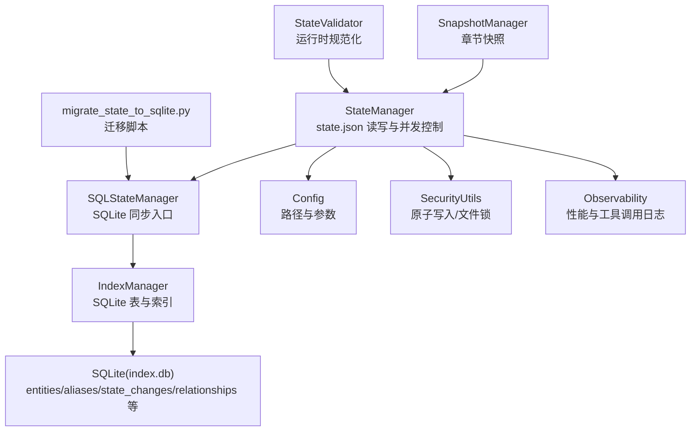
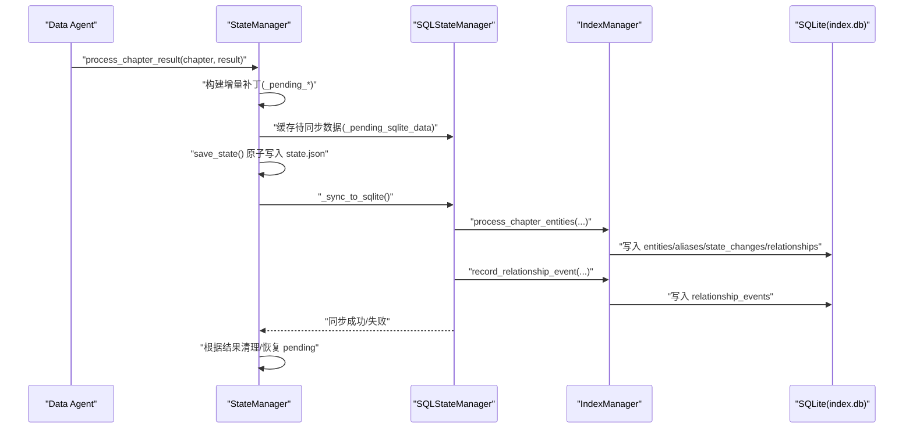
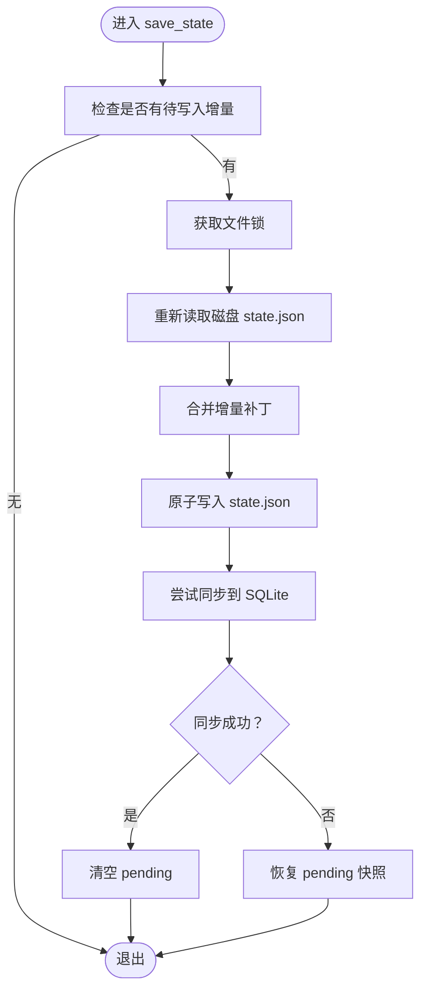
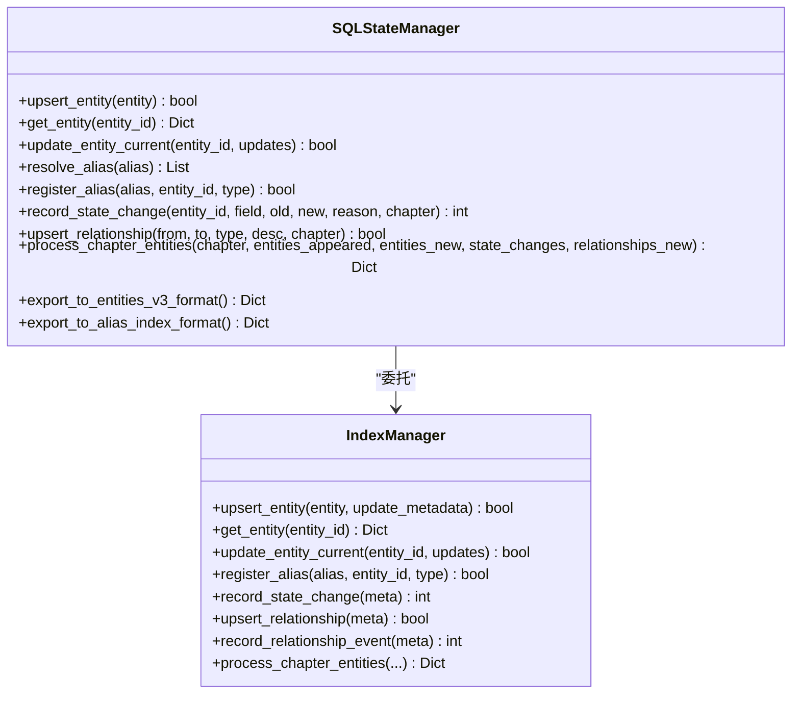
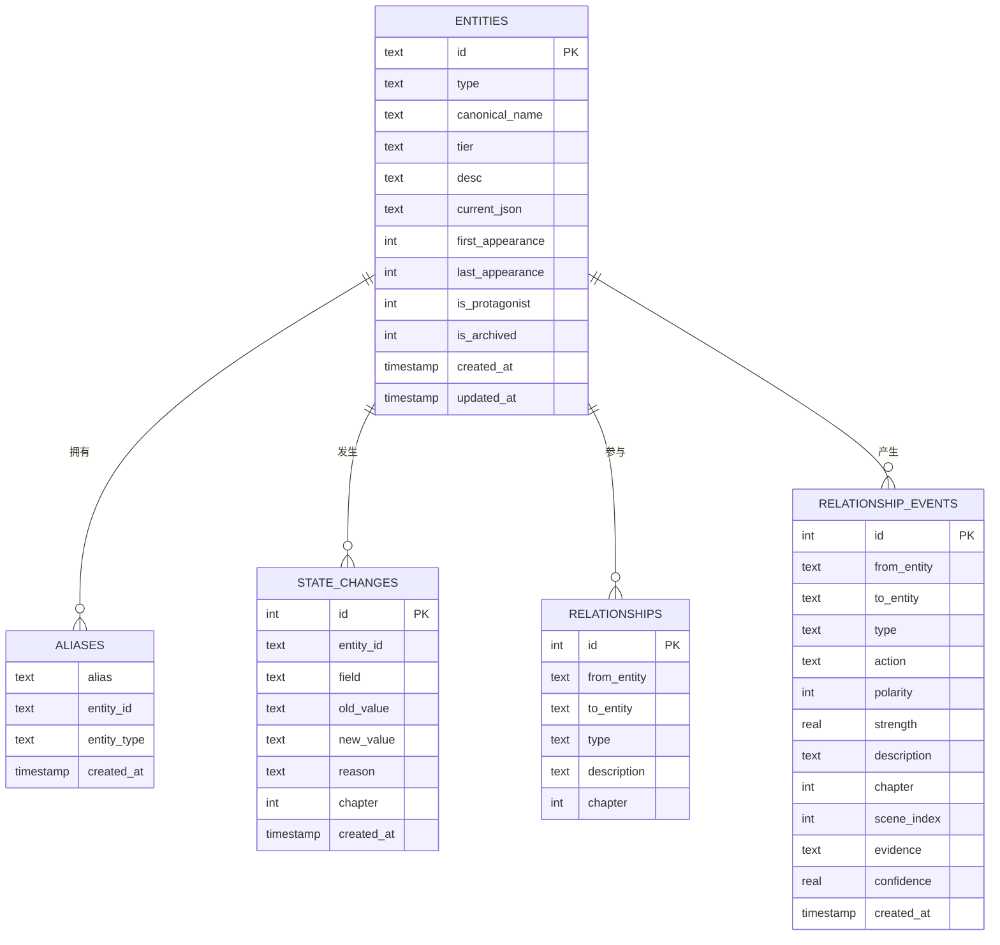
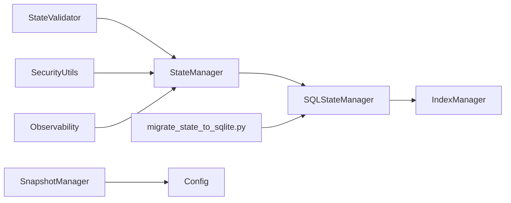

# 状态管理器

<cite>
**本文引用的文件**
- [sql_state_manager.py](file://webnovel-writer/scripts/data_modules/sql_state_manager.py)
- [state_manager.py](file://webnovel-writer/scripts/data_modules/state_manager.py)
- [index_manager.py](file://webnovel-writer/scripts/data_modules/index_manager.py)
- [index_entity_mixin.py](file://webnovel-writer/scripts/data_modules/index_entity_mixin.py)
- [config.py](file://webnovel-writer/scripts/data_modules/config.py)
- [migrate_state_to_sqlite.py](file://webnovel-writer/scripts/data_modules/migrate_state_to_sqlite.py)
- [snapshot_manager.py](file://webnovel-writer/scripts/data_modules/snapshot_manager.py)
- [state_validator.py](file://webnovel-writer/scripts/data_modules/state_validator.py)
- [security_utils.py](file://webnovel-writer/scripts/security_utils.py)
- [observability.py](file://webnovel-writer/scripts/data_modules/observability.py)
- [test_sql_state_manager.py](file://webnovel-writer/scripts/data_modules/tests/test_sql_state_manager.py)
</cite>

## 目录
1. [简介](#简介)
2. [项目结构](#项目结构)
3. [核心组件](#核心组件)
4. [架构总览](#架构总览)
5. [详细组件分析](#详细组件分析)
6. [依赖关系分析](#依赖关系分析)
7. [性能考量](#性能考量)
8. [故障排查指南](#故障排查指南)
9. [结论](#结论)
10. [附录](#附录)

## 简介
本文件为 Webnovel Writer 的状态管理器提供全面的技术文档，涵盖架构设计、数据持久化策略、SQLite 数据库交互机制、读写与更新流程、事务处理、状态验证规则、数据完整性约束、并发访问控制、状态快照管理、增量更新与批量操作等高级功能，并给出最佳实践、性能优化与故障恢复策略，面向数据工程师提供完整的状态管理解决方案。

## 项目结构
状态管理器由三层协同组成：
- 应用层：StateManager（负责 state.json 的读写与并发控制，同时协调 SQLite 同步）
- 数据层：SQLStateManager/IndexManager（负责 SQLite 数据库的实体、别名、状态变化、关系等表的读写）
- 基础设施层：配置、安全工具、可观测性、迁移脚本、快照管理、验证器

图表来源
- [state_manager.py:90-140](file://webnovel-writer/scripts/data_modules/state_manager.py#L90-L140)
- [sql_state_manager.py:46-100](file://webnovel-writer/scripts/data_modules/sql_state_manager.py#L46-L100)
- [index_manager.py:228-234](file://webnovel-writer/scripts/data_modules/index_manager.py#L228-L234)
- [config.py:90-120](file://webnovel-writer/scripts/data_modules/config.py#L90-L120)
- [migrate_state_to_sqlite.py:39-88](file://webnovel-writer/scripts/data_modules/migrate_state_to_sqlite.py#L39-L88)
- [snapshot_manager.py:41-47](file://webnovel-writer/scripts/data_modules/snapshot_manager.py#L41-L47)
- [state_validator.py:237-249](file://webnovel-writer/scripts/data_modules/state_validator.py#L237-L249)

章节来源
- [state_manager.py:90-140](file://webnovel-writer/scripts/data_modules/state_manager.py#L90-L140)
- [sql_state_manager.py:46-100](file://webnovel-writer/scripts/data_modules/sql_state_manager.py#L46-L100)
- [index_manager.py:228-234](file://webnovel-writer/scripts/data_modules/index_manager.py#L228-L234)
- [config.py:90-120](file://webnovel-writer/scripts/data_modules/config.py#L90-L120)
- [migrate_state_to_sqlite.py:39-88](file://webnovel-writer/scripts/data_modules/migrate_state_to_sqlite.py#L39-L88)
- [snapshot_manager.py:41-47](file://webnovel-writer/scripts/data_modules/snapshot_manager.py#L41-L47)
- [state_validator.py:237-249](file://webnovel-writer/scripts/data_modules/state_validator.py#L237-L249)

## 核心组件
- StateManager：负责 state.json 的读写、并发控制、增量合并、进度追踪、章节元数据、消歧记录、以及与 SQLite 的双向同步。
- SQLStateManager：提供与 StateManager 兼容的接口，但数据存储在 SQLite，支持批量处理章节数据、实体别名解析、关系事件记录等。
- IndexManager：封装 SQLite 表结构与索引，提供实体、别名、状态变化、关系、关系事件、章节元数据、追读力债务等表的 CRUD。
- 配置 Config：统一管理项目根目录、state.json、index.db、快照目录、查询限制、并发与超时等参数。
- 迁移脚本 migrate_state_to_sqlite：将 state.json 中的大数据字段迁移至 SQLite，迁移后 state.json 仅保留精简数据。
- 快照管理 SnapshotManager：提供章节级快照的保存、加载、删除与列举，带文件锁保护。
- 验证器 StateValidator：对运行时状态中的章节元数据、伏笔等字段进行规范化与校验。
- 安全工具 SecurityUtils：提供原子写入与文件锁能力，保障并发安全。
- 可观测性 Observability：记录工具调用统计与性能时间线，便于诊断与优化。

章节来源
- [state_manager.py:90-140](file://webnovel-writer/scripts/data_modules/state_manager.py#L90-L140)
- [sql_state_manager.py:46-100](file://webnovel-writer/scripts/data_modules/sql_state_manager.py#L46-L100)
- [index_manager.py:228-234](file://webnovel-writer/scripts/data_modules/index_manager.py#L228-L234)
- [config.py:90-120](file://webnovel-writer/scripts/data_modules/config.py#L90-L120)
- [migrate_state_to_sqlite.py:39-88](file://webnovel-writer/scripts/data_modules/migrate_state_to_sqlite.py#L39-L88)
- [snapshot_manager.py:41-47](file://webnovel-writer/scripts/data_modules/snapshot_manager.py#L41-L47)
- [state_validator.py:237-249](file://webnovel-writer/scripts/data_modules/state_validator.py#L237-L249)
- [security_utils.py:197-200](file://webnovel-writer/scripts/security_utils.py#L197-L200)
- [observability.py:19-88](file://webnovel-writer/scripts/data_modules/observability.py#L19-L88)

## 架构总览
状态管理器采用“应用层 + 数据层 + 基础设施层”的分层设计，核心思想是：
- state.json 仅保留精简数据（进度、主线人物状态、章节元数据、消歧记录等）
- 大体量数据（实体、别名、状态变化、关系等）迁移到 SQLite，提升查询与写入性能
- 通过增量补丁与文件锁保证并发安全
- 通过迁移脚本与 CLI 工具实现平滑演进与运维

图表来源
- [state_manager.py:1010-1096](file://webnovel-writer/scripts/data_modules/state_manager.py#L1010-L1096)
- [state_manager.py:371-407](file://webnovel-writer/scripts/data_modules/state_manager.py#L371-L407)
- [sql_state_manager.py:267-417](file://webnovel-writer/scripts/data_modules/sql_state_manager.py#L267-L417)
- [index_manager.py:384-414](file://webnovel-writer/scripts/data_modules/index_manager.py#L384-L414)

章节来源
- [state_manager.py:1010-1096](file://webnovel-writer/scripts/data_modules/state_manager.py#L1010-L1096)
- [state_manager.py:371-407](file://webnovel-writer/scripts/data_modules/state_manager.py#L371-L407)
- [sql_state_manager.py:267-417](file://webnovel-writer/scripts/data_modules/sql_state_manager.py#L267-L417)
- [index_manager.py:384-414](file://webnovel-writer/scripts/data_modules/index_manager.py#L384-L414)

## 详细组件分析

### StateManager（应用层）
- 并发与原子写入：使用文件锁与“锁内重读 + 合并 + 原子写入”策略，避免多 Agent 并发写入导致的数据覆盖。
- 增量补丁：将待写入的实体、别名、状态变化、关系、章节元数据等缓存在内存队列中，减少频繁 IO。
- SQLite 同步：在保存 state.json 成功后，尝试同步到 SQLite；若失败则恢复 pending，避免静默丢数据。
- 进度与章节元数据：提供进度更新、章节元数据写入与查询接口。
- 主角同步：从实体状态同步到 protagonist_state，确保下游一致性。

图表来源
- [state_manager.py:208-370](file://webnovel-writer/scripts/data_modules/state_manager.py#L208-L370)
- [state_manager.py:371-407](file://webnovel-writer/scripts/data_modules/state_manager.py#L371-L407)
- [state_manager.py:561-584](file://webnovel-writer/scripts/data_modules/state_manager.py#L561-L584)

章节来源
- [state_manager.py:208-370](file://webnovel-writer/scripts/data_modules/state_manager.py#L208-L370)
- [state_manager.py:371-407](file://webnovel-writer/scripts/data_modules/state_manager.py#L371-L407)
- [state_manager.py:561-584](file://webnovel-writer/scripts/data_modules/state_manager.py#L561-L584)

### SQLStateManager（SQLite 同步层）
- 实体与别名：提供 upsert_entity、update_entity_current、resolve_alias、register_alias 等接口。
- 状态变化与关系：提供 record_state_change、get_entity_state_changes、upsert_relationship、get_entity_relationships 等接口。
- 批量处理：process_chapter_entities 将 Data Agent 的章节输出批量写入 SQLite，并记录关系事件。
- 导出兼容：提供导出为 entities_v3 与 alias_index 格式的接口，便于兼容旧流程。

图表来源
- [sql_state_manager.py:103-190](file://webnovel-writer/scripts/data_modules/sql_state_manager.py#L103-L190)
- [sql_state_manager.py:193-264](file://webnovel-writer/scripts/data_modules/sql_state_manager.py#L193-L264)
- [sql_state_manager.py:267-417](file://webnovel-writer/scripts/data_modules/sql_state_manager.py#L267-L417)
- [index_manager.py:20-134](file://webnovel-writer/scripts/data_modules/index_manager.py#L20-L134)

章节来源
- [sql_state_manager.py:103-190](file://webnovel-writer/scripts/data_modules/sql_state_manager.py#L103-L190)
- [sql_state_manager.py:193-264](file://webnovel-writer/scripts/data_modules/sql_state_manager.py#L193-L264)
- [sql_state_manager.py:267-417](file://webnovel-writer/scripts/data_modules/sql_state_manager.py#L267-L417)
- [index_manager.py:20-134](file://webnovel-writer/scripts/data_modules/index_manager.py#L20-L134)

### IndexManager（SQLite 数据层）
- 表结构：entities、aliases、state_changes、relationships、relationship_events、章节与场景表、追读力债务相关表、无效事实与审查指标等。
- 索引：为高频查询字段建立索引，提升查询性能。
- 实体混入：IndexEntityMixin 提供 upsert_entity、get_entity、按类型/层级/核心实体查询等方法。
- 关系事件：支持关系事件的记录与查询，便于时序回放与图谱分析。

图表来源
- [index_manager.py:295-414](file://webnovel-writer/scripts/data_modules/index_manager.py#L295-L414)
- [index_entity_mixin.py:20-23](file://webnovel-writer/scripts/data_modules/index_entity_mixin.py#L20-L23)

章节来源
- [index_manager.py:295-414](file://webnovel-writer/scripts/data_modules/index_manager.py#L295-L414)
- [index_entity_mixin.py:20-23](file://webnovel-writer/scripts/data_modules/index_entity_mixin.py#L20-L23)

### 配置与基础设施
- Config：统一管理项目根目录、state.json、index.db、快照目录、查询限制、并发与超时等参数。
- 迁移脚本：将 state.json 中的大数据字段迁移至 SQLite，迁移后 state.json 仅保留精简数据。
- 快照管理：提供章节快照的保存、加载、删除与列举，带文件锁保护。
- 验证器：对运行时状态中的章节元数据、伏笔等字段进行规范化与校验。
- 安全工具：提供原子写入与文件锁能力，保障并发安全。
- 可观测性：记录工具调用统计与性能时间线，便于诊断与优化。

章节来源
- [config.py:90-120](file://webnovel-writer/scripts/data_modules/config.py#L90-L120)
- [migrate_state_to_sqlite.py:39-88](file://webnovel-writer/scripts/data_modules/migrate_state_to_sqlite.py#L39-L88)
- [snapshot_manager.py:41-47](file://webnovel-writer/scripts/data_modules/snapshot_manager.py#L41-L47)
- [state_validator.py:237-249](file://webnovel-writer/scripts/data_modules/state_validator.py#L237-L249)
- [security_utils.py:197-200](file://webnovel-writer/scripts/security_utils.py#L197-L200)
- [observability.py:19-88](file://webnovel-writer/scripts/data_modules/observability.py#L19-L88)

## 依赖关系分析
- StateManager 依赖 SQLStateManager 进行 SQLite 同步；SQLStateManager 依赖 IndexManager 进行数据库操作。
- 迁移脚本依赖 SQLStateManager 与 Config，将 state.json 迁移至 SQLite。
- 快照管理器独立于状态管理器，但与 Config 的路径约定耦合。
- 验证器与安全工具、可观测性分别在不同层面提供质量与可靠性保障。

图表来源
- [state_manager.py:112-118](file://webnovel-writer/scripts/data_modules/state_manager.py#L112-L118)
- [sql_state_manager.py:97-99](file://webnovel-writer/scripts/data_modules/sql_state_manager.py#L97-L99)
- [migrate_state_to_sqlite.py:36-88](file://webnovel-writer/scripts/data_modules/migrate_state_to_sqlite.py#L36-L88)
- [snapshot_manager.py:41-47](file://webnovel-writer/scripts/data_modules/snapshot_manager.py#L41-L47)
- [state_validator.py:237-249](file://webnovel-writer/scripts/data_modules/state_validator.py#L237-L249)
- [security_utils.py:197-200](file://webnovel-writer/scripts/security_utils.py#L197-L200)
- [observability.py:19-88](file://webnovel-writer/scripts/data_modules/observability.py#L19-L88)

章节来源
- [state_manager.py:112-118](file://webnovel-writer/scripts/data_modules/state_manager.py#L112-L118)
- [sql_state_manager.py:97-99](file://webnovel-writer/scripts/data_modules/sql_state_manager.py#L97-L99)
- [migrate_state_to_sqlite.py:36-88](file://webnovel-writer/scripts/data_modules/migrate_state_to_sqlite.py#L36-L88)
- [snapshot_manager.py:41-47](file://webnovel-writer/scripts/data_modules/snapshot_manager.py#L41-L47)
- [state_validator.py:237-249](file://webnovel-writer/scripts/data_modules/state_validator.py#L237-L249)
- [security_utils.py:197-200](file://webnovel-writer/scripts/security_utils.py#L197-L200)
- [observability.py:19-88](file://webnovel-writer/scripts/data_modules/observability.py#L19-L88)

## 性能考量
- 增量写入与批处理：通过增量补丁与批量处理章节数据，减少频繁 IO 与锁竞争。
- 索引优化：为高频查询字段建立索引，如 entities(type/tier/is_protagonist)、aliases(entity_id/alias)、state_changes(entity_id/chapter)、relationships(from/to/chapter) 等。
- 原子写入：使用文件锁与原子写入，避免并发写入导致的锁等待与数据覆盖。
- SQLite 连接池：IndexManager 使用上下文管理器获取连接，确保连接及时释放。
- 查询限制：Config 中提供查询默认限制，避免大范围扫描导致的性能问题。
- 可观测性：通过性能时间线与工具调用统计，定位瓶颈与异常。

章节来源
- [index_manager.py:352-414](file://webnovel-writer/scripts/data_modules/index_manager.py#L352-L414)
- [config.py:263-268](file://webnovel-writer/scripts/data_modules/config.py#L263-L268)
- [observability.py:46-88](file://webnovel-writer/scripts/data_modules/observability.py#L46-L88)

## 故障排查指南
- 并发写入冲突：检查 state.json 锁文件是否存在，确认锁路径与权限；必要时增加重试与超时配置。
- SQLite 同步失败：查看同步返回值与异常日志，确认 pending 快照是否被恢复；检查 index.db 权限与磁盘空间。
- 数据迁移失败：使用迁移脚本的 dry-run 模式预检，确认备份策略与权限；检查 state.json 与 index.db 的读写权限。
- 快照加载失败：确认快照版本与当前版本一致，检查快照文件是否存在与权限。
- 验证失败：使用 StateValidator 对运行时状态进行规范化，检查字段类型与取值范围。

章节来源
- [state_manager.py:368-370](file://webnovel-writer/scripts/data_modules/state_manager.py#L368-L370)
- [state_manager.py:400-402](file://webnovel-writer/scripts/data_modules/state_manager.py#L400-L402)
- [migrate_state_to_sqlite.py:348-376](file://webnovel-writer/scripts/data_modules/migrate_state_to_sqlite.py#L348-L376)
- [snapshot_manager.py:70-80](file://webnovel-writer/scripts/data_modules/snapshot_manager.py#L70-L80)
- [state_validator.py:237-249](file://webnovel-writer/scripts/data_modules/state_validator.py#L237-L249)

## 结论
Webnovel Writer 的状态管理器通过“应用层 + 数据层 + 基础设施层”的分层设计，实现了高性能、高可靠的状态管理。state.json 仅保留精简数据，大数据迁移到 SQLite，配合增量补丁、文件锁与原子写入，确保并发安全与数据一致性。通过迁移脚本、快照管理、验证器与可观测性，提供了完整的生命周期管理与运维支持。建议在生产环境中结合查询限制、索引优化与性能监控，持续优化系统表现。

## 附录
- 测试参考：单元测试覆盖了实体与别名、状态变化与关系、章节批量处理、导出与 CLI 等关键路径，可作为集成测试与回归测试的参考。

章节来源
- [test_sql_state_manager.py:25-200](file://webnovel-writer/scripts/data_modules/tests/test_sql_state_manager.py#L25-L200)