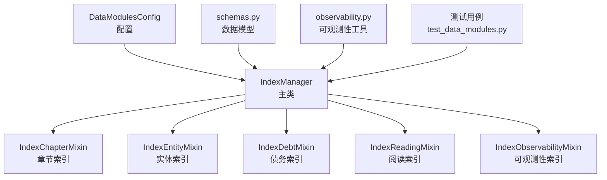
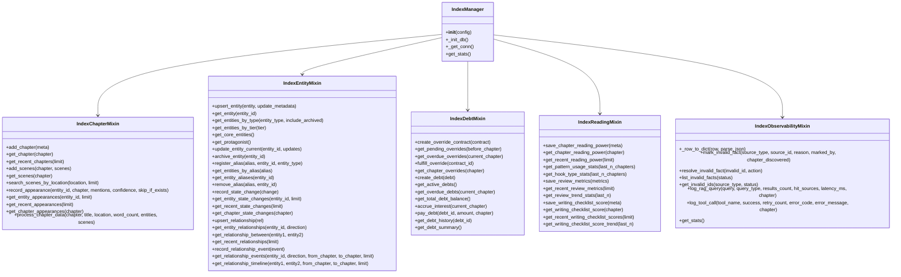
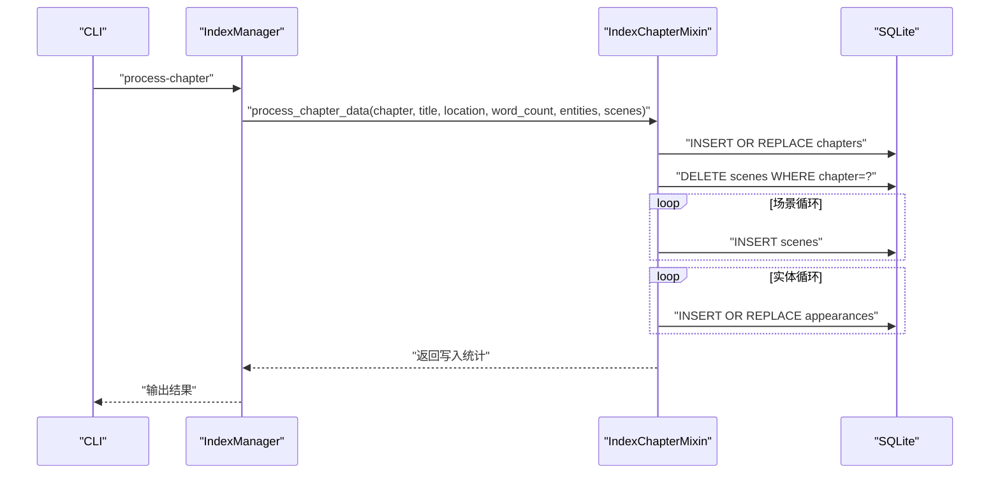
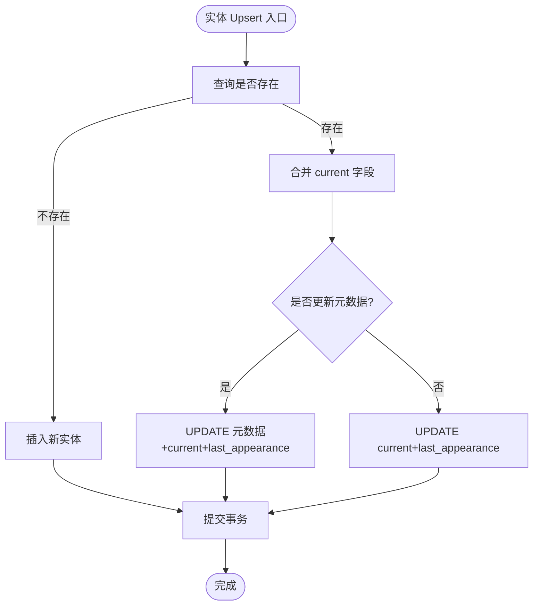
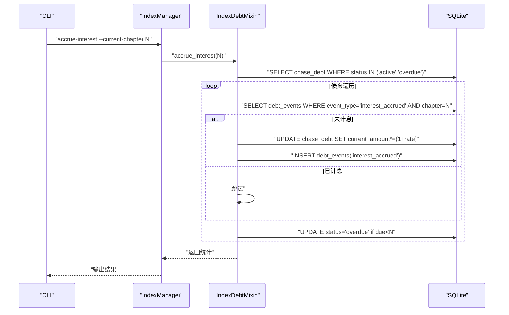
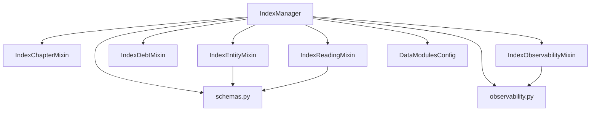

# 索引管理器

<cite>
**本文引用的文件**
- [index_manager.py](file://webnovel-writer/scripts/data_modules/index_manager.py)
- [index_chapter_mixin.py](file://webnovel-writer/scripts/data_modules/index_chapter_mixin.py)
- [index_entity_mixin.py](file://webnovel-writer/scripts/data_modules/index_entity_mixin.py)
- [index_debt_mixin.py](file://webnovel-writer/scripts/data_modules/index_debt_mixin.py)
- [index_reading_mixin.py](file://webnovel-writer/scripts/data_modules/index_reading_mixin.py)
- [index_observability_mixin.py](file://webnovel-writer/scripts/data_modules/index_observability_mixin.py)
- [config.py](file://webnovel-writer/scripts/data_modules/config.py)
- [schemas.py](file://webnovel-writer/scripts/data_modules/schemas.py)
- [observability.py](file://webnovel-writer/scripts/data_modules/observability.py)
- [test_data_modules.py](file://webnovel-writer/scripts/data_modules/tests/test_data_modules.py)
</cite>

## 目录
1. [简介](#简介)
2. [项目结构](#项目结构)
3. [核心组件](#核心组件)
4. [架构概览](#架构概览)
5. [详细组件分析](#详细组件分析)
6. [依赖关系分析](#依赖关系分析)
7. [性能考量](#性能考量)
8. [故障排除指南](#故障排除指南)
9. [结论](#结论)
10. [附录](#附录)

## 简介
本文件为 Webnovel Writer 的索引管理器提供全面的使用与开发文档。索引管理器负责维护项目中的多维度索引体系，涵盖章节索引、实体索引、债务索引、可观测性索引、阅读索引，并提供查询优化、增量构建、重建与迁移、一致性保障等高级能力。文档面向数据库与搜索引擎开发者，帮助快速理解架构设计、实现细节与最佳实践。

## 项目结构
索引管理器采用“主类 + 混入模块”的架构，将不同领域的索引能力拆分为独立的混入模块，便于扩展与维护。核心文件组织如下：
- 主类：IndexManager（聚合多个混入模块）
- 索引混入模块：章节、实体、债务、阅读、可观测性
- 配置与工具：DataModulesConfig、schemas、observability
- 测试：单元测试覆盖 CLI 与核心功能

图表来源
- [index_manager.py:228-234](file://webnovel-writer/scripts/data_modules/index_manager.py#L228-L234)
- [config.py:90-120](file://webnovel-writer/scripts/data_modules/config.py#L90-L120)
- [schemas.py:13-98](file://webnovel-writer/scripts/data_modules/schemas.py#L13-L98)
- [observability.py:19-88](file://webnovel-writer/scripts/data_modules/observability.py#L19-L88)
- [test_data_modules.py:14-36](file://webnovel-writer/scripts/data_modules/tests/test_data_modules.py#L14-L36)

章节来源
- [index_manager.py:228-234](file://webnovel-writer/scripts/data_modules/index_manager.py#L228-L234)
- [config.py:90-120](file://webnovel-writer/scripts/data_modules/config.py#L90-L120)
- [schemas.py:13-98](file://webnovel-writer/scripts/data_modules/schemas.py#L13-L98)
- [observability.py:19-88](file://webnovel-writer/scripts/data_modules/observability.py#L19-L88)
- [test_data_modules.py:14-36](file://webnovel-writer/scripts/data_modules/tests/test_data_modules.py#L14-L36)

## 核心组件
- IndexManager：索引管理主类，聚合章节、实体、债务、阅读、可观测性混入模块，负责数据库初始化、连接管理与 CLI 命令路由。
- IndexChapterMixin：章节元数据、场景、出场记录的增删改查与批量处理。
- IndexEntityMixin：实体 CRUD、别名、状态变化、关系、关系事件与图谱分析。
- IndexDebtMixin：Override Contract、追读力债务、利息计算、偿还与历史记录。
- IndexReadingMixin：章节追读力元数据、审查指标、写作清单评分与趋势统计。
- IndexObservabilityMixin：无效事实标记与处理、RAG 查询日志、工具调用统计、索引统计。
- DataModulesConfig：统一配置入口，定义索引数据库路径、查询限制、检索参数等。
- schemas：数据模型与校验，确保输入输出结构一致。
- observability：性能观测与日志工具，支持安全记录与性能追踪。

章节来源
- [index_manager.py:228-234](file://webnovel-writer/scripts/data_modules/index_manager.py#L228-L234)
- [index_chapter_mixin.py:14-303](file://webnovel-writer/scripts/data_modules/index_chapter_mixin.py#L14-L303)
- [index_entity_mixin.py:20-986](file://webnovel-writer/scripts/data_modules/index_entity_mixin.py#L20-L986)
- [index_debt_mixin.py:14-505](file://webnovel-writer/scripts/data_modules/index_debt_mixin.py#L14-L505)
- [index_reading_mixin.py:15-383](file://webnovel-writer/scripts/data_modules/index_reading_mixin.py#L15-L383)
- [index_observability_mixin.py:18-228](file://webnovel-writer/scripts/data_modules/index_observability_mixin.py#L18-L228)
- [config.py:90-349](file://webnovel-writer/scripts/data_modules/config.py#L90-L349)
- [schemas.py:13-126](file://webnovel-writer/scripts/data_modules/schemas.py#L13-L126)
- [observability.py:19-88](file://webnovel-writer/scripts/data_modules/observability.py#L19-L88)

## 架构概览
索引管理器采用 SQLite 作为持久化存储，通过混入模块实现职责分离。主类负责数据库初始化与连接生命周期管理；各混入模块封装具体业务逻辑；CLI 提供命令行接口，统一输出格式与可观测性记录。

图表来源
- [index_manager.py:228-234](file://webnovel-writer/scripts/data_modules/index_manager.py#L228-L234)
- [index_chapter_mixin.py:14-303](file://webnovel-writer/scripts/data_modules/index_chapter_mixin.py#L14-L303)
- [index_entity_mixin.py:20-986](file://webnovel-writer/scripts/data_modules/index_entity_mixin.py#L20-L986)
- [index_debt_mixin.py:14-505](file://webnovel-writer/scripts/data_modules/index_debt_mixin.py#L14-L505)
- [index_reading_mixin.py:15-383](file://webnovel-writer/scripts/data_modules/index_reading_mixin.py#L15-L383)
- [index_observability_mixin.py:18-228](file://webnovel-writer/scripts/data_modules/index_observability_mixin.py#L18-L228)

## 详细组件分析

### 章节索引（IndexChapterMixin）
- 数据模型：章节元数据（标题、地点、字数、出场角色）、场景（按章节索引）、出场记录（实体在章节中的提及与置信度）。
- 关键能力：
  - 批量处理章节数据：写入章节元数据、场景与出场记录。
  - 查询接口：按章节获取、按地点搜索场景、按实体/最近出场查询。
  - 增量写入：出场记录支持跳过已存在记录，避免覆盖。
- 性能要点：
  - 场景与出场记录建立复合索引，加速按章节与实体查询。
  - 批量写入先删除旧数据再插入，保证一致性。

图表来源
- [index_chapter_mixin.py:236-299](file://webnovel-writer/scripts/data_modules/index_chapter_mixin.py#L236-L299)
- [index_manager.py:943-954](file://webnovel-writer/scripts/data_modules/index_manager.py#L943-L954)

章节来源
- [index_chapter_mixin.py:14-303](file://webnovel-writer/scripts/data_modules/index_chapter_mixin.py#L14-L303)
- [index_manager.py:921-954](file://webnovel-writer/scripts/data_modules/index_manager.py#L921-L954)

### 实体索引（IndexEntityMixin）
- 数据模型：实体（类型、别名、当前状态、首次/最后出场、是否主角、是否归档）、状态变化、关系、关系事件。
- 关键能力：
  - 实体 Upsert：智能合并 current 字段，支持仅更新元数据或全量更新。
  - 别名系统：支持一对多映射，按别名查找所有匹配实体。
  - 关系建模：支持双向/单向查询、最近关系、两实体间关系时间线。
  - 关系事件：记录关系的创建/更新/衰减/移除，支持按章节范围与方向过滤。
- 性能要点：
  - 为实体类型、重要度、是否主角、别名与状态变化建立索引。
  - 关系事件支持按 from/to/chapter/type 复合索引，提升时序回放效率。

图表来源
- [index_entity_mixin.py:20-123](file://webnovel-writer/scripts/data_modules/index_entity_mixin.py#L20-L123)

章节来源
- [index_entity_mixin.py:20-986](file://webnovel-writer/scripts/data_modules/index_entity_mixin.py#L20-L986)

### 债务索引（IndexDebtMixin）
- 数据模型：Override Contract（章节、约束类型、原因、偿还计划、到期章节、状态）、追读力债务（类型、本金、当前余额、利率、来源章节、到期章节、关联合同、状态）、债务事件日志。
- 关键能力：
  - 债务创建、状态查询、总余额统计。
  - 利息自动累积（按章触发），防止重复计息，逾期状态更新。
  - 偿还流程：部分/完全偿还，原子更新并尝试标记关联合同为已履行。
  - 债务摘要：活跃/逾期数量与余额汇总。
- 性能要点：
  - 使用 SQLite 3.24+ 的 ON CONFLICT UPSERT，保证并发安全。
  - 债务事件表记录利息与状态变更，避免重复处理。

图表来源
- [index_debt_mixin.py:241-336](file://webnovel-writer/scripts/data_modules/index_debt_mixin.py#L241-L336)
- [index_manager.py:1240-1249](file://webnovel-writer/scripts/data_modules/index_manager.py#L1240-L1249)

章节来源
- [index_debt_mixin.py:14-505](file://webnovel-writer/scripts/data_modules/index_debt_mixin.py#L14-L505)
- [index_manager.py:1199-1280](file://webnovel-writer/scripts/data_modules/index_manager.py#L1199-L1280)

### 阅读索引（IndexReadingMixin）
- 数据模型：章节追读力元数据（钩子类型/强度、爽点模式、微兑现、硬约束违规、软建议、过渡章、Override 数量、债务余额）、审查指标（区间、总分、维度得分、严重度统计、关键问题、报告文件、备注）、写作清单评分（模板、总/必做/完成项、权重、完成率、分数、分解、待办、来源、备注）。
- 关键能力：
  - 追读力统计：最近 N 章的模式使用与钩子类型统计。
  - 审查趋势：最近 N 个区间的平均分、维度均值、严重度合计。
  - 写作清单趋势：平均分、完成率、必做完成率。
- 性能要点：
  - JSON 字段序列化/反序列化，注意异常处理与性能开销。
  - 使用 ON CONFLICT UPSERT 保证幂等写入。

章节来源
- [index_reading_mixin.py:15-383](file://webnovel-writer/scripts/data_modules/index_reading_mixin.py#L15-L383)

### 可观测性索引（IndexObservabilityMixin）
- 数据模型：无效事实（来源类型/ID、原因、状态、标记者、发现章节、确认时间）、RAG 查询日志（查询、类型、命中源、耗时、章节）、工具调用统计（名称、成功/失败、重试次数、错误码/消息、章节）。
- 关键能力：
  - 无效事实标记与处理（确认/撤销）。
  - RAG 查询与工具调用日志记录。
  - 统一索引统计接口，聚合各类表的数量与最大章节。
- 性能要点：
  - 安全日志记录，异常不影响主流程。
  - 为常用查询字段建立索引，如状态、章节、工具名等。

章节来源
- [index_observability_mixin.py:18-228](file://webnovel-writer/scripts/data_modules/index_observability_mixin.py#L18-L228)

## 依赖关系分析
- 组件耦合：
  - IndexManager 通过继承聚合多个混入模块，耦合度低，职责清晰。
  - 各混入模块仅依赖主类提供的数据库连接与工具函数，内聚性强。
- 外部依赖：
  - SQLite：作为唯一持久化后端，简化部署与维护。
  - Pydantic：用于数据模型校验与规范化。
  - 配置模块：集中管理路径、查询限制、检索参数等。
- 潜在风险：
  - SQLite 并发写入竞争：通过单连接事务与 UPSERT 降低冲突概率。
  - JSON 字段解析异常：在读取时进行异常捕获与告警。

图表来源
- [index_manager.py:228-234](file://webnovel-writer/scripts/data_modules/index_manager.py#L228-L234)
- [config.py:90-120](file://webnovel-writer/scripts/data_modules/config.py#L90-L120)
- [schemas.py:13-98](file://webnovel-writer/scripts/data_modules/schemas.py#L13-L98)
- [observability.py:19-88](file://webnovel-writer/scripts/data_modules/observability.py#L19-L88)

章节来源
- [index_manager.py:228-234](file://webnovel-writer/scripts/data_modules/index_manager.py#L228-L234)
- [config.py:90-120](file://webnovel-writer/scripts/data_modules/config.py#L90-L120)
- [schemas.py:13-98](file://webnovel-writer/scripts/data_modules/schemas.py#L13-L98)
- [observability.py:19-88](file://webnovel-writer/scripts/data_modules/observability.py#L19-L88)

## 性能考量
- 索引设计：
  - 章节/场景/出场记录：按章节建立索引，加速查询。
  - 实体/别名/状态变化/关系：按类型、重要度、是否主角、章节建立索引。
  - 债务/事件：按状态、到期章节、债务 ID 建立索引。
  - 可观测性：按状态、工具名、章节建立索引。
- 查询优化：
  - 批量写入：先删除旧数据再插入，减少碎片与重复。
  - UPSERT：使用 SQLite ON CONFLICT 保证并发安全与幂等。
  - 限制返回条数：通过配置项控制查询上限，避免大结果集。
- IO 与序列化：
  - JSON 字段读写需注意异常处理与性能影响，必要时缓存热点数据。
- 并发与一致性：
  - 单连接事务 + 原子操作（UPSERT、条件更新）降低锁竞争。
  - 利用事件表防止重复计息/记录。

[本节为通用指导，无需特定文件引用]

## 故障排除指南
- 常见问题与定位：
  - CLI 命令无效：检查命令拼写与参数，参考帮助输出。
  - 未找到实体/章节：确认 ID 或章节号是否正确，检查索引是否已写入。
  - 债务偿还失败：检查金额是否大于 0，债务是否存在，是否已逾期。
  - JSON 解析失败：检查 JSON 字段格式，关注异常日志。
- 观测性辅助：
  - 使用 stats 命令查看索引统计，核对各表数量与最大章节。
  - 查看无效事实列表，识别潜在数据质量问题。
  - 检查工具调用统计与 RAG 查询日志，定位性能瓶颈。
- 修复建议：
  - 重新运行章节处理命令，确保数据一致性。
  - 对于债务，先执行利息累积，再进行偿还。
  - 对于关系事件，确保 from_entity/to_entity/type/chapter 参数合法。

章节来源
- [index_manager.py:921-1306](file://webnovel-writer/scripts/data_modules/index_manager.py#L921-L1306)
- [index_observability_mixin.py:80-91](file://webnovel-writer/scripts/data_modules/index_observability_mixin.py#L80-L91)

## 结论
索引管理器通过模块化设计实现了章节、实体、债务、阅读与可观测性的统一索引体系，具备完善的查询接口、增量构建与一致性保障能力。配合 SQLite 的轻量部署与丰富的索引策略，能够满足长文本写作项目的索引需求。建议在生产环境中结合配置项与可观测性工具，持续监控索引健康度与性能表现。

[本节为总结性内容，无需特定文件引用]

## 附录

### CLI 命令速览
- 章节与场景：stats、get-chapter、recent-appearances、entity-appearances、search-scenes、process-chapter
- 实体与关系：get-entity、get-core-entities、get-protagonist、get-entities-by-type、get-by-alias、get-aliases、register-alias、get-relationships、record-relationship-event、upsert-entity、upsert-relationship、record-state-change
- 债务与阅读：get-debt-summary、get-recent-reading-power、get-chapter-reading-power、get-pattern-usage-stats、get-hook-type-stats、get-pending-overrides、get-overdue-overrides、get-active-debts、get-overdue-debts、accrue-interest、pay-debt、create-override-contract、create-debt、fulfill-override、save-chapter-reading-power
- 可观测性：mark-invalid、resolve-invalid、list-invalid、save-review-metrics、get-recent-review-metrics、get-review-trend-stats、save-writing-checklist-score、get-writing-checklist-score、get-recent-writing-checklist-scores、get-writing-checklist-score-trend

章节来源
- [index_manager.py:637-1314](file://webnovel-writer/scripts/data_modules/index_manager.py#L637-L1314)

### 数据模型与校验
- schemas 提供实体、状态变化、关系、不确定候选等模型，支持校验与规范化，确保数据一致性。

章节来源
- [schemas.py:13-126](file://webnovel-writer/scripts/data_modules/schemas.py#L13-L126)

### 测试用例参考
- 单元测试覆盖 CLI 命令与核心功能，建议在开发与迁移时参考测试用例编写自测脚本。

章节来源
- [test_data_modules.py:1-200](file://webnovel-writer/scripts/data_modules/tests/test_data_modules.py#L1-L200)