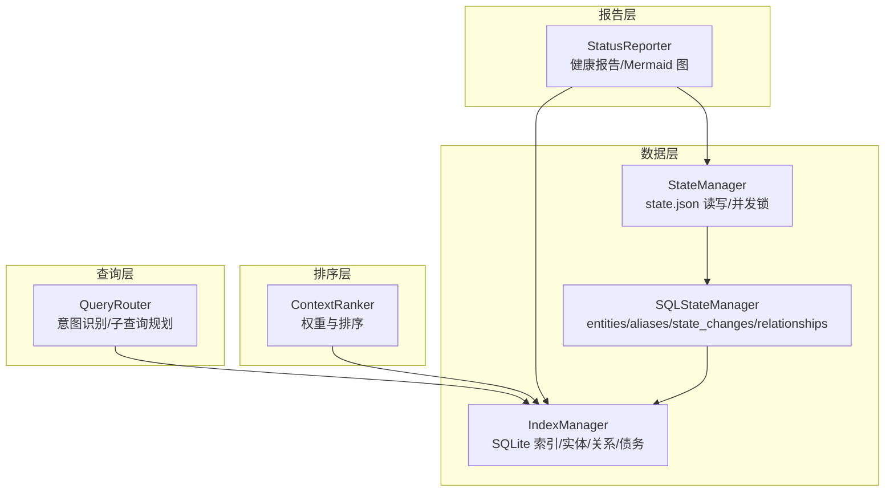
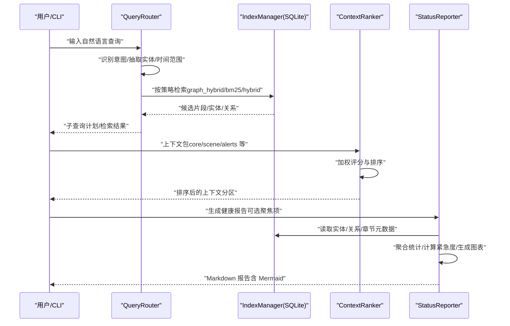
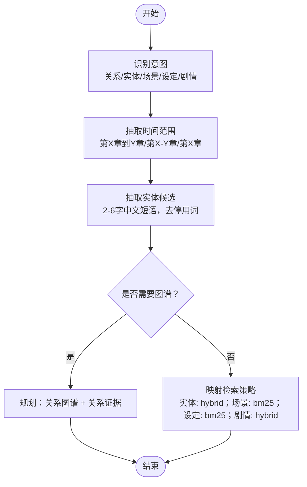
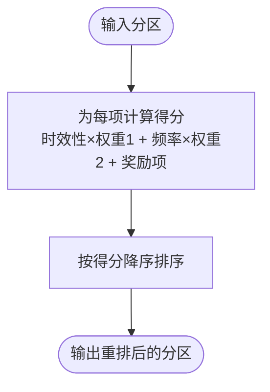
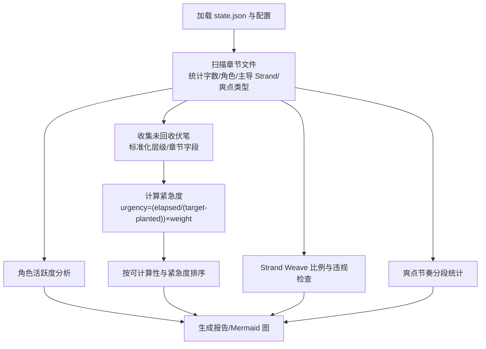
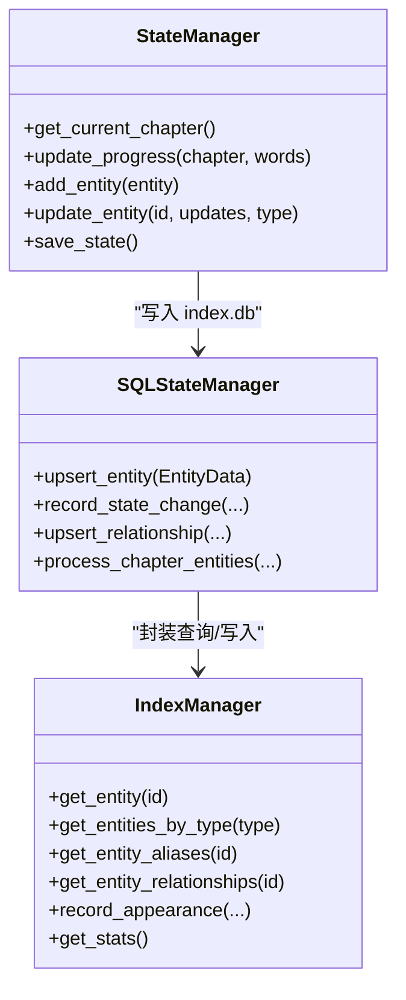
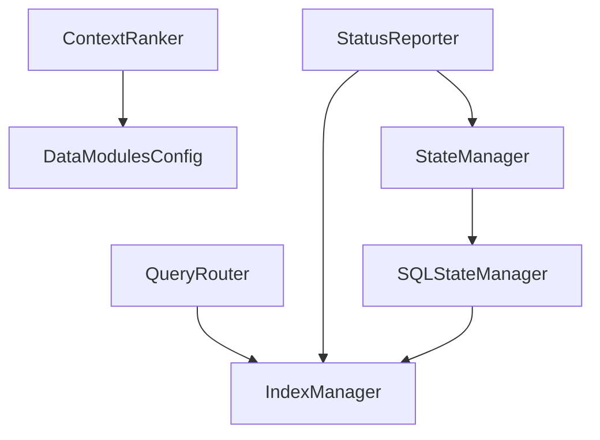

# 状态查询工具

<cite>
**本文引用的文件**
- [status_reporter.py](file://webnovel-writer/scripts/status_reporter.py)
- [query_router.py](file://webnovel-writer/scripts/data_modules/query_router.py)
- [context_ranker.py](file://webnovel-writer/scripts/data_modules/context_ranker.py)
- [state_manager.py](file://webnovel-writer/scripts/data_modules/state_manager.py)
- [sql_state_manager.py](file://webnovel-writer/scripts/data_modules/sql_state_manager.py)
- [config.py](file://webnovel-writer/scripts/data_modules/config.py)
- [index_manager.py](file://webnovel-writer/scripts/data_modules/index_manager.py)
- [state_validator.py](file://webnovel-writer/scripts/data_modules/state_validator.py)
- [operations.md](file://docs/operations.md)
- [README.md](file://docs/README.md)
</cite>

## 目录
1. [简介](#简介)
2. [项目结构](#项目结构)
3. [核心组件](#核心组件)
4. [架构总览](#架构总览)
5. [详细组件分析](#详细组件分析)
6. [依赖分析](#依赖分析)
7. [性能考量](#性能考量)
8. [故障排查指南](#故障排查指南)
9. [结论](#结论)
10. [附录](#附录)

## 简介
本文件为 Webnovel Writer 的“状态查询工具”提供系统化使用文档，面向运维与系统监控工程师，聚焦以下能力：
- 查询路由器的路由机制与意图识别
- 状态报告器的信息聚合与可视化输出
- 上下文排序器的权重计算与排序算法
- 状态查询命令的使用方法、查询条件与结果格式
- 实时状态监控、历史数据分析与性能指标统计
- 查询优化策略、缓存机制与并发处理能力
- 最佳实践、告警配置与故障诊断方法

## 项目结构
围绕状态查询与监控，核心模块分布如下：
- 数据层：SQLite 索引与状态管理（index.db、state.json 迁移）
- 查询层：查询路由器（意图识别、子查询规划）
- 排序层：上下文排序器（基于权重的确定性排序）
- 报告层：状态报告器（健康报告、Mermaid 图谱、统计指标）

图表来源
- [query_router.py:10-145](file://webnovel-writer/scripts/data_modules/query_router.py#L10-L145)
- [context_ranker.py:20-211](file://webnovel-writer/scripts/data_modules/context_ranker.py#L20-L211)
- [index_manager.py:1-200](file://webnovel-writer/scripts/data_modules/index_manager.py#L1-L200)
- [state_manager.py:90-140](file://webnovel-writer/scripts/data_modules/state_manager.py#L90-L140)
- [sql_state_manager.py:46-100](file://webnovel-writer/scripts/data_modules/sql_state_manager.py#L46-L100)
- [status_reporter.py:126-141](file://webnovel-writer/scripts/status_reporter.py#L126-L141)

章节来源
- [README.md:1-36](file://docs/README.md#L1-L36)

## 核心组件
- 查询路由器（QueryRouter）：基于关键词与正则识别查询意图，抽取实体与时间范围，生成检索步骤（graph_hybrid/bm25/hybrid 等）。
- 上下文排序器（ContextRanker）：对上下文包中的多个分区（如 recent_summaries/recent_meta/appearing_characters/story_skeleton/alerts）按“时效性/频率/钩子提示/严重性/关键词”加权排序。
- 状态报告器（StatusReporter）：聚合角色活跃度、伏笔紧急度、Strand Weave 节奏、爽点节奏与关系图，输出 Markdown 报告与 Mermaid 图。
- 状态管理器（StateManager/SQLStateManager）：负责 state.json 的并发安全读写与 SQLite 同步，提供实体、关系、状态变化的读取与批量写入。
- 索引管理器（IndexManager）：SQLite 数据模型与快速查询接口，支撑实体、别名、关系、章节元数据、追读力债务等。

章节来源
- [query_router.py:10-145](file://webnovel-writer/scripts/data_modules/query_router.py#L10-L145)
- [context_ranker.py:20-211](file://webnovel-writer/scripts/data_modules/context_ranker.py#L20-L211)
- [status_reporter.py:126-141](file://webnovel-writer/scripts/status_reporter.py#L126-L141)
- [state_manager.py:90-140](file://webnovel-writer/scripts/data_modules/state_manager.py#L90-L140)
- [sql_state_manager.py:46-100](file://webnovel-writer/scripts/data_modules/sql_state_manager.py#L46-L100)
- [index_manager.py:1-200](file://webnovel-writer/scripts/data_modules/index_manager.py#L1-L200)

## 架构总览
状态查询工具的整体数据流与控制流如下：

图表来源
- [query_router.py:67-137](file://webnovel-writer/scripts/data_modules/query_router.py#L67-L137)
- [context_ranker.py:28-56](file://webnovel-writer/scripts/data_modules/context_ranker.py#L28-L56)
- [status_reporter.py:342-432](file://webnovel-writer/scripts/status_reporter.py#L342-L432)
- [index_manager.py:1-200](file://webnovel-writer/scripts/data_modules/index_manager.py#L1-L200)

## 详细组件分析

### 查询路由器（QueryRouter）
- 路由机制
  - 意图识别：基于关键词正则匹配“关系/图谱/时间线/谁和谁/敌对/盟友/人物/角色/谁/身份/别名/地点/场景/哪里/位置/设定/规则/体系/世界观/剧情/发生/事件/经过”等，优先匹配到的意图即为结果。
  - 时间范围抽取：支持“第X章到Y章”“第X-Y章”“第X章”等格式，自动规范化为 from_chapter/to_chapter。
  - 实体抽取：从查询中提取长度 2-6 的中文短语，过滤常见停用词，最多保留若干候选。
  - 图谱需求：若包含“关系/图谱/时间线”或明确要求图谱，则开启图谱增强检索。
- 子查询规划
  - 关系类查询：先执行“关系图谱”步骤，再执行“关系证据”混合检索。
  - 需要图谱且有实体：执行“图谱增强检索”。
  - 其他意图：按实体/场景/设定/剧情分别映射到 hybrid/bm25 策略。
- 查询切分
  - 支持“，,；;以及和”等符号切分为多个子查询，逐个处理。

图表来源
- [query_router.py:67-137](file://webnovel-writer/scripts/data_modules/query_router.py#L67-L137)

章节来源
- [query_router.py:10-145](file://webnovel-writer/scripts/data_modules/query_router.py#L10-L145)

### 上下文排序器（ContextRanker）
- 目标与原则
  - 在保证向后兼容的前提下，优先近期出现且频繁出现的实体，突出高信号钩子/警示项，稳定输出形状（相同键、重排列表）。
- 排序分区
  - recent_summaries/recent_meta：按章节时效性、摘要长度加权，钩子提示加分。
  - appearing_characters：按最后出场章节的时效性、总出场次数加权，带警告惩罚。
  - story_skeleton：按章节时效性、摘要长度加权。
  - alerts：按章节时效性、严重级别（critical/high）、关键词命中加分。
- 权重与评分
  - 综合评分 = 时效性×权重1 + 频率×权重2 + 奖励项（钩子/严重性/关键词）。
  - 时效性：1/(1+章差)，越近越高。
  - 频率：log-scale，避免极值。
  - 奖励项：钩子提示、严重级别、关键词命中。
- 输出
  - 对每个分区按得分降序排序，返回重排后的列表；可选输出调试分数与明细。

图表来源
- [context_ranker.py:148-175](file://webnovel-writer/scripts/data_modules/context_ranker.py#L148-L175)

章节来源
- [context_ranker.py:20-211](file://webnovel-writer/scripts/data_modules/context_ranker.py#L20-L211)

### 状态报告器（StatusReporter）
- 功能概览
  - 角色活跃度分析：统计角色最后出场章与缺勤天数，按阈值分级。
  - 伏笔深度分析：识别未回收伏笔，标注埋设/目标章与超时状态。
  - 伏笔紧急度排序：基于三层级权重（核心/支线/装饰）与回收时限计算紧急度，按可计算性与紧急度降序排列。
  - Strand Weave 节奏分析：统计 Quest/Fire/Constellation 三线占比与连续/缺失违规，给出健康评分。
  - 爽点节奏分布：按固定段长统计每段字数/爽点数/每点字数，给出评级与覆盖率。
  - 人际关系图：优先从 index.db 构建关系子图（可配置开关），否则回退到 state.json 的 relationships。
- 关键算法
  - 伏笔紧急度：urgency = (已过章节 / 目标回收章节) × 层级权重；若目标章<=埋设章则按权重倍数计算。
  - 紧急度状态：根据剩余章与 urgency 值分级。
  - 角色缺勤状态：按阈值分级。
  - Strand Weave 违规：检查连续/缺失上限与占比区间。
  - 爽点节奏评级：按“每点字数”阈值分级。
- 缓存与性能
  - 章节追读力缓存：章节级缓存 chapter_reading_power，避免重复查询。
  - 章节扫描：支持“正文/第0001章.md”与“正文/第1卷/第001章-标题.md”两种目录结构。
- 输出
  - Markdown 报告，包含基本数据、角色掉线、伏笔超时、Strand Weave、爽点节奏、Mermaid 关系图等。

图表来源
- [status_reporter.py:154-166](file://webnovel-writer/scripts/status_reporter.py#L154-L166)
- [status_reporter.py:342-432](file://webnovel-writer/scripts/status_reporter.py#L342-L432)
- [status_reporter.py:483-540](file://webnovel-writer/scripts/status_reporter.py#L483-L540)
- [status_reporter.py:552-673](file://webnovel-writer/scripts/status_reporter.py#L552-L673)
- [status_reporter.py:675-725](file://webnovel-writer/scripts/status_reporter.py#L675-L725)

章节来源
- [status_reporter.py:126-800](file://webnovel-writer/scripts/status_reporter.py#L126-L800)

### 状态管理器与 SQLite 同步（StateManager/SQLStateManager/IndexManager）
- 并发与一致性
  - state.json 采用文件锁 + 锁内重读 + 增量合并 + 原子写入，避免多 Agent 并发覆盖。
  - 进度字段（当前章/总字数）采用 max/累加策略合并。
- SQLite 同步
  - v5.1 引入：将 entities_v3/alias_index/state_changes/structured_relationships 等大数据字段迁移至 index.db。
  - StateManager 与 SQLStateManager 接口兼容，写入时同时维护 state.json 精简数据与 index.db 大数据表。
  - 支持批量处理章节实体数据（出场实体/新实体/状态变化/新关系），并记录关系事件与首次出场。
- 快速查询
  - IndexManager 提供实体/别名/关系/状态变化/章节元数据/追读力债务等查询接口，支撑报告器与检索链路。

图表来源
- [state_manager.py:90-140](file://webnovel-writer/scripts/data_modules/state_manager.py#L90-L140)
- [sql_state_manager.py:46-100](file://webnovel-writer/scripts/data_modules/sql_state_manager.py#L46-L100)
- [index_manager.py:1-200](file://webnovel-writer/scripts/data_modules/index_manager.py#L1-L200)

章节来源
- [state_manager.py:90-594](file://webnovel-writer/scripts/data_modules/state_manager.py#L90-L594)
- [sql_state_manager.py:46-595](file://webnovel-writer/scripts/data_modules/sql_state_manager.py#L46-L595)
- [index_manager.py:1-200](file://webnovel-writer/scripts/data_modules/index_manager.py#L1-L200)

## 依赖分析
- 组件耦合
  - QueryRouter 依赖 IndexManager 进行检索与图谱增强。
  - ContextRanker 依赖配置参数（权重/阈值）进行评分与排序。
  - StatusReporter 依赖 IndexManager 读取实体/关系/章节元数据，依赖 StateManager/SQLStateManager 读取/写入运行态数据。
- 外部依赖
  - 配置通过 DataModulesConfig 提供，支持环境变量注入与项目级 .env 加载。
  - 运行时兼容与并发控制（文件锁、线程安全）由底层模块保障。

图表来源
- [query_router.py:10-145](file://webnovel-writer/scripts/data_modules/query_router.py#L10-L145)
- [context_ranker.py:25-55](file://webnovel-writer/scripts/data_modules/context_ranker.py#L25-L55)
- [status_reporter.py:126-141](file://webnovel-writer/scripts/status_reporter.py#L126-L141)
- [state_manager.py:90-140](file://webnovel-writer/scripts/data_modules/state_manager.py#L90-L140)
- [sql_state_manager.py:46-100](file://webnovel-writer/scripts/data_modules/sql_state_manager.py#L46-L100)
- [config.py:90-349](file://webnovel-writer/scripts/data_modules/config.py#L90-L349)

章节来源
- [config.py:90-349](file://webnovel-writer/scripts/data_modules/config.py#L90-L349)

## 性能考量
- 并发与锁
  - StateManager 通过文件锁避免并发写入覆盖，建议在批处理/定时任务中合并多次更新，减少写入次数。
- 缓存
  - StatusReporter 对章节追读力进行章节级缓存，降低重复查询成本。
- 检索与排序
  - QueryRouter 的策略选择影响检索开销；BM25 适合场景/设定检索，Hybrid 适合实体/剧情检索。
  - ContextRanker 的评分函数为 O(n) 排序，权重参数可调以平衡时效性与稳定性。
- I/O 与索引
  - SQLite 索引与表结构（entities/aliases/state_changes/relationships/chapter_reading_power 等）直接影响查询性能，建议定期维护索引与统计。

[本节为通用性能指导，无需特定文件引用]

## 故障排查指南
- 常见问题定位
  - 状态文件缺失：检查 .webnovel/state.json 是否存在，确认项目根路径解析正确。
  - 章节目录结构异常：确认“正文/第0001章.md”或“正文/第1卷/第001章-标题.md”格式。
  - 查询无结果：检查 QueryRouter 的意图识别与实体抽取是否正确，必要时调整查询表达。
  - 报告图为空：确认 index.db 中是否存在关系数据或禁用了从 index.db 生成图谱。
- 运维命令参考
  - 健康报告：使用 CLI 指令生成完整健康报告或聚焦“紧急度”报告。
  - 索引重建：按章节处理并统计索引状态，确保数据完整性。
  - 向量重建：重建 RAG 向量索引并统计状态。
- 建议流程
  - 先执行索引重建与统计，再生成健康报告，最后进行 RAG 索引重建与统计。

章节来源
- [operations.md:63-99](file://docs/operations.md#L63-L99)

## 结论
本状态查询工具通过“查询路由—上下文排序—状态报告”的分层设计，结合 SQLite 大数据存储与并发安全写入，提供了面向长篇写作项目的实时状态监控、历史数据分析与性能指标统计能力。QueryRouter 的意图识别与策略规划、ContextRanker 的权重排序、StatusReporter 的聚合输出，共同构成一套可扩展、可观测、可运维的状态管理解决方案。

[本节为总结性内容，无需特定文件引用]

## 附录

### 状态查询命令与使用方法
- 健康报告
  - 生成完整健康报告：python status_reporter.py --output .webnovel/health_report.md
  - 仅分析角色活跃度：python status_reporter.py --focus characters
  - 仅分析伏笔：python status_reporter.py --focus foreshadowing
  - 仅分析爽点节奏：python status_reporter.py --focus pacing
  - 分析 Strand Weave 节奏：python status_reporter.py --focus strand
- CLI 常用命令
  - 索引重建与统计：按章节处理并查看统计
  - 健康报告：生成完整/聚焦报告
  - 向量重建与统计：重建 RAG 索引并查看统计

章节来源
- [status_reporter.py:20-35](file://webnovel-writer/scripts/status_reporter.py#L20-L35)
- [operations.md:80-92](file://docs/operations.md#L80-L92)

### 查询条件与结果格式
- 查询条件
  - 意图：关系/实体/场景/设定/剧情
  - 实体：2-6 字中文短语，过滤停用词
  - 时间范围：第X章到Y章/第X-Y章/第X章
- 结果格式
  - QueryRouter：返回意图、实体、时间范围、是否需要图谱、子查询计划
  - ContextRanker：返回各分区重排后的列表，可选调试分数与明细
  - StatusReporter：Markdown 报告，包含基本数据、角色掉线、伏笔超时、Strand Weave、爽点节奏、Mermaid 关系图

章节来源
- [query_router.py:67-137](file://webnovel-writer/scripts/data_modules/query_router.py#L67-L137)
- [context_ranker.py:185-200](file://webnovel-writer/scripts/data_modules/context_ranker.py#L185-L200)
- [status_reporter.py:36-79](file://webnovel-writer/scripts/status_reporter.py#L36-L79)

### 配置与最佳实践
- 配置项
  - 伏笔紧急度阈值与层级权重
  - 角色活跃度阈值
  - Strand Weave 比例与连续/缺失上限
  - 爽点节奏分段大小与评级阈值
  - 上下文排序权重与钩子/关键词奖励
- 最佳实践
  - 合理设置阈值以平衡预警与噪音
  - 使用图谱增强检索提升关系类查询质量
  - 定期重建索引与向量索引，保持查询性能
  - 结合健康报告与 RAG 检索进行跨维度审查

章节来源
- [config.py:269-305](file://webnovel-writer/scripts/data_modules/config.py#L269-L305)
- [context_ranker.py:197-209](file://webnovel-writer/scripts/data_modules/context_ranker.py#L197-L209)