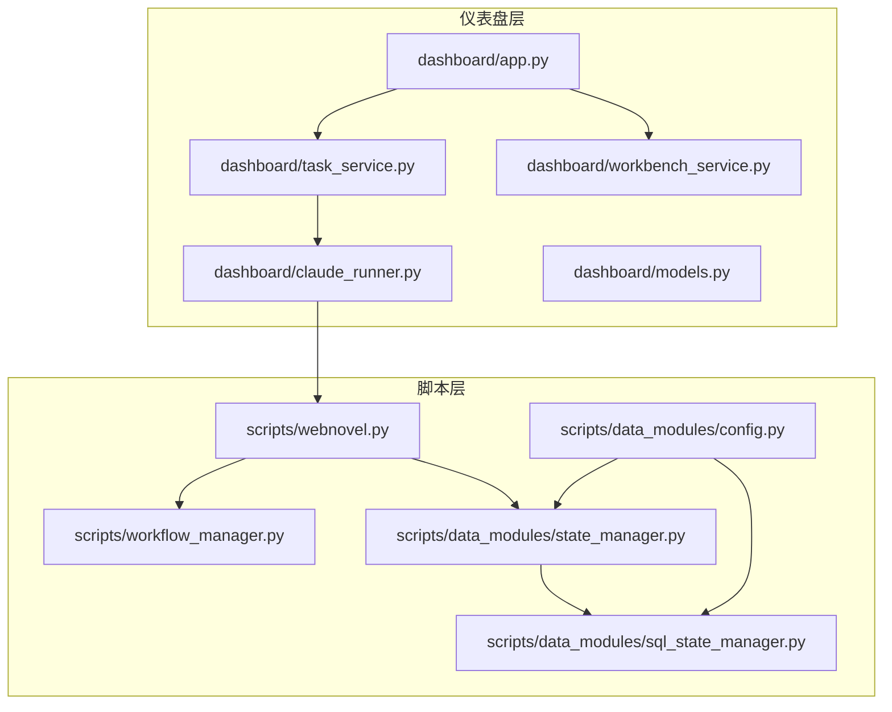
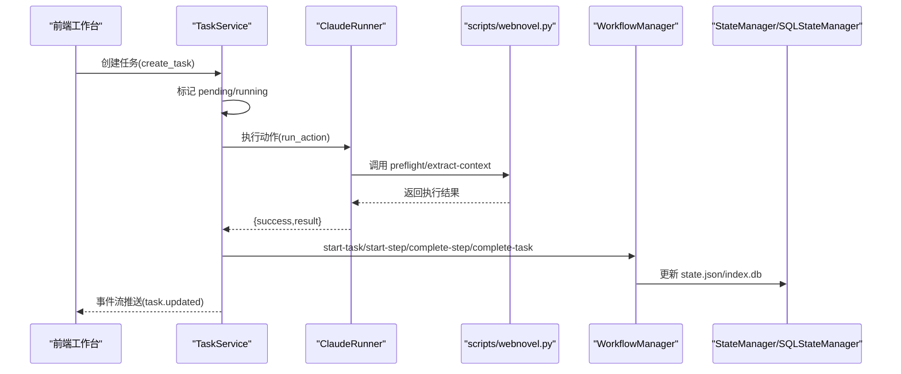
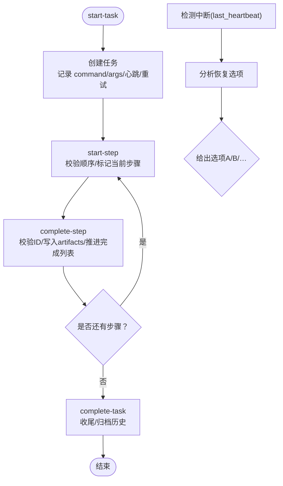
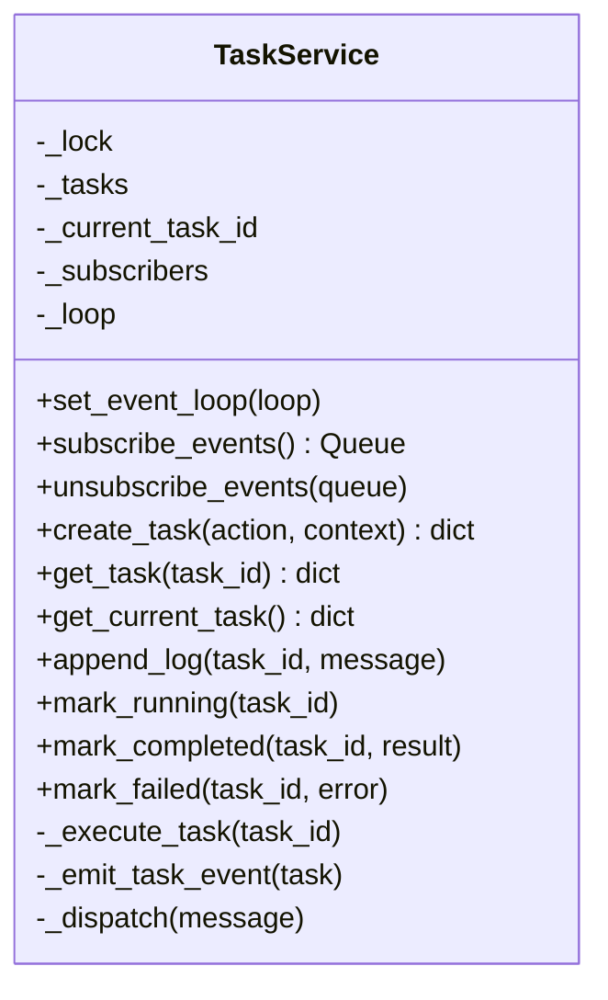
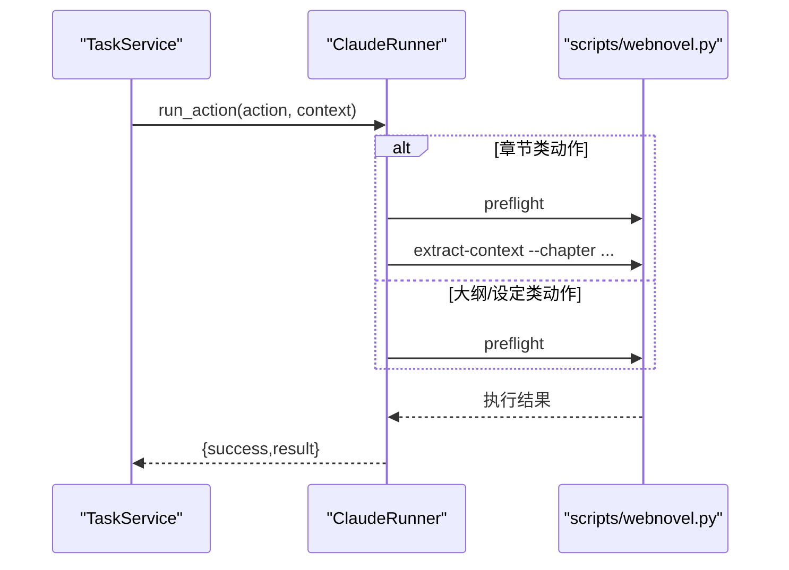
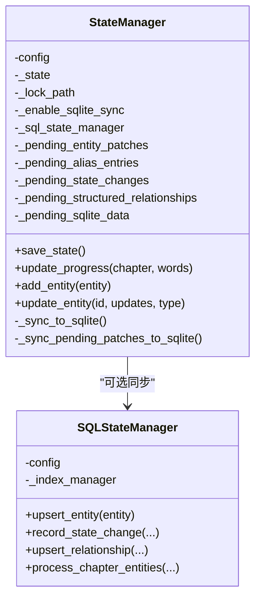
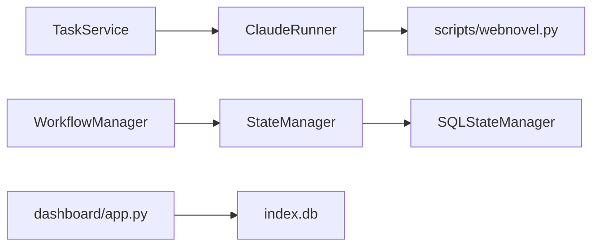
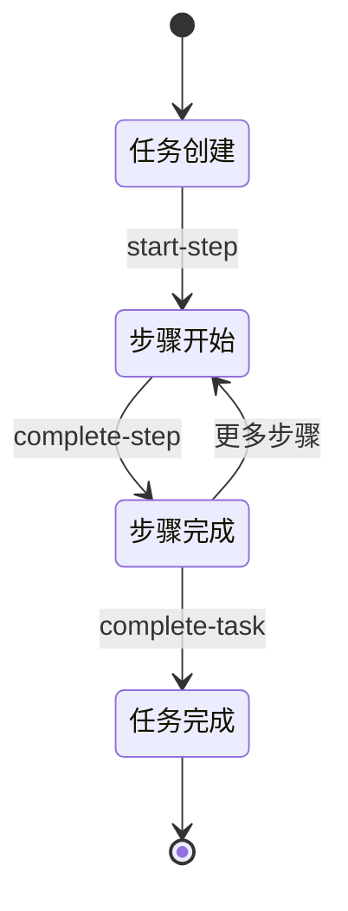
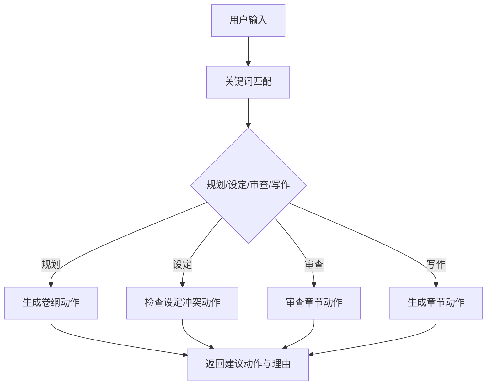

# 工作流管理

<cite>
**本文引用的文件**
- [workflow_manager.py](file://webnovel-writer/scripts/workflow_manager.py)
- [task_service.py](file://webnovel-writer/dashboard/task_service.py)
- [workbench_service.py](file://webnovel-writer/dashboard/workbench_service.py)
- [claude_runner.py](file://webnovel-writer/dashboard/claude_runner.py)
- [models.py](file://webnovel-writer/dashboard/models.py)
- [state_manager.py](file://webnovel-writer/scripts/data_modules/state_manager.py)
- [sql_state_manager.py](file://webnovel-writer/scripts/data_modules/sql_state_manager.py)
- [config.py](file://webnovel-writer/scripts/data_modules/config.py)
- [app.py](file://webnovel-writer/dashboard/app.py)
- [webnovel.py](file://webnovel-writer/scripts/webnovel.py)
</cite>

## 目录
1. [简介](#简介)
2. [项目结构](#项目结构)
3. [核心组件](#核心组件)
4. [架构总览](#架构总览)
5. [详细组件分析](#详细组件分析)
6. [依赖分析](#依赖分析)
7. [性能考虑](#性能考虑)
8. [故障排查指南](#故障排查指南)
9. [结论](#结论)
10. [附录](#附录)

## 简介
本文件面向开发者与系统运维人员，系统化阐述 Webnovel Writer 的工作流管理能力，涵盖任务调度机制、执行流程控制、状态跟踪与可观测性、生命周期管理（创建/排队/执行/监控/反馈）、与 AI 代理系统的集成、任务优先级与并发控制、配置项与性能优化、错误处理与重试策略，以及实用的执行日志与性能指标监控指引。文档同时提供架构图与流程图，帮助快速理解与落地实施。

## 项目结构
围绕工作流管理的关键模块分布如下：
- 脚本层（scripts）：统一 CLI 入口与工作流状态管理
  - scripts/webnovel.py：统一入口脚本，转发到 data_modules.webnovel
  - scripts/workflow_manager.py：工作流状态机与可观测性（call_trace）
  - scripts/data_modules/state_manager.py：状态管理（v5.4，含 SQLite 同步）
  - scripts/data_modules/sql_state_manager.py：SQL 状态管理器（index.db）
  - scripts/data_modules/config.py：数据模块配置（并发/超时/重试/检索参数）
- 控制台仪表盘（dashboard）：前端工作台与任务服务
  - dashboard/app.py：FastAPI 应用（只读查询、工作台摘要、任务事件流）
  - dashboard/task_service.py：任务生命周期与事件订阅
  - dashboard/workbench_service.py：工作台摘要与动作建议
  - dashboard/claude_runner.py：动作到 CLI 的适配层
  - dashboard/models.py：工作台常量（页面/根目录/任务状态）

**图表来源**
- [webnovel.py:1-37](file://webnovel-writer/scripts/webnovel.py#L1-L37)
- [workflow_manager.py:1-823](file://webnovel-writer/scripts/workflow_manager.py#L1-L823)
- [state_manager.py:1-1352](file://webnovel-writer/scripts/data_modules/state_manager.py#L1-L1352)
- [sql_state_manager.py:1-595](file://webnovel-writer/scripts/data_modules/sql_state_manager.py#L1-L595)
- [config.py:1-349](file://webnovel-writer/scripts/data_modules/config.py#L1-L349)
- [app.py:1-513](file://webnovel-writer/dashboard/app.py#L1-L513)
- [task_service.py:1-166](file://webnovel-writer/dashboard/task_service.py#L1-L166)
- [workbench_service.py:1-171](file://webnovel-writer/dashboard/workbench_service.py#L1-L171)
- [claude_runner.py:1-142](file://webnovel-writer/dashboard/claude_runner.py#L1-L142)
- [models.py:1-23](file://webnovel-writer/dashboard/models.py#L1-L23)

**章节来源**
- [webnovel.py:1-37](file://webnovel-writer/scripts/webnovel.py#L1-L37)
- [app.py:1-200](file://webnovel-writer/dashboard/app.py#L1-L200)

## 核心组件
- 工作流状态管理器（workflow_manager.py）
  - 任务/步骤状态：running/completed/failed；started/running/completed/failed
  - 生命周期：start-task → start-step → complete-step → complete-task
  - 中断检测与恢复选项分析
  - 可观测性：call_trace.jsonl 追加事件
  - 原子写入 workflow_state.json，安全清理 artifacts
- 任务服务（task_service.py）
  - 任务模型：pending/running/completed/failed
  - 事件驱动：线程池异步执行，事件队列推送
  - 日志截断与时间戳更新
- 工作台服务（workbench_service.py）
  - 项目摘要：标题/题材/目标字数/章节数
  - 动作建议：根据用户输入关键词匹配规划/设定/审查/写作
- CLI 适配层（claude_runner.py）
  - 将工作台动作映射为统一 CLI 调用（preflight、extract-context 等）
- 状态与索引（state_manager.py / sql_state_manager.py）
  - v5.4：state.json 精简，大数据迁移到 index.db（entities/relationships/state_changes/aliases）
  - 增量写入与原子落盘，SQLite 同步失败回滚
- 配置（config.py）
  - 并发/超时/重试/检索/预算/节奏等参数
- 统一入口（webnovel.py）
  - sys.path 注入 scripts，转发到 data_modules.webnovel.main()

**章节来源**
- [workflow_manager.py:36-722](file://webnovel-writer/scripts/workflow_manager.py#L36-L722)
- [task_service.py:14-166](file://webnovel-writer/dashboard/task_service.py#L14-L166)
- [workbench_service.py:18-162](file://webnovel-writer/dashboard/workbench_service.py#L18-L162)
- [claude_runner.py:13-142](file://webnovel-writer/dashboard/claude_runner.py#L13-L142)
- [state_manager.py:90-594](file://webnovel-writer/scripts/data_modules/state_manager.py#L90-L594)
- [sql_state_manager.py:46-417](file://webnovel-writer/scripts/data_modules/sql_state_manager.py#L46-L417)
- [config.py:90-349](file://webnovel-writer/scripts/data_modules/config.py#L90-L349)
- [webnovel.py:24-37](file://webnovel-writer/scripts/webnovel.py#L24-L37)

## 架构总览
工作流管理贯穿“前端工作台 → 任务服务 → CLI 适配 → 统一入口 → 工作流状态管理 → 状态/索引持久化”的闭环。前端通过事件流接收任务状态变更，后台通过 CLI 适配层触发实际工作流步骤，工作流状态机保障一致性与可观测性，状态管理器与 SQL 状态管理器保证数据一致性与性能。

**图表来源**
- [task_service.py:36-143](file://webnovel-writer/dashboard/task_service.py#L36-L143)
- [claude_runner.py:13-117](file://webnovel-writer/dashboard/claude_runner.py#L13-L117)
- [webnovel.py:24-37](file://webnovel-writer/scripts/webnovel.py#L24-L37)
- [workflow_manager.py:191-362](file://webnovel-writer/scripts/workflow_manager.py#L191-L362)
- [state_manager.py:208-370](file://webnovel-writer/scripts/data_modules/state_manager.py#L208-L370)
- [sql_state_manager.py:267-417](file://webnovel-writer/scripts/data_modules/sql_state_manager.py#L267-L417)

## 详细组件分析

### 工作流状态管理器（WorkflowManager）
- 状态与序列
  - 任务状态：running/completed/failed
  - 步骤状态：started/running/completed/failed
  - 步骤顺序约束：按命令类型（如 webnovel-write/webnovel-review）预设序列，禁止越序
- 生命周期控制
  - start-task：创建新任务，记录 args/command/心跳/重试次数
  - start-step：校验顺序约束，标记当前步骤，更新任务状态与心跳
  - complete-step：校验当前步骤 ID，写入 artifacts，推进 completed_steps
  - complete-task：收尾当前活动步骤，写入最终 artifacts，归档历史
- 中断检测与恢复
  - 检测 last_heartbeat 超时，输出中断信息
  - analyze_recovery_options：按当前步骤给出“从头开始/回滚/跳过/继续”等选项
- 清理与可观测性
  - cleanup_artifacts：高风险删除章节与 Git 暂存区，带备份与预览
  - safe_append_call_trace：call_trace.jsonl 追加事件，便于审计与诊断
- 原子持久化
  - workflow_state.json 原子写入，失败保护与回退

**图表来源**
- [workflow_manager.py:191-362](file://webnovel-writer/scripts/workflow_manager.py#L191-L362)
- [workflow_manager.py:365-564](file://webnovel-writer/scripts/workflow_manager.py#L365-L564)

**章节来源**
- [workflow_manager.py:36-722](file://webnovel-writer/scripts/workflow_manager.py#L36-L722)

### 任务服务（TaskService）
- 任务模型
  - 字段：id/status/action/context/logs/result/error/createdAt/updatedAt
  - 状态机：pending → running → completed 或 failed
- 事件与并发
  - 线程池异步执行任务，主线程安全锁保护
  - 事件队列（最多 128）推送 task.updated 消息
- 日志与结果
  - 日志截断保留最近 200 条，带时间戳
  - 成功/失败分支分别写入 result/error

**图表来源**
- [task_service.py:14-166](file://webnovel-writer/dashboard/task_service.py#L14-L166)

**章节来源**
- [task_service.py:14-166](file://webnovel-writer/dashboard/task_service.py#L14-L166)

### CLI 适配层（ClaudeRunner）
- 作用
  - 将工作台动作映射为统一 CLI 调用，确保 preflight 与 extract-context 的一致性
  - 对章节类动作解析章节号，对大纲/设定类动作进行路径校验
- 返回格式
  - success/stdout/stderr/result，便于任务服务记录与前端展示

**图表来源**
- [claude_runner.py:13-117](file://webnovel-writer/dashboard/claude_runner.py#L13-L117)
- [webnovel.py:24-37](file://webnovel-writer/scripts/webnovel.py#L24-L37)

**章节来源**
- [claude_runner.py:13-142](file://webnovel-writer/dashboard/claude_runner.py#L13-L142)

### 状态与索引（StateManager/SQLStateManager）
- StateManager（v5.4）
  - state.json 精简：移除 entities_v3/alias_index/state_changes/structured_relationships
  - 增量写入：锁内重读 + 合并 + 原子写入
  - SQLite 同步：process_chapter_entities 与 _sync_pending_patches_to_sqlite
  - 失败回滚：_snapshot_sqlite_pending/_restore_sqlite_pending
- SQLStateManager
  - 实体/关系/状态变化写入 index.db
  - 批量处理章节实体数据（entities_appeared/new/state_changes/relationships_new）

**图表来源**
- [state_manager.py:90-594](file://webnovel-writer/scripts/data_modules/state_manager.py#L90-L594)
- [sql_state_manager.py:46-417](file://webnovel-writer/scripts/data_modules/sql_state_manager.py#L46-L417)

**章节来源**
- [state_manager.py:90-594](file://webnovel-writer/scripts/data_modules/state_manager.py#L90-L594)
- [sql_state_manager.py:46-417](file://webnovel-writer/scripts/data_modules/sql_state_manager.py#L46-L417)

### 工作台服务（WorkbenchService）
- 项目摘要：从 .webnovel/state.json 读取项目信息与进度，枚举工作空间根目录
- 动作建议：根据关键词匹配规划/设定/审查/写作，返回建议动作与理由
- 写入保护：通过 path_guard 限定写入范围

**章节来源**
- [workbench_service.py:18-162](file://webnovel-writer/dashboard/workbench_service.py#L18-L162)

## 依赖分析
- 组件耦合
  - TaskService 依赖 ClaudeRunner；ClaudeRunner 依赖 scripts/webnovel.py
  - WorkflowManager 与 StateManager/SQLStateManager 协同持久化
  - Dashboard app.py 通过只读接口访问 index.db
- 外部依赖
  - SQLite（index.db）用于实体/关系/状态变化
  - 文件锁（state.json.lock）保证并发安全
  - 环境变量与 .env 配置（EMBED_*、RERANK_* 等）

**图表来源**
- [task_service.py:14-166](file://webnovel-writer/dashboard/task_service.py#L14-L166)
- [claude_runner.py:13-117](file://webnovel-writer/dashboard/claude_runner.py#L13-L117)
- [webnovel.py:24-37](file://webnovel-writer/scripts/webnovel.py#L24-L37)
- [workflow_manager.py:690-712](file://webnovel-writer/scripts/workflow_manager.py#L690-L712)
- [state_manager.py:208-370](file://webnovel-writer/scripts/data_modules/state_manager.py#L208-L370)
- [sql_state_manager.py:267-417](file://webnovel-writer/scripts/data_modules/sql_state_manager.py#L267-L417)
- [app.py:96-200](file://webnovel-writer/dashboard/app.py#L96-L200)

**章节来源**
- [app.py:96-200](file://webnovel-writer/dashboard/app.py#L96-L200)
- [config.py:90-349](file://webnovel-writer/scripts/data_modules/config.py#L90-L349)

## 性能考虑
- 并发与批处理
  - DataModulesConfig.embed_concurrency/rerank_concurrency/batch_size 控制向量化与重排序并发
  - SQLStateManager 批量写入 entities_appeared/new/state_changes/relationships_new
- 超时与重试
  - cold_start_timeout/normal_timeout 控制冷启动与常规超时
  - api_max_retries/api_retry_delay 指数退避重试
- 检索与预算
  - vector_top_k/bm25_top_k/rerank_top_n/RRF 融合参数
  - 动态预算（context_dynamic_budget_*）随章节动态调整
- I/O 优化
  - state.json 锁内合并写入，避免竞态
  - SQLite 同步失败回滚，保证一致性

**章节来源**
- [config.py:144-349](file://webnovel-writer/scripts/data_modules/config.py#L144-L349)
- [state_manager.py:208-370](file://webnovel-writer/scripts/data_modules/state_manager.py#L208-L370)
- [sql_state_manager.py:267-417](file://webnovel-writer/scripts/data_modules/sql_state_manager.py#L267-L417)

## 故障排查指南
- 中断检测与恢复
  - detect_interruption 输出任务状态、当前步骤、失败步骤、耗时、artifacts 等
  - analyze_recovery_options 提供从头开始、回滚到上一章、跳过审查、继续润色等选项
- 清理 artifacts
  - cleanup_artifacts 支持 --confirm 执行删除与 Git 重置，带备份与预览
- 标记失败与清除
  - fail_current_task：手动标记失败并保留诊断信息
  - clear_current_task：清除中断任务，释放状态
- 事件与日志
  - call_trace.jsonl 记录 task_started/step_started/step_completed 等事件
  - TaskService 日志截断与时间戳更新，便于定位异常

**章节来源**
- [workflow_manager.py:365-667](file://webnovel-writer/scripts/workflow_manager.py#L365-L667)
- [task_service.py:72-119](file://webnovel-writer/dashboard/task_service.py#L72-L119)

## 结论
工作流管理通过“状态机 + 事件流 + CLI 适配 + 状态/索引持久化”的组合，实现了从任务创建到结果反馈的全生命周期管理。配合可观测性与恢复策略，系统在复杂写作流程中具备高可靠性与可运维性。建议在生产环境中结合配置参数与日志事件进行持续监控与优化。

## 附录

### 工作流生命周期与状态图

**图表来源**
- [workflow_manager.py:191-362](file://webnovel-writer/scripts/workflow_manager.py#L191-L362)

### 工作台动作建议流程

**图表来源**
- [workbench_service.py:74-162](file://webnovel-writer/dashboard/workbench_service.py#L74-L162)