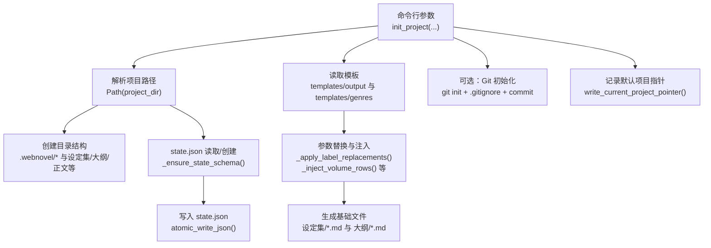
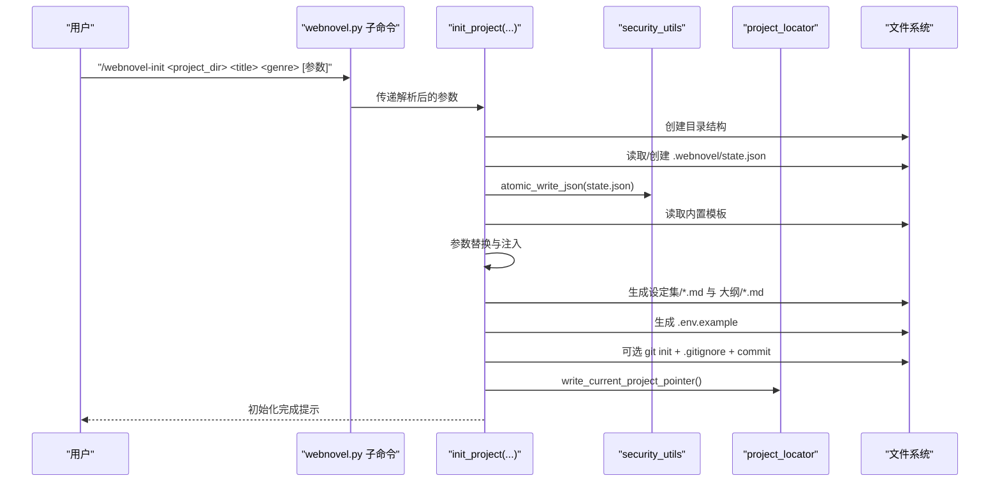
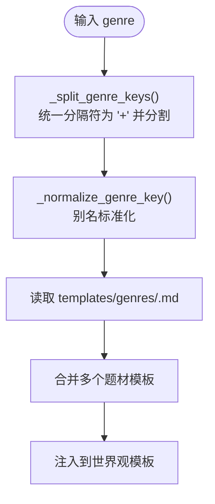
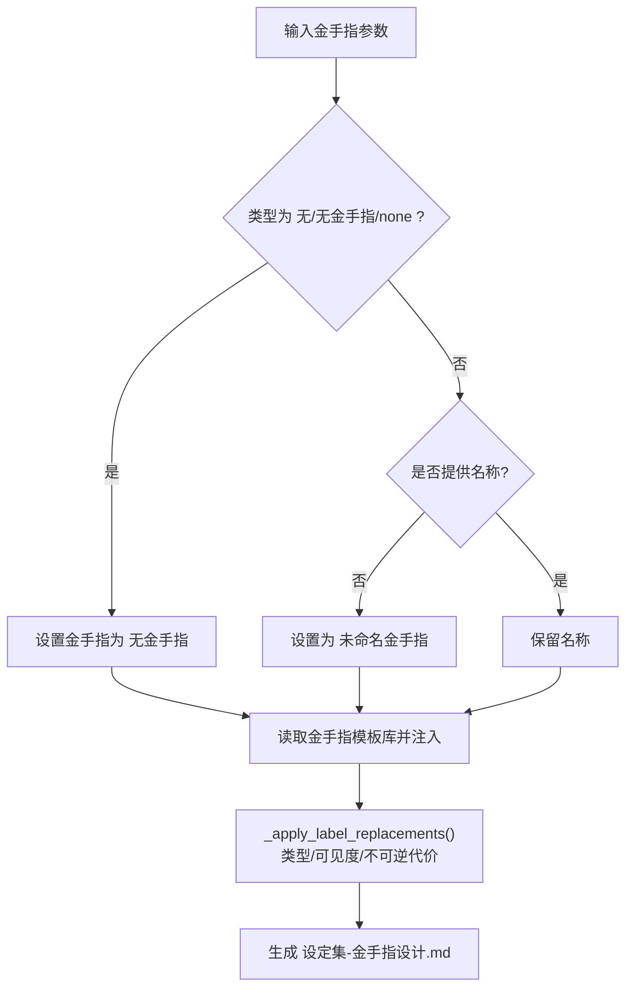
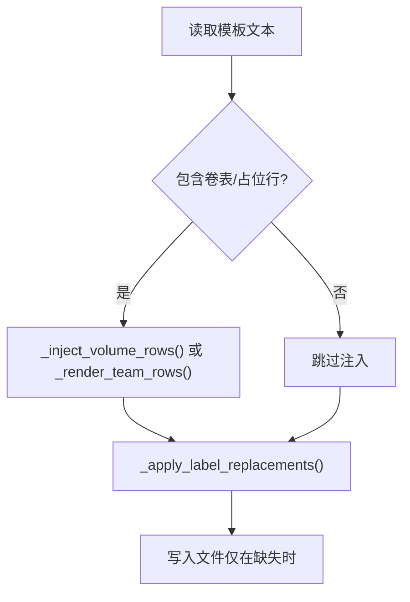
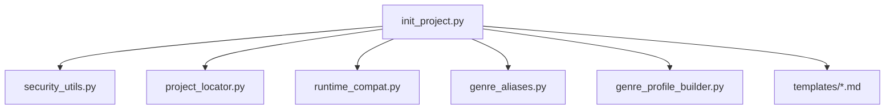

# 项目初始化

<cite>
**本文引用的文件**
- [init_project.py](file://webnovel-writer/scripts/init_project.py)
- [golden-finger-templates.md](file://webnovel-writer/templates/golden-finger-templates.md)
- [genre_aliases.py](file://webnovel-writer/scripts/data_modules/genre_aliases.py)
- [genre_profile_builder.py](file://webnovel-writer/scripts/data_modules/genre_profile_builder.py)
- [project_locator.py](file://webnovel-writer/scripts/project_locator.py)
- [security_utils.py](file://webnovel-writer/scripts/security_utils.py)
- [runtime_compat.py](file://webnovel-writer/scripts/runtime_compat.py)
- [webnovel.py](file://webnovel-writer/scripts/data_modules/webnovel.py)
- [README.md](file://README.md)
</cite>

## 目录
1. [简介](#简介)
2. [项目结构](#项目结构)
3. [核心组件](#核心组件)
4. [架构总览](#架构总览)
5. [详细组件分析](#详细组件分析)
6. [依赖分析](#依赖分析)
7. [性能考虑](#性能考虑)
8. [故障排除指南](#故障排除指南)
9. [结论](#结论)
10. [附录](#附录)

## 简介
本文件面向新用户与项目创建者，系统化讲解 Webnovel Writer 的项目初始化功能。重点围绕 init_project 函数的完整工作流程展开，包括：
- 项目目录结构生成
- state.json 配置文件创建与增量补齐
- 基础模板文件生成（世界观、力量体系、主角卡、金手指设计、反派设计、总纲、爽点规划等）
- 命令行参数的含义、默认值与使用场景
- 复合题材处理机制、题材别名标准化
- 金手指配置选项与模板渲染逻辑
- 模板参数替换机制与输出注入
- 初始化命令示例、最佳实践与常见问题

## 项目结构
Webnovel Writer 的初始化脚本位于 scripts 目录，模板位于 templates 目录，配套的安全与兼容工具位于 scripts 子模块。初始化流程的关键步骤如下：
- 解析命令行参数，构造项目路径
- 生成项目目录结构（含 .webnovel 目录）
- 读取/创建 state.json，并确保其架构字段齐全
- 读取内置模板，按参数进行标签替换与注入
- 生成基础设定与大纲文件
- 可选：初始化 Git 仓库并写入 .gitignore
- 记录工作区默认项目指针

图表来源
- [init_project.py:227-756](file://webnovel-writer/scripts/init_project.py#L227-L756)
- [security_utils.py:345-444](file://webnovel-writer/scripts/security_utils.py#L345-L444)
- [project_locator.py:294-330](file://webnovel-writer/scripts/project_locator.py#L294-L330)

章节来源
- [init_project.py:227-756](file://webnovel-writer/scripts/init_project.py#L227-L756)

## 核心组件
本节聚焦 init_project 函数及其依赖的辅助函数，梳理其职责与实现要点。

- 项目路径与安全校验
  - 将相对路径展开为绝对路径，拒绝在 .claude 目录内初始化项目，避免与插件工作区混淆。
- 目录结构生成
  - 一次性创建 .webnovel、备份、归档、摘要、设定集、大纲、正文、审查报告等目录。
- state.json 管理
  - 若存在则读取并增量补齐；不存在则创建；确保 schema 字段齐全（项目信息、进度、主角状态、世界设定、剧情线、审查检查点、章节元数据、丝线追踪等）。
  - 使用原子化写入，避免并发写入冲突与数据损坏。
- 模板读取与渲染
  - 读取内置模板（世界观、力量体系、主角卡、女主卡、主角组、金手指设计、复合题材融合逻辑、反派设计、总纲骨架、爽点规划）。
  - 对模板中的标签进行参数替换（如世界规模、核心势力、社会阶层、资源分配、货币体系、兑换规则、体系类型、典型境界链、小境界划分、金手指可见度、不可逆代价等）。
  - 对总纲模板注入卷行（根据目标章节数与每卷章数计算卷区间）。
- 环境变量模板
  - 生成 .env.example，包含 Embedding 与 Rerank 的基础配置项（不包含真实密钥）。
- Git 初始化
  - 若项目目录未包含 .git 且 Git 可用，则初始化仓库、写入 .gitignore、添加所有文件并提交一次初始提交。
- 默认项目指针
  - 记录工作区内的当前项目指针，便于后续命令解析项目根。

章节来源
- [init_project.py:227-756](file://webnovel-writer/scripts/init_project.py#L227-L756)
- [security_utils.py:345-444](file://webnovel-writer/scripts/security_utils.py#L345-L444)
- [project_locator.py:294-330](file://webnovel-writer/scripts/project_locator.py#L294-L330)

## 架构总览
下面的序列图展示了 /webnovel-init 命令到 init_project 的调用链路，以及关键的模板渲染与文件生成步骤。

图表来源
- [webnovel.py:245-272](file://webnovel-writer/scripts/data_modules/webnovel.py#L245-L272)
- [init_project.py:227-756](file://webnovel-writer/scripts/init_project.py#L227-L756)
- [security_utils.py:345-444](file://webnovel-writer/scripts/security_utils.py#L345-L444)
- [project_locator.py:294-330](file://webnovel-writer/scripts/project_locator.py#L294-L330)

## 详细组件分析

### 命令行参数与默认值
init_project 支持大量参数，涵盖项目信息、目标规模、角色与阵营、力量体系、金手指配置、平台与读者定位等。以下为关键参数分类与说明（默认值以函数签名为准）：

- 基础信息
  - project_dir：项目目录（建议 ./webnovel-project）
  - title：小说标题
  - genre：题材类型，支持复合题材（如“都市脑洞+规则怪谈”）
- 目标规模
  - target_words：目标总字数（默认 2,000,000）
  - target_chapters：目标总章节数（默认 600）
- 金手指配置
  - golden_finger_name：金手指称呼/系统名
  - golden_finger_type：金手指类型（如“系统流/鉴定流/签到流”）
  - golden_finger_style：金手指风格（如“冷漠工具型/毒舌吐槽型”）
  - gf_visibility：金手指可见度（明牌/半明牌/暗牌）
  - gf_irreversible_cost：金手指不可逆代价
- 核心卖点与结构
  - core_selling_points：核心卖点（逗号分隔）
  - protagonist_structure：主角结构（单主角/多主角）
  - heroine_config：女主配置（无女主/单女主/多女主）
  - antagonist_tiers：反派分层（如“小反派:张三;中反派:李四;大反派:王五”）
- 世界与力量体系
  - world_scale：世界规模
  - factions：势力格局/核心势力
  - power_system_type：力量体系类型
  - social_class：社会阶层
  - resource_distribution：资源分配
  - currency_system：货币体系
  - currency_exchange：货币兑换/面值规则
  - sect_hierarchy：宗门/组织层级
  - cultivation_chain：典型境界链
  - cultivation_subtiers：小境界划分（初/中/后/巅 等）
- 深度模式（预填模板）
  - protagonist_desire：主角核心欲望
  - protagonist_flaw：主角性格弱点
  - protagonist_archetype：主角人设类型
  - antagonist_level：反派等级
  - target_reader：目标读者
  - platform：发布平台
- 其他
  - protagonist_name：主角姓名
  - heroine_names：女主姓名（多个用逗号分隔）
  - heroine_role：女主定位（事业线/情感线/对抗线）
  - co_protagonists：多主角姓名（逗号分隔）
  - co_protagonist_roles：多主角定位（逗号分隔）

章节来源
- [init_project.py:757-840](file://webnovel-writer/scripts/init_project.py#L757-L840)

### 复合题材处理与别名标准化
- 复合题材解析
  - 支持多种分隔符（＋/、与），统一为“+”后再按“+”分割，去除空白并去重。
- 别名标准化
  - 提供输入别名映射（如“修仙/玄幻”→“修仙”、“都市修真”→“都市异能”等），并提供到配置键的映射（profile key）。
- 模板加载
  - 对每个标准化后的题材键，尝试加载对应模板文件；若存在则拼接，最终注入到“世界观”模板中。

图表来源
- [init_project.py:52-82](file://webnovel-writer/scripts/init_project.py#L52-L82)
- [genre_aliases.py:10-66](file://webnovel-writer/scripts/data_modules/genre_aliases.py#L10-L66)

章节来源
- [init_project.py:52-82](file://webnovel-writer/scripts/init_project.py#L52-L82)
- [genre_aliases.py:10-66](file://webnovel-writer/scripts/data_modules/genre_aliases.py#L10-L66)
- [genre_profile_builder.py:15-51](file://webnovel-writer/scripts/data_modules/genre_profile_builder.py#L15-L51)

### 金手指配置与模板渲染
- 金手指字段处理
  - 若类型为“无/无金手指/none”，则将金手指状态置为“无金手指”。
  - 若未提供名称，则默认“未命名金手指”。
- 模板与参数替换
  - 读取内置金手指模板库，作为“模板参考”注入到金手指设计文件。
  - 对金手指设计模板中的标签进行替换（类型、可见度、不可逆代价）。
- 金手指类型参考
  - 模板库提供系统面板流、随身空间流、重生/穿越流、签到打卡流、老爷爷/器灵流、血脉/天赋型、异能觉醒型、无金手指等类型与设计要点，便于快速生成。

图表来源
- [init_project.py:339-350](file://webnovel-writer/scripts/init_project.py#L339-L350)
- [init_project.py:539-580](file://webnovel-writer/scripts/init_project.py#L539-L580)
- [golden-finger-templates.md:1-474](file://webnovel-writer/templates/golden-finger-templates.md#L1-L474)

章节来源
- [init_project.py:339-350](file://webnovel-writer/scripts/init_project.py#L339-L350)
- [init_project.py:539-580](file://webnovel-writer/scripts/init_project.py#L539-L580)
- [golden-finger-templates.md:1-474](file://webnovel-writer/templates/golden-finger-templates.md#L1-L474)

### 模板渲染与参数替换机制
- 标签替换
  - 对模板中形如“- 标签名：”的行，使用传入参数进行替换，避免覆盖空值。
- 总纲注入
  - 若模板包含卷表（以“| 卷号”开头），则根据目标章节数与每卷章数生成卷行并注入，避免重复。
- 主角组注入
  - 将多主角姓名与角色定位渲染为表格行，替换模板中的占位行。
- 反派分层
  - 将“小反派/中反派/大反派”的名称按层级映射到模板表格中。

图表来源
- [init_project.py:202-225](file://webnovel-writer/scripts/init_project.py#L202-L225)
- [init_project.py:516-537](file://webnovel-writer/scripts/init_project.py#L516-L537)
- [init_project.py:606-625](file://webnovel-writer/scripts/init_project.py#L606-L625)

章节来源
- [init_project.py:202-225](file://webnovel-writer/scripts/init_project.py#L202-L225)
- [init_project.py:516-537](file://webnovel-writer/scripts/init_project.py#L516-L537)
- [init_project.py:606-625](file://webnovel-writer/scripts/init_project.py#L606-L625)

### 初始化命令示例与最佳实践
- 基础初始化
  - 命令：/webnovel-init <项目目录> <标题> <题材>
  - 示例：/webnovel-init ./webnovel-project 《我的无限副本》 修仙+系统流
- 深度初始化（预填模板）
  - 命令：/webnovel-init <项目目录> <标题> <题材> --protagonist-name 林天 --target-words 2000000 --target-chapters 600 --golden-finger-name 系统面板 --golden-finger-type 系统面板流 --golden-finger-style 冷漠工具型 --protagonist-desire 成为最强者 --protagonist-flaw 内向敏感 --protagonist-archetype 逆袭流 --antagonist-level 大反派 --target-reader 青年读者 --platform 纵横中文网
- 复合题材
  - 命令：/webnovel-init ./webnovel-project 《都市异能物语》 都市异能+规则怪谈 --world-scale 三域六界 --factions “天穹组织,星火联盟” --power-system-type 修炼体系 --cultivation-chain “练气→筑基→金丹→元婴” --cultivation-subtiers 初/中/后/巅
- 金手指设计
  - 命令：/webnovel-init ./webnovel-project 《重生之都市巅峰》 重生/穿越流 --golden-finger-name 重生优势清单 --gf-visibility 明牌 --gf-irreversible-cost 记忆偏差
- 环境配置
  - 初始化完成后，在项目根目录创建 .env 并填写真实密钥。

章节来源
- [README.md:40-88](file://README.md#L40-L88)
- [init_project.py:757-840](file://webnovel-writer/scripts/init_project.py#L757-L840)

## 依赖分析
- init_project 依赖
  - 安全工具：原子化写入、Git 可用性检测、提交消息清理
  - 项目定位：工作区默认项目指针写入
  - 兼容性：Windows UTF-8 stdio 修复
  - 题材别名与解析：输入别名映射与复合题材解析
- 模块耦合
  - init_project 与 security_utils、project_locator、runtime_compat 等模块松耦合，通过函数调用交互。
  - 模板依赖 templates 目录，参数替换与注入逻辑集中在 init_project 内部。

图表来源
- [init_project.py:25-31](file://webnovel-writer/scripts/init_project.py#L25-L31)
- [security_utils.py:227-263](file://webnovel-writer/scripts/security_utils.py#L227-L263)
- [project_locator.py:294-330](file://webnovel-writer/scripts/project_locator.py#L294-L330)
- [runtime_compat.py:16-42](file://webnovel-writer/scripts/runtime_compat.py#L16-L42)
- [genre_aliases.py:10-66](file://webnovel-writer/scripts/data_modules/genre_aliases.py#L10-L66)
- [genre_profile_builder.py:15-51](file://webnovel-writer/scripts/data_modules/genre_profile_builder.py#L15-L51)

章节来源
- [init_project.py:25-31](file://webnovel-writer/scripts/init_project.py#L25-L31)
- [security_utils.py:227-263](file://webnovel-writer/scripts/security_utils.py#L227-L263)
- [project_locator.py:294-330](file://webnovel-writer/scripts/project_locator.py#L294-L330)
- [runtime_compat.py:16-42](file://webnovel-writer/scripts/runtime_compat.py#L16-L42)
- [genre_aliases.py:10-66](file://webnovel-writer/scripts/data_modules/genre_aliases.py#L10-L66)
- [genre_profile_builder.py:15-51](file://webnovel-writer/scripts/data_modules/genre_profile_builder.py#L15-L51)

## 性能考虑
- 目录与文件操作
  - 一次性创建目录结构，避免多次 IO。
  - 仅在文件缺失时写入模板，减少不必要的写入。
- JSON 写入
  - 使用原子化写入，避免并发写入冲突与数据损坏。
- Git 初始化
  - 仅在 Git 可用且项目未初始化时执行，避免无效操作。
- 模板渲染
  - 标签替换与注入采用逐行扫描，复杂度与模板行数线性相关；建议模板保持简洁。

## 故障排除指南
- 无法初始化项目
  - 检查项目目录是否在 .claude 内（会被拒绝），更换目录。
  - 确认 Python 依赖已安装。
- Git 初始化失败
  - Git 不可用时会跳过；若需要版本控制，请安装 Git 并重新初始化。
  - 若提交失败，检查标题是否包含非法字符，系统会进行清理。
- state.json 写入失败
  - 检查磁盘权限与空间；必要时使用备份恢复工具。
- 模板未按预期替换
  - 确认参数键名与模板标签一致；注意大小写与空格。
- 项目根解析失败
  - 使用 /webnovel-init 时，确保在工作区根目录执行；或设置 WEBNOVEL_PROJECT_ROOT 环境变量。

章节来源
- [init_project.py:266-267](file://webnovel-writer/scripts/init_project.py#L266-L267)
- [init_project.py:683-737](file://webnovel-writer/scripts/init_project.py#L683-L737)
- [security_utils.py:345-444](file://webnovel-writer/scripts/security_utils.py#L345-L444)
- [project_locator.py:333-407](file://webnovel-writer/scripts/project_locator.py#L333-L407)

## 结论
init_project 函数提供了完整的项目初始化能力：从目录结构、state.json 到基础模板文件，再到可选的 Git 初始化与默认项目指针记录。通过复合题材解析、别名标准化与参数驱动的模板渲染，用户可以快速生成高质量的项目骨架。建议在初始化时明确目标规模与金手指配置，以便后续大纲与正文创作更高效。

## 附录
- 常用命令
  - /webnovel-init <项目目录> <标题> <题材>
  - cp .env.example .env 并填写真实密钥
- 参考模板
  - 金手指设计模板库：templates/golden-finger-templates.md
- 相关文档
  - README.md 中的快速开始与命令说明