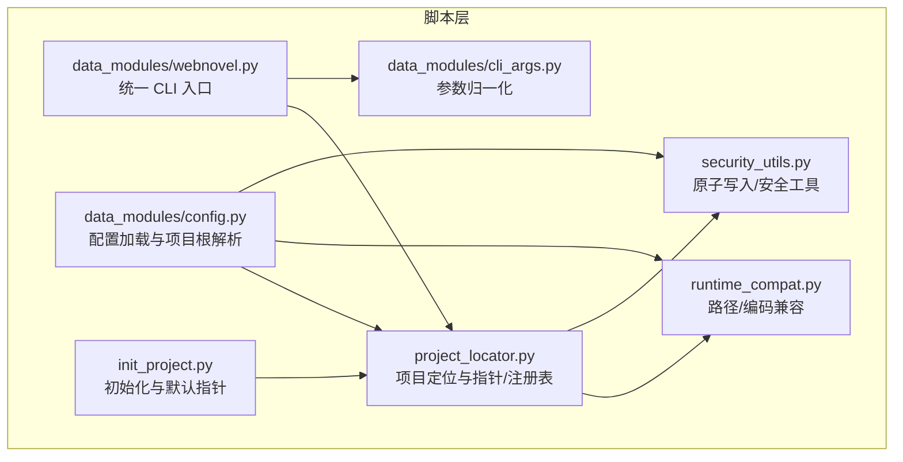
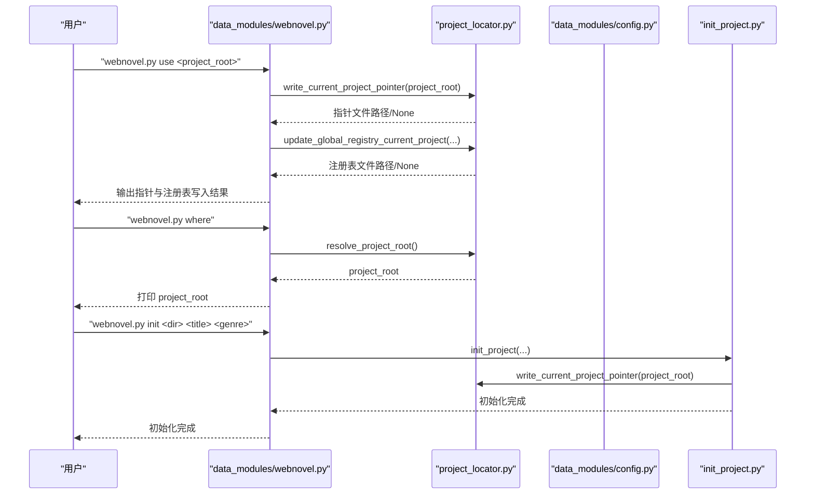
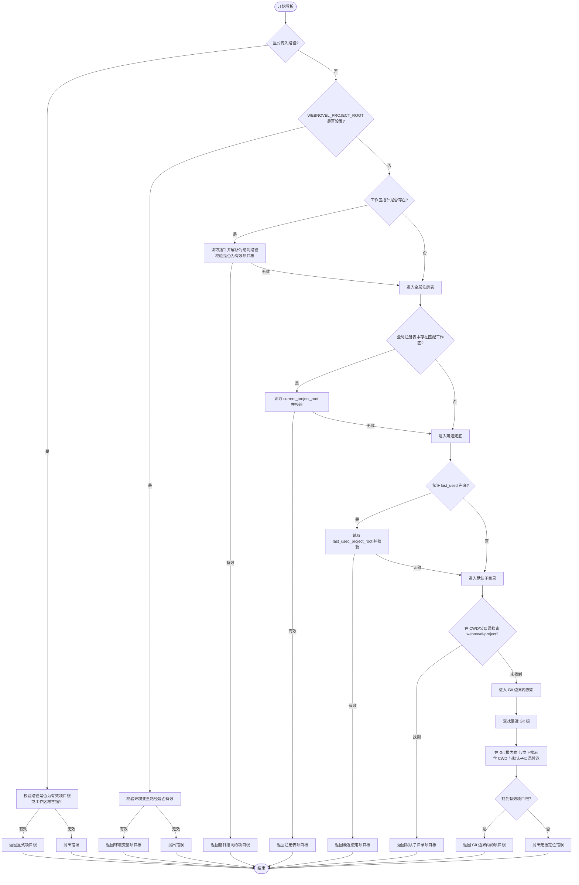
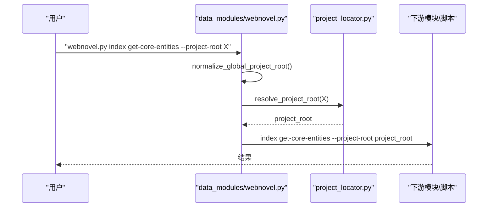
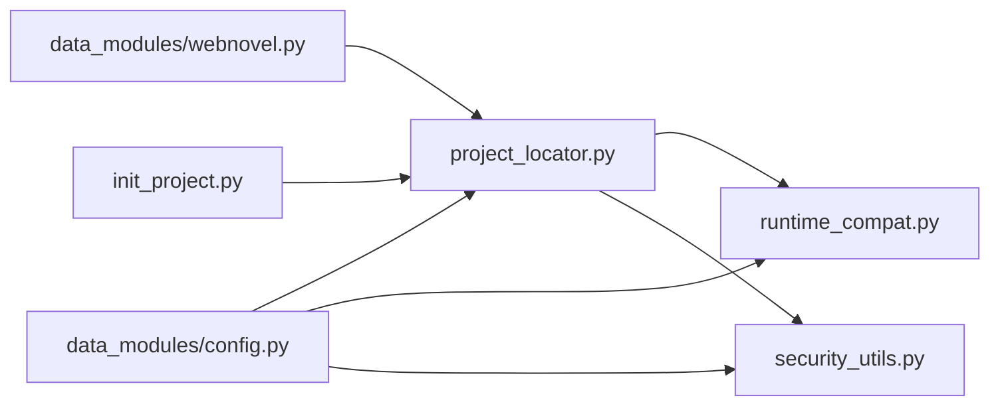

# 项目定位

<cite>
**本文引用的文件**
- [project_locator.py](file://webnovel-writer/scripts/project_locator.py)
- [webnovel.py](file://webnovel-writer/scripts/data_modules/webnovel.py)
- [cli_args.py](file://webnovel-writer/scripts/data_modules/cli_args.py)
- [config.py](file://webnovel-writer/scripts/data_modules/config.py)
- [init_project.py](file://webnovel-writer/scripts/init_project.py)
- [runtime_compat.py](file://webnovel-writer/scripts/runtime_compat.py)
- [security_utils.py](file://webnovel-writer/scripts/security_utils.py)
- [test_project_locator.py](file://webnovel-writer/scripts/data_modules/tests/test_project_locator.py)
</cite>

## 目录
1. [简介](#简介)
2. [项目结构](#项目结构)
3. [核心组件](#核心组件)
4. [架构总览](#架构总览)
5. [详细组件分析](#详细组件分析)
6. [依赖分析](#依赖分析)
7. [性能考量](#性能考量)
8. [故障排查指南](#故障排查指南)
9. [结论](#结论)
10. [附录](#附录)

## 简介
本文件面向系统管理员与高级用户，系统性阐述 Webnovel Writer 的“项目定位”能力：如何在复杂的多项目、多工作区环境中，可靠地定位到包含“.webnovel/state.json”的“书项目根目录”。文档涵盖以下主题：
- 项目根目录检测算法与边界条件（Git 仓库边界、默认子目录、显式路径）
- .webnovel 目录识别机制与 state.json 校验
- 工作区与项目指针维护（.claude/.webnovel-current-project）
- 用户级全局注册表（workspaces.json）与“空上下文”定位
- 项目切换命令 use 的行为与最佳实践
- 命令行示例、配置文件格式说明与故障排查

## 项目结构
项目定位功能主要集中在 scripts 目录下的若干模块：
- scripts/project_locator.py：项目定位核心算法与指针/注册表管理
- scripts/data_modules/webnovel.py：统一 CLI 入口，转发到各数据模块，并注入 --project-root
- scripts/data_modules/cli_args.py：参数归一化（将 --project-root 移至子命令前）
- scripts/data_modules/config.py：配置加载与项目根解析集成
- scripts/init_project.py：项目初始化与默认指针写入
- scripts/runtime_compat.py：跨平台路径与编码兼容
- scripts/security_utils.py：原子写入、安全工具（用于注册表与 state.json 写入）

**图表来源**
- [project_locator.py:1-430](file://webnovel-writer/scripts/project_locator.py#L1-L430)
- [webnovel.py:1-312](file://webnovel-writer/scripts/data_modules/webnovel.py#L1-L312)
- [cli_args.py:1-97](file://webnovel-writer/scripts/data_modules/cli_args.py#L1-L97)
- [config.py:1-349](file://webnovel-writer/scripts/data_modules/config.py#L1-L349)
- [init_project.py:1-845](file://webnovel-writer/scripts/init_project.py#L1-L845)
- [runtime_compat.py:1-79](file://webnovel-writer/scripts/runtime_compat.py#L1-L79)
- [security_utils.py:1-590](file://webnovel-writer/scripts/security_utils.py#L1-L590)

**章节来源**
- [project_locator.py:1-430](file://webnovel-writer/scripts/project_locator.py#L1-L430)
- [webnovel.py:1-312](file://webnovel-writer/scripts/data_modules/webnovel.py#L1-L312)
- [cli_args.py:1-97](file://webnovel-writer/scripts/data_modules/cli_args.py#L1-L97)
- [config.py:1-349](file://webnovel-writer/scripts/data_modules/config.py#L1-L349)
- [init_project.py:1-845](file://webnovel-writer/scripts/init_project.py#L1-L845)
- [runtime_compat.py:1-79](file://webnovel-writer/scripts/runtime_compat.py#L1-L79)
- [security_utils.py:1-590](file://webnovel-writer/scripts/security_utils.py#L1-L590)

## 核心组件
- 项目定位器（project_locator.py）
  - 提供 resolve_project_root、resolve_state_file、write_current_project_pointer、update_global_registry_current_project 等核心函数
  - 支持显式路径、环境变量、工作区指针、全局注册表、默认子目录等多种定位策略
- 统一 CLI（data_modules/webnovel.py）
  - 将 --project-root 注入到下游模块，屏蔽参数顺序差异
  - 提供 where/use 等子命令，简化项目定位与切换
- 参数归一化（data_modules/cli_args.py）
  - 将 --project-root 从任意位置移动到子命令前，提升易用性
- 配置加载（data_modules/config.py）
  - 通过 get_config 间接调用 resolve_project_root，确保默认配置来自正确项目根
- 初始化（init_project.py）
  - 生成项目骨架与 state.json，并写入默认工作区指针
- 兼容与安全（runtime_compat.py、security_utils.py）
  - 跨平台路径规范化、UTF-8 stdio、原子写入、安全校验

**章节来源**
- [project_locator.py:333-430](file://webnovel-writer/scripts/project_locator.py#L333-L430)
- [webnovel.py:189-312](file://webnovel-writer/scripts/data_modules/webnovel.py#L189-L312)
- [cli_args.py:63-75](file://webnovel-writer/scripts/data_modules/cli_args.py#L63-L75)
- [config.py:329-349](file://webnovel-writer/scripts/data_modules/config.py#L329-L349)
- [init_project.py:738-756](file://webnovel-writer/scripts/init_project.py#L738-L756)
- [runtime_compat.py:48-79](file://webnovel-writer/scripts/runtime_compat.py#L48-L79)
- [security_utils.py:345-444](file://webnovel-writer/scripts/security_utils.py#L345-L444)

## 架构总览
项目定位的整体流程如下：
- CLI 层接收命令与参数，必要时进行 --project-root 归一化
- 统一入口解析项目根目录，注入到下游模块
- 项目定位器按优先级搜索：显式路径 → 环境变量 → 工作区指针 → 全局注册表 → 默认子目录 → Git 边界内搜索
- 配置层基于项目根加载 .env 与路径别名，确保 API 与路径一致性
- 初始化与切换命令写入工作区指针与全局注册表，保障后续“空上下文”定位

**图表来源**
- [webnovel.py:157-187](file://webnovel-writer/scripts/data_modules/webnovel.py#L157-L187)
- [project_locator.py:294-331](file://webnovel-writer/scripts/project_locator.py#L294-L331)
- [project_locator.py:191-236](file://webnovel-writer/scripts/project_locator.py#L191-L236)
- [config.py:329-349](file://webnovel-writer/scripts/data_modules/config.py#L329-L349)
- [init_project.py:738-756](file://webnovel-writer/scripts/init_project.py#L738-L756)

## 详细组件分析

### 项目定位器（project_locator.py）
- 关键常量与环境变量
  - 默认项目目录名：webnovel-project
  - 工作区指针文件：.claude/.webnovel-current-project
  - 全局注册表：~/.claude/webnovel-writer/workspaces.json
  - 环境变量：WEBNOVEL_PROJECT_ROOT、CLAUDE_PROJECT_DIR、CLAUDE_HOME、WEBNOVEL_CLAUDE_HOME
- 核心函数
  - resolve_project_root：按优先级解析项目根目录
  - resolve_state_file：解析 .webnovel/state.json 绝对路径
  - write_current_project_pointer：写入工作区指针
  - update_global_registry_current_project：更新用户级注册表
- 解析策略与边界
  - 显式路径：支持传入“书项目根”或“工作区根”
  - 环境变量：WEBNOVEL_PROJECT_ROOT 必须指向有效项目根
  - 工作区指针：从 CWD 向上查找 .claude/.webnovel-current-project
  - 全局注册表：基于工作区根与最近使用项目，支持前缀匹配与可选兜底
  - 默认子目录：在 CWD 或父目录搜索 webnovel-project
  - Git 边界：在 Git 仓库根停止向上搜索，避免误绑定到无关父目录
- 安全与健壮性
  - 路径规范化：normalize_windows_path、大小写/分隔符不敏感键
  - 原子写入：注册表写入采用 atomic_write_json
  - 非阻断写入：权限/只读等问题不中断主流程
  - 严格校验：_is_project_root 仅当 .webnovel/state.json 存在时才视为有效项目根

**图表来源**
- [project_locator.py:333-407](file://webnovel-writer/scripts/project_locator.py#L333-L407)
- [project_locator.py:118-188](file://webnovel-writer/scripts/project_locator.py#L118-L188)
- [project_locator.py:239-401](file://webnovel-writer/scripts/project_locator.py#L239-L401)

**章节来源**
- [project_locator.py:24-35](file://webnovel-writer/scripts/project_locator.py#L24-L35)
- [project_locator.py:37-42](file://webnovel-writer/scripts/project_locator.py#L37-L42)
- [project_locator.py:118-188](file://webnovel-writer/scripts/project_locator.py#L118-L188)
- [project_locator.py:191-236](file://webnovel-writer/scripts/project_locator.py#L191-L236)
- [project_locator.py:239-407](file://webnovel-writer/scripts/project_locator.py#L239-L407)
- [project_locator.py:410-430](file://webnovel-writer/scripts/project_locator.py#L410-L430)

### 统一 CLI（data_modules/webnovel.py）
- 子命令
  - where：打印解析出的项目根
  - preflight：检查 CLI 与项目根环境
  - use：绑定当前工作区使用的书项目（写入指针/注册表）
  - index/state/rag/style/entity/context/migrate/workflow/status/update-state/backup/archive/extract-context：转发到相应模块或脚本，并注入 --project-root
- 参数归一化
  - normalize_global_project_root：将 --project-root 移至子命令前，兼容不同书写习惯
- 项目根解析
  - _resolve_root：支持显式传入或自动解析
  - _strip_project_root_args：下游统一注入 --project-root，避免重复传参导致 argparse 报错

**图表来源**
- [webnovel.py:252-256](file://webnovel-writer/scripts/data_modules/webnovel.py#L252-L256)
- [webnovel.py:42-47](file://webnovel-writer/scripts/data_modules/webnovel.py#L42-L47)
- [webnovel.py:274-291](file://webnovel-writer/scripts/data_modules/webnovel.py#L274-L291)

**章节来源**
- [webnovel.py:189-312](file://webnovel-writer/scripts/data_modules/webnovel.py#L189-L312)
- [cli_args.py:63-75](file://webnovel-writer/scripts/data_modules/cli_args.py#L63-L75)

### 配置加载（data_modules/config.py）
- get_config：默认惰性解析项目根，确保配置来自正确项目
- _load_project_dotenv：加载项目级 .env（优先于全局 .env）
- 项目根相关属性：.webnovel 目录、state.json、index.db、章节/设定/大纲目录等

**章节来源**
- [config.py:329-349](file://webnovel-writer/scripts/data_modules/config.py#L329-L349)
- [config.py:67-77](file://webnovel-writer/scripts/data_modules/config.py#L67-L77)
- [config.py:90-122](file://webnovel-writer/scripts/data_modules/config.py#L90-L122)

### 初始化（init_project.py）
- 生成项目骨架与 .webnovel/state.json
- 写入默认工作区指针（若工作区内存在 .claude/）
- 初始化 Git 仓库（可选，优雅降级）

**章节来源**
- [init_project.py:738-756](file://webnovel-writer/scripts/init_project.py#L738-L756)

### 路径与安全（runtime_compat.py、security_utils.py）
- normalize_windows_path：WSL/Git Bash 路径规范化
- atomic_write_json：原子写注册表与 state.json，避免并发损坏
- sanitize_*：安全工具（本节涉及路径与 JSON 写入）

**章节来源**
- [runtime_compat.py:48-79](file://webnovel-writer/scripts/runtime_compat.py#L48-L79)
- [security_utils.py:345-444](file://webnovel-writer/scripts/security_utils.py#L345-L444)

## 依赖分析
- 组件耦合
  - data_modules/webnovel.py 依赖 project_locator.py 进行项目根解析
  - data_modules/config.py 依赖 project_locator.py 的 resolve_project_root 进行默认配置解析
  - init_project.py 依赖 project_locator.py 写入默认指针
  - project_locator.py 依赖 runtime_compat.py 与 security_utils.py
- 外部依赖
  - Git：用于查找 .git 根目录
  - filelock：可选，用于原子写入锁
- 循环依赖
  - 未发现循环依赖

**图表来源**
- [webnovel.py:34-34](file://webnovel-writer/scripts/data_modules/webnovel.py#L34-L34)
- [config.py:339-339](file://webnovel-writer/scripts/data_modules/config.py#L339-L339)
- [init_project.py:31-31](file://webnovel-writer/scripts/init_project.py#L31-L31)
- [project_locator.py:21-21](file://webnovel-writer/scripts/project_locator.py#L21-L21)
- [project_locator.py:109-112](file://webnovel-writer/scripts/project_locator.py#L109-L112)

**章节来源**
- [webnovel.py:34-34](file://webnovel-writer/scripts/data_modules/webnovel.py#L34-L34)
- [config.py:339-339](file://webnovel-writer/scripts/data_modules/config.py#L339-L339)
- [init_project.py:31-31](file://webnovel-writer/scripts/init_project.py#L31-L31)
- [project_locator.py:21-21](file://webnovel-writer/scripts/project_locator.py#L21-L21)
- [project_locator.py:109-112](file://webnovel-writer/scripts/project_locator.py#L109-L112)

## 性能考量
- 搜索复杂度
  - resolve_project_root 在 Git 根边界内进行有限次目录遍历，时间复杂度近似 O(d)，d 为距离 Git 根的层级
  - 默认子目录候选与 CWD 上溯的组合搜索，通常很快
- I/O 与锁
  - 注册表写入采用原子写入与可选文件锁，避免并发冲突
  - 指针文件读写为本地文件 I/O，开销极低
- 环境变量与路径规范化
  - normalize_windows_path 与 _normcase_path_key 为纯内存计算，成本可忽略

[本节为一般性讨论，不直接分析具体文件]

## 故障排查指南
- “无法定位项目根”
  - 确认当前目录或父目录存在 .webnovel/state.json
  - 若在 Git 仓库内，确认未误越界到仓库根之外
  - 使用 where 子命令打印解析出的项目根
- “use 命令未写入指针”
  - 确认工作区内存在 .claude/ 目录
  - 若无 .claude/，将自动更新用户级注册表，但仍需确保工作区根可解析
- “环境变量 WEBNOVEL_PROJECT_ROOT 无效”
  - 该路径必须指向有效项目根（包含 .webnovel/state.json）
- “全局注册表写入失败”
  - 可能由于用户目录权限或只读盘符导致，属非阻断错误
- “参数顺序问题导致 --project-root 未生效”
  - 使用 data_modules/webnovel.py 的子命令，内部已进行参数归一化
- “Windows 路径显示乱码”
  - 确保 stdio 已启用 UTF-8 包装

**章节来源**
- [project_locator.py:333-407](file://webnovel-writer/scripts/project_locator.py#L333-L407)
- [webnovel.py:157-187](file://webnovel-writer/scripts/data_modules/webnovel.py#L157-L187)
- [config.py:329-349](file://webnovel-writer/scripts/data_modules/config.py#L329-L349)
- [cli_args.py:63-75](file://webnovel-writer/scripts/data_modules/cli_args.py#L63-L75)
- [runtime_compat.py:16-42](file://webnovel-writer/scripts/runtime_compat.py#L16-L42)

## 结论
Webnovel Writer 的项目定位系统通过“显式路径 → 环境变量 → 工作区指针 → 全局注册表 → 默认子目录 → Git 边界内搜索”的多层策略，实现了在复杂多项目、多工作区场景下的稳健定位。配合统一 CLI 的参数归一化、配置层的项目根注入以及初始化/切换命令的指针与注册表写入，系统既满足高级用户的灵活需求，又能在“空上下文”下保持可恢复性。安全方面通过原子写入与严格校验，降低了并发与误操作风险。

[本节为总结性内容，不直接分析具体文件]

## 附录

### 命令行示例
- 查看当前解析出的项目根
  - python "<SCRIPTS_DIR>/webnovel.py" where
- 绑定当前工作区使用的书项目
  - python "<SCRIPTS_DIR>/webnovel.py" use "<书项目根目录>"
  - 可选：--workspace-root "<工作区根目录>"
- 统一入口转发到各模块并自动注入 --project-root
  - python "<SCRIPTS_DIR>/webnovel.py" index get-core-entities
  - python "<SCRIPTS_DIR>/webnovel.py" state process-chapter --chapter 100
  - python "<SCRIPTS_DIR>/webnovel.py" rag search "query"
- 参数顺序兼容
  - 以下两种写法等价：
    - python "<SCRIPTS_DIR>/webnovel.py" index --project-root "<ROOT>" get-core-entities
    - python "<SCRIPTS_DIR>/webnovel.py" index get-core-entities --project-root "<ROOT>"

**章节来源**
- [webnovel.py:103-106](file://webnovel-writer/scripts/data_modules/webnovel.py#L103-L106)
- [webnovel.py:157-187](file://webnovel-writer/scripts/data_modules/webnovel.py#L157-L187)
- [webnovel.py:274-305](file://webnovel-writer/scripts/data_modules/webnovel.py#L274-L305)
- [cli_args.py:63-75](file://webnovel-writer/scripts/data_modules/cli_args.py#L63-L75)

### 配置文件格式说明
- 项目级 .env
  - 用于覆盖 API 配置（EMBED_BASE_URL、EMBED_MODEL、EMBED_API_KEY、RERANK_BASE_URL、RERANK_MODEL、RERANK_API_KEY 等）
  - 优先于全局 .env
- 全局 .env
  - 位于 ~/.claude/webnovel-writer/.env
  - 作为兜底，适合放置通用 API 密钥
- 全局注册表 workspaces.json
  - schema_version：1
  - workspaces：工作区根到当前项目根的映射
  - last_used_project_root：最近使用项目根
  - updated_at：更新时间（ISO 时间）

**章节来源**
- [config.py:51-77](file://webnovel-writer/scripts/data_modules/config.py#L51-L77)
- [project_locator.py:76-103](file://webnovel-writer/scripts/project_locator.py#L76-L103)
- [project_locator.py:118-188](file://webnovel-writer/scripts/project_locator.py#L118-L188)
- [project_locator.py:191-236](file://webnovel-writer/scripts/project_locator.py#L191-L236)

### 测试与验证
- 单元测试覆盖
  - 测试解析优先级与边界条件（Git 根边界、默认子目录、工作区指针、失效指针回退）
  - 测试用例路径：scripts/data_modules/tests/test_project_locator.py

**章节来源**
- [test_project_locator.py:14-107](file://webnovel-writer/scripts/data_modules/tests/test_project_locator.py#L14-L107)