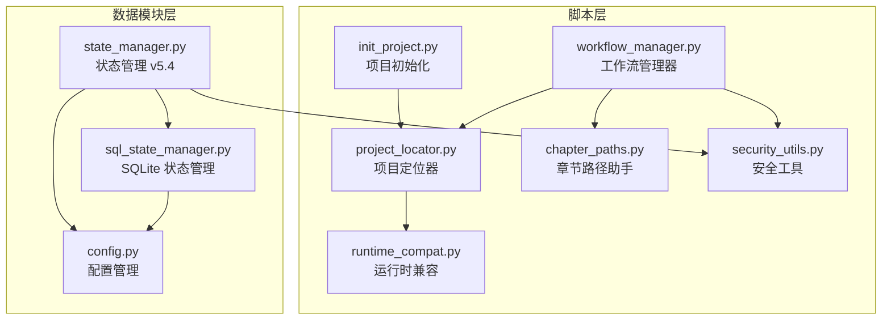
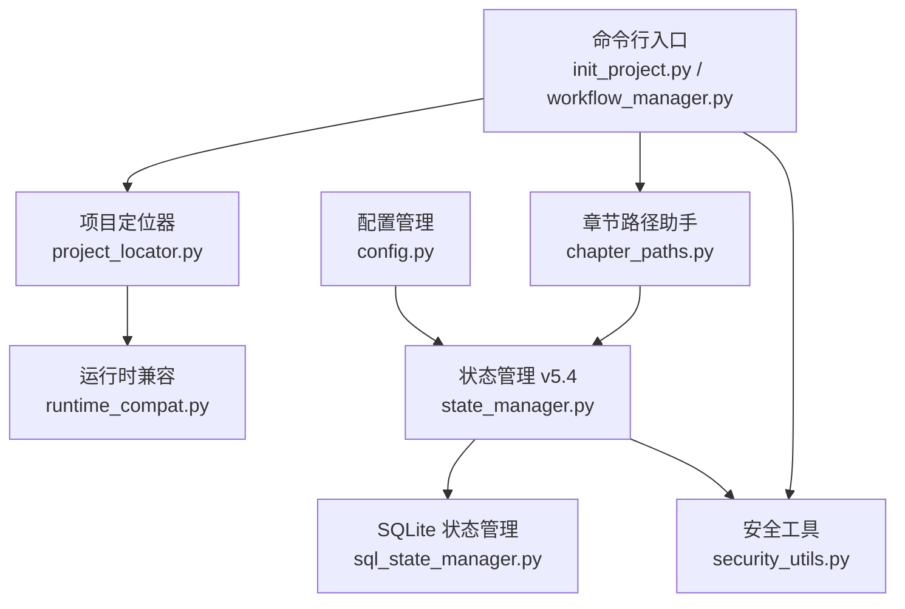
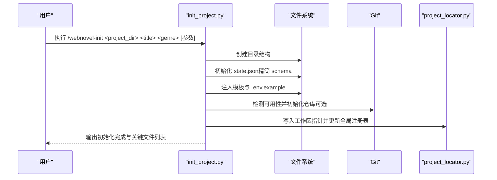
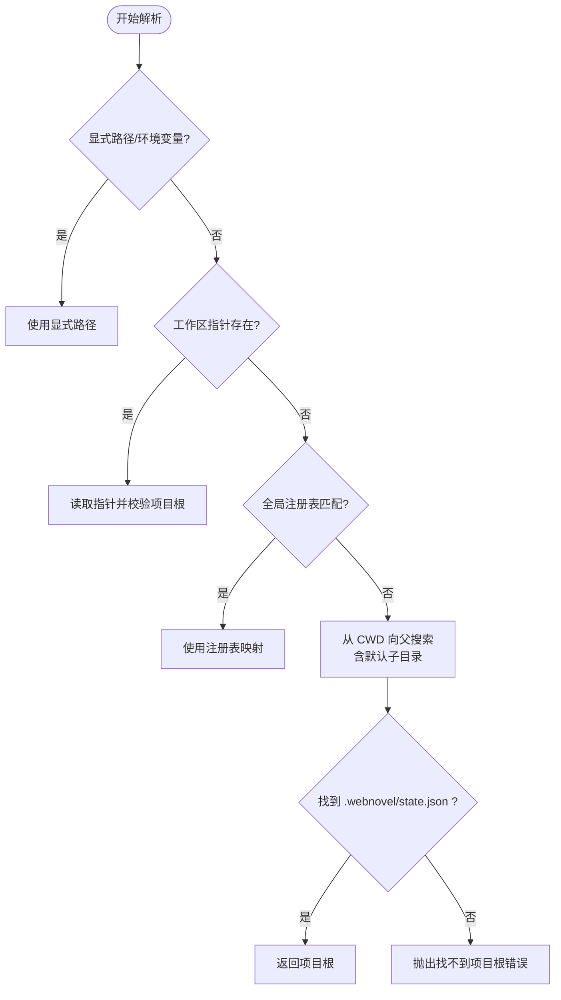
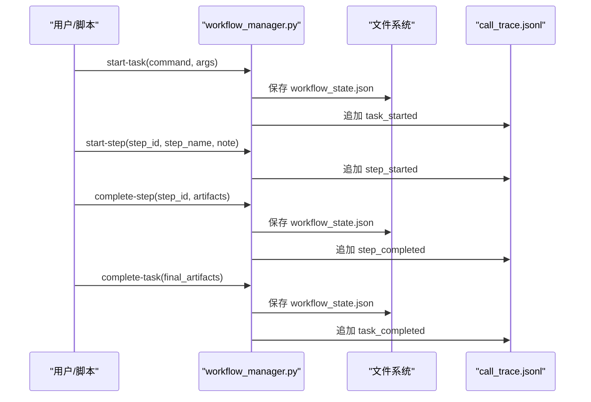
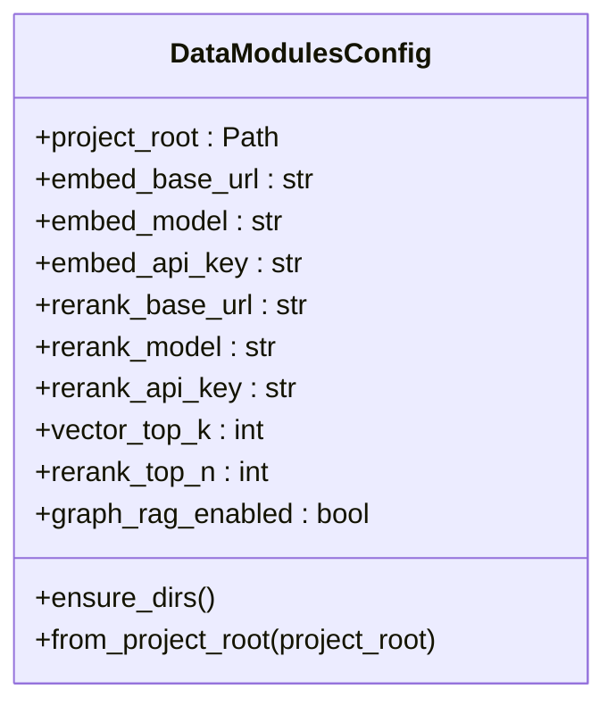
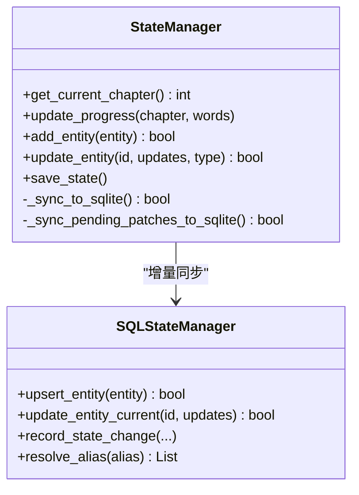
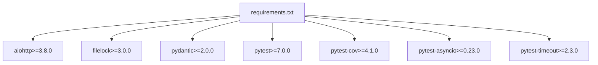

# 项目管理工具

<cite>
**本文档引用的文件**
- [init_project.py](file://webnovel-writer/scripts/init_project.py)
- [project_locator.py](file://webnovel-writer/scripts/project_locator.py)
- [workflow_manager.py](file://webnovel-writer/scripts/workflow_manager.py)
- [config.py](file://webnovel-writer/scripts/data_modules/config.py)
- [state_manager.py](file://webnovel-writer/scripts/data_modules/state_manager.py)
- [sql_state_manager.py](file://webnovel-writer/scripts/data_modules/sql_state_manager.py)
- [chapter_paths.py](file://webnovel-writer/scripts/chapter_paths.py)
- [security_utils.py](file://webnovel-writer/scripts/security_utils.py)
- [runtime_compat.py](file://webnovel-writer/scripts/runtime_compat.py)
- [requirements.txt](file://webnovel-writer/scripts/requirements.txt)
- [test_project_locator.py](file://webnovel-writer/scripts/data_modules/tests/test_project_locator.py)
- [test_workflow_manager.py](file://webnovel-writer/scripts/data_modules/tests/test_workflow_manager.py)
</cite>

## 目录
1. [简介](#简介)
2. [项目结构](#项目结构)
3. [核心组件](#核心组件)
4. [架构总览](#架构总览)
5. [详细组件分析](#详细组件分析)
6. [依赖关系分析](#依赖关系分析)
7. [性能考虑](#性能考虑)
8. [故障排除指南](#故障排除指南)
9. [结论](#结论)
10. [附录](#附录)

## 简介
本文件为 Webnovel Writer 的项目管理工具使用文档，面向项目管理者与系统管理员，涵盖以下主题：
- 项目初始化命令的功能、参数与使用场景
- 项目定位器的路径解析算法、项目发现机制与多项目支持策略
- 工作流管理器的任务调度逻辑、状态跟踪与执行流程
- 项目创建最佳实践、配置文件结构、项目迁移与版本管理
- 命令示例、错误处理与故障排查指南

## 项目结构
Webnovel Writer 的项目管理工具由一组脚本与模块组成，核心位置在 webnovel-writer/scripts 目录下，围绕以下职责划分：
- 项目初始化：生成项目骨架、state.json 与基础模板
- 项目定位：跨工作区、Git 仓库与指针文件的项目根解析
- 工作流管理：任务与步骤的状态跟踪、可观测性与恢复策略
- 数据模块：配置、状态管理与 SQLite 同步
- 安全与兼容：文件名清理、原子写入、Windows UTF-8 控制台支持

**图表来源**
- [init_project.py:1-845](file://webnovel-writer/scripts/init_project.py#L1-L845)
- [project_locator.py:1-430](file://webnovel-writer/scripts/project_locator.py#L1-L430)
- [workflow_manager.py:1-823](file://webnovel-writer/scripts/workflow_manager.py#L1-L823)
- [config.py:1-349](file://webnovel-writer/scripts/data_modules/config.py#L1-L349)
- [state_manager.py:1-1352](file://webnovel-writer/scripts/data_modules/state_manager.py#L1-L1352)
- [sql_state_manager.py:1-595](file://webnovel-writer/scripts/data_modules/sql_state_manager.py#L1-L595)
- [chapter_paths.py:1-156](file://webnovel-writer/scripts/chapter_paths.py#L1-L156)
- [security_utils.py:1-590](file://webnovel-writer/scripts/security_utils.py#L1-L590)
- [runtime_compat.py:1-79](file://webnovel-writer/scripts/runtime_compat.py#L1-L79)

**章节来源**
- [init_project.py:1-845](file://webnovel-writer/scripts/init_project.py#L1-L845)
- [project_locator.py:1-430](file://webnovel-writer/scripts/project_locator.py#L1-L430)
- [workflow_manager.py:1-823](file://webnovel-writer/scripts/workflow_manager.py#L1-L823)
- [config.py:1-349](file://webnovel-writer/scripts/data_modules/config.py#L1-L349)
- [state_manager.py:1-1352](file://webnovel-writer/scripts/data_modules/state_manager.py#L1-L1352)
- [sql_state_manager.py:1-595](file://webnovel-writer/scripts/data_modules/sql_state_manager.py#L1-L595)
- [chapter_paths.py:1-156](file://webnovel-writer/scripts/chapter_paths.py#L1-L156)
- [security_utils.py:1-590](file://webnovel-writer/scripts/security_utils.py#L1-L590)
- [runtime_compat.py:1-79](file://webnovel-writer/scripts/runtime_compat.py#L1-L79)

## 核心组件
- 项目初始化器：负责生成项目骨架目录、初始化 state.json、注入模板与 .env 示例，并尝试初始化 Git 仓库与工作区指针
- 项目定位器：提供统一的项目根解析，支持显式路径、环境变量、工作区指针、全局注册表与 Git 根边界
- 工作流管理器：跟踪任务与步骤状态、心跳与可观测性日志、中断检测与恢复选项、清理与失败标记
- 配置管理：集中管理 API 与检索配置，支持 .env 加载与项目根解析
- 状态管理：v5.4 架构，state.json 精简化，大数据迁移至 SQLite，支持并发安全写入与增量同步
- 章节路径助手：兼容多种章节文件命名约定，提供章节标题提取与默认草稿路径生成
- 安全工具：文件名清理、提交消息清理、原子写入、Git 可用性检测与优雅降级
- 运行时兼容：Windows UTF-8 控制台包装与路径规范化

**章节来源**
- [init_project.py:227-756](file://webnovel-writer/scripts/init_project.py#L227-L756)
- [project_locator.py:333-407](file://webnovel-writer/scripts/project_locator.py#L333-L407)
- [workflow_manager.py:191-363](file://webnovel-writer/scripts/workflow_manager.py#L191-L363)
- [config.py:90-344](file://webnovel-writer/scripts/data_modules/config.py#L90-L344)
- [state_manager.py:90-140](file://webnovel-writer/scripts/data_modules/state_manager.py#L90-L140)
- [chapter_paths.py:109-156](file://webnovel-writer/scripts/chapter_paths.py#L109-L156)
- [security_utils.py:29-134](file://webnovel-writer/scripts/security_utils.py#L29-L134)
- [runtime_compat.py:16-79](file://webnovel-writer/scripts/runtime_compat.py#L16-L79)

## 架构总览
项目管理工具采用分层架构：
- 脚本层：对外命令与工具函数，负责初始化、定位与工作流控制
- 数据模块层：配置、状态与 SQLite 同步，保障数据一致性与性能
- 安全与兼容层：统一的安全输入清理与跨平台兼容处理

**图表来源**
- [init_project.py:757-800](file://webnovel-writer/scripts/init_project.py#L757-L800)
- [workflow_manager.py:734-800](file://webnovel-writer/scripts/workflow_manager.py#L734-L800)
- [project_locator.py:333-407](file://webnovel-writer/scripts/project_locator.py#L333-L407)
- [config.py:318-344](file://webnovel-writer/scripts/data_modules/config.py#L318-L344)
- [state_manager.py:90-140](file://webnovel-writer/scripts/data_modules/state_manager.py#L90-L140)
- [sql_state_manager.py:46-92](file://webnovel-writer/scripts/data_modules/sql_state_manager.py#L46-L92)
- [chapter_paths.py:109-156](file://webnovel-writer/scripts/chapter_paths.py#L109-L156)
- [security_utils.py:345-444](file://webnovel-writer/scripts/security_utils.py#L345-L444)
- [runtime_compat.py:16-79](file://webnovel-writer/scripts/runtime_compat.py#L16-L79)

## 详细组件分析

### 项目初始化器（/webnovel-init）
- 功能概述
  - 生成项目骨架目录（.webnovel、设定集、大纲、正文、审查报告等）
  - 初始化 .webnovel/state.json（精简 schema，v5.1+ 迁移大数据字段至 index.db）
  - 注入基础模板（世界观、力量体系、主角卡、金手指、反派、总纲、爽点规划等）
  - 生成 .env.example（API 配置占位）
  - 可选初始化 Git 仓库并写入 .gitignore
  - 写入工作区默认项目指针（.claude/.webnovel-current-project）

- 关键参数与行为
  - 必填参数：项目目录、标题、题材（支持复合题材，如“都市脑洞+规则怪谈”）
  - 目标参数：目标字数、目标章节数
  - 金手指与角色配置：名称、类型、风格、可见度、不可逆代价等
  - 深度模式参数：主角欲望、弱点、 archetype、反派等级、目标读者、发布平台等
  - 安全策略：禁止在 .claude 目录内初始化；Windows UTF-8 stdio 兼容；Git 可用性检测与优雅降级

- 模板注入与替换
  - 支持按题材注入模板片段
  - 支持标签替换（如“世界规模”、“货币体系”等）
  - 支持复合题材的融合逻辑模板

- Git 与工作区集成
  - 若 Git 可用，初始化仓库、写入 .gitignore、提交初始状态
  - 写入工作区指针文件，更新用户级全局注册表

**图表来源**
- [init_project.py:227-756](file://webnovel-writer/scripts/init_project.py#L227-L756)
- [project_locator.py:294-331](file://webnovel-writer/scripts/project_locator.py#L294-L331)

**章节来源**
- [init_project.py:227-756](file://webnovel-writer/scripts/init_project.py#L227-L756)
- [project_locator.py:294-331](file://webnovel-writer/scripts/project_locator.py#L294-L331)

### 项目定位器（路径解析与多项目支持）
- 解析顺序与安全边界
  - 显式路径（--project-root 或 WEBNOVEL_PROJECT_ROOT）
  - 工作区指针文件（.claude/.webnovel-current-project）
  - 全局注册表（用户级 workspaces.json，支持精确匹配与前缀匹配）
  - 从 CWD 向父目录搜索，包含常见子目录 webnovel-project/
  - Git 根边界：在 Git 仓库内搜索时停止于 .git 目录，避免误绑定到无关父目录

- 指针文件与注册表
  - 指针文件：纯文本，保存绝对或相对路径（相对于指针所在目录）
  - 全局注册表：记录 workspace -> current_project_root 的映射，支持 last_used 降级（受环境变量约束）

- 路径规范化与兼容
  - Windows 上将 POSIX 风格路径规范化为盘符路径（Git Bash / WSL）
  - 大小写不敏感键（用于映射表索引）

**图表来源**
- [project_locator.py:333-407](file://webnovel-writer/scripts/project_locator.py#L333-L407)
- [project_locator.py:118-188](file://webnovel-writer/scripts/project_locator.py#L118-L188)
- [project_locator.py:264-283](file://webnovel-writer/scripts/project_locator.py#L264-L283)

**章节来源**
- [project_locator.py:333-407](file://webnovel-writer/scripts/project_locator.py#L333-L407)
- [project_locator.py:118-188](file://webnovel-writer/scripts/project_locator.py#L118-L188)
- [project_locator.py:264-283](file://webnovel-writer/scripts/project_locator.py#L264-L283)

### 工作流管理器（任务调度、状态跟踪与恢复）
- 任务与步骤状态
  - 任务状态：running/completed/failed
  - 步骤状态：started/running/completed/failed
  - 任务结构包含：命令、参数、开始/心跳时间、当前步骤、已完成/失败步骤、待执行步骤、重试次数、制品（artifacts）

- 生命周期与可观测性
  - start-task：启动新任务或重入标记
  - start-step：开始步骤，检查顺序约束，记录期望拥有者
  - complete-step：完成步骤，合并制品
  - complete-task：完成任务，提取稳定状态快照并写入历史
  - fail-task：手动标记失败并保留诊断信息
  - detect-interrupt：检测长时间无心跳的中断状态
  - analyze-recovery-options：根据中断点提供恢复选项（从头开始、回滚到上一章、跳过审查等）
  - cleanup-artifacts：高风险清理（删除章节文件、重置 Git 暂存区、备份）

- 路径与调用追踪
  - workflow_state.json：工作流状态持久化
  - observability/call_trace.jsonl：事件追踪（task_started、step_started、step_completed、task_completed 等）

**图表来源**
- [workflow_manager.py:191-363](file://webnovel-writer/scripts/workflow_manager.py#L191-L363)
- [workflow_manager.py:84-103](file://webnovel-writer/scripts/workflow_manager.py#L84-L103)

**章节来源**
- [workflow_manager.py:191-363](file://webnovel-writer/scripts/workflow_manager.py#L191-L363)
- [workflow_manager.py:404-564](file://webnovel-writer/scripts/workflow_manager.py#L404-L564)
- [workflow_manager.py:579-646](file://webnovel-writer/scripts/workflow_manager.py#L579-L646)
- [workflow_manager.py:84-103](file://webnovel-writer/scripts/workflow_manager.py#L84-L103)

### 配置管理与数据模块
- 配置加载策略
  - 项目级 .env 优先于用户级 .env
  - 支持 EMBED_* 与 RERANK_* 环境变量
  - 项目根解析：支持 WEBNOVEL_PROJECT_ROOT、工作区指针、Git 根边界与自动搜索

- 数据模块配置
  - 路径：.webnovel、state.json、index.db、rag.db、vectors.db
  - 检索与排序：向量、BM25、重排序参数
  - 图谱检索：Graph-RAG 开关与权重
  - 上下文预算与写作辅助：动态预算、写作清单、写作评分等

**图表来源**
- [config.py:90-344](file://webnovel-writer/scripts/data_modules/config.py#L90-L344)

**章节来源**
- [config.py:51-77](file://webnovel-writer/scripts/data_modules/config.py#L51-L77)
- [config.py:318-344](file://webnovel-writer/scripts/data_modules/config.py#L318-L344)

### 状态管理（v5.4 架构）
- 精简 state.json
  - 保留项目信息、进度、主角状态、剧情线、审查检查点、章节元数据与节奏追踪
  - v5.1+ 迁移 entities_v3、alias_index、state_changes、structured_relationships 至 index.db

- 并发安全与增量同步
  - 原子写入（atomic_write_json）与文件锁（state.json.lock）
  - 增量合并：进度（章节/字数）、消歧警告与待处理、章节元数据
  - SQLite 同步：实体、别名、状态变化、关系的增量写入与失败回滚

**图表来源**
- [state_manager.py:90-140](file://webnovel-writer/scripts/data_modules/state_manager.py#L90-L140)
- [sql_state_manager.py:46-92](file://webnovel-writer/scripts/data_modules/sql_state_manager.py#L46-L92)

**章节来源**
- [state_manager.py:208-370](file://webnovel-writer/scripts/data_modules/state_manager.py#L208-L370)
- [state_manager.py:371-560](file://webnovel-writer/scripts/data_modules/state_manager.py#L371-L560)
- [sql_state_manager.py:103-190](file://webnovel-writer/scripts/data_modules/sql_state_manager.py#L103-L190)

### 章节路径助手
- 章节编号与卷号计算
- 文件名解析与标题提取（从详细大纲与拆分文件名）
- 默认草稿路径生成（支持卷布局与平坦布局）

**章节来源**
- [chapter_paths.py:24-156](file://webnovel-writer/scripts/chapter_paths.py#L24-L156)

### 安全工具与运行时兼容
- 安全工具
  - 文件名清理（sanitize_filename）：防止路径遍历与非法字符
  - 提交消息清理（sanitize_commit_message）：防止命令注入
  - 原子写入（atomic_write_json）：临时文件 + 原子重命名 + 备份
  - Git 可用性检测与优雅降级（git_graceful_operation）

- 运行时兼容
  - Windows UTF-8 控制台包装（TextIOWrapper）
  - 路径规范化（WSL/Git Bash 盘符路径）

**章节来源**
- [security_utils.py:29-134](file://webnovel-writer/scripts/security_utils.py#L29-L134)
- [security_utils.py:345-444](file://webnovel-writer/scripts/security_utils.py#L345-L444)
- [runtime_compat.py:16-79](file://webnovel-writer/scripts/runtime_compat.py#L16-L79)

## 依赖关系分析
- Python 运行时要求：Python >= 3.10
- 核心依赖：aiohttp、filelock、pydantic
- 可选依赖：pytest、pytest-cov、pytest-asyncio、pytest-timeout

**图表来源**
- [requirements.txt:1-14](file://webnovel-writer/scripts/requirements.txt#L1-L14)

**章节来源**
- [requirements.txt:1-14](file://webnovel-writer/scripts/requirements.txt#L1-L14)

## 性能考虑
- 状态写入
  - 使用原子写入与文件锁，避免并发冲突与数据损坏
  - state.json 精简，大数据迁移至 SQLite，减少 JSON 体积与解析开销
- 检索与排序
  - 向量与 BM25 混合检索，支持预过滤与 RRF 融合
  - Graph-RAG 可选开启，平衡准确性与性能
- I/O 与并发
  - 并发连接数与批大小可配置，避免过载
  - 超时与重试策略，提升稳定性

[本节为通用指导，无需特定文件引用]

## 故障排除指南
- 无法定位项目根
  - 确认当前目录或父目录是否存在 .webnovel/state.json
  - 设置 WEBNOVEL_PROJECT_ROOT 或使用 --project-root
  - 检查工作区指针文件与全局注册表是否有效
  - 在 Git 仓库内，搜索会受限于 .git 目录边界

- Git 初始化失败
  - Git 不可用时会优雅降级；可用时检查权限与网络代理
  - 提交消息包含危险标志会被清理

- 工作流中断与恢复
  - 使用 detect-interrupt 检测中断状态
  - analyze-recovery-options 提供从头开始、回滚到上一章、跳过审查等选项
  - cleanup-artifacts 可预览并确认清理（删除章节文件、重置 Git 暂存区、备份）

- 状态写入失败
  - 检查文件锁与权限（Windows 下默认继承 ACL）
  - 使用 restore-from-backup 恢复 .bak 文件

**章节来源**
- [project_locator.py:333-407](file://webnovel-writer/scripts/project_locator.py#L333-L407)
- [security_utils.py:234-333](file://webnovel-writer/scripts/security_utils.py#L234-L333)
- [workflow_manager.py:365-401](file://webnovel-writer/scripts/workflow_manager.py#L365-L401)
- [workflow_manager.py:404-564](file://webnovel-writer/scripts/workflow_manager.py#L404-L564)
- [workflow_manager.py:579-646](file://webnovel-writer/scripts/workflow_manager.py#L579-L646)
- [security_utils.py:478-507](file://webnovel-writer/scripts/security_utils.py#L478-L507)

## 结论
Webnovel Writer 的项目管理工具通过清晰的分层设计与安全可靠的实现，提供了从项目初始化、定位解析到工作流跟踪与状态管理的完整能力。遵循本文档的最佳实践与故障排查指南，项目管理者与系统管理员可以高效地进行项目生命周期管理。

[本节为总结性内容，无需特定文件引用]

## 附录

### 命令与参数速查
- 项目初始化（/webnovel-init）
  - 必填：项目目录、标题、题材
  - 选填：目标字数、目标章节数、金手指与角色配置、深度模式参数
  - 示例：/webnovel-init ./webnovel-project "我的小说" "都市脑洞+规则怪谈" --target-words 2000000 --target-chapters 600

- 工作流管理（workflow_manager.py）
  - start-task：开始新任务或重入
  - start-step：开始步骤（需与命令步骤序列一致）
  - complete-step：完成步骤并提交制品
  - complete-task：完成任务并提交最终制品
  - detect：检测中断
  - cleanup：清理 artifacts（需 --confirm）
  - clear：清除中断任务
  - fail-task：标记失败

**章节来源**
- [init_project.py:757-800](file://webnovel-writer/scripts/init_project.py#L757-L800)
- [workflow_manager.py:734-800](file://webnovel-writer/scripts/workflow_manager.py#L734-L800)

### 测试与验证
- 项目定位器测试要点
  - CWD 优先于父目录
  - Git 根边界内的搜索
  - 默认子目录 webnovel-project 的发现
  - 工作区指针与全局注册表的匹配与降级

- 工作流管理器测试要点
  - 生命周期事件与调用追踪
  - 重入与历史记录去重
  - 步骤顺序违规与期望拥有者
  - 清理预览与确认删除

**章节来源**
- [test_project_locator.py:14-107](file://webnovel-writer/scripts/data_modules/tests/test_project_locator.py#L14-L107)
- [test_workflow_manager.py:20-205](file://webnovel-writer/scripts/data_modules/tests/test_workflow_manager.py#L20-L205)