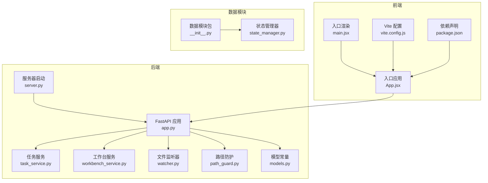
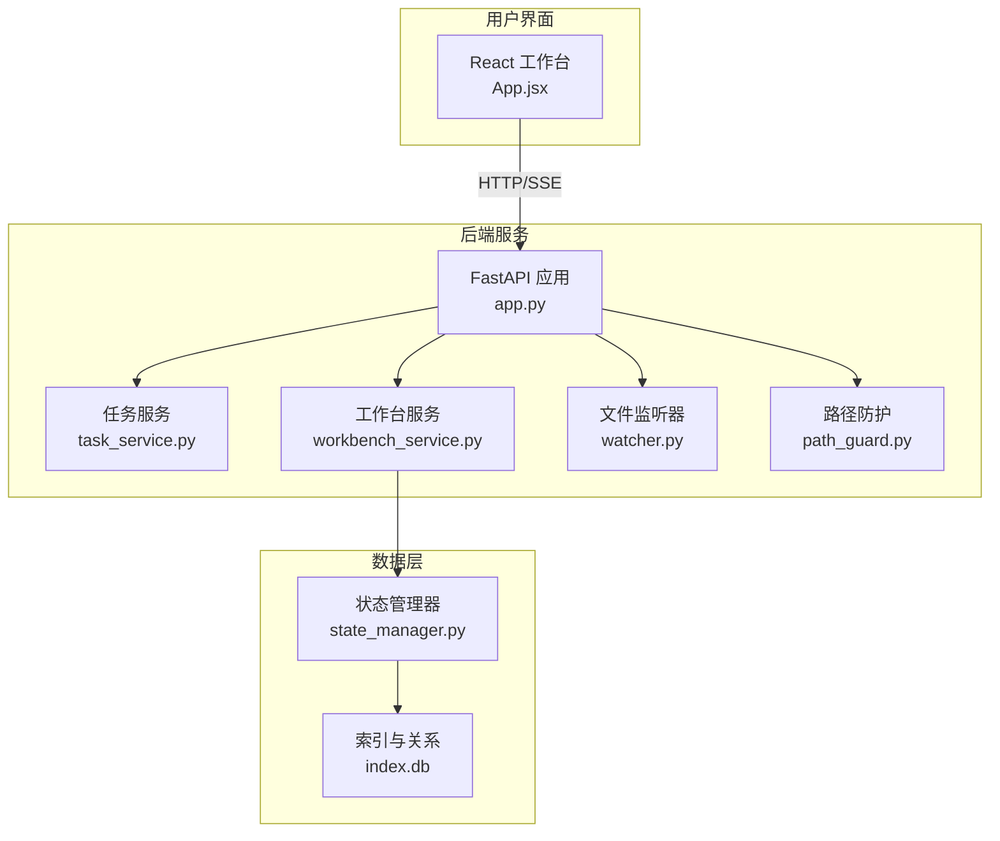
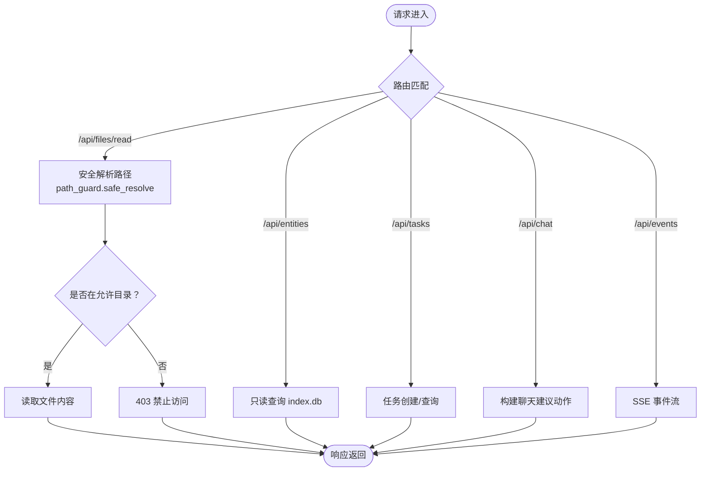
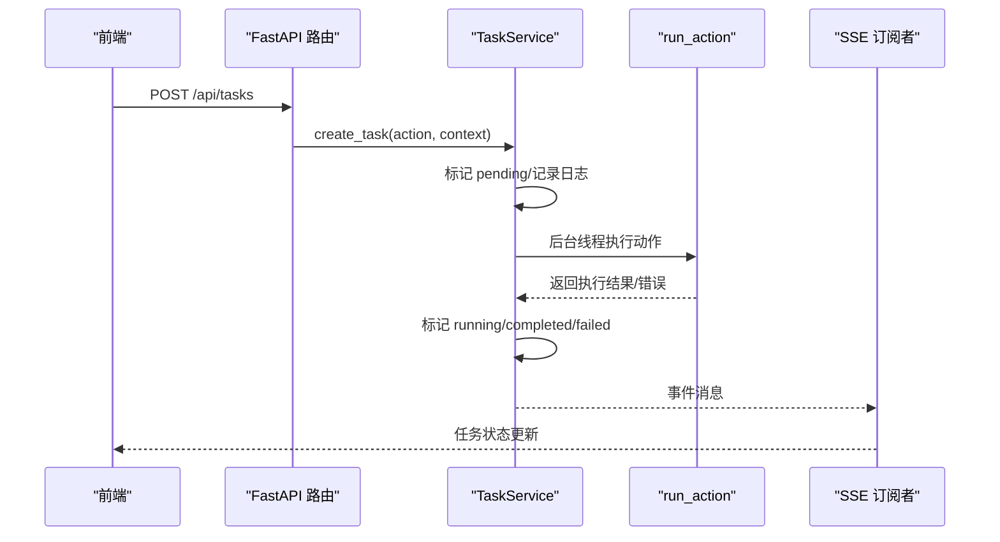
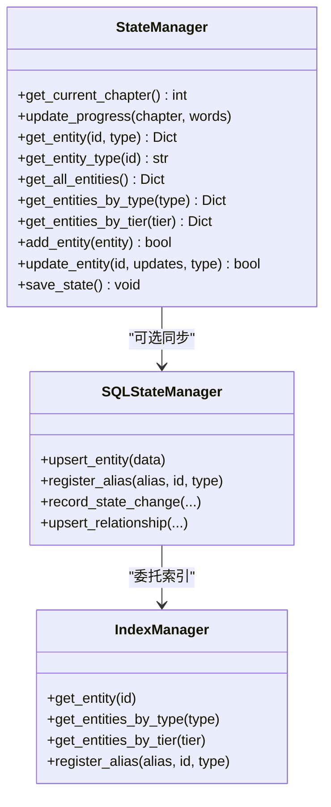
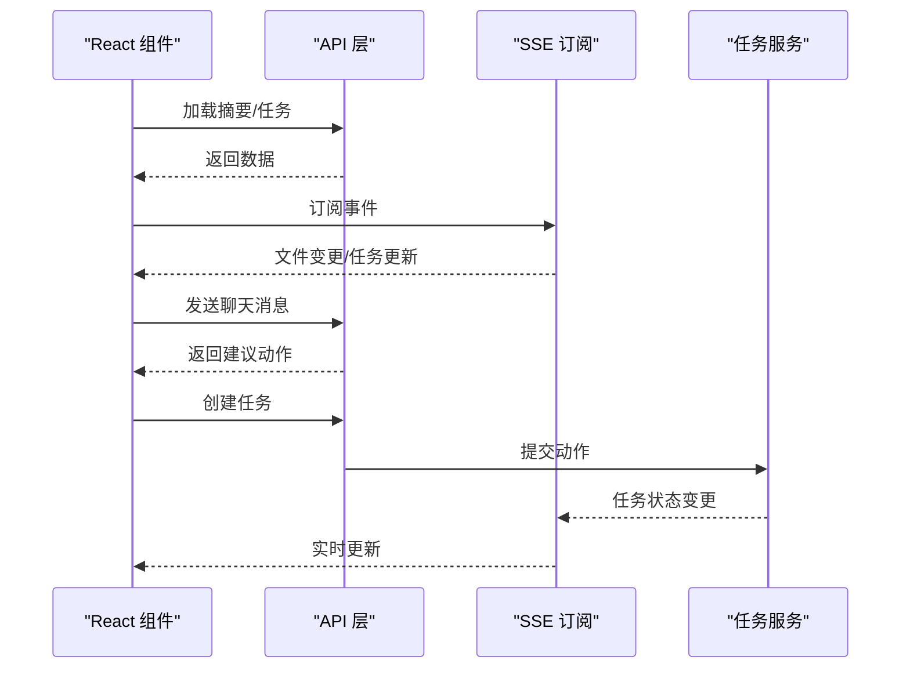
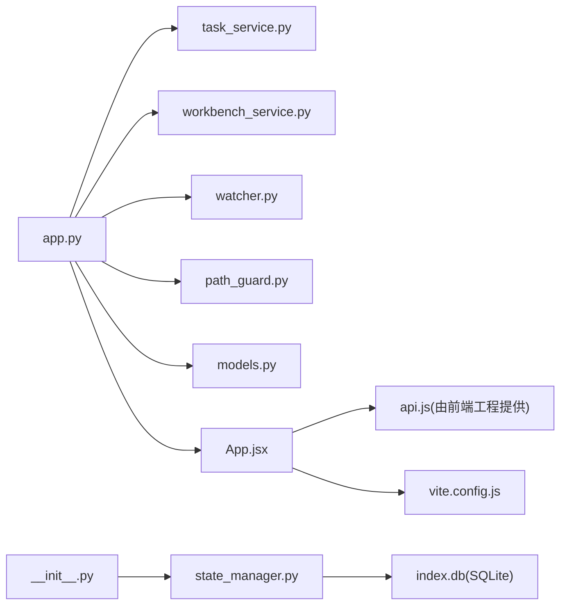

# 代码结构说明

<cite>
**本文档引用的文件**
- [README.md](file://README.md)
- [app.py](file://webnovel-writer/dashboard/app.py)
- [server.py](file://webnovel-writer/dashboard/server.py)
- [models.py](file://webnovel-writer/dashboard/models.py)
- [task_service.py](file://webnovel-writer/dashboard/task_service.py)
- [workbench_service.py](file://webnovel-writer/dashboard/workbench_service.py)
- [watcher.py](file://webnovel-writer/dashboard/watcher.py)
- [path_guard.py](file://webnovel-writer/dashboard/path_guard.py)
- [state_manager.py](file://webnovel-writer/scripts/data_modules/state_manager.py)
- [__init__.py](file://webnovel-writer/scripts/data_modules/__init__.py)
- [App.jsx](file://webnovel-writer/dashboard/frontend/src/App.jsx)
- [main.jsx](file://webnovel-writer/dashboard/frontend/src/main.jsx)
- [package.json](file://webnovel-writer/dashboard/frontend/package.json)
- [vite.config.js](file://webnovel-writer/dashboard/frontend/vite.config.js)
</cite>

## 目录
1. [引言](#引言)
2. [项目结构](#项目结构)
3. [核心组件](#核心组件)
4. [架构总览](#架构总览)
5. [详细组件分析](#详细组件分析)
6. [依赖关系分析](#依赖关系分析)
7. [性能考虑](#性能考虑)
8. [故障排除指南](#故障排除指南)
9. [结论](#结论)
10. [附录](#附录)

## 引言
本项目是一个基于 Claude Code 的长篇网文创作系统，旨在降低 AI 写作中的“遗忘”和“幻觉”，支持长周期连载创作。系统包含后端 FastAPI 应用、前端 React 工作台、数据模块（State Manager、索引管理、RAG 适配器等）以及多种技能（Skills）与代理（Agents）参考材料。本文档将从整体架构、模块划分、组件组织方式、路由设计、服务层与数据访问层实现、前端组件结构与状态管理、API 交互模式、核心功能模块设计理念与实现细节等方面进行深入说明，并提供命名规范、目录组织原则、依赖关系图、关键类与函数的功能说明、使用示例与最佳实践建议。

## 项目结构
项目采用“功能域 + 层次化”的组织方式：
- webnovel-writer/dashboard：后端 FastAPI 应用与前端工作台
- webnovel-writer/scripts/data_modules：数据模块包（延迟导入、状态管理、索引与 RAG 适配）
- webnovel-writer/skills：技能参考与说明
- webnovel-writer/agents：代理参考与说明
- webnovel-writer/templates：题材模板与输出模板
- webnovel-writer/genres：题材细分资料
- webnovel-writer/references：共享参考与规范
- docs：架构与使用文档

**图表来源**
- [app.py:50-490](file://webnovel-writer/dashboard/app.py#L50-L490)
- [server.py:43-72](file://webnovel-writer/dashboard/server.py#L43-L72)
- [task_service.py:14-166](file://webnovel-writer/dashboard/task_service.py#L14-L166)
- [workbench_service.py:18-171](file://webnovel-writer/dashboard/workbench_service.py#L18-L171)
- [watcher.py:40-95](file://webnovel-writer/dashboard/watcher.py#L40-L95)
- [path_guard.py:11-29](file://webnovel-writer/dashboard/path_guard.py#L11-L29)
- [models.py:1-23](file://webnovel-writer/dashboard/models.py#L1-L23)
- [App.jsx:21-417](file://webnovel-writer/dashboard/frontend/src/App.jsx#L21-L417)
- [main.jsx:1-11](file://webnovel-writer/dashboard/frontend/src/main.jsx#L1-L11)
- [vite.config.js:1-16](file://webnovel-writer/dashboard/frontend/vite.config.js#L1-L16)
- [package.json:1-23](file://webnovel-writer/dashboard/frontend/package.json#L1-L23)
- [__init__.py:1-107](file://webnovel-writer/scripts/data_modules/__init__.py#L1-L107)
- [state_manager.py:90-800](file://webnovel-writer/scripts/data_modules/state_manager.py#L90-L800)

**章节来源**
- [README.md:1-170](file://README.md#L1-L170)
- [app.py:1-513](file://webnovel-writer/dashboard/app.py#L1-L513)
- [server.py:1-72](file://webnovel-writer/dashboard/server.py#L1-L72)
- [__init__.py:1-107](file://webnovel-writer/scripts/data_modules/__init__.py#L1-L107)

## 核心组件
- 后端应用工厂：创建 FastAPI 应用，注册中间件、CORS、生命周期钩子与路由。
- 任务服务：负责任务的创建、执行、状态更新与事件分发。
- 工作台服务：提供项目摘要、文件读写、聊天建议动作构建等辅助功能。
- 文件监听器：监控 .webnovel 目录关键文件变更并通过 SSE 推送。
- 路径防护：防止路径穿越，确保文件读写仅限于允许目录。
- 模型常量：定义工作台页面、工作区根目录、任务状态等常量。
- 数据模块包：延迟导入策略，统一导出各类数据模块类与类型。
- 状态管理器：管理实体、关系、状态变更、章节元数据等，支持 SQLite 同步。

**章节来源**
- [app.py:50-490](file://webnovel-writer/dashboard/app.py#L50-L490)
- [task_service.py:14-166](file://webnovel-writer/dashboard/task_service.py#L14-L166)
- [workbench_service.py:18-171](file://webnovel-writer/dashboard/workbench_service.py#L18-L171)
- [watcher.py:40-95](file://webnovel-writer/dashboard/watcher.py#L40-L95)
- [path_guard.py:11-29](file://webnovel-writer/dashboard/path_guard.py#L11-L29)
- [models.py:1-23](file://webnovel-writer/dashboard/models.py#L1-L23)
- [__init__.py:57-107](file://webnovel-writer/scripts/data_modules/__init__.py#L57-L107)
- [state_manager.py:90-800](file://webnovel-writer/scripts/data_modules/state_manager.py#L90-L800)

## 架构总览
系统采用“后端 API + 前端工作台 + 数据模块”的三层架构：
- 后端：FastAPI 提供 REST API 与 SSE，负责项目状态查询、实体数据库只读查询、文件树与内容读取、任务调度与聊天建议。
- 前端：React 工作台通过 API 与 SSE 实时交互，展示项目摘要、实体图谱、章节/大纲/设定集浏览，并支持任务执行与聊天。
- 数据模块：封装状态管理、索引与 RAG 适配，支持 SQLite 同步与性能可观测性。

**图表来源**
- [app.py:50-490](file://webnovel-writer/dashboard/app.py#L50-L490)
- [task_service.py:14-166](file://webnovel-writer/dashboard/task_service.py#L14-L166)
- [workbench_service.py:18-171](file://webnovel-writer/dashboard/workbench_service.py#L18-L171)
- [watcher.py:40-95](file://webnovel-writer/dashboard/watcher.py#L40-L95)
- [path_guard.py:11-29](file://webnovel-writer/dashboard/path_guard.py#L11-L29)
- [state_manager.py:90-800](file://webnovel-writer/scripts/data_modules/state_manager.py#L90-L800)

## 详细组件分析

### 后端 FastAPI 应用（app.py）
- 应用工厂：创建应用实例，注册 CORS、生命周期钩子（启动时初始化任务服务与文件监听器，关闭时停止监听）。
- 路由设计：
  - 项目元信息：/api/project/info（只读 state.json）
  - 实体数据库查询：/api/entities、/api/relationships、/api/relationship-events、/api/chapters、/api/scenes、/api/reading-power、/api/review-metrics、/api/state-changes、/api/aliases
  - 扩展表查询：/api/overrides、/api/debts、/api/debt-events、/api/invalid-facts、/api/rag-queries、/api/tool-stats、/api/checklist-scores
  - 文档浏览：/api/files/tree、/api/files/read（受路径防护）、/api/files/save（受路径防护）
  - 任务：/api/tasks/current、/api/tasks、/api/tasks/{task_id}、/api/chat
  - 实时事件：/api/events（SSE）
  - 前端静态托管：/assets/* 与 SPA 回退到 index.html
- 安全与校验：路径读取均通过 path_guard.safe_resolve 校验，防止路径穿越；文件读取限制在“正文/大纲/设定集”目录；数据库查询对不存在表进行容错处理。

**图表来源**
- [app.py:80-490](file://webnovel-writer/dashboard/app.py#L80-L490)
- [path_guard.py:11-29](file://webnovel-writer/dashboard/path_guard.py#L11-L29)

**章节来源**
- [app.py:50-490](file://webnovel-writer/dashboard/app.py#L50-L490)
- [path_guard.py:11-29](file://webnovel-writer/dashboard/path_guard.py#L11-L29)

### 服务器启动（server.py）
- 项目根解析优先级：CLI 参数 > 环境变量 > .claude 指针 > 当前目录。
- 延迟导入应用工厂，启动 Uvicorn 服务器，默认监听 127.0.0.1:8765，可选自动打开浏览器。

**章节来源**
- [server.py:16-72](file://webnovel-writer/dashboard/server.py#L16-L72)

### 任务服务（task_service.py）
- 任务生命周期：pending → running → completed/failed。
- 线程池执行：后台线程执行动作，主线程通过 asyncio 事件循环安全分发任务事件。
- 事件订阅：支持多个异步队列订阅任务状态变更，通过 JSON 序列化推送。
- 与 Claude Runner 集成：通过 run_action 执行动作，捕获 stdout/stderr 并更新任务状态。

**图表来源**
- [task_service.py:36-166](file://webnovel-writer/dashboard/task_service.py#L36-L166)
- [app.py:395-419](file://webnovel-writer/dashboard/app.py#L395-L419)

**章节来源**
- [task_service.py:14-166](file://webnovel-writer/dashboard/task_service.py#L14-L166)

### 工作台服务（workbench_service.py）
- 项目摘要：聚合 state.json 中的项目信息与进度，统计各工作区文件数量。
- 文件保存：通过 path_guard.safe_resolve 校验路径，仅允许写入“正文/大纲/设定集”目录。
- 聊天建议：根据用户消息关键词匹配大纲规划、设定检查、章节审查、章节写作等动作，并返回建议动作与理由。

**章节来源**
- [workbench_service.py:18-171](file://webnovel-writer/dashboard/workbench_service.py#L18-L171)
- [path_guard.py:11-29](file://webnovel-writer/dashboard/path_guard.py#L11-L29)

### 文件监听器（watcher.py）
- 监控 .webnovel 目录下 state.json、index.db、workflow_state.json 的创建与修改事件。
- 通过 asyncio 队列与事件循环安全分发事件，支持最大队列长度与失效订阅清理。

**章节来源**
- [watcher.py:40-95](file://webnovel-writer/dashboard/watcher.py#L40-L95)

### 路径防护（path_guard.py）
- 安全解析相对路径，确保解析后路径位于项目根目录之内，防止路径穿越攻击。
- 对非法路径与越界访问抛出 403 错误。

**章节来源**
- [path_guard.py:11-29](file://webnovel-writer/dashboard/path_guard.py#L11-L29)

### 数据模块包（__init__.py）
- 延迟导入策略：通过 __getattr__ 动态导入模块，避免包级导入触发警告。
- 统一导出：配置、API 客户端、实体链接器、状态管理器、索引管理器、RAG 适配器、样式采样器等。

**章节来源**
- [__init__.py:57-107](file://webnovel-writer/scripts/data_modules/__init__.py#L57-L107)

### 状态管理器（state_manager.py）
- 数据结构：EntityState、Relationship、StateChange 等数据类。
- 状态写入：原子写入 state.json，支持增量合并与文件锁；同时将大数据字段迁移到 SQLite（index.db）。
- SQLite 同步：支持实体、别名、状态变化、关系等的增量同步，失败时保留 pending 以便重试。
- 查询接口：优先从 SQLite 读取，回退到内存 state（兼容未迁移场景）。

**图表来源**
- [state_manager.py:90-800](file://webnovel-writer/scripts/data_modules/state_manager.py#L90-L800)

**章节来源**
- [state_manager.py:90-800](file://webnovel-writer/scripts/data_modules/state_manager.py#L90-L800)

### 前端 React 应用（App.jsx）
- 状态管理：集中管理工作台状态、连接状态、加载状态、聊天消息、任务状态、页面状态与引导步骤。
- API 交互：通过 api.js 封装 fetch 请求与 SSE 订阅，实现与后端的双向通信。
- 组件结构：TopBar、RightSidebar、OverviewPage、ChapterPage、OutlinePage、SettingPage、OnboardingGuide。
- 事件驱动：SSE 推送文件变更与任务状态更新，自动刷新摘要与页面内容。

**图表来源**
- [App.jsx:64-273](file://webnovel-writer/dashboard/frontend/src/App.jsx#L64-L273)
- [vite.config.js:7-10](file://webnovel-writer/dashboard/frontend/vite.config.js#L7-L10)

**章节来源**
- [App.jsx:21-417](file://webnovel-writer/dashboard/frontend/src/App.jsx#L21-L417)
- [main.jsx:1-11](file://webnovel-writer/dashboard/frontend/src/main.jsx#L1-L11)
- [package.json:1-23](file://webnovel-writer/dashboard/frontend/package.json#L1-L23)
- [vite.config.js:1-16](file://webnovel-writer/dashboard/frontend/vite.config.js#L1-L16)

## 依赖关系分析
- 后端模块耦合：app.py 依赖 task_service、workbench_service、watcher、path_guard、models；task_service 依赖 claude_runner（外部集成）。
- 前端模块耦合：App.jsx 依赖 api.js 与工作台数据模型；Vite 配置提供代理与构建输出。
- 数据模块：__init__.py 统一导出，state_manager.py 依赖配置与安全工具，可选依赖 SQLite 状态管理器与索引管理器。

**图表来源**
- [app.py:20-25](file://webnovel-writer/dashboard/app.py#L20-L25)
- [task_service.py:10-11](file://webnovel-writer/dashboard/task_service.py#L10-L11)
- [workbench_service.py:12-13](file://webnovel-writer/dashboard/workbench_service.py#L12-L13)
- [watcher.py:14-15](file://webnovel-writer/dashboard/watcher.py#L14-L15)
- [path_guard.py:7-8](file://webnovel-writer/dashboard/path_guard.py#L7-L8)
- [models.py:1-23](file://webnovel-writer/dashboard/models.py#L1-L23)
- [__init__.py:57-107](file://webnovel-writer/scripts/data_modules/__init__.py#L57-L107)
- [state_manager.py:112-117](file://webnovel-writer/scripts/data_modules/state_manager.py#L112-L117)

**章节来源**
- [app.py:50-490](file://webnovel-writer/dashboard/app.py#L50-L490)
- [task_service.py:14-166](file://webnovel-writer/dashboard/task_service.py#L14-L166)
- [workbench_service.py:18-171](file://webnovel-writer/dashboard/workbench_service.py#L18-L171)
- [watcher.py:40-95](file://webnovel-writer/dashboard/watcher.py#L40-L95)
- [path_guard.py:11-29](file://webnovel-writer/dashboard/path_guard.py#L11-L29)
- [models.py:1-23](file://webnovel-writer/dashboard/models.py#L1-L23)
- [__init__.py:57-107](file://webnovel-writer/scripts/data_modules/__init__.py#L57-L107)
- [state_manager.py:90-800](file://webnovel-writer/scripts/data_modules/state_manager.py#L90-L800)

## 性能考虑
- 延迟导入：数据模块包通过延迟导入减少启动时的模块加载开销。
- 原子写入：state.json 采用文件锁与原子写入，避免并发写入冲突与数据损坏。
- SQLite 同步：大数据字段迁移到 SQLite，state.json 保持精简，提升读写性能与可维护性。
- SSE 事件：使用 asyncio 队列与事件循环，避免阻塞主线程，保证实时推送的稳定性。
- 前端缓存：页面状态与重载令牌控制组件重渲染，减少不必要的计算与网络请求。

## 故障排除指南
- 项目根解析失败：确认 CLI 参数、环境变量、.claude 指针或当前目录是否包含 .webnovel/state.json。
- 路径越界访问：检查文件读取路径是否位于“正文/大纲/设定集”目录内，避免路径穿越。
- 数据库查询失败：当表不存在时返回空列表，检查 index.db 是否存在及表结构是否正确。
- 任务执行失败：查看任务日志与错误信息，确认动作参数与上下文是否正确。
- SSE 连接断开：检查后端监听端口与防火墙设置，确认前端代理配置正确。

**章节来源**
- [server.py:16-41](file://webnovel-writer/dashboard/server.py#L16-L41)
- [path_guard.py:11-29](file://webnovel-writer/dashboard/path_guard.py#L11-L29)
- [app.py:96-113](file://webnovel-writer/dashboard/app.py#L96-L113)
- [task_service.py:121-143](file://webnovel-writer/dashboard/task_service.py#L121-L143)

## 结论
本项目通过清晰的模块划分与层次化架构，实现了后端 API、前端工作台与数据模块的协同。后端采用 FastAPI 提供 REST 与 SSE，前端通过 React 实现交互与实时更新；数据模块通过 SQLite 同步与原子写入保障了大规模数据的可靠性与性能。技能与代理参考材料为系统提供了丰富的创作能力与扩展空间。遵循本文档的命名规范、目录组织原则与最佳实践，有助于开发者快速理解与高效扩展系统功能。

## 附录

### 代码文件命名规范与目录组织原则
- 后端模块：采用小写与下划线命名，如 app.py、task_service.py、workbench_service.py、watcher.py、path_guard.py、models.py。
- 前端模块：采用小写与下划线命名，如 api.js（由前端工程提供）、workbench/data.js（由前端工程提供）。
- 数据模块：采用小写与下划线命名，如 state_manager.py、index_manager.py、rag_adapter.py 等。
- 技能与代理：采用 webnovel-{skill-type} 命名，如 webnovel-plan、webnovel-write、webnovel-review、webnovel-dashboard、webnovel-init、webnovel-learn、webnovel-query、webnovel-resume。
- 目录组织：按功能域划分，如 dashboard、scripts/data_modules、skills、agents、templates、genres、references、docs。

### 关键类与函数的功能说明与使用示例
- FastAPI 应用工厂：创建应用实例，注册中间件与路由，返回可运行的应用对象。
- TaskService：创建任务、更新任务状态、订阅事件、分发任务事件。
- WorkbenchService：加载项目摘要、保存工作区文件、构建聊天建议动作。
- FileWatcher：启动/停止文件监听，订阅/取消订阅事件，派发文件变更事件。
- StateManager：管理实体、关系、状态变更、章节元数据，支持 SQLite 同步与原子写入。
- 前端 App：集中管理状态、处理 API 与 SSE、协调组件渲染与用户交互。

**章节来源**
- [app.py:50-490](file://webnovel-writer/dashboard/app.py#L50-L490)
- [task_service.py:14-166](file://webnovel-writer/dashboard/task_service.py#L14-L166)
- [workbench_service.py:18-171](file://webnovel-writer/dashboard/workbench_service.py#L18-L171)
- [watcher.py:40-95](file://webnovel-writer/dashboard/watcher.py#L40-L95)
- [state_manager.py:90-800](file://webnovel-writer/scripts/data_modules/state_manager.py#L90-L800)
- [App.jsx:21-417](file://webnovel-writer/dashboard/frontend/src/App.jsx#L21-L417)