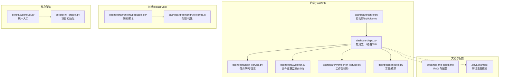
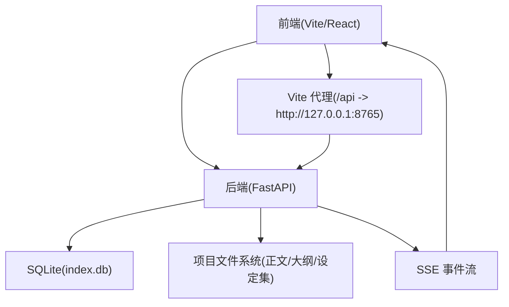
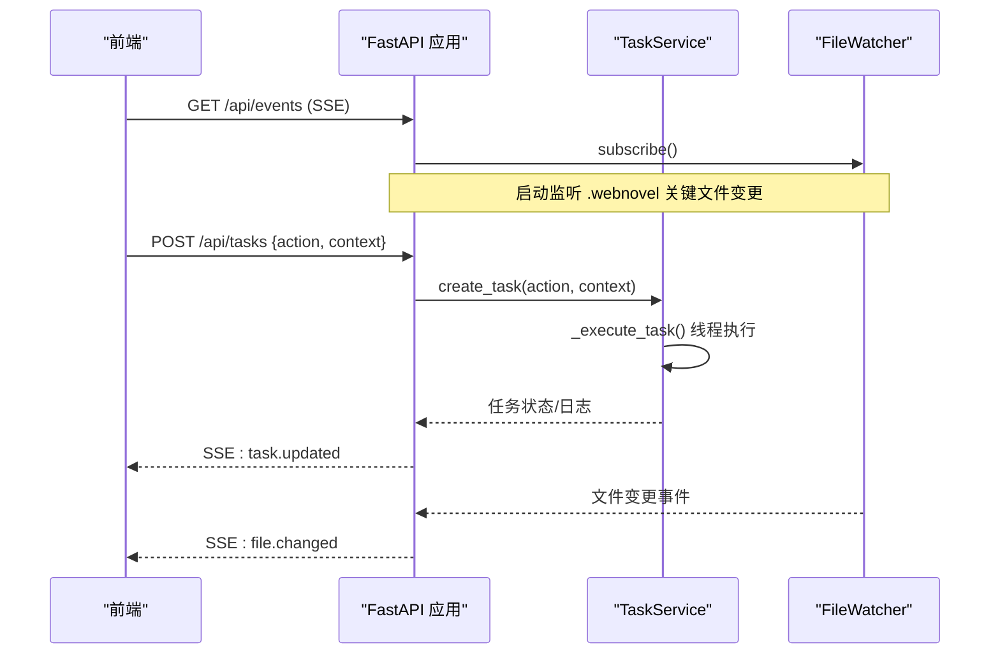
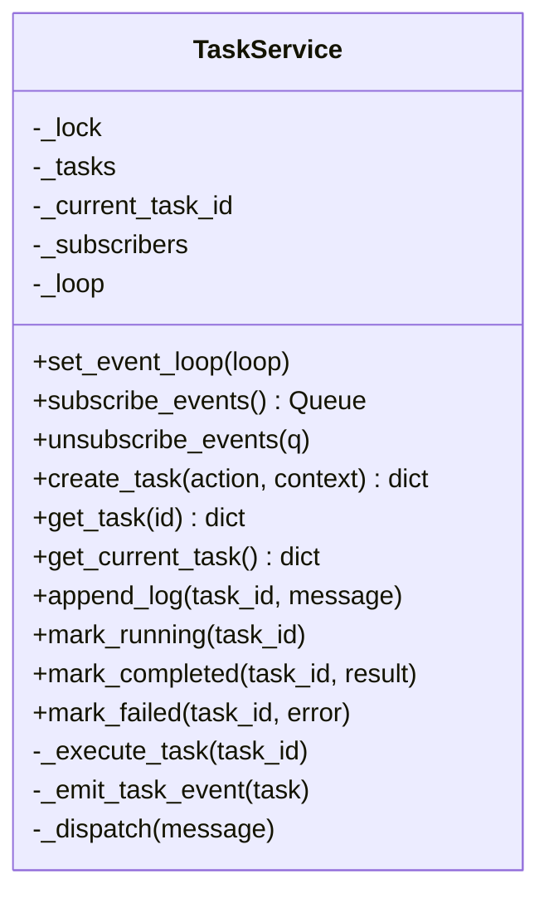
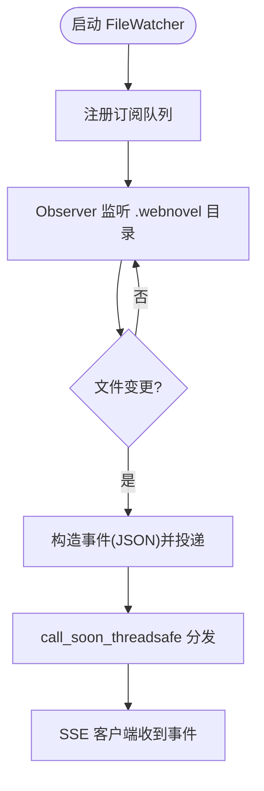
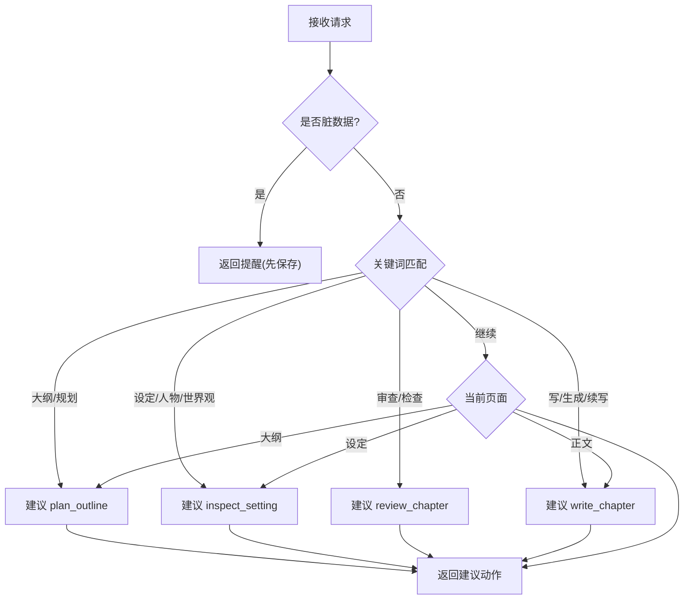
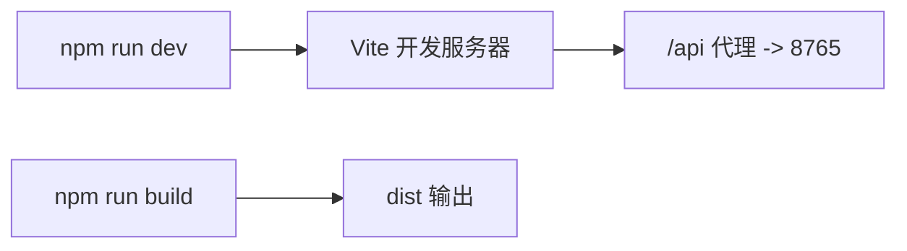
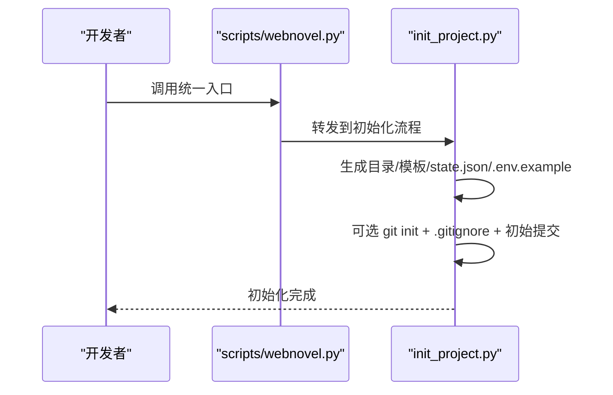
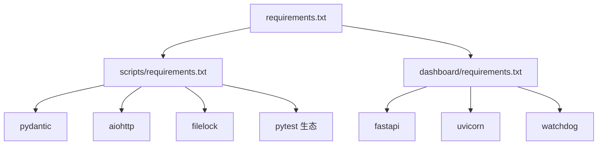

# 开发环境搭建

<cite>
**本文引用的文件**
- [README.md](file://README.md)
- [requirements.txt](file://requirements.txt)
- [webnovel-writer/scripts/requirements.txt](file://webnovel-writer/scripts/requirements.txt)
- [webnovel-writer/dashboard/requirements.txt](file://webnovel-writer/dashboard/requirements.txt)
- [webnovel-writer/dashboard/app.py](file://webnovel-writer/dashboard/app.py)
- [webnovel-writer/dashboard/server.py](file://webnovel-writer/dashboard/server.py)
- [webnovel-writer/dashboard/frontend/package.json](file://webnovel-writer/dashboard/frontend/package.json)
- [webnovel-writer/dashboard/frontend/vite.config.js](file://webnovel-writer/dashboard/frontend/vite.config.js)
- [webnovel-writer/dashboard/models.py](file://webnovel-writer/dashboard/models.py)
- [webnovel-writer/dashboard/task_service.py](file://webnovel-writer/dashboard/task_service.py)
- [webnovel-writer/dashboard/workbench_service.py](file://webnovel-writer/dashboard/workbench_service.py)
- [webnovel-writer/dashboard/watcher.py](file://webnovel-writer/dashboard/watcher.py)
- [webnovel-writer/scripts/init_project.py](file://webnovel-writer/scripts/init_project.py)
- [webnovel-writer/scripts/webnovel.py](file://webnovel-writer/scripts/webnovel.py)
- [docs/rag-and-config.md](file://docs/rag-and-config.md)
- [.github/workflows/plugin-release.yml](file://.github/workflows/plugin-release.yml)
- [pytest.ini](file://pytest.ini)
</cite>

## 目录
1. [引言](#引言)
2. [项目结构](#项目结构)
3. [核心组件](#核心组件)
4. [架构总览](#架构总览)
5. [详细组件分析](#详细组件分析)
6. [依赖分析](#依赖分析)
7. [性能考虑](#性能考虑)
8. [故障排查指南](#故障排查指南)
9. [结论](#结论)
10. [附录](#附录)

## 引言
本指南面向参与 Webnovel Writer 开发的工程师，提供从零搭建完整开发环境的操作手册，涵盖：
- Python 环境与依赖安装
- Node.js 与前端构建
- 虚拟环境与依赖隔离
- 前后端分离开发流程（FastAPI 后端 + React 前端）
- IDE 配置与调试工具
- 开发服务器启动与 API/SSE 实时推送
- 环境变量与 RAG 集成
- Git 工作流与分支管理
- 常见问题排查

## 项目结构
仓库采用“前后端分离 + 多模块”的组织方式：
- 后端（FastAPI）：位于 webnovel-writer/dashboard，提供只读查询、文件浏览、任务调度、SSE 实时推送等能力
- 前端（React/Vite）：位于 webnovel-writer/dashboard/frontend，提供仪表盘 SPA
- 核心脚本与工具：位于 webnovel-writer/scripts，包含项目初始化、统一入口、RAG 适配等
- 文档与规范：docs 目录提供 RAG 与配置、操作说明等

图表来源
- [webnovel-writer/dashboard/app.py:50-490](file://webnovel-writer/dashboard/app.py#L50-L490)
- [webnovel-writer/dashboard/server.py:43-72](file://webnovel-writer/dashboard/server.py#L43-L72)
- [webnovel-writer/dashboard/task_service.py:14-166](file://webnovel-writer/dashboard/task_service.py#L14-L166)
- [webnovel-writer/dashboard/watcher.py:40-95](file://webnovel-writer/dashboard/watcher.py#L40-L95)
- [webnovel-writer/dashboard/workbench_service.py:18-171](file://webnovel-writer/dashboard/workbench_service.py#L18-L171)
- [webnovel-writer/dashboard/models.py:1-23](file://webnovel-writer/dashboard/models.py#L1-L23)
- [webnovel-writer/dashboard/frontend/package.json:1-23](file://webnovel-writer/dashboard/frontend/package.json#L1-L23)
- [webnovel-writer/dashboard/frontend/vite.config.js:1-16](file://webnovel-writer/dashboard/frontend/vite.config.js#L1-L16)
- [webnovel-writer/scripts/webnovel.py:24-37](file://webnovel-writer/scripts/webnovel.py#L24-L37)
- [webnovel-writer/scripts/init_project.py:227-755](file://webnovel-writer/scripts/init_project.py#L227-L755)
- [docs/rag-and-config.md:1-37](file://docs/rag-and-config.md#L1-L37)

章节来源
- [README.md:1-170](file://README.md#L1-L170)
- [requirements.txt:1-3](file://requirements.txt#L1-L3)

## 核心组件
- FastAPI 应用工厂与路由：提供项目信息、实体数据库只读查询、文件树/读取/保存、任务创建与状态、SSE 实时推送、前端静态资源托管
- 任务服务：线程池 + 异步事件循环，封装任务生命周期与日志
- 文件监听器：基于 watchdog，仅监听 .webnovel 关键文件变更并通过 SSE 推送
- 工作台服务：汇总项目摘要、文件保存、聊天动作建议
- 前端工程：Vite + React，通过代理将 /api 转发至后端
- 统一入口与初始化：scripts/webnovel.py 负责路径注入与转发；init_project.py 生成项目骨架与模板

章节来源
- [webnovel-writer/dashboard/app.py:50-490](file://webnovel-writer/dashboard/app.py#L50-L490)
- [webnovel-writer/dashboard/task_service.py:14-166](file://webnovel-writer/dashboard/task_service.py#L14-L166)
- [webnovel-writer/dashboard/watcher.py:40-95](file://webnovel-writer/dashboard/watcher.py#L40-L95)
- [webnovel-writer/dashboard/workbench_service.py:18-171](file://webnovel-writer/dashboard/workbench_service.py#L18-L171)
- [webnovel-writer/dashboard/models.py:1-23](file://webnovel-writer/dashboard/models.py#L1-L23)
- [webnovel-writer/dashboard/frontend/package.json:1-23](file://webnovel-writer/dashboard/frontend/package.json#L1-L23)
- [webnovel-writer/dashboard/frontend/vite.config.js:1-16](file://webnovel-writer/dashboard/frontend/vite.config.js#L1-L16)
- [webnovel-writer/scripts/webnovel.py:24-37](file://webnovel-writer/scripts/webnovel.py#L24-L37)
- [webnovel-writer/scripts/init_project.py:227-755](file://webnovel-writer/scripts/init_project.py#L227-L755)

## 架构总览
后端采用 FastAPI + Uvicorn，前端采用 Vite + React。前端通过本地代理将 /api 请求转发至后端，后端通过 SSE 将 .webnovel 目录的关键文件变更推送给前端。

图表来源
- [webnovel-writer/dashboard/app.py:434-461](file://webnovel-writer/dashboard/app.py#L434-L461)
- [webnovel-writer/dashboard/frontend/vite.config.js:7-10](file://webnovel-writer/dashboard/frontend/vite.config.js#L7-L10)

## 详细组件分析

### 后端应用与路由（FastAPI）
- 应用工厂 create_app：注册 CORS、静态资源、路由与 lifespan
- 路由分类：
  - 项目元信息：/api/project/info
  - 实体数据库只读查询：entities/relationships/...（含扩展表）
  - 文档浏览：/api/files/tree、/api/files/read、/api/files/save
  - 任务：/api/tasks/current、/api/tasks、/api/tasks/{id}
  - 聊天：/api/chat
  - SSE：/api/events
- 路由特点：严格限制文件读取范围，仅允许正文/大纲/设定集；SSE 仅推送 .webnovel 关键文件变更

图表来源
- [webnovel-writer/dashboard/app.py:434-461](file://webnovel-writer/dashboard/app.py#L434-L461)
- [webnovel-writer/dashboard/task_service.py:36-166](file://webnovel-writer/dashboard/task_service.py#L36-L166)
- [webnovel-writer/dashboard/watcher.py:50-95](file://webnovel-writer/dashboard/watcher.py#L50-L95)

章节来源
- [webnovel-writer/dashboard/app.py:50-490](file://webnovel-writer/dashboard/app.py#L50-L490)

### 任务服务（TaskService）
- 职责：创建/跟踪/执行任务，维护任务日志与状态，通过队列向订阅者广播事件
- 执行模型：主线程维护状态，后台线程执行实际动作，完成后通过事件循环安全投递消息
- 事件格式：包含任务 ID 与快照，前端通过 SSE 订阅

图表来源
- [webnovel-writer/dashboard/task_service.py:14-166](file://webnovel-writer/dashboard/task_service.py#L14-L166)

章节来源
- [webnovel-writer/dashboard/task_service.py:14-166](file://webnovel-writer/dashboard/task_service.py#L14-L166)

### 文件监听与 SSE（FileWatcher）
- 仅监听 .webnovel 目录下 state.json、index.db、workflow_state.json 的创建/修改事件
- 通过 asyncio 队列向订阅者广播 JSON 事件，前端实时刷新

图表来源
- [webnovel-writer/dashboard/watcher.py:40-95](file://webnovel-writer/dashboard/watcher.py#L40-L95)

章节来源
- [webnovel-writer/dashboard/watcher.py:40-95](file://webnovel-writer/dashboard/watcher.py#L40-L95)

### 工作台服务（WorkbenchService）
- 职责：加载项目摘要（标题/题材/进度/工作空间统计）、保存工作区文件、根据聊天内容生成建议动作
- 文件写入：仅允许写入正文/大纲/设定集目录，路径经安全解析

图表来源
- [webnovel-writer/dashboard/workbench_service.py:74-162](file://webnovel-writer/dashboard/workbench_service.py#L74-L162)

章节来源
- [webnovel-writer/dashboard/workbench_service.py:18-171](file://webnovel-writer/dashboard/workbench_service.py#L18-L171)

### 前端工程（Vite + React）
- 依赖：react、react-dom、@vitejs/plugin-react、vite
- 脚本：dev/build/preview
- 代理：/api -> http://127.0.0.1:8765
- 构建输出：dist

图表来源
- [webnovel-writer/dashboard/frontend/package.json:6-10](file://webnovel-writer/dashboard/frontend/package.json#L6-L10)
- [webnovel-writer/dashboard/frontend/vite.config.js:1-16](file://webnovel-writer/dashboard/frontend/vite.config.js#L1-L16)

章节来源
- [webnovel-writer/dashboard/frontend/package.json:1-23](file://webnovel-writer/dashboard/frontend/package.json#L1-L23)
- [webnovel-writer/dashboard/frontend/vite.config.js:1-16](file://webnovel-writer/dashboard/frontend/vite.config.js#L1-L16)

### 统一入口与项目初始化
- 统一入口：scripts/webnovel.py 将 .claude/scripts 加入 sys.path 并转发到 data_modules.webnovel
- 项目初始化：scripts/init_project.py 生成项目骨架、state.json、模板文件与 .env.example，并可选初始化 Git

图表来源
- [webnovel-writer/scripts/webnovel.py:24-37](file://webnovel-writer/scripts/webnovel.py#L24-L37)
- [webnovel-writer/scripts/init_project.py:227-755](file://webnovel-writer/scripts/init_project.py#L227-L755)

章节来源
- [webnovel-writer/scripts/webnovel.py:1-37](file://webnovel-writer/scripts/webnovel.py#L1-L37)
- [webnovel-writer/scripts/init_project.py:227-755](file://webnovel-writer/scripts/init_project.py#L227-L755)

## 依赖分析
- 顶层依赖清单：requirements.txt 引用两个子模块的依赖文件
- 后端依赖：FastAPI、Uvicorn、watchdog
- 核心脚本依赖：aiohttp、filelock、pydantic；测试依赖 pytest 及其生态

图表来源
- [requirements.txt:1-3](file://requirements.txt#L1-L3)
- [webnovel-writer/scripts/requirements.txt:1-14](file://webnovel-writer/scripts/requirements.txt#L1-L14)
- [webnovel-writer/dashboard/requirements.txt:1-4](file://webnovel-writer/dashboard/requirements.txt#L1-L4)

章节来源
- [requirements.txt:1-3](file://requirements.txt#L1-L3)
- [webnovel-writer/scripts/requirements.txt:1-14](file://webnovel-writer/scripts/requirements.txt#L1-L14)
- [webnovel-writer/dashboard/requirements.txt:1-4](file://webnovel-writer/dashboard/requirements.txt#L1-L4)

## 性能考虑
- SSE 广播：队列容量与满载丢弃策略，避免内存膨胀
- 数据库查询：只读查询，表不存在时优雅降级为空列表
- 文件监听：仅监听 .webnovel 关键文件，减少 IO 压力
- 前端代理：本地开发时减少跨域与额外中间层
- 任务执行：后台线程执行，主线程仅维护状态与事件投递

## 故障排查指南
- 无法定位项目根目录
  - 现象：启动后端时报“项目根目录未配置”
  - 排查：确认传入 --project-root 或设置 WEBNOVEL_PROJECT_ROOT，或在 .claude 指针指向有效项目
  - 参考：[webnovel-writer/dashboard/server.py:16-41](file://webnovel-writer/dashboard/server.py#L16-L41)
- index.db 不存在
  - 现象：实体查询返回 404
  - 排查：确认项目已完成初始化并生成 .webnovel/index.db
  - 参考：[webnovel-writer/dashboard/app.py:96-113](file://webnovel-writer/dashboard/app.py#L96-L113)
- 前端 404 或 SPA 回退
  - 现象：访问 / 无内容或 404
  - 排查：先在 dashboard/frontend 执行构建，再启动后端
  - 参考：[webnovel-writer/dashboard/app.py:466-488](file://webnovel-writer/dashboard/app.py#L466-L488)
- SSE 不推送
  - 现象：前端不刷新
  - 排查：确认 .webnovel 目录存在且包含 state.json/index.db；检查 watchdog 是否启动
  - 参考：[webnovel-writer/dashboard/watcher.py:81-95](file://webnovel-writer/dashboard/watcher.py#L81-L95)
- RAG 未生效或回退
  - 现象：检索效果不佳
  - 排查：检查 .env 配置优先级与模型参数
  - 参考：[docs/rag-and-config.md:15-37](file://docs/rag-and-config.md#L15-L37)
- 测试覆盖率不足
  - 现象：覆盖率低于阈值
  - 排查：确认 pytest.ini 配置与 .coveragerc 覆盖范围
  - 参考：[pytest.ini:1-8](file://pytest.ini#L1-L8)

章节来源
- [webnovel-writer/dashboard/server.py:16-41](file://webnovel-writer/dashboard/server.py#L16-L41)
- [webnovel-writer/dashboard/app.py:96-113](file://webnovel-writer/dashboard/app.py#L96-L113)
- [webnovel-writer/dashboard/app.py:466-488](file://webnovel-writer/dashboard/app.py#L466-L488)
- [webnovel-writer/dashboard/watcher.py:81-95](file://webnovel-writer/dashboard/watcher.py#L81-L95)
- [docs/rag-and-config.md:15-37](file://docs/rag-and-config.md#L15-L37)
- [pytest.ini:1-8](file://pytest.ini#L1-L8)

## 结论
通过本指南，开发者可以完成从 Python/Node.js 环境准备、虚拟环境隔离、依赖安装，到前后端独立开发与联调的全流程。结合统一入口与项目初始化脚本，可快速生成可运行的项目骨架；配合 RAG 与 SSE 实时推送，实现高效、稳定的本地开发体验。

## 附录

### 环境变量与 RAG 集成
- 环境变量加载顺序：进程环境变量 > 项目根目录 .env > 用户级 ~/.claude/webnovel-writer/.env
- 最小配置项：EMBED_* 与 RERANK_*，未配置 Embedding Key 时语义检索回退到 BM25
- 建议：每本书单独配置 .env，避免多项目串扰

章节来源
- [docs/rag-and-config.md:15-37](file://docs/rag-and-config.md#L15-L37)

### Git 工作流与分支管理
- 推荐分支策略：main 作为稳定基线，feature/* 用于功能开发，hotfix/* 用于紧急修复
- 提交规范：feat/fix/docs/chore 前缀 + 清晰描述
- 发布流程：通过 GitHub Actions Plugin Release 工作流统一发版，自动校验版本一致性并创建 Tag 与 Release

章节来源
- [README.md:161-170](file://README.md#L161-L170)
- [.github/workflows/plugin-release.yml:1-57](file://.github/workflows/plugin-release.yml#L1-L57)

### 开发服务器启动方法
- 后端（FastAPI/Uvicorn）
  - 用法：python -m dashboard.server [--project-root PATH] [--host HOST] [--port PORT] [--no-browser]
  - 默认监听：127.0.0.1:8765，自动打开浏览器
- 前端（Vite）
  - 用法：在 dashboard/frontend 目录执行 npm run dev
  - 代理：/api -> http://127.0.0.1:8765

章节来源
- [webnovel-writer/dashboard/server.py:43-72](file://webnovel-writer/dashboard/server.py#L43-L72)
- [webnovel-writer/dashboard/frontend/package.json:6-10](file://webnovel-writer/dashboard/frontend/package.json#L6-L10)
- [webnovel-writer/dashboard/frontend/vite.config.js:7-10](file://webnovel-writer/dashboard/frontend/vite.config.js#L7-L10)

### 数据库初始化与实体查询
- 初始化：通过 /webnovel-init 生成 .webnovel/state.json 与 index.db（由核心脚本与工作流生成）
- 查询：entities/relationships/... 为只读接口，表不存在时返回空列表

章节来源
- [webnovel-writer/scripts/init_project.py:287-355](file://webnovel-writer/scripts/init_project.py#L287-L355)
- [webnovel-writer/dashboard/app.py:96-113](file://webnovel-writer/dashboard/app.py#L96-L113)