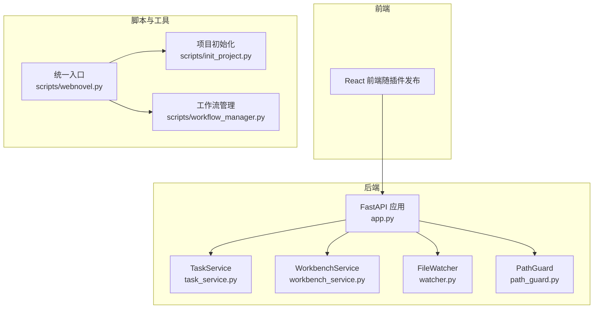
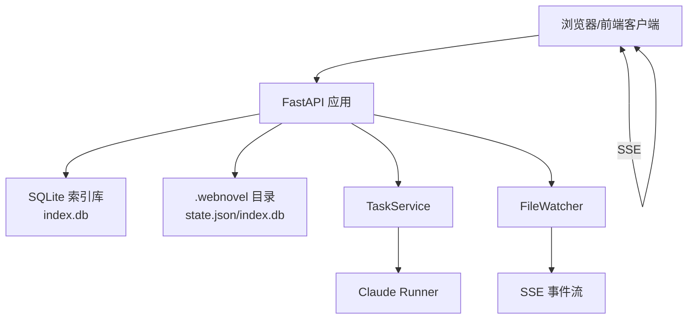
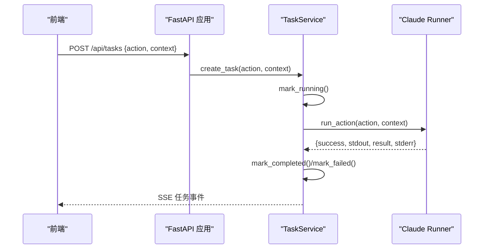
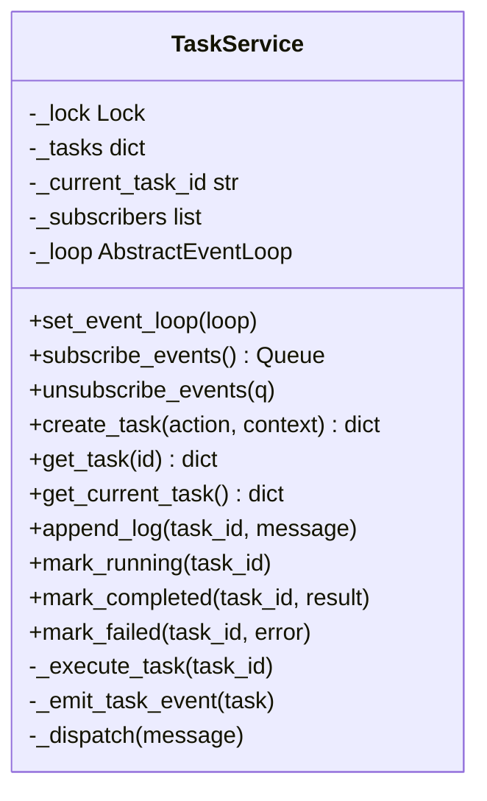
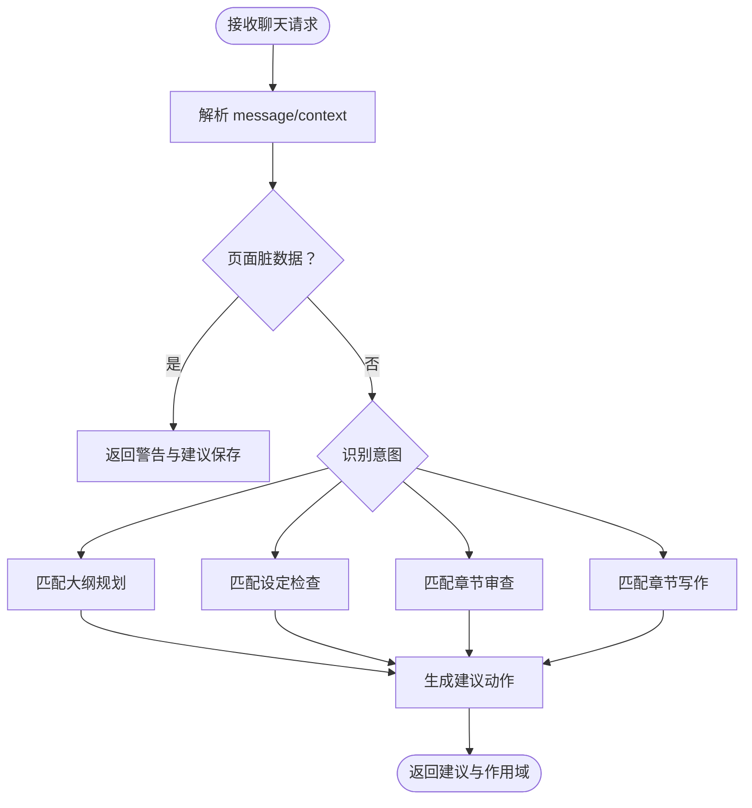
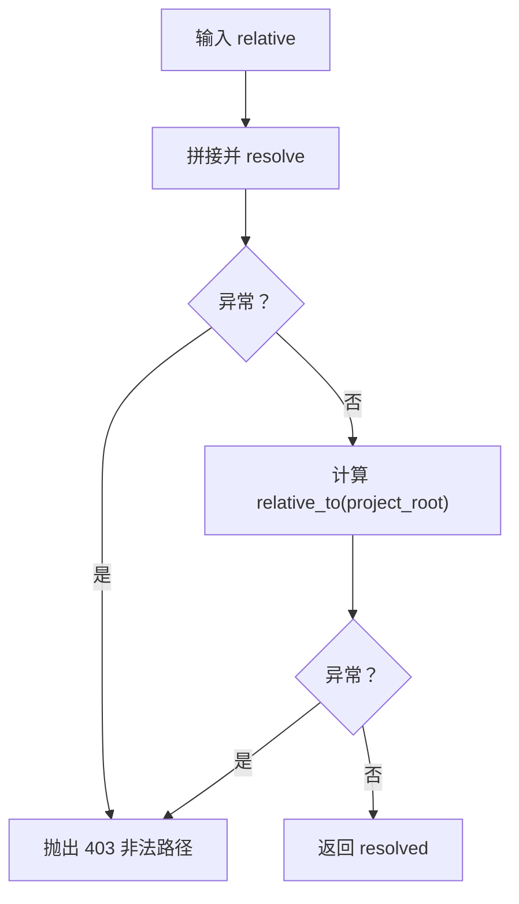
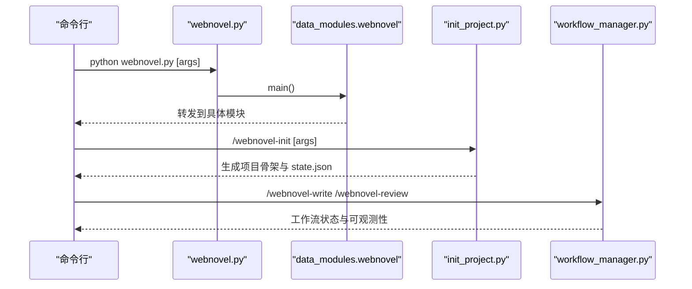
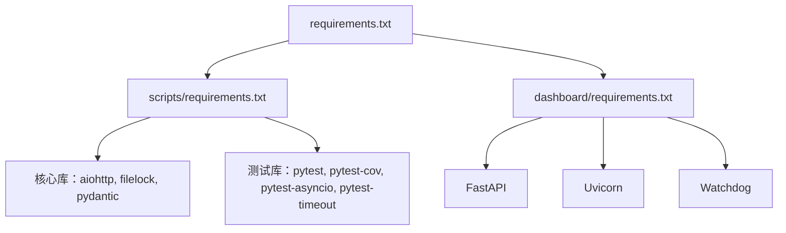

# 开发者指南

<cite>
**本文引用的文件**
- [README.md](file://README.md)
- [requirements.txt](file://requirements.txt)
- [pytest.ini](file://pytest.ini)
- [webnovel-writer/dashboard/requirements.txt](file://webnovel-writer/dashboard/requirements.txt)
- [webnovel-writer/dashboard/app.py](file://webnovel-writer/dashboard/app.py)
- [webnovel-writer/dashboard/server.py](file://webnovel-writer/dashboard/server.py)
- [webnovel-writer/dashboard/__main__.py](file://webnovel-writer/dashboard/__main__.py)
- [webnovel-writer/dashboard/models.py](file://webnovel-writer/dashboard/models.py)
- [webnovel-writer/dashboard/task_service.py](file://webnovel-writer/dashboard/task_service.py)
- [webnovel-writer/dashboard/workbench_service.py](file://webnovel-writer/dashboard/workbench_service.py)
- [webnovel-writer/dashboard/watcher.py](file://webnovel-writer/dashboard/watcher.py)
- [webnovel-writer/dashboard/path_guard.py](file://webnovel-writer/dashboard/path_guard.py)
- [webnovel-writer/scripts/webnovel.py](file://webnovel-writer/scripts/webnovel.py)
- [webnovel-writer/scripts/init_project.py](file://webnovel-writer/scripts/init_project.py)
- [webnovel-writer/scripts/workflow_manager.py](file://webnovel-writer/scripts/workflow_manager.py)
</cite>

## 目录
1. [引言](#引言)
2. [项目结构](#项目结构)
3. [核心组件](#核心组件)
4. [架构总览](#架构总览)
5. [详细组件分析](#详细组件分析)
6. [依赖分析](#依赖分析)
7. [性能考虑](#性能考虑)
8. [故障排查指南](#故障排查指南)
9. [结论](#结论)
10. [附录](#附录)

## 引言
本指南面向希望参与 Webnovel Writer 项目开发的开发者，提供从环境搭建、代码结构、模块职责、前后端开发流程、测试策略、调试技巧到持续集成与部署的完整开发指导。项目采用 Python 后端（FastAPI）、SQLite 数据库、React 前端（随插件发布）与多模块脚本协作的方式，围绕“长周期网文创作”的上下文一致性与可审计性进行工程化设计。

## 项目结构
项目采用“功能域 + 层次化”组织方式：
- webnovel-writer/dashboard：FastAPI 可视化仪表盘（只读查询 + 最小写能力 + 实时事件推送）
- webnovel-writer/scripts：核心工作流与数据模块（项目初始化、工作流状态管理、RAG/索引适配、CLI 统一入口等）
- webnovel-writer/genres、references、skills、templates：题材模板、参考材料、技能与模板资源
- docs：项目文档与规格说明
- .github/workflows：GitHub Actions 持续集成与插件发布工作流
- 顶层配置：pytest.ini、requirements.txt、.coveragerc 等



图表来源
- [webnovel-writer/dashboard/app.py:50-490](file://webnovel-writer/dashboard/app.py#L50-L490)
- [webnovel-writer/dashboard/task_service.py:14-166](file://webnovel-writer/dashboard/task_service.py#L14-L166)
- [webnovel-writer/dashboard/workbench_service.py:18-171](file://webnovel-writer/dashboard/workbench_service.py#L18-L171)
- [webnovel-writer/dashboard/watcher.py:40-95](file://webnovel-writer/dashboard/watcher.py#L40-L95)
- [webnovel-writer/dashboard/path_guard.py:11-29](file://webnovel-writer/dashboard/path_guard.py#L11-L29)
- [webnovel-writer/scripts/webnovel.py:24-37](file://webnovel-writer/scripts/webnovel.py#L24-L37)
- [webnovel-writer/scripts/init_project.py:227-755](file://webnovel-writer/scripts/init_project.py#L227-L755)
- [webnovel-writer/scripts/workflow_manager.py:50-722](file://webnovel-writer/scripts/workflow_manager.py#L50-L722)

章节来源
- [README.md:1-170](file://README.md#L1-L170)
- [requirements.txt:1-3](file://requirements.txt#L1-L3)
- [webnovel-writer/dashboard/requirements.txt:1-4](file://webnovel-writer/dashboard/requirements.txt#L1-L4)

## 核心组件
- FastAPI 应用与路由：提供只读实体查询、文件树/读取/保存、任务创建与状态、SSE 实时事件、前端静态托管等。
- TaskService：任务生命周期管理（创建、运行、日志、完成/失败），与 Claude Runner 交互。
- WorkbenchService：项目摘要、文件保存、聊天动作建议生成。
- FileWatcher：监控 .webnovel 关键文件变化并通过 SSE 推送。
- PathGuard：路径解析与越界防护，保障文件读写安全。
- 统一入口与工作流：scripts/webnovel.py 将 sys.path 指向 .claude/scripts 并转发调用；init_project.py 生成项目骨架；workflow_manager.py 管理任务步骤与可观测性。

章节来源
- [webnovel-writer/dashboard/app.py:50-490](file://webnovel-writer/dashboard/app.py#L50-L490)
- [webnovel-writer/dashboard/task_service.py:14-166](file://webnovel-writer/dashboard/task_service.py#L14-L166)
- [webnovel-writer/dashboard/workbench_service.py:18-171](file://webnovel-writer/dashboard/workbench_service.py#L18-L171)
- [webnovel-writer/dashboard/watcher.py:40-95](file://webnovel-writer/dashboard/watcher.py#L40-L95)
- [webnovel-writer/dashboard/path_guard.py:11-29](file://webnovel-writer/dashboard/path_guard.py#L11-L29)
- [webnovel-writer/scripts/webnovel.py:24-37](file://webnovel-writer/scripts/webnovel.py#L24-L37)
- [webnovel-writer/scripts/init_project.py:227-755](file://webnovel-writer/scripts/init_project.py#L227-L755)
- [webnovel-writer/scripts/workflow_manager.py:50-722](file://webnovel-writer/scripts/workflow_manager.py#L50-L722)

## 架构总览
系统采用“后端 API + 任务编排 + 文件/索引观测”的分层架构：
- 前端通过 SPA 访问 API，后端提供只读查询与最小写能力，确保安全性与可审计性。
- 任务通过 TaskService 异步执行，日志与状态通过 SSE 推送至前端。
- 文件变更由 Watchdog 监控，触发 SSE 事件，前端自动刷新。
- 项目初始化与工作流状态管理由 scripts 子模块承担，CLI 统一入口保证跨安装场景的一致性。



图表来源
- [webnovel-writer/dashboard/app.py:80-490](file://webnovel-writer/dashboard/app.py#L80-L490)
- [webnovel-writer/dashboard/watcher.py:40-95](file://webnovel-writer/dashboard/watcher.py#L40-L95)
- [webnovel-writer/dashboard/task_service.py:121-143](file://webnovel-writer/dashboard/task_service.py#L121-L143)

## 详细组件分析

### FastAPI 应用与路由
- 应用工厂 create_app 支持 lifespan 生命周期管理，启动时初始化任务服务与文件监听器。
- 路由涵盖：
  - 项目信息与工作台摘要
  - 实体数据库只读查询（entities、relationships、chapters、scenes、reading-power、review-metrics、state-changes、aliases 等）
  - 扩展表查询（overrides、debts、debt-events、invalid-facts、rag-queries、tool-stats、checklist-scores）
  - 文件树、只读读取与最小写能力（save）
  - 任务创建、查询与当前任务
  - 聊天动作建议
  - SSE 事件流
  - 前端静态托管（SPA 回退）



图表来源
- [webnovel-writer/dashboard/app.py:395-429](file://webnovel-writer/dashboard/app.py#L395-L429)
- [webnovel-writer/dashboard/task_service.py:36-143](file://webnovel-writer/dashboard/task_service.py#L36-L143)

章节来源
- [webnovel-writer/dashboard/app.py:50-490](file://webnovel-writer/dashboard/app.py#L50-L490)

### 任务服务（TaskService）
- 线程安全的任务字典与当前任务 ID，支持并发订阅与事件分发。
- 任务生命周期：pending → running → completed/failed，附带日志队列与最近更新时间。
- 与 Claude Runner 的交互封装，异常捕获与日志上报。
- 事件通过 asyncio Queue 与主事件循环线程安全通信。



图表来源
- [webnovel-writer/dashboard/task_service.py:14-166](file://webnovel-writer/dashboard/task_service.py#L14-L166)

章节来源
- [webnovel-writer/dashboard/task_service.py:14-166](file://webnovel-writer/dashboard/task_service.py#L14-L166)

### 工作台服务（WorkbenchService）
- 项目摘要聚合：从 state.json 读取项目信息与进度，统计各工作空间文件数量。
- 文件保存：通过 path_guard 与白名单根目录限制，确保仅允许写入“正文/大纲/设定集”。
- 聊天动作建议：根据关键词识别规划/设定/审查/写作意图，生成建议动作与理由。



图表来源
- [webnovel-writer/dashboard/workbench_service.py:74-162](file://webnovel-writer/dashboard/workbench_service.py#L74-L162)

章节来源
- [webnovel-writer/dashboard/workbench_service.py:18-171](file://webnovel-writer/dashboard/workbench_service.py#L18-L171)

### 文件监听与 SSE（FileWatcher）
- 仅监听 .webnovel 目录下关键文件（state.json、index.db、workflow_state.json）。
- 通过 asyncio Queue 与主事件循环线程安全分发事件，前端通过 /api/events 订阅。

```mermaid
sequenceDiagram
participant WD as "FileWatcher"
participant OBS as "Observer"
participant LOOP as "事件循环"
participant FE as "前端"
WD->>OBS : schedule(handler, dir)
OBS-->>WD : on_created/modified
WD->>LOOP : call_soon_threadsafe(_dispatch)
LOOP-->>FE : SSE data : file.changed
```

图表来源
- [webnovel-writer/dashboard/watcher.py:18-95](file://webnovel-writer/dashboard/watcher.py#L18-L95)

章节来源
- [webnovel-writer/dashboard/watcher.py:40-95](file://webnovel-writer/dashboard/watcher.py#L40-L95)

### 路径安全（PathGuard）
- safe_resolve 对相对路径进行解析与越界校验，防止路径穿越。
- 所有文件读取/写入 API 前均需经过校验。



图表来源
- [webnovel-writer/dashboard/path_guard.py:11-29](file://webnovel-writer/dashboard/path_guard.py#L11-L29)

章节来源
- [webnovel-writer/dashboard/path_guard.py:11-29](file://webnovel-writer/dashboard/path_guard.py#L11-L29)

### 统一入口与项目初始化
- scripts/webnovel.py 将 .claude/scripts 加入 sys.path 并转发到 data_modules.webnovel.main。
- init_project.py 生成项目骨架目录、state.json、基础模板与 .env.example，并尝试初始化 Git。
- workflow_manager.py 提供工作流状态管理、可观测性追踪与中断恢复选项。



图表来源
- [webnovel-writer/scripts/webnovel.py:24-37](file://webnovel-writer/scripts/webnovel.py#L24-L37)
- [webnovel-writer/scripts/init_project.py:227-755](file://webnovel-writer/scripts/init_project.py#L227-L755)
- [webnovel-writer/scripts/workflow_manager.py:50-722](file://webnovel-writer/scripts/workflow_manager.py#L50-L722)

章节来源
- [webnovel-writer/scripts/webnovel.py:24-37](file://webnovel-writer/scripts/webnovel.py#L24-L37)
- [webnovel-writer/scripts/init_project.py:227-755](file://webnovel-writer/scripts/init_project.py#L227-L755)
- [webnovel-writer/scripts/workflow_manager.py:50-722](file://webnovel-writer/scripts/workflow_manager.py#L50-L722)

## 依赖分析
- 顶层依赖：requirements.txt 引用两个子模块的 requirements，分别用于 scripts 与 dashboard。
- dashboard 依赖：FastAPI、Uvicorn、Watchdog。
- scripts 依赖：核心库与可选测试依赖（pytest、pytest-cov、pytest-asyncio、pytest-timeout）。



图表来源
- [requirements.txt:1-3](file://requirements.txt#L1-L3)
- [webnovel-writer/dashboard/requirements.txt:1-4](file://webnovel-writer/dashboard/requirements.txt#L1-L4)
- [webnovel-writer/scripts/requirements.txt:1-14](file://webnovel-writer/scripts/requirements.txt#L1-L14)

章节来源
- [requirements.txt:1-3](file://requirements.txt#L1-L3)
- [webnovel-writer/dashboard/requirements.txt:1-4](file://webnovel-writer/dashboard/requirements.txt#L1-L4)
- [webnovel-writer/scripts/requirements.txt:1-14](file://webnovel-writer/scripts/requirements.txt#L1-L14)

## 性能考虑
- SSE 事件队列容量与满载处理：TaskService 与 FileWatcher 的队列均有限容量，避免内存膨胀；满载时移除死订阅。
- SQLite 查询健壮性：对不存在的表返回空列表，减少异常传播。
- 文件监听粒度：仅监听 .webnovel 目录的关键文件，降低 IO 压力。
- 任务执行异步化：任务在后台线程执行，避免阻塞事件循环。
- 日志截断：任务日志保留最近 N 条，避免无限增长。

章节来源
- [webnovel-writer/dashboard/task_service.py:25-35](file://webnovel-writer/dashboard/task_service.py#L25-L35)
- [webnovel-writer/dashboard/watcher.py:50-59](file://webnovel-writer/dashboard/watcher.py#L50-L59)
- [webnovel-writer/dashboard/app.py:104-113](file://webnovel-writer/dashboard/app.py#L104-L113)

## 故障排查指南
- 项目根解析失败
  - 现象：无法定位 PROJECT_ROOT 或找不到 .webnovel/state.json。
  - 排查：检查 CLI 参数、环境变量、.claude 指针与当前目录优先级。
  - 参考：[webnovel-writer/dashboard/server.py:16-41](file://webnovel-writer/dashboard/server.py#L16-L41)
- 路径越界/权限错误
  - 现象：读取/写入文件返回 403。
  - 排查：确认路径经 safe_resolve 校验，且仅在“正文/大纲/设定集”范围内。
  - 参考：[webnovel-writer/dashboard/path_guard.py:11-29](file://webnovel-writer/dashboard/path_guard.py#L11-L29)
- 任务执行异常
  - 现象：任务失败或无响应。
  - 排查：查看任务日志队列与 SSE 事件，确认 run_action 返回值与异常捕获。
  - 参考：[webnovel-writer/dashboard/task_service.py:121-143](file://webnovel-writer/dashboard/task_service.py#L121-L143)
- 文件变更未刷新
  - 现象：前端未收到 SSE 更新。
  - 排查：确认 Watchdog 是否启动、关键文件是否在监控列表、队列是否被清理。
  - 参考：[webnovel-writer/dashboard/watcher.py:80-95](file://webnovel-writer/dashboard/watcher.py#L80-L95)
- CLI 预检
  - 使用统一预检命令排查本地 CLI/插件/项目根解析问题。
  - 参考：[README.md:78-82](file://README.md#L78-L82)

章节来源
- [webnovel-writer/dashboard/server.py:16-41](file://webnovel-writer/dashboard/server.py#L16-L41)
- [webnovel-writer/dashboard/path_guard.py:11-29](file://webnovel-writer/dashboard/path_guard.py#L11-L29)
- [webnovel-writer/dashboard/task_service.py:121-143](file://webnovel-writer/dashboard/task_service.py#L121-L143)
- [webnovel-writer/dashboard/watcher.py:80-95](file://webnovel-writer/dashboard/watcher.py#L80-L95)
- [README.md:78-82](file://README.md#L78-L82)

## 结论
本指南提供了 Webnovel Writer 的完整开发蓝图：从前端 SPA 的接入，到 FastAPI 后端的安全只读查询与最小写能力，再到任务编排、文件监听与路径安全的工程实践。配合统一 CLI 入口与工作流可观测性，开发者可以高效地迭代与维护系统。

## 附录

### 开发环境搭建
- 安装依赖：使用顶层 requirements.txt 安装核心与 Dashboard 依赖。
- 初始化项目：在 Claude Code 中执行 /webnovel-init，生成项目骨架与 state.json。
- 配置 RAG：复制 .env.example 为 .env 并填写 Embedding/Rerank 凭证。
- 启动 Dashboard：使用 /webnovel-dashboard 或本地 python -m dashboard.server。
- 参考：[README.md:32-88](file://README.md#L32-L88)

章节来源
- [README.md:32-88](file://README.md#L32-L88)

### 前端 React 应用开发流程
- 前端构建产物随插件发布，本地无需 npm run build。
- 通过 FastAPI 的静态文件托管与 SPA 回退，确保路由正确。
- 参考：[webnovel-writer/dashboard/app.py:466-488](file://webnovel-writer/dashboard/app.py#L466-L488)

章节来源
- [webnovel-writer/dashboard/app.py:466-488](file://webnovel-writer/dashboard/app.py#L466-L488)

### 后端 FastAPI 调试方法
- 使用 uvicorn 运行，开启浏览器自动打开与 API 文档。
- 通过 /api/events 订阅 SSE，观察文件与任务事件。
- 参考：[webnovel-writer/dashboard/server.py:43-67](file://webnovel-writer/dashboard/server.py#L43-L67)

章节来源
- [webnovel-writer/dashboard/server.py:43-67](file://webnovel-writer/dashboard/server.py#L43-L67)

### 测试策略与覆盖率
- 测试框架：pytest，添加 opts：静默输出、覆盖率统计、缺失覆盖报告、失败阈值。
- 覆盖率范围：由 .coveragerc 的 [run] source 控制。
- 参考：[pytest.ini:1-8](file://pytest.ini#L1-L8)

章节来源
- [pytest.ini:1-8](file://pytest.ini#L1-L8)

### Git 工作流程与代码审查
- 推荐使用 GitHub Actions 的 Plugin Release 工作流统一发版。
- 本地同步版本信息后提交并推送，触发校验与发布。
- 参考：[README.md:130-147](file://README.md#L130-L147)

章节来源
- [README.md:130-147](file://README.md#L130-L147)

### 持续集成与部署
- 使用 .github/workflows 中的工作流进行插件版本校验与发布。
- 参考：[README.md:130-147](file://README.md#L130-L147)

章节来源
- [README.md:130-147](file://README.md#L130-L147)