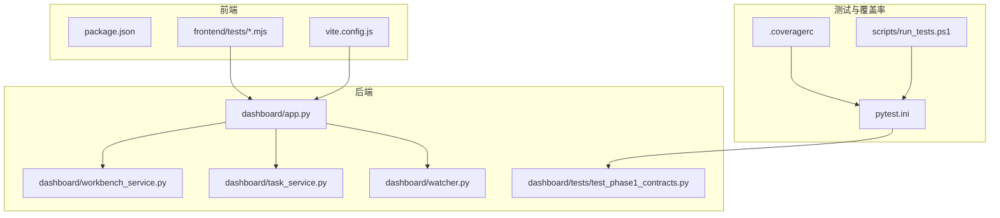
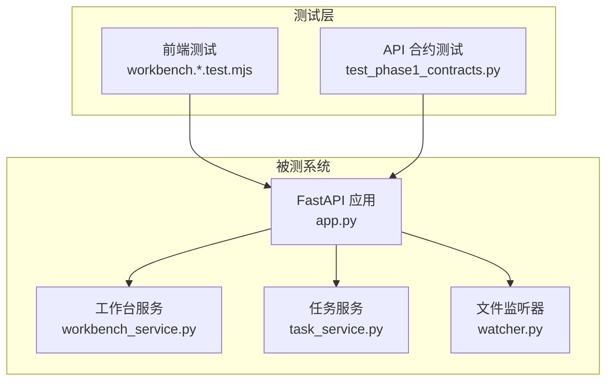
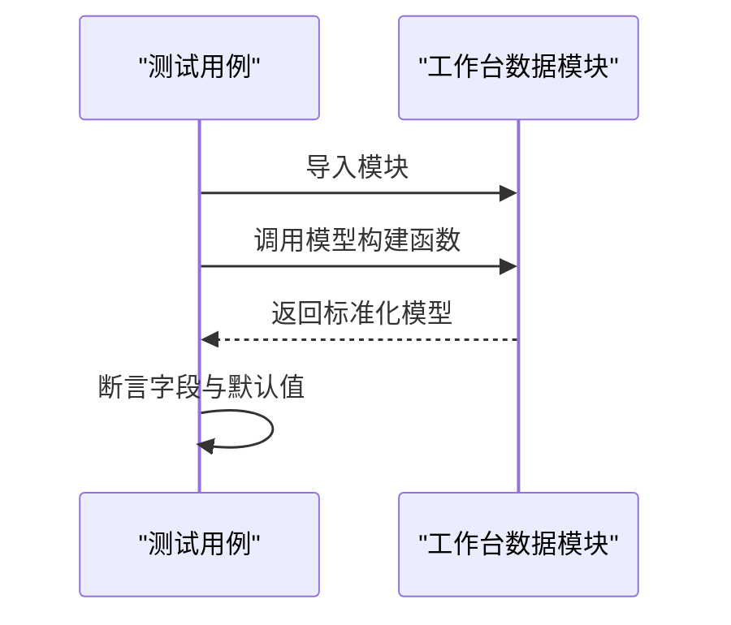
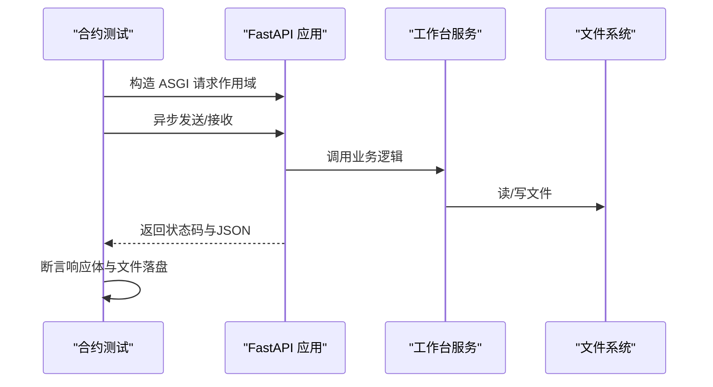
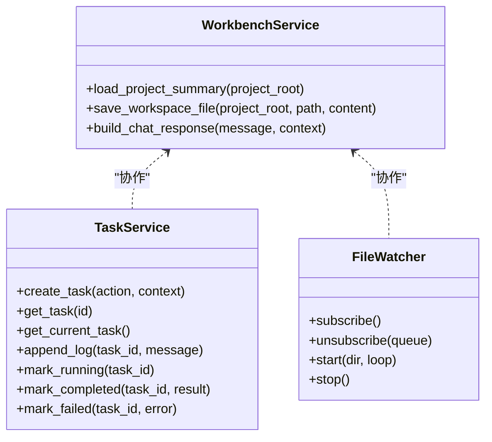
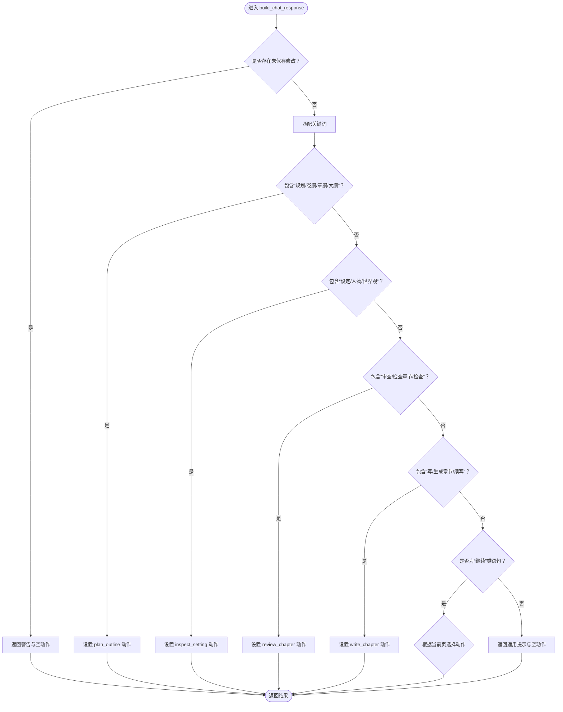
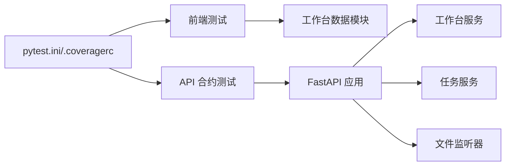

# 测试与调试

<cite>
**本文引用的文件**
- [pytest.ini](file://pytest.ini)
- [.coveragerc](file://.coveragerc)
- [webnovel-writer/dashboard/frontend/package.json](file://webnovel-writer/dashboard/frontend/package.json)
- [webnovel-writer/dashboard/frontend/vite.config.js](file://webnovel-writer/dashboard/frontend/vite.config.js)
- [webnovel-writer/dashboard/frontend/tests/workbench.chat.test.mjs](file://webnovel-writer/dashboard/frontend/tests/workbench.chat.test.mjs)
- [webnovel-writer/dashboard/frontend/tests/workbench.data.test.mjs](file://webnovel-writer/dashboard/frontend/tests/workbench.data.test.mjs)
- [webnovel-writer/dashboard/app.py](file://webnovel-writer/dashboard/app.py)
- [webnovel-writer/dashboard/workbench_service.py](file://webnovel-writer/dashboard/workbench_service.py)
- [webnovel-writer/dashboard/task_service.py](file://webnovel-writer/dashboard/task_service.py)
- [webnovel-writer/dashboard/watcher.py](file://webnovel-writer/dashboard/watcher.py)
- [webnovel-writer/dashboard/tests/test_phase1_contracts.py](file://webnovel-writer/dashboard/tests/test_phase1_contracts.py)
- [webnovel-writer/scripts/run_tests.ps1](file://webnovel-writer/scripts/run_tests.ps1)
</cite>

## 目录
1. [简介](#简介)
2. [项目结构](#项目结构)
3. [核心组件](#核心组件)
4. [架构总览](#架构总览)
5. [详细组件分析](#详细组件分析)
6. [依赖分析](#依赖分析)
7. [性能考虑](#性能考虑)
8. [故障排查指南](#故障排查指南)
9. [结论](#结论)
10. [附录](#附录)

## 简介
本指南面向 Webnovel Writer 项目，系统化阐述测试与调试工作流，涵盖测试框架配置、单元测试与集成测试编写规范、覆盖率与质量门禁、调试工具与日志分析、性能与压力测试策略、测试数据与环境隔离实践，以及常见问题排查与解决方案。读者可据此建立稳定高效的测试与调试体系。

## 项目结构
本项目包含前后端测试与服务层，测试主要分布在：
- 后端 Python 测试：集中于 .claude/scripts/data_modules/tests 与 dashboard/tests
- 前端 Node 测试：dashboard/frontend/tests
- 构建与代理：Vite 配置用于本地开发与 API 代理
- 覆盖率与门禁：pytest.ini 与 .coveragerc 统一配置

**图表来源**
- [webnovel-writer/dashboard/frontend/package.json:1-23](file://webnovel-writer/dashboard/frontend/package.json#L1-L23)
- [webnovel-writer/dashboard/frontend/vite.config.js:1-16](file://webnovel-writer/dashboard/frontend/vite.config.js#L1-L16)
- [webnovel-writer/dashboard/app.py:1-513](file://webnovel-writer/dashboard/app.py#L1-L513)
- [webnovel-writer/dashboard/workbench_service.py:1-171](file://webnovel-writer/dashboard/workbench_service.py#L1-L171)
- [webnovel-writer/dashboard/task_service.py:1-166](file://webnovel-writer/dashboard/task_service.py#L1-L166)
- [webnovel-writer/dashboard/watcher.py:1-95](file://webnovel-writer/dashboard/watcher.py#L1-L95)
- [webnovel-writer/dashboard/tests/test_phase1_contracts.py:1-272](file://webnovel-writer/dashboard/tests/test_phase1_contracts.py#L1-L272)
- [pytest.ini:1-8](file://pytest.ini#L1-L8)
- [.coveragerc:1-8](file://.coveragerc#L1-L8)
- [webnovel-writer/scripts/run_tests.ps1:1-70](file://webnovel-writer/scripts/run_tests.ps1#L1-L70)

**章节来源**
- [pytest.ini:1-8](file://pytest.ini#L1-L8)
- [.coveragerc:1-8](file://.coveragerc#L1-L8)
- [webnovel-writer/dashboard/frontend/package.json:1-23](file://webnovel-writer/dashboard/frontend/package.json#L1-L23)
- [webnovel-writer/dashboard/frontend/vite.config.js:1-16](file://webnovel-writer/dashboard/frontend/vite.config.js#L1-L16)
- [webnovel-writer/dashboard/tests/test_phase1_contracts.py:1-272](file://webnovel-writer/dashboard/tests/test_phase1_contracts.py#L1-L272)
- [webnovel-writer/scripts/run_tests.ps1:1-70](file://webnovel-writer/scripts/run_tests.ps1#L1-L70)

## 核心组件
- 测试框架与覆盖率
  - 使用 pytest，统一通过 pytest.ini 配置测试路径、Python 路径、覆盖率与失败阈值
  - 覆盖率范围由 .coveragerc 的 [run] source 控制，忽略 tests 目录
- 前端测试
  - Node 内置测试框架，测试文件位于 dashboard/frontend/tests，覆盖工作台数据模型与聊天回复模型
- 后端 API 测试
  - dashboard/tests/test_phase1_contracts.py 通过 ASGI 调用 FastAPI 应用，验证路由契约与行为
- 服务层
  - workbench_service：项目摘要加载、文件保存与聊天响应构建
  - task_service：任务生命周期与事件分发
  - watcher：文件变更监听与 SSE 事件推送

**章节来源**
- [pytest.ini:1-8](file://pytest.ini#L1-L8)
- [.coveragerc:1-8](file://.coveragerc#L1-L8)
- [webnovel-writer/dashboard/frontend/tests/workbench.chat.test.mjs:1-78](file://webnovel-writer/dashboard/frontend/tests/workbench.chat.test.mjs#L1-L78)
- [webnovel-writer/dashboard/frontend/tests/workbench.data.test.mjs:1-86](file://webnovel-writer/dashboard/frontend/tests/workbench.data.test.mjs#L1-L86)
- [webnovel-writer/dashboard/tests/test_phase1_contracts.py:1-272](file://webnovel-writer/dashboard/tests/test_phase1_contracts.py#L1-L272)
- [webnovel-writer/dashboard/workbench_service.py:1-171](file://webnovel-writer/dashboard/workbench_service.py#L1-L171)
- [webnovel-writer/dashboard/task_service.py:1-166](file://webnovel-writer/dashboard/task_service.py#L1-L166)
- [webnovel-writer/dashboard/watcher.py:1-95](file://webnovel-writer/dashboard/watcher.py#L1-L95)

## 架构总览
下图展示测试与被测系统的交互关系：前端测试直接导入工作台数据模块进行断言；后端测试通过 ASGI 调用 FastAPI 应用，验证路由与业务逻辑；服务层负责数据与事件处理。

**图表来源**
- [webnovel-writer/dashboard/frontend/tests/workbench.chat.test.mjs:1-78](file://webnovel-writer/dashboard/frontend/tests/workbench.chat.test.mjs#L1-L78)
- [webnovel-writer/dashboard/frontend/tests/workbench.data.test.mjs:1-86](file://webnovel-writer/dashboard/frontend/tests/workbench.data.test.mjs#L1-L86)
- [webnovel-writer/dashboard/tests/test_phase1_contracts.py:1-272](file://webnovel-writer/dashboard/tests/test_phase1_contracts.py#L1-L272)
- [webnovel-writer/dashboard/app.py:1-513](file://webnovel-writer/dashboard/app.py#L1-L513)
- [webnovel-writer/dashboard/workbench_service.py:1-171](file://webnovel-writer/dashboard/workbench_service.py#L1-L171)
- [webnovel-writer/dashboard/task_service.py:1-166](file://webnovel-writer/dashboard/task_service.py#L1-L166)
- [webnovel-writer/dashboard/watcher.py:1-95](file://webnovel-writer/dashboard/watcher.py#L1-L95)

## 详细组件分析

### 前端 React 组件测试（Node 测试）
- 测试框架：使用 Node 内置测试模块，测试文件位于 dashboard/frontend/tests
- 覆盖范围：工作台页面常量、初始状态构建、概览模型、聊天回复模型的字段映射与默认值
- 断言要点：确保模型字段名大小写一致、默认值稳定、上下文回退逻辑正确

**图表来源**
- [webnovel-writer/dashboard/frontend/tests/workbench.chat.test.mjs:1-78](file://webnovel-writer/dashboard/frontend/tests/workbench.chat.test.mjs#L1-L78)
- [webnovel-writer/dashboard/frontend/tests/workbench.data.test.mjs:1-86](file://webnovel-writer/dashboard/frontend/tests/workbench.data.test.mjs#L1-L86)

**章节来源**
- [webnovel-writer/dashboard/frontend/tests/workbench.chat.test.mjs:1-78](file://webnovel-writer/dashboard/frontend/tests/workbench.chat.test.mjs#L1-L78)
- [webnovel-writer/dashboard/frontend/tests/workbench.data.test.mjs:1-86](file://webnovel-writer/dashboard/frontend/tests/workbench.data.test.mjs#L1-L86)

### 后端 API 测试（ASGI 合约测试）
- 测试方式：通过 ASGI 调用 create_app，构造请求作用域与异步发送/接收回调，解析响应状态码与 JSON 负载
- 覆盖范围：工作台摘要、任务查询、聊天接口、文件读写与保存、错误场景（403/400/404）
- 关键断言：页面列表、项目信息、工作区根目录、建议动作、路径校验与错误提示

**图表来源**
- [webnovel-writer/dashboard/tests/test_phase1_contracts.py:1-272](file://webnovel-writer/dashboard/tests/test_phase1_contracts.py#L1-L272)
- [webnovel-writer/dashboard/app.py:1-513](file://webnovel-writer/dashboard/app.py#L1-L513)
- [webnovel-writer/dashboard/workbench_service.py:1-171](file://webnovel-writer/dashboard/workbench_service.py#L1-L171)

**章节来源**
- [webnovel-writer/dashboard/tests/test_phase1_contracts.py:1-272](file://webnovel-writer/dashboard/tests/test_phase1_contracts.py#L1-L272)
- [webnovel-writer/dashboard/app.py:1-513](file://webnovel-writer/dashboard/app.py#L1-L513)

### 服务层测试要点
- 工作台服务
  - 项目摘要：聚合 state.json 与工作区统计，返回页面与工作区信息
  - 文件保存：路径解析与白名单校验，拒绝越权路径
  - 聊天响应：基于关键词与上下文推导建议动作
- 任务服务
  - 生命周期：pending/running/completed/failed
  - 日志与事件：最多保留最近 N 条日志，SSE 事件分发
- 文件监听器
  - 仅监听 .webnovel 目录关键文件，SSE 推送变更事件

**图表来源**
- [webnovel-writer/dashboard/workbench_service.py:1-171](file://webnovel-writer/dashboard/workbench_service.py#L1-L171)
- [webnovel-writer/dashboard/task_service.py:1-166](file://webnovel-writer/dashboard/task_service.py#L1-L166)
- [webnovel-writer/dashboard/watcher.py:1-95](file://webnovel-writer/dashboard/watcher.py#L1-L95)

**章节来源**
- [webnovel-writer/dashboard/workbench_service.py:1-171](file://webnovel-writer/dashboard/workbench_service.py#L1-L171)
- [webnovel-writer/dashboard/task_service.py:1-166](file://webnovel-writer/dashboard/task_service.py#L1-L166)
- [webnovel-writer/dashboard/watcher.py:1-95](file://webnovel-writer/dashboard/watcher.py#L1-L95)

### 复杂逻辑流程（聊天建议动作推导）

**图表来源**
- [webnovel-writer/dashboard/workbench_service.py:74-162](file://webnovel-writer/dashboard/workbench_service.py#L74-L162)

**章节来源**
- [webnovel-writer/dashboard/workbench_service.py:74-162](file://webnovel-writer/dashboard/workbench_service.py#L74-L162)

## 依赖分析
- 测试耦合与内聚
  - 前端测试对工作台数据模块的导入保持高内聚，便于独立验证模型转换逻辑
  - 后端测试通过 ASGI 直连应用，耦合度适中，便于快速验证路由与业务
- 外部依赖
  - 前端：React、Vite、React 插件
  - 后端：FastAPI、SQLite、Watchdog、SSE
- 质量门禁
  - pytest.ini 统一开启覆盖率与失败阈值，.coveragerc 控制覆盖率源范围

**图表来源**
- [pytest.ini:1-8](file://pytest.ini#L1-L8)
- [.coveragerc:1-8](file://.coveragerc#L1-L8)
- [webnovel-writer/dashboard/frontend/tests/workbench.chat.test.mjs:1-78](file://webnovel-writer/dashboard/frontend/tests/workbench.chat.test.mjs#L1-L78)
- [webnovel-writer/dashboard/tests/test_phase1_contracts.py:1-272](file://webnovel-writer/dashboard/tests/test_phase1_contracts.py#L1-L272)
- [webnovel-writer/dashboard/app.py:1-513](file://webnovel-writer/dashboard/app.py#L1-L513)

**章节来源**
- [pytest.ini:1-8](file://pytest.ini#L1-L8)
- [.coveragerc:1-8](file://.coveragerc#L1-L8)
- [webnovel-writer/dashboard/frontend/tests/workbench.chat.test.mjs:1-78](file://webnovel-writer/dashboard/frontend/tests/workbench.chat.test.mjs#L1-L78)
- [webnovel-writer/dashboard/tests/test_phase1_contracts.py:1-272](file://webnovel-writer/dashboard/tests/test_phase1_contracts.py#L1-L272)
- [webnovel-writer/dashboard/app.py:1-513](file://webnovel-writer/dashboard/app.py#L1-L513)

## 性能考虑
- 单元测试
  - 尽量使用内存态数据与最小化外部依赖，减少 IO 与网络开销
- 集成测试
  - 通过 ASGI 直连应用，避免真实浏览器启动成本；必要时使用轻量代理（如 Vite 代理）降低跨域与转发开销
- 覆盖率与速度
  - 使用 pytest.ini 的并行与缓存禁用参数，结合 run_tests.ps1 的基目录隔离，提升稳定性与可重复性
- 监控与事件
  - 任务日志与文件变更事件采用队列与线程模型，注意队列容量与事件分发频率，避免阻塞主事件循环

[本节为通用指导，无需具体文件引用]

## 故障排查指南
- 覆盖率不生效或为 0
  - 确认 pytest.ini 中 testpaths 与 pythonpath 指向正确，避免从不同工作目录运行导致覆盖范围不匹配
  - 检查 .coveragerc 的 run.source 是否包含目标模块路径
- Windows 临时目录问题
  - run_tests.ps1 包含临时目录预检，若失败建议使用标准 Python 或 uv 提供的 Python 运行测试
- 前端代理与跨域
  - Vite 代理指向后端地址，确保后端端口与代理配置一致；CORS 中间件允许跨域请求
- 文件路径与权限
  - 文件保存接口严格校验路径白名单，拒绝越权路径；若出现 403，请确认路径属于允许的工作区根目录
- 任务执行异常
  - 任务服务捕获异常并标记失败，查看日志队列中的错误信息；确认 action 与 context 结构符合预期

**章节来源**
- [pytest.ini:1-8](file://pytest.ini#L1-L8)
- [.coveragerc:1-8](file://.coveragerc#L1-L8)
- [webnovel-writer/scripts/run_tests.ps1:1-70](file://webnovel-writer/scripts/run_tests.ps1#L1-L70)
- [webnovel-writer/dashboard/frontend/vite.config.js:1-16](file://webnovel-writer/dashboard/frontend/vite.config.js#L1-L16)
- [webnovel-writer/dashboard/app.py:387-428](file://webnovel-writer/dashboard/app.py#L387-L428)
- [webnovel-writer/dashboard/task_service.py:121-142](file://webnovel-writer/dashboard/task_service.py#L121-L142)

## 结论
通过统一的测试框架配置、清晰的前后端测试边界、严格的覆盖率与质量门禁，以及完善的服务层与事件机制，Webnovel Writer 形成了可维护、可扩展的测试与调试体系。建议在日常开发中坚持小步提交、持续测试与可观测性，逐步完善性能与压力测试，保障交付质量。

[本节为总结，无需具体文件引用]

## 附录

### 测试框架配置与质量门禁
- pytest.ini
  - testpaths：指定测试目录
  - pythonpath：确保模块导入路径正确
  - addopts：静默输出、覆盖率、缺失行报告、失败阈值
- .coveragerc
  - run.source：覆盖率统计源范围
  - report.show_missing：显示缺失行
- run_tests.ps1
  - Windows 临时目录预检与基目录隔离
  - 支持 smoke/full 模式，禁用缓存以保证可重复性

**章节来源**
- [pytest.ini:1-8](file://pytest.ini#L1-L8)
- [.coveragerc:1-8](file://.coveragerc#L1-L8)
- [webnovel-writer/scripts/run_tests.ps1:1-70](file://webnovel-writer/scripts/run_tests.ps1#L1-L70)

### 前端测试编写规范
- 使用 Node 内置测试模块，测试文件以 .mjs 结尾
- 对工作台数据模块进行导入与断言，覆盖字段映射与默认值
- 避免引入真实 DOM，保持纯函数与数据模型测试

**章节来源**
- [webnovel-writer/dashboard/frontend/tests/workbench.chat.test.mjs:1-78](file://webnovel-writer/dashboard/frontend/tests/workbench.chat.test.mjs#L1-L78)
- [webnovel-writer/dashboard/frontend/tests/workbench.data.test.mjs:1-86](file://webnovel-writer/dashboard/frontend/tests/workbench.data.test.mjs#L1-L86)

### 后端 API 测试规范
- 使用 ASGI 调用 create_app，构造请求作用域与异步回调
- 断言状态码与 JSON 负载，覆盖正常与异常分支
- 使用临时项目根目录与工作区结构，确保测试隔离

**章节来源**
- [webnovel-writer/dashboard/tests/test_phase1_contracts.py:1-272](file://webnovel-writer/dashboard/tests/test_phase1_contracts.py#L1-L272)

### 调试工具与日志分析
- 前端
  - Vite 开发服务器与代理，便于联调
  - 浏览器开发者工具断点与网络面板
- 后端
  - FastAPI 自带文档与调试中间件
  - 任务日志队列与 SSE 事件，定位执行状态与异常
- 覆盖率
  - 通过 pytest.ini 与 .coveragerc 生成缺失行报告，聚焦未覆盖路径

**章节来源**
- [webnovel-writer/dashboard/frontend/vite.config.js:1-16](file://webnovel-writer/dashboard/frontend/vite.config.js#L1-L16)
- [webnovel-writer/dashboard/task_service.py:72-120](file://webnovel-writer/dashboard/task_service.py#L72-L120)
- [pytest.ini:1-8](file://pytest.ini#L1-L8)
- [.coveragerc:1-8](file://.coveragerc#L1-L8)

### 测试数据准备与模拟对象
- 项目根目录与工作区结构
  - 通过测试辅助函数创建 .webnovel/state.json 与工作区目录
- 模拟对象
  - ASGI 请求作用域与回调，模拟 HTTP 请求与响应
  - 任务服务的队列与线程模型，便于观察事件分发

**章节来源**
- [webnovel-writer/dashboard/tests/test_phase1_contracts.py:16-47](file://webnovel-writer/dashboard/tests/test_phase1_contracts.py#L16-L47)
- [webnovel-writer/dashboard/app.py:59-90](file://webnovel-writer/dashboard/app.py#L59-L90)

### 性能与压力测试策略
- 单元测试优先：确保热点路径与复杂逻辑的单元测试覆盖
- 集成测试：通过 ASGI 串联应用层，评估路由与服务层吞吐
- 前端：在 Vite 代理下进行端到端交互测试，关注渲染与事件响应
- 压力测试：在隔离环境中批量执行测试用例，观察覆盖率与失败率趋势

[本节为通用指导，无需具体文件引用]